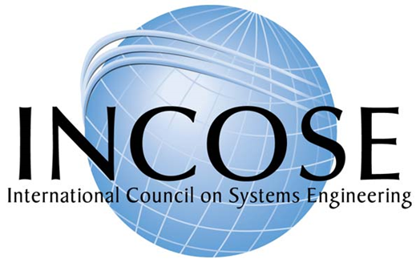

# Системная инженерия в основе сотрудничества

Напомним, что в руководстве по методологии крайне упрощённо обсуждались степени взаимодействия агентов/создателей в организации[^r8-1]:

* **Игнорирование** (ignorance) того, что делают другие агенты, можем даже нанести им вред. При этом иногда заявляют «ничего личного, это бизнес» — и что самое интересное, и заявитель такого верит, что это отличное оправдание, и даже те, кому вредят, вроде как «понимают мотивы». А поскольку игнорируем, то никакого общения, делами других не интересуемся, свои дела никому не показываем.
* **Информирование и общение** (networking): готовы общаться, но не готовы ничего менять в своих планах и действиях. Если кто-то готов подстроиться под нас, то и хорошо. Но сами работаем, как работаем. Скажем, вывешиваем часы своей работы — но не готовы их менять даже когда кому-то очень надо.
* **Координация** (coordinated networking): готовы поменять какие-то свои планы и действия. Например, поглядеть на часы работы соседа и прийти в его рабочие часы. Заполнить форму, какую от меня требуют в той системе, в которой требуют, а не написать заявку в произвольном формате и отослать личным письмом.
* **Кооперация** (cooperation): участвуем в разделении труда и ресурсов, то есть договариваемся о том, как взаимодействуем на входных и выходных интерфейсах, согласовываем всё с соседями. При этом ответственность за то, что всё в целом будет как надо, у участников кооперации отсутствует. Если пиджачок сшит криво, и он ко мне попал на пришивание пуговиц, то я пришью пуговицы крепко, зубами не оторвёшь: к пуговицам точно претензий не будет, а что пиджачок в итоге кривой — не моя забота. Все рабочие процессы работают как часики, инженерный процесс в целом — не факт, что вообще работает.
* **Сотрудничество** (collaboration): делёжка не только трудом и ресурсами, но и ответственностью за общий результат всех участников работы. Но это труднодостигаемо, ибо требует удержания у каждого участника понимания не только его собственных операций, но и их влияния на результаты в целом (по факту — требует системного мышления от участников кооперации, удерживания внимания на довольно длинных цепочках рассуждений о причинах и следствиях).

Сотрудничество не появляется само собой, оно требует, чтобы участники работы имели представление и об общем результате работы (целевой системе, а не только «своей системе», ибо «наша система» какой-то одной инженерной команды — это часто не «общий результат работы»), и об организации работы создателей в их графе — как разделены работы по создателям, как разделён по создателям труд (составляющие инженерного процесса, методы работы). Если мы хотим, чтобы участники проекта сотрудничали, они часть времени должны думать о результате своих работ в целом и организации работ в целом — то есть они должны выполнять роль системного инженера, задействовать системноинженерное мышление.

Системные инженеры-генералисты в отличие от инженеров по более узким инженерным специальностям должны технически направлять инженерные коллективы, так прописано в документах системных инженеров для киберфизических систем (скажем, в systems engineering body of knowledge[^r8-2]). При этом помним, что по факту в документах инженеров киберфизических систем речь идёт о прикладных инженерах по конкретным видам систем, которые заняты целостностью целевой системы и инженерным процессом, а обсуждение чаще идёт не про роль, а про людей на этой роли.

Понятие **технического лидерства** (technical leadership, отличается от **организационного лидерства**, organizational leadership) означает помощь в организации коллективной мыслительной работы по отношению к той или иной технической идее: все участники проекта должны делать одну и ту же систему, а не разные. Отличия **технических лидеров** от «технических евангелистов»:

* технические евангелисты — это проповедники чужих идей на предмет их воплощения в самых разных проектах инженерной компании или даже отрасли,
* технические лидеры — сами себе «технические иисусы христы» в отдельных конкретных проектах, они сами поставщики тех технических решений, в которых потом они должны уметь убедить других людей в их конкретном проекте.

Создатели в роли системных инженеров должны брать на себя ответственность за целостность системы, а не просто думать об этой целостности. Системные инженеры не просто берут идеи от одних инженеров, а потом убеждают других инженеров их принять. Системные инженеры генерируют технические идеи самостоятельно. Как мы уже говорили, среди прикладных инженеров системными инженерами чаще всего называют архитекторов и инженеров внутренней платформы разработки, берущих часто на себя ещё и функции организаторов процесса непрерывной разработки. Поэтому у системных инженеров чаще всего это архитектурные идеи и идеи организации непрерывного выпуска. Системные инженеры встают в отношение менторства по отношению к инженерам-разработчикам. Они принимают решения, разъясняют их инженерам-разработчикам и добиваются их понимания — это менторство. Но затем там отношение надзора, governance (не путать с управлением, management): менеджер поручает работы/works, а надзирающий не может дать такого поручения, но он отслеживает выполнение метода — в том числе соблюдение принятых архитектурных решений и принятых решений по организации инженерного процесса. Техническое лидерство состоит в убедительном менторстве по поводу принимаемых решений, а затем эффективном надзоре за выполнением технических решений. Если прикладным инженерам трудно работать согласно принятым решениям, то их дополнительно менторят. Но если уж совсем не умеют работать, или упёрлись в своём упрямстве и саботируют принятые технические решения — их увольняют без сожаления, хорошо проекту не будет.

В принципе, этот же подход применим и для всех остальных прикладных инженеров, а не только инженеров киберфизических систем или программных инженеров: они кроме сугубо технических составляющих своих ролей ещё и заняты общением с другими инженерами и менеджерами, и вот тут должны проявлять мастерство технического лидерства, мастерство убеждения людей в тех или иных технических решениях, которые они принимают.

Врачи как инженеры уровня существа (а с учётом клинической психологии и уровня личности) тоже должны быть «медицинскими лидерами» во врачебных коллективах с коллегами — особенно в тот момент, когда они заняты пациентом в целом, то есть будут «системным инженером». Каждый врач может быть таким «системным инженером», ибо проходил в вузе специальность «врачебное дело». Скажем, терапевты обычно занимаются медикаментозным лечением внутренних органов — каждый по своей специальности, например, пульмонолог занимается лечением лёгких. Но они вполне могут взять ответственность за деление врачебного труда (например, направить пациента к хирургу, или на ЛФК), обеспечат «врачебное лидерство», направляя общий ход лечения больного, который посещает множество других врачей и получает множество других процедур, и ещё инструктируют самого больного, убеждая его выполнять врачебные рекомендации.

Политики тоже могут заниматься «политикой по всем вопросам», у них тогда в составе их роли составляющая роль «политического лидера» в политических коллективах (партиях), аналогичная составляющей роли «технического лидера» у системного инженера: они занимаются тем, что пропагандируют идеи какой-то общественной культуры (методов поведения в обществе), какие-то «технические решения» по поводу устройства общества.

Организационные лидеры заняты немного другим делом: они помогают людям занять свои роли в организации и катализируют сотрудничество в выполнении методов работы этих ролей, делают организацию (одного из создателей в графе создания) целостной. В какой-то мере организационные лидеры заняты тем же, что и технические лидеры, которые делают целевую систему целостной — но у них главный аспект организационный, а не просто какие-то технические решения. И они тут больше «евангелисты»: идеи самой организации они получают от роли орг-проектировщиков, которые проектируют организацию на основе идей методологов и орг-архитекторов. Технические же лидеры сами по себе вырабатывают уместные в данной ситуации технические идеи (в том числе, например, орг-архитекторы тоже вполне себе технические лидеры по линии инженерии организации).

Лидеры сообществ занимают промежуточное положение между техническими и организационными лидерами: с одной стороны, они чаще всего технические лидеры, ибо в сообществах нельзя сказать, что речь идёт о многочисленных ролях и каком-то «сотрудничестве» по достижению результата. Но если приглядеться, то жизнь сообществ состоит в том числе и из многочисленных мероприятий, активными участниками которых являются лидеры сообществ — и вот в момент вовлечения членов сообщества в дела сообщества, то есть в мероприятия, проводимые с участием членов сообщества, эти лидеры сообществ заняты тем, что помогают членам сообщества занять какие-то организационные роли в проведении мероприятия (в том числе и организации, и «просто участии») и катализируют сотрудничество в рамках этого мероприятия. Как относиться к мероприятию не как к процессу, а как к организации с ограниченным сроком существования, было рассказано в «Системном мышлении».

В давней (это статья 2009 года. Помним, что первый iPhone появился в 2007 году. В инженерии 2009 год — это очень давно! Всё в инженерии происходит быстро, и не только в железной инженерии) статье «Наука и искусство системной инженерии»[^r8-3], отражающей опыт космической системной инженерии NASA, приводится сравнение системного инженера со специально обученным и талантливым дирижёром симфонического оркестра, который творит Симфонию. Системный инженер, как дирижёр, налаживает работу «симфонического оркестра» из многих инженеров-разработчиков, и даже часто не отдельных людей-разработчиков, а целых команд разработчиков. Это одновременно и правда, и неправда. **Правда в том, что системные инженеры—** **это технические лидеры. Неправда в том, что системный инженер—** **это один человек,** **«рулящий»** **огромными коллективами других инженеров.** Это не человек, это роль — а роль может исполняться и одним человеком, причём необязательно full time, но может исполняться и целым коллективом. Всё зависит от масштаба проекта, от принятых в проекте технических и организационных решений, от таланта работников (включая «талант» AI-систем).

Как в инженерии произошло разделение на инженеров по специальности (механиков, электриков, программистов, теплотехников и т.д.), как в западной медицине произошло разделение врачей по разным врачебным специальностям, и врачи редко работают поодиночке, так подобное **углубление**[^r8-4]**разделения труда** уже произошло и в самой классической системной инженерии как прикладной инженерии киберфизических систем, и во многих других видах труда — менеджерском труде (операционный менеджер не всегда архитектор организации, это разные специализации), учительском труде (в начальной школе всему учит один преподаватель, а в средней — уже нет, да и учебники преподаватели не пишут, а ведь подготовка учебников — это тоже часть учительского труда).

Инженеров разной специализации может быть в одном проекте целая команда, которая делится, как мы помним

* и по видам подсистем (у самолётов это могут быть двигателисты, у промышленного холдинга — менеджеры завода. Подсистемы тоже имеют свою целостность и имеют свою природу, они будут требовать «системной инженерии», например, архитектурной проработки и какой-то организации инженерного процесса на основе внутренней платформы разработки),
* и по методам работы (прежде всего это деление на разработчиков, включая занимающихся функциональностью системы в целом, архитекторов, отвечающих за архитектурные характеристики, инженеров внутренней платформы разработки, отвечающих за минимизацию времени ввода в эксплуатацию каждого инкремента системы, который сделали разработчики и инструментализацию непрерывности/эволюционности в инженерии).

Вспомните ситуацию начала времён WWW (это сейчас говорят просто «интернет»), когда появилась и начала бурно развиваться профессия веб-мастера в середине 90х прошлого века. Трудно уже вспомнить, но всего тридцать лет назад был один человек, который занимался для вебсайтов всем: программировал «программный движок» (web framework), разрабатывал арт-дизайн, пришивал его к движку, наполнял вебсайт материалом, продвигал его в Сети и т.д. Один человек, который совмещал в себе всё разнообразие прикладной инженерии для сайтостроения. Сейчас «вебмастера» уже нет, а есть отдельно программисты фронт-энда и бэк-энда, дизайнеры, тимлиды, инженеры внутренней платформы разработки (иногда их ещё по-старинке называют DevOps), редакторы (в вариантах editor и content manager, причём второго уже и редактором не называют, а раньше называли), администраторы, модераторы, специалисты по пользовательским интерфейсам и по пользовательским впечатлениям (раньше их не различали, теперь даже пишут UI/UX), SEO (search engine optimization), уже давно появившиеся спецы по SMM (social media marketing), и это ещё не полный список (вы заметили, что в этом списке не хватает методолога, не хватает архитектора? Они обязательно должны быть, просто часто их роли выполняют какие-то другие инженеры, эта работа делается — но неявно, никем не замечаемая, маркируется обычно как «важные решения опытных разработчиков»). Это всё разные роли, которые мог бы выполнять и один человек, особенно если он пользуется поддержкой AI.

По факту же для всех этих ролей вводятся отдельные должности, на которых работают разные люди — это и есть разделение труда в веб-разработке. Добавка AI в инструментарий ведёт к резким изменениям в разделении труда — но какое в будет (не итоговое, а постоянно меняющееся!) разделение каких новых инженерных ролей по людям и их AI-инструментарию, пока сказать нельзя. В любом случае это не «вот тут был рабочий, его заменил робот» в рамках одного завода, а «вот тут был рабочий одного завода, его заменило две сотни человек другого завода, которые делали робота, плюс на заводе с заменённым рабочим появились наладчики роботов».

Разложение новых методов работы, когда они становятся массовыми, практически неизбежно приводит к тому, что знания/теории/модели составляющих этих методов становятся обширными, требуют добавочного времени для достижения мастерства в их SoTA, и это приводит к раздроблению итогового труда по разным его видам у разных создателей. Для объединения всего разложенного по составляющим и сдвинутого на разных людей труда используются различные кибер-методы обеспечения коллективной собранности, например, чеклисты (сегодня практически повсеместно компьютерные, а не бумажные). Поэтому отличным учебником по разделению труда может выступать книга Atul Gawande «The Checklist Manifesto. How to Get Things Right»[^r8-5], это обязательная литература для изучения инженерами-менеджерами в программе рабочего развития. Мало разделить какой-то вид инженерного процесса по людям, надо потом уметь его собрать в непротиворечивое целое — чеклисты как раз помогают это делать.

**Один человек, даже если он гений, не в состоянии удержать целостность** **в современных сложных проектах: целостность удерживается в современном мире только командно** **и уж точно не людьми, а хорошо налаженными компьютерными моделями, которые точно не забудут ни** **одной детали, ни одной строчки ни одного документа.То же самое относится к информационным системам и** **AI-системам: их потребуется множество, и нужны будут средства интеграции их работы в одно непротиворечивое целое.** **Универсальности не бывает, даже современные** **AI-системы приходится специализировать.**

От играющих самые разные роли и поэтому имеющих самые разные интересы людей, AI-систем и даже больших организаций из людей и AI-систем с их коллективной памятью, поддержанной базами данных, в инженерном проекте требуются две вещи:

* **Согласовывать свои решения. Не договорились—** **не делаем!** Если делаем ракету, то нужно договориться, сколько у неё ступеней — две или три. Если делаем рыбу (марикультура или проект генной инженерии), то нужно договориться, какой она должна вырастать длины. Если делаем общество (политический проект), то нужно договориться, какое именно общество. При этом договариваться нужно не только со своей командой и для ракеты, и для рыбы, и для общества: не забываем о внешних проектных ролях! Нам нужны успешные системы, а не какие-то неуспешные системы, о которых мы договорились в своей инженерной команде. Следствие: хорошо бы разделить проблемы так, чтобы нужно было поменьше согласовывать решения (например, диаметр болтиков на плате и цвет корпуса прибора можно не согласовывать между собой, эти решения могут принимать разные команды разработчиков независимо, но если болтиком занимаются две команды, то их решения придётся между собой согласовывать). Этим занимаются инженеры-архитекторы, архитектурная работа ставит своей непосредственной задачей оптимизацию (прежде всего — минимизацию) зависимостей между модулями. И архитектурная работа тоже в текущем её виде появилась в порядке углубления разделения труда, она нужна, чтобы сделать это разделение труда ещё более глубоким.
* **Дисциплина всё записывать/учитывать: договорились и делаем—** **записать, о чём договорились,** **что делаем, что сделали, чем обосновывали.** **Не записали—** **это не договорились, так что—** **не делаем!** **Памяти не верим, верим записям, нужна не «ментальная собранность», нужна киберсобранность.** Современная инженерия без компьютеров не делается! Внимание людей к деталям проекта и целокупности проекта поддерживается компьютерами! И личная собранность, и организационная/командная/коллективная собранность сегодня держится не на биологической памяти, а на компьютерной памяти! Голыми руками и голым мозгом не работаем, используем инструменты! И даже если речь идёт о выполнении работы компьютерами, то тоже всё записываем — ведём компьютерные журналы, logs[^r8-6]. То, что «все ходы записаны» и легко разобраться в ситуации, за это отвечают инженеры внутренней платформы разработки (управление версионированием и конфигурацией у них).

Есть ли «системный инженер» в сайтостроительстве как отдельная должность? Нет, должности для этой роли не называют, должности чаще всего называют для букета ролей прикладной инженерии и менеджмента. Помним, что «системный инженер» — это когда любой создатель вдруг занимается проектом (деятельностью графа создателей) и его системой как целым, то есть практикует фундаментальный метод мышления по мета-мета-модели из нашего руководства, а ещё это профессионализация прикладного инженера на составляющих метода его работы, нацеленных тоже на целостность системы и её проекта, чаще всего это связывают с архитекторами и инженерами внутренней платформы разработки, которые так и будут называться в инженерии киберфизических систем, но в предприятии это архитекторы предприятия и администрация, в обучении это архитекторы учебных программ и деканат. В любом случае, «системный инженер» в названии должностей проявляется редко.

Но вернёмся к сайтостроительству: есть ли метод работы «системная инженерия» в сайтостроительстве? Безусловно, есть: это и обсуждение веб-сайта как целого (создание концепции использования), и метода создания архитектуры веб-сайта, и метода технического и организационного лидерства как поддержки совместного технического творчества инженеров как в технической части, так и в организации труда этих инженеров, и методов организации и инструментальной поддержки инженерного процесса непрерывной разработки вебсайта, то есть создания внутренней платформы разработки (иногда это по-старинке называют DevOps).

Вспомним ещё раз сравнение по факту несуществующей должности «системный инженер» с должностью дирижёра симфонического оркестра, которое приводилось в статье NASA (и не будем тут даже обсуждать, что NASA представляет тут крайне медленную и неэффективную системную инженерию — что не было видно, пока не появилась быстрая и эффективная системная инженерия в компаниях типа SpaceX или Relativity Space). Это сравнение системного инженера с дирижёром можно прокритиковать и с другой стороны. Метафора симфонического оркестра соответствует административной модели управления, «писанной музыке», и чуть ли не «руководству» как буквально «руками водству». Может возникнуть впечатление, что системный инженер — это человек с должностными полномочиями командовать какими-то «несистемными» инженерами, то есть прикладными инженерами-разработчиками разных специализаций, которые слыхом не слыхали о системных уровнях, архитектуре и непрерывном вводе в эксплуатацию. Вроде как это такой «дирижёр», который прямо диктует музыкантам, когда и какую ноту играть каждому, как это происходит иногда в симфонических оркестрах с авторитарным дирижёром, заботящимся о каждой ноте, чтобы она соответствовала именно его дирижёрскому замыслу, или его пониманию замысла автора. И да, раньше и в инженерии (помните Туполева, Королёва, Мессершмита?), и в политике (вождизм — это как раз от этого, несменяемые цари-диктаторы как раз таковы) так и было. Но ведь ещё в прошлом, XX веке музыка по факту пошла другими путями:

* в симфонической музыке за счёт компьютерной поддержки композитора оказались выкинутыми и дирижёр, и его оркестр, а «симфонические» фонограммы к современным фильмам и играм готовятся самим композитором буквально в одиночку — но на компьютере. Компьютер настолько увеличивает возможности одного человека, у которого есть в голове полный замысел, что других людей можно смело выкинуть из процесса. Музыка оказалась несложной, умещается в одной голове, если ей помогает компьютер. Симфонический оркестр с нотной записью партитуры для каждого музыканта и дирижёром по факту оказался не нужен. В мире также добавились люди, которые умеют делать компьютеры, которые помогают в музыке, труд перераспределился, стал более эффективным. В 21 веке вообще оказывается не нужным человек-профессионал, пользующийся компьютером, ибо музыкальный AI делает сложную музыку «под ключ» по индивидуальным заказам. Музыкальный завод-автомат, включая не только изготовление, но и проектирование, и даже замысел музыкальных треков. Труд опять перераспределился.
* в музыкальной мейнстримной живой культуре сегодня преобладает джаз, подразумевающий совсем другие принципы коллективного творчества: импровизация плюс взаимоподстраивание (рок — это развитие того же джаза, ибо в рок-группах никакого «дирижёра», а вместо «нот» используется звукозапись).
* симфонические оркестры остались как очень дорогое средство антикварного хранения традиции, и от них никакого развития музыки не ожидается. Эпоха великих композиторов и великих дирижёров окончилась. Развитие музыки и музицирования идёт, при этом идёт достаточно бурно, но в совершенно других формах. Например, дети массово заканчивают сегодня не столько музыкальную школу, сколько школу диджеинга — и там игра идёт не отдельными нотами, а более крупными блоками (сэмплами, треками), и на выходе не только «треки», но и отдельные «сеты» (аналоги альбомов звукозаписи или концертных программ в живой музыке). И даже это ещё не конец истории, ибо ещё непонятно влияние AI-музыкантов как на массовое потребление музыки в качестве muzak (фоновое прослушивание в ходе еды или работы), так и массовое потребление заказной музыки (написать песню ко дню рождения друга, написать песню к рекламе).

Эволюция беспощадна даже к самому углублению разделения труда: нельзя считать, что оно однонаправленно, нельзя считать, что разделённый труд продолжает существовать долго, и даже сравнения одних видов труда с другими не выдерживают испытания временем.

Если посмотреть на то, что происходит в инженерии (в том числе и программной, и «железной», и инженерии организации, и врачевании, и социальной инженерии как политике, и любых других видов инженерии), то тренд к «джазовой» организации деятельности несомненен. Все движение agile — это движение именно в эту сторону «джазовости» как импровизационности и согласованию деятельности «на лету», эволюции/развитию как системы, так и создателей системы с их методами работы и тем самым занимаемыми ими ролями.

Эта эволюционность, непрерывное развитие (необязательно при этом всегда «прогресс», помним про динамический ландшафт приспособленности — это может быть легко «развитие в эволюционный тупик») и понимается как «гибкость», непредзаданность последовательности шагов, уменьшение размера планируемой заранее работы по принципу small batch size[^r8-7] и с возможностью небольших изменений для каждой партии/batch, введение в эксплуатацию (delivering) не всей долго разрабатываемой системы с тысячей функций одним шагом (и этот шаг с подписанием акта приёмки-сдачи будет последним шагом проекта), а непрерывно инкрементами, функция за функцией. Как ни странно, такой «постепенный» подход заодно улучшает скоростные характеристики разработки за счёт того, что раньше получается отклик от задействования целевой системы в её окружении и поэтому раньше исправляются ошибки, меньше тратится времени на проработку заведомо неудачных идей.

Все остальные примеры новинок в организационных дисциплинах (например, переход от акцента на централизованном administration/management к shared leadership, предложение «распределённых финансов» на блокчейн-технологиях в обычно централизованной финансовой инженерии) тоже идут именно в эту сторону отсутствия «единоличного лица, принимающего все ответственные решения, потому как имеющего огромные знания по всем методам работы, по которым приходится принимать решения». Вот это «все решения, потому как имею максимальное знание» попросту неверно, никакой эффект «согласования самых разных решений, принятых подчинёнными» эту неверность не убирает, потому как нет в том числе и знаний, которые позволяют согласовать несовместимые решения — просто будет неизвестно, что там ошибка, знаний не хватит всё согласовать. А ещё это крайне медленно, централизованное принятие всех решений.

Ситуация, при которой все главные решения принимаются одним лицом, которое всеми «дирижирует», опасна. «Дирижёр всего» потенциально создаёт угрозу появления в проекте «бутылочного горлышка», существенно замедляющего принятие инженерных решений. Решений много, «дирижёр всего» — один, все решения он не то что скоординировать — он просто познакомиться с ними для утверждения не успеет толком, даже если ему будут предлагать эти решения, да ещё и по три варианта каждого решения! Но главное тут даже не в замедлении работы: одному человеку иметь образование и опыт во всех дисциплинах, в которых принимаются важнейшие решения по проекту невозможно: гений в одних вопросах вполне закономерно может быть полным идиотом в других вопросах. Метафора «великого вождя» в системной инженерии не соответствует духу времени.

Приведём только один из примеров: в одном из машиностроительных холдингов обсуждалось, что инженеры перестали быть инженерами (принимающими решения по изменению физического мира!), а стали «аналитиками» (которые максимум «дают советы», но сами решения не принимают), сохранив за собой должности инженеров. Это проявлялось в том, что инженеры «готовили предложения», которые должны были затем утверждаться их начальниками — а те тоже затем «готовили предложения», которые затем должны были утверждаться их начальниками. Никто не брал на себя ответственность выпустить/release какой-то технический артефакт, принять обязательное к исполнению другими инженерами и менеджерами решение в своей зоне ответственности (да и не было архитектора, который нарезал бы систему и проект на такие зоны ответственности). Поэтому все суточные результаты работы инженеров скапливались к вечеру в почтовом ящике у технического директора — и он вынужден был утверждать не глядя порядка двухсот документов. Изменение корпоративной культуры, когда каждый инженер перестал быть аналитиком, «дающим советы, готовящим предложения наверх», а каждый инженер-начальник перестал быть «утверждающим решения снизу», но каждый занялся своим делом — оно заняло примерно полгода, это потребовало изменения большинства привычек для полутысячи человек холдинга.

Разделение труда — это ещё и разделение ответственности за результат труда, ибо виды труда (методы) распределяются по оргзвеньям, чтобы быть выполненными в работах, и вот оргзвенья при этом становятся ответственны за результаты этих работ. Эти работы или кому-то помогают (и вот этот «взгляд наружу», в глобальные результаты — это и есть взгляд системного инженера), или наоборот, вредят, и даже не могут быть просто «безвредными», ибо тогда они вредят тем, что съедают ресурсы, которые могли бы быть потрачены на полезную работу.

А ещё **каскадирование** (поручение работы в административной иерархии сверху донизу, а затем сбор результатов снизу доверху) — это крайне долго, это дикие задержки во времени. Это будет проходиться подробнее в руководстве по системному менеджменту. Если сотрудник будет принимать решение на своём уровне, согласовывая «по горизонтали», а не «по вертикали» (никто не говорит, что решения не должны согласовываться!), не каскадируя, то работа будет идти существенно быстрее — меньше будут накладные расходы на **координационные акты** (для них существенно время ожидания, например, ожидания, когда технический директор утвердит «не глядя» предложенное техническое решение в порядке «координации работ», или это будет утверждено проходящим раз в месяц «техническим советом» или другим коллегиальным органом, что означает «добавляем месяц к длине проекта» на каждый такой орган) и больше на **продукционные акты** (выполнение самой работы — размышления, согласования характеристик, проведение экспериментов и т.д., это может быть всего несколько часов после нескольких месяцев ожидания).

Разделение труда как многоуровневое разделение всего инженерного процесса на составляющие, выполняемые различными создателями в графе создания полностью соответствует и идеям, о которых говорит John Doyle в его работах по системам управления[^r8-8]: для устойчивого (не срывающегося на ошибки в широком разнообразии режимов) точного и скоростного не в ущерб точности управления нужно иметь множество датчиков, актуаторов, обработчиков информации, которые организованы многоуровнево, системно, и что важно — они должны иметь разные характеристики (прежде всего они должны быть разные по точности и скорости). В структуре управления при этом должно быть множество самых разных сложно устроенных обратных связей и просто устроенных прямых связей. Так, прямые связи простые — команды контроллеров «просто исполняются», а вот информация от датчиков обрабатывается сложно. Крупные быстрые силовые элементы дают скорость, мелкие медленные малосильные — точность, и оптимум скорости-точности будет достигнут только при сочетании достаточного числа вот этих разных масштабов систем, появлении множества мест принятия решений, то есть множества контроллеров для отслеживания множества датчиков и выдачи сигналов управления множеству контроллеров. Быстрое и точное управление обязано быть многоуровневым[^r8-9].

По большому счёту именно такое управление инженерным процессом и происходит в «джазовом»/agile/эволюционирующем проекте, в котором непрерывно меняется как будущее окружение (оно предсказывается, его же ещё нет, системы ещё нет), так и в ответ на эти предсказанные изменения в будущем непрерывно меняется целевая система (которая только-только проектируется и изготавливается, её тоже зачастую ещё нет), так и в ответ на необходимость менять целевую систему меняются создатели в их графе (по мере изменений целевой системы требуется изменять и метод её создания, то есть менять создателей, которые могут исполнить метод, имеют для этого мастерство).

Реализация этих трендов приводит к тому, что **каждый прикладной «по видам систем» инженер (авиатор, генный инженер, учитель) существенную часть времени проводит в роли системного инженера, озабоченного успешностью целевой системы и её проекта в целом, а не только по какой-то одной его прикладной характеристике. Прикладная «по методу» инженерия (электрика, механика, теплопередача) так и вообще сдвигается на** **AI-copilots, которые оказываются всё более и более подготовленными к выполнению роли прикладных инженеров, решению каких-то узких задач.**

Создатели в роли системных инженеров не руководят («руками водят», то есть дают поручения на выполнение работ по развитию системы, начальствуют) прикладными разработчиками, но принимают решения по принципам их работы и структуре развиваемой/evolving разработчиками системы, а также создают условия (в том числе инфраструктуру) для работы всех разработчиков. Это не руководство или управление/management, это:

* разработка какого-то технического решения: высказывание догадки, критика, рациональный выбор наименее плохого решения (ибо лучшего решения заведомо нет, оптимальность принципиально недостижима). Это чаще всего и называют инженерной работой — по роли инженера. Но это только начало инженерной работы над решением!
* принятие решения (по David Deutsch — «принятие всерьёз», то есть решение кладётся в основу для действия, а не просто «принимается к сведению»). Важно, что это самостоятельное, полномочное, инженерное принятие решения, а не как у аналитика «принятие решения по вынесению предложения» для того, чтобы «принятие всерьёз» сделал кто-то другой — начальник, который ничего не понимает в этом решении, не имеет достаточно времени на его рассмотрение и просто «верит аналитику».
* информирование всех о принятом решении (можно дальше долго обсуждать, принудительным уведомлением/push или по добровольной подписке/subscribe — тут это пока неважно, но нельзя принять решение так, чтобы о нём никто не знал), но затем разъяснение и обучение тому, в чём суть этого принятого инженерного решения и почему оно принято именно такое, а не какое-то другое. Тут используют разные слова для метода этой работы, чаще всего «техническое лидерство» (у классических «железных» системных инженеров), а у программных инженеров, следующих методам инженерной эволюционной разработки — «менторинг».
* надзор/governance за тем, чтобы решения реально выполнялись. И если не выполняются, то принятие мер (вплоть до увольнения сотрудников, которые эти решения саботируют).

Команды системных инженеров не столько руководят специализированными на работе в каких-то прикладных инженерных областях (domains) людьми, выполняющими ещё более узкие инженерные методы, сколько организуют их взаимодействие по поводу разделения их труда, выполняя свой кусок инженерной работы в части целевой системы и технологий, используемых в проекте создания (прежде всего технологии непрерывного ввода в эксплуатацию).

Вместо «дирижёрской» поэтому лучше использовать «джазовую» метафору описания деятельности, это подробней будет изучаться в руководстве по системному менеджменту (системный менеджмент понимаем как инженерия организации, чаще всего — инженерия предприятия, но это может быть и инженерия организованного сообщества). Увы, время бежит быстро, поэтому «джазовая метафора» тоже стремительно устаревает — джаз сегодня играют не живые музыкальные ансамбли, а AI. Тем не менее, ещё несколько лет эта метафора должна быть понятна: речь идёт о коллективной импровизации[^r8-10] прежде всего. При этом в музыкальном ансамбле можно выделить руководителя, который выбирает, какую музыкальную тему будут импровизировать музыканты (но он не командует — кому, когда что играть!), музыкантов с какими-то музыкальными инструментами, звукорежиссёра, занимающегося аппаратурой звукозаписи и звукоусиления, вокалиста — у него инструментом будет голос. Но их всех вполне могут назвать не «руководитель», «гитарист», «клавишник», «вокалист», а просто обобщить до «музыкант» — записав в музыканты и звукорежиссёра! Так и импровизирующих в своих ролях прикладных инженеров и эпизодически выполняющих роль системных инженеров тоже вполне могут называть «инженерами» или даже «системными инженерами». В руководстве по системному менеджменту как инженерии организации вы получите дополнительный опыт того, как строить системы из людей и компьютеров с AI так, чтобы в их состав входили все нужные виды инженеров (входили люди и компьютеры с AI, исполняющие все необходимые для создания и развития целевой системы методы, исполняя все нужные инженерные роли, включая роли создателей в их графах).

Разные инженерные роли имеют разные акценты в их образовании. Так создатель как инженер-архитектор знает множество архитектурных паттернов для того вида целевых систем, который развивается в проекте, и он обычно много времени тратит на системноинженерную фундаментальную работу — размышляет о целевой системе и проекте в целом. И ещё он имеет опыт разработки (опыт методолога, опыт проектировщика, опыт технолога изготовления, и т.д.), чтобы не отрываться от реальности и не требовать от команд разработчиков невыполнимого. Инженер внутренней платформы разработки (раньше его называли DevOps) хорошо понимает в операционном менеджменте, ибо его главная задача — уменьшать Lead Time (этих Lead Time есть ещё и много разных вариантов), в общем случае определяемого как время от момента, когда появилась идея очередного инкремента системы (например, реализующего какой-то запрос клиентов на новую фичу) до момента, когда потребители смогут воспользоваться этим инкрементом в составе эксплуатируемой системы. Ввод в эксплуатацию результатов работы должен происходить быстро, но без роста числа дефектов эксплуатирующейся системы (да, это умение выполнять модернизацию двигателя автомобиля не выключая двигатель, и даже не прекращая движения! И тут только доля шутки).

По большому счёту, такие акценты в образовании, какие нужны архитекторам и инженерам внутренней платформы разработки, девопсам (впрочем, и разработчикам тоже, им же нужно изобретать в рамках их рабочих обязанностей!), сегодня по факту есть уже в образовании каждого инженера, ибо рано или поздно в своей жизни каждый человек или AI столкнётся с необходимостью быть системным инженером, то есть с необходимостью отвечать за всю систему в целом (даже если это маленькая подсистема в составе какой-то большой системы). Помним, что если ты не понимаешь, как результаты твоего труда отражаются на системе в целом, не представляешь системы в целом, проекта в целом — то ты не можешь сотрудничать, ты не можешь определить, улучшаешь или ухудшаешь ты своей работой систему, разваливаешь или наоборот, продвигаешь проект в целом.

Инженеры во всех ролях должны выходить в фундаментальное мышление, чтобы переводить проблемы в самых разных предметных областях (которые непонятно, как решать) в последовательность задач (которые понятно как решать) в ходе многоуровневой оптимизации неизбежных конфликтов между системными уровнями в разрабатываемой системе. Инженерия ведь подразумевает и функциональный, и модульный синтез, которые вовсе неочевидно как сделать, ибо учитывать приходится минимально четыре разных описания системы (функциональное, конструктивное, размещение, стоимостное), да ещё и на многих системных уровнях, да ещё и для каждого создателя в их графе. В настоящем руководстве будет дано представление о таких методах разработки как методах системного творчества. И это надо делать инженерам не разово, а много раз в проекте — без ухудшения одной из важнейших архитектурных характеристик системы, evolvability, способности системы без полной переделки развиваться/эволюционировать в ходе непрерывной её разработки.

В любом случае, «инженер» и «системный инженер» (как особо беспокоящийся о целостности целевой системы, собираемой из многих уровней подсистем, а также её развиваемости/evolvability, беспокоящийся о сотрудничестве создателей в их графе) будет использоваться в руководстве как название роли (тип мета-мета-модели, объект из нашего руководства, а не классифицированный этим типом объект из жизни, у которого будет совсем другое название), но нужно учитывать, что в жизни в разных предметных областях (культурная, «из учебника» метаУ-модель, отражающая domain и ситуационная метаС-модель, отражающая принятый способ работы в конкретном проекте) вы будете слышать самые разные другие имена и ролей и тем более должностей. Вы должны будете догадаться, что речь идёт об инженерии, в том числе системной инженерии (вообще-то **всегда** идёт речь о системной инженерии! Прикладные инженерии по типам систем лишь её конкретизации для систем разной природы, а прикладные инженерии по составляющим метода — конкретизации каких-то составляющих разложения метода системной инженерии), и тогда вам в самых разных проектах пригодится мышление по наставлениям нашего руководства.

При этом вам может встретиться отнюдь не SoTA версия инженерии, то есть инженерия в вашем проекте может оказаться не системной, не безмасштабной, не эволюционной/непрерывной — и ещё люди будут гордиться, что они заняты «искусством», проявляют находчивость и изобретают велосипеды, а лучшие из них будут считать себя «ремесленниками», а не инженерами. Десяток лет в программной инженерии такое отношение к методам собственной работы было даже модно, «инженерия как кустарное ремесло, craft» сейчас об этом предпочитают не вспоминать.

В мире существует несколько профессиональных организаций системных инженеров киберфизических систем (прикладных инженеров киберфизических систем, которые акцентированы в своей работе на удержании целого, строят её на базе системного мышления), из них наиболее значительной является международный совет по системной инженерии (INCOSE, International Counsil of Systems Engineering, <http://incose.org>).

В этой организации есть индивидуальное членство ($50-$160 в год) и корпоративное членство ($4750-7250 в год), в 2023 году более 22 тысяч индивидуальных членов во всех стран мира[^r8-11] и 134 коллективных члена.

Цели INCOSE — распространять знания по системной инженерии, обеспечивать международное сотрудничество и обмен опытом системных инженеров, устанавливать стандарты профессионального мастерства и проводить сертификацию системных инженеров на соответствие этим стандартам, обеспечивать поддержку корпоративных и правительственных образовательных программ в области системной инженерии. Но у этой организации есть существенные проблемы:

* Исторически там собрались системные инженеры киберфизических систем, и значительная часть их занимается государственными инфраструктурными и военными проектами. Это означает, что меньше всего там используются принципы lean, ведущие к минимальному дублированию работ (госбюджет заплатит! Это не рынок!) и agile (государство строго планово! Никакого «планирования на лету» и тем более «неудачных экспериментов»!). По факту варианты системной инженерии, поддерживаемые этой организацией, базируются на идеях «водопада» и не учитывают идей непрерывной инженерии (в общих словах — признают и учитывают, но при рассмотрении сути методов в публикуемых учебниках, документах, стандартах — нет). Ровно по этой причине частная компания SpaceX смогла за несколько лет сделать в космических проектах больше, чем все традиционные контракторы NASA (достаточно сравнить проект Starship с проектом SLS по скорости разработки и новациям). И таких «частных компаний» в организации явно недостаточное представительство, больше представителей компаний с крупными военными проектами. SpaceX активна в INCOSE была где-то в 2007 году, но не сейчас.
* INCOSE признаёт, что системная инженерия безмасштабна и используется для всех системных уровней (это ясно видно по INCOSE Vision 2035[^r8-12]). Но исторически всё равно центрируется на системно-эволюционном уровне киберфизических систем как основных для членов этой организации.
* Также INCOSE признаёт, что «инженеры систем» и прикладные инженеры по отдельным прикладным инженерным практикам (электрики, теплотехники, метрологи) по факту тоже используют системное мышление, и произошло проникновение системной инженерии во все «другие инженерии». Но всё равно организация поддерживает главным образом инженеров-генералистов для киберфизических систем (робототехников, автостроителей, авиастроителей, ракетостроителей).

Повторим, что совсем необязательно называться системным инженером, чтобы им быть. Так, архитекторы софта (software architects) вполне себе системные инженеры, специализирующиеся на программных системах. Архитекторы предприятий — системные инженеры, специализирующиеся на организационных системах. Дело совсем не в названии должности или метода, не в членстве в ассоциации, дело в содержании: в реально выполняемых методах работы.

Мы тут опять использовали термин «системная инженерия» в двух разных значениях, так он используется и в жизни:

* Любая инженерия с использованием в мышлении системного подхода, ибо без системного подхода, учёта самых разных систем в окружении и графе создателей, учёта эволюции и непрерывной подстройки под изменения нельзя менять мир. Как бы ни назывался метод, он оказывается инженерным, тем самым системноинженерным. Любой инженер — это системный инженер. Это соответствует определению «**системная инженерия—** **это** **инженерный метод, задействующий системное мышление»**.
* Те методы системной инженерии, которыми занимались люди, считавшиеся системными инженерами в инженерии киберфизических систем: на сегодня это главным образом архитекторы и инженеры внутренней платформы разработки (ранее DevOps), но сейчас сюда попадают и методологи (люди, занимающиеся эволюцией методов и предлагающие функциональный синтез, «принципиальную схему» системы). Эти люди получают специальное обучение по своим составляющим методам инженерного процесса. Это соответствует определению «**системная инженерия—** **это** **методподдержания целостности системы, в отличие от прикладных инженеров-разработчиков, системный инженер занимается системой в целом, а не какими-то частями системы или прикладными особенностями системы**».

Какое значение правильное? В жизни используются оба, в нашем руководстве тоже так.

[^r8-1]: По мотивам <https://www.researchgate.net/publication/200026050_Collaborative_Networks_Reference_Modeling>

[^r8-2]: <https://sebokwiki.org/wiki/Technical_Leadership_in_Systems_Engineering>

[^r8-3]: <http://www.worldscinet.com/srf/03/0302/free-access/S1793966609000080.pdf>

[^r8-4]: Обычно deep, «глубина» в речи означает рост числа уровней какой-то иерархии. Скажем deep learning — это многоуровневое обучение, то есть обучение нейронных сетей с числом скрытых уровней/слоёв больше одного. В углублении разделения труда речь идёт об увеличении числа уровней иерархии по *отношению специализации* (род-вид) между методами.

[^r8-5]: <https://en.wikipedia.org/wiki/The_Checklist_Manifesto>

[^r8-6]: <https://en.wikipedia.org/wiki/Logging_(computing)>

[^r8-7]: См. доклад Влада Свяжина рассуждениями об этой идее, с 1:04:11, <https://www.youtube.com/watch?v=lpgpnCoV14w&t=3851s>

[^r8-8]: <https://ailev.livejournal.com/1622346.html>

[^r8-9]: <https://arxiv.org/abs/2401.15185>

[^r8-10]: Подходы к определению импровизации см. в <https://ailev.livejournal.com/1730660.html>

[^r8-11]: <https://www.incose.org/about-incose/incose-annual-impact-statement>

[^r8-12]: <https://www.incose.org/about-systems-engineering/se-vision-2035>
