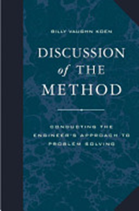
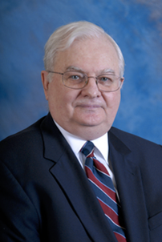

# Ненаучность инженерии. Эвристики

Знания самой инженерии (как надо что-то *делать/практиковать* создателю целевой системы) и знания об инженерных системах разного вида (установках, сооружениях, транспортных средствах, компьютерах и т.д. для традиционной инженерии киберфизических систем, но и существах, личностях, организациях, сообществах, обществах и даже человечестве — как добиться у них каких-то определённых характеристик) могут быть как научными, так и ненаучными, то есть опираться или на хорошие, или на плохие объяснения[^r8-1].

Инженерия рождается и живёт методом проб и ошибок, её знания, передающиеся из проекта в проект про неё саму (как что-то сделать) и про её инженерные объекты вовсе необязательно «научны». Так что разные определения инженерии на основе единственно «принесения в работу инженера научных знаний» просто неверны, хотя наука (лучшие имеющиеся на сегодняшний день объяснения закономерностей природы) обязательно используется в инженерии там, где она доступна. Но где хороших объяснительных теорий/«научных знаний» нет, они не используются, при этом совершенно необязательно инженерный проект останавливается.

Эволюция работает независимо от того, разработана ли теория эволюции. Концептуальные (какие функции какими физическими объектами воплощаются) и архитектурные (какие принципы объединения физических объектов в модули и способы взаимодействия модулей) идеи воплощаются в создаваемых системах непосредственно, но эти системы сами по себе не вносят изменений в конструкцию и выбранный тип её модульности следующих систем. Это делают создатели, чаще всего изменяя конструкции систем непрерывными пробами (мутации, желательно smart, и их должно быть много — эволюционное разнообразие) и ошибками (эволюционный отбор), простым запоминанием и повторением «того, что работает» (наследование в эволюции) — часто даже без поиска объяснений. И это неостановимый процесс, ибо что было SoTA сегодня, перестаёт быть SoTA завтра, учитываем динамичность ландшафта приспособленности. Жизнь меняется, следовательно — SoTA меняется.

Речь идёт не только об инженерии киберфизических систем и традиционно понимаемой «инженерии», речь идёт обо всех видах инженерии, включая личное развитие, менеджмент, политику и экономику как социальную инженерию, и даже искусство, в котором тоже можно отследить какие-то «течения» и «движения», изучаемые искусствоведами. <strong>Опора на объяснения (хорошие или плохие, то есть использование порождающих моделей/generativemodels) может в инженерии как быть, так и отсутствовать</strong> <strong>(то есть использование чисто эволюционных/мутационных/случайных идей).</strong>

В книге Discussion of the Method[^r8-2] (2003) исследователь классической инженерии Billy Koen приводил пример: если бы в средние века к инженеру пришли с просьбой построить мост через небольшую (или даже большую) речку, а он бы отказался на основании того, что сопромат изобретут только через 200 лет — что можно сказать о таком инженере? Или если бы современный инженер при просьбе построить ракету, летящую на Луну или Марс, отказался бы от проекта на основании того, что достаточно подробной «теории Луны» или «теории Марса» ещё не создано? Или при необходимости создать робота инженер вдруг говорит, что «теории о том, что делать, чтобы создавать робота пока нет — поэтому я не знаю, что в каком порядке делать, поэтому подождём до тех пор, пока у учёных не появится соответствующего раздела в их объяснениях из инженерной теории». Или в ещё будущих США вдруг их отцы-основатели говорят, что «непонятно ещё, как делать процветающее общество, не будем писать Конституцию и учреждать новое государство, потому как ещё политологи не создали теории, которая позволяет это сделать надёжно, понятно и просто». Отказы на таких основаниях не свойственны инженерам, их не останавливает отсутствие научного формального знания в том, чем они занимаются.

Инженерия кроме научных/объяснительных теорий активно использует эвристики (heuristics) — это догадки о замеченных удачных паттернах/закономерностях/шаблонах, которые вовсе необязательно «научны» в традиционном смысле этого слова. Это просто замечания, что «что-то работает». В принципе, эвристики вполне можно считать и суевериями — они возникают так же. Вы заметили, что все те три раза, когда вам в голову пришла хорошая мысль, вы были в голубой одежде — всё, нейросеть в вашем мозгу отлично распознаёт повторения, паттерны! Дальше критика выключается, проверки экспериментом выключаются — и эта идея принимается всерьёз! Такая эвристика/суеверие — это не «фальсифицируемая теория» по Попперу и тем более с поправками Дойча про объяснения и замечаниями, что это должна быть «объяснительная теория, сформулированная контрфактуально», и поправками Фристона, что это должна быть «порождающая/generative модель/теория, позволяющая предсказать будущую ситуацию»: инженер с самого начала знает, что эвристики вполне могут быть в его случае ошибочны и неприменимы, оказаться суеверием. Плюс обратите внимание, что инженерные эвристики определяются отличным образом от философской «эвристики», найдите соответствующую литературу сами. Вот примеры инженерных эвристик из справочника по инженерии химического производства[^r8-3], :

* Используй вертикальный резервуар на опорах, когда его объем меньше 3.8м3
* Используй горизонтальный резервуар на бетонных опорах, когда его объем между 3.8 и 38м3
* Используй вертикальный резервуар на бетонных опорах, когда его объем больше 38м3

На эту тему есть хороший анекдот:

Физику, математику и инженеру дали задание найти объём красного резинового мячика.

Физик погрузил мяч в стакан с водой и измерил объём вытесненной жидкости.

Математик измерил диаметр мяча и рассчитал тройной интеграл.

Инженер достал из стола свою «Таблицу объёмов красных резиновых мячей» и нашёл нужное значение.

Есть и другие типы инженерных эвристик, совсем не связанных с инженерными расчётами и приёмами конструирования-проектирования киберфизических систем, но связанных с приёмами менеджмента как конструирования-проектирования организационных систем (проектов как проектных команд). Отличить «работающие» (удачные догадки, отражающие какие-то закономерности) и «суеверия» (не работающие, но соблюдающиеся) тут почти невозможно, организовать эксперимент, надёжно выделяющий связанные с эвристикой ситуации, вряд ли получится:

* Внешних проектных ролей (и их исполнителей) всегда на единицу больше, чем вы знаете; известные вам внешние проектные роли всегда имеют потребность (need) на одну больше, чем вам известно (это шестая из основных инженерных эвристик Tom Gilb[^r8-4]).
* Порядок бьёт класс, классный порядок бьёт всех (в больших проектах упорядоченная работа команды заурядных специалистов бьёт беспорядочную работу высококлассных звёзд, а упорядоченная работа высококлассных звёзд бьёт всех. Эта эвристика пришла из футбола, отражает разнообразие стилей игры разных команд и успешность этих стилей).

Демократия как замена силовой смены власти диктатора-на-всю-жизнь выборами диктатора-на-короткий-срок — это тоже инженерная эвристика/суеверие, для организации уровня общества через устройство властных команд в этом обществе (то есть эвристика, связывающая конструктивы разных системных уровней: от личности через организацию/правительство и сообщество/партию до общества). Заметим, что «демократия» — это инженерная идея, а не научный объяснительный концепт, объясняющий устройство общественной жизни. Демократия сама по себе и не порождающая теория, по ней нельзя предсказать то, что будет при ней происходить. В поддержку или против демократии может быть положено множество разных объяснительных теорий социологии, политологии, экономики (с порождающими теориями в этих дисциплинах сложней, но не будем на это отвлекаться). Скажем, David Deutsch считал, что демократия — это просто надёжный бескровный способ исправить ошибку, если избранная власть ведёт себя не так, как ожидалось (то есть демократия — это реализация эволюционного алгоритма: есть у общества догадки о том, кто мог бы быть подходящим правителем, и если догадка не оправдалась, то на следующем такте правителя меняем на другого, другую догадку).

Несмотря на то, что наука в инженерии не обязательна, эвристики в более простых системах по возможности заменяются научными объяснительными SoTA теориями, в том числе в виде компьютерных моделей (разница: правильно применённая теория даёт надёжный ответ, а эвристика, возможно, врёт при малейшем изменении условий её применения), тем самым место для метода проб и ошибок смещается в сторону систем, которые плохо описываются наличными научными теориями. Это могут быть и системы уровня вещества (например, трёхмерная структура белков плохо описывается теорией, но совсем недавно нейронная сеть AlphaFold[^r8-5] реализовала эвристики, которые позволяют неплохо предсказать эту структуру — и это именно эвристики, а не объяснительная теория).

Важно при этом понимать, что переход от эвристик к нормальной науке важен для того, чтобы получать 100% надёжный результат. Когда заметили, что цитрусовые избавляют от цинги, эти цитрусовые стали брать в дальние плавания наряду с сушёным мясом. Но в этот момент это была эвристика, объяснений не было. Поэтому в какой-то момент один из капитанов взял в плавание запас цитрусовых не того сорта: с малым содержанием витамина C. И все заболели цингой — и вера в эвристику «цитрусовые спасают от цинги» исчезла. А потом открыли витамин C, его влияние на предотвращение цинги — и разобрались, почему одним морякам цитрусовые (одних сортов! С большим содержанием витамина С!) помогали от цинги, а другим морякам цитрусовые (других сортов! С малым содержанием витамина С!) не помогали. Большинство эвристик нуждаются вот в такого сорта объяснениях — но инженеры (с переменным успехом) могут использовать их в работе и до получения объяснений.

Формальные (строго следующие законам логики) объяснительные теории дают описания инженерных систем, которые позволяют: находить ошибки без создания системы, а часто и вычислять необходимые или оптимальные характеристики системы (это называется часто «формальный анализ»). Очень дорогой эволюционный метод проб и ошибок с его бесконечным циклом догадок и экспериментов при помощи формальных описаний из объяснительных теорий превращается в совсем другой метод работы, число проб становится в разы и разы меньше: вычислять много проще, чем изготавливать системы и смотреть, будут ли они удовлетворять потребности. Источником же полезных формализмов (методов объяснения, то есть описания причин и следствий в самых разных явлениях) является как раз наука/исследования.

В целом объём научных знаний растёт, число найденных удачных эвристик тоже растёт, поэтому со временем растёт и уровень инженерии: успешность систем, которая тестируется как успешность на многих системных уровнях (то есть гарантия того, что какие-то системы, создаваемые на нижних уровнях системной эволюционной сложности, например, киберфизические системы, не ухудшат системы более высоких уровней).

В связи с этим любые достижения в инженерии по предложению Billy Koen нужно оценивать не по абсолютной шкале, а на конкретный момент времени, в соответствии с накопленным на этот момент объёмом научного и эвристического инженерного знания — и это «текущее состояние инженерии» Billy Koen предложил называть SoTA (state-of-the-art). Инженерный проект плох, ежели он не использует научное и эвристическое знание, накопленное на конкретный момент времени (он может быть успешен, но плох!). Не отвечающий SoTA инженерии проект плох (скажем, если в каком-то обществе смена правления идёт через силовой захват власти, а не выборы, то с инженерией этого общества непорядок, это не SoTA. Смена власти на сегодня вполне обеспечивается несиловыми способами, если применена современная системная инженерия уровня общества). Со временем объем знаний растёт, и инженерные проекты становятся более и более сложными, достигая невозможных для предыдущего времени характеристик. Так, сегодня вполне возможен полёт вертолёта на Марсе: инженерия киберфизических систем такого уровня вполне реальна[^r8-6]. Инженерия искусственных бактерий тоже вполне реальна[^r8-7].

Последние годы показывают, что эвристики не совсем уж неформальны: они часто отражают паттерны/закономерности, которые даны не в локальном/символьном/формальном представлении, но в распределённом представлении нейронной сети — человеческой («мокрая нейронная сеть») или компьютерной. Это относительно новое направление исследований: вместо формализации иметь описания в виде обученной нейронной сети. Подробней на эту тему говорится в руководстве по интеллект-стеку. Тут же надо заметить, что обученные нейронные сети вполне применяются в инженерии, но их результаты работы имеют тот же статус «эвристик»: иногда они удачны, иногда ведут к ошибкам.

Существует мнение (его в своих книгах пропагандирует Nassim Taleb, например, в книге «Антихрупкость»[^r8-8]), что наука/исследования для практической деятельности бесполезна, настоящие новации полностью ненаучны. По этому мнению инженеры-практики добиваются успеха не на основе научных знаний, а исключительно на основе «возни» (tinkering, ср. «He is tinkering with a car» — «он возится с автомобилем»). Taleb сравнивает учёных/исследователей с теми, кто приходит к птицам и пытается научить их летать, давая знания по аэродинамике. Типичное высказывание в его книге на эту тему: «Никто не опасается, что ребёнок, понятия не имеющий о разных теоремах из области аэродинамики и не способный решить уравнение движения, не сможет ездить на велосипеде». Талеб защищает метод проб и ошибок, защищает эвристики. Он абсолютно прав. И он прав, когда пишет о создании реактивных двигателей: сначала было много проб и ошибок, потом только появилась стабильно работающая теория, а не наоборот. Проблемы с ракетами: сначала таки появилась физика, потом понимание, что физическое тело может при достижении некоторой скорости вращаться вокруг Земли — и только после этого реактивные двигатели позволили создать ракету, которая вывела на орбиту первый спутник Земли. И ещё с атомной бомбой та же история — получить атомный взрыв простой вознёй с ураном не получится, надо таки знать, с чем перспективно возиться, а с чем — нет, и сколько минимально урана надо, чтобы произошёл атомный взрыв. Талеб говорит правду, но не всю правду.

Результаты исследований — теории, алгоритмы, научные дисциплины, знания — дают нам новые методы мышления, способы рассуждать о проблемах по-новому: быстрее, надёжнее, точнее. Мы можем использовать сформулированное в форме порождающих объяснительных теорий знание о причинах и следствиях, дающее возможность ещё и «вообразить» какой-то мир, отвечающий объяснениям теории, и просто не воплощать в жизни какие-то идеи изменений мира, если заранее известно, что они не приведут к изменениям в мире к лучшему. Думаем мы и без объяснительных теорий, и без помогающих работать с моделями этих теорий компьютеров. Но таким древним «без этих ваших академий» способом мы думаем спонтанно, медленно и не слишком надёжно. По факту мы в ходе наших размышлений всё-таки пытаемся создать эти объяснительные теории на уровне кулибинства: делаем догадки, критикуем их, пробуем опровергнуть экспериментом.

Метод проб и ошибок всем хорош и в мышлении, и в инженерии, но это «эволюция вручную» — очень дорого и чрезвычайно долго. Если есть способ что-то физическое коротко описать в части самого важного (модель! Она учитывает только важное, а неважное игнорирует!), а потом работать с этим описанием-моделью, а не с самим физическим объектом, то так и нужно делать. <strong>Если вы учите ребёнка ездить на велосипеде, то вам особой науки</strong> <strong>(SoTA</strong> <strong>объяснительной теории)</strong> <strong>не нужно. А если вы учите компьютер быть автопилотом на реактивном самолёте, то незамутнённым</strong> <strong>объяснительной</strong> <strong>теориейи компьютерным моделированием</strong> <strong>методом проб и ошибок вы загубите слишком много реактивных самолётов.</strong> <strong>Нужно губить виртуальные самолёты, для этого иметь модель самолёта, то есть знания, алгоритм, описание самолёта. И когда виртуальный самолёт покажет, что он летает—</strong> <strong>можно строить реальный самолёт.</strong>

Первые реактивные, да и не только реактивные самолёты, да и не только самолёты так и создавались — из расчётов делалось то, что могло делаться, остальное — результат инженерной интуиции, основанной не на формальных длинных цепочках рассуждений, а на работе нейронной сетки, находящей паттерны «без объяснений».

Как сказал когда-то автору этого руководства один из разработчиков турбокомпрессоров: «делаешь четыре турбокомпрессора. Четвёртый — работает». А теперь не только турбокомпрессор, но и первый изготовленный «в алюминии» самолёт сразу летает, и не может такого быть, чтобы не летал: просто выросло число доступных объяснений, которые можно увязать в длинные объяснительные цепочки! И личности более-менее получаются, и организации по большей части тоже работают, а вот с сообществами, обществами и человечеством в целом всё в этом плане похуже получается, ибо надёжных объяснительных теорий (которые чаще всего опираются на математику и математическую логику) тут сильно меньше, и они менее универсальные. Это не случайно: если у вас будет объяснительная теория того, как я думаю, и вы попытаетесь использовать её, чтобы мной поуправлять, я немедленно исправлю своё образ мыслей, и, соответственно, действий — ровно для того, чтобы вам не удалось мной проуправлять. Вот и не работают теории, кроме каких-то простейших случаев нейрофизиологических рефлексов (и то — до момента, когда я не соображу, что эксплуатируются мои рефлексы, я и рефлексы отрегулирую).

Ещё один аргумент в пользу использования объяснительных теорий в инженерии появляется, когда вы замечаете, что в книжках Талеба ничего не говорится о коллективной работе. Рассуждения Талеба хорошо работают, когда речь идёт о рынке, где никто друг друга не знает, почти ничего не известно о товаре и ситуации его использования, но происходят крупные одиночные сделки между незнакомыми людьми (сам Талеб как раз профессионализировался на торговле ценными бумагами, он был трейдером на фондовом рынке). Если мы хотим хорошее инженерное мышление передать другим инженерам, но не понимаем, из чего это мышление состоит, что передавать, то есть у нас нет инженерной науки/engineering science, нет методологической проработки инженерии (например, нет руководства по системной инженерии типа того, который вы сейчас проходите), то всё сведётся к малопродуктивной охоте и собирательству относительно талантливых «стихийных инженеров». <strong>Охота и собирательство талантливых людей хороши, но переход к</strong> <strong>«осёдлому земледелию», то есть обучение инженеров хорошим объяснительным теориям того, что они должны делать,</strong> <strong>даёт скачок в производительности труда—</strong> <strong>выращивать талантыоказывается много</strong> <strong>дешевле, чем их выискивать</strong> <strong>и затем пытаться перекупить (обычно к тому времени, как становится понятным, что это талант, он уже достаточно дорого стоит).</strong>

Так что сначала нам нужна какая-то инженерная наука/исследования/объяснительная теория, чтобы знания по инженерии (как именно надо вести инженерный проект, чтобы он на выходе дал успешную систему) компактно описать — и уже после этого мы их можем передать в ходе обучения (наше руководство как раз и передаёт такие знания SoTA инженерной науки). Не надо обольщаться, что это «всем известные знания». Тем более, что все эти знания эволюционируют. Например, наличие «всех согласованных требований по проекту» в инженерии не считалось необходимым ещё в начале прошлого века, ближе к концу века сбор и согласование всех требований (даже метод для этого был — «инженерия требований») стали обязательными, это была SoTA системной инженерии. Теперь наличие требований уже не считается SoTA — и в нашем руководстве для этого аж два подраздела: в первом говорится, что «требований уже нет», а во втором — «если вы не поняли сразу, что требования уже не SoTA, мы это повторим». И процесс явно не закончен: если вначале готовились сценарии использования, из которых формулировали требования, потом из сценариев использования формулировали тест-кейсы, то теперь говорят уже о том, что эти наборы тест-кейсов и есть формат, в котором описываются гипотезы (не требования!) по надлежащему поведению системы в разных ситуациях, при наступлении разных событий. Инженерное знание эволюционирует, инженерная наука выдвигает новые и новые догадки/гипотезы о том, как может быть (а в случае нормативной науки — как должен быть) устроен инженерный процесс, какова инженерная культура.

Инженерная работа обычно не делается людьми-одиночками, исполняющими все-все-все инженерные роли, при этом исполняющими «по зову сердца», а не по какой-то «науке», какому-то заданному культурой методу (читай: методу, который используют люди в сообществе инженеров, а не кулибины-одиночки).

В инженерии нужна координация усилий сотен, тысяч и даже десятков тысяч людей, работающих как с целевыми системами в их окружении на самых разных уровнях, так и с организационными системами в графах создателей этих систем. Все эти люди с их самыми разными проектными/деятельностными/трудовыми ролями должны как-то договариваться между собой. Как они могут договориться, если каждый про свою часть дела может рассказать примерно столько же, сколько едущий на велосипеде мальчик про свою езду?

В инженерии можно, конечно, говорить на уровне формальности «я чувствую, что я держу равновесие и я чувствую, что на большой скорости надо бы пригнуться», но обычно всё-таки требуются более формальные описания, более точные, по которым можно точнее воспроизвести описываемые явления. Компактные и универсальные объяснительные теории нужны в инженерии, чтобы люди могли иметь одинаковое описание того, что они делают, чтобы они договорились между собой. Все участники инженерного проекта, если они описывают один и тот же объект, будут использовать одно и то же SoTA компактное описание важных объектов в инженерном проекте, и эти важные объекты описываются задействованными объяснительными теориями. А поскольку теории хорошо прокритикованы (это же SoTA теории, которые выдержали критику логикой и экспериментами), то огромная вероятность того, что описание сработает и даст ожидаемый результат. Так, было очевидно, что если хорошо подумать о системе «на верхнем уровне», то результат проекта будет лучше. Поэтому самые опытные разработчики занимались «системной архитектурой» как важнейшими принципами, на которых организована система, что бы это ни было. Развитие инженерной науки показало, что у этих «опытных разработчиков» было две самых больших экспертизы — функциональный синтез (а не функциональная декомпозиция!) и модульная декомпозиция (хотя говорилось как раз о модульном синтезе!). А с приходом эволюционной архитектуры стало понятно, что изменение функций плохо реализуется в ситуациях, когда проделана плохая модульная декомпозиция, модули слишком сильно зависят друг от друга. Это привело к углублению разделения труда: сначала роль «архитектора как опытного разработчика» была уточнена как новая роль архитектора, который занимается не функциональностью и расчётами принципиальных схем верхнего уровня, но архитектора, который занят оптимизацией межмодульных зависимостей и нарезки/разбиения на модули такого, при котором сохраняются важнейшие характеристики работы системы в целом (прежде всего — evolvability/развиваемость), а потом выделилась и новая роль — методолога, который занимается главным образом функциональными описаниями системы, абстрагированными от разбиения системы на модули. SoTA инженерного процесса (какими делами/«методами работы над какими предметами методов» надо заниматься в инженерных проектах каким инженерным ролям) поменялась, а нормативный характер системной инженерии говорит, что «надо» трактуется как обязательность к применению. Если у вас архитектура в проекте что-то другое, то ваш проект идёт не как «надо», это не SoTA, это менее оптимально. Ну, или вы работаете на фронтире, проверяете новую догадку, работаете над умной мутацией инженерного процесса. Предметом «инженерной науки» ведь является инженерный процесс, он же процесс разработки — все методы работы, которые задействуются в ходе создания и развития успешных систем. Это обсуждалось в руководстве по методологии, но там не говорилось, какой именно инженерный процесс и какие роли его исполнителей являются на сегодня SoTA.

Излагаемый в нашем руководстве по системной инженерии общекультурный (на базе SoTA в самых разных инженериях — прежде всего программной инженерии, классической системной инженерии, инженерии предприятия и т.д.) метод безмасштабной эволюционной системной инженерии (или просто «инженерии», безо всех этих эпитетов, ибо другая инженерия — это уже не SoTA) совершенно необязателен для инженеров-одиночек, для которых инженерия — это хобби.

Среди одиночек всегда найдётся Кулибин или Левша (вот пример описаний такой работы, он так и называется, «Кулибинство»[^r8-9]). Но вот если речь пойдёт о какой-то более-менее масштабной коллективной инженерной деятельности, то синхронизация способов обсуждения инженерного проекта может сэкономить много-много времени — все ведь помнят проблему, возникшую при строительстве Вавилонской башни? Мы как инженеры должны научиться описывать другим людям, что мы делаем и почему, чтобы другие люди могли присоединиться к нашему проекту и, сотрудничая, занять свою роль.

Конечно, если вы умеете *что-то* описывать и в инженерии киберфизических систем, и в синтетической биологии как инженерии живых систем, и в менеджменте как инженерии организационных систем, и в социальной инженерии, и в любой другой инженерии — это вовсе не означает то, что вы опишете ценное и важное для проекта, а не просто «что-то».

Инженер может плохо работать с описаниями. И даже неинженер может плохо работать с описаниями! Если взять художественную литературу как описание вымышленных миров (неинженерная деятельность, если автор не ставит задачей как-то изменить личность читателя): графоманам никогда не получить Букеровскую премию, хотя они умеют писать, и иногда даже «красиво писать», то есть писать беллетристику, то есть умеют записывать свои идеи по поводу мира на материальном носителе в форме, доступной для прочтения другими людьми. В целом «умения читать-писать» и как-то (а не профессионально) излагать какие-то (а не предписываемые профессией) мысли для инженерии недостаточно. Это относится и к людям, и к AI — интеллект у них может быть очень разный, но болтливый и красноречивый создатель, не придерживающийся достижений инженерной науки, не знающий методов системной инженерии и предлагаемого этими методами разделения труда, может быть крайне неэффективным, а часто и вредным: будет забирать время, которое можно было бы потратить на что-то полезное другим людям. Если у вас, конечно, инженерный проект, а не концерт — на концерте болтливым людям дают микрофон, они могут хорошо шутить-развлекать, но не более того.

Но и если вы научитесь думать об архитектуре киберфизической системы, предприятия или даже общества, научитесь компактно «по науке» записывать свои мысли на эту тему, то есть документировать ваши архитектурные решения, это вовсе не означает, что вы действительно придумаете в этих решениях что-то интересное и важное, сделаете архитектурную новацию. Зубрилки необязательно генерируют интересные идеи о том, как использовать то знание, которое они выучили.

То же про концепцию использования, концепцию системы, способ документирования функциональности через набор тестов, и так далее по всем наставлениям нашего руководства и рекомендованной в нём литературы.

Есть исследование, которое показывает, что знания «из опыта» и знания «из учебника» (знания о методе работы «по регламенту», «согласно руководству») вообще не пересекаются — это изучалось на детях, которые учили арифметику в школе и которые работали где-нибудь на рынке, где надо было много решать арифметических задач. Оказалось[^r8-10], что «отличники в школе» и «умеющие считать» — это разные группы людей, и «умеющие считать» в школе не могли решить ни одной задачи, а «отличники» не могли выполнить никаких действий в реальных ситуациях! Это беда, ибо «отличники» оказываются в жизни бесполезными, а «умеющие считать» явно ограничены в потолке своего мастерства — дальше арифметики они явно не пойдут, интеграл не посчитают (они о нём и знать не будут). Оказывается, нужно ещё уметь

* совмещать «яблоки из жизни» и «яблоки из задачи» (разбиралось в «Системном мышлении»),
* наработать необходимую скорость в выученных операциях.

«Думать и придумать» в этом плане похожи на «учить и выучить», «делать и сделать» — процесс ничто, даже если вы делаете его абсолютно правильно, хороший результат всё. Если даже вы «зубрилка методов системной инженерии», не факт, что вам будет удаваться практическая инженерная работа, работа «в жизни». Для этого надо будет ещё попотеть.

Например, вам просто может не прийти в голову удачная идея, хотя вы будете отлично знать, какого сорта идея нужна, и сможете грамотно её задокументировать. Тут, конечно, можно схитрить — задать вопрос об идее AI-агенту. А потом попросить покритиковать эту идею этого же AI-агента. Но надо таки будет соображать, что именно просить, а также надо сообразить, что пошло не так — ибо AI-агент (точно так же, как человек!) может дать неожиданный ответ, или ответить безошибочно для одной ситуации, а у вас будет другая ситуация, поэтому ответ будет ошибочен. В любом случае, надо будет быстро (это ключевое слово! Не как «английский со словарём», «системная инженерия с учебником») ориентироваться в ситуации вашего проекта, отождествлять объекты мета-мета-модели системной инженерии с инженерным процессом, инженерной культурой вашего проекта.

<strong>Если не</strong> <strong>работать «как надо», то</strong> <strong>тогда</strong> <strong>не придумаешь</strong> <strong>ни плохого, ни хорошего: без процесса не будет и результата.</strong> <strong>Если идея придёт в голову, но ты не знаешь, что нужна именно такая идея, ты пройдёшь мимо неё. Или ты не сумеешь её задокументировать, её не поймут коллеги.</strong> <strong>Если не учить, то и не выучишь. Если не делать</strong> <strong>по культурной норме, то и не сделаешь</strong> <strong>что-то культурное—</strong> <strong>а уж интересно оно будет, или не слишком интересно, это для несделанного неважно. Процесс важен, без него не будет результата.</strong> <strong>Инженерный процесс</strong> <strong>«по науке» (предмет нашего</strong> <strong>руководства)</strong> <strong>важен, без него не будет</strong> <strong>профессионального</strong> <strong>результата.</strong>

Инженерный процесс может быть кулибинским (смекалка и натиск!) или «по науке» (например, согласно наставлениям нашего руководства). В первом случае для небольших проектов вполне может быть случайно получен хороший результат, хотя и с очень небольшой вероятностью. Во втором случае, «по науке», хороший результат может быть получен более-менее надёжно, причём и в сложных случаях тоже. Если вы не разрабатываете концепцию использования, концепцию системы, не принимаете явно архитектурных решений, не заботитесь об управлении конфигурацией (и даже не знаете, что такое «конфигурация» и как ей управлять), то хороший результат у вас может быть случайно, и только в небольших проектах.

Скажем, система будет выполнять свою функцию, «изобретение будет работать», в первой версии. Дальше вопрос о том, думали ли вы об архитектуре специально: архитектурные решения делают эту систему прежде всего развиваемой, то есть способной к изменениям в будущих версиях, а ещё надёжной, масштабируемой, производительной, легко ремонтируемой и т.д. — и нужно знать, что эти проблемы решаются архитектурно, а не просто спонтанным «изобретательством в ходе разработки».

В больших и сложных (а для начинашек и тот проект, который для опытных инженеров «маленький и простой» будет «большим и сложным») проектах нужно осознанно действовать «по науке», использовать знание SoTA инженерного процесса, SoTA разделения труда в инженерии. Системная инженерия — нормативная наука, она <strong>требует</strong> работы по указанному методу. Так, в больших проектах обязательно нужно делать в системе-создателе «тёмную холодную фабрику»/«автоматизированный конвейер»/pipeline/«internal development platform» и в порядке разделения труда иметь роль инженера этой платформы (иногда по-старинке используют название DevOps, и там уже разные варианты, вплоть до NoOps[^r8-11], намекающие на отсутствие людей, нужных для работы платформы). А для того, чтобы такой «конвейер» работал, надо принимать жёсткие архитектурные решения по конструкции системы. Когда вы работаете в инженерном проекте, надо знать, почему делают так или иначе (например, почему нехорошо считать, что в вашем проекте «водопад» в управлении жизненным циклом), почему это работает или не работает, что будет, если этого не делать. <strong>Каждый инженер поэтому должен быть методологом, чтобы уметь мыслить о методах не только своей личной работы, но и методах работы в коллективном проекте, в котором он участвует.</strong>

<strong>Поскольку системная инженерия—</strong> <strong>нормативная «инженерная наука», то после</strong> <strong>освоения мышления по</strong> <strong>нашемуруководству</strong> <strong>вы ровно так</strong> <strong>и</strong> <strong>должны думать о всех ваших проектах, как</strong> <strong>в нашем руководстве описано.</strong> <strong>Повторим: то, что вы</strong> <strong>«должны думать именно так, чтобы проект оказался успешным»—</strong> <strong>это и есть «нормативная наука», её результаты обязательны к применению, должны (а не «могут»)</strong> <strong>браться всерьёз!</strong>

Но не эквивалентно ли это «секте», предписывающей какое-то определённое мышление? Если считать всех инженеров мира (и не только инженеров, ибо не все создаваемые системы в мире считаются «инженерными» сегодня) «сектой», то да. Ибо во всех успешных инженерных проектах работают с концепцией использования и концепцией системы, разрабатывают архитектуру, изготавливают целевую систему и меняют её какими-то инкрементами, обязательно делают инженерные обоснования, и т.д. Во всех любительских проектах «не секты» якобы «творческие свободные люди» (любители!) могут что-то из этого не делать, потому что не понимают, что это делать надо. И получают <strong>любительский инженерный результат</strong>, кулибинство, продукт хобби, «ручная уникальная работа» вместо промышленной разработки. Будьте профи, пользуйтесь в проектах знаниями инженерной науки!

Так что инженерная наука (engineering science) нужна, хотя мы точно знаем, что инженерия («инжиниринг», как сейчас всё чаще говорят, или «системная инженерия», как говорят пока ещё редко) не сводится только к использованию научных знаний. Инженерам самых разных систем (неживых, живых, общественных) нужны компактные описания самой разной инженерии (классической, менеджмента как инженерии оргсистем, инженерии систем самой разной природы, самых разных видов на всех масштабах размеров и времени) как минимум для того, чтобы договариваться с другими людьми (и не только людьми) об инженерии успешных целевых систем и организации графов создателей для непрерывного развития этих целевых систем-как-видов, а также непрерывного развития создателей в непрерывно развиваемом их графе.

Но хорошего знания системной инженерии, дополняемого хорошим знанием прикладных предметных областей тоже недостаточно для успеха инженерного проекта. <strong>Многие</strong> <strong>ваши</strong> <strong>действия «по учебнику» будут приводить к результатам, которые не совпадают с ожидаемыми «по учебнику». Это неизбежно, и в этом случае нужно включать фундаментальное мышление и разбираться с ситуацией при помощи силы интеллекта, а не</strong> <strong>известных вам</strong> <strong>предписаний</strong> <strong>прикладногометода</strong> <strong>и егонормативной науки.</strong>И, конечно, тут вполне возможно опираться на эвристики, пока нет точной объяснительной науки. А сила мышления — это задействование интеллект-стека фундаментальных/трансдисциплинарных методов мышления, найдите время ознакомиться с их содержанием в руководстве по интеллект-стеку. Так, все знают, что инженерам нужно знать математику и физику — зачем знать, и что из этих знаний нужно иметь, если всю математику и всю физику берут на себя AI-агенты, вы как раз и узнаете из руководства по интеллект-стеку.

Инженерам также нужны компактные описания мышления/познания (логики, онтологии, алгоритмики, методологии и т.д.), чтобы договариваться о своих моделях и действиях с другими инженерами, то есть чтобы реализовать коллективное мышление — это тоже отсылка к трансдисциплинарному мастерству мышления по интеллект-стеку.

Чтобы построить ракету, которая принесёт на Марс очередной вертолёт, надо организовать инженерный проект. В качестве основного способа инженерии для такого проекта метода проб и ошибок явно недостаточно. Надо обсуждать и то, как заняться методологией полёта на винтокрылых аппаратах, и то, как принимать архитектурные решения и какие архитектурные характеристики важны в данном проекте, надо знать об обратном манёвре Конвея, надо обязательно проводить инженерные обоснования. Обо всём этом будет в нашем руководстве (хотя честно признаемся, что само это руководство больше аннотированный сборник литературы — детальные знания по всем этим темам будут не столько в наставлениях руководства, сколько в рекомендованной литературе). Тем не менее, инженеры в таком сложном проекте будут использовать также и метод проб и ошибок, и будут использовать эвристики/суеверия, но культурные инженеры ещё и будут уметь об этом говорить и будут уметь избегать новичковых ошибок в работе.

Системные инженеры киберфизических систем строить такие ракеты «и научно, и ненаучно» научились, а менеджеры (инженеры организаций) научились строить и эксплуатировать такие организации, которые могут выполнять такие инженерные проекты, а социальные инженеры научились строить такие общества, в которых такие организации становятся возможными, а инженеры личности научились развивать такие личности, которые работают в таких проектах, а инженеры систем AI научились создавать такие AI-системы, которые уже достаточно умны и собранны, чтобы быть полезными в подобных проектах.

[^r8-1]: О плохих объяснениях рассказывается в курсе «Создание объяснений», см. также книгу Дэвида Дойча «Начало бесконечности. Объяснения, которые меняют мир».

[^r8-2]: <https://www.amazon.com/Discussion-Method-Conducting-Engineering-Technology/dp/0195155998>

[^r8-3]: Turton, Richard, et al. (2003) *Analysis, Synthesis, and Design of Chemical Processes*, Upper Saddle River, NJ: Prentice Hall.

[^r8-4]: <http://www.gilb.com/dl97>

[^r8-5]: <https://en.wikipedia.org/wiki/AlphaFold>

[^r8-6]: <https://en.wikipedia.org/wiki/Ingenuity_(helicopter)>

[^r8-7]: <https://en.wikipedia.org/wiki/Synthetic_biology>

[^r8-8]: <https://www.litres.ru/nassim-nikolas-taleb/antihrupkost-kak-izvlech-vygodu-iz-haosa/>

[^r8-9]: <https://vk.com/club45696675>

[^r8-10]: <https://www.nature.com/articles/s41586-024-08502-w>

[^r8-11]: Термин появился ещё в 2011 году <https://go.forrester.com/blogs/11-02-07-i_dont_want_devops_i_want_noops/>, но дебаты идут до сих пор, ибо путается создание платформы (где нужны пока люди) и её работа без людей.
