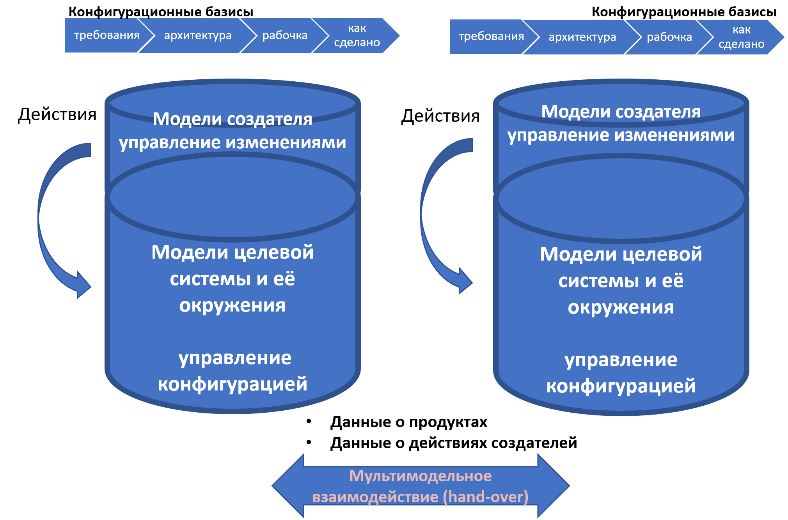

# 6-, Multi-, poly-, … D

Управление данными (раньше — «управление данными жизненного цикла», сегодня — «управление данными инженерного процесса») условно относят к:

* управлению данными продукта (делается при помощи систем PDM, product data management), когда речь идёт о проектных базах данных, в которых удерживается конфигурация целевой системы (включая промежуточные состояния сырья, ведущие к появлению сначала частей системы, а затем и всей готовой системы в целом)
* управлению данными жизненного цикла (PLM, product lifecycle management), когда кроме данных о продукте добавляются и данные о создателях (кто что делает)
* управлению пользовательскими впечатлениями/опытом (customer eXperience) в порядке eXperience management. Тут говорится, что речь идёт о широком наборе ролей, для которых предоставляются данные, причём сюда относят и внешние проектные роли. Главное, что успешность управления данными определяется не по оценкам инженера внутренней плафтормы разработки, а по оценкам пользователей платформы — и эта платформа так и начинает называться: customer eXperience platform (например, learning eXperience platform, LXP). Это кардинальный сдвиг, обычно очень трудный, ибо сдвижка референтного индекса даётся трудно[^r8-1].

Помним, что если кто-то::создатель что-то::метод делает, то есть и данные об организации проекта и состоянии этой организации, и обязательно есть данные о том, над чем эти работы ведутся — данные рабочих продуктов, которые постепенно обрабатываются и превращаются в целевую систему. Это ведёт к появлению самых разных гибридных описаний, которые описывают и целевую систему по ходу её развития (в том числе эксплуатации), и системы графа создателей.

Тренд сегодня в том, что к числу обязательных системных разбиений добавляют разбиения уже не только самой целевой системы «как в PDM», не только разные другие виды моделей (скажем, физические модели) кроме разбиений, но и прихватывающие рассмотрение систем в графе создателей (например, четвёртый аспект рассмотрения системы по стоимости уже прихватывает не только стоимость сырья и стоимость заказных компонент системы как продуктов, но и стоимость выполнения работ, в том числе эксплуатационную стоимость — разбиение полной стоимости владения). А ещё кандидатом на обязательное разбиение становится разбиение работ (WBS, work breakdown structure). Формально PLM отличается от PDM как раз тем, что хранит конфигурацию не только продукта (целевой системы), но и проекта (создателей в их графе, в том числе конфигурацию работ). По факту PLM состоит обычно из системы версионирования (репозитория), в которой хранится информация о конфигурации продукта и issue tracker, в котором хранится конфигурация работ. Например, для случая софта это может быть репозиторий Git и issue tracker к нему, которые собраны в какой-то общий сервис вроде GitHub[^r8-2] или GitLab[^r8-3]. В случае «железного железа» (механические системы, не компьютерное железо) это может быть сервис типа OpenBom[^r8-4].

Последний тут тренд — это переход от PLM систем к eXperience Platforms (XP). Основная идея eXperience platform — это управлять данными, выходящими за пределы традиционно понимаемого инженерного процесса (прежде всего — данные о внешних проектных ролях, например, данные по продвижению продукта — маркетинг, продажи, данные по постпродажному обслуживанию, эксплуатационные данные). Ещё одна проблема, которую решает переход от PLM системы к XP — это управление информацией, важной для внешних проектных ролей по отношению к команде проекта (PLM прежде всего ориентировались на поддержку команды проекта, и обычно не на всём жизненном цикле, а только на стадии разработки). Так, UX (user eXperience) от UI (user interface) отличается тем, что призывает поглядеть на user отнюдь не в тот момент, когда он нажимает кнопки приложения на экране: его проблемы начинаются сильно раньше и заканчиваются сильно позже, и момент нажатия на кнопки там только часть происходящих событий у пользователя. Впечатления/опыт пользователя поэтому не сводится только к «нажатию красивых кнопок красивого интерфейса», а связаны с тем, удалось или нет пользователю решить задачу — и если при отличном пользовательском интерфейсе не удалось, впечатления будут плохие. Грубо говоря, если вам хамит красивый человек с приятной улыбкой, то впечатление останется от его хамства (поведения), а не от интерфейса. Вот этот аспект оказывается очень труден для понимания: отслеживание общего впечатления самых разных проектных ролей, внимание на eXperience.

В предметной области UX не доходят до систем управления данными, не доходят до управления конфигурацией, просто указывают на вот этот разворот в понимании жизненного цикла как eXperience. Но в инженерии внутренней платформы разработки этот тренд stakeholder eXperience (самые разные проектные роли! Не только customer!) был подхвачен, и как пример, программный комплекс PLM ENOVIA плавно перешёл и по названию, и по сути в 3DEXPERIENCE[^r8-5]. Теперь этот программный комплекс занимается управлением информацией (данными) инженерного процесса машиностроительных и строительных проектов (указывается на применимость в 11 отраслях). Смысл переименования из PLM ENOVIA в 3DEXPERIENCE PLATFORM был в том, что он начал поддерживать работу с данными инженерного процесса далеко за пределами стадии проектирования, как это было в ENOVIA. Но всё же там в основе платформы ровно то же самое, что было верно и для PLM: репозиторий для отслеживания версионирования конфигурации (конечно, с интерфейсами к самым разным CAD/САПР системам, самым разным моделерам) и issue tracker для управления изменениями конфигурации.

Ещё один пример — это LMS (learning management system, аналог PLM для систем образования, поддерживает решение проблем команды образовательных организаций) стал сейчас LXP, learning eXperience platform, ибо поддерживает решение проблем студента, а не только решение проблем учителей[^r8-6]. Так что в современное руководство по системной инженерии мы вписываем и PDM, и PLM, и eXperience (со второй большой буквой, чтобы отличить от просто «опыта»). И это ещё не конец истории, поскольку появился и новый термин, обращающий особое внимание на операционные данные (данные стадии эксплуатации): цифровой двойник (digital twin) в его вариантах цифровой модели, цифровой тени и истинного цифрового двойника. Но об этом в текущем разделе руководства будет говориться немного дальше.

Главное, что нужно запомнить, что во всех этих вариантах внутренних платформ разработки увязываются работы внешних проектных ролей (eXperience), создателя (PLM) и конструкция целевой системы (PDM): **все контрольные точки (они нужны для операционного управления, то есть** **для управления работами** **создателя** **по воплощению, а также по удовлетворению интересов внешних проектных ролей)** **порождаются для модели проекта/project** **на** **основе** **модели продукта** **(design).** **Тут асимметрия: не из работ по воплощению делается разбиение системы, а наоборот:** **для каждой части системы (они описываются в** **design)** **проектируются работы по её созданию («заказать, получить, проверить, смонтировать, наладить/настроить, проверить работу в составе системы»), а каждая работа имеет свою контрольную точку—** **для того, чтобы отследить её выполнение. Потом можно назначать работников и начальные моменты** **старта для уже понятных работ/задач/task.**

Моменты времени для контрольных точек расставляются исходя как из технологической последовательности («сначала стены, потом крыша»), так и из балансировки ресурсов («побыстрее» против «равномерной загрузки» — или в пике на стройке атомной станции вдруг обнаруживается 2700 человек, и начинаются проблемы с туалетами, обедами, жильём, но всё идёт очень быстро, или равномерно на станции работает каждый день примерно 700 человек, не сильно больше и не сильно меньше — стройка будет длиться подольше, но и многие проблемы пиковых авралов на 2700 человек при этом будут отсутствовать).

Проверка качества такого планирования в «железных» и строительных проектах может быть — анимационными роликами (имитационное моделирование). В них хорошо видно, как «забыли завезти крупногабаритное оборудование вовремя, пришлось разбирать свежевозведённую стену, чтобы затащить оборудование в помещение».

Такой метод порождения контрольных точек из данных по продукту получал разные названия, потому что люди из маркетинга очень хотели иметь собственное для каждого поставщика инструментария внутренней платформы разработки фирменное наименование для такого «прогрессивного способа» увязывания конфигурации продукта (3D-модели продукта для киберфизических систем) и конфигурации работ. Чаще всего эти названия крутились вокруг числа «пространственных измерений/размерности/dimension», потому как 2D-чертежи заменялись 3D-информационной моделью. Число D (dimension) в итоговой мегамодели для «железных» и строительных проектов потихоньку росло с начальных 3D и переставало быть «пространственной размерностью». У Toshiba в конце нулевых в софте для конструирования было 6D (хотя это уже давно забытый факт, но технология называлась 6D), у НИАЭП Росатома в начале десятых годов 21 века уже было радикальное Multi-D[^r8-7], число размерностей признавалось радикально большим, много больше трёх пространственных измерений.

В последние несколько лет популяризируется 8D как самое броское в популяризации подхода, например 8D digital twin experience от SNC-Lavalin[^r8-8]. В 8D подходе всё ровно то же самое, что можно было услышать десяток лет назад в презентациях по PLM, но слова другие — digital twins, ибо акцент уже не только на проектировании и сооружении, но и на эксплуатации, поэтому engineering data дополняются asset data, а конечная цель — автономная (без человека, где-нибудь в абсолютно безлюдной местности) эксплуатация на основе «единственного источника правды», single source of truth (это мы повторяем материал руководства по системному мышлению, подраздел *«*Альтернативные варианты основных видов разбиения системы на части»):

* 1D метаданные, документация (тексты)
* 2D чертежи (там, где «обычные двумерные чертежи» ещё есть, «родные файлы» из CAD/САПР)
* 3D информационные модели (это представление физической формы/геометрии/компоновки системы с указанием материалов и многих других характеристик)
* 4D «видеоролик» стройки/сборки в развёртке во времени, то есть к 3D добавляется план/schedule сооружения (стройки и монтажа) или сборки
* 5D это ресурсы, material status/cost, то есть добавляется стоимость
* 6D вот тут появляется operation, real time data (и мы перешли из «construction time»/«enabling realm»/«времени создания» в «operation realm»/«operation time»/«время эксплуатации», и с этого места принято говорить, что речь идёт не о системе поддержки жизненного цикла/PLM, а цифровом двойнике/digital twin уже созданной физической системы)[^r8-9]
* 7D это live streaming, передача видеопотока работающей целевой системы и её окружения (с видеокамер, со спутника — отдельно от real time data с датчиков, ибо это огромные объемы данных).
* 8D это уже аналитика, предсказания систем машинного обучения (ML predictive data)

Во всех этих методах создания внутренней платформы разработки все данные инженерного процесса ставятся под контроль конфигурации (иногда это называют «управление информацией», иногда «интеграцией данных жизненного цикла», иногда «непрерывная интеграция») так, чтобы можно было проверить отсутствие конфигурационных коллизий в компьютерной модели до того, как они проявятся в момент изготовления системы и уж тем более эксплуатации системы.

Если система имеет электропитание 12 вольт (и это электропитание проектирует одна фирма), а осветительную лампочку в неё запроектировали на 220 вольт (это делала другая фирма), то это должно быть обнаружено ещё до покупки лампочки, до выдачи лампочки в монтаж, до включения лампочки в актуальной системе. И особо повторим: кроме интеграции инженерных данных о продукте (целевой системе) нужно ещё интегрировать менеджерские данные о создателях. И тоже думать об отсутствии конфигурационных коллизий — чтобы не оказалось, что лампочку должен вкручивать вчера уволенный электрик.

Вот эта проверка конфигурационных коллизий между создателями и создаваемой системой интересна тем, что в ней хорошо видны не только банальные ошибки планирования, но и тщательно запланированные злоупотребления: выполнение работ с никакой частью системы, закупка комплектующих, которые потом не задействованы никакой работой.

Вот картинка, которая показывает более чем обычную ситуацию: две внутренних платформы разработки (XP или даже более древние PLM) системы в одном проекте, при этом они могут быть развёрнуты или в разных подразделениях одной большой фирмы, или даже в разных фирмах, когда разработка ведётся в рамках «производственной кооперации»/ «extended enterprise»:

Картинка отражает обычное на сегодня состояние «железного» проекта, как это понимается в классической «железной» системной инженерии, предусматривающей «однократный ввод в эксплуатацию». Научитесь по таким картинкам определять, что они «из прошлого десятилетия» (хотя они могут быть подготовлены буквально вчера!). Какие признаки старого мировоззрения, старой инженерии? На картинке же вроде правильные слова про «модели», правильные слова про управление конфигурацией, правильные слова про системы? Но на ней явно приведены два «однократных» водопада, начинается всё с требований (а не других современных способов описывать функциональность системы), рабочка и «как сделано» тоже последовательны (не каждое отклонение немедленно вносится в рабочку, а «сначала всё делаем, потом вносим все изменения разом» — в уме рисовавшего диаграмму был «водопад»). Вы должны распознавать всё это, ибо рядом с такими диаграммами будут обязательно написаны слова про agile (это же модно! Все хотят быть «гибкими» и «современными», а слово написать на эту тему нетрудно).

Но давайте разберёмся, о чём нам говорит такая диаграмма (она ведь описывает положение дел, которое вам наверняка встретится в каком-нибудь строительном проекте, или проекте создания электростанции). В каждой внутренней платформе разработки есть и система версионирования продукта (отслеживание модели целевой системы и её окружения, обычно репозиторий, относится к управлению конфигурацией, PDM) и issue tracker (модели создателя, прежде всего проводимых создателем работ по созданию его системы в графе создателей — расширение PDM до PLM). Эти системы общаются между собой (обмениваются данными), и тут нужно помнить: передавать между системами нужно не только информацию о продукте (например, новую деталь или программный модуль с замечаниями к ним), но и информацию о планируемой работе (например, указание на то, что нужно посмотреть на свежеразработанные деталь или программный модуль и прислать в ответ замечания). А что с ходом на eXperience management? В картинке ничего этого не видно, выхода на управление информацией для внешних проектных ролей не показано (при этом выводы делать рано: «не показано на картинке» — это не значит, что в самом проекте этого не было сделано! Возможно, всё сделано, но просто «не показано», посылка открытого мира).

Как будет идти жизнь в проекте, который делался по показанной в диаграмме картинке? По «водопаду»? Нет, мы неоднократно замечали, что «водопад» — он только в мозгах, «модель». В жизни будут непрерывно меняться требования (ибо природу «гипотезы», «догадки» никто не отменял, даже если очень хочется считать это «окончательно зафиксированными требованиями», это просто документированные догадки). Только менять их будет административно очень тяжело, равно как административно тяжело будет менять проектные решения (базисы, которые устарели сегодня) под изменившиеся требования, равно как и менять реальные конфигурации воплощения системы. Жизнь будет как в agile проекте, только с искусственными административными препятствиями. Работа будет не элегантной, не lean.

Иногда управление конфигурацией относят именно к управлению инженерными данными для целевой системы (версионирование), а управление изменениями в целевой системе к управлению данными о том, кто и что с будущей целевой системой делает, то есть управлению операционными данными о создателях. Как ни разносить интеграцию данных инженерного проекта по разным методам, нужно просто понимать, что конфигурационные коллизии нужно искать в мегамодели, которая описывает и проект/design продукта/product, и менеджерский проект/project, и это нужно делать в условиях множества не только продуктов-подсистем целевой системы и окружающих систем в надсистеме (учитывать множество самых разных design, которые разрабатываются в самых разных системах автоматизации проектирования и моделерах), но и в условиях множества проектов/project, которые ещё готовы как-то делиться инженерной информацией, но часто не готовы делиться информацией о выполнении работ из своих issue trackers или систем классического проектного управления (например, строительных).

[^r8-1]: <https://ailev.livejournal.com/1739650.html>, <https://ailev.livejournal.com/1739861.html>

[^r8-2]: <https://github.com/>

[^r8-3]: <https://about.gitlab.com/>

[^r8-4]: <https://www.openbom.com/>

[^r8-5]: <https://www.3ds.com/products-services/enovia/products/>

[^r8-6]: <https://www.growthengineering.co.uk/what-is-learning-experience-platform/>

[^r8-7]: <https://www.atomic-energy.ru/Multi-D>

[^r8-8]: <https://www.youtube.com/watch?v=OjH1OPezfak>

[^r8-9]: Тут, конечно, не нужно путать с 6D для экспоненциальных технологий от Peter Diamandis и Steven Kotler (exponential organizations должны быть digitised, deceptive, disruptive, dematerialized, demonetized, democratized, это Singularity University в 2016, когда модно было искать везде экспоненты и единорогов) — <https://www.diamandis.com/blog/the-6ds>
