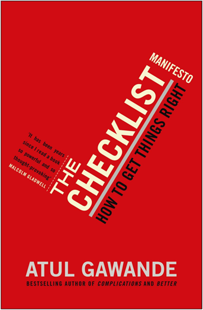
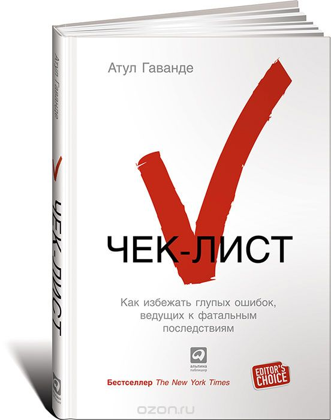
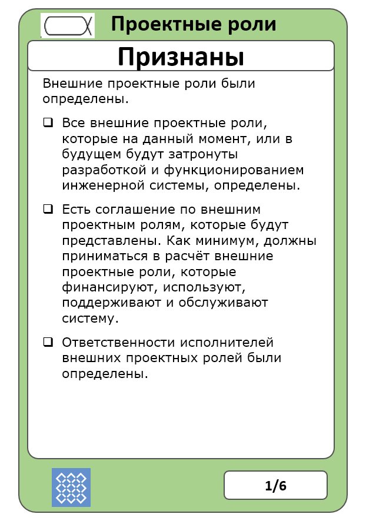

# Чеклисты в регламентации

Про чеклисты мы довольно много говорили в руководстве по методологии, но в системноинженерной работе надо уже не просто говорить — но уже делать, задействовать эти чеклисты в работе. Чеклисты появляются в ходе регламентации, то есть при нормативном описании метода работы:

* Готовится (и непрерывно обновляется!) регламент/руководство/инструкция/стандарт, который не повторяет учебник со всеми деталями и нюансами, но содержит указание на важнейшие объекты с их графом состояний, а также операции, которые надо делать с этими объектами, чтобы проводить их по графу состояний. Это язык метаС-модели, принятой на предприятии. Это всё на понятном людям языке (понятный для машин язык тут может быть, например, автоматного программирования — машины состояний, но в общем случае — любой язык программирования. Повторим, что это мы обсуждали в руководстве по методологии). Регламент должен быть в операционном софте сотрудника, который должен его знать, а не в операционном софте его разработчика (и надо сопротивляться сведению всех регламентов в Единую Информационную Систему Всех Регламентов, это означает, что сотрудник никогда туда не заглянет и не сверит свои действия с регламентом. Если очень надо, делайте репликацию).
* К регламенту готовится шаблон/пустографка чеклиста, представляющий собой список вопросов, положительные ответы на которые означают достижение того или иного состояния альфы. Чеклист предусматривает проверки ситуаций, когда что-нибудь может «пойти не так».
* Для шаблона чеклиста делается чеклист, который проходится для каждого экземпляра альфы. Обычно это табличная форма в операционном софте сотрудника, выполняющего регламент. Если что можно в прохождении чеклиста автоматизировать, надо автоматизировать.
* Сотрудник обучается прохождению регламента (выполнению работы по методу, описанному регламентом) с заполнением чеклиста (первый раз разработчик регламента и чеклиста проходит его с сотрудником).
* Прохождение регламента ставится под надзор — чтобы не было соблазна не заполнять чеклисты, не выполнять все предписанные регламентом операции, а потом «для проверки» заполнять их в конце недели, как будто реально прошли все проверки.
* Если чеклисты сотрудником игнорируются по причине их неважности (мы уже тут говорили, что разработчики регламентов легко загоняют фирму в ситуацию итальянской забастовки), то надо оставить в чеклистах только действительно важные вопросы. Если вопросы важны, но всё равно игнорируются сотрудником — дешевле сотрудника уволить, чем постоянно ликвидировать последствия ошибок этого сотрудника. Недисциплинированные сотрудники на работе не нужны, от них вред.

Управление работами — это управление выделением ресурсов и выполнения работ, в том числе это управление включает трекинг/отслеживание прохождения всех контрольных точек (milestones/вех) проекта/project. **Контрольная точка** — это момент времени, в который ожидается какое-то событие. **Событие** — это смена состояния какого-то важного объекта внимания в проекте (альфы). **Смена состояния** обычно происходит не сама собой («система сама себя не разработает и не изготовит», техноэволюция — это не биологическая эволюция), а представляет собой результат чьей-то работы по какому-то методу (если застывает бетон, то у вас работа — «подождать», намеренное отсутствие работы — это тоже работа!). Смена состояния обычно сопровождается ответом на **контрольный вопрос** о достижении какой-то характеристики этого состояния.

Скажем, вам нужно закрыть дверь. Контрольная точка — это момент времени, в который происходит смена состояния: «дверь открыта» на «дверь закрыта», при этом «дверь закрыта» — это характеристика целевого состояния двери. Контрольный вопрос — это закрытый (подразумевающий ответы «да», «нет», «не знаю», открытый вопрос подразумевает развёрнутый ответ, описывающий ситуацию) вопрос, в котором есть:

* высказывание/assertion о состоянии (описание состояния), «закрыта»,
* указание системы, для которой дана характеристика: «дверь»,

Контрольный вопрос тут «дверь закрыта?». Для закрытия двери требуется провести работу. Контрольная точка — это привязанное ко времени ожидание события закрытия двери (смены состояния «дверь открыта» на «дверь закрыта»), то есть ожидание положительного ответа на контрольный вопрос в какой-то момент времени.

Контрольная точка просто «проходится», ответ на её вопрос о достижении значения характеристики, привязанный ко времени ожидания этого события в части управления работами принимается системными и прикладными инженерами проекта, а также операционными менеджерами проекта (а часто и внешними проектными ролями, им тоже это интересно, чтобы корректировать свои планы) «для сведения». Если не проходится, то с работами было что-то не так: они или не проводились (вопрос к операционному менеджеру, проблемы с работами) или проводились, но «что-то пошло не так» (вопрос к целевому инженеру, проблемы с методом выполнения работ).

Гейт/gate — это контрольная точка, в которой принимается решение, идти ли в проекте дальше, или прекратить проект. То есть, если вовремя дверь не закрыта, и это обычная контрольная точка, то вы таки дожидаетесь работы по её закрытию, но все остальные работы проекта при этом продолжаются, или это не простая контрольная точка, а гейт — и тогда вам придётся принимать решение, дожидаться ли закрытия двери, или всё в целом в проекте настолько плохо и критично, что нужно прекратить весь проект. Скажем, в авиапроекте гейтом является получение денег по предзаказам на самолёт. Если деньги не получены в срок (контрольный вопрос: «деньги получены?», веха/milestone в качестве гейта/gate — «деньги к 23 мартобря 2022» получены?»), то закрывается весь проект создания самолёта, прекращаются все работы проекта. Общий тренд сегодня — это уменьшение числа заранее назначенных гейтов, и мониторинг прохождения вовремя контрольных точек. Да, время это нельзя спланировать, но менеджмент этого не допустит — потребует от инженеров выдать оценку времени, затем превратит бандитским приёмом «никто тебя за язык не тянул» оценку в обещание, и вот у вас появилась контрольная точка. Это плохой метод организации работы, но он более чем распространён. Если есть какие-то проблемы с прохождением вовремя контрольных точек, то принимаются самые разные меры — включая и такие, как закрытие всего проекта, то есть признание проекта неуспешным.

Всё описанное лишний раз демонстрирует, что состояние kernel альф «воплощение системы», «описание системы» и «методы работы системы», «работы системы» для каждой области интереса систем проекта (целевой системы и систем графа создателей — различных команд и коллективов) оказываются тесно переплетены, а контрольные вопросы, задаваемые в контрольных точках проекта, помогают отслеживать состояние проекта в части продвижения в достижении планируемых состояний этих альф к конкретным датам проекта.

Этих контрольных вопросов как к целевой системе и её окружению, так и к системам-создателям во всех их графах, так и к внешним проектным ролям много, они как раз и собираются в **чеклисты/checklists**для каждой альфы. Эти чеклисты делаются и для состояний подальф, и так на несколько уровней вниз. Каждый контрольный вопрос в этих чеклистах/«контрольных списках»/«списках контрольных вопросов» подразумевает **изменение состояния альфы путём выполнения работ по каким-то** **методам**. Эти контрольные вопросы отлично увязывают управление работами (обычно это кейс-менеджмент) и ведение инженерного процесса (какой-нибудь вариант agile, предусматривающий планирование работ на лету, исходя из инженерного анализа ситуации с альфой).

**Контрольные вопросы составляются** **инженерами, ответственными за изменение состояния соответствующих альф** **в ходе регламентации: инженерами целевой системы, или инженерами систем** **из графа создателей** **(менеджерами).** **Это инженеры внутренней платформы разработки, инженеры** **DevOps.** Именно инженеры знают те состояния, через которые проходит каждая альфа и подальфа и те методы работы, которые могут привести альфу из одного состояния в другое. Поэтому обязанностью системных инженеров целевой системы, а также системных инженеров систем-создателей в их графе будет:

* адаптация набора состояний основных альф проекта создания и развития системы (целевой или «нашей» в графе создателей) к предметной области проекта
* составление или адаптация списка контрольных вопросов к каждому состоянию
* указание методов перевода состояний альфы, а также последовательности применения методов, оценка времени их выполнения. Это входная информация для операционного менеджера (этим операционным менеджером может быть софт issue tracker — операционному менеджеру не нужно особо вмешиваться в выполнение работ, им легко может быть и алгоритм).
* Выделение подальф, чтобы отслеживать проект с нужной степенью детальности. Для подальф нужно тоже выделить состояния и составить списки контрольных вопросов.

Мы подробно рассматривали чеклисты в руководстве по методологии, но иногда кажется, что можно как-нибудь обойтись и без них. Нет, нельзя обойтись. В книге Атул Гаванде «Чек-лист. Как избежать глупых ошибок, ведущих к фатальным последствиям»[^r8-1] нет ничего особенного, чего мы бы не разбирали в руководстве по методологии, разве что даётся множество примеров и объяснений — и после прочтения этой книги (обязательное чтение!) обычно барьер принятия всерьёз работы с чеклистами снимается:

Чеклисты отражают не буквально все-все состояния, через которые проходят альфы, но только самые важные. Все-все состояния можно легко найти в учебниках предметной области и рабочих инструкциях, а чеклист — это средство отслеживания состояния проекта, а не рабочая инструкция. Тем самым чеклист состоит из самых-самых банальных вопросов, которые подразумевают обычно положительный ответ. Но в условиях стресса, пожара, коллективной и личной несобранности, ошибок планирования, сбоев в рациональном мышлении люди (даже с учётом задействования ими внешней памяти компьютеров) забывают выполнить какие-то работы — и прогон проверки ответа на контрольные вопросы это обнаруживает. **Если контрольный лист составлен правильно, то проблемы будут находиться этим чеклистом только один раз из десятка, а то и реже. Но этот один раз обычно спасает проект.**

Чеклисты появились впервые в авиации, когда одного пилота стало маловато, чтобы управиться с большим многомоторным самолётом: то с ручного тормоза забудут снять, то один из моторов завести, то убедиться, что перед самолётом на взлёте ничего нет. Аварии на взлёте были очень часты, и чеклисты с банальными контрольными вопросами («ручной тормоз снят», «правый двигатель работает», «левый двигатель работает», и т.д.) практически устранили эти аварии. Девять раз из десяти на все вопросы ответы были положительными, а один раз какой-то ответ был отрицательным — и принимались меры, чтобы аварии не было. Контрольные вопросы прогоняются перед или после выполнения каких-то пакетов работ в специальных паузах, чтобы обнаружить проблемы. Они служат для снятия рисков в командной работе: отслеживают то, что все нужные работы были выполнены и альфа пришла в требуемое состояние.

Стандарт OMG Essence предусматривает как раз такой способ ведения работ в проекте: предлагаемые им примеры kernel альф имеют какие-то более-менее абстрактные (мета-мета-модель) состояния, каждое из состояний включает к нему контрольные вопросы, далее альфы должны быть конкретизированы на один уровень абстракции ниже, до объектов предметной модели (мета-модели).

В простейшем виде состояния альфы и контрольные вопросы к ней (ещё не адаптированные, или уже адаптированные) могут быть оформлены как «карточки», например:

Это неадаптированная карточка альфы «проектные роли», состояние «признаны», первое из шести состояний. Состояние описано как «внешние проектные роли были определены» и это высказывание разбито на более детальные три.

Для ответов на вопросы по альфе должны быть использованы какие-то рабочие продукты (инженеры не верят на слово, биологическому мозгу никакого доверия в смысле памяти, у них «все ходы записаны»). В данном случае можно предположить следующие рабочие продукты:

* Длинный список (long list) внешних проектных ролей, куда помещаются самые разные проектные роли, которые удалось выявить. Это даст ответ на первый вопрос «Все внешние проектные роли, которые на данный момент, или в будущем будут затронуты разработкой и функционированием инженерной системы, определены». Чтобы добиться создания такого списка, нужно запланировать работу, например «узнать про роль X», «выписать набор нужных ролей из учебника Y», «провести мозговой штурм в отделе Z», и т.д.
* Короткий список исполнителей внешних проектных ролей, которые будут представлены в проекте какими-то отдельными людьми, и он утверждён (есть отметка об утверждении). Чтобы получить такой список, нужно провести работу — например, совещание, на котором будут прямо в таблице длинного списка проставлены отметки о тех ролях, которые будут представлены, и туда добавлены имена исполнителей необходимых ролей, от которых ожидается нужная квалификация для участия в проекте. Совещание придётся готовить, это тоже работы! А затем нужно ещё и как-то утвердить этот список: решением совещания или решением какого-то ответственного лица (тут мы говорим очень аккуратно: это может быть начальник, инженер, менеджер, но смысл решения тут не столько инженерный, сколько выделения нужных ресурсов). А остальные роли, которые остались в длинном списке? О них будут как-то помнить, но учитывать их интересы без общения с какими-то специально выделенными для этой цели внешними людьми.
* В коротком списке должно быть указано, за что ответственны исполнители внешних проектных ролей. Чтобы получить этот рабочий продукт, нужно провести работу: обсудить и сформулировать, что должны делать эти исполнители.

Карточку альфы, можно представить как карточку (рабочий продукт, предлагаемый OMG Essence), но также как шаблон/пустографку/таблицу и далее проектировать в ходе адаптации эти таблицы в каком-то универсальном моделере (coda.io, notion.so или аналогичном), а запланированные работы для заполнения этих таблиц представить как issues в issue tracker. С этого момента операционный менеджер будет контролировать закрытие этих issue, а инженеры будут контролировать реальное выполнение условий.

Обычно трудно разобраться, как использовать механизм отслеживания проекта по состоянию альф в условиях непрерывной разработки, когда система всегда «в бета-версии», непрерывно эволюционирует/развивается. Мы об этом упомянули уже, но повторим:

* Для всей системы основные альфы всей системы хорошо использовать до момента выпуска MVP, а дальше переходить на альфы инкрементов
* Не использовать диаграммы с альфами, использовать таблицы. Тогда вы будете легко порождать новые альфы по потребности. Почему тогда не порождать такие таблицы «из головы»? Потому как основные альфы и прописанные в наших руководствах для инженеров-менеджеров их подальфы заставят вас подумать о тех подальфах, которые важны, но о которых вы бы сами не подумали бы в суете проекта. Сами «альфы из учебника» выражаются в формате чеклистов с контрольными вопросами по достижению их состояний. И их ещё рекомендуется как-то адаптировать к ситуации вашего проекта, чтобы чеклисты были точнее. То есть альфы предписывают, о чём вы должны подумать, что должны отслеживать. Они нормативны, «так надо думать» в проекте, выделять вниманием эти альфы.
* Основная идея — это отслеживание состояний альф, когда эти альфы являются предметами кейсов (но состояние их свидетельствуется в физических объектах, рабочих продуктах и агентах, альфы отличаются от рабочих продуктов: скажем, альфа «метод» — это не рабочий продукт, но вы можете оценить её состояние по каким-нибудь отчётам). Когда нужное состояние альфы достигнуто, кейс считается закрытым. Пока не достигнуто — продолжаем выполнять кейс, устранять обнаруженные проблемы. Если предметом кейса делать рабочий продукт, то получается похуже (рабочие продукты вроде все готовы, функция оказывается невозможной — кейс закрыт, но эксплуатировать результат нельзя, функция по разным причинам не выполняется, надо искать причину и открывать новый кейс. Вот «кейсы из альф», а не «кейсы из рабочих продуктов» решают эту проблему, отслеживается сразу конечный эксплуатационный результат, а не «папа, я собрал все шестерёнки от твоих часов в кучку, но эта куча шестерёнок почему-то не показывает время»).

Если содержание этого подраздела плохо понятно, вернитесь к наставлениям руководства по методологии, там всё изложено более подробно. Но ещё будет дополнительное изложение в руководстве по системному менеджменту.

[^r8-1]: <https://www.litres.ru/atul-gavande/chek-list-kak-izbezhat-glupyh-oshibok-veduschih-k-fatalnym-po/>
