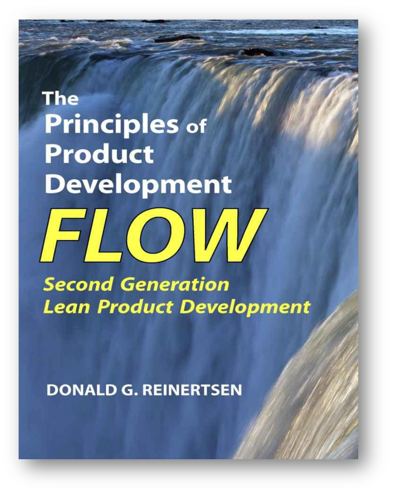
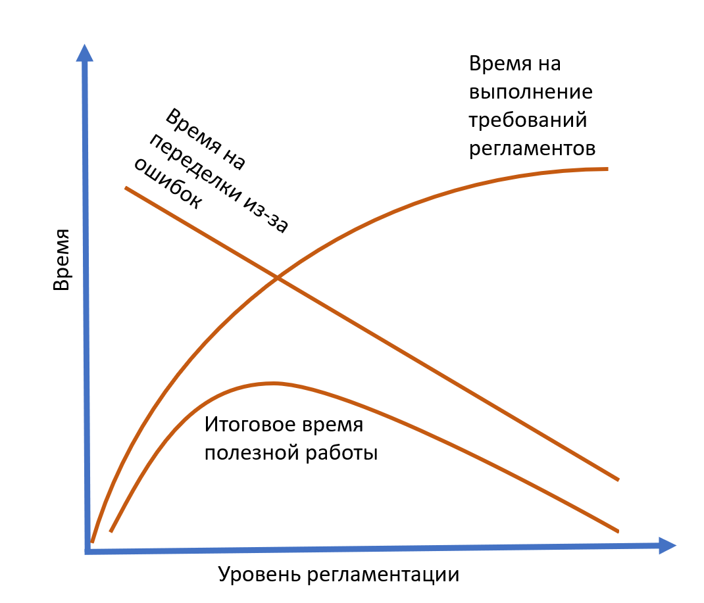
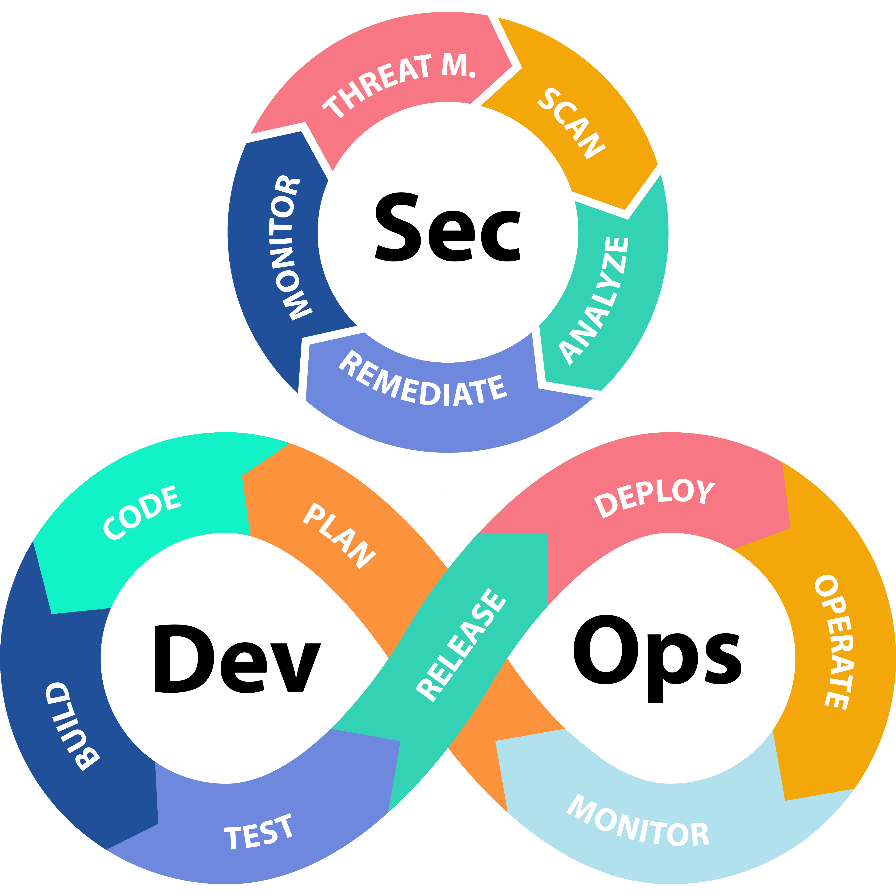

# Составляющие DevOps

Современный метод непрерывного ввода в эксплуатацию (DevOps) отличают от методов управления работами (work management, operations management). Администрирование функционирования/работы (operations) целевой системы — DevOps, а вот администрирование функционирования/работы (operations, works) предприятия — это операционный менеджмент. Их различение уже рассматривалось в руководстве по методологии.

Несмотря на то, что сегодня практически везде переходят на DevOps, во многих и многих «железных» проектах остаётся ещё старинный вариант управления жизненным циклом, ибо не столько даже инженеры, но менеджеры продолжают считать, что текущий такт разработки — последний, да и «водопад назад не течёт!». Это и есть «опыт»: двадцатилетний опыт чаще всего — однолетний опыт двадцатилетней давности, повторённый двадцать раз. **Бойтесь своего опыта!** **Чем больше лет вашему опыту, тем подозрительней!**

Как специалисты DevOps любят указать, что «наши методы подойдут и для организации водопадной разработки, просто используйте их не все, применяйте творчески», так и специалисты по управлению жизненным циклом любят заметить, что «для agile у нас тоже отлично всё работает». После этого возникают довольно причудливые сочетания самых разных методов организации работы в проекте. Надо не обращать внимания на названия, которые используют, а обращать внимание на объяснительные теории, на которых базируются используемые в проекте методы, проверять обоснование этих методов. Упоминавшаяся уже книга «Accelerate» как раз подробно об этих исследованиях разных вариантов организации выпуска продуктов рассказывает. Исследования обычно убедительно показывают, что интуитивные представления о том, как надо работать, непродуктивны. Лучшие методы работы — контринтуитивны. Не поленитесь-таки прочесть «Accelerate», убедиться, что ваша интуиция не противоречит реальности.

**DevOps** — это метод выполнения в проекте правильных работ по правильным методам с правильным инструментарием. Какие «рабочие процессы»/«методы работы»/практики входят в составляющие DevOps?

**Управление конфигурацией** (configuration management). Работы проекта будут выполняться со всеми появляющимися в ходе проекта **конфигурационными единицами**(configuration item)[^r8-1], и ни одна из этих конфигурационных единиц при этом не будет забыта, потеряна, перепутана. Вот это «не забыть, не потерять, не перепутать, для этого в проекте надо всё уникально именовать, знать, где что лежит и в каком состоянии находится» выполняется методом **управления конфигурацией** **(configurationmanagement)**[^r8-2]. Конфигурация системы — это набор конфигурационных единиц, представляющих собой систему в какой-то заданный момент времени (по умолчанию — текущий момент). **Конфигурация системы—** **это сама система, не её описание!** А что с описанием? Можно говорить о конфигурации описания, из чего состоит в какой-то момент времени описание. Это означает, что мы знаем, что вчера в системе был модуль А с серийным номером 234, а сегодня это модуль Б с серийным номером 345. Мы знаем, что в описании системы вчера была принципиальная схема версии 4, а сегодня уже там версия 5. И мы не путаем разные конфигурации — вчерашнюю и сегодняшнюю. Когда система собрана из частей, которые не соответствуют друг другу — это **конфигурационная** **коллизия,** ) считается большой бедой проекта.

**Выбор и** **непрерывное развитие/адаптация** **«методологии разработки»/«инженерного процесса»** **(раньше—** **«определение вида/модели жизненного цикла», причём без непрерывного развития, а «раз—** **и навсегда»).** Этот метод был подробно разобран в руководстве по методологии, а в нашем руководстве по системной инженерии как нормативной дисциплине говорится о том, что вариант «методологии разработки»/«инженерного процесса» нужно выбрать явно, адаптировать, развивать в ходе всего проекта, организовывать работы всех участников проекта в соответствии с ней. В разработке софта сегодня предпочитают разные варианты гибкой разработки/agile, в разработке киберфизических систем на сегодня до сих пор можно встретить разные старинные варианты вроде V-модели, но уже понимается неизбежность принятия гибких методов разработки «железа». В инженерии предприятия (менеджменте) сегодня говорят о непрерывном стратегировании, о циклах непрерывного совершенствования. Во многих других сферах (например, инженерии личности, в сфере медицины) на эту тему особо не разговаривают, и этот «неразговор» — большая ошибка. Даже если инженерный процесс де-факто формулируется как «не интересоваться, какие у нас основные альфы, как мы планируем и отслеживаем изменения основных альф», это нужно проговорить в проекте явно, выбор даже отсутствия обговорённой методологии инженерного процесса должен быть сделан явно. Если вы начинаете новую разработку, то не факт, что вам удастся сразу реализовать современное разделение труда и преодолеть ограничения мышления об однократном прохождении «водопадного» жизненного цикла. Конечно, сам инженерный процесс по факту будет идти как описано у нас в руководстве (догадки как гипотезы, много итераций по инкрементам), но всё-таки содержать много лишнего (типа обязательной разработки требований и связанного с этим «испорченного телефона», подготовки отчётности, которую никто не читает), в нём наоборот, не будет многих методов DevOps и инженерии внутренней платформы разработки как выделенной инженерной работы.

Людей в проекте нужно будет научить выбранному методу работы в целом, выбранному инженерному процессу. Если не научить, то каждый будет работать, как считает нужным — в результате будет огромное количество лишней работы, переделок, а часть необходимой работы не будет выполнена — о ней никто не вспомнит!

**Регламентация:** для выбранного метода инженерной работы («инженерного процесса») в целом надо выбрать его составляющие прикладные методы, подходящие для природы систем в вашем проекте, начать организовывать работников на их выполнение — и продолжать это в ходе всего проекта. Этот выбор метода делают инженеры, но вот затем сделать так, чтобы люди и инструменты ему следовали — это часть задачи менеджеров, оргразвитие. **Получается, что оргразвитие в существенной мере** **(содержательная часть регламентов работы, предписанный метод работы)** **определяется не менеджерами, а инженерами. Не знаешь, какие методы нужны для работы—** **не можешь организовать на их выполнение людей и** **AIс необходимыми инструментами.**

Стандарты, регламенты работ, нормативно-справочная информация, чеклисты — это всё тут. Чем больше это похоже на бюрократическую заводскую разработку по военным проектам (где главное — это не результат, а кто будет сидеть в тюрьме за ошибки, «сбор улик»), или на медицину (где врач три четверти времени заполняет бумажки, подтверждающие, что он следует процессу), или на любую другую зарегулированную насмерть государством отрасль (атомная энергетика, строительство), тем менее эффективна будет работа в проекте, не lean, не элегантна, много лишней работы. Но если работ регламентации не делать — то наладить коллективную проектную работу не удастся, каждая роль будет работать «каким-то», а не нужным для проекта методом, результаты работы всех ролей будут «какими-то», а не нужными, часть работ по важным методам окажутся пропущенными (например, часто пропускают работы по инженерным обоснованиям).

В этом месте излишнего бюрократического увлечения регламентацией часто получают какие-нибудь «службы качества», занятые тем, что пишут регламенты работы (например, следуют стандартам серии ISO 9000 в написании «процессных регламентов»): вроде как если есть жёсткое следование регламентам, это должно поднять качество. Но нет, эксперименты показывают, что стандарты эти не влияют на качество. Поэтому сейчас принято «покупать сертификацию», использовать эти стандарты для того, чтобы предъявлять как формальный аргумент «заботы о качестве» (полностью эквивалентно покупке вузовского диплома: этот формальный документ иногда важен, но по факту никогда не свидетельствует о реальном мастерстве). Надо запомнить, что в этой регламентационной работе надо попасть в goldilocks — не переборщить, но и не пустить работу в части методов на самотёк, не отдать всё в «устное согласование» — и помним, что содержание работ обычно идёт от инженеров, но вот бюрократические навороты обычно идут от менеджеров, менеджеров надо сдерживать в их бюрократических аппетитах. Это и есть принцип lean/элегантности, минимально необходимая работа делается, но не более, и не менее.

Вот книга Donald Reinertsen, «The Principles of Product Development Flow: Second Generation Lean Product Development» (2009), она посвящена операционному управлению для элегантности в работах, то есть управление минимальностью работ в проекте.

В этой книге вводится принцип «E6: The U-Curve Principle: Important trade-offs are likely to have U-curve optimizations». Этот принцип гласит, что если у вас есть две переменные, влияющие на производительность труда в разные стороны, то результат чаще всего будет U-образной кривой (или инвертированной U), при этом не требуется очень большая точность — ибо в этих кривых нет ярко выраженных пиков.

При отсутствии регламентации («делай, что хочешь»), производительность мала, силы тратятся на бесчисленные переделки. При оптимальной регламентации (организованная работа по методу) скорость оптимальна. При уровне регламентации выше оптимума будет много лишних действий на выполнение ненужных уже регламентов, и уменьшение ошибок в выполнении работ уже не компенсирует потери времени на выполнение лишних регламентированных действий. И это даже в ситуации, когда лишние действия действительно снижают число ошибок! В этом весь принцип элегантности: делать и регламентировать только то, что нужно, ничего лишнего! Элегантность даёт высокую скорость работ за счёт того, что не нужно выполнять лишние работы.

Опять подчеркнём: метод, по которому работать, задают инженеры, ибо они знают, что надо делать — а менеджеры (операционные менеджеры) должны проследить, чтобы следование методу было, регламентация работ была, но они не были чрезмерными. Итальянская забастовка (work-to-rule)[^r8-3] — это «работа по всем правилам», это правый край диаграммы. Не организуйте саму работу как итальянскую забастовку! При этом, конечно, если работу не организовывать, правил нет, методы не заданы и их выполнение не отслеживается (например, по чеклистам), то это тоже забастовка — левый край диаграммы.

Качество продукта обеспечивается не строгим следованием письменной процедуре, а быстрым внесением изменений в процедуры, в дизайн продукта, непрерывным улучшением, а не дословным выполнением стремительно устаревающих жёстких инструкций. Иногда этот метод совмещают с методом compliance (проверка соответствия стандартам, требуемым законодательством), но compliance больше соответствуют методам управления жизненным циклом — проверка идёт один раз, и далее считается, что «ничего не меняется, соответствие есть». Действительно, это очень дорого — проводить независимое сертифицирование с участием представителей надзорных органов каждый раз, когда меняется конструкция, а она меняется часто. Выход тут всё-таки в прогоне полных тестов для каждой модификации целевой системы, чтобы убедиться этому соответствию — но также в тесты входят и fitness functions, и тесты защиты, и функциональные тесты. Поскольку каждая модель автомобиля Tesla или ракеты SpaceX имеет модификации в силу «полного agile» на производстве, то принята стратегия полных испытаний/тестирования каждого экземпляра — а удешевление тут идёт за счёт автоматизации тестов.

Чеклисты по сути — те же проверки, что работы выполнены, состояние системы достигнуто. Но они проверяют не только конечное, но и промежуточное состояние. Прохождение чеклистов, конечно, тоже надо автоматизировать. Но «ручные» чеклисты имеют встроенный в себя механизм удержания работы по документированию выполнения методов: по ним проверяется не абсолютно всё, а только самое важное (и это отдельно обсуждалось в руководстве по методологии и в книге Atul Gawande «The Checklist Manifesto»).

Чеклисты задаются регламентацией (пишутся регламенты и шаблоны чеклистов для отслеживания состояния важных объектов проекта, а агенты — люди и AI — обучаются выполнять метод из регламента и заполнять чеклисты по ходу его выполнения). Состояние важных объектов отслеживается в рамках учёта конфигурации. **«Чтобы заполнить что-нибудь ненужное, надо сначала задать шаблон ненужного»: регламентация предшествует конфигурационному учёту.**

Почему мы вдруг отвлеклись и заинтересовались производительностью труда, операционным менеджментом, регламентацией, мы же вроде обсуждаем DevOps — работу инженеров? Ops из DevOps — это operations, ими занимаются операторы/администраторы, которые вроде обязаны в platform engineering воспринимать разработчиков как клиентов (в фирме — это администраторы, которые обязаны воспринимать сотрудников фирмы как клиентов, в вузах — это деканаты). Но на деле разработчики оказываются от них крайне зависимыми, избежать выполнения требований (да, тут — «требования», деонтический аспект и никаких отмен, «раз и навсегда установлено») администраторов нельзя, и если требования неоптимальны, то вы получаете итальянскую забастовку сотрудников — и эта забастовка против воли сотрудников, она организована менеджерами, которые просто не отследили лишние требования по организации работы.

Что тут говорит литература по методам инженерии платформы? «Надо найти оптимальный баланс между жёстким механически работающим конвейером и возможностью вносить изменения в эту жёсткую механистичность» — проблема понимается, но решение проблемы отдаётся в конкретные проекты, общих рекомендаций тут нет.

**Конфигурационный/операционный учёт самих** **«предметов работы»/«рабочих продуктов»/артефактов** **и документированных их описаний.** Эти описания часто в инженерии называют «данными жизненного цикла»: всё что угодно, документированное в разные моменты времени проекта, отсюда и отсылка к «жизненному циклу» в попытках сказать «в ходе всего проекта», то есть в ходе создания и развития системы, включая эксплуатацию. Это именно операционный/менеджерский учёт, часть не столько инженерии, сколько менеджмента, ибо учётные единицы тут рассматриваются не содержательно, а чисто логистически: «взял физические объекты и данные на хранение, учёл и сохранил, ничего не потерял и не добавил, не исказил, нашёл по запросу и передал кому надо — но что там внутри, неважно». Иногда операционный учёт считают управлением конфигурацией — но нет, это только часть управления конфигурацией (учесть/документировать — это ещё не управлять! Учесть/документировать направление движения автомобиля — это ещё не рулить/управлять!).

В DevOps тоже рассматривают версионирование (для описаний) и управление конфигурацией (для целевой системы), на этом основан метод непрерывной интеграции (continuous integration, в любой момент времени есть готовый целостный вариант системы). Часть этого метода — магистральная разработка/trunk-based development. **Управление изменениями** **(changemanagement, когда инженеры превращаются в аналитиков и «готовят предложения: запросы на изменения», а кто-то внешний потом их рассматривает и либо принимает, либо нет)** **в виде независимого принятия решений какой-нибудь «комиссией по изменениям» экспериментально было показано, что не работает** (см. подробности в книге «Accelerate»).

Это очень контринтуитивно, но команда сама принимает решение, что ей добавлять в общий продукт, какие вносить изменения. Нет долгоживущей версии baseline/базиса (что считалось ключевым в управлении жизненным циклом 20 века), нет трудной для разработчиков жёстко регламентированной и крайне медленной процедуры внесения изменений в этот базис. Более того, **одновременно в работе (например, при** **A|B-тестировании) могут находиться несколько версий системы, все они «главные», и все они экспериментальные/рабочие.** В любой момент жизни системы она рассматривается не как окончательная конфигурация на базе окончательной версии описаний системы, полученных из разработки, но как «текущая», которая будет меняться много раз в день. Поиск конфигурационных коллизий, «разваленной/broken конфигурации» — как раз в конфигурационном учёте.

**Логистика рабочих продуктов** **и документов/данных** **с акцентом на передачу результатов очередным исполнителям** **в инженерном процессе, иногда говорят об «управлении выпуском», если «очередные исполнители»—** **это пользователи.** Совместно с конфигурационным учётом и учётом изменений логистика оставляет в проекте коллективное понимание того, что и где находится в каждый момент времени, кем и когда изменяется, каковы результаты изменения. Тут и физическая логистика (всякие конвейеры и склады, трубопроводы и прочий транспорт), и «логистика данных». Цель: каждый важный объект в проекте должен быть предоставлен тем, кому он нужен для работы в тот момент, когда он нужен. В случае физической логистики этим занимается операционный менеджмент (под разными названиями, например supply chain management, enterprise resource management), в случае логистики данных говорят про «**управление информацией»/«интеграцииданных** **жизненного цикла»/«цифровой нити».**

**Инженерные обоснования и связанные с ними испытания/тестирование (включая функциональные тесты, архитектурные** **fitnessfunctions,** **тесты** **защиты/security, а также мониторинг в ходе эксплуатации)** рассматриваются в DevOps и инженерии платформы как составные части метода, требующие какой-то поддержки специализированными инструментами (испытательные стенды, сигнализация, разворачивание цифровых теней и двойников). DevOps инженеры (инженеры платформы) учитывают «сдвиг влево» у разработчиков и обеспечивают надлежащее выполнение тестов по защите и использование методов защиты разработчиками. Иногда даже пишут **DevSecOps,** чтобы отразить необходимость превращения разработки в учитывающую необходимость защиты и тестирования защиты в ходе всей разработки, «культуру безопасности» (на самом деле — «культуру защиты», ибо «безопасность» тут safety, «наша система никому не причинит вреда», а «защита» — это security, «никто не причинит вред нашей системе»).

Тут тоже разночтения: DevSecOps как метод работы защитников «такой же, как у DevOps» против DevSecOps как трансформацию DevOps для учёта «сдвига влево» не только тестирования, но и мероприятий по защите. Иногда поэтому «цикл Sec» изображают рядом с «циклом DevOps», а иногда просто замечают, что «цикл DevOps сегодня — он включает Sec, как важную часть». Вот изображение из текста, где говорится про «DevSecOps как учёт Sec в DevOps», но вводится отдельно роль «безопасника как DevSecOps», действующего «рядом», причём в тексте поминается ещё и старинный SDLC (software development lifecycle)[^r8-4]:

Так что смотрите на содержание методов, а не на названия: у многих людей в голове «модные слова», но вот отвечают ли этим «модные идеи» — это не факт. Проверяйте!

В современном DevOps ещё и учитывается работа архитекторов с их архитектурными тестами (fitness functions): как минимум, DevOps-инженеры предоставляют компьютерную и программную инфраструктуру для разворачивания архитектурных фреймворков, предписанных архитекторами, и эксплуатируют их, и они же ещё они обеспечивают архитектурный мониторинг, проверяют выполнение fit functions. Тут даже не приходится говорить о «сдвиге влево» архитектурной работы, это все понимают. И нет специального имени для DevArhOps[^r8-5], это будет просто DevOps.

[^r8-1]: <https://en.wikipedia.org/wiki/Configuration_item>

[^r8-2]: <https://en.wikipedia.org/wiki/Configuration_management>

[^r8-3]: <https://ru.wikipedia.org/wiki/Итальянская_забастовка>

[^r8-4]: <https://www.xalt.de/5-key-skills-for-devsecops/>

[^r8-5]: Но некоторые архитекторы ещё в 2019 году выражали сожаление по поводу неиспользования термина и ухода от явного обсуждения ситуации, «ИТ-архитекторы же продолжают сидеть в своих башнях из слоновой кости, подобно Винни-Пухам, застрявшим после сытного перекуса в домике Кролика. Даже тег DevArchOps остаётся неизвестен гуглу и воспринимаемся им как бессмысленный набор символов», <https://mxsmirnov.com/2019/06/06/architecture-as-a-code/#more-2892>.
