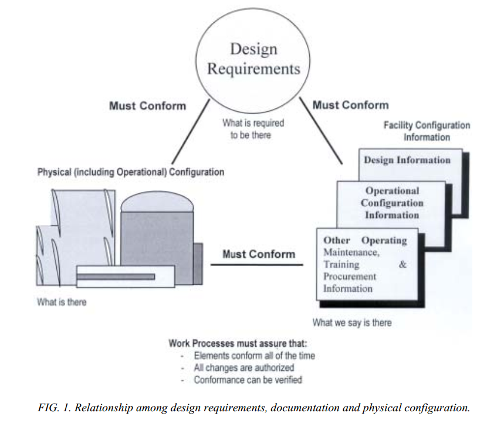
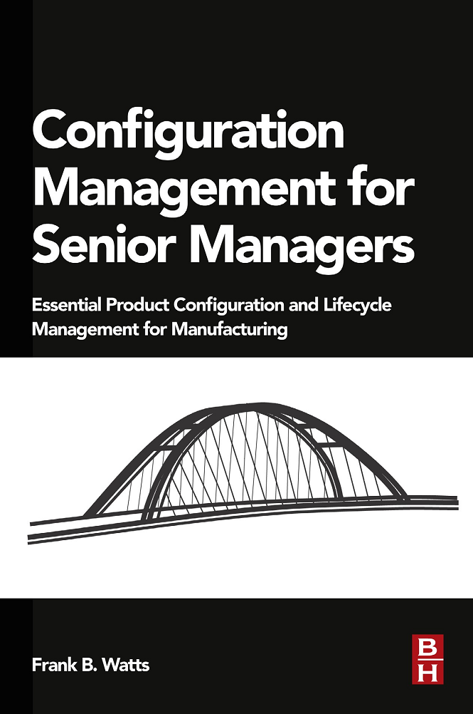

# Управление конфигурацией

DevOps, инженерия внутренней платформы разработки, SRE — это самые разные имена метода эволюционной (иногда и не очень эволюционной, там будет «управление жизненным циклом») инженерии производственной платформы как разработки и развития внутреннего «завода», а затем поддержания его сервисов для разработчиков.

Но это не все имена, есть и много других «синонимов с нюансами», каждый из которых имеет свои оттенки смысла и используется в инженерных процессах для систем разной природы. Так, часто инженерия инженерной платформы приходит под именем «управление конфигурацией и изменениями», хотя и с нюансами:

* Ничего не говорится о собственно платформе как наборе инструментов.
* Ничего не говорится о явном выборе вида инженерного процесса, поэтому не обсуждается непрерывность изменений.
* Ничего не говорится об испытаниях (хотя в управление конфигурацией и включают проверку того, что конфигурация системы соответствует конфигурации из проектной документации, «то, что сделали — это то, что описывали, что планировали»).

Как видим, это урезанные практики DevOps, но в машиностроении вы чаще встретите именно этот термин, наряду с «жизненным циклом изделия» как названием для инженерного процесса. Иногда даже говорят об «управлении инженерной документацией», это уж совсем анахронизм, но в государственных проектах это так, а также это может встречаться в сильно зарегулированных инженерных сферах — строительстве, авиации. Часто при разговоре об «управлении инженерной документацией» теряется акцент на том, что конфигурация системы — это сами части системы в физическом мире, а документация с описаниями системы важна, но по большому счёту их конфигурация вторична к конфигурации системы, она нужна только для того, чтобы создавать и эксплуатировать само воплощение в физическом мире. Ну и сама идея непрерывной разработки, непрерывной интеграции, непрерывного ввода в эксплуатацию при этом теряется абсолютно, ибо акцент только на описания, интеграция/сборка, разворачивание с наладкой и ввод в эксплуатацию отсутствуют.

Если отсутствует управление конфигурацией (в том числе конфигурационный учёт — документирование состояния важных объектов проекта, прежде всего целевой системы и её документации, состояния систем графа создателей), то в проекте появляется огромное количество так называемых «конфигурационных коллизий»: когда одна часть системы и/или описание системы не соответствует другой. Вот пример такой коллизии: «в информационной модели, которую отдали строителям, сплошная стена. В информационной модели, которую отдали монтажникам, через стену в этом месте идёт трубопровод. Что делать — разбивать свежепостроенную стену и пропускать трубопровод в этом месте, или перепроектировать трубопровод, но стену не трогать?!». Или «на совещании в середине прошлого месяца мы приняли решение делать ракету диаметром 5 метров. А вы продолжаете после этого целый месяц проектировать ракету диаметром 4.5 метров. Как это могло произойти?!». Вот традиционный пример из программной инженерии: «Ваше приложение не будет работать в нашей операционной системе, ибо оно пользуется новым фреймворком, который наша старая версия операционной системы не поддерживает. Нет, мы не планируем обновлять версию нашей операционной системы, это вы сделайте что-нибудь со своим приложением».

Конфигурационные коллизии обходятся проекту очень дорого, они требуют переделывать (re-work) большие куски проектов, часто по нескольку раз, это не lean, не элегантно. **Советы типа талебовского «не будь лохом», традиционные рекомендации «не надейся на авось», «наведите порядок** **в проекте», пожелания «не прощёлкивать** **важные события»—** **они все** **чаще всего про недопущение конфигурационных коллизий, то есть про постановку** **метода** **управления конфигурацией и изменениями.**

Иногда конфигурационными коллизиями считают неизбежные для систем конфликты между системными уровнями (один уровень требует скорости и лёгкости, другой уровень готов выдать мощность для скорости, но за счёт тяжести — и это могут считать «несоответствиями в конфигурации»). Правомерно ли так считать? Это вопрос открытый. Мы считаем, что если конструкцией достигнуто субоптимальное проектное «расчётное» решение в рамках достижения какого-то квазиустойчивого/неустроенного состояния (frustration, как это обсуждалось в руководстве по системному мышлению), то это не конфигурационная коллизия.

**Конфигурационная коллизия—** **это когда противоречия настолько сильно проявляются, что система становится неуспешна.** Скажем, актуальная целевая система при заявленной «разовой водопадной разработке с однократным вводом в эксплуатацию» не соответствует документированным требованиям к этой системе: хотели сделать систему быстрой, поставили тяжёлый аккумулятор, и удовлетворили требованию скорости, но не требованию к массе системы, требуются ещё итерации в разработке, но их не предусмотрено ни одним документом, финансирование поэтому кончилось, проект окончен, система так и осталась неуспешной.

Часто в управлении конфигурацией, которая унаследовала идею «требований» под развалом/breaking конфигурации (терминология тут может отличаться, например, будут говорить о misconfiguration) ещё понимают и тройное соответствие: конфигурации системы, конфигурации описаний и конфигурации требований! Например, так принято в атомной энергетике по до сих пор действующему документу 2003 года (расцвет моды на инженерию требований) «Configuration management in nuclear power plants»[^r8-1]:

В этом документе также сказано, что в среднем 25% аварий, зарегистрированных в системе отчётности об авариях атомных станций, могли быть вызваны ошибками в конфигурации или недостаточностью в управлении конфигурации. Как о таком думают сейчас? Описания должны быть версионированы (что должна делать система — это тоже ведь её описание, а «требований» — нет), конфигурация — это физическая конфигурация, хотя иногда могут говорить и о конфигурации описаний как набору версий, соответствующей конфигурации системы. **Надо внимательно смотреть по смыслу, что говорит та или иная терминология. Нельзя опираться на «словарные значения» или «значения из стандартов», в каждом проекте вы обнаружите какие-то особенности.**

Основные положения управления конфигурацией на примере бумажного документооборота (нет современных IT-решений типа «облачная система получения сводных заказных спецификаций») в машиностроительном предприятии на кругозорном уровне и даже без отсылок к стандартам системного управления конфигурацией вроде стандарта именования инженерных рабочих продуктов IEC 81346 (он хорош для отражения нескольких разных способов разбиения системы на части, это обсуждалось в руководстве по системному мышлению), хорошо раскрыты в короткой (188 страниц) книге Frank Watts «Configuration Management for Senior Managers» (2015).

Существует и неофициальный русский перевод этой книги. Несмотря на упомянутые недостатки (бумажный документооборот, нет использования современных инженерных стандартов), эта книга содержит в себе довольно много опыта управления конфигурацией в традиционных машиностроительных производствах и популярно даёт представление об основных понятиях этого метода. Книга оказывается очень полезна айтишникам, которые плохо представляют себе, как устроено материальное производство в «реальном секторе», и даже не «современное производство», а вообще производство/manufacturing: сами программисты работают с кодом, который превращается в программы — и им неведомы проблемы реального производственного мира. А менеджеры вдруг начинают после этой книги понимать, о чём им пытаются иногда говорить инженеры. Много наших инженеров-менеджеров находили книгу очень полезной для развития инженерного кругозора.

Книга выделяет в управлении конфигурацией несколько составляющих методов, выпячивая понятия выпуска/release и передачи/hand-over рабочих продуктов, включая выпуск и передачу данных. Эти понятия отличаются от delivery/«пуск в эксплуатацию». По факту книга ограничивается простым «собрать все части системы без пропусков и лишних деталей и передать в комплекте кому-то вовне предприятия», не идёт и речи о тестировании, защите и безопасности, архитектурных тестах и всём прочем, о чём говорится в DevOps. Но знать эту книгу полезно, ибо вы не можете ждать десятка лет, пока все «железные» инженеры проникнутся идеями DevOps, а все DevOps проникнутся проблемами «железных инженеров».

Центральным понятием для управления конфигурацией в этой книге является **выпуск/release**, в том числе **передача/hand-over** рабочих продуктов (физических систем и их частей, а также документов с описаниями). данными жизненного цикла). Книга выделяет следующие составляющие управления конфигурацией (которое само часть инженерии производственной платформы), и обратите внимание, что в принятом в книге инженерном процессе изменения утверждаются независимыми экспертами (управление изменениями идёт как отдельный метод), это оказалось в непрерывной инженерии непродуктивно, и мы это уже отмечали:

* **Выпуск/releaseрабочих продуктов, в том числе hand-over данных.** Это о том, как отслеживать целостность мегамодели и системы-в-железе, а также соответствие их версий друг другу. Если у вас есть три варианта архитектурного описания и четыре вполне рабочих прототипа, то как узнать, что из этого было отвергнуто, а что продолжило дорабатываться и станет когда-нибудь окончательной архитектурой и вариантом системы с этой окончательной архитектурой.
* **Управление изменениями**(change management) как 1. то, что происходит с запросами на изменения (запросы иногда заканчиваются изменениями проекта/design) 2. сами изменения проекта/design (изменения иногда заканчиваются выпуском)
* **Выпуск заказных спецификаций** (BOM, bill of materials). Иногда это отдельные спецификации того, что будет заказано у внешних подрядчиков (приобретение/acquisition), иногда это полный список (свод) по всему проекту: сводная заказная спецификация. Конечно, это специфика главным образом машиностроения и промышленного производства, для систем другой природы будет совсем другая терминология. Но это верно для всей обсуждаемой книги Frank Watts: нужно уметь прочесть её содержание «безмасштабно», вычленить основные мысли про управление конфигурацией, понять необходимость управления конфигурацией в самых разных проектах создания самых разных систем. В целом метод выпуска заказных спецификаций связан с выборкой из мегамодели данных проекта правильных с точки зрения организации логистики кусков (это не bounded context, не предметные области! Не функциональные описания), «нарезкой мира на передаваемые между исполнителями предметы работы», к которым дальше применяются логистические процедуры — т.е. вычленить те «рабочие продукты»/«предметы работы», которые перемещаются между инженерными организациями.
* **Управление** **вариантами** (variant management). Часто выпускается не одна какая-то система серийно, но несколько вариантов системы, в том числе и каждый отдельный уникальный вариант (mass customization, например, каждый отдельный автомобиль или компьютер может идти в какой-то уникальной комплектации).

Книга Frank Watts даёт много интересных советов и по организации службы/подразделения управления конфигурацией на машиностроительном предприятии. Например, даётся совет подчинять службу управления конфигурацией инженерам, а не операционным менеджерам. Управление конфигурацией в его разных формах (в том числе форме инженерии платформы) сегодня — это «серая зона» системной инженерии, ибо с одной стороны речь идёт о принятии технических решений по поводу целевой системы (разнообразные информационные модели системы), а с другой стороны это управление/management, то есть решения по поводу создателя (выделяемые создателем ресурсы на проведение работ по выбранным «технарями» методам работы).

«Технари», повторимся, тут условны — в нашем курсе мы всех называем «инженерами». Инженеры эти могут быть электромеханиками, коучами, хореографами, политиками, программистами, но мы считаем их занимающимися целевой системой, её созданием и развитием как изменением мира к лучшему. А создателем (это же люди, организация!) и его ресурсами обычно занимаются менеджеры, в данном случае операционные менеджеры, логисты. Поэтому DevOps с инженерией платформы (никакого отношения к операционному менеджменту!) иногда пытаются объединять с менеджментом: вроде как у менеджмента и DevOps общая цель — построить такого создателя (систему разработки и производства), чтобы от момента запроса на новую фичу до момента её получения клиентом проходило как можно меньше времени.

«Как можно меньше времени» — это задача операционного менеджмента. Но Frank Watts всё равно даёт совет: подчиняйте людей, которые этим занимаются, инженерам (главному инженеру предприятия, который занимается методом производства и станочным парком, а не главному инженеру проекта, который занимается целевой системой, или CIO, если речь о софте, а не архитектору конкретной целевой системы), а не менеджерам. Эта «серая зона» между инженерией и менеджментом тяготеет всё-таки к инженерии, DevOps сегодня прежде всего инженеры платформы — они строят завод-автомат, это не менеджмент.

В руководстве по системному менеджменту будет рекомендация в проекте прежде всего наладить управление конфигурацией, то есть «навести порядок», чтобы избавиться от операционных коллизий. И только потом заняться операционным менеджментом как следующим необходимым методом. Ибо если работа с вашей производственной платформой порождает конфигурационные коллизии в количестве, то ускорение работы будет увеличивать число этих коллизий: вы будете просто производить больше беспорядка в единицу времени. Чтобы об этом помнить, будет дана мантра распожаризации/lean/«элегантной работы», о которой говорилось ещё и в руководстве по рациональной работе. Вот её кратчайшая форма (помним, что это фокусировка на логической последовательности процесса, но не «шаги работы»):

* Прекратить делать ненужное (просто прекратить!). Будет меньше работы! Это инженерия прежде всего.
* Меньше переделок за счёт управления конфигурацией системы, работ, данных и тем самым уменьшения конфигурационных коллизий! Это инженерия прежде всего, хотя и с выходом на менеджмент. Миллионы индивидуальных деталей и пять-десять операций с каждой надо отследить, ни одной не пропустить, ни одной не потерять!
* Уменьшать время ожидания (цикл непрерывных улучшений Голдратта: убирать ограничения, но только в тщательно вычисленных местах, не везде). Это операционный менеджмент: TameFlow в проектировании, ERP[^r8-2] «по Голдратту» в стройке.
* Собственно развитие: изменение инженерных практик работы по самым долгим операциям. Но не раньше, чем пройдёте три предыдущих пункта.

Прохождение работ по этой мантре должно привести к тому, что «тушение пожаров» прекратится, пожары перестанут возникать!

Но эта мантра будет работать только тогда, когда вы сначала выберете метод инженерной работы, выдержите все споры по поводу выбора «непрерывного ввода в эксплуатацию», «водопадной» разовой приёмки-сдачи или какого-то их гибрида, а затем выберете методы управления конфигурацией и изменениями, управления информацией. И только потом вы сможете организовать людей на выполнение какого-то метода управления работами (например, TameFlow). А потом? А потом нужно будет улучшать сам продукт, улучшать сервис создателя-провайдера, улучшать методы проектирования и изготовления, сборки, разворачивания системы, введения её в эксплуатацию. Но всё это только после того, как в рамках выбранного вами инженерного процесса налажена работа по выбранному методу DevOps (включая включение в «конвейер» испытаний/тестирования, защиты, мониторинга и т.д.).

**Начинать** **заниматься** **управлением** **конфигурацией** **в проекте** **нужно с себя:**

* Не пишешь — не думаешь. Управление конфигурацией собственных идей. Мышление письмом, на память надежды нет. Все ходы записываются, как в шахматных партиях: или конфигурацию шахматной партии держит доска, которая не может быть забыта или неправильно вспомнена, или запись шахматной партии (что много удобнее: её можно переслать через чат, а физическую шахматную доску не перешлёшь). Собранность у человека поддерживается инструментально, голым мозгом не работают, биологической памяти не верим, она сбоит!
* Всё, что кому-то передаётся (hand-over, release), должно оставлять след во внешней по отношению к мозгу памяти, а не только запоминаться головой. Например, должны храниться входящие и исходящие письма, полуфабрикаты и готовые рабочие продукты. Если было не письмо, а разговор, то должен остаться след: minutes/заметки по содержанию разговора, issue в issue tracker, записи в case file (папку «Дело №\_\_\_»). Над этим всем должен работать компьютерный поиск, чтобы не искать перебором или «я это оставлял где-то вот тут, но где это лежит сейчас, почему не видно?». Если это материальные рабочие продукты, то работаем со складским учётом: ищем по карточкам, быстро находим.
* Все предстоящие дела (работы, а не только рабочие продукты) записываются, на память надежды нет. Используются разные системы ведения дел по мотивам старинного «Getting things done»[^r8-3] или «Джедайских техник»[^r8-4].
* Все рабочие продукты имеют версии, для которых должно быть уникальное имя и время последнего изменения, а также должно быть известно кто, что, когда изменял. Нужно, чтобы можно было сравнить «что было» и «что стало» после изменения. Прошлые версии документов сохраняются «на всякий случай» (ведётся бэкпапирование).

Всё то же самое нужно делать в масштабах всего проекта, какой бы большой он ни был (и чем больше проект, тем строже это отслеживать: маленький беспорядок может нанести существенный убыток в большом проекте).

Тем самым управлять конфигурацией нужно для всех систем проекта:

* Целевой системы и её описаний, в том числе учёт незавершённого производства (сырьё, склады). Это относительно просто и понятно, если речь идёт о программном обеспечении или даже атомной станции. Если вы занимаетесь социальной инженерией, то «конфигурация сообщества и его описаний» будет представима более тяжело, а для общества так и вообще непредставима.
* Систем в окружении (чтобы не оказалось, что появились конфигурационные коллизии между целевой системой и системами в окружении)
* Систем в графах создателей (организация должна быть документирована, включая органиграмму и какие оргроли играют какие оргзвенья, то есть кто и какими методами выполняет какие работы, а ещё должен вестись операционный финансовый учёт, кадровый учёт, учёт оборудования и помещений, и т.д.).

Управление конфигурацией отдают обычно инженерам, но недостаток такого организационного решения в том, что менеджеры после этого забывают о необходимости управлять конфигурацией. А ещё у менеджеров явный сдвиг обычно от работы с конфигурацией системы на работу с данными, поэтому они будут предпочитать говорить «управление информацией», имея в виду «информацию о конфигурации системы». Но нет, нам надо убеждаться, что управляем конфигурацией системы, а не только конфигурацией описания системы!

Современное управление конфигурацией включает в себя также отслеживание и работ: структуру разбиения работ/WBS (как плановую, так и фактическую) тоже ставят под управление конфигурацией, проверяя коллизии наличия работ без наличия системы, с которой ведутся работы и наоборот, наличия систем, с которыми не ведётся никаких работ. Это проще понимать при управлении проектами (up-front planning), хуже при управлении кейсами, но кейсы тоже ставят под управление конфигурацией, отслеживают — в платформе это будет специальный софт issue tracker (issue — это вопрос/проблема, которую решают работы кейса).

WBS тоже может иметь конфигурационные коллизии, если собирать его по разным подрядчикам работ, но главное — менеджеры могут этот WBS не синхронизировать по части предметов работ, ибо это «по ведомству инженеров, а WBS — это наше». Нужно отслеживать, чтобы мероприятия метода управления конфигурацией проводились как по линии целевых систем, так и по линии систем создания, и они были согласованы между собой (так, метод управления конфигурацией/информацией у инженеров должен быть согласован с методом управления данными у менеджеров, и отслеживать нужно не только их наличие, но и согласованность их друг с другом).

Управление конфигурацией требует жёсткой дисциплины. Пример правила, которое подчёркивает важность управления конфигурацией: **«Если делается какая-то работа, которая не учтена в конфигурации работ—** **считаем, что работа не делалась». Если сотрудник что-то делает, что не учитывается в системе управления конфигурацией (скажем, работает с версиями системы, которых нет в системе управления конфигурацией), и это происходит систематически, то он может быть уволен: разбираться с неизбежными при этом конфигурационными коллизиями дороже, чем возможная польза от работы этого сотрудника. Недисциплинированные в части управления конфигурацией сотрудники безжалостно увольняются, их не терпят.** **Элегантная работа—** **это без лишней работы, но управление конфигурацией не лишняя работа, без неё число переделок из-за конфигурационных коллизий существенно тормозит все работы!**

Главные понятия управления конфигурацией:

* **Конфигурация/configuration** — это система, для которой известна **версия** каждого её модуля и общий состав этих модулей, в том числе обеспечено соответствие конфигурации документации, корректно описывающей эти (возможно, ещё будущие, пока не созданные) модули. Если какие-то части системы или документация ведут к **конфигурационным коллизиям** (неработоспособности из-за несогласованности версий модулей), то говорят о «разваленной/broken конфигурации»/«неверной конфигурации»/misconfiguration. Конфигурация системы — это сама система, а не её описание! Конфигурация компьютера, собранного из многочисленных комплектующих — это сам компьютер! Конфигурацию чаще всего относят к моменту эксплуатации.
* **Конфигурационная единица/configurationitem** — она определяется логистически как «единица передачи», «операционная единица», а не просто конструктивно. У инженеров может быть и более мелкое конструктивное деление. Так, у транзистора будут различаемые инженерами затвор, сток, исток — но конфигурационной единицей будет транзистор в целом, а не его части, которые отдельно не изготавливаются и не передаются.
* **Версия/version** — это конфигурация модуля/комплектующего в каком-то его варианте (эти варианты могут меняться, версии поэтому отслеживаются и именуются). В проекте работают с какими-то версиями модулей, из которых составляют в конечном итоге конфигурацию системы. Версии больше акцентируются на времени сборки/создания из них конфигурации, а конфигурация — это понятие, более центрированное на времени эксплуатации (скажем, в софте «версии» лежат в системе управления версиями, а на компьютерах датацентра работает «конфигурация»).
* **Базис/baseline** — это конфигурация, которая утверждена специальной административной процедурой, обычно включающей дополнительные проверки на отсутствие конфигурационных коллизий. Выпуск/release происходит именно базисов, а не «рабочих версий». Часто даже выделяют отдельно управление конфигурацией как поддержание целостности версий и управление изменениями как административные процедуры по внесению изменений в базисы (назначению какой-то «рабочей» версии «базисом»). Удивительно, но **идея о том, что какие-то конфигурации просматриваются более тщательно, чем другие и поэтому называются базисами—** **не работает, есть на эту тему исследования** (подробней в книге «Accelerate»), но легенды живы, особенно в машиностроении, где может быть серийный выпуск на основе какого-то базиса. Современный подход тут — continuous integration, базис поддерживается постоянно, рабочие версии мимолётны.

Понятие конфигурации и версии очень часто путаются друг с другом, но в целом признаётся, что управление конфигурацией (configuration management, реже configuration control) не сводится исключительно к управлению версиями (version control), ибо в управлении конфигурацией есть и много других стоставляющих: управление данными, выпуск/release рабочих продуктов и их передача/hand-over между исполнителями работ, и т.д.

В управление конфигурацией включают часто как отдельный важный метод именования/кодирования рабочих продуктов и их документированных описаний: назначение **идентификаторов/identifiers** (имён, которые однозначно позволяют отличить названный такими именами объект от других объектов проекта), **обозначений/designators** (имя-идентификатор, который учитывает вхождение объекта в какую-то систему в рамках какого-то из системных разбиений по какому-то аспекту, IEC 81346-1:2022 для проектов материального производства как раз стандарт для введения обозначений, которые как-то могут пониматься инженерами одинаково в самых разных проектах), иногда стандарт **обозначений** называют стандартом **кодировки**. Выбор и поддержание идентификации, обозначений/десигнаторов/кодировки — важная часть управления конфигурацией.

[^r8-1]: <https://www-pub.iaea.org/MTCD/Publications/PDF/te_1335_web.pdf>

[^r8-2]: <https://en.wikipedia.org/wiki/Enterprise_resource_planning>

[^r8-3]: <https://gettingthingsdone.com/>

[^r8-4]: <https://mnogosdelal.ru/>
