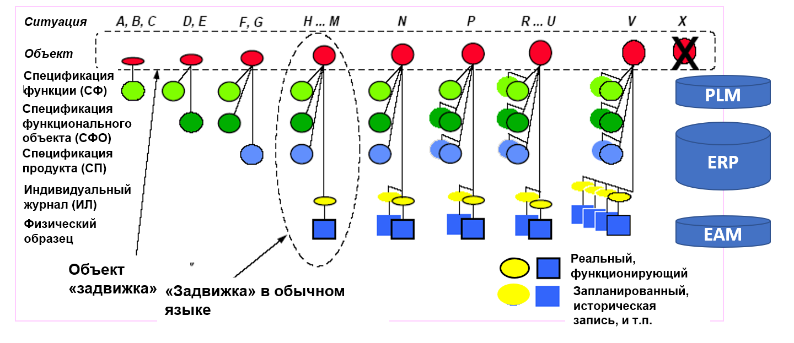
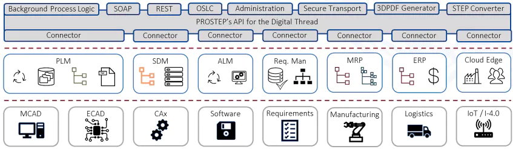

# Интеграция данных

Управление конфигурацией, управление изменениями, управление инженерной документацией, управление информацией, интеграция инженерных данных (данных жизненного цикла, данных инженерного процесса), создание **цифровых двойников**[^r8-1] с использованием **цифровой нити**[^r8-2]**—** эти все методы близки до неразличимости, нюансы невелики. Во всех этих методах инженерии внутренней платформы разработки:

* Моделируй разные аспекты самых разных систем при помощи самых разных моделеров. Иногда это проектирование (модели нет, системы нет, придумываем модель, потом её реализуем), но иногда создание (или хотя бы модификация) моделей путём reverse-engineering. Это происходит с надсистемой, когда в её состав вписывают целевую систему в рамках составления гипотез по концепции использования, но также и при создании модели as built, потому как не всегда в реальной физической системе удаётся соблюсти её соответствие проектной/design модели (модель «as built»/«исполнительская модель», например в строительстве до сих пор строят не роботы, и результат в физическом мире будет не совпадать с исходной информационной моделью: нужно будет привести модель в соответствие с жизнью). Тут используются моделеры, системы автоматизации проектирования (САПР/CAD), раньше говорили «автоматизированные рабочие места» (АРМ, но этот термин уже сильно устарел). DevOps инструментарий в программной инженерии должен учитывать и IDE (interactive development environment)[^r8-3].
* Используй версионирование: всегда знай, с какими версиями моделей ты работаешь. Для этого храни версии не в моделере, а собирай их в системе ведения версий (репозитории моделей), где ты сможешь ещё и сказать, какие версии каких моделей соответствуют друг другу, а также проверить наличие конфигурационных коллизий. Давай доступ в том числе и внешним проектным ролям (eXperience platform).
* Отслеживай не только модели, но и продукт, который построен по этим моделям. Знай всегда конфигурацию продукта (что из каких версий частей модели вошло в отгружаемую или даже уже эксплуатируемую систему). Конфигурация системы — это сама система, а не её описание, не её модель.
* Интегрируй, то есть управляй конфигурацией и проверяй на отсутствие конфигурационных коллизий, чтобы найти их как можно раньше в ходе разработки, исправить до того, как начали создавать физическую систему.
* Интегрируй не только информацию о целевой системе/продукте, но и о проекте (графе создателей, то есть информацию менеджеров, информацию проектного управления). DevOps инструментарий в инженерии должен учитывать не только CAD/CAM/CAE с PLM или eXperience platform, но и ERP[^r8-4] (enterprise resource planning, планирование потоков полуфабрикатов/ресурсов уровня предприятия) и MES[^r8-5] (manufacturing execution system, планирование уровня цеха).
* Не останавливайся на разработке: продолжай моделировать систему и отслеживать её конфигурацию в ходе её эксплуатации, это даст переход к цифровому двойнику.

Проблемы тут в том, что всем этим будут заниматься информационные системы самых разных поставщиков, они как «коллективные экзокортексы» будут принадлежать самым разным фирмам, предметом их работы будут самые разные аспекты самых разных (целевая, надсистема, подсистемы, создатели в их графах) систем, эти системы будут в самых разных состояниях готовности в самых разных версиях, и у этих систем будут самые разные физические, финансовые и иные модели, мета-модели и мета-мета-модели, которыми руководствовались разработчики этих систем. Грубо говоря, у одной колёсной системы будет «путь в метрах», у другой «угол поворота колеса в радианах» (что позволяет вычислить путь в метрах, но это ещё нужно догадаться, как). И это самый простой случай.

По факту в интеграции данных речь идёт о переводе с одного языка на другой, и представьте, когда в проекте родные языки сотрудников китайский, суахили и испанский. На каком языке будет общение? На «нейтральном», которым служит английский, на котором никто не говорит! Это была основная идея «цифровой нити»: переводить всю информацию в «нейтральный формат» и тем самым налаживать обмен информацией между информационными системами.

Давайте рассмотрим жизненный цикл какой-нибудь задвижки на трубопроводе.

Объект «задвижка» появляется в проекте/design задолго до появления физической задвижки на трубопроводе. Это отражено на рисунке, показывающем состояния экземпляра задвижки по мере прохождения ей состояний от «задумана» до «выведена из эксплуатации»:

В системе проектирования трубопровода процессный инженер разрабатывает спецификацию функции перекрытия трубопровода, после этого говорит, что трубопровод будет перекрываться функциональным объектом «задвижка» с какими-то определёнными характеристиками, появляется спецификация уже не только функции задвижки, но и её самой (функция — это поведение ролевого объекта, функция задвижки — перекрывать поток). Далее идёт конструирование/проектирование: для функциональной задвижки определяются параметры конструктивного объекта задвижки как типа возможного конструктива/модуля, и этот объект с подходящими параметрами ищется у производителей задвижек.

Когда найден производитель подходящей по параметрам задвижки, там покупается конкретный физический образец задвижки с каким-то серийным номером, и на него заводится индивидуальный журнал ремонта и обслуживания задвижки. «Задвижка» в обычном языке означает вот это всё вместе: физический объект, изготовленный каким-то заводом, который играет роль функционального объекта в создаваемой системе.

Далее можно представить замену этой задвижки другой с каким-то другим серийным номером, это тоже нужно будет отразить в информационной модели системы. Далее можно представить, что как-то меняем систему и меняем спецификацию продукта, а то и функционального объекта, а то и самой функции (скажем, поменялся состав жидкости, давление жидкости, и теперь нужно использовать задвижки с другими характеристиками).

Обычно для киберфизических систем функциональное проектирование ведётся в CAD, но дальше информация хранится в системе PLM (или eXperience platform, но прогресс дошёл отнюдь не до всех компаний реального сектора). В PLM системе обычно не хранятся серийные номера физических заглушек, а информационная модель там «в типах», ибо проектирование всегда ведётся «в типах»: информацию о требуемой заглушке передадут в ERP-систему (Enterprise Resource Planning), которая отследит закупку системы у какого-то поставщика, её логистику и выдачу в монтаж (логистика и операционный менеджмент ресурса «заглушка»), а затем эту информацию передадут в EAM-систему (enterprise asset management), где будут вести индивидуальный журнал эксплуатации заглушки как актива (в последнее время вот такие EAM-системы называют всё чаще «цифровыми двойниками», ибо речь идёт о стадии эксплуатации и чаще и чаще эти заглушки уже не «ручные» из косного вещества, а с датчиками и моторчиками — роботизированные, и цифровой двойник поддерживает модель актуального состояния эксплуатирующейся заглушки). PLM-система по-прежнему при этом будет содержать информацию о том, какую функцию выполняет эта заглушка, а ERP-система будет помнить, у кого её купили и что там говорилось в договоре покупки — это очень пригодится, когда что-нибудь с этой заглушкой пойдёт не так (скажем, поломается, в том числе поломается в рамках гарантийного срока, или её потребуется заменить или оставить в ходе при модернизации всего трубопровода).

Разные цвета на рисунке — разные по типу «задвижки», они и называются по-разному (чтобы отразить в названии их тип) в разных информационных системах:

* Зелёный цвет — это функциональный объект «комплектующее», с ним работает PLM-система
* Синий цвет: кружок — это конструктивный объект «предмет снабжения», с ними работает ERP-система, а квадрат — это «установленное оборудование», с ним работает EAM, и там это может называться ещё и «актив» (asset).
* Жёлтый цвет — это документ с описанием конструктивного объекта, с ним работает EAM (цифровой двойник).

По большому счёту, мы можем заменить заглушку в киберфизической системе на сотрудника в организации. Тогда в оргмоделере предприятия будет определён метод, который должна будет выполнять какая-то оргроль и сказано, какая это оргроль, а ещё определено оргзвено, выполняющее эту роль. Этот оргмоделер будет абсолютно аналогичен САПР (CAD), а ещё там будет хранилище данных такого САПР, аналог PLM-системы. Затем в софте службы кадров будет проведён поиск специалиста или специалистов, которые могут выполнить эту работу (аналог ERP-системы). И в том же софте службы кадров и софте бухгалтерии появится «досье» на нового сотрудника, где будет накапливаться информация о его повышениях квалификации, выговорах и премиях (аналог EAM системы, цифрового двойника).

Конечно, информационных систем в подобных проектах много больше, чем три, и управление информацией занято тем, чтобы исключать медленные и дорогие со множеством неизбежных ошибок (ведь это работа людей!) передачи данных путём «прочесть глазами в одной системе, вбить руками в другой системе» из одной системы в другую. Интеграция информации жизненного цикла делается не глазами-руками, а программами конвертирования информации. Эти программы называют часто «цифровой нитью». Вот рисунок, на котором схематично изображена такая «цифровая нить» для производственных систем:

Серый прямоугольничек — это разные программные интерфейсы для самых разных информационных систем, которые могут встретиться в жизненном цикле системы (читай: встретиться в организациях-создателях в самых разных графах создателей), и там важны коннекторы/адаптеры/конверторы форматов данных в какой-то нейтральный формат. Этих форматов тоже множество, никакого аналога «рабочего английского», как в естественных языках, для цифровых нитей не было разработано — **каждая фирма-поставщик цифровой нити изобретает свой вариант нейтрального формата и даже ухитряется сделать такой формат международным стандартом, причём стандартов таких удивительно много, поэтому разные цифровые нити жёстко конкурируют на рынке и плохо совместимы друг с другом.**

Цифровые нити работают с интеграцией данных нескольких разных видов:

* **Операционные/транзакционные данные**, то есть данные о конкретных экземплярах целевой системы и её описаний, а также действиях с ними: от проекта/design и проекта/project до эксплуатационных данных целевой системы, мы как раз обсуждали в этом разделе именно эти данные в их разнообразии.
* **Мастер-данные (masterdata)**[^r8-6], которые используются в нескольких проектах предприятия, работающих с самыми разными целевыми системами. Это чаще всего данные по клиентам и поставщикам.
* **Справочные данные (referencedata)**[^r8-7], которые используются в бизнес-эко-системе, то есть одинаковы для проектов самых разных предприятий: нормативно-справочная информация, стандарты, единицы измерения и т.д.

Интеграция данных работает с двумя основными сценариями:

* Одно- или двухстороннего доступа из одного приложения в другое.
* Разовый перенос информации из старого приложения в новое (это называют «миграция данных», data migration[^r8-8])

Для систем другой природы управление конфигурацией совсем не так очевидно устроено, и цифровая нить может быть устроена совсем по-другому. Например, когда мы говорим о связывании цифровой нитью информационных систем государства, то встаёт множество вопросов по защите персональных данных, смещению баланса власти между людьми и чиновниками, превращению государства в полицейское (любой чиновник будет знать о любом гражданине много больше, чем можно себе представить — это приводит к злоупотреблениям, ибо власть развращает, а абсолютная власть развращает абсолютно). Но если речь идёт о так называемых «госуслугах» (которые вам, конечно, вменяют — вы их берёте не добровольно, а подчиняетесь требованиям закона), то становятся ненужными бумажные справки: то, что какая-то госслужба знает о вас всё, оказывается в этом случае вам же и выгодным. Как всегда в эволюции, цифровая нить даёт огромные новые возможности развития информационных систем в инженерных проектах, но она же порождает конфликты, приводящие к неустроенностям/frustrations, множеству примерно одинаковых по оптимальности самых разных решений.

«Цифровая нить» (digital thread) тут тоже одно из многих маркетинговых имён, продолжающих увеличивать количество терминов, использующихся для указания на информационные системы и методы, помогающие управлять конфигурацией и изменениями в инженерных проектах. Эта же «цифровая нить» в корпоративных информационных системах разных провайдеров сервисов (банков, страховых компаний и прочих, где речь не идёт о традиционных продуктах-вещах) будет называться сегодня **гиперавтоматизация/hyperautomation**[^r8-9] (RPA, robotic process automation[^r8-10] как автоматизация заполнения экранных форм, когда-то придуманных для работников-людей, плюс добавление программ искусственного интеллекта, помогающего распознавать отчёты одних программ и создающих затем содержание для заполняемых при помощи RPA форм). В любом случае все такие проекты относятся к интеграции данных проекта какой-то системы, и речь идёт об **обеспечении взаимодействия информационных систем путём их интеграции, унификации или федерирования.** Это рассматривалось в руководстве по системному мышлению в подразделе «Платформы и технологические стеки», там упоминался стандарт налаживания взаимодействия ISO 11354-1:2011, framework for enterprise interoperability[^r8-11]. Помним, что принято говорить «интеграция информации» или «интеграции данных» (иногда добавляют «проекта», «жизненного цикла», «предприятия», «инженерного процесса» — по вкусу), но по факту это обычно федерирование (информационные системы ничего друг о друге не знали до федерирования), очень редко унификация (информационные системы соответствуют одному стандарту) и почти никогда — именно интеграция (информационные системы проектировались специально для совместной работы) в смысле ISO 11354-1:2011.

В каком направлении развивается метод цифровой нити? Сегодня основное — это так называемая «семантическая интеграция данных», то есть использование конверторов из одной формально-логической схемы данных в другую. Но она, увы, плохо работает: разные формально-логические схемы оказываются несовместимыми друг с другом. Поэтому надежда на системы искусственного интеллекта, которые для совмещения разных объектов из разных информационных систем могут использовать естественный язык и непрерывное (а не дискретное формально-логическое) многомерное пространство значений. Идея активно обсуждается[^r8-12], но реальных производственных приложений пока нет.

Использование цифровой нити в управлении конфигурацией и изменениями даёт возможность задействовать параллельную инженерию (concurrent engineering)[^r8-13] в проектах, которые подразумевают «разовую» одноцикловую инженерию (строительные проекты тут как пример). При параллельной инженерии все работы по разным методам инженерного процесса идут почти одновременно, «в параллель», то есть замысливание (в частности, запросы новых возможностей/features), проектирование, изготовление и эксплуатация системы идут одновременно, «в параллель».

Но как можно строить, например, дом, если ещё не закончен его проект? Наверняка же будут многочисленные коллизии! Будут закупаться не те количества материалов, которые нужны, будут возводиться стены там, где они не предусмотрены ещё не сделанным проектом, много чего будет! Но нет, благодаря современным методам управления конфигурацией и изменениями удаётся избегать конфигурационных коллизий, а времени на разработку и изготовление уходит меньше, и даже эксплуатация начинается раньше: пока строят правое крыло здания, в левом уже живут, а башенку уже заканчивают проектировать — всё с разными частями системы происходит в разное время, а управление конфигурацией и изменениями плюс высокая точность изготовления не допускают, чтобы все эти части будущей системы вдруг не состыковались друг с другом.

Ещё один тренд — это цифровая нить, связывающая системы проектирования и системы изготовления. Раньше передача данных проекта/design осуществлялась путём перевозки грузовиками бумажной проектной документации из конструкторских бюро на завод, или из проектных институтов на стройку. Теперь передача данных проекта/design происходит онлайн, причём при необходимости происходит конверсия форматов. Это не так просто, ибо часто в момент проектирования контрактор по изготовлению ещё неизвестен (ибо ещё непонятно, что будет заказываться, непонятно, сколько будет стоить изготовление). Идеал, когда конструктор или проектировщик и технолог организации-изготовителя/производителя системы сидят рядом в ходе проектирования и выполняют работу вместе (так называемое «проектирование для изготовления»/design for manufacturing), соблюдается редко. Но такое тоже случается всё чаще и чаще: компании вроде SpaceX и Tesla собирают проектирование и изготовление вместе, проектировщики и технологи там действительно работают вместе, и это в таких сверхсложных системах, как современные ракеты, оказывается выгоднее, чем размещать разовые заказы «где-то в Китае» и потом разбираться с возможными рассогласованиями и задержками.

Цифровая нить стимулирует объединить информационные системы проектировщиков и изготовителей и предотвратить коллизии типа «вот вы тут разработали деталь, а её невозможно изготовить дёшево и быстро, или даже вообще нереально изготовить на имеющемся оборудовании». Зависимость проектирования от способа изготовления оказывается существенной: тренд на «меньше деталей, но сами детали более сложной формы» связан с распространением полностью цифрового проектирования и полностью цифрового изготовления на 3D-принтерах: стоимость 3D-печати сложных деталей оказывается меньше стоимости точной обработки деталей для достижения герметичности на многих стыках простых деталей, плюс стоимости логистики деталей для сборки, плюс стоимости сборки и проверок.

Так что после того, как вы сделали первый ход по мантре «распожаризации»/lean и прекратили заниматься ненужной работой, обязательно продолжайте наведением «инженерной бюрократии», как иногда называют управление конфигурацией и изменениями: наводите в проекте порядок, чтобы не возникало конфигурационных коллизий как основного источника «пожаров» с неминуемыми переделками. И только потом резко ускоряйте работы за счёт сначала грамотного операционного менеджмента инженерной разработки и изготовления (уменьшения времени ожидания операций), а затем и за счёт использования более современных методов разработки и изготовления систем самой разной природы, самых разных масштабов.

[^r8-1]: <https://en.wikipedia.org/wiki/Digital_twin>

[^r8-2]: <https://en.wikipedia.org/wiki/Digital_thread>

[^r8-3]: <https://en.wikipedia.org/wiki/Integrated_development_environment>

[^r8-4]: <https://en.wikipedia.org/wiki/Enterprise_resource_planning>

[^r8-5]: <https://en.wikipedia.org/wiki/Manufacturing_execution_system>

[^r8-6]: <https://en.wikipedia.org/wiki/Master_data>

[^r8-7]: <https://en.wikipedia.org/wiki/Reference_data>

[^r8-8]: <https://en.wikipedia.org/wiki/Data_migration>

[^r8-9]: <https://www.gartner.com/en/information-technology/glossary/hyperautomation>

[^r8-10]: <https://en.wikipedia.org/wiki/Robotic_process_automation>

[^r8-11]: <https://www.iso.org/standard/50417.html>

[^r8-12]: <https://ailev.livejournal.com/1551283.html>

[^r8-13]: <https://en.wikipedia.org/wiki/Concurrent_engineering>, не путайте с collaborative engineering, <http://ailev.livejournal.com/943532.html>
