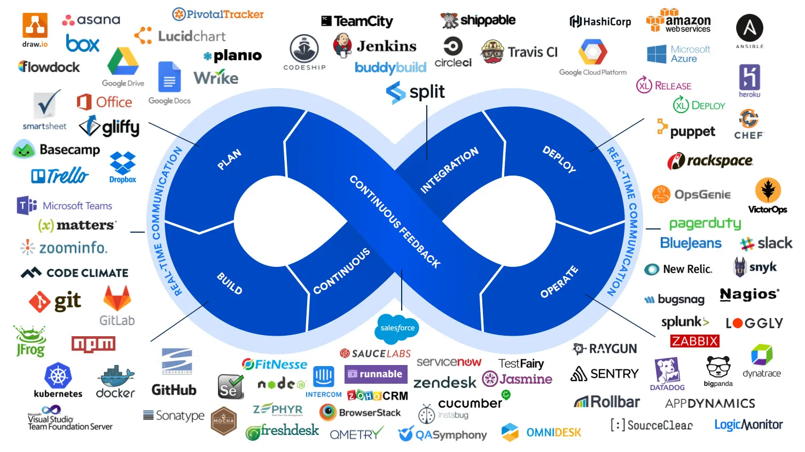
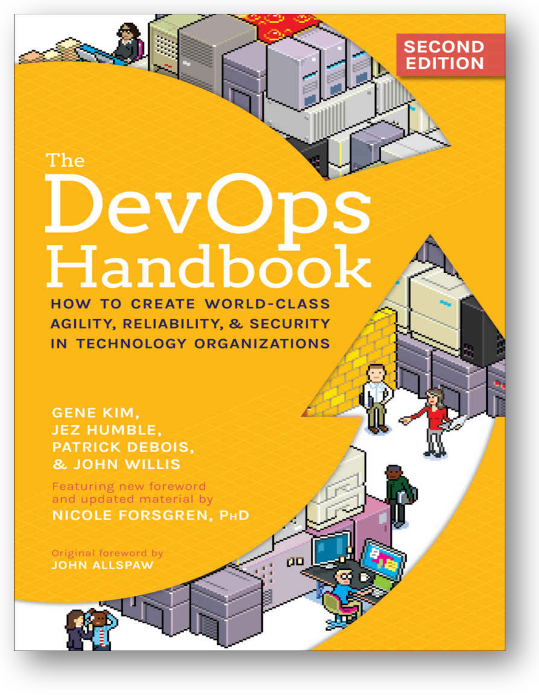

# DevOps и инженерия платформы

Как всегда, современное состояние методов системной инженерии нужно смотреть не в «железной» инженерии или каких-то прикладных «не очень инженерных» её видах типа инженерии организаций (менеджмент) или мастерства (образование), но в программной инженерии. Управление жизненным циклом ещё лет пять назад в программной инженерии и системной инженерии считали почти согласованными между собой, и даже более-менее успешно велись работы по унификации стандартов управления жизненным циклом: стандарты методов жизненного цикла «железной» и «программной» инженерий (ISO 15288 и ISO 12207) стремились сделать как можно более похожими друг на друга, но тут оказалось, что если продолжать следовать этим стандартам, то невозможно вести крупные программные проекты типа «информационная система транснациональной корпорации», где надо поддержать вебсайт интернет-магазина с личными кабинетами миллионов пользователей, поддержать финансовый учёт и контроллинг, поддержать управление запасами и работу кадровиков, поддержать собственно проектирование и производство продукции, поддержать свод всего этого для самых разных подразделений компании, раскиданной по многим континентам, и ещё при этом никогда не сбоить и не останавливаться на переналадку. Так что в программной инженерии пришлось много экспериментировать и менять разделение труда, чтобы перейти к эволюционной инженерии. Разделение труда в классической системной инженерии отставало от экспериментов в программной инженерии, но разрыв этот всё меньше и меньше: уже понятно, что даже и разработка ракеты никогда не заканчивается, и разработка автомобиля, и чего угодно, даже зданий и сооружений, которые вроде бы ставятся «на века».

Разделение труда — это ведь задача архитектуры организации: вам надо для модулей-агентов иметь такие назначенные на них функции, чтобы они могли работать по возможности автономно. Сплочённость агентов (связность внутри агентов) должна быть высокой, а связи/зацепления между агентами — по возможности низкими, иначе организация проекта из этих агентов не сможет развиваться по мере развития целевой системы. Это означает, что сработает не любое разделение труда, не любая организация проекта. То, что мы рассказываем тут в руководстве — то, что выжило в ходе многочисленных проб.

Вместо «управления жизненным циклом» и постадийной расстановки ролей вдоль понятного всем «водопада» пришла эволюционная инженерия, и на первый план вышла вот эта эволюционность, непрерывность. Оказывается, систему надо не просто спроектировать/design, изготовить (manufacture или compile and make), один раз собрать/integrate (в том числе испытать/test в собранном виде), один раз развернуть/deploy на месте эксплуатации, один раз ввести в эксплуатацию (deliver). Нет, инкременты надо выпускать по полному циклу разработки по многу раз в день — идея «непрерывного всего», чаще всего сокращаемая до «непрерывной сборки/интеграции» и «непрерывного введения в эксплуатацию», CI/CD.

Архитектор, визионер оказались работающими на уровне целой системы, а разработка ушла во множество асинхронно работающих над разными частями системы команд, которые выпускают множество маленьких инкрементов разных фич. Команды сами принимают решение о том, чтобы выпустить какой-то инкремент пользователю, сами получают обратную связь от тех пользователей, которые пользуются этими новыми фичами.

Но вот кто там изготавливает, собирает/интегрирует, разворачивает/настраивает, вводит в эксплуатацию? Как называется эта роль — которая занимается этим после проектирования/design? Новый инженерный процесс некоторое время пытались называть «гибкой разработкой» (agile development), включая в «разработку» и работу разработчиков/developers, и собственно изготовление-сборку-наладку-ввод в эксплуатацию, которыми в software engineering занимались эксплуатационщики/operators (часто — system administrators, «распорядители системы»). Но термин быстро обессмыслился: гибкий инженерный процесс ещё имел смысл, но традиционный акцент именно на разработке всех сбивал с толку. В гибком инженерном процессе больше всего поменялась не разработка (хотя и тут происходит много интересного, взять тот же vibe coding, он же software 3.0), но отношение к сборке/integration, разворачиванию/deployment, «введению в эксплуатацию»/delovering — при этом ввод в эксплуатацию перестал быть разовой конечной точкой проекта, он стал постоянным, непрерывным (continuous delivery). Конвейер (трубопровод, pipeline, а теперь говорят про «внутреннюю платформу разработки»/ «internal development platform»), который никогда не останавливается и выносит всё новые и новые изменения огромного числа взаимосвязанных новых возможностей (фич) пользователям.

Метод, который заменил традиционное однократное «управление жизненным циклом» на «управление прохождением инкрементов системы от разработчиков к пользователям» получил название **DevOps**[^r8-1]: работа в смычке разработчиков и операторов. Операторы, они же «сисадмины» в службе эксплуатации системы до появления методов DevOps брали у разработчиков исходные коды базиса (baseline, «административно утверждённая стабильная конфигурация») новой версии софта у разработчиков, компилировала и собирала её в нужном операционном окружении (операционная система, версии СУБД), разворачивала/deploy на «боевых серверах», затем давала доступ пользователям, то есть вводила в эксплуатацию, deliver. «Разработчики отдают, а системные администраторы принимают» — это было наследием водопада, неудачность такого разделения труда (его часто ассоциировали с «перебрасыванием через стену»: разработчики изготавливают код системы, а потом перебрасывают его через высокую кирпичную стену службе эксплуатации, operations — и там хоть трава не расти, «обязанности разработчиков выполнены») была очевидной. Поэтому появилось «движение» (как общественное движение: принципы ясны, но нет общего центра, который бы отслеживал чистоту идеи — реализация везде была уж какая получалась, не было «предписанного умными людьми верного метода») DevOps: «соединения труда», ранее разделённого на труд разработчиков (Dev) и труд операторов-сисадминов (Ops). DevOps провозглашало ответственность разработчиков за то, что происходит там у операторов, то есть «разработчики сами администрируют свои работы, ибо только они понимают, что это они разработали».

В DevOps постепенно включили и поддержку тестирования, и мониторинг, и управление конфигурацией, и много чего ещё, и ещё было много путаницы от начальной формулировки целей DevOps (Development, Operations) как «устранение противоречий между разработчиками и службой эксплуатации/системными операторами». Разработчики начали осваивать agile-разработку и стали готовы выдавать не одну версию системы в год (ну вот примерно как сейчас выходит версия операционной системы Android или iOS), а одну версию системы в день (ну вот примерно как сейчас выходят версии операционной системы Windows, чуть ли не каждый день какое-то обновление), а после автономизации команд — и множество версий в день. Системные администраторы при выходе каждой новой версии должны были её развернуть, оттестировать, аккуратно перенести в неё пользовательские данные, а потом иметь вал запросов от пользователей по поводу устранения новых ошибок, которые разработчики явно не спешили устранять, ибо они были заняты уже новыми фичами.

Возник неожиданный конфликт: сисадмины попросили разработчиков выпускать свои релизы не быстрее, а медленней! Разработчики при этом говорили, что не могут — клиенты ждут новых фич! Сисадмины тогда просто начали пропускать новые версии софта: продолжали работать на старых, иногда годами. Ибо «всё работает, не надо чинить не поломанное». Новые фичи перестали доходить до клиентов, это было массово.

Поэтому и появилось движение DevOps как решение этих проблем: «ответственные разработчики взялись помочь операторам (системным администраторам) и создали DevOps». Это понималось очень по-разному, например иногда как «теперь разработчики у нас ещё и системные администраторы, эти службы объединили!». Но жизнь пошла не по пути «объединения служб под одним начальником, который как-нибудь разрулит их конфликты».

Очередная проблема возникла, когда «ответственные разработчики» пришли к «безответственным сисадминам» — и обнаружили, что те таки реально не справляются, новые версии системы устанавливались тяжёлым ручным трудом. Поэтому первое, что начало происходить — «завод по изготовлению работающего софта из исходных кодов» начали автоматизировать. Появилось огромное количество технических приёмов по интеграции/сборке программных приложений и более-менее безопасному (а вдруг ошибки?!) их вводу в эксплуатацию.

Появилось множество новых видов софта, автоматизирующего и интеграцию результатов работы отдельных команд в целую систему, и инженерное обоснование успешности системы: прежде всего разнообразное тестирование, включая и функциональные тесты, и тесты на соблюдение архитектурных решений/fit functions, и включая многочисленные варианты тестирования на надёжность, типа случайного отключения крупных частей системы, чтобы проверить работоспособность в условиях катастрофы — chaos engineering, а ещё мониторинг защиты/security. Новые инструменты вели мониторинг уровня дефектов в системе, они собирали отклики пользователей, и так далее. По факту все эти новые инструменты делали части того, что потом назовут «внутренняя платформа разработки», конвейер/трубопровод каких-то «деталей системы с новыми функциями» от многочисленных команд разработчиков, за которыми присматривают архитекторы, собирающийся в целую систему, тестирующийся и предоставляющийся в конечном итоге пользователям системы.

Сисадмины по факту перестали существовать, появился термин IaC (infrastructure-as-code)[^r8-2], когда под это движение DevOps подстроились инженеры компьютерной аппаратуры: конфигурирование и настройка компьютеров стали тоже происходить без нажатия на физические кнопки, а специальными программами. Повторить конфигурацию платформы — это нажать кнопку, чтобы прогнать код, который всё-всё настроит. А раньше? Скрипта не было, было выполнение руками многочисленных операций типа «скопируй вот эту программу отсюда туда, укажи ей адрес, по которому лежат её данные», а операции делались «согласно документации» и «записям в записных книжках» самых опытных сисадминов.

Похожий метод получил название SRE (site reliability engineering, инженерия надёжности сайта, причём необязательно именно веб-сайта), он появился даже раньше DevOps, в 2003 году в Гугле. После осознания роли автоматизации было даже предложено переименовать DevOps в NoOps[^r8-3], похожие методы стали появляться в самых разных инженериях XOps (MLOps, PlaftormOps, DataOps, и т.д.[^r8-4]). Появились конференции DevOps, учебные курсы/руководства/стандарты/регламенты DevOps, люди начали себя называть DevOps, если они работали в этой роли в инженерии.

И тут появилось ещё одно интересное следствие, повлиявшее на разделение труда: разработчики получили в руки сложнейший набор разнообразного софта по автоматизации, **инструментов** **DevOps** (как их начали называть). Результаты автоматизации породили множество специализированного универсального софта, который надо был как-то адаптировать к условиям текущих проектов, к закупленным операционным системам, мощностям датацентров, соединять в какие-то «трубопроводы/конвейеры». Самые разные программы «DevOps» занимались тестированием, упаковкой приложений в контейнеры для операционной системы, мониторингом работоспособности, балансированием нагрузки — пара десятков типов «инструментов DevOps», каждый из которых представлен какими-то конкурирующими версиями инструментов от разных провайдеров. Это всё равно как дать конструкторам из конструкторского бюро обязанность выбирать у поставщиков машиностроительных станков разные версии всех этих «обрабатывающих центров», «измерительных стендов», «упаковочных станций» — настраивать их и работать на них, чтобы вручать клиенту не чертежи, а работающую уже собранную и проверенную конструкцию. А завод? Ну, это ж идея DevOps — проектировщики вроде как должны были стать и заводчанами, поэтому дальше у них не должно было быть конфликта с заводчанами!

Вот типичная картинка[^r8-5], которую приводят, когда описывают инструменты/«станки» для DevOps в программной инженерии:

Понятно, разработчики не справились: они начали повсеместно «выгорать» от этой новации, им некогда было уже разрабатывать новые фичи целевого софта, они непрерывно разворачивали и переналаживали свой «конвейер», свой «трубопровод» по выпуску софта. Решение было в

* выделении отдельной роли для этой деятельности — инженер внутренней платформы разработки (internal development platform). Обязанность — закупить и развернуть весь этот софт платформы (инструменты DevOps), настроить его для выпуска целевой системы, а также научить разработчиков работать с этим уже развёрнутым и настроенным софтом.
* Объявлении этой внутренней платформы разработки продуктом, который оказывает сервис разработчикам, и поэтому там должны быть соблюдены все принципы продуктовой разработки для клиента (customer development), разработчики — «внутренние клиенты».
* Сохранении основной идеи DevOps, иногда формулируемой как «ты это построил, ты это и эксплуатируй» (you build it, you run it), разве что в руки разработчики получают готовый инструмент-завод, а не полуфабрикат «сделай себе свой завод сам», «платформу разработки собери и настрой сам». Нет, завод тебе создадут — и дадут готовый.

Platform engineering — это не отдельная от DevOps идея, это развитие идеи DevOps — просто оказалось, что для исправления ситуации разделения труда между разработчиками и системными администраторами нужно выделить ещё одну деятельность/культуру/инженерию — инженерию внутренней платформы разработки (internal development platform, и помним, что платформы бывают очень разные, сегодня модно вообще любую систему называть «плафтормой»). Это верно и для разработки «железа», в жизни сегодня встречаются три основные ситуации:

* Аутсорс завода. Plaftorm-as-a-service, инженеры платформы сдают свой завод в аренду. Более того, на этом заводе может быть ещё и свой технолог, то есть разработчикам не надо «производить на заводе», они «отдают информационную модель» («чертежи» тут в далёком прошлом) — получают или полуфабрикат, который собирают-настраивают, или даже готовое изделие, которым уже можно пользоваться. Конечно, чтобы стать «платформой», заводу приходится быть универсальным. Например, на заводах ставятся универсальные обрабатывающие центры (CNC, computer numerical control[^r8-6] machines, станки с ЧПУ) и 3D-принтеры (additive manufacturing). Вот это отделение заводов от конструкторских бюро и универсализация производства — это тренд! Найти описание этого тренда можно в обзоре «Platform-based manufacturing[^r8-7]». Это всё может описываться как «оборудование-как-сервис» или «производство-как-сервис», но всё сводится к тому, что вместо тесной связи конструкторского бюро с заводом заказ «размещается где-то в Китае», а вместо «тесной связи» работают цифровые стандарты. **Платформа—** **это прежде всего стандартизация интерфейса её использования.** В программировании всё то же самое: где-то «в облаках» размещаются платформы, которыми можно воспользоваться, их много, совершенно неважно кто их поставщик. В итоге мы имеем производственную сеть (manufacturing network). Проблемы? Их много. Например, государство может решить, что ваше предприятие не должно пользоваться чужими платформами, или владелец платформы решил, что вам нельзя пользоваться его платформой. Но эти проблемы решаются, тренд неостановим. Вы просто перейдёте с самой выгодной платформы на чуть менее выгодную, это не займёт много времени (хотя придётся помучаться немного, vendor lock-in[^r8-8] реальная проблема) — там будет, скорее всего, примерно тот же стандарт интерфейса, примерно те же правила пользования. Это очень удобно, когда «завод» может быть даже анонимным. Но, повторим, возникают специфические проблемы доверия и надёжности в такой среде.
* Ровно обратное от предыдущего пункта: если производство раскидано по самым разным платформам, то вы можете оказаться в ситуации непрерывного ведения переговоров по поводу размещения заказов, логистики, срывов сроков поставок, трудности проведения изменений и согласований характеристик. Поэтому вы делаете собственное производство, отдавая на аутсорс для изготовления минимум. И получаете резкое ускорение: внутрифирменное согласование обычно много быстрее, чем внешнее. Ровно это произошло в космической промышленности: крупные контракторы NASA выполняли как один из приоритетов задачу раскидывания космических заказов по огромному числу мелких производств. И всё там поэтому было медленно, ненадёжно, дорого. SpaceX поменяла правила игры: основное по проектированию ракет и их производству собрала у себя, внутри фирмы. Минимум аутсорсинга. Только внутренняя платформа разработки. И дальше было продемонстрировано, что это в разы и разы быстрее, чем раскидывание заказов по «производственной сети».
* Внутренняя платформа разработки, чаще всего обсуждается в рамках движения DevOps. Попытка универсализации и стандартизации, как в первом варианте «аутсорс завода», но «производственная сеть» создаётся на собственных мощностях, «внутренняя/internal платформа», а не «внешняя».

Все эти тренды работают одновременно. Иногда даже обсуждаются «стратегические приёмы», например, чтобы поддерживать конкурентоспособность своей платформы, её заставляют продавать часть услуг для чужого аутсорса — и если не удаётся, то считают, что «неконкурентоспособна». Понятно, что у всех подобных инициатив есть и горячие сторонники, и горячие противники. Гибридных форм тоже более чем достаточно, но в итоге бал правит некоторое количество общих идей, которые выигрывают независимо от того, как это раскладывается по фирмам:

* Инструментарий изготовления чего бы то ни было рассматривается не изолированно друг от друга, а как составная часть «производственной платформы» (внутренней или внешней — это уже неважно).
* Платформа должна быть удобна для использования разработчиками, клиентами и пользователями платформы считают разработчиков, а не пользователей конечной произведённой продукции. То есть пользователей произведённой системы и пользователей производственной системы не путают. Создатель системы и создаваемая система — они отдельно! У каждой есть свои клиенты. В некоторых случаях разработчики — «внутренние клиенты», но это не меняет к ним отношения.
* Инженер платформы отвечает за закупку оборудования, логистику и общую готовность платформы к работе. Но он не отвечает за то, что на этой платформе производится. За это отвечают разработчики.
* А кто же всё-таки производит? Вопрос сегодня сложный, но чаще всего ответ — «никто», производит сама платформа. Завод сегодня — это завод-автомат. Даже если там есть какие-то работники внутри, они не считаются «работниками, с которыми можно договариваться о производстве». Нет, они «части машины», интерфейса к ним нет (платформа — это модуль, видимость того, что происходит внутри, ограничена).
* Платформа представляет разработчикам стандартизированный интерфейс, стандартизированное управление.

Вот учебник «The DevOps Handbook» (второе издание, 2021), в котором рассказывается о практике DevOps как совокупности технических и организационных решений:

Основной целью метода DevOps (помним, что «инженерия платформы» — это просто развитие идеи DevOps, это не отдельное течение, так что обсуждение касается и инженерии платформы) заявляется поддержка постоянного введения в эксплуатацию (continuous delivery). По факту же это существенно модифицированный метод «управления жизненным циклом», преобразованный согласно идеям agile для ситуации эволюционной/непрерывной разработки, эволюционного/непрерывного принятия архитектурных решений и непрерывного (тут реже говорят «эволюционного») введения в эксплуатацию. Отсутствует собственно «жизненный цикл» с его стадиями, система инкрементально развивается, а не замысливается-проектируется-изготавливается-испытывается-вводится в эксплуатацию-эксплуатируется. **«Жизненный цикл» остался только там, где в головах по-прежнему идея «водопада».** Например, в госпроектах: там вся система финансирования выстроена ровно под это, «что заказали, то и получили».

Заметьте, что мы тут разделяем «что в жизни» и «как мы описываем жизнь». Сам инженерный процесс может быть устроен вполне по-современному, гибко. Но вот обсуждение с менеджерами и заказчиками будет всё равно «водопадным», то есть будут и требования, и разовые (а не постоянные) инженерные обоснования. Проблема тут в том, что описание жизни оказывается оторванным от собственно жизни: люди работают не так, как они это описывают. Мы тут даже не будем обсуждать, к чему такое приводит. Скажем, вы ремонтируете транзисторное устройство, а у вас принципиальная схема его нарисована с радиолампами, да и все менеджеры говорят про радиолампы, а про транзисторы можно говорить где угодно, только не на официальных совещаниях. Будет ли работать транзисторное устройство? Да, будет, но «вопреки»: не спрашивайте про сроки, стоимость, нервы всех участников проекта.

Инженерная жизнь в 21 веке существенно поменялась (в 2003 году вышел agile manifesto и появился в Гугле SRE, первая конференция по DevOps прошла в 2009 году), сегодня DevOps и инженерия платформы — это «метод по умолчанию» в программной инженерии, и потихоньку распространяется на другие виды инженерии. Суть производства поменялась: вместо выпуска одной хорошо отлаженной системы надо уметь выпускать много-много версий хорошо отлаженной системы, в каждой из которых есть много мелких и крупных изменений — при этом от всех этих многочисленных изменений качество продукта не падает, а растёт.

А ещё инженерия производственной платформы очень проблематична в части описания разделения труда в инженерии:

* Традиционно DevOps и тем самым инженеров платформы включали и обсуждали как входящих в команду инженеров-разработчиков (в этом-то и был смысл затеи! Вернуть функции и людей Ops в функции и состав Dev!). Потом оказалось, что жизнь поменялась, и у нас scaled agile, поэтому DevOps и роль «инженер внутренней платформы разработки» ушёл из разработчиков-в-командах на уровень проекта — туда, где архитектор и визионер. Но по-прежнему это относилось к «инженерам в целом». Менеджеры рулили «инженерами», которые разрабатывали систему, в инженерах были разработчики, архитекторы, визионеры, инженеры платформы.
* Но если обратить внимание, что продуктом инженеров платформы является платформа, которая предоставляет сервис разработчикам, среди которых в том числе и архитектор (платформа нужна для того, чтобы там выполнялись fitness functions), и визионер (который отслеживает выдачу фич), то становится понятно, что «инженер системы» и «инженер завода» — это разные инженеры, и с «заводом» (платформой) можно разворачивать полноценную инженерию. Инженер платформы (роль) тем самым включает визионера, архитектора, несколько команд разработчиков (функциональные проектировщики, проектировщики, технологи, операторы) и даже инженера внутренней платформы разработки внутренней платформы разработки! Действительно, в программной инженерии это рассматривать как-то не очень наглядно (ну, «программисты и программисты», с точки зрения менеджмента), но если взять инженеров ракеты и инженеров ракетного завода, то это же оно и есть! При этом ракетный завод сделать существенно трудней, чем ракету! Автомобильный завод сделать существенно трудней, чем автомобиль! Элон Маск недаром говорил, что «выпустить прототип лучшего в мире электромобиля — это очень легко, но вот наладить массовое производство с конкурентоспособной ценой — вот это трудно». Так что инженеров платформы можно и не рассматривать как входящих в команду инженеров проекта целевой системы, можно считать их инженерами совсем другого проекта.

А как же с общностью идеи инженерии платформы для систем самой разной природы? Всё в порядке:

* В фирме, которая выпускает мастерство (например, университет) собственно производство представляет собой деканат. Вот инженеры платформы — они разрабатывают, производят, настраивают и являются операторами деканата (конечно, чаще всего сотрудники деканата совмещают в себе роли и инженеров деканата (создатели деканата), и работников деканата (частей созданного деканата). Подробней про это в руководстве по инженерии личности, которое рассказывает о методах инженерии мастерства.
* В менеджменте какого-то предприятия, инженеры платформы — это создатели «администрации». Администрация — это и есть «внутренняя производственная платформа» для коллектива, то есть бухгалтерия, заведование хозяйством, «кадры», канцелярия, и так далее. Подробней про это в руководстве по системному менеджменту, которое рассказывает об инженерии предприятия.

[^r8-1]: <https://en.wikipedia.org/wiki/DevOps>

[^r8-2]: <https://en.wikipedia.org/wiki/Infrastructure_as_code>

[^r8-3]: <https://ailev.livejournal.com/1367897.html>

[^r8-4]: <https://www.xenonstack.com/insights/xops-components>

[^r8-5]: <https://medium.com/cloud-native-daily/the-ultimate-guide-to-the-top-devops-tools-you-need-to-know-exploring-the-top-devops-tools-11e5f8aa9686>

[^r8-6]: <https://en.wikipedia.org/wiki/Computer_numerical_control>

[^r8-7]: <https://www.sciencedirect.com/science/article/pii/S0007850623001282>

[^r8-8]: <https://en.wikipedia.org/wiki/Vendor_lock-in>
