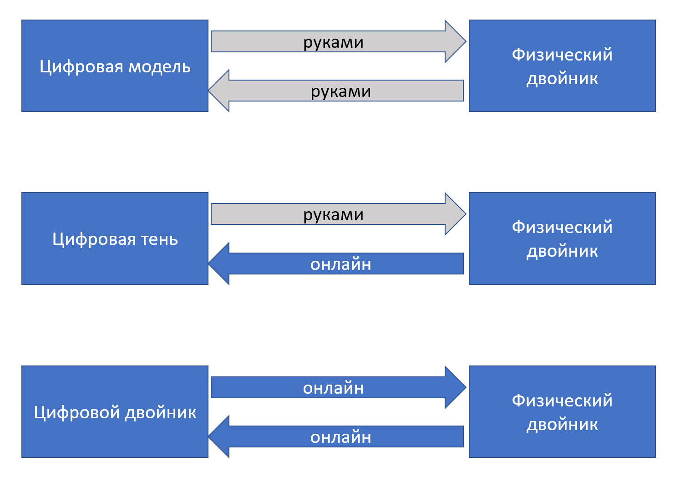

# Цифровой двойник

«Железная» системная инженерия потихоньку решает проблему, которую решали DevOps в программной инженерии: методы разработки и методы эксплуатационной инженерии систем оказались разобщены, ибо в ходе разделения труда одни инженеры-разработчики и инженеры-производственники проектировали и изготавливали систему, а другие инженеры-операторы занимались её эксплуатацией (настраивали для получения оптимальных режимов работы, загружали сырьём, следили за отсутствием поломок, а если системами пользовались люди-неинженеры, то помогали этим людям).

У системных администраторов программных систем и разработчиков программных систем был образ, когда разработчики перекидывают очередной релиз через высокую кирпичную стену на сторону сисадминов, а дальше сисадмины мучаются, пытаясь объяснить пользователям, почему всё вдруг не работает, или работает не так хорошо, как хотелось бы. Движение DevOps как раз решало эту проблему, но эта проблема есть во всех видах инженерии. Например, она есть у официантов и кухни в ресторанах: претензии клиентов слышат официанты, а повара делают своё дело, полностью изолированные от клиентов. Инженерия внутренней платформы разработки была призвана это изменить: разработчики должны были сами развернуть систему и предоставить её пользователю, услышать его вопросы, узнать впечатления/eXperience — а работа операторов по настройке и разворачиванию должна была полностью исчезнуть, она автоматизировалась, её брала на себя инженерная платформа, DevOps превращалось в Dev + NoOps = потому что новая роль «инженеры внутренней платформы разработки» обеспечивали автоматизацию, NoOps. Кухня — и сразу едоки, никаких официантов, а пищу из кухни в зал выносит робот. С роботом не поскандалишь, и робот заодно меньше ошибается и работает быстрее и дешевле.

В системной инженерии «железных систем» этот же тренд DevOps развивался как движение «цифровых двойников», digital twins. Это именно двойники, то есть они похожи друг на друга, а не «близнецы», ибо их природа разная: физический двойник это и есть целевая система, а виртуальный/цифровой двойник — это операционная модель целевой системы. Путь к настоящему цифровому двойнику занимает обычно несколько шагов по связи цифровой модели и физического двойника, отражённых на рисунке:

Сначала появляется **цифровая модель физического двойника**, которая не связана с физическим двойником цифровой нитью. Цифровая модель отличается от обычной мегамодели, используемой в инженерии (в PLM, ERP, EAM и eXperience platforms системах) тем, что она содержит в себе какие-то данные и приложения, работающие с так называемыми **историческими данными**, то есть данными времени эксплуатации, обычно это значения каких-то характеристик в разные моменты времени, «временны́е ряды». Эти данные анализируются, и по ним принимаются решения о том, как операционные инженеры должны изменить настройки физического двойника, чтобы оптимизировать его работу, или решения о том, когда оптимально провести ремонт физического двойника. Импорт-экспорт данных и с датчиков физического двойника и результатов расчётов оптимальных режимов работы на модели происходят вручную.

Потом налаживается съём информации с датчиков физического двойника в реальном времени через цифровую нить (в онлайн-режиме, постоянно, а не руками и изредка). Цифровая модель начинает в любой момент времени отражать важные характеристики физического двойника, и её называют уже **цифровой тенью**.

**Цифровой двойник** — это когда результаты работы цифровой тени в виде предложений по настройкам физического двойника попадают в физического двойника не «вручную», а тоже в режиме онлайн, то есть цифровая тень онлайн начинает рулить физическим двойником, так что она уже не совсем тень. Так что с этого момента говорим о полном цифровом двойнике, а не модели или тени.

Так что цифровой двойник — это автоматизация (гиперавтоматизация, цифровая нить, цифровая трансформация и т.д.), разработки, которая доводится до стадии эксплуатации. Особый упор тут на физическое моделирование и использование данных физического (имитационного) моделирования для настройки эксплуатационных параметров системы.

Особо нужно отметить использование термина «цифровая трансформация» (digital transformation)[^r8-1]. Формально: «замещение бескомпьютерных технологий и ручной работы компьютерными» или «замена более старых компьютерных технологий на новые». То есть формально это ничего не значит, любые изменения в работе, происходящие от замены чего-нибудь компьютерного, например, старого компьютера на новый, старого корпоративного приложения на новое.

Но неформально трансформация означает организационные изменения (появление новых методов работы, поддержанных оргструктурой организации и ресурсами, то есть появление новых оргвозможностей/capabilities), необходимые для интеграции данных и использования цифрового двойника. Цифровой двойник тут относится к системам самой разной природы: автомобиль, космический корабль, пациент, студент, предприятие, завод-автомат, район городской застройки. Ключевое тут то, что мегамодель цифрового двойника заходит в стадию эксплуатации/operations, а не только используется в ходе разработки/development и изготовления/construction.

Концепт цифрового двойника, объединяемого цифровой нитью, оказался очень удачным, и его начали использовать повсеместно вместо специализированных PDM (систем версионирования продукта), PLM (в которых добавлен issue tracker), eXperience platform (добавлены все стадии разработки, а также изготовление и выход на внешние проектные роли). Его начали использовать и в машиностроении, и в медицине, и в строительстве (и даже градостроении, ибо идут разговоры о «цифровом двойнике умного города»), и в образовании — идея захватила массы.

В частности, вы можете не только читать наше руководство как регламент/стандарт мышления и работы, но и использовать его как учебник, проходя стажировку в мастерской инженеров-менеджеров (МИМ). В МИМ для помощи в освоении работы по руководству задействуется информационная система Aisystant. В принципе, её можно отнести к LXP (learning experience platform)[^r8-2]: поддерживается конфигурация учебных материалов (руководства инженеров-менеджеров), которые предъявляются инженерам-менеджерам как стажёрам/учениикам/студентам, поддерживается конфигурация группы текущих активных в части освоения работы по руководствам инженеров-менеджеров (и не только текущих, но и прошлых тоже, это ведь в том числе и система версионирования!), поддерживается учёт наставлений, работу по которым инженеры-менеджеры уже освоили, поддерживается учёт оценок квалификации инженеров-менеджеров в момент эксплуатации освоенного мастерства[^r8-3]. Конечно, это пока не полноценный цифровой двойник (где в реальном времени и без участия людей отслеживается информация о поведении инженера-менеджера, а потом этому инженеру-менеджеру даются рекомендации, как ему оптимизировать свою «эксплуатацию»), но как минимум, это цифровая модель, затрагивающая эксплуатацию уже изготовленного мастерства, эксплуатацию личности после прохождения очередного шага её рабочего, личного, исследовательского развития.

Цифровой двойник — это безмасштабная идея: говорить о цифровых двойниках начали по отношению к каким угодно целевым системам (мостам, городам, пациентам, студентам), и вся эта история про цифрового двойника, провязанного цифровой нитью, только-только начинается[^r8-4].

Что будет дальше? Дальше, конечно, выход за пределы отслеживания физического двойника и переход к отслеживанию и окружения тоже: выход на отслеживание эволюционного динамического ландшафта приспособленности. И, конечно, использование AI в принятии самых разных решений и роботов в реализации этих решений.

Что отслеживать в проекте в связи с DevOps с опорой на инженерию внутренней платформы разработки? Ведь там множество методов, причём многие из них называют разными терминами, акцентируя разные их аспекты — и прежде всего тут управление конфигурацией и изменениями (в том числе версионирование, интеграция данных, непрерывная интеграция, непрерывный ввод в эксплуатацию)? Конечно, альфы, в данном случае это будут подальфы основных/kernel альф. Как их отслеживать? Сделайте из альф кейсы и отслеживайте прохождение состояний этих альф (прохождение кейса) через issue tracker.

В нашем руководстве приводится изложение самого общего, «безмасштабного» уровня, который не зависит от масштаба и вида целевой системы и создателей. Это уровень мета-мета-модели. Но проблема управления инженерным процессом, в том числе DevOps с инженерией платформы, управления конфигурацией и изменениями, а в последнее время и проблема разработки и эксплуатации цифровых двойников на основе цифровой нити хорошо описаны для целевых систем самой разной природы. Это уровень мета-модели «из культуры».

Чтобы получить искомую мета-модель для предметной области вашего проекта, которую вы будете использовать в вашей проектной культуре, а потом и модель актуальной конфигурации отслеживаемых систем (как целевых, так и их окружения, так и создателей в их графах), и описаний этих систем, нужно будет выполнить адаптацию: перейти от предельно абстрактного языка мета-мета-модели к конкретному языку метаУ-модели из культуры (результат «погуглить» или «спросить AI», итог прохождения университетских курсов и чтения учебников по прикладным дисциплинам), а затем конкретному языку метаС-модели (язык регламентов, руководств, стандартов), принятому в вашем предприятии или предприятии-клиенте.

Поэтому первым делом вам нужно изучить доступную литературу по методам разработки вашей предметной области: она будет основываться на тех же самых принципах, о которых мы рассказали в нашем руководстве, но там может отличаться терминология, а также будут указаны варианты технологии ведения конфигурации целевой системы или системы создания и конфигурации работ, которые применимы в вашей конкретной проектной ситуации с использованием какой-то школы управления инженерным процессом, школы инженерии платформы, приспособленной к системам определённой природы и масштаба.

Больше всего материалов по управлению конфигурацией и изменениями вы встретите по разработке программного обеспечения, главным образом для разработки корпоративного софта. Интересно то, что по большей части этот разрабатываемый софт — это тоже софт управления конфигурацией и изменениями, но каких-то других объектов (если это корпоративный софт для обувной фабрики, то он будет управлять конфигурацией партий обуви, а также конфигурацией самого предприятия-создателя этих пар обуви, то есть будет софтом внутренней платформы разработки и изготовления обуви). Если вы понимаете, как устроен граф создателей в вашем проекте, то вам будет легко разобраться и не запутаться, когда вы говорите об инженерных процессах разных систем в графе создателей и о разных внутренних платформах разработки, которые вам (или не вам) придётся интегрировать в вашем проекте.

Конечно, есть огромное количество вариантов описанных в литературе методов управления конфигурацией и видов производственных платформ и для самых разных других систем. Например конфигурация незавершённого производства в машиностроительном предприятии (операционный учёт) будет храниться в ERP-системе на верхнем уровне учёта и построенного на данных этого учёта планирования, а также MES-системе на уровне цеха — мы это уже упоминали.

Если вы занимаетесь администрированием каких-то территорий, то вам будут помогать геоинформационные системы, а язык какого-нибудь «кадастрового учёта» вообще будет слабо напоминать язык системной инженерии или программной инженерии. Если у вас розничная торговля, то информационная система у вас тоже главным образом учитывает конфигурацию, управляет изменениями, отслеживает конфигурационные коллизии. Принципы управления конфигурацией, тем не менее, будут примерно те же, что мы обсуждали в текущем разделе с медленным движением от «учёта продукта» к «учёту продуктов и работ» и далее выходу к стадии эксплуатации и переходу роли инженера-оператора эксплуатации к компьютерной системе в составе цифрового двойника, а также предоставление доступа к информации производственной платформы внешним проектным ролям (например, роли покупателей и поставщиков). Там и тогда, где и когда вы используете какой-то «учётный софт», там будут вставать общие проблемы управления конфигурацией и изменениями.

Есть, конечно, огромное количество нюансов, которые появляются в ходе адаптации метода. Так, если у вас есть какой-то софт учёта конфигурации, который используется несколькими организациями, то непременно всплывёт идея использовать «распределённый реестр»/блокчейн как способ обеспечить доверие к этой системе. Если учитывать нужно права (обычно тут говорят о ценных бумагах, но это понятие чётко прописано в законодательстве всех стран, поэтому часто говорят о «токенах», чтобы по возможности уйти в «серую зону» для этого законодательства, чаще всего это просто синоним для «ценной бумаги, учтённой в блокчейне как регистраторе»), то возникнет вопрос о различиях юридической защиты в момент, когда «что-то пошло не так». И тут будет разница между депозитарными учётными системами (основанными на римском вещном праве, хорошо проработанный юридический механизм) и регистраторскими системами (основанными на обязательственном праве, плохо проработанный юридический механизм). Конечно, без глубокого знания предметной области (тут это — основы законодательства о рынке ценных бумаг, основы законодательства о денежной системе) не обойтись, и в разных странах это будет ещё и разное знание.

**И не надейтесь наладить** **DevOpsв проекте, если вы не знакомы с культурными** **SoTAвариантами** **инженерного процесса и** **SoTAвариантами инструментария внутренней платформы разработки** **для вашей предметной области! Впрочем, это относится к любым** **инженернымметодам—** **и прикладной методологии, и архитектуре, и проектированию, не только** **DevOps.** **Знания нашего** **руководства** **системной инженерии будет достаточно, чтобы вы могли обсуждать связь вашего проекта с многочисленными другими проектами в самых разных других областях, или чтобы быстро разбираться в** **прикладной инженерии каких-то других систем, для которых у вас нет опыта. Но этого знания совершенно недостаточно, чтобы вести прикладные проекты, профессионально работать, не делать новичковых ошибок!**

Так что мы не будем давать примеры возможных подальф, ограничимся только несколькими замечаниями для управления конфигурацией, как важнейшей части DevOps:

* Подальфы управления конфигурацией в проекте могут относиться как к целевой системе, так и к создателю, так и к работам, так и к описанию целевых систем и создателей. Впрочем, управлять конфигурацией ваших сведений о надсистеме тоже нужно.
* Инженерный процесс тоже может отслеживаться в проекте как подальфа альфы «метод» создателя (либо создателя целевой системы, либо создателя «нашего» создателя в графе создателей, смотря чей инженерный процесс рассматривается). Эта подальфа может проходить состояния и отвечать на контрольные вопросы адаптированной альфы «метод» (пример состояний альфы «метод» и подробности были в руководстве по методологии, она давалась как подальфа описания создателя).
* Метод ведения обозначений в конфигурации как подальфа описания целевой системы, но для «нашего» создателя это тоже актуально, вам же нужно создать модель предприятия. Так что и тут вам придётся обсуждать вопрос именования и альф, и рабочих продуктов, и работ. Но ещё и размещений, и даже финансовых величин (помним, что системное описание включает в себя и стоимостное описание, конфигурация включает в себя тем самым и финансовое описание).
* Конфигурация как подальфа воплощения целевой системы с возможными состояниями: замыслена, версионируется и бэкапируется, ведётся (изменяется, аудируется/обосновывается/проверяется, данные конфигурации управляются, то есть доступны всем, кому они нужны), архивируется.
* То же можно сказать для версионирования описаний.
* Конфигурация целевой системы в эксплуатации и версии описания системы ведутся и их соответствие трассируется.
* Грубо можно описать состояния подальфы цифрового двойника альфы описания системы: цифровая модель, цифровая тень, цифровой двойник.

Никакого жёсткого ориентира для моделирования альф инженерного процесса нет. Даже если посмотреть сам стандарт OMG Essence, то он как раз служит для описания разных вариантов инженерного процесса. То есть «использование альф для отслеживания состояния проекта», «отслеживание состояний рабочих продуктов для отслеживания состояния проекта» — это тоже часть управления инженерным процессом, поэтому так трудно разговаривать об «альфах, описывающих альфы», «рабочих продуктах, документирующих описание другими рабочими продуктами состояний других альф».

**Так что проявляйте творчество и гибкость, не будет никаких чётких рекомендаций по тому, как устроить управление** **инженерным процессом, управление конфигурацией и изменениями, управление инженерной документацией, операционный или какой иной учёт, какого сорта** **задействовать** **информационные системы (моделеры конфигурации, в том числе моделеры конфигурации систем, описаний, работ),** **как** **создать внутреннюю платформу разработки, интегрировать данные, поставить метод работы** **DevOpsдля вашего проекта с вашими особенностями целевых систем и их создателей. Но вы не можете проигнорировать все эти** **методы, с них и надо начинать проект. Ибо все остальные** **методы** **инженерии затем будут основываться на том, что вы как-то управляете** **вашим инженерным процессом, не пускаете его на самотёк. Вы и ваша команда должна знать:** **что и как нужно делать** **и каким инструментарием для этого пользоваться, знать, что происходит в проекте—** **какие состояния важнейших отслеживаемых в проекте объектов.**

[^r8-1]: <https://en.wikipedia.org/wiki/Digital_transformation>

[^r8-2]: <https://www.growthengineering.co.uk/what-is-learning-experience-platform/>

[^r8-3]: <https://system-school.ru/qualification>

[^r8-4]: Подробней смотри серию публикаций <https://ailev.livejournal.com/1549559.html>, <https://ailev.livejournal.com/1548016.html>, <https://ailev.livejournal.com/1550931.html>
