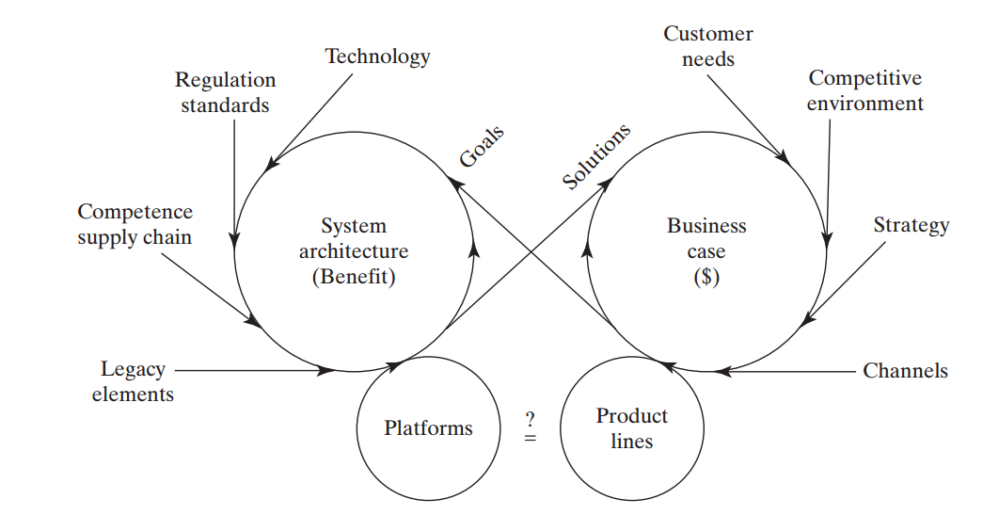

# Разработка концепции использования и концепции системы

Концепция использования разрабатывается прикладными методологами и архитекторами, одобряется или отвергается визионерами (полностью или в каких-то частях, возможно в развёртке по времени — technology roadmap[^r8-1]). Визионеры — это чаще всего те, кого называют intrapreneur, корпоративные предприниматели[^r8-2]. Их главная функция — предсказать NPV[^r8-3], то есть насколько проект будет прибыльный. Нынешние экономические теории предпринимательства не слишком подходят для описания этой роли, потому как они подчёркивают разные стороны того, что в современном предприятии расписано на более мелкие детальные роли — Шумпетерский предприниматель занимается «творческим разрушением», а мы тут создаём, Кирцнеровский предприниматель внимателен к возможности заработать, тут это более применимо[^r8-4], Кантиллион подчёркивает принятие на себя риска  — хватает ролей, которые принимают риск во внутрикорпоративном контексте, Друкер подчёркивает новизну метода[^r8-5], но за новизну отвечают обычно инженеры в команде. Так что в нашем случае речь идёт о роли визионера, который отслеживает прибыльность проекта, чтобы в разработку было вложено меньше ресурсов сейчас, чем заплатят клиенты потом — с учётом всех неопределённостей. Если что-то убыточно, то просто не будем этого делать, визионер не даст — это его главная роль.

Вот как это всё намеренно запутанно изображается в книге ««Systems Architecture. Strategy and Product Development for Complex Systems»:

Концепция использования тут только оцениваемая в возможных деньгах идея, которая постепенно детализируется в концепцию системы (на диаграмме она по старинке названа «системная архитектура»). При этом разработчики и визионеры (интерес визионеров в максимизации потока денег от продукта, чаще всего эти роли исполняются людьми на должностях product owner, product manager) и бизнесмены (интерес бизнесменов в максимизации стоимости компании, их продукт — компания в целом, их клиентура — инвестура, акционеры/инвесторы) обсуждают business case, который можно считать вариантом бизнес-модели, «концепция выкачивания денег из проекта». Они должны достичь соглашения по концепции использования с учётом концепции системы: денег от продаж (их можно прикинуть по концепции использования — сколько удастся продать продукта с такими свойствами) должно хватить на разработку и изготовление плюс прибыль, свойств системы (пользовательской функциональности плюс архитектурных характеристик, о которых будет чуть позже) должно хватить, чтобы запросить эти деньги у клиентов. Концепция системы (тут это system architecture) даёт оценку, во сколько это всё обойдётся компании — сколько будет стоить разработать и изготовить систему. Всё это, разумеется, гипотеза: реальные клиенты могут заплатить или не заплатить (или продавцы могут не найти клиентов, «плохой маркетинг»), реальная система может соответствовать или не соответствовать ожиданиям клиентов (плохо спроектировали, криво изготовили, не смогли наладить в эксплуатации).

В любом случае, хорошо видно, что концепция использования разрабатывается совместно командой инженеров целевой системы и менеджеров как инженеров предприятия и маркетёров как инженеров сообщества клиентов. Они все должны договориться, чтобы проект случился. Если обсуждается проект создания провайдера сервиса, то тут ничего не меняется, тот же разговор про системы, те же роли — только чуть по-другому проведены границы в графе создателей (сервис-ориентированная работа — это когда работаем по нашему методу и нашими инструментами с целевой системой, принадлежащей не нам, а принесённой клиентом).

Весь процесс согласования идёт между ролями, а не агентами. Концепция использования может прийти и извне фирмы, от её клиентов, ей может озаботиться какой-то основатель стартапа, работающий сразу во множестве ролей, она может быть вычитана в прессе, подсмотрена у конкурентов (тут близко к пониманию Kirzner, что визионер «алертен/внимателен» к возможной прибыли, не пропустит такую возможность) — и далее просто улучшаться-дорабатываться в какую-то конкретную концепцию системы, или архитектуру (в старом её значении, на картинке из книги именно так). Это самое важное: творчество не имеет конкретного источника, нет ролей, назначаемых на творчество.

Часто встречается ровно обратное: кому-то приходит в голову концепция системы, что какие конструктивные объекты могут выполнить ту или иную функцию, и надо придумать концепцию использования. Это тоже бывает. В любом случае, проекта нет, если известна только концепция использования (скажем, «скатерть самобранка, вкусно кормит всех за один рубль» — без рассмотрения концепции системы, которая может это делать) или наоборот, только концепция системы («я придумал глюклу, которая очень дёшево глюкает, если её заправлять глюкагелем — давайте придумаем, куда бы это можно было пристроить?»). Нет, проект начинается только после первичной проработки концепции использования, рассматриваемой как бизнес-кейс, и концепции системы, нужной для оценки возможностей создать целевую систему по цене, осмысленной для бизнес-кейса. Всё это гипотезы, конечно, в ходе проекта идёт непрерывное уточнение оценок — и изменение проекта по ходу этого уточнения оценок, а иногда проект и закрывается, если оценки показывают коммерческую бесперспективность.

Идеи тут приходят в голову отнюдь не только «стратегам», «визионерам», «бизнесменам» или «архитекторам». Она приходит в голову любым инженерам: людям, которые пытаются что-то сделать, как-то приспособить для своих целей предметы окружающего мира. Нет роли, приватизировавшей творчество, приватизировавшей предпринимательство по-Шумпетеру или Друкеру, или по любому другому (чаще всего — бытовому, у каждого человека своему) пониманию. Современное предпринимательство распределённо по частным ролям, выполняемым разными людьми — визионерами, бизнесменами, проектировщиками (инженерная идея чаще всего — его!), инвесторами, а также всеми остальными ролями, нужными для предложения проекта и оценки его возможного успеха. Ровно поэтому мы табуируем слово «предприниматель» и обсуждаем более специфичные роли, например, роль визионера как оценивающего рыночный успех продукта, описываемого концепцией использования и продающегося по цене, которая окупит разработку, изготовление, а также затраты на маркетинг и продажи. Конечно, всё значительно сложнее — так, интересует не просто «цена», а полная стоимость владения — клиент ориентируется при покупке на неё, а ещё волнует разница вкладываемых/инвестируемых в разработку денег сейчас против получаемых от продаж готового продукта через некоторое время, идея NPV[^r8-6].

Первичные тесты на полноту системного описания (какая функция в надсистеме требуется, какой эту функцию выдаст функциональный объект, какой сервис какое сочетание конструктивных объектов может выдать на базе каких физических принципов, как это будет расположено в пространстве, какие стоимостные ограничения, и помним, что кандидат в продолжение системного описания — это выход в граф создателей, какие работы нужно будет выполнить, чтобы это сделать) может сделать любой человек (со своими компьютерами), любая организация из нескольких человек, хотя речь может идти не обо всей системе, а только о части системы, ограниченной предметной областью метода этого агента.

В современной системе разделения труда появилось множество должностей (иногда их называют «ролями в кросс-функциональной команде», что вносит дополнительную путаницу), в букет профессиональных проектных ролей которых входит работа с детализацией и уточнением концепции до полной архитектуры на уровне системы в целом. Прежде всего это

* product manager (иногда product owner), он отвечает больше за business case, кроме того, что он в инженерной команде визионер/visionary, он ещё и операционный менеджер — принимает решения о том, какие фичи из бэклога надо реализовать в текущей итерации, чтобы увеличить поток денег, то есть назначает работу инженерам. В целом product manager отвечает за то, чтобы можно было получить деньги за сделанное инженерами. Если это «лучшая в мире система», но она никому не нужна настолько, чтобы за неё платили больше, чем стоит её разработка, то это провал в работе product manager. На всякий случай теперь повторим (ибо это частая ошибка): визионер ничего не разрабатывает, он или одобряет, или не одобряет выделение ресурсов на разработку тех или иных фич. Инженеры-разработчики часто увлекаются и пытаются что-то разработать, что клиенты могут (по ожиданиям визионера, это его обязанность — иметь на эту тему ожидания) и не оплатить. Тогда это будет за счёт инвесторов команды инженеров, за счёт собственников. Это плохо, поэтому инженеры не работают без согласования с визионером. Визионер выставляет приоритеты, какие фичи нужны клиентам (рынку) больше, какие меньше — тем самым выдаёт ориентиры операционному менеджеру для планирования ресурсов и отслеживания их реального выделения на работу. Если речь идёт о должности product manager, то это объединяет роли визионера и операционного менеджера. Конечно, руководство фирмы всегда может на должность product manager повесить дополнительные роли — любые роли разработчика или даже архитектора. Мы тут в руководстве наставляем о том, что надо сделать, о чём в проекте подумать, какие роли это делают. А уж как эти роли разложить по ограниченному числу актёров (многие из которых ещё и плохо умеют эти роли выполнять — что не мешает руководству поручить им эти роли играть), это надо смотреть в каждом отдельном проекте.
* прикладной разработчик, инженер в какой-то предметной области — чаще всего это предметная область клиента плюс предметная область самой разработки. В программной инженерии это программист/software engineer, который разобрался ещё и в предметной области, которую поддерживает его софт, то есть в business domain. Функциональные use cases более-менее подробно прорабатывает именно он, все концепции на эту тему — у него. Мы в руководстве учитываем, что и «прикладной разработчик» тоже относится к нескольким ролям: прежде всего это методолог (проектировщик функций/процессов, functional/process designer), собственно проектировщик (designer, в машиностроении часто — конструктор), технолог, оператор. Включение оператора в разработчики объясняется поговоркой «ты это построил, ты это и эксплуатируй», «you build it, you run it!», она служила выражением смены культуры разработки, где команда инженеров-разработчиков (Dev) сдавала софт для его разворачивания, введения в эксплуатацию и обеспечения работоспособности команде операторов (Ops), но движение DevOps изменило эту культуру, и операторы стали членами команды «разработчико-операторов», в 2016 году появился этот слоган[^r8-7]. Современная версия DevOps — это признание роли инженера внутренней платформы разработки, но вот работают с этой платформой, включая ввод в эксплуатацию и поддержание эксплуатации как раз операторы из команды разработчиков. Операторы на переднем крае команды разработчиков, они первые видят, что там происходит у клиентов, поэтому идеи новых проектов часто приходят в команду через операторов.
* архитектор, который прорабатывает те части концепции, которые отвечают не столько за функциональные характеристики, сколько за архитектурные — всякие -ости/-ilities, в том числе и за такие характеристики, как возможность что-либо быстро поменять в самой архитектуре (evolvability) или независимость в работе отдельных групп прикладных разработчиков, если их предметы немного различаются.

И тут в классической «железной» инженерии ситуация отличается от ситуации в современной программной инженерии. У «железячников» (вернее, создателей киберфизических систем, там «железо» с софтом) концепцию в части выполнения функциональных требований (в большинстве школ классической «железной» системной инженерии допускают существование требований до сих пор, там в голове «водопад» и «испорченный телефон») до архитектурных подробностей выполняет архитектор как «опытный разработчик, знаток всех ролей», а дальше его работу подхватывают и детализируют архитекторы как «опытные разработчики, знатоки всех ролей» более низких системных уровней или прикладные разработчики по инженерным дисциплинам. В разработке корпоративного софта эти роли уже разошлись по разным людям: с функциональными характеристиками системы и соответствующими решениями по концепции использования разбирается прикладной разработчик какой-то отдельной команды, а архитектор всего проекта отслеживает только соблюдение архитектурных характеристик, в том числе координирует, чтобы подсистемы, которыми занимаются несколько команд прикладных разработчиков, могли взаимодействовать друг с другом. Так что роль архитектора понимается в разных инженерных методах по-разному, и нужно уточнять:

* Или архитектор — «опытный разработчик», занимается разработкой всех концепций, а затем всей архитектурой как концепцией системы, и потом раздаёт задания прикладным разработчикам (это в киберфизических системах, и там лаг отставания по сравнению с программной инженерией в десяток лет),
* Или архитектор — эволюционный архитектор, занимается разработкой концепции системы в части выделения модулей и интерфейсов (архитектурные решения), а в концепции использования предусматривает необходимые архитектурные характеристики (они описывают поведение системы в целом, но аспект не прикладной функциональности, подробности будут в нашем руководстве чуть позже). Затем архитектор разъясняет (менторинг) эти решения разработчикам и отслеживает (надзор, governance) их работу на предмет выполнения принятых им архитектурных решений, время от времени меняя эти решения (это тоже гипотезы!). Скорее всего, к этому пониманию придут через несколько лет и в инженерии систем самой разной природы, не только программной инженерии.

Вот эта неопределённость с ролями, разрабатывающими концепцию использования и концепцию системы на самых первых шагах проекта, ещё до формального выделения ресурсов на проект. Все эти идеи обсуждаются неформально, ресурсы не выделяются, пока не будет назначен какой-то визионер и ответственный за ресурсы, часто в одном лице — product manager, иногда это просто project manager, но тогда это чаще всего «просто менеджер», плохо (не как инженер!) разбирающийся в целевой системе, то есть плохо разбирающийся в особенностях продукта, и тогда должен быть найден ещё и исполнитель роли визионера, который глубоко разбирается в продукте и предметной области применения/использования этого продукта. Визионер — это прежде всего инженерная роль. Продуктовый менеджер совмещает инженерную и менеджерскую роли.

Если у вас очень большой проект (скажем, проект выпуска электромобиля), то в вашей разработке вряд ли будет какая-то глубокая концепция всей машины. Архитектор нарежет этот электромобиль на разные подсистемы, которые будут реализовываться разными командами, у этих команд будут свои методологи, отвечающие на вопрос «как оно у нас всё работает». Кто-то будет заниматься мотор-колёсами, кто-то подвеской, кто-то аккумуляторным матом. Мы уже говорили, что архитектор отслеживает, чтобы зависимости между всеми частями системы были минимальными, но не нулевыми (если нулевые — то не будет взаимодействующих частей системы, эмерджентные свойства не появятся. Независимые друг от друга мотор-колёса, салон, подвеска, аккумуляторы — не поедут как единый целый электромобиль). Но вот команд будет несколько, и у них будут для своих подсистем отдельные концепции использования. Для многих таких подсистем это будет выходить на пользовательский уровень — скажем, «новая фича по регулированию температуры в салоне», «новая фича по ускорению времени зарядки аккумуляторов» с одной стороны могут быть описаны как фичи автомобиля в целом, с другой стороны — отнесены к каким-то модулям автомобиля, то есть отданы на откуп каким-то командам.

В современной разработке признали, что для сложных систем не существует подробного функционального описания, охватывающего все особенности поведения. Эти описания отдаются на откуп командам, которые занимаются «профильными» модулями — если речь идёт о температуре в салоне, то на уровне автомобиля в целом нет методолога, который бы этим занимался, а вот в команде, которая занимается автомобильным салоном такой методолог есть. Поэтому в современной разработке сложных систем на верхнем уровне работает визионер (ему надо продавать! Он согласует или не согласует новые фичи и порядок выпуска их в новых версиях системы) и архитектор, которые грубо прикидывают, какие команды могли бы реализовать эту функциональность — и отдают разработку «вниз», на уровень этих команд (возможно, нескольких команд в кооперации). Это резко контрастирует с идеями прежних подходов. Один из вариантов тут — методология разработки SAFe[^r8-8], которая не слишком радикально отходит от «водопада» и не является совсем уж гибкой методологией разработки, но хотя бы признаёт, что нельзя проводить систему через общие для неё «гейты»[^r8-9]:

* Раньше была идея, что какой-то «опытный разработчик автомобилей» (главный конструктор с помощниками) декомпозирует автомобиль на части, прописывая необходимые характеристики частей, формулирует требования и поручает команде разработать их части в строгом соответствии с требованиями. Нет, это бы означало, что у главного конструктора по части функциональности частей системы более чем энциклопедические познания. При такой декомпозиции «сверху вниз» наверняка будет наделано много ошибок из-за банального неучёта SoTA предметной области, в которой работают команды. Поэтому никакой «глубокой декомпозиции функций» в сложных проектах сейчас не делается. Архитектор с визионером проводят совещание по поводу предложенной кем-то (только что обсудили, что идеи могут приходить от самых разных ролей) идеи новой фичи, нового инкремента, а потом отдают проработку этой идеи профильным командам. И функциональные проектировщики работают там, «внизу», а не «в штабе».
* Раньше была идея, что все требования по всей системе надо собрать, проверить на совместимость, оценить их реализуемость, а уж затем всей пачкой отдать командам на реализацию. Нет, сейчас нет «всех требований к системе». Архитектор удерживает «на штабном уровне» какие-то архитектурные характеристики, но вот целая концепция использования существует на верхнем уровне только весьма неподробная. Подробная концепция использования разрабатывается главным образом методологами команд, причём она разбита тем самым на отдельные части, которые очень редко собираются вместе — и это задача архитектора разбить систему (и тем самым команды в силу обратного манёвра Конвея) на части так, чтобы не возникало коллизий, чтобы команды могли работать независимо. Каждая команда тем самым владеет (то есть может вносить изменения, никого не спрашивая «сверху») своей концепцией использования, и никто даже не делает вида, что эти концепции использования каким-то чудом собираются в «общую концепцию использования всей системы», это бессмысленно, этой сборкой никто не будет пользоваться, делать так — неэлегантно, не lean, это лишняя работа. И дальше команды свои частные концепции использования пишут в формате, который легко превращается в формат описания испытаний.

Самые разные учебники инженерии, стандарты инженерных процессов, учебники менеджмента всегда невнятны в том, как выполняется самое начало работы над проектом, когда о продукте мало известно и в проекте максимальная неопределённость. Системное мышление даёт мета-мета-модель, как рассуждать о такой ситуации, системная инженерия даёт набор ролей и набор рабочих продуктов, которые в такой ситуации надо готовить. А уж когда понятно (гипотеза! Гипотеза о том, что понятно! Её надо проверять!), чем в проекте заниматься — вот тут уже много литературы, тут уже много знаний, тут уже проще.

В ТРИЗ[^r8-10] есть теория развития технических систем, которая как раз обсуждает общие закономерности эволюции их конструкции по мере накопления инженерных знаний. Основная закономерность развития базируется на понятии **идеальной системы**: когда конструктивных элементов нет вообще, а функция таки выполняется (обычно какими-то другими частями конструкции: например, корпус какого-то устройства может служить заодно и механической защитой, и радиатором). Но обычно всё-таки нужны какие-то конструктивные/модульные части системы, чтобы добиться выполнения ими во взаимодействии через их интерфейсы какой-то требуемой функции на границе системы. Концепцией/concept системы и называют такое решение изобретательской задачи, именно поэтому ТРИЗ (теория решения изобретательских задач) стал одним из первых методов в инженерии, который целевым образом стал изучать концепции системы. От существовавших во времена появления ТРИЗ (начало работы над этим подходом — 1946 год) методов инженерии ТРИЗ отличался прежде всего тем, что требовал представить сначала функцию системы в виде функционального разбиения на 5-7 подфункций (ибо если меньше, то мало пространства для творчества, а если больше — слишком много нужно внимания, чтобы что-то не потерять), а затем после стадии генерации идей «изобретения» конструктивное разбиение сразу давалось в виде компоновочного чертежа, отражавшего и конструкцию, и размещение. После этого «изобретения» можно было уже выполнять традиционную инженерную проработку полученной концепции.

Разработка концепций (использования для надсистемы, системы — для целевой системы) — изобретательская, творческая задача. В её основе — системное творчество (напомним, что в руководстве по системному мышлению был такой подраздел). Решением творческих задач занимаются все участники проекта, каждый в своей предметной области. Весь вопрос только в том, проходит ли это решение интуитивно, или по какому-то методу. ТРИЗ как раз и предлагал один из таких методов разработки концепции (и там активно использовались свойства нейронной сети человеческого мозга, в том числе там были приёмы развития творческого воображения). Но современная инженерия вся основана на подобных методах, разве что сам момент «изобретения» концепции в ней не акцентируется — это рутина, все должны быть изобретателями, творцами, предлагать новые решения (хотя понятно, что лучше изучить какие-то эффективные уже существующие решения, чем предложить своё новое без проверки того, что оно лучше уже имеющихся. Поэтому инженеру нужно глубокое знание уже существующих инженерных решений. Ну, или этим знанием вместо него будет обладать AI, которому надо будет дать достаточный контекст, чтобы предложенное решение было уместным).

Разработка концепции идёт в цикле:

* Определение функции, которую нужно реализовывать конструкцией, по возможности нейтрально по отношению к конструкции. Это довольно трудно, ибо требует абстрактного мышления. «Изменение/поведение как таковое» трудно представляется без конкретного объекта или их совокупности, который вызывает это поведение. Мы подробно разбирали трудности этого шага в руководстве по методологии.
* Порождение альтернативных идей по конструкции, реализующей функцию. Это метод **творческого** **воображения, изобретения, культурного заимствования**. Концепции придумываются «с нуля», как «новое изобретение», или предлагаются «умные мутации» потенциальных улучшений к уже имеющимся изобретениям, или просто берутся какие-то известные уже решения из предыдущих проектов, возможно, не ваших, поэтому тут нужно «спросить у AI», заимствовать решение из культуры — ну, или таки изобрести что-то потенциально лучшее.
* Выбор (рациональный, в условиях неопределённости) из альтернатив предыдущей стадии, называемый в системной инженерии **прохождением развилок/trade-offstudies**. По-русски тут подчёркивается аспект выбора (можно выбрать одно, или другое, или третье решение/solution, то есть пройти развилку), по-английски термин подчёркивает не столько конечный выбор, сколько «компромисс» в этом выборе, «выбор сделан, но никто им не доволен, ничьи цели не достигнуты».

Этот цикл может быть бесконечным по времени на какой-то итерации, такая ситуация встречается чаще, чем можно себе представить, она называется **analysisparalysis** — застревают люди чаще всего на стадии выбора из квазиоптимальных альтернатив, хотя бывает иногда и не аналитическое застревание, а синтетическое: на стадии генерации альтернатив, ибо хотят сделать что-то типа «концепция универсального вычислителя во времена Чарльза Бэббиджа, когда ещё не было ни радиоламп, ни транзисторов» — и ничего путного не придумывается, хотя и очень хочется. Ну, или концепция летательного аппарата тяжелее воздуха, когда ещё не было двигателей внутреннего сгорания, применённых братьями Райт в их самолёте. Но чаще идёт всё-таки analysis paralysis при абсолютно понятных вариантах синтеза: в любой момент эволюции существует огромное количество текущих квазиоптимальных решений конфликтов между системными уровнями (неустроенность/frustrations), и при этой неустроенности оказывается очень незначительный разброс характеристик при переходе от одного решения к другому. Эти характеристики могут быть достигнуты самыми разными способами, так что выбор среди похожих по характеристикам решений и впрямь труден, может идти бесконечное время, это и есть analysis paralysis. Конечно, хорошо бы предложить альтернативу из следующего поколения (изобретение, результат синтеза), дающую явное преимущество над другими альтернативами, чтобы выбор был очевиден, но это не всегда получается.

В какой-то момент вам надо будет пройти развилку при разработке концепции системы в ситуации, похожей на выбор между цифровым фотоаппаратом и плёночным: это легко в 1995 году и в 2005 году, но вот где-нибудь в 2000 году (Olympus CAMEDIA C1400L появилась в 1997 году[^r8-11], матрица там была 1.41-megapixel) выбор был не очень очевиден. А теперь представьте себя на месте не потребителя, а производителя этих аппаратов! Kodak выбрал концепцию своих новых фотоаппаратов неправильно, и мы о нём уже редко слышим. Olympus выбрал концепцию правильно, фирма до сих пор существует (хотя и была продана в 2020 году, теперь это OM Digital Solutions[^r8-12]).

Неважно, кем делается выбор из множества альтернатив: коллегиально, визионерами, бизнесменами, инженерами (разработчиками или архитекторами как подроль разработчиков), или даже покупателями, которые выбирали из альтернативных предложений разных конкурентов в ходе проверки разных предпринимательских гипотез, высказанных и реализованных этими конкурентами. Главное, что есть три стадии, повторим их:

* Нужно понимать, что вы делаете, какую функцию (метод работы) вам нужно реализовать, концепцию использования какой системы вы готовите. Если вы не сформулировали точно, чего хотите, вам не помогут потом лучшие методы изобретений: что-то вы изобретёте, но оно будет ненужным. Функциональная декомпозиция или функциональный синтез может осуществляться множеством способов, и вы легко можете захотеть невыполнимого. За то, чтобы не утерять связь с реальностью в этом вопросе, нужен исполняющий роль визионера (чаще всего он будет совмещать и роль менеджера, должность product manager): он проигнорирует «эксперименты ради экспериментов» и проконтролирует, чтобы состоялся business case, то есть проверит, что денег за систему с чудесными функциями заплатят больше, чем будет потрачено на её разработку и изготовление, включая окупаемость всех экспериментов и проверку неудачных гипотез.
* Вы должны предложить несколько альтернативных концепций системы, их всегда больше одной, вариантов конструкции обычно много. Если оценивается только одна концепция, то вы что-то делаете не так. Если у вас один вариант для выбора, а не пять-шесть, то вы чего-то не понимаете в инженерии. Без этого не будет прохождения развилок, и это по факту будет не инженерия. Ситуация интересна ещё и тем, что какую-то из альтернативных предлагаемых концепций системы можно доработать так, что она будет предпочтительней. Этот шаг делается на базе самых разных вариантов методов генерации идей, «методов творчества».
* Принятие решения, прохождение развилки между предложенными на предыдущей стадии альтернативными концепциями. Это делается на базе рациональности как фундаментального метода мышления: построение моделей и далее выбор между этими моделями, построение обоснований/rationale. Подробней об этом будет в разделе по инженерным обоснованиям, которые понимаются как обоснования успешности уже изготовленной системы на базе каких-то свидетельств и аргументации — assurance, так и обоснования выбора проектных функциональных или архитектурных/«важных для разработки и эксплуатации, но не связанных с предметной областью и функциональностью» решений.

И не факт, что прохождение этих стадий однократно. По ходу проекта понимание участников проекта улучшается, внешнее окружение изменяется, находятся новые нюансы в реализуемых функциях (методах работы), новые альтернативы конструкции, ошибки в принятии решений по выбору из альтернатив. Так что это не однократное прохождение стадий, а **непрерывноеуточнение** **концепции** **(и концепции использования, и концепции системы)**. А ещё после того, как вы вроде бы «всё уточнили, всё выбрали» для системы будут в ходе эволюционной разработки появляться всё новые и новые функции/фичи, для этого концепции системы (как вы понимаете, их много разных на разных системных уровнях — это мы называли «рекурсивным применением системного мышления», одинаковое мышление на разных системных уровнях) продолжают и продолжают уточняться.

Довольно много проблем в организации новых инженерных процессов происходит из-за попыток одновременного следования старым и новым методам работы:

* Предлагается «монстрообразная методология», которую очень трудно освоить в полном объёме. Не предлагается собрать у себя инженерный процесс из подходящих методов, чтобы граф создания тоже эволюционировал в части используемых методов работы, всегда был SoTA. Мы касались этого в руководстве по методологии.
* По инерции вписываются давно отброшенные в силу заведомой неработоспособности методы, например «теории уровней/ступеней зрелости/maturity». Когда-то модные в менеджменте «ступени зрелости» не прижились: компании довольно быстро проходили все эти ступеньки, но жизнь-то на этом не заканчивалась — эволюция продолжалась, а ступеньки это уже не описывали, получалась незапланированная стагнация: «цель достигнута, зрелость не поднимается, развитие закончили». Это упоминалось в руководствах по системному мышлению и методологии.
* Делается заявление, что «у нас всё agile» — то есть «мы гибкие, быстрые, итеративные». Обсуждается «новомодный процесс» со старыми рабочими продуктами — agile, но не lean (например, остаются требования: итеративная ненужная работа, бесполезное проявление гибкости в ненужном. Мы подробно обсудили это в текущем разделе руководства).
* … и такого много.

Скажем, берём «The Agile Systems Engineering Handbook»[^r8-13] с многозначительным подзаголовком «This guide is a modern alternative to INCOSE, based on recent, proven experience inside fastest-moving engineering teams. Built in collaboration with the world's fastest teams, it’s designed to support high-speed, real-world engineering needs». Заглядываем — и видим тексты про уход от водопада, но также тексты про требования, тексты про ступени зрелости. Что с этим делать? Игнорировать? Совсем нет! Там ведь много интересного и полезного, это ведь отражение реального производственного опыта реальных «железных» инженеров — да ещё и с описанием культуры системной инженерии в SpaceX[^r8-14]. И там можно найти кроме инерционного использования понятий классической системной инженери, тех же требований, и следующие строки: At SpaceX, external-facing hard constraints requiring full V&V are still called requirements, used in interactions with entities like NASA/DoD. However, lower-level internal requirements aren't labeled as requirements; they're termed design criteria. Why the different terminology? It's all about psychology. Let's face it, "requirements" can carry negative connotations among engineers. The term implies rigid constraints that are seen as commandments that can’t be scrutinised or changed.

Надо просто использовать наставления нашего руководства, чтобы понимать там написанное, а особенно — понимать, что инженерный процесс для «железа» неминуемо начинает повторять инженерный процесс для софта, так что необязательно ждать много лет, пока «железные» инженеры воспримут эти новые идеи, можно пробовать что-то делать самостоятельно, работать на фронтире.

[^r8-1]: <https://en.wikipedia.org/wiki/Technology_roadmap>

[^r8-2]: <https://nos.co/corporate-entrepreneur/>

[^r8-3]: <https://en.wikipedia.org/wiki/Net_present_value>

[^r8-4]: <https://mises.org/mises-wire/schumpeter-vs-kirzner-entrepreneurs>

[^r8-5]: <https://mlari.ciam.edu/schumpeter-drucker-and-entrepreneurshipк>

[^r8-6]: <https://en.wikipedia.org/wiki/Net_present_value>

[^r8-7]: <https://www.thoughtworks.com/en-us/insights/decoder/y/you-build-it-you-run-it>

[^r8-8]: <https://scaledagileframework.com/>

[^r8-9]: <https://ailev.livejournal.com/1718668.html>

[^r8-10]: <https://ru.wikipedia.org/wiki/Теория_решения_изобретательских_задач>

[^r8-11]: <https://www.olympus-global.com/technology/museum/camera/products/digital-sl/c-1400l/>

[^r8-12]: <https://www.om-digitalsolutions.com/en/>

[^r8-13]: <https://flowengineering.com/handbook/>

[^r8-14]: <https://flowengineering.com/handbook/volume-1/#systems-engineering-culture-at-spacex>
