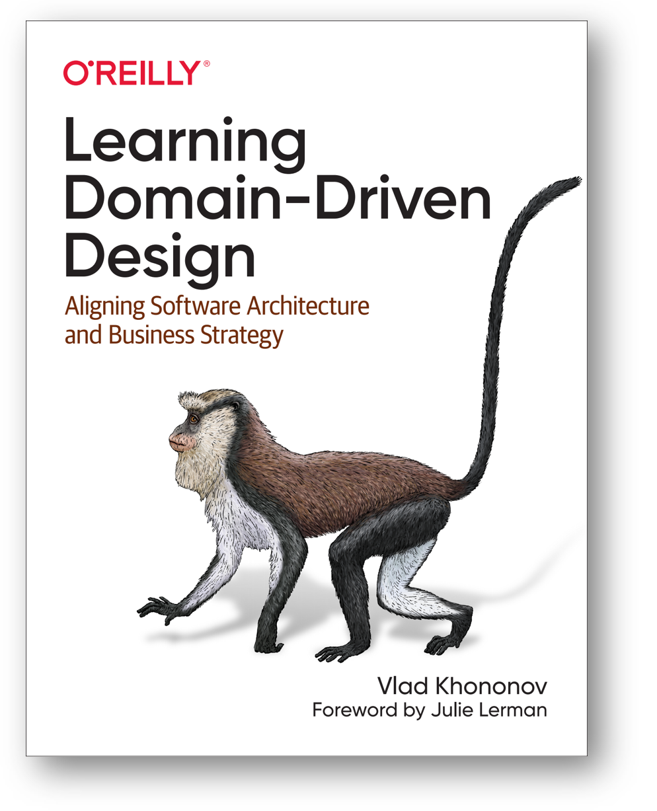
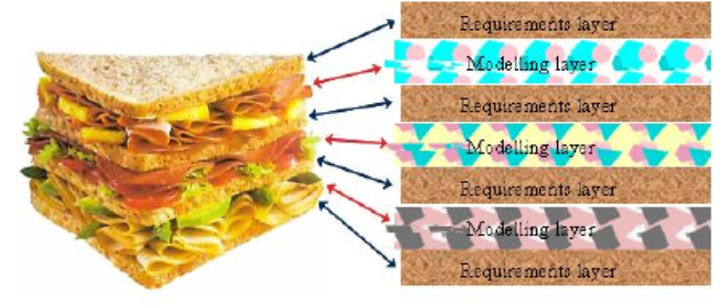
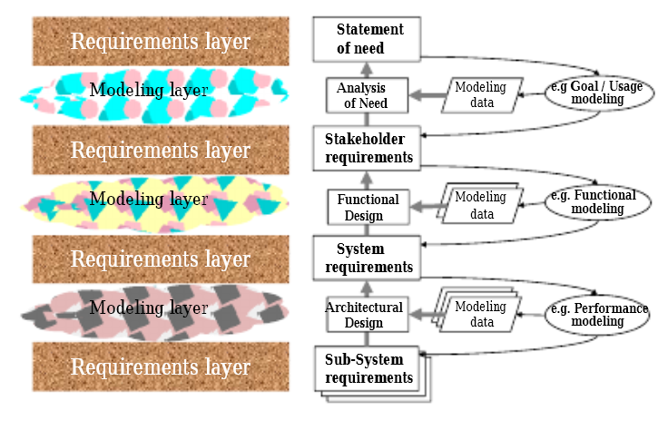
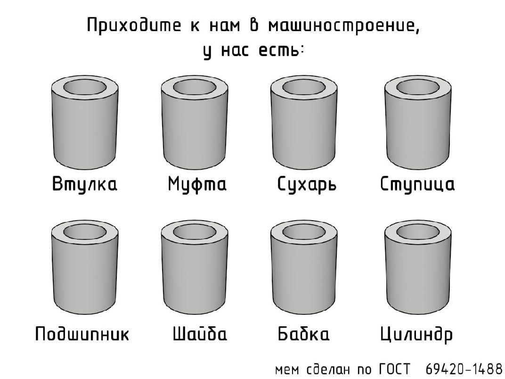
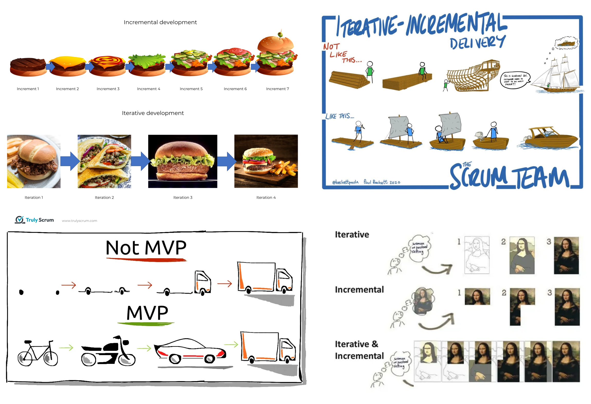

# Смерть инженерии требований

Когда первые версии нашего руководства писались до примерно 2017 года, то в нём был раздел по методам инженерии требований как обязательной составляющей лучших методов системной инженерии. Работой по этому методу занимался инженер по требованиям, одна из специализаций роли системного инженера.

Но всё изменилось, когда с 2017 года в литературе по программной инженерии вдруг перестали появляться новые книги по инженерии требований, а в 2022 году и в «железной инженерии» такие книги стали редкостью. Развитие инженерии требований прекратилось, а в работах по инженерии исчезли подробные описания методов инженерии требований, хотя само понятие требований иногда и упоминается, если речь идёт о самых консервативных областях инженерии. Наше руководство учло этот тренд, в текущих его наставлениях не говорится о требованиях, инженерии требований, роли инженера по требованиям.

Это очень контринтуитивно: если система не описана как чёрный ящик в деонтической модальности (это и есть «требования»), то как архитектор и разработчик узнают, какую систему нужно делать? Как испытывать систему, если нет требований? Увы, это всё вопросы, которые осмысленны в уходящем веке «водопадной системной инженерии», где каждая роль выполняет по очереди свой метод и передаёт результат дальше по цепочке как обязательный для следования, в том числе передаёт разработанные в проекте требования (такого, чтобы требования были разработаны клиентом, обычно нет — требования разрабатывал инженер, а клиент лишь соглашался с разработанным).

В книге «Learning Domain-Driven Design. Aligning Software Architecture and Business strategy», 2021, Vlad Khononov рассказывает, что традиционный ход разработки корпоративного программного обеспечения (часто называемого «кровавый энтерпрайз» в среде программистов) представляется как перевод разными людьми какого-то знания об организации на свой собственный профессиональный язык (скажем, «счёт» у продавца становится «офертой» у юриста, «структурой данных» у программиста).

Эти представления переводятся людьми в какие-то тексты или информационные модели, а затем идёт передача текстов и моделей на этих профессиональных языках дальше по цепочке из других ролей. Это «испорченный телефон» (Chinese whispers, broken phone), детская игра, где не очень разборчиво все говорят какую-то фразу друг другу на ухо по цепочке, а на выходе получается что-то совсем невнятное и уж точно не то, что говорилось на ухо первому человеку. Вариант этой игры — попытки передать какие-то стихи через цепочку из двух-трёх переводчиков на разные языки. Когда итог переводится на язык оригинала, текст уже невозможно узнать.

Вот эта цепочка, как она существовала раньше в инженерии (и это было много лучше ситуации, когда вообще ничего этого не происходило, а система делалась без внимания к тому, что там происходит в предметной области, «без требований», по наитию разработчиков):

* Какое-то знание предметной области организации высказывалось специалистами предметной области (subject matter experts), а затем часть этого знания переводилась в «аналитическую модель» аналитиками
* Аналитическая модель затем переформулировалась в виде «требований», этим занимались инженеры по требованиям. Аналитики не меняют мир, инженеры — меняют. Поэтому аналитики только «делали предложения по требованиям», а инженеры — требовали!
* Требования становились проектом/design программной системы, этим занимались архитекторы, понимаемые как «опытные разработчики», или даже сразу «опытные разработчики» (в Software Engineering Body of Knowledge архитекторы появились только в 2024 году, в четвёртой версии[^r8-1]), и там плохо различима собственно архитектура как структура системы и методологическая проработка функционального описания, организация системы
* Проект/design системы становился исходным кодом, этим занимались кодировщики
* Исходный код становится изготовленной системой, этим занимались DevOps.

И это мы ещё не коснулись тестов, учебных материалов для пользователей и работы служб поддержки пользователей, не коснулись многих других рабочих продуктов.

Описанная цепочка работала плохо (а кое-где она до сих пор работает, и тоже работает плохо), ибо каждое звено цепочки говорило на своём профессиональном языке.

Нам нужно сделать так, чтобы разговор пользователей, разработчиков, операторов системы шёл по возможности на одном языке — языке предметной области. Если речь идёт о финансах, то это язык не инженерии программного обеспечения, а язык финансов. Если это софт, помогающий маркетингу, то это язык маркетинга, но не язык программистов. Никаких «серверов», «асинхронных передач сообщений», «баз данных» в обсуждениях софта! Впрочем, то же самое верно и для любой другой инженерии: обсуждаем постановку задачи для инженеров на языке предметной области пользователей, а не языке разработчиков. Если у вас «органическая основа для электролита» (момент эксплуатации!), то это не «растворитель» (момент, когда разработчик выбирает, что потом станет органической основой для электролита). Если кишечнорастворимая оболочка лекарства (чтобы безопасно донести лекарство до кишечника, а не только до желудка), то не «желатин с добавками» или «агар с добавками»[^r8-2]. Обсуждается то, что должна делать система (какие объекты проявляют какое поведение), а как именно она это делает и из чего состоит, и что там за инструменты, и из чего они состоят — это совсем другие вопросы, их можно решить позже или раньше, и даже не в присутствии представителей внешних проектных ролей.

<strong>Поэтому первый аргумент против требований—</strong> <strong>разработчики не слышат того, что говорят внешние проектные роли, «испорченный телефон» до них это не доносит,</strong> <strong>в ответ на этот аргумент</strong> <strong>надо убрать цепочку из людей, а заодно и используемые этой цепочкой «требования» как лишний артефакт.</strong> Экономия времени на беседах разработчиков с внешними проектными ролями — мнимая, исправление ошибок понимания через цепочку «испорченного телефона» потом всё равно займёт у разработчика больше времени, плюс ещё потратит время много других людей. Посредников между разработчиками и внешними проектными ролями — выкидываем, а заодно выкидываем и их рабочие продукты, в том числе «требования». У разработчиков будут свои способы записать то, что они услышали от внешних проектных ролей (забегая вперёд: они сразу будут записывать услышанное в виде тестов, а тесты будут сформулированы в терминах предметной области, при этом сама программа или «железо» будет поддерживать термины предметной области. В программе «счёт» будет не «структура данных», а «счёт», в «железе» будет «ограничитель хода заготовки», а не «штырь»).

<strong>Второй аргумент в том, что деонтический характер требований</strong> <strong>(то есть характер долженствования, дозволения, предписания, рекомендации)</strong> <strong>как-то не очень вяжется с коллективным характером мышления в разработке. Любая разработка сегодня понимается как часть эволюции, часть познания, часть изучения того, как уменьшить неприятные сюрпризы. И</strong> <strong>деонтическое «я начальник, ты дурак» (с ответом</strong> <strong>«ты поручил дурацкое, я тебе сделал дурацкое»)</strong> <strong>тут не очень правильно.</strong> <strong>Поэтому вместо</strong> <strong>деонтической модальности (долженствования)</strong> <strong>переводим разработчиков на работу</strong> <strong>в доксическоймодальности</strong> <strong>(веры), вместо приказов выдаём гипотезы, которые надо проверять.</strong>

В мышлении инженеров мы используем «научный метод», который оказывается общим и для науки/исследований, и для инженерии. Только в науке мы делаем гипотезы о том, каковы могут быть лучшие объяснения, а в инженерии мы делаем гипотезы о том, какова может быть успешная система, которая меняет жизнь к лучшему. Какие-то идеи могут быть удачны, какие-то нет. То есть не «корпус системы должен быть не более 10 сантиметров шириной, исполняйте», а «сейчас верю, что корпус системы не более 10 сантиметров шириной будет успешен, пробуйте, а если нет, то попробуем другие цифры или вообще сделаем бескорпусное изделие». А где гарантии, что гипотезы подтвердятся? Гарантий нет! Выдвигавший гипотезу может ошибаться, или гипотеза верна для одного момента времени и одной ситуации, но не для другого момента времени и другой ситуации.

В ответ на предложенную гипотезу можно ещё проверить варианты, реализовать не один вариант системы, а несколько разных — и выбрать лучший. В ответ на требования — только выполнить заданное требованием, кто выдал требования — тот принимает на себя ответственность за результат.

В ходе разработки выдвигаем идеи-гипотезы, затем критикуем эти идеи, выбираем лучшие из худших (это особо оговаривается: <strong>всегда выбираем не лучший вариант, а наименее плохой, «лучший вариант» не существует в принципе</strong>) и реализуем их, проверяя уже жизнью. Потом пробуем улучшить эти идеи, а если не получается улучшить, отказываемся от этих идей и пробуем что-то ещё. С требованиями так не получается, там «делай, что говорят» — критика не уместна, водопад назад не течёт.

В варианте с гипотезами нет требований, но есть какие-то идеи о том, какой могла бы быть система, меняющая жизнь к лучшему (ну, или хотя бы новое поведение/функция системы, функциональный объект, его выполняющий, называют feature), и эти гипотезы сразу можно записывать в виде тестов, которые проверяют их реализацию.

В организационном менеджменте такие идеи сразу называют «предпринимательская гипотеза» (если речь идёт о выпуске нового продукта или новой «фичи» в продукте). В классической инженерии такие идеи имеют специальную форму и их могут называть «концепция», чтобы отличить от жёстких требований. Для системы в целом это могут называть пользовательская концепция (operations concept, OpsCon) или концепция использования (concept of operations, ConOps), причём разные школы инженерии или находят нюансы в различении этих понятий, или наоборот, считают одним и тем же. Мы будем следовать предложениям книги «Systems Architecture. Strategy and Product Development for Complex Systems», 2015, и говорить о просто концепции/concept использования, без нюансов различения (при этом книга выпущена давно, требования, конечно, в ней есть — но есть и концепции).

Эта книжка уже не про программную архитектуру, а системную (прежде всего киберфизических систем, типа ледовой буровой платформы или космического корабля) архитектуру, но в подзаголовок и в книге по DDD, и в книге Systems Architecture вынесена «стратегия»: метод, который должен привести к успеху.

В принципе, и «стратегию» (метод/функция, который по возможности рационально выбирается в ситуации, когда непонятно что делать) можно было бы считать функциональными требованиями к предприятию, но этого слова «требования» в случае предприятия тем более избегают: стратегия сегодня считается непрерывно уточняемой, это тоже гипотеза о том, что было бы в текущей ситуации делать лучше всего (или как заметят архитекторы — что в текущее ситуации делать менее плохо, чем всё остальное, включая делать «ничего»).

В помянутых двух книгах ещё и слово «архитектурный» устарело: до 2017 примерно года архитектурой повсеместно называли решения опытных разработчиков, которые принимались рано по жизненному циклу в силу того, что дальше эти решения было трудно менять без того, чтобы не переделывать всю систему. И эти решения принимались очень похоже на то, как принимались требования — в деонтической модальности, это точно не были гипотезы, разве что требования разрабатывали в инженерной команде, но принимались они вроде как от лица клиентов, а архитектурные решения разрабатывались тоже в инженерной команде, но принимались они от лица опытных разработчиков, называемых «архитекторы». Более того, не слишком различались описания чёрного ящика (система и её поведение, наблюдаемое извне, без описания внутреннего устройства системы и внутреннего поведения системы — требования) и описания белого/прозрачного ящика (система и её поведение, наблюдаемые внутри системы, на уровне подсистем — архитектура как важнейшие решения). В технических заданиях легко можно было встретить в разделе требования и указания на функции системы, и указания на какие-то подробности конструкции (вроде «несущую ось делать из титанового сплава»), и это утверждалось клиентом как «требования», хотя иногда архитектурные решения выдавались за «ограничения» (формально оставаясь, тем не менее, «требованиями», да ещё и «требованиями клиента», хотя разрабатывалось это инженерной командой проекта, а клиент лишь соглашался с результатами этой разработки, «согласовывал»).

Сегодня понятие «архитектуры» как решений опытных разработчиков в части основных решений по верхнеуровневой структуре и организации системы, которые трудно поменять без переделки всей системы — устарело. «Архитектура» теперь относится не «ко всему важному, чтобы это ни было», но только к архитектурным характеристикам и структурным/конструктивным решениям модульного синтеза, о чём будет подробней в следующих разделах.

«Стратегия» тоже перестала быть аналогом важных требований к поведению создателей (в деонтической модальности), но стала гипотезой/догадкой о наименее плохом поведении создателя (доксическая модальность). Стратегия тут — эвристика, суеверие, может и должна пересматриваться.

Требования выполняют, гипотезы и эвристики — проверяют/пробуют. Реализация стратегии — это не выполнение требования, ведущее к гарантированному результату. Это следование эвристике, проба действовать на основе (возможно, ошибочной) предпринимательской гипотезы/hypothesis/ставки/bet, ведущая к возможному, но не гарантированному успеху.

Это означает, что стратегия в случае обнаружения несоответствия гипотезы и жизни может быть подправлена, чтобы это соответствие случилось. И точно: несмотря на то, что книжка Systems Architecture описывает вроде как «водопад», много внимания в ней уделяется идее постепенного уточнения системной архитектуры в её старом понимании (мы будем называть её «концепция системы», чтобы не путаться) в ходе работы над проектом, выдвижение новых гипотез и их уточнение, а иногда всё-таки отбрасывание и переход к полностью новым гипотезам.

<strong>Концепция</strong> <strong>системы</strong> <strong>(«старая архитектура»)—</strong> это описание того, каким образом какой-то набор конструктивных частей целевой системы исполняет роли функциональных частей системы, чтобы в конечном итоге выдать требуемый от системы сервис на уровень надсистемы в момент использования. В концепции системы выделяют тем самым:

* Высокоуровневое (на один-два уровня) функциональное описание. Раньше говорили «функциональная архитектура», «логическая архитектура», «функциональная организация», подчёркивалось, что они получаются разбиением сверху вниз. Сегодня — идея «последовательного разбиения сверху вниз в ходе разработки» признана полностью неработоспособной, «так бывает только в сказках». Сегодня чаще всего говорят про из средних слоёв синтез вверх и разбиение вниз при общем итеративном характере процесса. И сегодня вместо разбиения/анализа говорят про синтез функционального описания. Делает этот синтез прикладной методолог, процессный инженер, функциональный проектировщик — названия роли тут могут быть самые разные, на выходе что-то типа «принципиальной схемы» (вы должны быть уже хорошо с этим знакомы, ибо владеете мастерством методологической работы по нашему руководству, в руководстве по методологии об этом было подробно).
* Высокоуровневое (на один-два уровня) конструктивное описание. Раньше говорили «структура системы», «конструкция», «физическая архитектура». Сегодня говорят просто «архитектура системы», что может легко сбить с толку (раньше архитектура системы по факту была «концепцией системы»). Архитектурное описание говорит о такой архитектуре как разбивке на модули (или не о разбивке, а о синтезе из модулей, «модульном синтезе» — зависит от того, как вы смотрите на конструктивную иерархию), которая даёт необходимые важнейшие архитектурные характеристики (раньше это были «требования качества», которые относились ко всей системе в целом и не относились к предметной области, в которой работала система — не были «функциональными требованиями», определяющими прикладную специфику системы): высокую скорость развития/evolvability для времени создания системы, возможность масштабирования как увеличения производительности по мере роста потребности в сервисе системы, собственно самой производительности системы, и т.д. Конструктивное описание, описание структуры системы — это разбиение на конструктивные модули и определение способов связи этих модулей через интерфейсы. «В сказке» тут тоже сначала надо было разбивать (системный анализ, «разбиение») систему как функциональный физический объект на подсистемы, которые разбивались на всё более и более мелкие подсистемы, а затем конструктор определял самые мелкие детали (деталь — это часть конструкции, которая сама уже не собирается из других частей), которые выполняли функции подсистем (необязательно 1:1, это рассказывалось в руководстве по системному мышлению на примере ножниц и чайника), а проектировщик собирал/синтезировал из этих деталей целую систему как конструктивный физический объект. Идея «только синтез, только снизу вверх» уже признана сказочной, в жизни это невозможно, возможен только итеративный процесс разработки конструкции, тоже чаще всего от средних слоёв конструктивной иерархии постепенно модульный синтез вверх и модульное разбиение вниз, принцип «изнутри наружу». Этим занимается обычно архитектор в его современном понимании, на выходе это чаще всего называется «эволюционная архитектура», чтобы показать её неокончательный и меняющийся характер, и главная там идея — подобрать такие элементы конструкции, чтобы изменение функциональных частей системы по минимуму влияло на изменения конструктивных частей системы. Это мы подробно расскажем в разделе «Эволюционная архитектура» нашего руководства.
* Кроме согласованных между собой высокоуровневых функционального и конструктивного описания в концепции системы, конечно, участвуют и другие виды основных системных описаний, минимально там ещё описания размещения и стоимостные, но могут быть и необходимые другие описания (это подробно разбиралось в руководстве по системному мышлению).

<strong>Концепция использования</strong> — это аналогичное концепции системы описание

<strong>надсистемы</strong>: каким образом целевая система играет в надсистеме функциональную роль, позволяющую достичь нужных функциональных и архитектурных характеристик надсистемы, то есть удовлетворить потребности внешних проектных ролей, а также описание системы как конструктивной части, которая имеет какие-то интерфейсы к конструктивным частям надсистемы, а также эта целевая система где-то размещена и имеет какую-то стоимость.

В упомянутой книге по системной архитектуре очень верхнеуровневая начальная концепция системы называется просто «основная идея», а вот то, что там называется «архитектурное описание» (и даже просто «архитектура», в руководстве по системному мышлению мы говорили, что инженеры очень вольно обращаются с типами и часто используют троп[^r8-3] метонимии[^r8-4]) даётся по старинке, как дополнение и расширение концепции в сторону прозрачного ящика со всеми видами системных описаний. Конечно, система описывается в том числе и как достигающая каких-то значений важных архитектурных характеристик/-ilities/-остей (например, надёжность, ремонтопригодность, и из относительно новых важных характеристик — evolvability, изменяемость в ходе развития, testability, возможность лёгкого тестирования, deployability, возможность быстрого разворачивания для эксплуатации без длительного нерабочего времени). Архитектурные решения по книге просто детализируют концепцию системы, учитывая множество дополнительных соображений кроме «вот эти функции можно реализовать вот такой конструкцией, чтобы добиться вот таких сервисных характеристик системы-модуля в целом». В современном подходе эволюционной архитектуры принимаемые архитектором решения не столько детализируют все (функциональные и конструктивные) решения концепции, сколько накладывают ограничения на конструктивную часть концепции: «вот эта конструкция должна быть разбита на вот такие части-модули с вот такими между ними интерфейсами, чтобы добиться вот таких-то архитектурных характеристик».

В книге для рассказа используется диаграммная техника OPM (object-process modeling), в которой есть объекты, связанные друг с другом отношениями. И среди этих объектов выделяют функции (поведение), которые выполняются некоторыми инструментами (конструктивными объектами) над некоторыми пассивными объектами («молоток бьёт по гвоздю»). В руководстве по системному мышлению отмечался такой подход: в некоторых инженерных традициях не принято говорить о функциональных объектах, а принято говорить о поведении/функции, само же поведение-функция приписывается потом сразу конструктивным объектам, функциональные объекты при этом подразумеваются. Конструктивные объекты в упомянутой книге по системной архитектуре называют «формами». То есть вместо «камень::конструктив играет роль забивала::функциональный объект, а забивало забивает::функция связыватель::функциональный объект, роль которого играет гвоздь::конструктив» говорят короче: «камень::форма/конструктив забивает::функция гвоздь::конструктив». Таким образом, весь рассказ о забивале довольно легко понять: современная концепция использования — это архитектурная работа (функциональная декомпозиция и модульный синтез), как она обычно понималась раньше в системной инженерии, только на буквально один уровень в надсистеме (забивало нужно там). Отсюда и упоминание стратегии как отсылка к целеполаганию: концепция использования как раз говорит о выявлении функций целевой системы, которая сделает надсистему успешной.

Сегодня создание концепции системы уже не называют архитектурной работой, ибо современная архитектурная работа связана не столько с созданием концепции использования (хотя в ней могут быть заданы приемлемые значения архитектурных характеристик, архитектор этим живо интересуется и высказывает гипотезы об их значениях), сколько с созданием концепции системы в части верхнеуровневого задания конструкции системы такой, чтобы дальше можно было как можно более независимо разрабатывать отдельные части этой конструкции.

Конечно, современные и концепция использования, и концепция системы задаются не «деонтически» (как требования), а как гипотезы, эвристики, которые могут быть и изменены, если выяснится, что они не ведут к успеху. Поэтому раньше иногда говорили «требования архитектуры», а теперь предпочитают говорить «архитектурные решения».

Раньше, когда опытных разработчиков называли «архитектор», а создаваемую систему поначалу описывали в виде «набора требований», о концепции использования предпочитали не говорить как о важном рабочем продукте — ровно потому, что её не утверждали так серьёзно, как требования, она изначально воспринималась как «документирование гипотез». Кто-то приходил с идеей, затем оформлял идеи в виде концепции использования, и это был «мутный вопрос», в учебники по системной инженерии и стандарты он не попадал, ровно потому как казался «недостаточно строгим». Скорее, это был вопрос маркетологов, политиков, предпринимателей, кого угодно, но не инженеров — инженеры не выходили с идеей продукта, а если и выходили, то неформально, решение о выделении ресурсов на «серьёзную работу», то есть разработку требований, должны были принимать не они, а «кто-то с деньгами», но написать для этих «людей с деньгами» неформальные предложения должны были как раз инженеры.

Внешние проектные роли могли общаться с инженерами, но в формальный жизненный цикл однократной разработки это не попадало. Только некоторые школы системной инженерии соглашались, что разработка концепции использования входит в жизненный цикл инженерного проекта, в большинстве других школ в этом месте просто говорилось, что «надо написать текст на несколько страниц с основной идеей», не прояснялось как это делать и кто это делает. Когда приходят к инженерам, то уже кто-то сформулировал концепцию использования. Если концепцию использования и формулировали инженеры, которые искали себе работу, а потом «продавали» идею предпринимателям, то это не акцентировалось. Это не было «официальной» работой инженера, в то время как формулирование «требований» было как раз работой инженера, но считалось, что требования тоже — поступают от клиентов, менеджеров, кого угодно, но не от самих инженеров. Инженеры только «выполняют требования». Изменение требований, конечно, было возможно — но «приказ сначала выполняется, потом обсуждается». Изменение требований означало, что мы вышли за пределы предписанного «наукой» способа разработки «сверху вниз» (то есть поднимались по водопаду вверх!).

После того, как в проект вбрасывалась концепция использования «на трёх страничках», выделялись деньги — и проектом дальше занимался инженер по требованиям. Он делал реверс-инженерию надсистемы и документировал в виде спецификаций требований описание целевой системы, которая должна будет удовлетворить потребностям. Разработчики системы (прикладные инженеры, архитекторы, специалисты по инженерным обоснованиям) тем самым отсекались от общения с внешними проектными ролями. Это пытались исправить ходом на «модели требований», где кроме собственно формулировок требований пытались отметить, что кто из внешних проектных ролей говорит, на чём настаивает (переход на язык предметов интереса и интересов вместо языка конкретных значений, а также указание ролей, высказывающих свои интересы и их конфликтов, которые нужно как-то решать).

Потом «водопад» продолжал падать сверху вниз: требования (среди которых часто были и архитектурные решения, ибо системного мышления и понимания про разницу решений по вопросам снаружи границы целевой системы и вопросам внутри границы целевой системы не было) передавались системным инженерам-архитекторам, которые принимали решения по поводу концепций на следующих уровнях, и уже они формулировали требования на уровень ниже, то есть требования к подсистемам.

Скажем, идея нового самолёта приходила откуда-то «из бизнеса» (хотя неформально активно обсуждалась с инженерами), потом составлялись требования, потом архитектор делил проект на части и формулировал требования к двигателю, выбирая его концепцию: реактивный он будет, турбореактивный, или двигатель внутреннего сгорания для приведения в движение пропеллера. Эта «концепция следующего уровня» так даже не называлась, а архитектор просто выступал инженером по требованиям по отношению к архитекторам следующего уровня (архитектор самолёта выступал инженером по требованиям по отношению к архитекторам авиадвигателя).

В жизни всё работало совершенно не так, существенно итеративно, но обсуждалось именно так — строго постадийно. Ключевая модель концепции системы (с верхним уровнем как концепции использования, а дальше «прозрачный ящик) выглядела как «модель сэндвича»[^r8-5], 2004 год.

Хлебом как раз были «слои требований». А поскольку требований оказывалось много разных, они начали получать разные названия:

<strong>Проблема была в том, что в этих картинках требования считались неизменными (раз и навсегда определяемыми), а моделированию позволялось изменяться по ходу всё лучшего и лучшего понимания предметных областей. «Заказчик» вроде как обязывался быть стабильным (как будто он сам не инженер! Как будто он обладал изначально совершенным знанием того, что ему нужно!</strong> <strong>Как будто говорил не гипотезы, а абсолютные истины!), а модельеры каждого уровня могли только торговаться по поводу удовлетворения этих стабильных требований.</strong> <strong>Эти спецификации ещё и ограничивали, как выяснилось, генерацию изобретательских идей</strong>[^r8-6]<strong>.</strong>

Требования в жизни оказались непрерывно изменяющимися на всех уровнях (водопад в реальности тёк снизу вверх во всех проектах!), но это не отражалось ни на каких диаграммах, в головах был «водопад», изменение требований наказывалось, было «сходом с дороги в бездорожье», а не нормальным ходом вещей. Если требования можно менять, то какие же они тогда «требования», в чём «долженствование»?

Основное время проводилось тем самым не за «требованиями» (которые потом в конце проекта можно было по-быстрому оформить, подписать — и сдать в архив, не читая), а за самыми разными моделями «чёрных ящиков», как раз modeling layer — и вот сами эти модели как рабочие продукты не показаны на диаграммах сэндвича, скрыты за словом слой/layer! Все эти use cases, концепции использования, разные варианты сценариев, функциональные диаграммы, списки внешних проектных ролей считались просто вспомогательными для получения требований.

Дальше переходили к моделям прозрачного ящика (показаны как очередной modeling layer, но уже уровня подсистем), по которым потом генерировались требования к подсистемам. Формально требования должны были идти дальше по цепочке «испорченного телефона», а неформально (чаще всего) они оформлялись — и без чтения шли в архив, а настоящая работа продолжалась с моделями систем, подсистем. Что надо было изменить? Объявить lean — не делать лишнюю работу, генерацию требований на основе готовых моделей! Оставить слои моделирования, выкинуть слои требований! Это бы и была «гибкая/agile методология разработки», а «анархия» убиралась при этом управлением конфигурацией (прежде всего — конфигурацией моделей: известно на любой момент времени, какие из версий моделей отражают последние договорённости в проекте). Но нет, несоответствие «водопада» и жизни объяснялось как «инженеры-разработчики системы, вы недостаточно стараетесь соответствовать идеалу», а не «менеджеры-организаторы проекта, вы очень плохо понимаете, как создают и развивают системы, ваши идеи в корне неверны».

Регламенты «водопада» требовали работы на основе требований, а не моделей — и поэтому приходилось изворачиваться, уходить от разных проверок. Было очень неудобно: работать «как предписано водопадом» не получалось, а нормально работать — непонятно было, как именно, теории не было, регламентов такой работы не было, изобретались неэффективные велосипеды, но зато проект хоть как-то шёл. Увы, во многих проектах до сих пор такая ситуация, исключением тут являются пока только проекты программной инженерии, но и те — в передовых компаниях.

Так, знание моделей use cases (тот самый modeler layer), из которых и извлекались требования, никуда от инженеров по требованиям не попадало кроме того, что оказывалось в требованиях. Эти требования шли дальше по цепочке от инженеров по требованиям — к архитекторам (в те времена архитекторы были — «опытные разработчики» следующего уровня, то есть разработчики концепции системы, а не концепции использования). И тестирование тоже было не того, что в моделях — тестирование было по тестам, которые делались на основе требований, люди занимались тестированием очень поздно по жизненному циклу (однократному!).

Встречи разработчиков с агентами, исполняющими внешние проектные роли считались злом, отвлекающим от работы, общаться с внешними проектными ролями предлагалось только инженерам по требованиям, «для эффективности». Разработки при этом шли очень медленно и дорого. Много действий происходило в проекте неформально, вне всяких регламентов и предписаний методологий разработки. Любое изменение в понимании системы и её окружения становилось адом: изменять часто нужно было требования, которые представлялись всем незыблемыми. То есть «изменение незыблемого» было постоянно, ощущалось это как непрерывная авария, непрерывный пожар в проекте.

Главным инструментом моделирования для получения требований стали сверхкраткие текстовые описания того, какое ожидается поведение системы в надсистеме (концепции использования), а затем модели use cases: формально представленные сценарии, по которым система как целое (или части системы как целое) взаимодействуют со своим окружением. Напомним, что в use cases некоторые акторы/агенты (живые и неживые, просто способные к взаимодействию) как-то взаимодействуют с системой, и показываются реакции системы, её поведение, которое и оказывается функциями системы. А требования? Они появлялись в результате документирования как-то уторгованного среди разных внешних и внутренних проектных ролей понимания того, как ведёт себя система (или подсистема) в разных вариантах взаимодействия с окружением.

В итоге совсем недавно было признано:

* Важны не требования, а непрерывно уточняющиеся поведенческие модели (модели изменения состояний в ходе функционирования), то есть сценарии использования, диаграммы активности и другие виды моделей, отражающих поведение системы. Эти поведенческие модели отражают непрерывно меняющийся набор гипотез о том, что должна делать успешная система. Поскольку вопрос об успешности системы (успешности подсистемы, и т.д. по уровням), то в этих моделях должны учитываться и внешние проектные роли (а внутренние проектные роли вполне могут быть внешними проектными ролями для подпроектов: разработчик самолёта будет внешней проектной ролью по отношению к разработчику авиадвигателя).
* Этими моделями должны заниматься сами разработчики без посредников в лице «аналитиков» или инженеров по требованиям. Прикладные разработчики с «архитекторами как опытными разработчиками», или сначала визионеры с эволюционными архитекторами, а прикладные разработчики с методологами/«functional designer»/«process engineer» потом (более современный вариант) — это уже не так важно, главное, что без «испорченного телефона».
* Поскольку требований нет, то их и не надо менять, «брать назад поручение сделать, признаваться в ошибке». Меняется (уточняется!) понимание, отражаемое в моделях как гипотезах. Модели (и чёрного ящика, и прозрачного ящика) меняются «в рабочем порядке», анархии и неминуемых многочисленных ошибок при этом нет, ибо налажено управление конфигурациями, все версии учтены, исправления делаются только в актуальных версиях, за основу дальнейшей работы берутся только актуальные версии.
* Людям в проекте при этом можно и нужно менять своё мнение (свои инженерные решения), аргументы (обоснование инженерных решений) берутся из моделей и основываются на результатах моделирования и проводимых экспериментах. Любая реализованная версия системы объявляется прототипом для следующей улучшенной и дополненной новыми «фичами» версии, даже если изготавливается всего один экземпляр: никакой экземпляр в эволюционной разработке не является последним. Если даже это летит ракета на Марс, то это не единственная попытка. Будет получено новое знание, и модели для следующей летящей на Марс ракеты поменяются. Каждая следующая ракета будет лучше предыдущей, или изменится так, что будет не хуже (помним, что эволюционный ландшафт динамический, и нельзя просто ничего не менять, чтобы оставаться приспособленным).

Что же сегодня предлагается «вместо требований»? Вместо — ничего, требования просто выкинули как лишний рабочий продукт. Незачем класть в архив то, что потом никогда не будет посмотрено. Ну, или нужно только для суда, определить формально «кто виноват» — «подписал требования». Но суд может и должен разбираться «по существу дела», а не «на основе сданных в архив документов». В суде ведётся расследование, а не просто берётся документальный факт из архива.

Но что будет «без требований» описывать систему на её границе? Набор постепенно уточняющихся и изменяющихся моделей и других описаний «чёрного ящика» (а иногда и «серого ящика», то есть на несколько системных уровней), по которым и ведётся разработка полной архитектуры. Но и это не последний исторический ход избавления от испорченного телефона и лишних рабочих продуктов.

Последний ход — это онтологическое моделирование в форме DDD, чтобы «попасть в предметную область» и получить bounded context (по факту — синоним «предметной области», набор типов предметов, которые задействуются в каких-то методах совместно). Да, и в «железной» инженерии онтологическое моделирование тоже есть, слова там важны, описывать предметы тоже надо. Вот пример на картинке:

А в какой форме описывать поведение? В форме use case? Да, так и делали — но потом оказалось, что поведение можно писывать сразу в форме тестов — чтобы проще было проверять это поведение. В программной инженерии это можно делать сразу на языке тестов, например, записывая сценарии в синтаксисе Gherkin системы тестирования Cucumber[^r8-7]. Вспомним, какие мы тут поминали рабочие продукты:

* Сценарии (описывают поведение системы)
* Требования (они лишние)
* Проект/design с детальностью, достаточной для изготовления.
* Тесты, которые проверяют выполнение требований, а если их нет — сценариев.

Выкидываем требования, а сценарии записываем в формате тестов — как то, что проверяется. Тем самым:

* Если что-то меняется, вы сразу меняете тесты — и они же сценарии (вы же собираетесь проверять сценарии? Вот и записывайте их сразу в формате, удобном для проверки).
* Отдельных сценариев и отдельных тестов, которые вы будете писать по сценариям — нет, это lean/элегантность. Ненужная работа не делается. Разработка ведётся так, чтобы удовлетворить тестам, они же «ожидаемая модель того, что будет происходить».
* Отдельных сценариев и разрабатываемых по ним требований, по которым потом идёт разработка (создаётся проект системы с детальностью, достаточной для изготовления — например, программы для станков с ЧПУ или исполняемый программный код), к результатам которой потом разрабатываются тесты — нет. Тут lean, есть сразу тесты, они же — сценарии.

А если у вас какой-то обязательный в силу закона (требования!) стандарт, выполнение которого проверяется какими-то силовиками? Вы в ситуации «соблюдения закона»/compliance/«проверки соответствия». Попросите AI-систему перевести стандарт с требованиями в формат сценариев, который запишите на языке тестов, как мы подсказали[^r8-8]. Дальше всё как обычно: разрабатывайте систему, обоснование успешности разработки будет на основе прохождения тестов. Этот подход называется даже не TDD (test-driven development[^r8-9]), а BDD (behavior driven development[^r8-10]) как развитие TDD, и там ещё много вариантов (ATDD, acceptance test-driven development[^r8-11] тут только один из возможных вариантов[^r8-12], ибо встречаются и другие модификации примерно того же самого test-first подхода, причём test-first был когда-то отдельным термином, потом стал синонимом для TDD[^r8-13]: EDD, example-driven development[^r8-14], SDD, story-driven development[^r8-15], SpecDD, specification-driven development[^r8-16] — все с одной и той же идеей записать желаемое поведение системы в какой-то форме, которая будет удобна для проверки или даже не будет требовать проверки, ибо система будет просто компилирована/синтезирована из спецификации желаемого поведения).

Behavior — это отсылка к методу/функциям, так что это прямая заявка на выполнение моделирования функций системы (впрочем, и функций подсистем) методологами/«функциональными проектировщиками», но результат документируется в виде сценариев поведения, автоматически трансформируемых в набор тестов для их проверки, сценарии пишутся по факту на языке тестирования. А что с поведением? Сценарий на языке тестирования как раз выражает поведение, которое надо проверить!

А что с новыми вариантами методов работы со сценариями использования в их классическом виде, например, Use Case 3.0? Они тоже остаются в прошлом[^r8-17].

Почему же тогда тесты не назвать требованиями? Потому что это не требования, а тесты (и раньше тесты разрабатывались на основе требований, они ведь отличались от требований и назывались тесты/испытания, были программы испытаний). Ровно так же use case это use case, а не требования (они ведь и раньше различались): проблема не в переименовании, а в том, что перестали делать продукт «спецификация требований», который отражает описание чёрного ящика в деонтической модальности. Делаются гипотезы по поводу возможных таких описаний, эти гипотезы документируются в виде моделей, для которых можно организовать автоматическую проверку соответствия модели (то есть модели пишутся сразу как тесты, на языке тестирования). Эти модели (и тем самым тесты) не очень «требовательны», но «предположительны» и предполагают постоянное изменение по мере изменения общей проектной ситуации (внешние изменения в мире, изменения в бизнесе, изменения в понимании инженеров, учёт новых изобретений и т.д.).

Теперь разберёмся с постепенностью: это наша знакомая эволюционная/непрерывная разработка системы, она же создание MVP, а затем развитие системы. Раньше её описывали иногда как «инкрементальную разработку», а иногда как «итеративную разработку», противопоставляя их друг другу. И приводили самые разные картинки, которые нагло врали (из лучших, конечно, побуждений! Ибо приводимые метафоры не полностью соответствовали сути явлений). Вот типичные примеры этих кривых метафор:

Дальше возможны самые разные интерпретации — там можно услышать и «знаем, что хотим», и «не знаем что хотим», и «только через MVP», и «просто каждый раз ведите разработку с самого начала». Нет, там другие идеи:

* Если рассматривать продукт, то есть идея инкрементальности: свойства продукта прирастают инкрементально в каждой версии (а уж за счёт новых частей продукта или переделок старых частей — дело десятое). Инкрементальность — это про продукт. Знаем ли мы, что там будет с продуктом? Не факт, но можно что-то такое представлять — это будет Roadmap. Инкрементальность разработки моделируется в roadmap: какие фичи (их так называет пользователь, «возможности», а вот для разработчика это «приращения функциональности продукта», инкременты продукта) в какой версии будут реализованы.
* Если рассматривать процесс, то есть идея итеративности: мы выпускаем новые и новые версии продукта, каждый раз прокручивая какой-то инженерный процесс, то есть уточняя концепцию использования (определяем, что наша система будет делать — какие старые функции выкинем, какие новые добавим, какие ошибки исправим, какие оставим), затем (логически, в физическом времени тут итеративная совместная работа) уточняя концепцию системы (и архитекторы следят тут, чтобы на предыдущем шаге концепция системы уже была такая, чтобы какой бы следующий шаг ни был, изменения были минимальными — поэтому все эти безумные неверные картинки с MVP, проходящими велосипед-мотоцикл-легковушку-фуру надо выбросить).
* Лучшие умы пришли к выводу, что нужна и итеративность, и инкрементальность — но они продолжали как-то противопоставлять шершавое и кислое. Нет там противопоставления! Это разговор про продукт и про процесс, два отдельных разговора.

Ошибка таких картинок была в том, что они опирались на устаревшие трактовки инженерного процесса, ещё во времена до понимания эволюционной архитектуры, во времена «старой архитектуры», где был «опытный разработчик» и ходили идеи «прототипов» в «спиральной модели разработки». Эти прототипы надо было делать «для получения информации» — и затем выкидывать. Эволюционная архитектура сразу поставила вопрос о том, что архитектор не принимает важные решения, которые поменять потом нельзя, если всё не выкинуть. Нет, архитектор старается сделать так, что ничего выкидывать целиком не придётся, все изменения будут локальны, переписывать « с нуля» не надо!

Идея картинок была в том, что «растёт функциональность», она инкрементально добавляется по сравнению с MVP, но архитектора за такое надо уволить сразу, такого не должно быть! Архитектура, понятно, тоже меняется! Но посмотрите: во всех этих примерах видно, что конструкция системы на «правильных» вариантах кардинально меняется, её надо переделать полностью! Это фиаско, провал, неудача, прототипирование с их выкидыванием сегодня — не лучшая практика. Можно думать и так, что в любой момент времени в проекте ничего нет, кроме прототипа, любая версия — прототип, гипотеза о том, что надо было бы делать, дальше получаем отклики от внешних проектных ролей, меняем прототип на следующий, <strong>делаем инкремент в следующей итерации.</strong>Но прототипы никогда не выкидывают целиком, переделывать надо какие-то отдельные модули, но не всё вообще! И если это не так, то это провал, фиаско, неудача архитектора (ну, или надо признать, что «проект оказался неудачным, закрываем его, делаем вираж/pivot, начинаем заниматься другим продуктом»).

Поэтому после прихода эволюционной архитектуры начали аккуратно писать про «эволюционную разработку», могут обсуждать инкременты и итерации, но вот противопоставлять итерационную и инкрементальную разработку — этого уже никто не делает. Как и не выкидывают прототипы целиком. Хотя иногда выкидывают не только прототипы, но и вполне рабочие текущие версии –но это очень серьёзное и очень редкое решение.

Подробней это разбирается при обсуждении работы «эволюционного архитектора». Конечно, так («эволюционный архитектор») его никто не называет, называют просто «архитектор», но и старого «опытного разработчика» тоже могут называть «архитектор», да и «функционального архитектора» могут называть «архитектор», хотя он методолог, да и результат его работы могут назвать «архитектурой». Помним пример из руководства по методологии: архитектурой искусственной нейронной сети называют её рассмотрение как протекание потоков данных через какие-то функциональные блоки. Архитектурным описанием нейросети обычно считают или dataflow диаграмма или псевдокод алгоритма обработки данных нейросетью. Но это не современный вариант понимания «архитектуры», ибо про модули тут вообще не идёт речь, это «функциональная архитектура», которая в современном архитектурном языке вообще отсутствует. Каждый раз проверяем: про какую архитектуру и какого архитектора идёт речь!

Обычно мы сразу не очень понимаем, чего хотим, и добавляем какие-то кусочки — и всеми этими кусочками можно пользоваться. Если мы делаем карандаш, то на первой итерации в первой же версии мы делаем карандаш из глины и угля в бумажном пакетике, затем потихоньку меняем глину на пластик, уголь на графит, пакетик на картонную коробку. Сохраняем что можно, меняем всё на более функциональное. Или даём пользователю шикарный современный графитовый (или тоже пластиковый) грифель, он им пользуется, но пачкает руки. Добавляем пластиковый корпус к грифелю, но пачка карандашей рассыпается по столу и неудобно продаётся. Добавляем картонную коробку. Понимаем, что можем положить в коробку и точилку, чтобы её покупали у нас, а не у конкурентов — и делаем её той же расцветки, что и коробку, чтобы уж точно не путали «наше» и «не наше». Модель карандаша при этом существенно меняется, при этом поначалу и карандаша нет как продукта, а потом карандаш становится только частью продукта. Это две стратегии получения карандаша (и одна даже вышла на коробку и точилку в придачу к карандашу), но может быть реализована какая-то смесь двух стратегий, или обе сразу (это ж всё гипотезы на каждом шаге!), всё зависит от того, сколько у нас ресурсов, сколько мы можем опробовать вариантов. И надо помнить в ходе всего проекта: <strong>«обычно мы сразу не очень понимаем, чего хотим» сохраняется в любой момент разработки, а не только в самом её начале!</strong> <strong>Итерации не прекращаются, инкременты не прекращаются! Разработка и выпуск разных версий продукта непрерывны, эволюционны!</strong>

Этот подход (беседа клиентов и других проектных ролей с разработчиком, документирование гипотез разработчика с предложением тестов вместо требований) был использован даже для «неживых программистов», а именно для генератора кода TiCoder[^r8-18] (test-driven interactive coder), который был разработан на основе больших языковых моделей ещё в 2022 году. В этой работе уточняли намерение человека-программиста, подтверждая или опровергая предложения TiCoder и получили соответствие кода намерениям в 90.4% случаев. Метод/workflow назвали TDUIF (test-driven user-intent formalization). Сегодня большие языковые модели делают такое (и лучше) «из коробки», это уже стандартный путь разработки. Код компьютер-разработчик напишет лучше программиста-кодера, но для него пока нужно поставить задачу. Формализовать задачу до уровня, достаточного для однозначного решения задачи в форме кода программы можно в ходе диалога (непрерывное уточнение задачи), а не просто написав какие-то требования и утвердив их. Нет, вы будете формулировать гипотезы по поводу того, как должна вести себя программа — и оценивать результаты, затем корректировать гипотезы. Сегодня это штатный метод работы в software engineering (мы говорили о vibe coding), но это становится штатным методом работы и в инженерии системы другой природы — умеющие поддержать разговор на естественном языке большие языковые модели используются и в машиностроительных САПР (CAD/CAM/CAE). Эта сфера столь стремительно развивается, что мы не даём тут ссылок: ситуация изменяется еженедельно, исследуйте вопрос о готовности инструментов к такой работе сами.

Рассказанная здесь история про отказ от требований произошла главным образом в программной инженерии (включая, как видим, и работы по автоматизации работы программных инженеров), в меньшей мере инженерии киберфизических систем, ещё меньше в строительстве, а во многих других сферах оказалось, что «когда караван поворачивает, хромой верблюд оказывается впереди»: там не наладили работу по требованиям, поэтому отказа от требований и не будет.

В проектах зато стало нужным разработчикам кроме моделирования самой системы «от границы внутрь» моделировать ещё и внешнее поведение системы в плотном контакте с внешними проектными ролями, которые знают поведение системы «от границы наружу» (стандартный ход системного мышления: сначала смотрим функцию «наружу», и только потом конструкцию «внутрь»). В этом плане в огромном числе прикладных инженерий (скажем, в медицине, образовании, политике) отсутствие требований не означает современного (SoTA, state-of-the-art) состояния, ибо нет и моделирования, нет создания концепции использования, нет выражения модели в виде, готовом к тестированию (на языке какой-то системы тестирования).

В жизни вы сегодня увидите и отсутствие каких-то моделей и требований («доинженерное» состояние в какой-то прикладной инженерии), и работу с требованиями (скорее всего, в классической «железной инженерии»), и современную ситуацию с моделированием концепции-как-гипотезы вместо требований (скорее всего, во фронтирных IT-компаниях). Это как пелетон/пелотон, когда велосипедисты вдруг растягиваются на несколько километров — и у первых из них одни проблемы, у плотной серединки другие проблемы, а у плетущихся в хвосте полное непонимание и проблем лидеров, и проблем «середнячков», они безнадёжно отстали и им бы просто не сойти с дистанции.

Вам же нужно понимать, в каком месте пелетона вы очутились, и не удивляться, если в разных подпроектах вашего проекта будут приняты разные решения по поводу методологии разработки: где-то доисторические «ещё до требований» (и без моделей), где-то «всё только с требованиями», а где «после требований, с гипотезами как отдельными моделями», где-то сразу DDD-BDD (и варианты для систем разной природы, ибо DDD-BDD хорошо описано только для программной инженерии). Дальше будем писать BDD, ибо самое важное в этих всех вариантах то, что для тестирования нужно формально описать поведение системы, в форме, удобной для проверки. Не будем каждый раз говорить TDD, BDD, ATDD, EDD и самые разные другие варианты подхода test first, то есть «формально записанное ожидаемое поведения системы, выполнение которого легко проверить — сначала».

А что там в киберфизических системах? В Tesla каждый автомобиль идёт по заводу уникальным маршрутом, ибо внутри завода сосуществуют разные версии каких-то отдельных операций. Поэтому тестирование идёт на входе и на выходе каждой производственной ячейки (ибо везде что-то может пойти не так). Но что с тестированием автомобиля? При сертификации ведь обычно берётся какой-то автомобиль, сертифицируется (проходит полную программу испытаний для получения государственного сертификата безопасного транспортного средства), а затем серийно выпускается на основе этого сертификата. Что же с Tesla, где каждый выпускаемый автомобиль имеет уникальную конструкцию, при этом прошёл через уникальный маршрут на заводе? Ну, тестируется каждый автомобиль, проходит всю программу испытаний. Это чуть дольше и дороже, но надёжно — и при надлежащей автоматизации не так уже дольше и дороже. Неприятности с выпущенным недотестированным автомобилем обойдутся дороже.

Что касается обучения практикам системной инженерии: <strong>если целитесь попасть в середину пелотона, то учиться</strong> <strong>сегодня</strong> <strong>нужно фронтирным практикам. Пока выучитесь, как раз в середину</strong> <strong>пелотона</strong> <strong>и попадёте. Если учитесь практикам середины пелотона, «мейнстриму», то в момент работы будете уже в хвосте.</strong> Вам нужно разобраться с мета-мета-моделью фундаментальных методов, чтобы с их помощью уже разбираться с винегретом мета-моделей прикладных методов уровня культуры предметной области («из учебников прикладной инженерии» типа цитируемых в текущем разделе учебников инженерии киберфизических систем и программной инженерии) или даже уровня культуры одной организации («из руководств и стандартов фирмы», даже если это какая-то очень крупная фирма, например NASA или MITRE с их существенно отличающимися руководствами по системной инженерии, безнадёжно устаревшими, поэтому туда лучше и не заглядывать). Не так важно, что вы делаете (помним, что эволюция, в том числе эволюция методов, приводит к множеству очень похожих по характеристикам субоптимальных решений), как важно, что вы понимаете, что именно вы делаете и почему именно так, и почему вы считаете, что вы попадёте в текущий субоптимум, или даже следующий уровень субоптимума, а не просто провалитесь в какой-то из прошлых давно забытых субоптимумов.

[^r8-1]: <https://ieeecs-media.computer.org/media/education/swebok/swebok-v4.pdf>

[^r8-2]: <https://www.diapazon-pharm.ru/kisecnorastvorimye-kapsuly-preimusestva-i-spros>, <https://patents.google.com/patent/RU2569742C1/ru>

[^r8-3]: <https://ru.wikipedia.org/wiki/Троп>

[^r8-4]: <https://ru.wikipedia.org/wiki/Метонимия>

[^r8-5]: <https://www.researchgate.net/publication/285405191_712_The_Systems_Engineering_Sandwich_combining_requirements_models_and_design>

[^r8-6]: <https://www.researchgate.net/publication/343999144_How_Formal_Requirements_Specifications_Inhibit_Creativity_in_Software_Engineering>, и то же самое про шаблонизированные требования <https://www.researchgate.net/publication/354528878_How_Templated_Requirements_Specifications_Inhibit_Creativity_in_Software_Engineering>. Эта тема «иллюзии требований» разрабатывается с 2013 года, <https://www.researchgate.net/publication/255831240_The_Illusion_of_Requirements_in_Software_Development>

[^r8-7]: <https://support.smartbear.com/cucumberstudio/docs/bdd/write-gherkin-scenarios.html>

[^r8-8]: <https://support.smartbear.com/cucumberstudio/docs/bdd/write-gherkin-scenarios.html>

[^r8-9]: <https://en.wikipedia.org/wiki/Test-driven_development>

[^r8-10]: <https://en.wikipedia.org/wiki/Behavior-driven_development>

[^r8-11]: <https://en.wikipedia.org/wiki/Acceptance_test-driven_development>

[^r8-12]: <https://www.browserstack.com/guide/tdd-vs-bdd-vs-atdd>

[^r8-13]: <https://tcagley.wordpress.com/2016/07/26/test-first-and-test-driven-development-is-there-a-difference/>

[^r8-14]: <https://arxiv.org/abs/2409.00514>

[^r8-15]: <https://en.wikipedia.org/wiki/Story-driven_modeling>

[^r8-16]: <https://kaigeffen.com/specification-driven-development/>

[^r8-17]: <https://ailev.livejournal.com/1744571.html>

[^r8-18]: <https://arxiv.org/abs/2208.05950>
