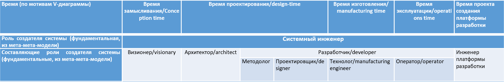
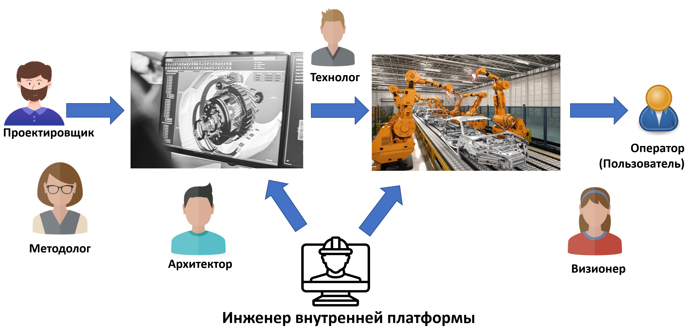
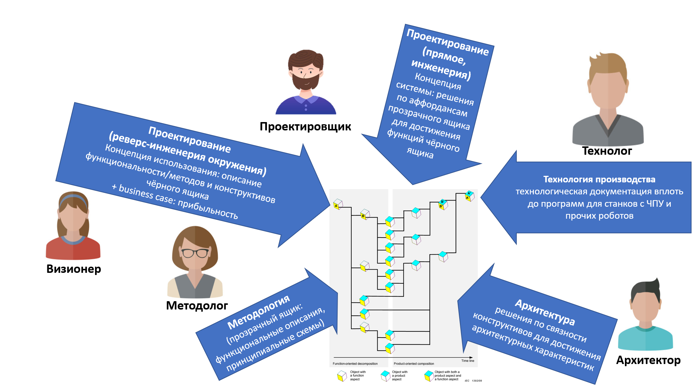

# Что делают разработчики

В инженерии исторически образовалось довольно много разных пониманий разделения труда. «Инженер» — это некоторая составная общая архироль, появление «системного инженера» не слишком улучшило ситуацию, но ведь есть ещё и разработчик (developer), и проектировщик (designer), и даже «рабочий» — за каждым словом тут множество самых разных значений, плюс ещё и полностью устаревшее различение «инженеров» как «белых воротничков», занятых умственным трудом, а «рабочих» и «техников» как «синих воротничков», занятых физическим трудом. Инженерия эволюционирует, разделение труда меняется, при этом в каждом конкретном проекте можно встретить самые разные варианты, ибо отнюдь не все предприятия следуют современному инженерному процессу с современным разделением труда. Как разбираться с «винегретом» значений? Как всегда: обсуждая развёрнутое описание, а не «определение» (которых легко наберётся сотня-другая противоречивых из разных источников).

Трудности начинаются с самого термина разработка/development::метод, и тем самым в определении того, кто такой разработчик::роль. У слова development довольно много словарных значений, все их можно найти в инженерии:

* Иногда developer — это не столько «разработчик», сколько неопределённый «развиватель», а development — «развитие». Так, директор по развитию в инженерии предприятия/менеджменте понимается как «ответственный за рост компании» путём экспансии на новые рынки, или просто рост компании путём применения новых технологий/организационного развития. «Девелоперы» в недвижимости/урбанистике, это «развиватели» территории, где потихоньку evolve всё, что нужно для комфортного проживания.
* Чаще всего development — это «разработка» в широком смысле, метод получения какого-то продукта в его конечном виде, но до момента массового заводского производства в киберфизических системах, размножения в сельском хозяйстве, введения софта в эксплуатацию на рабочих серверах в случае корпоративного софта. Включает в себя в том числе и выявление потребности (в системе или одной фиче системы), и разработку архитектуры (термин легко терпит «разработку в разработке», то есть разработка архитектуры в разработке целевой системы), и проектирование/design, и изготовление/manufacturing, и обеспечение безопасности и защиты (safety and security), и проведение испытаний, и непрерывный ввод в эксплуатацию: всё, кроме собственно эксплуатации.
* Development как «разработка командой» в узком смысле, проектирование системы и её частей, отделённое от архитектуры (у которой отношение надзора к разработке разными командами), производства (которое предоставляет инфраструктуру непрерывного ввода в эксплуатацию (сontinuous delivery) и связанных с ними сборки, тестирования и мониторинга), и иногда ещё выделяют как отдельные обеспечение безопасности/safety и защиты/security.

Напомним табличку с ролями в разделении труда (системного) инженера:

Вот существенно упрощённая картинка, показывающая взаимоотношения всех этих ролей:

Проектировщик в соответствии с рекомендациями прикладного методолога, ответственного за динамический аспект системы и в соответствии с принятыми архитектором решениями делает проект/design системы и передаёт его технологу, который проводит этот проект/design через изготовление, сборку, обоснование успешности (тестирование), разворачивание и пуск в эксплуатацию. Оператор (он же пользователь) работает во время эксплуатации системы, визионер понимает текущую (или будущую!) ситуацию в эксплуатации и разработке — и планирует очередь реализации новых фич системы, передавая её проектировщику (то есть это не однократный проход по процессу, это непрерывная разработка, continuous development). Отдельно тут инженер внутренней платформы разработки (internal development platform), который готовит инструментальный «конвейер», на котором работают все остальные роли — инструменты методолога, проектировщика, архитектора, технолога, визионера. Конечно, «инженер внутренней платформы разработки» внутри себя рекурсивно содержит все упомянутые роли: в маленькой разработке софта это может быть пара-тройка человек, а вот в ракетостроении — люди, которые строят ракетный завод, да ещё и разворачивают софт моделирования для конструкторского бюро.

Одно из неуказанных различий роли разработчика и ролей визионера, архитектора и инженера платформы разработки в том, что в маленькой разработке это всё роли одной небольшой команды, но в большой разработке роли визионера, архитектора и инженера платформы разработки обычно вынесены на уровень разработки системы в целом (приоритеты разработки тех или иных фич у визионера, раздаваемые командам модули, общий для всех инструментарий разработки), а составляющие роли разработчика появляются на уровне команд, которые разрабатывают отдельные модули.

В нашем руководстве мы выделим отдельно команду разработчиков в узком смысле слова, выполняющих метод разработки (проектирования) в узком смысле слова: не всей системы, в целом, а в рамках отдельной команды. Вот иллюстрация предельно упрощённого разделения труда внутри команды разработчиков:

На картинке намеренно проектировщик отвечает за конструкцию и чёрного ящика (спецификация интерфейсов, учёт компоновки, сама система целиком — это ведь не только функциональный объект в надсистеме, но и конструктив тоже), и для прозрачного ящика (подбор или даже изобретение комплектующих и компоновки такой, чтобы выдавать необходимый набор функций). И прикладной методолог и за внешнюю функциональность, и за внутреннюю отвечает. Совместная работа всех, но всё-таки разделение труда по видам описаний, в которых профессионализируются. Визионер же ничего не разрабатывает, но отвечает за то, чтобы это был бизнес (а если не бизнес, а благотворительность, то было бы понятно, кто добровольно оплачивает эту благотворительность, а не обнаруживает это уже после того, как потрачены ресурсы на никому не нужную разработку).

Вот что делают разработчики внутри команды, причём непрерывно по ходу жизни многих версий системы, а не разово «от замысливания до выпуска» одной версии:

* Узнают потребности внешних проектных ролей, узнают структуру клиентской предметной области (реверс-инжиниринг надсистемы), то есть делают концепцию использования, модель системы как «чёрного ящика». Никакого испорченного телефона, промежуточных «аналитиков». Результат тут сегодня часто даже не use cases, а юнит-тесты, документирующие ожидаемое поведение системы в части каких-то возможностей/фич/features. Это делает главным образом визионер (часто внешний по отношению к команде, например, это половинка должности product owner или product manager) и проектировщик.
* Выполняют концептуальное проектирование, то есть делают концепцию системы (включая использование известных им паттернов, поиск в литературе/культуре, и изобретения/творчество). Концепция системы получается на стыке работы прикладного методолога (синтез функций как описания динамики системы, её поведения) и архитектора (синтез конструкции как модулей системы, связанных через интерфейсы). Архитектор, который задаёт границы и интерфейсы проектируемого модуля как чёрного ящика, чаще всего внешний для разработчиков, но внутри модуля в прозрачном ящике тоже нужно проводить архитектурную работу, её чаще всего выполняет проектировщик/designer. А вот прикладной методолог внешний довольно редок (функциональная нарезка на верхнем уровне не очень осмысленна для больших систем, реализациям маленьких фич требует узкоприкладного функционального синтеза), и роль методолога начинает выделяться всё чаще и чаще внутри команды — но названия разные: от process engineer до functional architect. Не надо забывать, что под словами engineer, developer, designer и даже architect могут скрываться самые разные роли, поэтому очень часто тут можно встретить «эпитеты», например, functional architect указывает, что речь идёт не о модульной эволюционной архитектуре, а о функциональном описании (раньше это было частью архитектуры, как «всё важное, что делали разработчики», в том числе и функциональная, и модульная часть), если говорится о process designer, functional designer — это всё тоже прикладной методолог. И даже functional analyst может быть прикладным методологом, при этом игнорируют, что речь идёт не об анализе, а о синтезе функционального описания.
* Выполняют нарезку работы на маленькие кусочки (задачи/tasks), соблюдая принцип small batch size и другие принципы операционного менеджмента. Это роль менеджера, которая даже не указана.
* Выполняют работы по инженерным обоснованиям: создание тестов в рамках сдвига влево (shift left, общий принцип переноса того, что делалось раньше в конце жизненного цикла в самое его начало: тестирование, учёт ограничений безопасности и защиты, и т.д.), а затем выполняют тестирование. Могут существовать и отдельные команды тестировщиков, но главная работа по созданию функциональных тестов и тестированию у самих разработчиков — прежде всего у проектировщиков.
* Выполняют работы по безопасности и защите, принимая внешние ограничения у специалистов (мы считаем, что архитекторы и специалисты по безопасности и защите только по недоразумению не одни и те же, поэтому не показываем отдельно этих специалистов), причём в рамках сдвига влево (то есть не по итогам тестирования готовой системы, а прямо в ходе принятия проектных решений).
* Выполняют проектирование с точностью, достаточной для изготовления (design for manufacturing). В классической инженерии это non-architectural part of design, в конструировании и проектировании это работа с CAD и далее выход на программы для станков с ЧПУ или 3D-печать, а в программной инженерии это собственно кодирование/coding (хотя в программной инженерии скорее скажут coder, чем designer/проектировщик).
* Выполняют работы по подготовке производства: выпуск технологической документации, вплоть до программ для станков с ЧПУ, а в программной инженерии до скриптов прогона инкрементов кода через инструментарий компилирования, тестирования, интеграции, разворачивания, пуска в эксплуатацию. Инструментарий готовит инженер внутренней платформы разработки.

Все эти роли перепутаны, команда неформально принимает это разделение ролей, а ещё есть неминуемые недоговорённости от того, что разработка встречается трижды, и можно было бы ожидать трёхкратного воспроизведения ролевой структуры для отдельных ролей, но этого по совокупности причин не происходит:

* Разработка в целом (так, там есть роль архитектора, визионера, инженера внутренней платформы разработки — которые работают на уровне всей системы), и роль разработчика модуля, который работает на уровне модуля — и считается, что эти разработчиков несколько.
* По идее, роль разработчика модуля должна бы воспроизвести у себя полный набор всех ролей: визионер модуля, архитектор модуля, разработчик модуля(!) и будем считать, что инженер операционной платформы тут необязателен. Менеджерские роли (прежде всего, операционный менеджер) не рассматриваем. Коллизия тут в том, что откуда-то появляется роль разработчика внутри роли разработчика. И если в модуле появляется ещё более мелкий уровень модуля, то можно ожидать «разработчика внутри разработчика внутри разработчика». Но это игнорируется, и визионер модуля считается внешним, а «архитектор модуля» совмещается с проектировщиком, который «задаёт конструкцию» (в том числе архитектурные решения для модуля и выбор аффордансов-конструктивов).
* Инженер внутренней платформы разработки строит эту самую платформу — и для этого внутри себя должен иметь полный набор инженерных ролей, по сути это «проект в проекте» (а часто это «проект вне проекта»: завод и конструкторское бюро уже построены, ими надо только пользоваться). Но мы тут не будем делать разворачивания полного инженерного процесса для «строительства конвейера», «инженерии инструментария выпуска системы», «создания тёмной холодной фабрики» (у этой культуры много имён, совсем недавно тут были в ходу ещё и такие имена, как DevOps и SRE, в инженерии предприятий тут администрация, в инженерии мастерства тут деканат).

Основное, чем пользуются разработчики (напомним, что мы очень грубо разложили их роль на составляющие методолога, проектировщика, технолога, оператора) в своей практике — это самые разные моделеры. В методах поддержки DDD (domain driven design, помним, что design как раз «проектирование», выполняется проектировщиком, а в части функционального проектирования — методологом) типа EventStorm (мы расскажем об этом методе подробней чуть позже) моделером выступает стена и липкие листочки разного цвета с надписями фломастером. Но это, конечно, исключение. Главным образом используются специализированные моделеры (IDE, CAD — сегодня обязательно с AI-copilot и AI-agent для vibe coding в программной инженерии и vibe design в «железной» инженерии), ибо вся разработка идёт сегодня как model-driven (синоним: model-based): делается цепочка всё более и более детальных и точных моделей, которые потом используются для автоматического (не руками! Внутренняя платформа разработки — это прежде всего средства автоматизации выпуска: изготовления, интеграции, обоснования/испытания, разворачивания, ввода в эксплуатацию, мониторинга работоспособности) выпуска/delivering целевой системы.

В старинной разработке момент перехода от модели::описание (чертежи, исходный код) к части системы («в железе», «в бетоне», «в облаке») был важным гейтом, принималось решение о том, будут ли вкладываться материальные ресурсы в проект. Затем это перестало быть хоть какой-то особой операцией: модели вышли на некоторую критическую для успеха изготовления точность и полноту описания, а изготовление вышло на некоторую критическую для последующей сборки точность изготовления. Риски по результатам моделирования в ходе разработки получить какую-то деталь, которая будет неудачна, существенно упали.

Интеграция/integration как объединение изготовленных частей в целую работоспособную систему требовала творческой работы. Скажем, при разработке самолёта прилаживание двери сложной формы к фюзеляжу могло на заводе занимать пару недель. А теперь это «прикрутить три болта». То же самое с домашней мебелью: собрать какую-нибудь кровать дома могло требовать немаленькой инженерной подготовки, ибо дырки для болтов при совмещении деталей банально не совпадали друг с другом. Нужно было «дорабатывать по месту напильником». Если один разработчик проектировал стены, а другой проектировал водопроводную сеть, то в стенах проходы для труб могли быть и не запроектированы, их надо было пробивать «на месте», в ходе строительства. Если это было на подводной лодке, то все прочностные расчёты и решение проблем герметизации отсеков надо было переделывать. Сейчас такого быть не может: многоуровневое моделирование выявит проблему раньше, точное изготовление сделает так, что «в модели» и «в жизни» будет совпадать, тестирование обеспечит проверку как намоделированного, так и изготовленного, а управление конфигурацией заранее выявит все возможные коллизии — чаще всего ещё в проекте, до изготовления.

Конечно, все эти проблемы решались не только за счёт того, что всевозможные моделеры стали лучше, а изготовление деталей стало точнее, поэтому сборка тоже получалась беспроблемной. **Собрать беспроблемно ведь можно и что-то ненужное!** Это решилось тем, что разработчики избавились от «испорченного телефона», стали общаться со специалистами предметной области надсистемы непосредственно, а не через «аналитиков», «инженеров по требованиям» и прочих посредников. Моделированием окружения тоже занялись разработчики, «с чужими анализами в нашу больницу не берут». Тесты тоже разрабатывают сами проектировщики, слухи про «внешние независимо разработанные тесты более качественны» оказались неподтверждёнными исследованиями. То, что «независимые тестировщики» выдают процент найденных ошибок примерно такой же, что и сами проектировщики — это контринтуитивно. Конечное слово всё равно остаётся за использованием системы, а не изготовлением (система может очень плохо работать, хотя пройти все запланированные испытания). Так что нужно просто уметь быстро-быстро всё переделать по обратной связи от пользователей, чтобы избавиться от ошибок — ошибок по мнению пользователей, а не ошибок по мнению проектировщиков. Это мы обсуждали как customer eXperience (для успеха системы прежде всего важны впечатления пользователей системы, а не впечатления разработчиков).

Для итоговой безошибочности/бездефектности оказалось важнее обеспечить скорость перемоделирования в части исправления ошибки и затем повторного изготовления и сборки, а не бесконечное тестирование системы по жёстко задокументированным спецификациям. Важней оказалось соответствие ожиданиям пользователей во время эксплуатации, а не соответствие спецификациям во время разработки и обоснований. Вот этот переход к учёту customer eXperience крайне важен в современной разработке:

* Скачок в «голову пользователя», проверка «за пользователя» — что жмёт и плохо в системе для пользователя, а не для разработчика.
* Скачок из времени разработки во время эксплуатации — систему надо смотреть работающую, а не изготавливаемую.

Это мышление с вниманием к customer eXperience разработчикам освоить очень трудно, для этого нужны тренировки.

Переход к «отладке системы для безошибочности в глазах пользователя» очень контринтуитивен. Этому сопротивляются главным образом менеджеры, которые не очень разобрались в том, как устроена реальная инженерная работа: им удобнее отчитаться не за работоспособность системы в ходе эксплуатации в быстроизменяющейся жизни у пользователя, а удобнее отчитаться за разовое подтверждение выполнения стабильных «требований» момента разработки, а что там в эксплуатации с customer eXperience — это будет решать какой-нибудь другой менеджер, но не менеджер разработчиков.

А ещё собрать беспроблемно можно какую-то группу деталей в подсборку, а потом получить огромные проблемы на сборке уже из подсборок. Тут помогает непрерывная интеграция (continuous integration), которая подразумевает непрерывную сборку целостной версии моделей системы с проверкой конфигурационных коллизий. В этой практике идёт нарезка работ по разработке системы на маленькие части:

* Части, определяемые ограниченным контекстом/bounded context, то есть одной предметной областью в проекте, моделирование-проектирование/design которой поддерживается одной командой. Аккуратное разбиение на части — это результат архитектурной работы архитектора целевой системы (нарезка системы на части верхнего уровня и определение интерфейсов их взаимодействия) и архитектора предприятия, нарезающего предприятие на команды разработчиков.
* Части, определяемые инкрементальностью разработки: начиная с минимальности системы, которая выдаёт минимальный набор функций, позволяющий её использовать хоть как-то (MVP, minimum viable product: «молоток, но пока без ручки, и даже дырки для ручки нет», но не «ручка, пока без молотка на ней»), а потом увеличивающийся очень маленькими инкрементами набор «фич» целевой системы. Инкременты берём сегодня даже не на день работы команды, а на часы — а не на неделю или месяц (small batch size, частота релизов важнее собранной в этих релизах функциональности: гонимся не за выпуском большого числа новых фич в одном релизе, а за непрерывностью разработки — в пределе будет по одной фиче в релизе, релизы часты, непрерывны, continuous delivering).

После проектирования (в том числе проектирования с точностью, достаточной для изготовления — design в «железной инженерии», кодирование в программной инженерии) каждая команда выдаёт поток небольших инкрементальных изменений в общую «магистраль» (trunk) сборки, и это происходит ежедневно (иногда ежечасно), но не еженедельно и уж тем более не ежемесячно. Это метод **магистральной разработки** (trunk-based development[^r8-1]) вместо метода «долгоживущих ветвей для изменений» (long-lived feature branches) и последующих больших шагов по интеграции. Сегодня это уже метод не только программной инженерии, но и «железной» инженерии: в самолётостроении конструкторы результаты своей работы выкладывают в общую PLM-систему немедленно, каждый день, а не по мере окончательной готовности каких-то крупных частей. Ещё лет десять назад в моде была поговорка, что «дураку половину работы не показывают», сегодня на эту поговорку сразу возражают:

* Смотрят не дураки, поэтому с такими заявлениями нужно быть осторожней.
* Значит взял слишком большую работу, надо было поделить её на части, которые можно показывать.
* Если не показываешь, то ошибки (начиная с того, что вообще ненужную работу делаешь, не тем занялся) выявятся позже, а это недопустимо.
* Покажи ещё и тесты для своей работы.

Каждая интеграция маленького инкремента не занимает много времени, а если выявляются «большие проблемы» (например, необходимость доработки интерфейсов), то они выявляются рано. То, что это небольшие законченные части, помогает как с обеспечением «потока» (flow) работ в части менеджмента (отсутствуют «заторы» в местах ограничения/constraints потока — small batch size метод), так и помогает быстро находить ошибки, уменьшать число переделок/reworks в части прикладной инженерной работы.

Команды быстро получают обратную связь от эксплуатации и немедленно на неё реагируют (если число дефектов превышает какой-то предел, то новыми фичами прекращают заниматься, а только исправляют ошибки — это основа метода SRE, site reliability engineering[^r8-2], применяемого инженерами внутренней платформы разработки и реализуемого инженерами-технологами), метод vulnerability management даёт понимание сроков исправления найденных при эксплуатации уязвимостей в зависимости от уровня их серьёзности, а метод FinOps[^r8-3] передаёт ответственность за стоимость эксплуатации в команду разработки в случае использования облачной инфраструктуры (а если инфраструктура собственная, а не облачная — можно использовать, например, chargeback[^r8-4]).

Это всё, конечно, поддерживается довольно развитой организационной и инструментальной инфраструктурой, которая поддерживает работу команды. Сама по себе команда разработчиков не сможет работать, чудес не бывает.

Итого: команды работают максимально независимо друг от друга маленькими улучшениями/инкрементами в релизах, поддерживая тесную связь с исполнителями внешних проектных ролей в надсистеме (часто на много уровней вверх), находясь под архитектурным надзором (и очень похожим надзором по линии безопасности и защиты), а также опираясь на внутреннюю платформу разработки (инфраструктуру), которую предоставляют инженеры этой платформы (платформа будет давать сервисы управления конфигурацией, тестирования и другой инфраструктуры, нужной для непрерывной интеграции/continuous integration и затем непрерывного введения в эксплуатацию). Разработка немыслима без взаимодействия с внешними проектными ролями в эксплуатации, архитекторами, инженерами внутренней платформы разработки (она же — инфраструктура изготовления, она же — производство) и менеджерами.

Мы переводим continuous delivery не просто как выпуск (release), ибо выпуск обычно у разработчиков («выпуск новой версии»), не «поставка» (это логистическая операция) и даже не «разворачивание» (deployment, установка на месте), но конечной операцией попадания в руки потребителя/пользователя после всех предварительных операций доставки на место, установки на место и настройки: ввод в эксплуатацию. В «железной» инженерии это transfer, commissioning. «Ввод в эксплуатацию» наиболее точно отражает смысл понятия continuous delivering и даёт возможность использовать его для систем самой разной природы. Ввести в эксплуатацию банан — это не доставить его домой в полиэтиленовом пакетике, не освободить от упаковки, не почистить от кожуры. Ввести в эксплуатацию банан — это выдать его готовым для еды, чтобы можно было сразу откусить, без дополнительных очисток-распаковок-готовки. Если вы получаете банан, готовый к откусыванию и каждый раз чуть более вкусный раз в час (или хотя бы раз в день, но никак не раз в неделю или месяц), то поздравляем — у вас continuous delivery, это важнейший метод эволюционной/непрерывной инженерии. Эта эволюционная/непрерывная инженерия начинается с того, что кто-то придумал вырастить и продать вам банан, кто-то его таки начал выращивать и менять сорта на более вкусные, а затем непрерывно собирать урожай спелых и всё более вкусных бананов, поставлять их вам и готовить к еде без дополнительных подготовительных ваших операций — это и будет continuous development, а затем уж это continuous delivery. Банан тут плохой пример, ибо он будет просто каждый раз тот же самый, а смысл затеи в том, что доставляемый-очищаемый-проверяемый для вас каждый час новый банан будет лучше старого, или хотя бы «такой же вкусный» при изменении ваших вкусов (это тоже надо учитывать! Прежний вариант банана будет тогда вкусный для вас-прежнего, но не для вас-нынешнего!): при непрерывной инженерии банан будет эволюционировать под ваши постоянно изменяющиеся вкусы и постоянно будет готовым к тому, чтобы вы с удовольствием его съели без дополнительных операций готовки, в этом весь смысл затеи continuous delivery!

При этом всё это в реальности устроено ещё сложней, ибо для вас на всякий случай не только очищается, а потом «ради роста культуры еды» нарезается банан, но и одновременно ещё пару десятков фруктов, а ещё первые-вторые блюда и салаты, и вообще непрерывно и круглосуточно работает шведский стол со всем его разнообразием продуктов, где всё магическим образом поддерживается свежим, вкусным с учётом изменений вкуса, надёжным и безопасным, доступным и никогда не кончающимся даже ночью — но начинает всё содержимое этого шведского стола свою жизнь на самых разных полях и фермах и проходит довольно большой путь переработки и логистики. Современная разработка софта корпоративных информационных систем представляет собой примерно вот такое поддержание «шведского стола» программных сервисов, доступных сотрудникам. И то же самое потихоньку начинает происходить с любой другой инженерией: чем бы ни занялись, в конечном итоге в идеале получится поддержка того же «шведского стола», да ещё и с доставкой на дом. Даже образование — это поддержка такого же постоянно действующего «шведского стола» мастерства, а не организация разового обеда. Может, метафора эта и немного натянута, но она очень полезна — режим поддержки «шведского стола» существенно отличается от режима приготовления одного обеда.

В инженерии киберфизических систем огромное влияние оказывает также переход к так называемым software-defined технологиям, где традиционно «аналоговые» части системы попадают под контроль какого-то встроенного/embedded софта/software (напомню, что мы предлагаем и в письменной речи кратко писать «софт», хотя иногда и пишем канцеляритное «программное обеспечение» или даже соответствующее каким-то стандартам «программные средства»).

Если алгоритм работы устройства (атомной станции, фотоаппарата, автомобиля, смартфона) определяется софтом, то вы можете смело использовать все принципы разработки софта, и далее менять этот софт хоть каждый день. Так, функции помощи водителю в автомобилях Tesla определяются программно и регулярно обновляются, но само «железо» автомобиля при этом остаётся неизменным. Это общеинженерный тренд: доработки целевых систем ведутся всё время, включая время после введения этих систем в эксплуатацию. То есть continuous delivery (непрерывный ввод в эксплуатацию со всё новыми и новыми фичами, всё новыми и новыми исправленными ошибками, а иногда и со всё новой и новой архитектурой, которая позволяет далее менять систему более быстро) используется и в «железной» инженерии. И уж тем более в инженерии предприятия, где и команды, и предприятие в целом ежедневно изменяются в части своей организации и методов своей работы, а не застывают после разового изготовления, сборки, наладки и «пуска в эксплуатацию».

**Сдвиг влево** (left shift) — это общее название для тренда, который двигает работы по практикам, расположенным далеко справа на функциональной/логической V-диаграмме, в самое начало логического времени разработки. Скажем, тестированием традиционно занимаются в конце проекта разработки, когда всё уже сделано. Но testing left shift (с этого и началось всё движение сдвига влево) означает, что сама **разработка начинается с предложения тестов**. Если ты понимаешь, что ты делаешь, то ты можешь это проверить: вот и напиши тесты, покажи понимание задачи. А потом разработай систему, которая эти тесты пройдёт. Описание тестов сначала, разработка потом, затем тестирование, доработка, развитие тестов, ещё доработка, тестирование, развитие тестов и т.д. Но описывать тесты нужно до начала разработки (сразу тесты как документирование гипотез того, что должна делать система — тесты как функциональное описание чёрного ящика).

Безопасность/safety? Сразу подумайте, а не после того, как к вам придёт инспекция или что-то плохое произойдёт из-за вашей системы в жизни. Защита/security? Сразу подумайте, будьте прочным[^r8-5]! Не берите архитектуры, которые легко взламываются, не берите в проект готовые (COTS) части системы, про уязвимость которых вам ничего не известно! Учитывайте защиту сразу, а не после того, как вашу систему взломали!

То же самое происходит буквально со всем остальным, что оставлялось «на потом». Сначала спроектируем, потом будем думать о том, как изготовить? Нет, думайте сразу, и то же самое про изготовление и многое другое. Это обобщается иногда как тренд «design for X»[^r8-6] или «design for eXcellence» (DFX): design for manufacturing, design for cost, design for power в электронике, design for inspection и т.д., включая даже просто понимание множественности целей проектирования как design for eXcellence в подходе Six Sigma как одном из вариантов Lean методологии. Смысл сдвига влево в том, что предметы интереса, неизбежно возникающие «потом», рассматриваются «сначала», то есть учитываются разработчиками сразу. Это кажется невозможным (слишком много чего нужно учесть), но каким-то образом в современных проектах получается. Впрочем, это не «каким-то образом», а вполне понятным образом, который как раз и обсуждается у нас в руководстве: команда разработчиков хорошо «вооружена» и использует множество поддержанных компьютерами методов работы, которых некоторое время назад на планете попросту не существовало, а объяснительные теории для этих методов были массово неизвестны. И это очень контринтуитивные методы, их использованию разработчиков нужно учить специально, без обучения и объяснения они в проекте невозможны.

Успех в разработке достигается за счёт развитого порождающего моделирования (руками никто не рисует, всё больше и больше работы перекладываются на компьютер, разработчик по факту только формулирует задание моделеру), разработка хорошо документируется, поэтому «все ходы записаны», а не «проект у меня в уме» и «я ему неделю назад устно сказал». Управление конфигурацией тоже даёт свой вклад в успех разработки (все коллизии между «записанными ходами» обнаруживаются рано). Успех непрерывной разработки достигается за счёт хорошей модульности вследствие тщательной проработки архитектуры (ошибки не распространяются далеко по системным связям и остаются внутри модуля, один неудачный модуль не останавливает всю систему, неработающая «фича» — это не неработа всей системы в целом, архитектурные характеристики имеют метрики и отслеживаются, независимые модули могут разрабатываться независимыми командами). Разработка следует SoTA в определении того, как будет работать система — учёт прикладной методологии предметной области, велосипеды не изобретаются, но для достижения функциональных и ценовых характеристик лучше, чем у конкурентов наоборот — изобретения приветствуются.

Разработка происходит инкрементально с очень маленькими и быстро проводимыми изменениями (continuous delivery). И главное: разработка эволюционна/непрерывна (continuous development) и гибка (agile). Она никогда не заканчивается и не идёт по строгим этапам, а учитывает:

* всё новые и новые обнаруженные в проекте особенности окружения (оно меняется постоянно, это жизнь!),
* проблемы в работе разрабатываемой (под)системы (ошибки находятся постоянно!),
* особенности непрерывно меняющихся моделеров (их AI-возможности меняются очень быстро)
* организации разработки (они тоже непрерывно меняются — и даже, когда изменения к лучшему, а не «энтропия разрушит и нас», к этим изменениям нужно адаптироваться).

Успех системы оказывается не «достигнут», а «непрерывно достигаем» — успеха надо не просто достичь, надо его долго удерживать, современная эволюционная разработка с её «непрерывным всем» нацелена именно на это, достижение ускользающего успеха, а потом долгое его удержание.

[^r8-1]: <https://trunkbaseddevelopment.com/>

[^r8-2]: <https://sre.google/sre-book/table-of-contents/>

[^r8-3]: <https://www.finops.org/introduction/what-is-finops/>

[^r8-4]: <https://www.infotech.com/research/ss/implement-an-it-chargeback-system>

[^r8-5]: <https://ailev.livejournal.com/1643578.html>

[^r8-6]: <https://en.wikipedia.org/wiki/Design_for_X>
