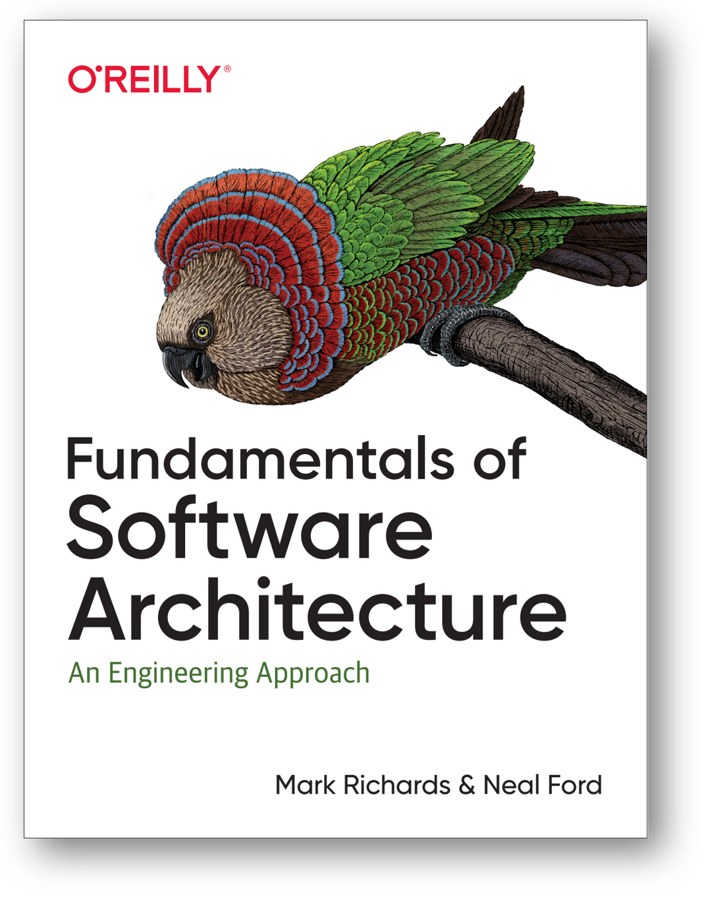
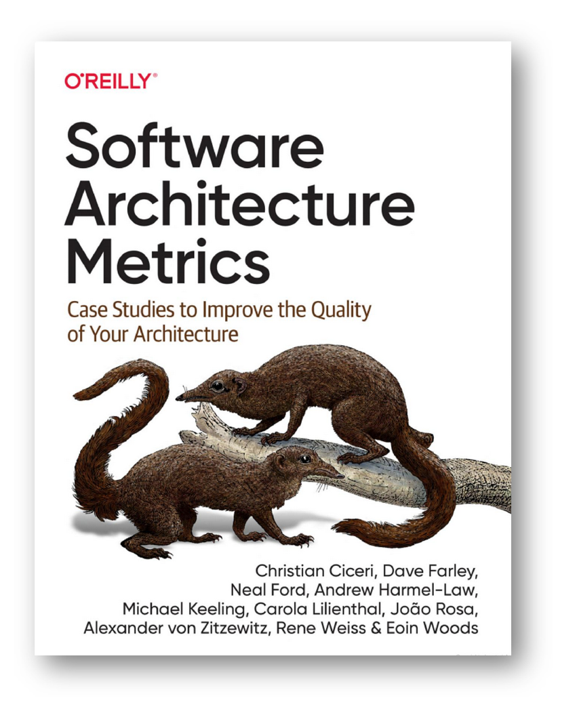

# Архитектурные характеристики

Окончательно новый подход к эволюционной архитектуре, которая занимается архитектурными характеристиками, абстрагируясь от функциональности («функциональной архитектуры») на примере архитектуры для корпоративного софта был сформулирован в книге «Fundamentals of Software Architecture», 2020.

В этой книге чётко говорится о различении прикладных разработчиков (разбитых на команды developers, в число которых входят и «функциональные архитекторы»/«прикладные методологи предметной области») и архитекторов (architects):

* предметы интереса разработчиков лежат в реализации функциональности какой-то предметной области каким-то кодом. **Разработчики предметноспецифичны, у них разделение труда по разным предметным областям, в которых у них глубокая экспертиза.**
* предметы интересы архитектора очень специфические архитектурные: важные/архитектурные характеристики, которые относятся не столько к функциональности системы в её предметной области, сколько к общим характеристикам работы и создания (характеристики не только времени эксплуатации, но и времени создания!), которые делают систему успешной или неуспешной. **По отношению к функциональности архитекторы (новое понимание** **роли архитектора!) трансдисциплинарны, у них нет мастерства в предметных областях, с которыми разбираются разработчики, хотя им крайне рекомендуется иметь такое мастерство, как и разработчикам рекомендуется иметь мастерство архитектора.** **В какой-то мере** **архитекторы—** **«системные мыслители проекта», обсуждают** **архитектурные** **характеристики системы в целом.** Поэтому часто говорят, что в классической инженерии самая «системноинженерная» специализация — архитектор.

Скажем, если система отлично справляется со своими предметноспецифичными функциями, за которые вы готовы платить (скажем, игровой сервер вас может отлично развлечь, котельная может отлично обогреть), но вам недоступна (плохие значения архитектурной характеристики доступности/availability[^r8-1]), то систему нельзя считать успешной. Когда-то на заре интернета поисковые системы были реализованы на огромных серверах Sun, но поскольку к ним обращались одновременно тысячи пользователей, они по факту были недоступными: ответа от них было нельзя дождаться. Это как попасть в город со знаменитым музеем на один день, и обнаружить, что в этот музей очередь на пять дней! Вроде музей есть, и работает, но из-за очереди нельзя попасть! И дальше начинаются разговоры о том, что легко спутать производительность и доступность (скажем, музей в городе может пропустить за день сколько хочешь человек, очереди нет и в принципе быть не может, но только работает этот музей по субботам 2 часа с 14 часов до 16 часов, а в другое время просто закрыт).

Этих архитектурных характеристик оказалось множество[^r8-2], и для многих видов систем они оказались более-менее повторяющимися. Вот какой-то их приблизительный перечень (взят как раз из упомянутой книги, и там строго-настрого предупреждается, что в каждой организации эти архитектурные характеристики будут трактоваться по-своему):

* Операционные (времени эксплуатации системы) предметы интереса архитектора, которые пересекаются во многом с предметами интереса ответственных за изготовление, ремонт и эксплуатацию целевой системы (в программной инженерии это инженеры внутренней платформы разработки, до сих пор их называют более старым термином DevOps, и там же многочисленные варианты XOps как общее имя методов работы и одноимённых ролей самых разных Ops — PlatformOps, MLOps, DataOps, and ModelOps[^r8-3]):

+ Доступность/availability: часы работы системы (скажем, 24 часа в сутки 7 дней в неделю, и на сколько она может закрываться на профилактику, ремонт, отдых персонала)
+ Непрерывность/continuity: оргвозможность восстановиться после какой-то катастрофы (наводнение, удар молнии, война).
+ Производительность/performance: включает и устойчивость к постоянной нагрузке, и устойчивость к пиковым нагрузкам (часто выделяют как отдельный предмет интереса — эластичность/elasticity), и частоту обращений к функциям системы, и время ответа на запросы, и требования к запасу мощности. Удовлетворение ожиданий по производительности само по себе будет отдельным приключением в разработке, может потребовать экстраординарных решений в части архитектуры.
+ Возможность восстановления/recoverability: с какой скоростью в случае катастрофы всё восстановится? Бэкапы, дублирование оборудования — это всё тут.
+ Надёжность и безопасность/reliability and safety: если что-то поломается, то это никому не должно повредить (никто не должен быть покалечен или убит, или никто не должен потерять большие деньги).
+ Устойчивость/robustness (у «железных» инженеров чаще resilience) — возможность хоть как-то работать и обрабатывать неизбежные ошибки в критических ситуациях, когда произошли довольно крупные поломки (скажем, пропало интернет-соединение, или выключилось энергопитание, или пошёл дым из компьютерного блока).
+ Масштабируемость/возможность наращивать производительность по мере возрастания числа пользователей или интенсивности их запросов.

* Характеристики времени создания:

+ Конфигурируемость/configurability — возможность пользователю поменять конфигурацию системы самому через удобный пользовательский интерфейс.
+ Расширяемость/extencibility — насколько легко добавлять новую функциональность.
+ Устанавливаемость/installability — насколько легко устанавливать систему в самых разных вариантах использования.
+ Повторное использование/leverability and reuse — насколько легко переиспользовать систему в разных проектах.
+ Локализация/localization — поддержка множества языков, единиц измерения, часовых поясов
+ Сопровождаемость/maintainability — как легко обслуживать систему по ходу её эксплуатации?
+ Переносимость/portability — как легко перенести систему в другое окружение (например, на другую платформу, программное обеспечение на другую операционную систему).
+ Поддерживаемость/supportability — уровень технической поддержки, который ожидается для системы: как быстро отзываются, что могут поправить, сколько стоит.
+ Возможность апгрейда/upgradability — как легко и быстро перейти с одной версии системы на другую, будут ли вообще доступны следующие версии.

Этих характеристик, конечно, много больше. Например, прайвеси/privacy, безопасность/security, которые как предметы интереса архитектор имеет общие со специалистами по безопасности. ISO 25010 Product Quality Characteristics архитектурные характеристики называет характеристиками качества, и предлагает свой список[^r8-4], но первым пунктом там стоит «1. Functional suitability», как «уместность функциональности», то есть насколько система выполняет ожидаемые от неё функции. И вот это предмет заботы прикладных инженеров. А вот остальные группы характеристик там как раз архитектурные. И тут нужно сказать, что каждая «сводная характеристика» тут разбивается на множество.

Так, часто поминается «возможность положиться на систему»/dependability как набор более дробных характеристик: availability, reliability, maintainability, durability, safety and security как один вариант, или availability, reliability, safety, integrity (сопротивление к несанкционированным изменениям), maintainability, и ещё бывают разные другие варианты.

Современный тренд — это работа не с интуитивной оценкой каждой характеристики, но с метриками для каждой характеристики, причём значения этих метрик замеряются специальным методом/функцией, проверяющей соответствие «того, что есть у системы» и «того, что надо для успешности системы в её эволюционной нише». Этот метод/функцию соответствия системы её экологической нише по какой-то архитектурной характеристике так и называют — **функция соответствия,** **fitnessfunction.**

Для программного обеспечения этот метод/функция соответствия программируется в виде кода какого-то алгоритма (разного для разных архитектурных характеристик), который прогоняется наряду с функциональными тестами и показывает, как изменилась та или иная характеристика в ходе изменений в системе, которые вносят разработчики. Если тесты/испытания новой функциональности (помним о BDD, само определение новой функциональности будет сегодня, скорее всего, записано в формате теста этой функциональности) прошли успешно, то архитектор смотрит на то, как прошли его архитектурные тесты, то есть как поменялись значения функций соответствия, то есть автоматически вычисленные замеры значений архитектурных характеристик по каким-то им выбранным метрикам. Не ухудшились ли архитектурные характеристики после очередного обновления системы? Если ухудшились, то это

* или разработчики выполнили все архитектурные решения, но это не помогло — и архитектору надо принимать новые архитектурные решения, его решения ведь тоже только гипотезы, архитектура как набор архитектурных решений меняется в ходе проекта.
* или разработчики проигнорировали некоторые архитектурные решения — и у них появился **технический долг** перед архитектором, архитектору надо указать на их ошибки — и заставить переделать их работу так, чтобы и функциональность была такая, какую они хотели реализовать, и архитектурные характеристики остались в допустимых значениях.

Методы/функции расчёта значений архитектурных характеристик, выполненные в ходе прогона тестов наряду с тестами функциональности — это и есть fitness functions. Проверка безопасности и защиты — она тоже может делаться fitness functions, ибо характеристики безопасности и защиты тоже можно считать архитектурными характеристиками, это не функциональные характеристики. Мы уже обсуждали, что «безопасники» в части security/защиты только по недоразумению представляют отдельную инженерную роль, проще считать их вариантом роли системного архитектора. Они ведь тоже про «видимость модулей» и «удержание характеристик системы при ошибках в отдельных модулях». Можно условно считать, что они пытаются уменьшить влияние на проект команд «отрицательных разработчиков», которые разрабатывают свои модули, пытающиеся нарушить все архитектурные решения по межмодульной связи. Архитектурные fitness functions должны ловить саму возможность таких нарушений.

Лучший способ разобраться со всеми этими архитектурными характеристиками (бывшими «требованиями качества») — это понять, как их отслеживать/мониторить в ходе проекта. Для программных проектов на эту тему написана отдельная книжка «Software Architecture Metrics», 2022:

Если же у вас системы другой природы и/или какие-то другие метрики, не упомянутые в этой книге, то напомним про существование книги «How to Measure Anything: Finding the Value of Intangibles in Business», 2014 (в какой-то момент вам всё же придётся её прочесть, равно как и все остальные книги, обложки которых приведены в нашем руководстве):

Архитектор в своей работе думает ровно об этих архитектурных характеристиках системы основное своё время, примерно так же, как прикладной инженер думает о функциональных характеристиках. Он лично беседует со всеми внешними проектными ролями, чтобы разобраться, какие значения этих характеристик должны быть, чтобы система была успешна. Хороший совет: сосредоточиться не на всех этих характеристиках/предметах интереса, а только на реально необходимых для успеха системы! Например, ограничиться всего тремя предметами архитектурного интереса как важнейшими, а остальные учитывать, но не очень тщательно. Это рекомендация книги «Fundamentals of Software Architecture», со всеми прилагающимися к ней оговорками, что это число и сам состав отобранных архитектурных характеристик сильно зависит от конкретной ситуации в проекте. И дальше нужно принять архитектурные решения, которые позволяют для достижения успешности системы удовлетворить именно эти наиболее важные архитектурные интересы, а не вообще все (что невозможно). Для этого архитектор (равно как и разработчик) много общается с внешними проектными ролями и понимает ситуацию, в которой происходит эксплуатация и разработка системы (они связаны через закон Конвея).

Скажем, вы реализуете какую-то поисковую систему. Архитектор понимает, что для этого приложения ему крайне важна характеристика скорости ответа на поисковый запрос. Он выбирает метрику: «время ответа на поисковый запрос» (не любое время ответа! Только на поисковый запрос). Выбирает метрику: это не «быстро» или «медленно», а «среднее время ответа в миллисекундах». Выбирает приемлемый диапазон значений метрики: «отлично» тут — меньше 150мс, «хорошо» — 150мс-200мс (в литературе по UX указано, что задержка более 200мс хорошо заметна пользователю как «тормозит»), «удовлетворительно» — 200мс-300мс, и «неудовлетворительно/неприемлемо» — больше 300мс. Дальше пишем функцию соответствия в виде теста времени отклика — для этого придётся закупить софт нагрузочного тестирования, определить параметры тестирования (скажем, замер идёт при одновременном обращении 100 пользователей). Вставляем эту нашу fitness function (тест архитектурной характеристики) в общий пул тестов, которые будут прогонять разработчики в ходе их BDD. И отслеживаем замеры, которые поначалу показывают «отлично». Разные команды разработчиков добавляют по чуть-чуть функциональность в поиск: усложняют язык запросов, обращаются к каким-то удалённым микросервисам по сети, чтобы не возиться самим с каким-то вычислением. И в какой-то момент груз этих эволюционных изменений оказывается настолько тяжёл, что время ответа на поисковый запрос стало «удовлетворительным». Это повод архитектору обратить внимание на ситуацию и вмешаться — разобраться, почему так, и что надо делать.

По поводу эволюционной архитектуры и функций соответствия очень сложно искать информацию (как поисковыми системами, так и AI-системами), ибо одни и те же термины используются в самых разных областях:

* Эволюционные алгоритмы (меметические и генетические, проблемы open-endedness). Скажем, вам будут рассказывать про fitness functions для этих алгоритмов, никакого отношения к обсуждаемой fitness function для архитектуры в инженерной разработке. И даже если это будет инженерная разработка, вам покажут статьи по эволюционным алгоритмам в поиске оптимальной функциональной архитектуры (например, evolutionary neural architecture search, NAS[^r8-5]).
* Строительная архитектура, где речь пойдёт, например, о важности sustainability, понимаемой как неухудшение экологических характеристик той местности, где стоит здание. Вы долго будете удивляться, почему от вашего софта требуют не загрязнять окружающую среду и быть в нулевом энергетическом балансе с окружающим миром. Кстати, в строительной архитектуре вместо evolvability говорят об adaptability[^r8-6] — здание ведь тоже эволюционирует, но это понимается как адаптация к изменившимся условиям, design for adaptability. В теории эволюции указывается, что эволюция не имеет своей целью адаптацию! Поэтому выбор термина evolvability более удачный и многообещающий, чем adaptability.
* Архитектура может пониматься как «всё важное», «функциональная» (без упоминания этого слова), «структура конструкции» (без функциональности, чаще всего это в литературе по эволюционной архитектуре), как синоним «концепции системы». Всегда проверяйте, что имеет ввиду автор, говоря об архитектуре, архитектурной работе, архитектурном методе, роли архитектора.

[^r8-1]: <https://en.wikipedia.org/wiki/Availability>

[^r8-2]: Пример architecture characteristics worksheet — <https://www.developertoarchitect.com/downloads/architecture-characteristics-worksheet.pdf>, в классической инженерии их продолжают называть system quality attribute — <https://en.wikipedia.org/wiki/List_of_system_quality_attributes>

[^r8-3]: <https://www.xenonstack.com/insights/xops-components>

[^r8-4]: <https://www.perforce.com/blog/qac/what-is-iso-25010>

[^r8-5]: <https://link.springer.com/article/10.1007/s10462-024-11058-w>

[^r8-6]: <https://www.aia.org/sites/default/files/2024-11/AIA_Design_Deconstruction_Adaptability_Reuse.pdf>
