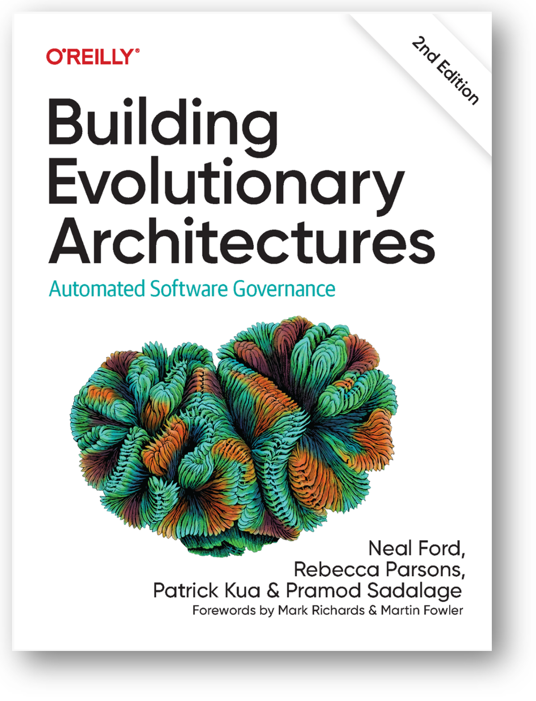

# Архитектура: было «про трудно изменяемое», стало «про облегчение изменений»

Архитектор — это на древнегреческом «главный строитель», arkitekton, αρχι (arkhi, «главный») +‎ τέκτων (téktōn, «строитель»). Он определял что и как строить, а также следил за рабочими-строителями. Дальше понятие архитектуры перешло во все остальные виды инженерии, при этом понятие непрерывно менялось и было удивительно трудно определяемым, оно было неотличимым от понятия «самый опытный разработчик».

Тем не менее, во всех этих ранних понятиях оставалось указание на архитектуру как определение структуры (структура — это понимание, как система разделена на части, прямая отсылка к системному мышлению, разбирающемуся в способах деления системы на части, причём мы помним, что статистически термин «структура» тяготеет к продуктным/модульным/конструктивным разбиениям), определение чего-то важного, чем бы оно ни было (Ralf Johnson), а также принятие решений по основным принципам организации системы (ибо выяснилось, что не всегда понятно про части системы, но можно сформулировать принципы появления этих частей. Например, так устроен интернет, и именно такое определение было дано в ISO 42010:2011, но помним, что «организация» тяготеет статистически к функциональным разбиениям).

В 2017-2022 году понятие архитектуры, метода архитектурной работы и роли архитектора претерпели значительные изменения, прежде всего в программной инженерии, а дальше это изменение, получившее наименование «эволюционная архитектура» (evolutionary architecture), будет всё больше и больше ощущаться во всех остальных видах инженерии, хотя и с лагом (обычно такой лаг 10 лет, поэтому ожидаем существенных массовых изменений для архитектуры «железа» с примерно с 2027 года, но передовые предприятия вроде SpaceX или NVIDIA работают с таким пониманием уже сегодня):

* Архитектор начал заниматься не всем важным, а только тем важным, что входило в его concerns/«предметы интереса»/«важные характеристики», к которым отнесли всевозможные -ости/-ilities (производительн-ость, доступн-ость, надёжно-ость, и т.д.). Эти архитектурные характеристики иногда раньше в системной и программной инженерии называли «нефункциональными требованиями», но это не требования, а предметы интереса (требования вообще по факту исчезли из инженерии), но даже не это плохо: плохо использование слова «нефункциональные», никто ведь не хочет заниматься чем бы то ни было, у чего нет функции/назначения. И это не «требования качества», потому как никакого отношения к качеству у этих характеристик нет, это оказались совершенно особенные предметы интереса, архитектурные. Если функциональность отличалась от одной системы к другой (валенки тёплые, электростанция мощная), то архитектурные характеристики более-менее одни и те же для самых разных систем (ремонтопригодность и надёжность валенок и электростанции).
* Задачей архитектора стало нахождение архитектурных решений (architectural decisions), которые стали пониматься, как решения по конструкции системы, гарантирующие квазиоптимальные значения архитектурных характеристик (а не функциональных характеристик, связанных с domain). Тем самым задачи архитектора чётко были отделены от задач команд разработчиков/developers/прикладных инженеров для domain: прикладные инженеры разных команд делают части системы, которые обеспечивают функциональность, а системный архитектор принимает решения, которые направляют деятельность разработчиков из разных команд так, чтобы достичь оптимума/баланса в архитектурных характеристиках. Если речь шла о функциональных характеристиках, то начали уточнять «функциональный архитектор» и «функциональная архитектура», а не просто «архитектура», но всё чаще и чаще отказывались тут от такого термина и переходили к «функциональному проектировщику/designer» и результату его работы «функциональному проекту/design». Термин «архитектор» тем самым оставался закреплённым за ролью, занимающейся конструктивной структурой в связи с архитектурными характеристиками. Конечно, это всё не происходило одномоментно, даже в программной инженерии, изменения идей и терминологии в профессиональных сообществах происходят за годы, а не за ночь — людей переучить много дольше, чем обновить софт в компьютере или даже переобучить большую языковую модель в AI-системе. Как термин «архитектура нейронной сети» использовался для описания dataflow в 2017 году, так и продолжает использоваться в инженерии нейронных сетей и сейчас. Но вот в разработке корпоративного софта идеи по поводу того, что такое архитектура, как её разрабатывать, а также терминология разговора об этом — они уже существенно поменялись.
* Изменился сам состав архитектурных характеристик. По John Ralf в архитектуру входило всё важное, что бы это ни было, а важное чаще всего определялось как то, что трудно менять: при альтернативном прохождении развилки в какой-то концепции системы пришлось бы переделывать всю систему. Скажем, принимается решение использовать реактивный двигатель, а не турбореактивный двигатель — и всё, самолёт нужно переделывать, вот такое решение называлось архитектурным, и требования для него (скажем, скорость самолёта, которая связана со звуковым барьером, возможность преодолеть который зависит от типа двигателя) назывались тоже архитектурными. Вот такие решения сейчас оказались связанными с функциями системы в её предметной области и стали решениями функциональных проектировщиков. А у архитектора появилась главная архитектурная характеристика evolvability/развиваемость, которая как раз и означает возможность «изменять трудноизменяемое»: гарантирует, что архитектура системы позволяет легко менять даже важные решения разработчиков. Архитектурные методы работы стали поддерживать эволюцию системы, их результат начали называть эволюционной архитектурой (evolutionary architecture, подразумевает изменяемость в ходе проекта, а не незыблемость). Архитектурные методы работы начали поддерживать agile lean разработку, работа архитектора сама стала agile lean (гибкой элегантной архитектурной работой).

В итоге сейчас **ключевым** **вопросом** **работы архитектора сталоудержанием приемлемых значений архитектурных характеристик при** **постоянно идущих** **изменениях** **в** **эволюционной/непрерывной** **разработке.**

Разрабатываемая система оказалась постоянно эволюционирующей, от концепции жизненного цикла отказались, «водопад» исчез, окружение системы оказалось постоянно меняющимся в ходе эксплуатации, появлялись новые идеи, как использовать систему, концепция использования оказалась просто «документирована», а не «фиксирована» (и использование термина «фиксировать» начало считаться моветоном, как отсылка к «водопаду» с его «фиксацией требований», после которых вносить в них изменения становилось катастрофически трудно, «теоретически возможно», а не практически), разработчики стали выпускать непрерывно уточняющиеся версии систем, и не раз в пару лет (как все уже привыкли), а по нескольку раз в день (до десятка раз, в случае программных систем). Даже ракетостроители выпускают уникальный по своей конструкции каждый следующий экземпляр ракеты. Китайские автомобилестроители в 2025 году говорят, что время внесения существенных изменений в проект легкового автомобиля до момента выхода готового автомобиля — три месяца, а если не успел в такой срок — вылет с высококонкурентного рынка. **Архитектурная работа** **сейчас** **должна** **если не гарантировать, то хотя бы стараться, чтобы** **быстрые изменения функциональности** **были** **возможны, была высокая скорость обновления системы (возможность изменений—** **evolvability)—** **за** **короткие** **сроки возможности внесения** **функциональных** **изменений без увязания в огромном числе согласований стал отвечать архитектор.** **Если кто-то говорит «добавить эту новую функцию в текущую конфигурацию невозможно, для этого надо переделать всю систему с нуля»—** **это провал архитектурной работы.**

Архитектура документируется не «диаграммой», а набором архитектурных решений, об этом чуть позже. Скорее всего, «архитектура — это диаграмма» бытует как «народное понимание» архитектуры как архитектурного описания, причём описания именно «функциональной архитектуры» в форме «принципиальной схемы»/«функционального описания».

Архитектурные решения, из которых состоит архитектура, тоже меняются в ходе эволюционной/непрерывной архитектурной работы — даже когда какие-то версии системы уже эксплуатируются. Одни конструкции системы заменяются другими, иногда эти обновления более чем радикальны. Достаточно посмотреть, как проектируется Starship компании SpaceX, какие радикальные там принимаются решения в ходе разработки, насколько отличаются друг от друга выпускаемые прототипы, как изменяются архитектуры спутников SpaceX по мере их выпуска. Например, в этих спутниках появилась лазерная межспутниковая связь, прямая связь от спутника к телефону, но в момент начала запуска спутниковой группировки спутников с такой конструкцией не было, конструкция их не могла поддержать новую функциональности. И эти изменения — рабочий момент, а не прекращение работы предыдущей версии спутников и начало работы новых. Нет, конструкция всей группировки менялась прямо по ходу эксплуатации.

Основные архитектурные решения стали о том, на какие части надо разбить систему, чтобы независимое принятие командами разработчиков решений по переделке системы для появления той или иной новой функциональности не приводило к катастрофе «это невозможно, надо перепроектировать всё с нуля». Архитектор оказался ответственным не за раннее принятие «важных решений», а ровно наоборот — чтобы принятие таких решений можно было делать и на поздних стадиях проекта, чтобы переделки были простыми, чтобы команды не проводили огромное время в согласовании своих работ над разными частями системы. И даже сами архитектурные решения оказалось необходимым изменять не только потому, что меняется функциональность системы в ходе её agile непрерывной разработки, но и потому, что у самого архитектора меняется в ходе проекта понимание того, какой баланс значений архитектурных характеристик был бы предпочтителен — и у него появляются новые архитектурные решения, которые поддерживают достижение этого нового баланса.

Вообще, сама идея о том, что архитектура должна помогать системе быть легкоизменяемой в разработке, а не наоборот, класть в основу что-то неизменяемое, а ещё идея о том, что архитектура сама по себе должна меняться по ходу разработки и даже уже эксплуатации, а не определяться поближе к началу проекта как что-то «основное и незыблемое» — вот эта идея была в инженерии достаточно революционна. Впервые подробно эта идея изложена в книжке 2017 года «Building Evolutionary Architectures» на примере программной архитектуры для корпоративного программного обеспечения (софт для поддержки работы предприятий — бухгалтерия, маркетинг и т.д.), а в декабре 2022 года вышло второе издание книги, ответившее на неизбежную критику первых лет:

В этой книге обращается внимание на то, что архитектура не разрабатывается сейчас «после требований, но до изготовления/строительства», а тоже меняется по мере того, как постоянно меняются требования (это 2017 год, требования ещё были довольно распространены, но признавалось, что «они постоянно меняются») и ещё отслеживаются изменения в самой разработке. В книге подробно рассказывается, как evolvability/развиваемость системы становится едва ли не главной архитектурной характеристикой (предметом ролевого архитектурного интереса).

Уже окончательно признано, что архитектура связана не только со структурой самой целевой системы, но и со структурой создающего эту целевую систему инженерного коллектива, состоящего из многих команд. Закон Конвея (Conway’s Law)[^r8-1] — это наблюдение, что архитектура (модульная структура системы) обязательно отразит оргструктуру предприятия-создателя, ибо взаимодействие между модулями требует согласования — и поэтому архитектура нарежет систему на куски, которые попадут в зону ответственности отдельных подразделений. Взаимодействий внутри частей одного модуля будет много, но они будут обсуждаться внутри одного подразделения. Взаимодействия отдельных модулей будут проходить через строго определённые интерфейсы, но обсуждаться они будут проще — между подразделениями, ибо будут минимизированы.

Отсюда родилась идея обратного манёвра Конвея (reverse Conway maneuver)[^r8-2] — что вы должны разработать лучшую структуру системы, которая будет успешна на рынке, а также позволять быстрые изменения функциональности, а структура предприятия-создателя (нарезка коллектива инженеров на команды) должна пройти так, чтобы она отражала разработанную лучшую структуру системы. Если не выполнить обратного манёвра Конвея, то через закон Конвея организационная структура обязательно приведёт к ухудшению разработанной лучшей структуры, и система будет неуспешна. Так что архитектор системы и архитектор предприятия оказались работающими в общей связке, а изменяемость архитектуры системы, которую разрабатывает предприятие, ведёт ещё и к изменяемости архитектуры предприятия.

[^r8-1]: <https://en.wikipedia.org/wiki/Conway%27s_law>

[^r8-2]: )пример Netflix — <https://jivimberg.io/blog/2023/09/04/the-inverse-conway-maneuver/>, ещё один пример — <https://www.thoughtworks.com/insights/blog/customer-experience/inverse-conway-maneuver-product-development-teams>
