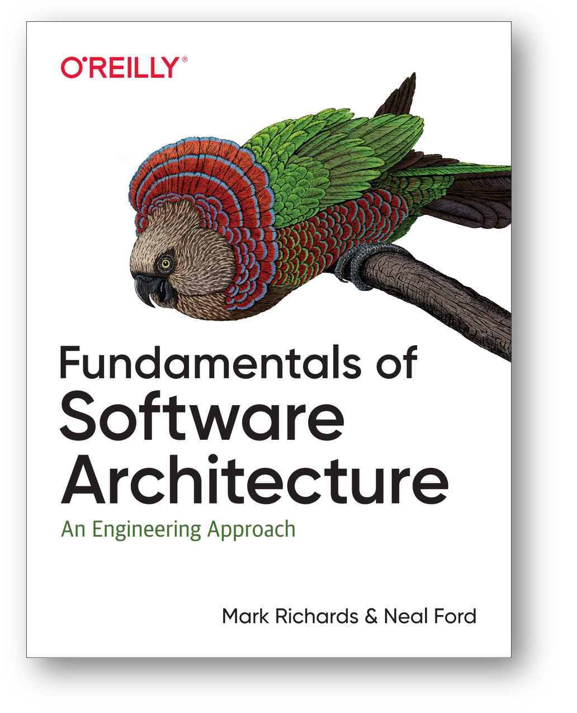
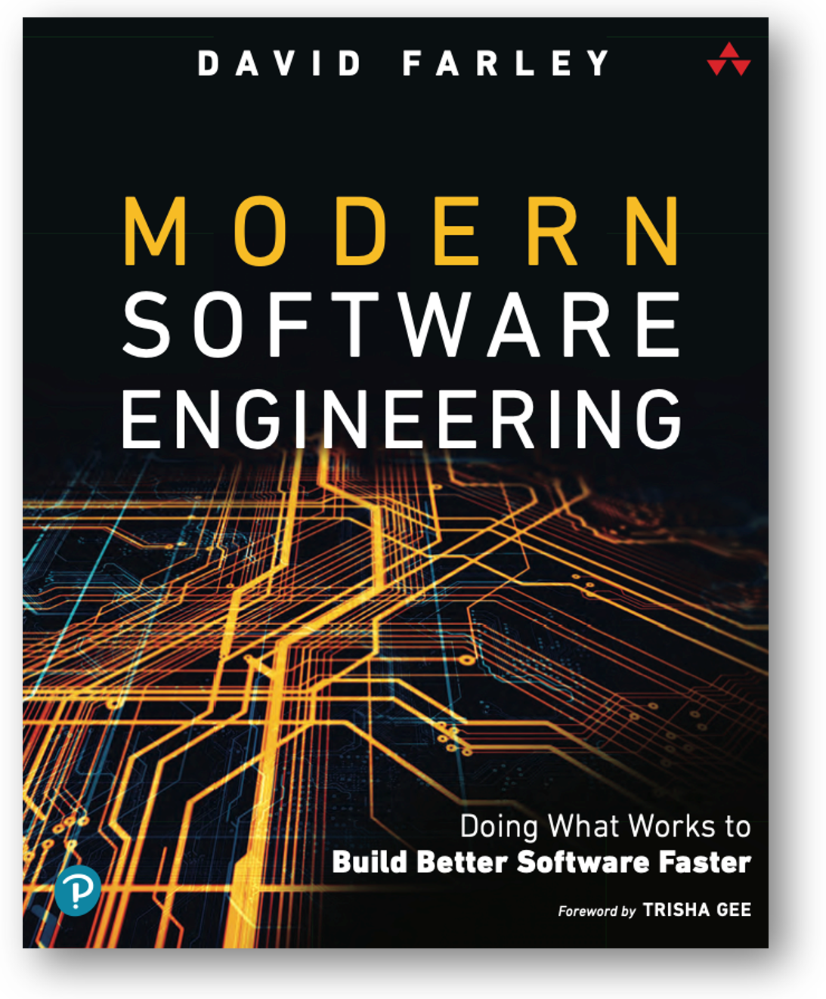

# Принятие решения: прохождение развилок (trade-offs)

Прохождение развилки по-английски будет trade-off studies, «изучение компромисса», а про «компромисс» говорят как о заведомом неуспехе: он не удовлетворяет никого из участвующих в достижении этого компромисса ролей, в то время как какие-то «бескомпромиссные» решения удовлетворяют хотя бы какие-то роли и сильно не удовлетворяют другие роли. Все компромиссы плохи, и поэтому решения в концепциях заведомо объявляются не «лучшими из имеющихся» а «наименее плохими из имеющихся».

Подробно trade-off studies на примерах архитектурной работы даётся в книге «Fundamentals of Software Architecture»:

Там формулируется первый закон программной архитектуры: **«Everythinginsoftwarearchitectureisatrade-off», то есть «всё в программной архитектуре — это результат прохождения развилок». И там же приводится следствие из этого закона: «если вы нашли что-то, что не похоже на развилку, то вы, скорее всего, просто не подумали об альтернативах».**

Мы полностью согласны с этим первым законом, но его значение выходит за пределы программной архитектуры к вообще архитектурным решениям (по поводу конструкции системы, поддерживающей важные архитектурные характеристики) и далее ко всем прикладным инженерным решениям в целом, то есть ко всем решениям, которые делают не только архитекторы (которые ответственны за -ости/-ilities/архитектурные предметы интереса), но и все остальные инженерные роли (визионеры, прикладные методологи, проектировщики, технологи, инженеры внутренней производственной платформы), причём эволюционно/непрерывно, а также безмасштабно и для всех систем разной природы (и для «железа», и для личностей, и для предприятий, и для стран).

То, что мы рассматриваем прохождение развилок в работе проектировщика, а не в других разделах руководства — это просто из-за удобства изложения, подходящее место для примера. Выдвижение альтернатив, а затем выбор из них в условиях неопределённости — общие методы сильного мышления, должна проходиться в трансдисциплинарной рациональности. Тем не менее, повторим в привязке к проектированию. Каждый раз, когда вы хотите реализовать какую-то функцию (помним, что это логические шаги, разложение метода, а не строгий алгоритм. Всё это итеративно и с остановками для получения дополнительной информации):

* Проверьте, нужна ли вообще эта функция. Для каждой функции будет затем какая-то работа. Нужно ли на неё тратить ресурсы? Попробуйте обойтись вообще без этой функции: что изменится? Будьте элегантны, lean.
* Если нельзя отказаться, точно определите эту функцию: вы запросто можете ошибаться в постановке задачи, поэтому попробуйте формализовать, то есть помоделировать — отбросить неважное, оставить важное. В формальной постановке задачи проще находить ошибки.

+ Найдите заведомо более одного варианта, каким образом конструктивно реализовать функцию (учитывая ещё и варианты размещения, и стоимость, и другие системные аспекты/перспективы основных описаний системы, но ведь есть и неосновные описания, важные для вашего проекта). Всегда помним, что идеал — это когда функция исполняется, но нет ни одной добавленной части конструкции, ибо каждая часть конструкции может выполнять множество функций. А ещё одна функция может выполняться несколькими элементами конструкции. Тут мы сразу говорим о функции/методе (иногда даже культуре!), но конструктивные части выполняют роль функциональных частей (помним, что Вася выполняет роль бегуна, а бег — поведение бегуна). Тут надо спрашивать опытных товарищей, гуглить, спрашивать AI-агентов, а иногда и делать изобретения. Генерация идей, продуктивных гипотез — тут. Если вы считаете, что есть только один вариант, то вы что-то упустили. Подумайте ещё и вспомните, погуглите, спросите AI, примените приёмы генерации идей — и сделайте изобретение.

- Затем примите рациональное решение: пройдите развилку, выберите между альтернативами, обоснуйте выбор (приведите rationale — дальше будет рассказано про инженерные обоснования). Есть теории принятия решений в условиях неопределённости, вот это как раз оно.
- Примите ваш рациональный выбор всерьёз: запланируйте работы (вместе с технологом), чтобы иметь ресурсы.
- Выполните запланированные работы, потратьте ресурсы! «Политическая воля» — тут.
- Проверьте, работоспособно ли решение: протестируйте, проведите испытания и примите решение, получилось ли (об этом тоже будет в подразделах про инженерные обоснования).
- Убедитесь, что результатами пользуются: если не пользуются — можно было бы всё это не делать.

Это мы опять пробежались по мантре рационального стратегирования, проектирование тут один из частных случаев её применения.

Можно много и долго смотреть на разные методы, которые можно использовать для выполнения разных логических шагов этой мантры. Это всё рассуждения не собственно о системной инженерии, а о сильном мышлении. Подробней про сильное мышление рассказывается в руководстве по интеллект-стеку фундаментальных методов мышления, и если вы хотите продуктивности в инженерных ролях, вам надо когда-нибудь сосредоточиться — и познакомиться с этим руководством.

Например, в одном из шагов мантры стратегирования упоминается «рациональное решение». Принятие рационального решения базируется на какой-то формальной оценке шансов его успешности, то есть эти шансы успешности решения считаются по какой-то модели. Должны ли мы для получения лучших решений:

* следовать эмпирицизму, то есть выводить эти модели из данных наблюдений по каким-то алгоритмам, «не сочинять», «не высказывать догадки, всё по формулам»?
* опираться на эволюцию знаний: генерировать сильные догадки на основе больше интуиции (смутных ассоциаций) и случайности, чем каких-то формул, затем проверять, насколько они выдерживают критику логикой (возможно, вероятностно), а затем и экспериментом?

Ответ: эмпирицизм вреден, должны быть причинно-следственные объяснения, которые сформулированы контрфактически на основе догадок. Это и есть рационализм. Эмпирицизм был полезен в прошлых веках, когда эксперимент и данные наблюдений вообще игнорировались, речь шла только о рассуждениях — царила схоластика, отвязанная от физического мира логика, а то и не очень логические рассуждения («я художник, я так вижу»). Но сейчас это не SoTA в части организации познания и инженерии. Вместо него пришёл рационализм, опирающийся на реализм, признание важности физического мира — и ещё прагматизм, как поворот любых рассуждений только как ведущих в поддержку какого-то действия по изменению мира (включая изменению самой рассуждающей о мире системы). Рассуждения ради рассуждений отметаются, но рассуждения «по наитию» — не отметаются (это догадки!), хотя без проверки сначала (причинной/causal) логикой, а затем и экспериментом — не принимаются всерьёз, то есть не служат основаниями для каких-то действий в физическом мире.

В хорошей книге «Modern software engineering» (2022) ставится интересный вопрос о том, что программная инженерия как-то утеряла свою «инженерность», оказалась цеховым ремеслом/craft, а теперь эту инженерию надо в неё вернуть.

Сама постановка вопроса заставляет сформулировать принципы современной инженерии (задача в чём-то похожа на задачи нашего руководства). Но автор (David Farley[^r8-1]) выводит «опору на опыт/эксперимент», то есть эмпирицизм, в качестве основания инженерии. Это уже не SoTA, опора должна быть на теории/объяснениях, которые отбираются в том числе с использованием опыта/эксперимента. Подробно мы это разбирали в руководстве по рациональной работе. Книга всё-таки хорошая, но вот к тамошним рассуждениям о предмете инженерии по сравнению с «просто ремесленничеством» надо относиться с осторожностью: используются не SoTA представления о том, что же такое инженерия. Тамошний эмпирицизм — это прошлый век! Эйнштейн выдал свои догадки об искривлениях пространства-времени вместо сил притяжения между большими массами, не выводя их логически «по формулам». Наоборот, он предложил это, решая противоречия, которые были в расхождении вывода по имеющимся ньютоновским формулам и экспериментом. А затем на базе догадок Эйнштейна были разработаны модели физического мира (формулы для вычислений), которые легли в основу инженерии систем навигации GPS, GLONASS, Galileo. В основе инженерии систем навигации — догадка, которую не удалось прокритиковать ни логически, ни экспериментом.

Дальше в шагах мантры стратегирования (рационального выбора метода, которым будет создаваться новая система проектировщиком) ставится вопрос о выборе альтернативных инженерных решений по конструктивным частям системы в условиях заведомой неопределённости, «тумана будущего». Это как раз предмет теорий принятия решений, которых оказывается множество[^r8-2]:

* Классические строго логические. Увы, не работают в реальной жизни.
* Статистические байесовские. Часто не работают, но именно их считают сегодня «рациональными» — с этим не все согласны, ибо заведомо ведь ясно, что эти теории решений не дают оптимального результата во многих случаях! Так что их начинают считать «иррациональными».
* Квантовоподобные. Это современные кандидаты на «рациональные» теории принятия решений, при этом решения получаются не слишком точные — но зато они формально возможны и эти вычисления экономны в силу особенностей квантовоподобной математики. Настолько экономны (экспоненциально!), что делаются гипотезы об эволюционных преимуществах таких вычислений в ходе биологической эволюции[^r8-3].

Более того, нам нужны рассуждения не просто о логических (позапрошлый век), или байесовско-вероятностной (прошлый век), или квантовоподобной вероятностной (двадцать первый век) взаимосвязи одних явлений с другими «по формулам». Нет, нам нужны именно объяснения — которые находятся на третьей ступеньке лестницы причинности (ассоциации-корреляции на первой ступеньке, исчисление вмешательств, do-calculus на второй ступеньке, контрфактуальные рассуждения на третьей). При обсуждении того, как связаны решения о выборе конструктивов, которые реализуют функциональные объекты так, чтобы удовлетворить функциональным характеристикам систем самой разной природы, надо чтобы инженеры (не только проектировщики!) умели строить рассуждения с объяснениями причин и следствий — в том числе моделировать их в виде графов причинности. Как и методов моделирования (описаний самого важного!) функциональности, методов моделирования архитектурных решений, методов моделирования рационального выбора из альтернатив, которых великое множество, есть множество методов моделирования причинности. **За каждым из методов** **стоит какое-то** **множество** **нотаций, за** **каждой нотацией стоит множество поддерживающих её моделеров.** Вот только несколько методов моделирования причинности:

* Деревья текущей реальности Голдратта (current reality trees)[^r8-4] — часть Теории Ограничений, разработанная Eliyahu Goldratt. Они используются чаще всего для выявления узких мест в рабочих процессах, хотя метод и носит общий характер. Ключевая терминология привязана к «нежелательным эффектам» (поэтому просто применять в производственных проектах, сразу понятно, что и как делать), сам метод качественный (без количественных оценок вероятностей), граф причинности там — дерево.
* Структурная причинная модель (SCM, structural causal model)[^r8-5], разработанная Judea Pearl, выражаются направленными ациклическими графами (DAG, более общий вид графа, чем дерево, ибо у узла может быть больше одного родителя, а в дереве — только один). Такая модель причинности используется чаще всего в социальных науках, включая экономику и психологию, а также медицине и сельском хозяйстве. Этот метод количественный, он тоже очень общий, а ещё он крайне абстрактен и поэтому его чаще используют в исследовательских проектах, а не производственных/инженерных. Но у этого метода есть интересные плюсы: расчёты по нему могут подтвердить или опровергнуть какие-то гипотезы (например, гипотезы о направлении стрелки причинности в корреляции). Структурные причинные модели сегодня — это SoTA причинного моделирования[^r8-6], но они довольно редко используются в инженерии, ибо их использование требует исследовательской квалификации.
* Диаграмма причинных циклов (CLD, causal loop diagram)[^r8-7] используется в системной динамике[^r8-8] для визуализации обратных связей и взаимодействий в системе. Это не совсем прямое описание причин и следствий, скорее, описание множества взаимодействий, причём с лагами относительно друг друга — это моделирование изменений во времени. Применение в бизнесе (моделирование роста и уменьшения размера компаний), экономике, экологии, социальных науках. Несмотря на то, что системная динамика сама — количественный метод, CLD — качественный инструмент, помогающий понять, как переменные влияют друг на друга через обратные связи во времени[^r8-9].
* Анализ дерева отказов (FTA, fault tree analysis)[^r8-10] используется в инженерии для анализа причин системных сбоев в аэрокосмической промышленности, ядерной энергетике, химической промышленности и прочих отраслях, где нужно оценивать надёжность системы. Помогает выявить потенциальные точки отказа и их последствия, улучшая надежность и безопасность систем[^r8-11].
* … множество других методов моделирования причинности, как общих (Rubin causal model[^r8-12], Bayesian networks[^r8-13]), так и более частных, поддержанных самыми разными общими и частными нотациями выражения причинности[^r8-14] вроде часто встречающихся в инженерии диаграмм Ishikawa[^r8-15] и диаграмм «почему-потому» (why-because)[^r8-16]для выяснения причин аварий/инцидентов.

И, конечно, для типовых ситуаций (типовых инженерных решений, типовых концепций) выгодно не рассуждать, не вычислять ничего вообще, а использовать заранее известные результаты рассуждений, заранее вычисленные значения — задействовать знание из культуры, «память вместо вычислений». Но мы всё-таки советуем перед задействованием памяти проверить: не появилось ли с момента когда-то выполненных рассуждений, результаты которых вы сейчас достаёте из памяти своей или компьютера, какой-нибудь новой альтернативы или новых данных эксперимента, подтверждающих или опровергающих эти рассуждения? И задействовать результаты из памяти тогда, когда ничего нового не обнаружено (ну, или когда проверка «не появилось ли чего нового» более дорогая по ресурсам, чем возможный убыток от использования нерационально сделанного решения).

Важно, что речь идёт о достижении каких-то характеристик главным образом времени эксплуатации (хотя и времени создания тоже — вы должны проектировать для изготовления, design for manufacturing), при этом физическое моделирование доступно отнюдь не всегда. Cкажем, вы проектируете функциональную организацию предприятия, его рабочие процессы — вы, конечно, можете задействовать моделер системной динамики для этого, но это не так просто. Приходится задействовать самые разные способы указания на то, что «вот такие причины в функциональной организации системы при условии того, что аффордансы подобраны правильно, ведут к вот таким следствиям».

Надо ещё и делать так, чтобы результаты работы системы (и результаты работы производственной платформы при изготовлении, design for manufacturing) можно было измерить, чтобы потом проверить — правда ли, что система (и её производственная платформа) имеет характеристики, которые были запланированны для неё функциональными проектировщиками и одобрены визионерами. Тут вспоминаем книгу Douglas W. Hubbard «How to Measure Anything»»[^r8-17], которая рассказывает, как измерить даже то, что трудно замерить физическими измерительными приборами (intangibles в бизнесе, причём понимаемые много шире бухгалтерских «нематериальных активов» вроде патентов и трейдмарок, как всё, что позволяет лучше принимать решения): удовлетворение пользователей, организационная гибкость, снятая неопределённость технологического риска, атмосфера в коллективе (employee morale).

И последнее важное замечание: в инженерии принято говорить о компромиссах (trade-offs), «решениях, которые никого не устраивают». Да, это базовый вариант инженерного рассуждения. Но иногда бывает, что вы предлагаете способ решения противоречия, способ решения конфликта — часто для этого надо предложить новую концептуализацию, в которой этого конфликта нет. Это открытия/discoveries, изобретения/inventions. Это много, много лучше компромисса[^r8-18]. Не упускайте такую возможность, но и не расстраивайтесь, если вам это не удалось сделать.

[^r8-1]: <https://www.davefarley.net/>

[^r8-2]: <https://ailev.livejournal.com/1611838.html>

[^r8-3]: <https://www.sciencedirect.com/science/article/pii/S0303264720301994?via%3Dihub>

[^r8-4]: <https://en.wikipedia.org/wiki/Current_reality_tree_(theory_of_constraints)>, <https://www.6sigma.us/six-sigma-in-focus/current-reality-tree/>

[^r8-5]: <https://en.wikipedia.org/wiki/Structural_causal_model>

[^r8-6]: <https://plato.stanford.edu/entries/causal-models/>

[^r8-7]: <https://en.wikipedia.org/wiki/Causal_loop_diagram>

[^r8-8]: <https://systemdynamics.org/>

[^r8-9]: <https://thesystemsthinker.com/causal-loop-construction-the-basics/>

[^r8-10]: <https://en.wikipedia.org/wiki/Fault_tree_analysis>

[^r8-11]: <https://safetyculture.com/topics/fault-tree-analysis/>

[^r8-12]: <https://en.wikipedia.org/wiki/Rubin_causal_model>

[^r8-13]: <https://en.wikipedia.org/wiki/Bayesian_network>

[^r8-14]: <https://en.wikipedia.org/wiki/Causal_notation>

[^r8-15]: <https://en.wikipedia.org/wiki/Ishikawa_diagram>

[^r8-16]: <https://en.wikipedia.org/wiki/Why%E2%80%93because_analysis>

[^r8-17]: <https://www.amazon.com/How-Measure-Anything-Intangibles-Business/dp/1118539273>, 3rd edition, 2014

[^r8-18]: <https://systemsworld.club/t/moj-konspekt-vazhnyh-idej-iz-knigi-vybor-pravila-goldrata/23556/>
