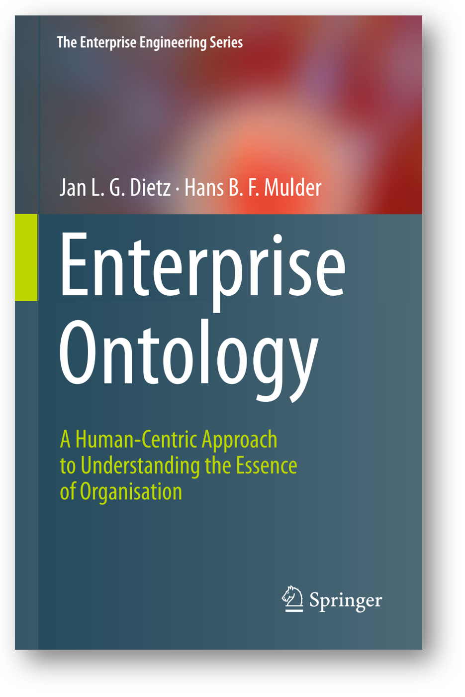
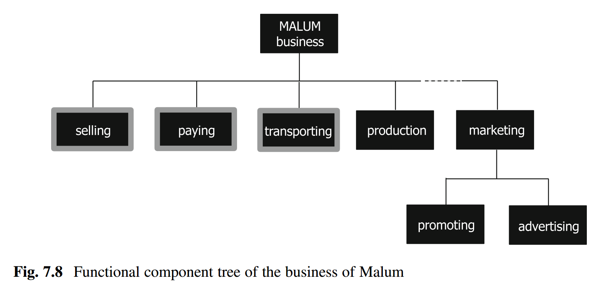
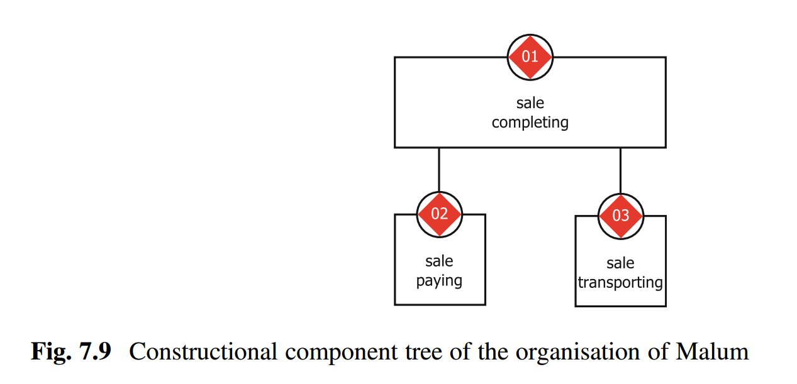
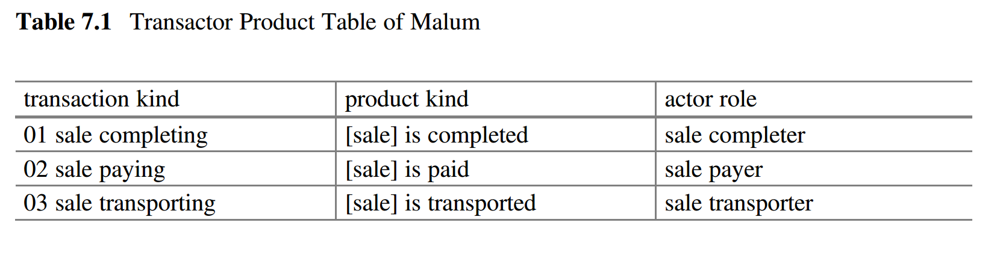
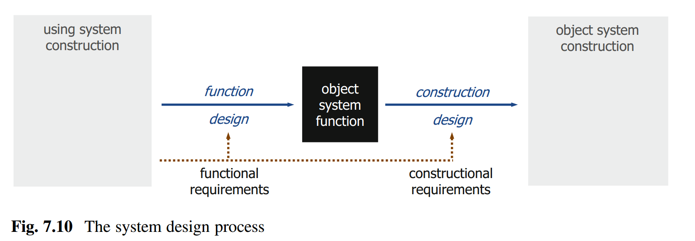

# Проектирование как следование архитектуре

Предполагается, что архитектор бьёт систему на части, которые как-то соответствуют предметным областям/domain, а они обычно соответствуют методам работы с объектами какой-то предметной области. В DDD — это поделить систему в соответствии с bounded contexts, предметными областями. В классической «железной» инженерии такой вопрос в явном виде обсуждается редко, но там примерно то же самое: двигателистам отдают проектирование и изготовление двигателя, а разработчикам крыльев — крылья (ибо там много особенностей в использовании композитных материалов, которые прочные, но хрупкие). На крылья и двигатель самолёт нарезает архитектор.

В DDD программисты нарезают программные системы по bounded context в предметной области поддерживаемой организации (business переводим как «организация», ибо не все организации, поддерживаемые софтом — бизнес-организации, есть и госведомства, и некоммерческие организации). Софт в DDD — модель предметной области, которую этот софт поддерживает. Принцип моделирования: каждому важному объекту предметной области соответствует объект программы. Скажем, если в организации есть «счёт» и «клиент», то и в софте поддержки этой организации должен быть и объект «счёт», и объект «клиент» (таблицы в базе данных, процедуры в языке программирования — это неважно, у вас есть средства выбрать что-то подходящее).

Но обычно всё чуть сложнее: архитектор может поделить систему на конструктивные части по иному принципу. Скажем, предметные области будут не пользовательские, а разработчиков. Например, архитектор в программной системе выделит «слой пользовательского интерфейса, слой логики, слой работы с базой данных, слой базы данных», всё это в терминах не пользователя, а разработчика — отсылки к методам создания, а не методам использования. Архитектор и сам был когда-то проектировщиком, поэтому пошёл по этому «лёгкому пути» (в современной архитектуре так не советуют делать, ибо такая слоёная архитектура рождает много лишних зависимостей между модулями»).

Другой, более современный вариант — архитектор делает «микросервис зарплаты, микросервис складского учёта, микросервис кадровой работы» в терминах предметной области/функции системы. Каждым микросервисом может заниматься отдельная команда разработчиков, она проектирует и функции этих микросервисов, а затем и конструкцию — доводя до кода. Разработчики при этом плотно общаются с внешними проектными ролями (сами, а не через «инженеров требований» или «аналитиков», никаких испорченных телефонов или «фиксированных требований», и общаются всё время проекта, а не только до момента выпуска первой версии, первого MVP). И всё это время будут дрейфовать/плыть/меняться (уточняться или наоборот, становиться абсолютно неприемлемыми и требовать кардинальной замены) концепция использования, концепция системы, в том числе архитектура в составе концепции системы.

Ещё одна книга, которая рассказывает о концепции системы как об архитектуре, и поэтому двигает рассмотрение архитектуры от чисто функциональной архитектуры к конструктивному/модульному рассмотрению как ограничений в работе проектировщика — это второе издание «The Enterprise Ontology», 2020.

В этой книге отмечается, что в предприятии можно выявить функциональные элементы и конструктивные, причём и те, и другие определяются поведенчески: первые через функции, вторые через **трансакции**, проходящие между оргзвеньями фирмы, а также оргзвеньями фирмы и внешними предприятиями. Вот пример функциональной декомпозиции предприятия Malum из главы 7 этой книги, «The TAO Theory: Understanding Function and Construction».

А вот как показано конструктивное разбиение, которое авторы называют потом «сущностным» на базе замечания, что функциональных разбиений может быть предложено множество самых разных, которые субъективно определяются самыми разными проектными ролями, а сущностное (подразделения и их сервисы) определяется более однозначно, причём справедливо замечают, что прямого соотнесения между функциональными и конструктивными частями системы обычно нет:

Как понимать эти трансакции в концепции предприятия? Вот табличка акторов для этой диаграммы, мы видим в них знакомые описания рабочих процессов через нарратив как последовательность событий, а события — это изменения состояния предметов рабочего процесса/метода: видим альфу sale и её состояния, но не хватает конструктивного описания — рабочих продуктов, отражающих состояние альфы, а также нет оргролей, которые надо будет назначить на оргзвенья. В «конструктивной диаграмме» оказалась скрыта «функциональная табличка»:

В этом подходе, конечно, есть и поведения (методы/функции и работы), и функциональные и конструктивные объекты (Вася и его забег утром за хлебом, бегун и бег). Но вот терминология «авторская», и надо быть внимательным к терминологии дважды:

* Функциональное и конструктивное вполне путаются
* Архитектура включает и функциональное, и конструктивное разбиение, но необязательно высокоуровневое. Описание мелких действий в этом подходе вполне будет отнесено к «архитектуре предприятия» (а онтология — это «формальная информационная модель предприятия», описание предприятия, совершенно необязательно «верхнеуровневое»). Тем самым спутаны работы орг-архитектора, методолога (проектировщика процессов) и орг-проектировщика.

В самой книге аккуратно уходят от названия «концепция» или «архитектура» предприятия для их варианта мета-мета-моделирования (как и в наших руководствах для инженеров-менеджеров, в этой книге делается заявка на «моделирование всего», мета-мета-модель), а свою мета-мета-модель (в которой обсуждаются довольно общие для инженерии вещи, но с акцентом на предприятие/enterprise) авторы называют «онтология предприятия», аргументируя важность рассмотрения не только функционального (телеологического, направленного на цели, intent/намерение, ответ на вопрос «для чего вы это делаете» — предмет работы методологов), но и конструктивного (артефакты и агенты как конструктивно рассматриваемые системы и их сервисы, предмет работы орг-архитекторов и орг-проектировщиков) рассмотрения.

Книга эта хороший пример того, что концептуальное проектирование и архитектурная работа по выбору варианта конструкции (в данном случае — конструкции предприятия, составленного из подразделений) даже при понятной концепции системы тесно связаны. Когда речь идёт о примерах использования описанного в книге моделирования предприятия, становится понятным, что не любое разбиение предприятия на модули-подразделения для выполнения им желаемых функций осмысленно в плане достижения желаемых значений архитектурных характеристик.

Мета-мета-модель книги «The Enterprise Ontology» несколько отличается от мета-мета-модели, которой придерживаемся мы в наших руководствах для инженеров-менеджеров. В этой короткой книжке сделана попытка сжато изложить довольно много материала, похожего на материалы наших руководств, чтобы задать какие-то типы мета-мета-модели, позволяющие судить об архитектуре предприятия, которая понимается как оргпроект (содержащий в себе и функциональную архитектуру, а также более низкоуровневые функциональные описания), так и архитектуру как верхнеуровневое конструктивное разбиение, но и дальше — рабочее проектирование орг-проектировщиками.

В основе этой книги лежит второе поколение системного мышления, однократный жизненный цикл, однократное «создание успешной организационной системы», а не многократный эволюционный, «непрерывное всё»/«создание и развитие успешной системы», как в наших руководствах. Тем не менее, обсуждаются ровно те же идеи, которые даются в нашей мета-мета-модели, хотя и немного в другой терминологии и с опорой на немного другие обоснования. Мышление о концепции системы и архитектуре системы более-менее универсально в разных инженериях, оно безмасштабно, приложимо к системам самой разной природы, а в современных версиях — ещё и эволюционно, и неантропоцентрично.

Вот ещё одна диаграмма из обсуждаемой книги «The Enterprise Ontology», иллюстрирующая концептуальное проектирование в его связи между функциональной архитектурой и структурой модулей:

Описывается метод/process проектирования/design системы. Надсистема называется **usingsystem** (использующая в своём составе целевую), целевая система — **objectsystem** (один из переводов object — как раз «цель»). Постаринке говорится о «функциональных требованиях» (требования к назначению целевой системы, её поведение в составе использующей её надсистемы), а вот «конструктивные требования» — это как раз ограничения на модульный синтез: с одной стороны, какие модули можно или нужно задействовать, с другой стороны — архитектурные ограничения, архитектурные решения, влияющие на группировку функциональности по модулям, влияющую на архитектурные характеристики.

Как ответить на вопрос: важнее/главнее концепция системы, или архитектура? Концепция системы — это верхнеуровневое системное описание, верхнеуровневый проект/design системы. Архитектура (архитектурные решения по верхнеуровневому делению на модули) тут только часть проектных решений (проект всей системы тоже можно представить как «набор решений»!). Функциональная архитектура — это просто функциональное описание системы (часто верхнеуровневое, слово «архитектура» может подчёркивать эту верхнеуровневость). А что с остальной частью проекта? Ей заняты функциональные проектировщики (процессные инженеры, прикладные методологи) и проектировщики-конструкторы.

Концепция системы важна: если вы не знаете, что из конструктивных объектов могло бы исполнить функцию системы (аффордансы/комплектующие/конструктивы), то системы не будет. Можете дать себе три дня на «гугление», вопросы к AI-агентам и друзьям, возможное изобретение, но лучше уходите из проекта, где непонятно, из чего можно сделать систему с предлагаемой функцией. Скажем, вы получили много денег на проект биологического бессмертия. Если непонятно, что именно конструктивно надо делать для бессмертного организма, нет хоть как-то обоснованных на приемлемом уровне риска предложений, то в такой проект идти не надо: нужное вам открытие ещё может просто не существовать, а шансы, что его сделаете именно вы, и успеете при этом сделать его за срок проекта — этот шанс мал. На планете сейчас примерно 500тыс. биологов, которые разбираются в сворачивании белков, а также несколько AI, которые в этом разбираются. Но не факт, что вы найдёте среди них таких, кто добьётся успеха в проекте бессмертия, даже если получит неограниченное финансирование.

Архитектура системы в составе концепции системы важна: если архитектор не разобьёт систему на какие-то «правильные» для достижения архитектурных характеристик части с оптимальной связностью и сплочённостью, то система будет плохо развиваться/evolve, она будет неуспешна уже через пару итераций.

На заре интернета было множество поисковых систем, но они все базировались либо на краулере (робот, собирающий по всему интернету веб-страницы в поисковую систему) и «индексе» поисковика на мощном центральном сервере (обычно компьютер Sun), либо на идее распределённого поиска (каждый вебсайт делал свой поиск, потом они объединялись). Гугль победил, ибо в его архитектуре краулер собирал веб-страницы в датацентр из множества дешёвых компьютеров (а не в мощный Sun-сервер, который не справлялся с нагрузкой, каким бы он ни был мощным). Связь между серверами вебсайтов с фрагментами децентрализованной системы была ненадёжной, плюс поиск давал дополнительную нагрузку на маломощные вебсайты — эти системы вообще оказались неработоспособны, по факту в конкуренции поисковых систем они не участвовали. Победившее архитектурное решение Гугла было внешне централизованным (одна точка входа), но внутри — распределённым (не один мощный сервер, а много маленьких слабых). И Гугль победил практически всех за счёт грамотной архитектуры (а вовсе не за счёт более качественного алгоритма поиска, как это обычно показано в литературе). Мощностей датацентра (в то время ещё не было такого понятия, это была новинка! Были только «вычислительные центры») как раз хватало, чтобы Гугль отдавал ответ на запрос практически мгновенно, как и сейчас, а лучший конкурент AltaVista — минуту и больше. Хороший алгоритм самого поиска (PageRank) пригодился много позже, когда конкуренция была уже выиграна за счёт новой архитектуры (изобретения) и надо было защищаться от повторяющих подобную архитектуру (например, от Bing).

То есть первое слово за прикладными разработчиками, особенно за методологами, функциональными проектировщиками — без них вообще непонятно, что делаем. Но первое слово также и за архитекторами, которые должны правильно упаковать и поставить в архитектурные рамки работу прикладных разработчиков: они должны принять архитектурные решения по поводу системы, организовать разработчиков с их концептуальным проектированием в соответствии с обратным манёвром Конвея, а затем выполнять архитектурный надзор, чтобы разработчики не ухудшали успешность системы, то есть не стремились достичь локального квазиоптимума по достижению характеристик «своих» модулей системы, но делали вклад в достижение глобального по всей системе квазиоптимума. «Квазиоптимум», а не «оптимум» — помним про многоуровневую эволюцию и неизбежную при этой эволюции неустроенность/frustrations, происходящую из-за конфликтов между этими системными уровнями. Вот архитекторы этим и занимаются, оформляя работу прикладных/domain инженеров в целостную систему из по-крупному нарезанных модулей первых нескольких уровней. И там уж работают проектировщики (в связке с методологами и технологами): в какой-то момент надо выполнить проект конструкции с детальностью, достаточной для изготовления.