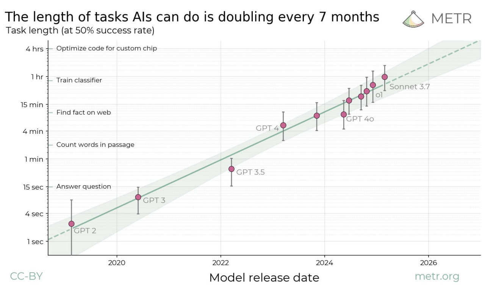

# Безошибочность проектирования, точность изготовления, тотальная автоматизация инженерии

Каким образом добиться точности в проектировании/design? В программировании это будет не только design, но и написание кода как «проектирование с достаточной для изготовления точностью». В инженерии железа это будет design, а аналог «кода» в программировании — информационная модель. В русскоязычной практике могут различать «конструирование» как разработку форм деталей (частей системы, которые не собирают из более мелких деталей) и «проектирование» как разработку на основе уже известных деталей и более крупных частей (подсборок, сборок). В любом случае, залогом успеха является доведение абсолютно недетального описания какой-то сигнатуры функции системы («забивание гвоздя») до уровня детальности, требуемого для автоматического изготовления конструктива на производственной платформе, «перевода из битов в атомы». Такой детальности ещё не везде добились, не везде «токарь» стал «станком с ЧПУ» или «3D-принтером», а слесарь-сборщик «промышленным роботом-сборщиком». Ну, и AI позволяет задействовать vibe инженерию (по аналогии с vibe coding[^r8-1], прозванным так Andrej Karpathy), где значительную часть формализации берёт на себя AI-система.

Ключевых трендов тут два:

* Тщательные проверки модели инкремента, quality assurance, инженерные обоснования. Если есть какие-то ошибки, то их нужно обнаруживать рано. Инкремент маленький, поэтому ошибки обнаруживать относительно легко. У нас будет отдельный раздел про инженерные обоснования.
* Изготавливаемое изделие не надо трогать руками, ибо каждые человеческие руки привносят ошибки. Автор видел вязаный свитер машинной вязки, на котором была ввязана абсолютно чёткая и ровная надпись контрастными нитками: «Твоя бабушка так не свяжет». Люди добавляют неточность! Для того, чтобы что-то собралось, оно должно быть точно спроектировано и точно собрано.

Так же, как архитектура может быть представлена как набор архитектурных решений, так и проект системы (design в классической инженерии, или в программировании исходный код, в инженерии предприятия это могут быть скрипты маршрутизации работ, и т.д.) может быть представлен как набор решений разработчика. Но разработчик, даже если он знает, что ему надо принять решение самостоятельно, а не «подготовить предложение» для утверждения кем-нибудь, кроме самого разработчика, совершенно необязательно будет принимать решения без какой-то их внешней проверки! Как и необязательно, что внешняя проверка независимыми экспертами приведёт к более качественным решениям — эксперименты показали, что тесты, подготовленные самим разработчиком, примерно одинаковы по результативности с тестами, подготовленными независимыми экспертами.

Тут есть некоторая проблема, «лекарство, которое стало болезнью». Тезис тщательности проверок приводит к тому, что разработчик не принимает решения лично и становится вместо инженера «аналитиком», который имеет право высказать только своё мнение, готовить предложение. Тогда решение принимает не разработчик, а кто-то из менеджмента, или «самый главный из инженеров». По факту это деградация инженерной культуры, она не замечается — пока какой-нибудь главный инженер не удивится, что у него к вечеру во входящих сообщениях где-нибудь двести-триста «предложений», которые он должен по факту не глядя (откуда у него время разбираться?!) должен «утвердить». Если вы увидели где-то «утверждаю» — вот это оно: не инженерная культура, а аналитическая, «спихивания ответственности» за принятие всерьёз (переход от слов к делу, трате ресурсов, воплощению идей в жизнь) на кого-то должностью повыше. Часто в такой организационной культуре окончательные инженерные решения принимают даже не инженеры, а мало понимающие в инженерии менеджеры. Это беда, с этим надо бороться по многим причинам (например, каждая передача решения кому-то — это задержка во времени, а если это начальник — то в силу его перегруза содержательной работы не будет, это чистая задержка на координационный акт). Это проблема организационной культуры, стиля принятия решений в организации.

Но не может же инженер принимать решение единолично? Может, только это должно быть информированное решение — он его должен показать коллегам-инженерам, чтобы они проверили верность этого решения. А для начала эту проверку надо облегчить: начать с написания тестов, которым должен удовлетворить результат выполнения решения.

А чтобы не отвлекать коллег, будем автоматизировать проверки — и тестирование, и проверку обоснованности самого решения (review проектных решений). Чужие «неживые» глаза делают проверку модели системы прямо во время проектирования очередного инкремента, а не после его окончания, когда принято уже множество решений. Для этого сажаем за моделер сразу двух разработчиков — неживого и живого (а потом и просто многих неживых, ибо автоматизация вытесняет из проекта людей)!

Этот метод проверки проектных решений по ходу их создания стал известен сначала для двух живых разработчиков под названием pair programming, она пришла из подхода eXtreme programming как результат идеи «если что-то хорошо, то мы доводим это до экстремума». Там рассуждали так: если кто-то посмотрит код программы кроме программиста, то это хорошо. Доводим до экстремума: за одной клавиатурой и экраном должно сидеть двое, поэтому в любой момент времени на код будут смотреть как минимум две пары глаз! Всё не так плохо с эффективностью: один из этих двоих сегодня — AI-copilot (но даже в случае живого человека производительность не слишком падала, явно не вдвое — за счёт уменьшения количества переделок, уменьшения rework в силу вовремя замеченных проблем). Это был очень контринтуитивный факт: при парном программировании производительность труда не падала вдвое. Сегодня AI-copylot превращается постепенно из pair developer в peer developer, в полноценного разработчика (прежде всего — проектировщика, designer, в программировании — кодировщик, coder). Как оценить его работу? По тому, какой длительности человеческую работу можно ему предложить? Такие оценки есть, они интересны не для идеи copilot с pair/peer programming, где AI «сидит рядом, работает вместе», но для идеи AI-assistant, который не сидит рядом, а берёт задачу — и приходит назад с ответом. Вот это (график в логарифмическом масштабе, март 2025)[^r8-2]:

Конечно, экспоненты бесконечными не бывают, обычно это фрагменты S-образных (логистических) кривых. Но вполне можно ожидать, что потенциал автоматизации работы проектировщика выше, чем это можно было бы ожидать — прямо сейчас происходит экспоненциальный рост инженерного мастерства AI-систем.

Заметьте, что идея парной инженерии (в оригинале — «парного программирования», сейчас это работа с AI-copilot, в том числе vibe coding или designing) отличается от идеи совместной разработки прикладного инженера и технолога по изготовлению (design for manufacturing), когда за CAD/САПР/моделером сидят конструктор детали и заводской инженер-технолог, хорошо знающий свой станочный парк. Или инженер-программист сидит и пишет программу вместе с экспертом в предметной области, для поддержки которой делается эта программа. Нет, это именно два проектировщика: один проверяет другого, даёт советы по альтернативным решениям (например, предлагает альтернативные концепции системы или помогает пройти развилку в уже имеющихся альтернативах, напоминает о каких-то ограничениях в части интересов внешних проектных ролей и т.д.).

Тренд тут был в том, что парное программирование стали брать на себя моделеры, поддерживающие мышление разработчика[^r8-3], это ещё до появления AI-copilot и общения с этими «вторыми пилотами», «парными проектировщиками» на естественном языке.

В простейшем моделере, который представляет из себя редактор текстов, можно делать проверку орфографических и грамматических ошибок (а если это язык программирования — проверять ошибки в синтаксисе языка). В чуть более сложном — предлагать даже дописывать слова, это реализовано даже в телефонах. Иногда это ведёт к ошибкам, но чаще наоборот, исправляет ошибки.

В более сложных моделерах можно сразу иметь copilot. В программной инженерии проектирование (кодирование) ведётся в IDE (interactive development environment, аналог CAD-систем в классической «железной» инженерии), которые представляют собой некоторые «микроядра» (архитектурный стиль микроядра, где есть общее «ядро» и к нему разные «плагины», реализующие дополнительные фичи). Плагины раньше нужны были как раз для возможности делать синтаксические проверки, а сегодня — для подключения самых разных AI-copilots, AI-assistants, AI-agents.

Простейшие проверки — синтаксические, но есть и более сложные проверки, например, на потенциальные угрозы безопасности. Программный код также будет проверен на соблюдение архитектурных принципов (скажем, проверка выполнения запрета на вызов каких-то функций «мимо» предписанного API), есть инструменты и для этого (они описаны в книгах по архитектуре программ, это разные варианты реализации архитектурного тестирования, fit functions).

Можно ли надеяться на то, что эти проверки надёжны? И да, и нет:

* Современные системы AI плохо проверяют, плохо находят ошибки[^r8-4]. Так же, как и люди — проблема в том, что и люди, и AI-системы используют нейросети, которые не в ладах с логикой и вычислениями.
* Но современные AI-системы могут помочь сделать шаг формализации и дать идею на оценку какому-то формальному инструменту проверки (не нейросетевому, а использующему традиционные вычисления). И тогда ошибку найдёт алгоритм, занимающийся традиционными вычислениями.

В любом случае: лишние глаза никогда не помешают, и сейчас такой момент в истории, когда эти лишние глаза не совсем живые.

Чего ожидать дальше? Ещё меньше человеческих рук на пути от идеи к детальной модели, готовой к изготовлению. Примеров тут масса, это центральная тема всей инженерии: от «тёмных холодных фабрик» (заводов-автоматов, ибо нет людей, не надо освещать и отапливать) переход также к «тёмным холодным» конструкторским бюро и программистским фирмам. Обсуждается даже «страна гениев в датацентре»[^r8-5], поэтому наше руководство не будет тут давать подробности — они устареют в первый же день после приведения примеров, к экспонентам надо относиться серьёзно.

Но что надо понимать, так это общий характер происходящей автоматизации для систем самой разной природы, для всех инженерных специальностей, которые этими системами занимаются. Вот пример такой не слишком обычной инженерии, как инженерия диджейского сета (последовательности треков на танцевальной вечеринке, или на радиостанции)[^r8-6]: музыкальный сервис узнаёт вкусы диджея, предлагая ему послушать самые разные треки и отметить те, которые ему подходят, а затем генерирует диджейский сет, на основании этих предпочтений. Есть ли тут развитие? Конечно! Диджеи работают с уже готовой музыкой. Но сегодня и музыка генерируется вполне сравнимо с созданной людьми[^r8-7], поэтому можно ставить уже не задачу выбора, а сразу задачу генерации музыки.

Ход на автоматизацию всей инженерии — сегодня важнейший и общий, предметная область и природа систем тут неважны. Скажем, можно выяснить предпочтения того же дизайнера автомобилей, а затем автоматически сгенерировать ряд автомобильных форм, которые будут отвечать этим предпочтениям. Это можно рассматривать и как использование «рекомендательных сервисов», и как использование «парных разработчиков» (программиста, инженера-конструктора, промышленного дизайнера или дизайнера видеоигр, диджея и т.д.). Конечно, требования к результату в «развлечениях» будут пониже, чем в инженерии ракетных систем или разработке корпоративного софта, но прогресс тут довольно быстр и неостановим.

Одна из проблем на этом пути — это планирование каких-то последовательностей преобразований моделей, ибо нейронные сети плохо планируют (хорошо «воображают» статичный результат, но плохо планируют цепочки действий, плохо отслеживают изменения в больших конфигурациях). Поэтому трудно ожидать, что вот прямо сейчас распечатанный на 3D-принтере итог работы «не слишком живого конструктора» будет автоматически и без проблем собран. Но такое сейчас не так просто и беспроблемного происходит и с живыми конструкторами. Прогресс и тут быстрый. И если AI-агенты каждые полгода умнеют с выходом очередной версии, то с инженерами-людьми такого не происходит.

И тут нужно заметить, что само понятие «сборка» (integration, раньше была отдельная стадия — ибо мало что сходу друг с другом собиралось, надо было «дорабатывать по месту напильником» каждую деталь) в современной инженерии отходит на второй план. Современные точно изготавливаемые детали просто складываются вместе — никаких проблем, никаких «доработок». Это обеспечивается точностью проектирования и точностью изготовления. Но есть и другой ход, на 3D-печать. Вместо набора простых деталей можно использовать одну сложную деталь, и сборка тогда включает в себя меньшее число более простых операций (плюс для меньшего числа деталей более простая логистика, а каждое соединение не нужно отдельно проверять). При поломке можно напечатать новую деталь, а не ремонтировать старую. Что можно так напечатать? В ракете Terran 1 компании Relative Space печаталось 85% ракеты (по весу), а цель — 95%[^r8-8]. Печать ракеты (как бы странно это ни звучало) идёт 60 дней, а деталей в этой ракете в сто раз меньше, чем в обычной ракете, и по этой технологии космический корабль уже выходил на орбиту. В сто раз меньше деталей — это при надлежащей точности изготовления минимум в сто раз меньше возможных ошибок при сборке! А цена? В сто раз меньше проверок по сборке, в сто раз меньше логистики на сборке, в сто раз меньше возможных конфликтов конфигурации. Плюс можно каждую следующую ракету делать чуть лучше, чем предыдущую, просто печатая улучшенные детали для этих ракет. Непрерывная разработка, непрерывная интеграция, непрерывное введение в эксплуатацию работают и в аэрокосмосе. В этом проекте не всё безоблачно, ибо при переходе на более большую ракету для скорости пришлось временно отказаться от 3D-печати самых крупных элементов (прежде всего — стенки баков)[^r8-9], но тренд в сторону 3D-печати очевиден.

Иногда тему автоматизации проектирования (особенно в строительстве) ещё называют «порождающим проектированием» (generative design)[^r8-10]. Но термин, похоже, не будет жить долго: всё проектирование автоматизируется — и скоро проектирование «вручную» будет выглядеть примерно так же, как «рукоделие» (скажем, свитер ручной вязки, а не промышленной вязки), то есть больше хобби, чем серьёзное занятие инженеров.

[^r8-1]: <https://x.com/karpathy/status/1886192184808149383>

[^r8-2]: <https://metr.org/blog/2025-03-19-measuring-ai-ability-to-complete-long-tasks/>

[^r8-3]: <https://ailev.livejournal.com/1515735.html>

[^r8-4]: <https://www.arxiv.org/abs/2502.19414>, <https://arxiv.org/abs/2502.06556>

[^r8-5]: <https://www.anthropic.com/news/paris-ai-summit>, февраль 2025

[^r8-6]: <https://vk.com/wall2449939_4256>

[^r8-7]: <https://suno.com/>

[^r8-8]: <https://www.relativityspace.com/>

[^r8-9]: <https://www.youtube.com/watch?v=2c1VB44Ll90>

[^r8-10]: <https://en.wikipedia.org/wiki/Generative_design>
