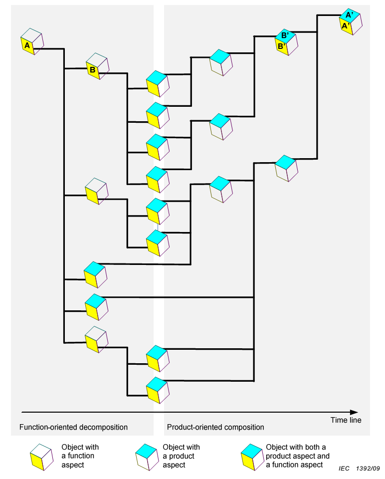
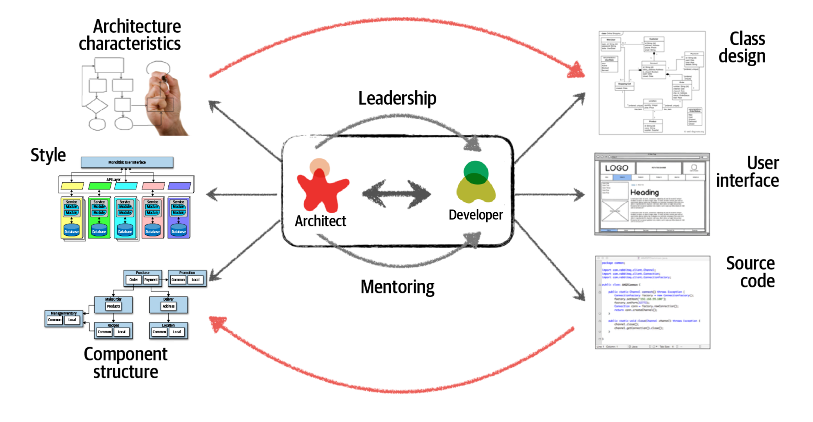

# Системное проектирование

Концептуальное проектирование раньше называлось архитектурным проектированием, но сейчас архитектурное проектирование стало относиться не столько к проектированию поддержки конструкцией функции системы, сколько к проектированию поддержки конструкцией архитектурных интересов (масштабируемость, ремонтопригодность, развиваемость/evolvability и т.д.), хотя до сих пор разработчиков функциональной организации системы тоже могут назвать функциональными архитекторами. Но когда мы говорим о «концепции», то имеем в виду учёт и функциональной организации, и структуры конструкции.

Концепция использования по факту — концептуальное проектирование вверх от границы системы, отвечает на вопрос «как система выполняет свою функцию в надсистеме, какие там взаимодействия с окружением, каково конструктивное вхождение в надсистему», описание чёрного ящика системы, но прозрачного ящика системного окружения. Концептуальное проектирование — оно про «прозрачный ящик», включает в себя синтез (или декомпозицию, помним, что читать иерархии можно двумя способами) основных системных описаний для будущей системы.

Проектирование до уровня детальности, достаточного для изготовления, иногда называют системное проектирования (system design). Этот метод работы инженера отличается в машиностроении использованием САПР для подготовки 3D-модели изделия, в программной инженерии — использованием IDE для написания кода программы. Концептуальное проектирование работает с верхнеуровневыми объектами самых разных системных разбиений (функционального, конструктивного, размещений, стоимостного, и так далее), системное проектирование идёт «до дна».

Ещё раз напомним приводимую в руководстве по системному мышлению картинку из стандарта IEC 81346-1:2022. Она приводилась там для демонстрации сути архитектурной работы, но современное понимание её такое, что она показывают работу проектирования:

Формально эта диаграмма читалась так, что проводилась функциональная декомпозиция системы А (жёлтенькая грань кубика, функциональный аспект) сверху вниз, а потом осуществлялся снизу вверх модульный синтез, в ходе которого учитывались потом и другие аспекты системного описания: обязательные (размещение, стоимость, идеи по поводу разбиения работ как кандидат в обязательные), и далее все остальные нужные для проекта — получали тот же набор функций системы, но уже с понятной поддержкой конструкцией.

Сегодня так уже не считают, работа ведётся итеративно, «изнутри наружу», начиная с того, что функции определяют в ходе непрерывного/эволюционного проектирования не как «общий набор функций», а асинхронно — появление новых функций и исключение уже реализованных функций обсуждается даже после того, как какие-то версии системы изготовлены и начали эксплуатироваться. То же самое — с частями конструкции. Заменить модуль одного изготовителя на более совершенный (например, более лёгкий, более мощный, более быстрый) другого изготовителя — это тоже делается тогда, когда становится можно, а не в предписанный водопадным инженерным процессом момент времени. Более того, переход от концептуального верхнеуровневого проектирования к рабочему проектированию — он тоже не единомоментен, граница там тоже размыта.

В системной инженерии по факту сегодня различают тесно переплетённые:

* Функциональное проектирование — определение функциональной организации системы для выполнения какой-то функции. Функций у системы обычно много. Функциональное проектирование выполняет обычно много команд, ведущая роль — прикладной методолог, процессный инженер, функциональный проектировщик/designer.
* Архитектурное проектирование — структура конструкции, удовлетворяющая архитектурным интересам (приемлемым значениям архитектурных характеристик). Указываются крупные модули верхнего уровня, куда надо упаковать исполнение большинства функций. Архитектурное проектирование выполняет обычно одна команда архитекторов — для всех остальных «функциональных» команд. Ведущая роль — архитектор (в современном понимании, а не «опытный разработчик»).
* Концептуальное, а затем и рабочее проектирование конструкции (подбор аффордансов, известных из культуры, или даже изобретение: что вообще из предметов окружающего мира в их взаимодействии сможет выполнить желаемую функцию в надежде на успешность). Этим занимается каждая команда, пытающаяся реализовать нужную функциональность. Ведущая роль — проектировщик/designer.
* Отслеживание интересов бизнеса (business case, чтобы разработка системы и новых фич могла окупить инвестиции в них). Это тоже обычно на уровне всего проекта, ведущая роль — визионер («продакт» из «продакт-менеджер», иногда product owner).
* Отслеживание технологии — в каждой команде должен быть design for manufacturing, то есть должна отслеживаться возможность изготовления системы на внутренней платформе разработки (производственной платформе, «заводе», «конвейере»). Ведущая роль — технолог.
* Эксплуатация, согласно слогану «you build it, you run it!». Ведущая роль — оператор системы (а не пользователь — пользователь пользуется. Вспомните о роли системного администратора вашей компьютерной системы, вспомните о механике, обслуживающем самолёты в аэропорту, о системном операторе энергосистемы страны).
* Инженерия внутренней платформы разработки, занимается технологиями/методами разработки и изготовления, включая инструментарий их поддержки (САПР в конструкторском бюро, станки на заводе). «Инженер внутренней платформы разработки» — это роль, но иногда это три человека в службе DevOps, а иногда это огромная организация, строящая и поддерживающая огромный завод (например, конструкторское бюро и завод, выпускающий ракеты).
* Менеджмент, хотя формально это уже вроде и не инженерия — но всех этих людей, выполняющих инженерные роли, надо организовать в сотрудничающие команды, а также планировать их работу и отслеживать выполнение планов. Это подробней будем рассматривать не в нашем руководстве по системной инженерии, а в руководстве по системному менеджменту. Но вот вторая половинка product manager — это операционный менеджер, одна из многочисленных менеджерских ролей.

Все эти методы работы тесно переплетены друг с другом в итеративном (ритм во времени) и рекурсивном (повтор методов по функциональной и модульной иерархиям прежде всего) ходе разработки.

Так, невозможно чётко разделить концептуальное проектирование (делают разработчики/developers, обычно они работают в каждой команде) и архитектурное проектирование (делают архитекторы/architects, обычно они внешние по отношению к командам разработчиков, тем более что команд разработчиков целой системы обычно несколько и архитектор должен как-то заботиться об их максимальной независимости). Невозможно также сказать, что «всё, концептуальное проектирование закончилось, теперь идёт рабочее», невозможно даже сказать «концепция использования готова, теперь займёмся концепцией системы» — если не заниматься концепцией системы в ходе разработки концепции использования, то большая вероятность, что получится утопичная концепция использования. Но ведь даже если сознательно оттягивать по возможности разработку концепции системы (рекомендуется!), то в ходе разработки концепции системы ведь всё равно будет дорабатываться и перерабатываться концепция использования — всё переплетено. Как музыканты в джазе: каждый играет свою импровизацию, посматривая на партнёров в джазовом ансамбле, каждый использует свои инструменты, вместе получается музыка — и это импровизирование может длиться довольно долго, это не «один поиграл, а затем другой поиграл» (хотя может встретиться и такой фрагмент).

Терминология в обсуждении ролей инженера и рабочих процессов в разложении инженерного процесса путанная, но это обычно: прикладного методолога, проектировщика, технолога и даже оператора уже готовой системы называют «разработчики» без особого погружения в местное разделение труда членов команды разработчиков. А вот остающиеся за пределами команд архитекторы, визионеры и инженеры платформы разработки — они обычно идут все под своими именами (но и тут надо быть внимательными: должности и роли различаются. Product manager наполовину исполняет роль визионера, наполовину — роль операционного менеджера, планирует работы и проверяет их выполнение).

Вот как это деление на разработчиков и архитекторов изображает немного доработанная картинка из книги «Fundamentals of Software Architecture»:

Это, конечно, картинка для программной инженерии (книга-то об архитектуре программных систем), причём для самой распространённой парадигмы программирования: объектно-ориентированной (показан Class design, но не во всех проектах программной инженерии проектирование/design делается для классов), а ещё среди артефактов указан исходный код — это уже рабочее проектирование, а не концептуальное. Подставьте в эту картинку других прикладных инженеров, например, конструкторов. Тогда вы увидите детали сложной формы, соблюдение каких-то стандартов в размерах (для упрощения изготовления и сборки), информационные модели 3D в CAD — в инженерии это обычно проектирование/design, и новизна в том, что архитектурная работа раньше была внутри проектирования, а теперь она вынесена наружу, за пределы каждой проектной команды.

Идея картинки в том, что архитектор должен убедить/«уболтать» разработчика следовать его решениям (leadership, «уболтать» актёра-разработчика чётко выполнять роль разработчика, сотрудничая в команде и в коллективе изо всех команд), а для этого должен разъяснить разработчику, в чём суть этих решений (mentoring). Кроме этого, архитектор выполняет функцию надзора/governance над разработчиками: если уговорить разработчиков следовать архитектуре не удаётся, то «принимаются меры». Например, строптивые агенты, выполняющие роль разработчиков, просто увольняются, и это правильно: провал проекта из-за плохой архитектуры никому не нужен, а архитекторы в жизни встречаются реже, чем разработчики, разработчика проще заменить. При этом разработчик обычно цепляется за характеристики функциональности в области интересов подсистемы его команды, а архитектор — следит за архитектурными характеристиками всей системы, отслеживая результаты работы всех команд.

Эволюционный архитектор, тем не менее, внимательно следит за ходом разработки, и когда в ней появляются проблемы (беспроблемных разработок не бывает), как-то меняет свои архитектурные решения — и дальше разъясняет их командам разработчиков, обращает внимание разработчиков на причины их принятия («почему важнее, чем что»), убеждает в необходимости их выполнения для успеха системы в целом, а не только успеха какой-то фичи/функции, за срочную реализацию которой разработчик какой-то команды может получить премию.

Решения эволюционного архитектора относятся главным образом к ограничениям верхнеуровневого разбиения на модули, а вот сама идея, как реализовать функции системы на этом наборе модулей, приходит именно от разработчиков — возможно от каких-то коопераций разработчиков нескольких команд, если нужно для реализации функции задействовать несколько модулей. Хотя именно архитектор нарезает по-крупному систему на модули, саму «начинку» этих модулей из каких-то комплектующих дают разработчики.

Например, если непонятна концепция типа «электронная вакуумная лампа триод может выполнить роль логического вентиля для универсального вычислителя, делаем электронную вычислительную машину, а не пневматическую или механическую. А память будем делать на ферритовых колечках[^r8-1]» (в какой-то момент это было изобретением! Это сейчас всё всем понятно!), то архитектору не удастся поделить систему на модули. Скажем, блок питания, блок памяти, блок арифметически-логического устройства, или таки независимые блоки питания для ячеек обработки данных с памятью, которые собираются в многопроцессорный компьютер? Или надо сделать блок питания в каждом из блоков отдельный, а ещё отдельные блок АЛУ, блок процессорных регистров на вакуумных лампах и блок оперативной памяти на колечках? Это всё решения архитектора. Но архитектор не будет проектировать блок оперативной памяти на колечках, вряд ли он разбирается хорошо в материалах колечек, а ещё в устройстве АЛУ (арифметико-логического устройства) и даже устройстве блоков питания. Это будут делать разработчики, скорее всего в отдельных командах.

Надо отличать работу разработчиков (разбирающихся в компьютерных компонентах и принципах их работы) и архитекторов (разбирающихся в том, как сгруппировать модули между собой так, чтобы достичь оптимума архитектурных интересов). Помним, например, о законе Амдала[^r8-2], что увеличение числа вычислителей для повышения скорости работы компьютера быстро съедается увеличением времени связи между отдельными вычислителями для их координации. Архитектор работает вот с этими «неожиданными» для неархитекторов эффектами от зацепления/coupling модулей при небрежном их синтезе/сборке. Разработчики же, которые думают больше об отдельных блоках/модулях/конструктах и их особенностях, могут такие неожиданности пропустить. Скажем, разработчики в 90х годах все хотели делать части системы, которые легко повторно использовать (design for reuse) — но потом выяснилось, что сам этот подход вреден архитектурно: если какая-то часть системы использована в нескольких модулях системы, то этим неявно введена зависимость этих нескольких модулей друг от друга, и нельзя быстро поменять эту часть в одном модуле, чтобы не зацепить работу нескольких других. Архитекторы нужны, чтобы такое замечать и запрещать (ну, или разрешать — но зная, какие там могут быть неприятные последствия).

[^r8-1]: <https://ru.wikipedia.org/wiki/Память_на_магнитных_сердечниках>

[^r8-2]: <https://ru.wikipedia.org/wiki/Закон_Амдала>
