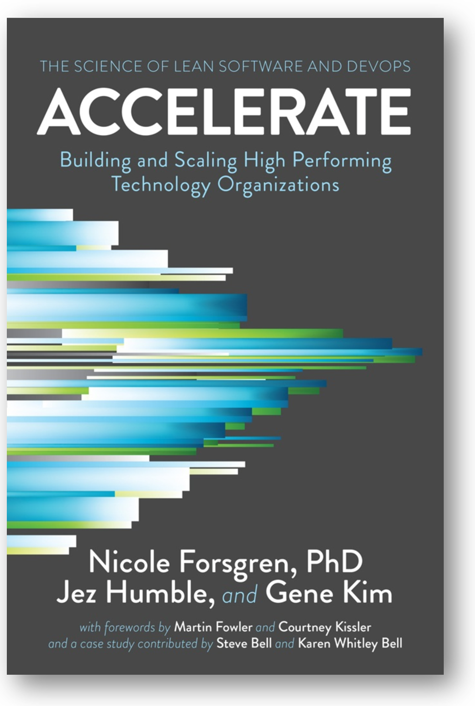
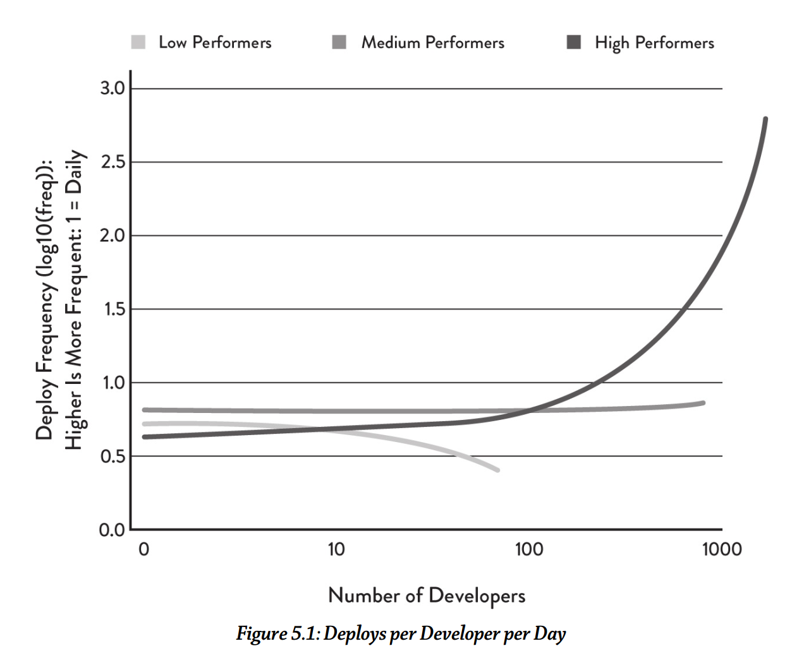
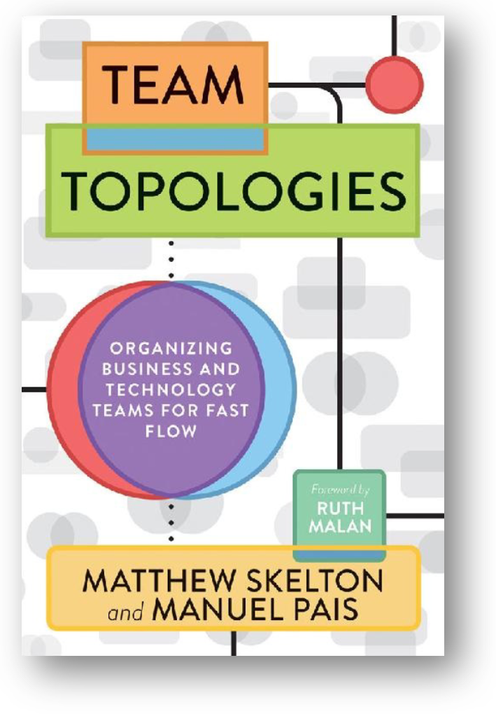

# Системный менеджмент и разработка

Очень трудно разделить сам инженерный процесс (инженерию целевой системы) и процесс создания систем графа создателей (инженерия графа создателей, это обычно организации). Чаще всего упоминается, что «команда сама организует свою работу». Команда тут рассматривается как оргзвено, и само высказывание требует уточнения — как же команда выступает в роли инженера целевой системы и менеджера-организатора по отношению к самой себе? Тут нельзя обойтись без ролевого рассмотрения: один и тот же конструктив (команда как оргзвено) выступает в двух разных ролях, и отдельные члены команды просто в разное логическое время (время инженерии, время менеджмента) играют разные роли.

Когда команда обсуждает организацию/создание себя как системы, то агенты-люди в ней выступают в других ролях: ролях создателей организации, то есть инженеров предприятия, менеджеров-организаторов. Люди, создающие и развивающие своё оргзвено (отдел, рабочую группу проекта, предприятие) как инженера-создателя целевой системы, тоже выполняют методы системной инженерии, но для организации как одного из участников графа создателей целевой системы. То, что там целый граф создателей, важно: и саму командуоргзвено разработчиков как «создателей себя» тоже ктото создал, и после создания команды с её создателями будет отношение надзора (там ведь тоже monitoring, continuous development, continuous delivery таких команд), чтобы команда продолжала выполнять своё назначение, ради которого она была создана, а не ушла в автономное плавание со своими собственными целями и перестала заниматься разработкой для достижения и поддержания успешности системы!

Так, команда разработчиков, предоставленная сама себе, обязательно хочет расти не только в мастерстве, но прежде всего в числе членов команды. Любой агент, в том числе коллективный, хочет расти и размножаться, убирая неприятные сюрпризы со своего пути — это же эволюция! Но есть внешне задаваемые довольно контринтуитивные пределы роста. В принципе, архитектура самых разных систем похожа, она борется всяко с проявлениями в разных системах уже упомянутого закона Амдала: весь прирост производительности от увеличения числа работников съедается увеличенным временем координации между ними. Скажем, если у вас близится сдача, то добавление сотрудников только отдалит срок сдачи: время уйдёт не только на то, чтобы ввести новичков (даже одного новичка!) в курс дела, потом исправить неизбежные новичковые ошибки, но и на сначала налаживание, а затем поддержание коммуникации внутри увеличившейся команды.

Более того, эксперименты показывают[^r8-1], что **оптимальный размер команды оказывается неожиданно маленьким: он ближе к пяти участникам команды, чем к двадцати.** В софтверном проекте команды и из 5, и из 20 человек пишут 100 тысяч строк кода примерно за девять месяцев. При этом команда из 20 человек справляется всего на неделю раньше, чем команда из 5 человек, но ошибок делает в пять раз больше. Это как раз следствие сложной коммуникации, которая по закону Конвея проходит по поводу разных частей программы не в одном мозге, а через разные мозги, а по закону Амдаля она ещё и съедает производительность многих вычислителей на координацию между ними.

Нарезка системы на крупные модули со слабой связанностью и большой сплочённостью, предписание интерфейсов для связи между ними делается архитекторами системы, которые явно учитывают необходимость обратного манёвра Конвея — подчиняют структуру коллектива из нескольких команд разработчиков структуре разрабатываемой системы. По факту совместно работают две команды архитекторов (возможно, каждая из одного человека или даже AI-агента, или даже это обе команды из одного человека, поскольку речь идёт о ролях):

* Команда **архитекторов целевой системы** задаёт целевой создаваемый и развиваемый модуль для каждой команды, специализирующейся на какой-то предметной области, и именно это первично (помним, что целевая система оптимально нарезается на модули, а уж какие там будут команды — это будет второй вопрос, там будет применён обратный манёвр Конвея, да ещё и само разбиение на модули будет меняться по ходу проекта). При этом целью будет максимально точно определить bounded context в части проектных описаний/design и domain в части выделенной части мира, для которого будет разрабатываться командой их часть системы. Конечно, архитекторы целевой системы принимают ещё и множество других архитектурных решений, целью которых является достижение всеми разработчиками разных команд в целом (коллективом разработчиков) приемлемых значений архитектурных характеристик. Эти решения команды архитекторов могут меняться. Мы тут специально пишем «команда архитекторов», хотя в целом в руководстве говорим только о роли архитектора: напоминаем, что роль всегда кто-то исполняет — и это вполне может быть целая команда в большом проекте.
* Команда **архитекторов предприятия** делает архитектуру организации, задающую нарезку всего предприятия::оргзвено::модуль на максимально автономные (чтобы получилась архитектура со слабой связанностью/зацеплением, loosely coupled architecture) команды::оргзвено::модуль/конструктив. Делает это команда, ориентируясь на (непрерывно меняющиеся!) решения архитекторов целевой системы (не систему делят на части, удобно раскладываемые по уже существующим командам, а коллектив делят на более-менее автономные/независимые команды, занимающиеся определёнными частями целевой системы — в этом суть обратного манёвра Конвея). Внимание архитекторов предприятия направлено на конструкцию организации. Способ деления коллектива предприятия на команды как орг-модули и способ связи между командами коллектива как модулями задают важные организационные свойства (архитектурные характеристики предприятия): высокая производительность предприятия в целом, масштабируемость предприятия в целом, возможность быстрого изменения структуры предприятия в целом (evolvability).

Тем самым модули целевой системы намеренно делаются максимально автономными, целевая система начинает напоминать систему систем (SoS), где команды владеют отдельными автономными модулями в окружении других модулей. Такие системы систем оказываются сложней устроены, их трудней понять, трудней координировать их развитие, но они лучше адаптируются к быстро меняющимся условиям окружения, лучше масштабируются, быстрее создаются, ибо команды не задерживают друг друга в бесконечных согласованиях: по одному модулю принимает решение каждая команда самостоятельно, а не собираются для этого несколько команд. Кроме того, помним, что в слабо связанных модулях ошибки одних модулей не мешают другим модулям работать, а в сильносвязанных — мешают. Это относится и к разрабатываемым системам, и системам из их графов создателей.

Основные принципы современных концепций предприятия и архитектурных решений для предприятий и их команд, как всегда, можно подсмотреть в литературе по организации программных разработок, есть множество фреймворков для поддержки scaled agile (гибкой разработки, выходящей за рамки одной команды): SAFe (Scaled Agile Framework)[^r8-2], LeSS (Large-Scale Scrum)[^r8-3], DaD (Disciplined Agile Delivery)[^r8-4], Scrum@Scale[^r8-5], Scrum Nexus[^r8-6], Spotify Model[^r8-7], и другие. Но помним о том, что речь идёт о безмасштабных принципах, которые приложимы для систем практически любой природы. Требуется время, чтобы принципы разработки, масштабируемой с одной команды на множество команд, были адаптированы не только к программной инженерии. И часто каждый подход будет излагаться в какой-то своей терминологии, так что без понимания устройства разделения труда по инженерным ролям и причин такого разделения труда в этих фреймворках будет трудно разбираться. Но после понимания (хотя бы в объёме нашего небольшого кругозорного руководства) — это будет не слишком сложное чтиво.

Ещё раз, чтобы подчеркнуть мысль: **системная инженерия — это метод ведения инженерной работы для всех систем в графе создателей. Принципы её, конечно, адаптируются для каждой отдельной предметной области, но применяются ко всем системам-создателям из их графа. Если вы создаёте целевую систему нового типа (хоть бактерию, хоть мастерство, хоть программную систему, хоть сообщество, хоть страну),** **для которой приходится создать инструмент и систему автоматизации проектирования, а также организовать множество команд для создания всего этого, вы будете применять одни и те же принципы.**

В рамках проекта и создание целевой системы, и создание инструментария, и создание команд, и маркетинг как создание сообщества лояльных клиентов — это всё инженерная деятельность. Обсуждаются все эти вопросы вместе, с использованием одних и тех же принципов, одних и тех же идей — в том числе таких, как закон Конвея и обратный манёвр Конвея.

Это означает, что многие вопросы нельзя вот так прямо разделить на «вот это разработка, пусть думают прикладные инженеры-технари/domain engineers и их системные инженеры-архитекторы/system architects», «вот это менеджерский вопрос организации разработок, пусть думают менеджеры/managers и их ответственные за развитие как инженеры предприятия/enterprise и архитекторы предприятия». Нет, **инженеры должны разбираться в менеджменте, а менеджеры—** **в инженериицелевой системы, и они просто обязаны договориться (договорить всех вокруг себя).**

Вопросы создания команд разработчиков (их будет много для одной системы!), создания коллектива разработчиков как «команды команд плюс их организатор, архитектор и визионер, а также инженер платформы» для системы в целом, а также вопросы разработки самой системы в целом и отдельных частей и «фич» системы, которые выполняют отдельные команды — они более чем тесно связаны. Принципы этой связи нужно знать и инженерам, и менеджерам при всей разнице природы их систем (тех типов систем, которыми они непосредственно занимаются).

Книги, которые мы рекомендуем, это не чисто «книги по менеджменту» с их вечным обсуждением «авторитарного стиля менеджмента» или чего-то подобного «про людей в организациях». Нет, это книги по инженерии как таковой, с учётом графа создателей: нужно создать множество самых разных систем, чтобы на выходе всех путей по этому графу получилась целевая система.

Как и другие книги, обложки которых мы приводим в нашем руководстве, эти книги обязательны к прочтению, если вы занимаетесь разработкой хоть чего-нибудь профессионально. И вам надо самостоятельно адаптировать материал этих книг к условиям вашего проекта — выживут при этом принципы из книг, но не детали. Методы работы из одних проектов не приложимы к другим проектам без изменений, их необходимо пересобрать. Это может быть не очень просто даже для разработки софта, ибо не весь софт сводится к разработке корпоративных информационных систем. Например, системы AI разрабатываются немного по-другому — но по тем же принципам организации коллективной работы и командной работы.

Подробно самые разные аспекты работы в современной разработке софта описаны в книге Accelerate (2017)[^r8-8], и опять предупреждаем: читать это нужно как описание методов разработки систем самой разной природы:

В книге приводится довольно много контринтуитивных принципов организации современной инженерной разработки, которые подтверждаются результатами исследований, evidence-based. Вот, например, один из графиков в этой книге:

Он показывает, что в высокопроизводительных организациях (на графике — high performers) при росте числа разработчиков число завершённых частей системы, готовых для сборки (deploys, включение в состав готовой системы) растёт линейно, или даже более чем линейно — за счёт всех этих методов принятия архитектурных решений, принятия решений операционного менеджмента по ограничению размера единицы выполняемой работы (small batch size, «малый размер обрабатываемой партии») и т.д. В организациях умеренной производительности скорость от добавления разработчиков остаётся примерно одинаковой. А вот в организациях низкопроизводительных (в книге показывается, что они не используют современный гибкий инженерный процесс, а придерживаются старинного «водопада») с добавлением людей в команду производительность быстро падает: они не могут решить проблемы работы «команды команд» («бригады бригад», коллектива проекта в целом).

Так что классическим (прикладным, самым разным по специальностям) инженерам, оказывается, надо знать и менеджмент как прикладную инженерию организаций: это необходимо для организации собственного инженерного труда. Менеджмент оказывается общей дисциплиной для всех видов инженерии, ибо вся инженерия выполняется организациями!

Менеджмент в инженерии — как «общее фортепиано» в музыкальных училищах и консерваториях. На каком бы инструменте (скрипке, трубе, органе, вокале) ты ни специализировался, тебе всё равно нужно уметь играть на фортепиано, потому что знание фортепиано в силу специфики этого инструмента существенно поднимает понимание теории музыки, развивает музыкальный слух и ритмику — и этот прирост музыкального мастерства оказывается переносим на игру на «родном» инструменте. Мультиинструменталисты играют на своём «родном» инструменте лучше, чем моноинструменталисты!

Так и в инженерии: на какой бы ты инженерии не специализировался, тебе всё равно нужно уметь разобраться с организацией работы команды разработчиков, а также тем, как и почему из команд разработчиков собирается полная организация. Можно добавить ещё оснований:

* Организация — это пример системы, разобраться с менеджментом как инженерией организации вам поможет общность принципов системной инженерии для систем разной природы, будет проще задействовать рациональное системное мышление.
* Организация как система вам встретится в любом проекте, вам как инженеру всегда придётся договаривать людей и AI вокруг себя, то есть организовывать людей и AI в проекте вокруг вас и вашей работы. Ну, или мириться с тем, что кто угодно будет организовывать вас, а вы будете виноваты в любых недопониманиях.
* Надо уметь говорить с менеджерами на их языке, а также понимать, каковы их интересы. Если вы не предъявите причинно-следственную цепочку от вашей работы к увеличению скорости выпуска целевой системы, менеджер вас даже слушать не будет — и это будет не его вина, а ваша вина. Вы же не заказываете в пиццерии босоножки? Вот и с менеджером надо говорить не на инженерные темы, а на менеджерские — но для этого надо разбираться в менеджменте.
* Если вы будете расти как инженер, то это будет означать рост сложности и масштаба ваших проектов. В более сложных и масштабных проектах участвует больше людей. С какого-то момента вы обнаружите, что общения с другими людьми у вас больше, чем общения с моделерами вашей системы. Но как инженер вы профи, а в организации людей на выполнение сложной инженерной работы — любитель. Перестаньте быть любителем, учитесь менеджменту. Но в этом обучении существенно поможет то, что вы будете относиться к менеджменту как инженерии организации: это будет не изучение нового предмета с полного нуля, а просто некоторое обновление ваших профессиональных инженерных знаний.

Примерно такие же аргументы можно привести по необходимости освоения работы инженерии личности по нашему руководству, посвящённому инженерии людей и AI-агентов как обучению их новым методам работы (новым способам поведения):

* Личность — это пример системы, разобраться с инженерией личности вам поможет общность принципов системной инженерии для систем разной природы, будет проще задействовать рациональное системное мышление.
* Личность как система вам встретится в любом проекте, вам как инженеру всегда придётся договаривать людей и AI вокруг себя, для чего неплохо бы представлять, как менять людей и AI (учить их чему-то новому, что вы знаете, а они — нет). Если нет — придётся мириться, что вы всегда будете в чьих-то планах, а не кто-то в ваших планах.
* Надо уметь говорить с людьми так, чтобы был шанс изменить их поведение, понимать границы возможного. Так же, как вы не стремитесь всё бросить и начать выполнять советы первого встречного (не стремитесь поменять своё поведение по чьей-то указке), так и другие люди тоже не стремятся выполнять ваши советы. Как же тогда договариваться? Как говорить с каждым человеком на его языке, как преодолевать большие понятийные расстояния?[^r8-9]
* Первый же человек, с кем вы встретитесь во всё более и более сложных проектах — это вы сам. Можете ли вы себя развить, чтобы калибр/масштаб вашей личности был соразмерен выросшему масштабу проекта? Можете ли вы себя научить, или с этим проблемы? Как преодолеть эти проблемы? В этом обучении существенно поможет то, что вы будете относиться к обучению как инженерии личности: это будет не изучение нового предмета с полного нуля, а просто некоторое обновление ваших профессиональных инженерных знаний.

Вот ещё одна книга, «Team Topologies» (2019) которая касается организации труда разработчиков, и тоже увязывает инженерию команды как части всей организации и прикладную инженерию целевой системы:

Книга кажется «всеохватной», но нет: она касается главным образом одного аспекта, а именно командной организационной структуры, которая влияет на производительность, то есть ускоряющей поток (работ, информации. «Поток»/flow — это общий термин для операционного менеджмента как «эксплуатационной инженерии» организации, отсылающий к логистической парадигме и lean management). Всё изложение в книге крутится вокруг архитектуры, закона Конвея и принципов рационального управления потоком, больше известных как lean.

Книга «Team Topologies» не закрывает всех аспектов, которые нужны для успешных инженерных проектов. Скажем, предыдущая книга («Accelerate») говорит о важности организационной культуры (предоставление автономии командам, свобода разговора о проблемах, общий подход к обучению на ошибках, а не обвинению в ошибках), а в «Team Topologies» этот вопрос практически не затрагивается, книжка очень компактная. Практически не рассматриваются и методы самой инженерии (сначала пишем тесты, а потом проект системы, или наоборот? Пытаемся найти «единственную исходную причину» для каждой проблемы, или нет?), не рассматриваются вопросы финансирования, вопросы бизнес-стратегии (зачем вообще возиться с созданием и поддержкой команд?!).

Объяснительная теория потока и методов lean второго поколения (то есть для разработки, а не для машиностроительных заводов) собрана в книжке 2011 года «The Principles of Product Development»:

Это всё вариации подхода Lean, который появился ещё в 1988 году, но для физических потоков заготовок в машиностроении. Эти принципы были осмыслены как принципы управления очередями (очереди — это плохо, это затор на пути потока продуктов к покупателям, и одновременно это затор на пути встречного потока денег от покупателей через производителя к источникам сырья, то есть другим производителям). И эти принципы управления очередями были взяты из самых разных других дисциплин.

Эту линию рассуждений про «поток» развивает метод «TameFlow», с которым вы уже знакомились в руководстве по рациональной работе.

TameFlow своими предметами имеет одновременно четыре потока (работ, денег, информации и психологический/well-being)[^r8-10]. Авторы этого подхода уделяют довольно много внимания тому, как добиться того, чтобы разработчики не только быстро работали (и тут им помогают хорошо известные принципы теории ограничений Голдратта, мы не касаемся их в нашем руководстве, поскольку выяснилось, что все наши инженеры-менеджеры хорошо с ними знакомы), но и были счастливы в этой работе, отсюда много внимания работе с людьми, а не только с методами собственно разработки. «The Principles of Product Development» затрагивает теорию: как именно принимать решения по организации работ, основываясь на принципах экономики, как разумно задействовать оптимальные (не лишние и не недостаточные) ресурсы для выполнения работ.

Более подробно, как организовывать инженерную работу, рассказывается в руководстве по системному менеджменту.

[^r8-1]: <https://www.qsm.com/risk_02.html>

[^r8-2]: <https://framework.scaledagile.com/>

[^r8-3]: <https://less.works/>

[^r8-4]: <https://www.pmi.org/disciplined-agile/>

[^r8-5]: <https://www.scrumatscale.com/>

[^r8-6]: <https://www.scrum.org/resources/nexus-guide>

[^r8-7]: <https://www.atlassian.com/agile/agile-at-scale/spotify>

[^r8-8]: Есть русский перевод, <https://www.litres.ru/dzhez-hambl/uskoryaysya-nauka-devops/>, но мы рекомендуем всё-таки читать оригинал

[^r8-9]: <https://lesswrong.ru/w/Ожидая_короткие_понятийные_расстояния>

[^r8-10]: <https://tameflow.com/>
