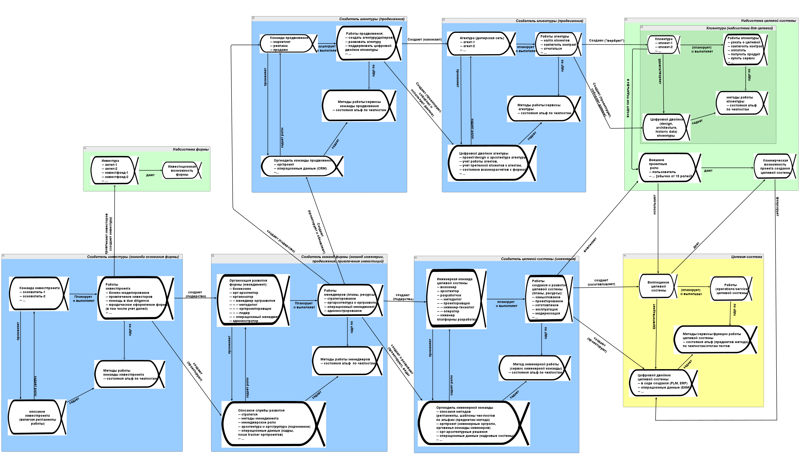
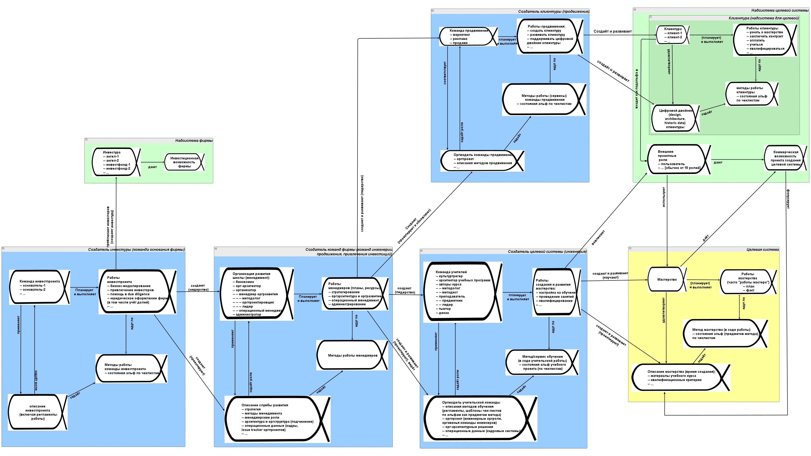

# Прикладная инженерия как специализация системной инженерии

Системная инженерия — это нормативная («как надо делать», деонтическая модальность, описание лучших практик) версия методологии. Методология говорит о том, как думать о методе работы. Системная инженерия рассказывает в общем виде о лучших практиках/методах создания успешных систем, изменения мира к лучшему. А что с «не лучшими практиками», например, методами поэтапной инженерии («водопад»)? Ими пользоваться нерационально, поэтому надо следовать текущим методам работы эволюционной системной инженерии. И тут мало не перепутать, что уже не лучший метод работы, а что уже не «эксперименты с неясным и непроверенным результатом», а лучший метод. Ещё надо эти лучшие методы работы конкретизировать/специализировать по шкале охвата систем разной природы:

* всем системам (безмасштабная системная инженерия, «инженерия вообще»),
* системам какого-то одного сорта (авиационная инженерия, генная инженерия, добыча полезных ископаемых),
* какой-то одной системе (мастерство выращивания бананов в средней полосе, робот-кардиохирург, служба продвижения электровозов на международных рынках).

**1.** **Отсутствие специализации:** **безмасштабнаяэволюционная** **системная** **инженерия**

Наше руководство как раз наставляет системноинженерной работе в самом её общем виде. Оно приложимо к инженерному процессу для всех видов создаваемых систем и описывает разложение инженерного метода на составляющие, которые исполняются типовыми инженерными ролями (иногда говорят «ролями инженеров») в рамках типового разделения труда, да ещё и с учётом графа создателей — с учётом того, что в инженерном проекте по созданию и развитию какой-то системы будут участвовать и менеджеры, и продвиженцы, и много кто ещё.

Если вы хотите проложить трамвайный маршрут по городу, вашей команде придётся учитывать и общественное мнение, и особенности городского планирования и налаживания пассажиропотока, и особенности электротранспорта и его технической инфраструктуры, и особенности вагонного парка, включая отслеживание трендов по беспилотному транспорту (включая особенности беспилотности рельсового транспорта, который не может «уклониться» от внезапно появившегося сбоку препятствия). Команда будет адаптировать модель графа создателей, взяв его из руководства по методологии. Вот эта модель в самом общем виде (но помним, что надо работать с этой моделью в форме таблиц, а не диаграммы, и обязательно надо будет её адаптировать)[^r8-1]:

Даже такое общее представление о проекте изменения мира к лучшему позволяет точнее стратегировать (выбирать, над чем и как будет работать проект — в том числе с изменениями стратегии «на лету» в agile-проектах), планировать (включая динамическое планирование в case management), а также выполнять работы в многомасштабном коллективном инженерном проекте. Многомасштабность, а не безмасштабность вашего проекта — это признание того факта, что вам не удастся охватить своим проектом улучшение мира, описываемо одинаково на всех возможных масштабах, придётся ограничиться многими существенно различающимися в своих описаниях масштабами из всех эволюционных. Но не одним!

И даже из такого очень недетального рассмотрения можно найти много интересного. Скажем, команда развития создаёт и инженерную службу, и службу продвижения — но и службу IR (investor relations), которая занимается инвестурой — хотя вроде бы это прерогатива основателей фирмы. Как поделены работы и методы работы с инвестурой между основателями и командой, занимающейся инвестурой, которую создают организаторы, созданные основателями? В каждой фирме, конечно, этот вопрос будет решён по-разному.

Конечно, в современных инженерных проектах эта диаграмма отражает непрерывную/эволюционную работу над всеми её системами — и целевой системой, и инженерной командой, и так по всей диаграмме. Те, кто придерживаются идеи «водопада» (верят, что они заняты разработкой конечной версии системы — работают-то они не так, но верят в несбыточное), обнаруживают, что каждая система (и целевая, и инженерная команда, и клиентура, и команда продвижения, и даже команда основания фирмы) надолго застревают в состоянии воплощения на «80% сделано», и каждый день там будет что-то доделываться новое и что-то удаляться из уже не нужного, а ещё рекомендуемый норматив времени на работу с так называемым «техническим долгом»[^r8-2] — 20%, так что в любой момент времени оказывается, что готово только 80%, а ещё 20% нужно «отдать должок», и так может происходить годами.

В жизни часто всё ещё менее однократно: представьте себе, что вы готовите круглосуточный шведский стол в курортном пансионате, причём не только подачу в этом стиле[^r8-3], но вместе с работой кухни, «под ключ». Ни в один момент времени вы не можете сказать, что закончили работу: что-то подъели, и нужно приготовить дополнительную порцию, что-то, наоборот, испортилось несъеденное, и нужно убрать. А ещё нужно планировать сезонную смену меню, отвечать на жалобы тех, у кого болит живот (ни у кого не болит, а вот у этого одного заболел — и он сразу публично пожаловался на качество еды!) и кто нашёл жучка в тарелке (никто не нашёл, а вот этот один нашёл — и выложил фото в соцсетях!) и следить, чтобы не уносили слишком много еды с собой. Это явно не описывается движением кейса «шведский стол» к однократной приёмке-сдаче целевой системы. Закрытие кейса, прекращение работы — это будет как раз неуспех!

Трудно представить, но операционная система Windows — это примерно такой же проект, как «шведский стол», идёт эволюционная разработка. И к этой модели стремится огромное число других систем. Так, ракеты SpaceX планируется выпускать одну штуку каждые 72 часа, но это не штамповка одной и той же ракеты — нет, каждая ракета отличается новыми доработками. Автомобили Tesla каждый проходит уникальный путь на заводе, ибо непрерывно эволюционирует не только сам автомобиль, но и завод, выпускающий эти автомобили[^r8-4].

Даже если вы делаете революцию в обществе, это тоже будет только «открыть двери изначально накрытого шведского стола», а потом этот кейс нельзя будет считать закрытым, закрыть после этого двери — это неуспех проекта, аварийная ситуация.

Можно, конечно, обсуждать по такой диаграмме (но лучше бы не диаграмме, а набору таблиц) какой-то конкретный релиз, какую-то конкретную версию системы, выпуск инкремента. Кто-то что-то захотел изменить в системе, это предложили, описали, спроектировали, воплотили в жизнь, ввели в эксплуатацию — но не факт, что и тут не было небольшой эволюции, множества вариантов этого «чего-то». То есть в случае шведского стола это «давайте заменим крем в эклерах, будет и вкуснее, и дешевле, и готовить его быстрее». Lead time тут будет от появления этой идеи до момента, когда первый клиент откусит эклер с новым кремом, только в этот момент «ввели новую фичу в эксплуатацию». Но назавтра начнут улучшать и переделывать этот вчера ещё «новый» рецепт крема, а ещё начнут улучшать рабочий процесс его приготовления. В современной эволюционной инженерии нет однократных разработок — это сейчас очень редкое исключение.

И это мы рассматриваем «инженерию вообще», системы самой разной природы, без какой-то специализации. Мы ещё много раз вернёмся к этой идее шведского стола как современной метафоре разработки. Знакомиться с системной инженерией на уровне кругозора, как в нашем руководстве, на уровне мета-мета-модели как раз и нужно для того, чтобы вы понимали одинаковость инженерии шведского стола, инженерии ракет, инженерии корпоративного софта, генной инженерии, инженерии сообществ. В каждом проекте нужно не только «всё сделать», но и много раз переделать, пополнить, проследить, чтобы не было просрочено, подавать по-разному разные части (как в шведском столе — что-то доохладить, что-то держать горячим), а ещё нужно сделать так, чтобы всем желающим хватило, чтобы не нужно было долго ждать, и затем ещё быстро убрать объедки, не забывая при этом про улучшение раскладки и найм персонала. Это и есть современная инженерия, нацеленная на непрерывный ввод в эксплуатацию, continuous delivery, а сейчас уже понятно, что это эволюционная системная инженерия:

**2.** **Специализации инженериидля** **одного вида** **систем: прикладная инженерия.**

В многомасштабном проекте, тем не менее, на каждом системном уровне нужно каким-то образом вести свой локальный проект создания успешной системы, использующий методы системной инженерии с их особенностями для систем разной природы. Воплощение системы оказывается или инертным веществом, или киберфизической системой (или её частью, например, компьютерным софтом), или личностью (или её частью, например, мастерством), или организованной группой людей (организацией или её частью, например, департаментом, или даже сообществом), и так далее.

Методы безмасштабной эволюционной системной инженерии при этом уточняются, дополняются, описываются уже не на самом абстрактном, **фундаментальном** уровне мета-мета-модели, а на **прикладном** уровне — уровне модели предметной области, метаУ-модели. Прикладная инженерия какой-то предметной области продолжает оставаться эволюционной, но нельзя уже сказать, что она «безмасштабная», ибо системы конкретных предметных областей (рубашки, филиалы крупного холдинга, мастерство, небоскрёбы, клиентуры) всё-таки имеют какие-то масштабы и конкретизированные методы будут привязаны к этим масштабам.

Так, классическая «железная» системная инженерия — это (прикладная) инженерия киберфизических систем, развивавшаяся главным образом на примере программно-аппаратных комплексов (компьютеры и операционные системы, «прикладной софт»/приложения тут обычно не рассматривают), аэрокосмических систем (гражданская и военная авиация и ракетная техника) и других транспортных систем (автомобили, поезда, военный транспорт). Или программная/software инженерия, занимающаяся информационными системами как компьютерными программами (без включения аппаратуры в программно-аппаратном комплексе, но с включением приложений). Или инженерия предприятия, часто понимаемая как менеджмент (с операционным менеджментом как аналогом эксплуатационной инженерии).

Все эти отдельные виды инженерии имеют свою специфику, свои регламенты/руководства/учебники/стандарты, но все следуют одному и тому же чуть более абстрактному образцу/нормативу инженерного процесса, взятому из безмасштабной эволюционной системной инженерии. Хотя исторически было ровно наоборот: это безмасштабная эволюционная системная инженерия была сформулирована главным образом на базе инженерии киберфизических систем, когда пришлось включать в эту инженерию людей, заниматься системноинженерным менеджментом и поэтому описывать инженерный процесс в его наиболее общем виде, на уровне абстракции мета-мета-модели. Но потом эти общие безмасштабные идеи из *системной инженерии/systemsengineering* пошли в самые разные прикладные *инженерии систем/engineeringofsystems*.

Скажем, если взять инженерию личности, как прикладную инженерию мастерства (подробней будет в руководстве по инженерии личности), то можно представить себе модификацию диаграммы графа создателей[^r8-5]:

В этой схеме уже не абстрактное «воплощение системы», а конкретизированное «мастерство», не абстрактная «организация проекта», а «команда учителей», не просто «описание системы», а «описание мастерства». Если посмотреть на команду учителей, то тоже видно — поменялись названия ролей из общих на роли, специфичные для проекта создания мастерства. В ходе адаптации для прикладной инженерии также убрали агентуру, хотя в каких-то проектах привлечения клиентуры в учебных проектах она и может быть. Тут убрали агентуру главным образом для того, чтобы показать, что исходная диаграмма графа создателей — не догма, её вполне можно менять в ходе конкретизации абстрактных фундаментальных описаний в какие-то прикладные, учитывающие предметную область инженерного проекта.

Проект создания и развития мастерства может быть частью какого-то другого проекта, например, это может быть частью проекта создания и развития предприятия, будут учить мастерству сотрудников (например, работе на новом типе станков). Тогда надо будет увязать общий проект и этот прикладной проект, рассмотреть графы создателей и предприятия в целом, и мастерства сотрудников этого предприятия. Эту увязку проектов, рассмотрение общего графа создателей удобно делать на языке системной инженерии, общем для всех проектов создания чего бы то ни было.

Для такого сорта систем как мастерство, даже если принять «инженерный подход к делу», а не «педагогический» или какой-нибудь менее определённый «культурных изменений» или чего-то более размытого в плане указания на цели и способы работы, есть много особенностей. Чтобы научиться прикладной инженерии, нужно освоить не просто общее мышление инженера, но методы обучения, которые даже называться будут традиционно «обучение», а не «инженерия». Обучение, в свою очередь, как метод создания и развития мастерства, будет разложено на множество разных составляющих методов. Это метод культуртрегерства как создания концепции использования мастерства в его «личностном окружении» (начало разработки — старт проекта, роль культуртрегера тут чаще всего будет выполняться человеком на должности product-manager, не путаем роли и должности), методы методологии и методики как разработки проекта мастерства и проекта его создания (это будет называться «материалы учебного курса»), методы преподавания как одни из составляющих методов работы деканата (в инженерии это работа инженеров внутренней платформы разработки и самой внутренней платформы разработки — изготовление и проверка частей, сборка из частей и проверка целого, введение в эксплуатацию — вынос в жизнь, в нашем случае это всё будет про мастерство), методы мастерского выполнения деятельности как эксплуатация мастерства. И это не разовое прохождение жизненного цикла: в современной инженерии личности как эволюционной инженерии нужно ещё и обновлять мастерство в уже выученных агентах-мастерах, как сейчас обновляют прошивки телефонов в давно изготовленных телефонах. Называться это, конечно, будет «обучение», но все рассуждения про современное обучение надо проводить так же, как про инженерию — современное обучение будет эволюционным/непрерывным (но масштабным, масштабы личности и мастерства).

Эта адаптация методов системной инженерии для самых разных её приложений к целевым системам самой разной природы, самых разных видов, происходит для всех масштабов систем самой разной природы. Концепция использования, инженерные обоснования (все с разными названиями, конечно) будут нужны и для театральной постановки, и для ледокола, и даже для парламента. Их необходимость обсуждается в системной инженерии, но в своих предметных областях они все называться будут по-разному, и разрабатываться по-разному, разными методами. Про методы их разработки будет говориться в прикладных «инженерных» курсах/руководствах/регламентах/стандартах. Слово «инженерный» тут в кавычках, чтобы напомнить: не все эти инженеры будут соглашаться на то, что они будут называться именно «инженерами». Но мы в нашем руководстве по системной инженерии будем их называть именно так, ибо они как раз будут те, кто меняет мир к лучшему, кто создаёт и развивает успешные системы.

По каждой такой конкретизации/адаптации, в каждом приложении системной инженерии к какому-то виду целевых систем нужно владеть прикладным методом инженерии, часто называемой «инженерия таких-то систем» в случае уровней косного вещества и киберфизических систем (например, инженерия систем управления, control systems engineering, и помним, что systems engineering отличается от engineering of systems[^r8-6]) и уж совсем по-разному в случае более высоких системных уровней. Например, обучение мастерству (включая проектирование этого мастерства и проектирование метода его создания) является именно конкретизацией/адаптацией системной инженерии.

**3.** **Уровень специализации инженерии** **конкретной системы**

Даже при том, что безмасштабная и непрерывная системная инженерия конкретизируется для какой-то прикладной инженерии систем определённого масштаба и вида (авиация, образование, медицина, фермерство, госполитика), для каждого конкретного проекта будет ещё одно уточнение для того конкретного типа системы, который будет создаваться и затем развиваться в единичном экземпляре или выпускаться серийно (включая особенности разных провайдеров сервиса) — уточнение для конкретного типа системы, моделирование на уровне метаС-модели, модели конкретной ситуации. Так, легко представить себе, что конкретизации инженерии мастерства для мастерства системного фитнеса, мастерства игры на фортепиано, мастерства решать дифференциальные уравнения при помощи программ компьютерной алгебры и численных методов, общего мастерства безмасштабной эволюционной системной инженерии (наше кругозорное руководство как раз про это) будут совсем разными для конкретных учебных проектов. И надо ещё будет уточнить, что слово «учебный» тоже не всегда присутствует, ибо стажировка обычно рассматривается как рабочий проект, а не учебный — при этом учебный характер стажировки не отрицается, но термин «обучение» не используется. Мы в наших руководствах тоже предпочитаем термин «освоение работы» вместо термина «обучение».

Скажем, игра на фортепиано — это метод, задействующий мышцы. По факту эта игра может быть надстроена над мастерством системного фитнеса, но не только — в это мастерство входит как минимум ритмика, которой нет в системном фитнесе и можно ещё обсуждать промежуточный метод музицирования, который неразличим для вокала, игры на фортепиано и игры на скрипке, и учёт всех этих особенностей даст совсем разные методы игры на фортепиано, которые по-разному могут преподаваться в музыкальных школах, но неизбежно при их практиковании в течение долгого времени приведут к более-менее похожим результатам (игра на любительском уровне станет профессиональной). Помним про неустроенности и эволюцию: есть множество выживающих почти одинаковых вариантов оптимизаций для межуровневых конфликтов (и это разнообразие для эволюции важно), а резкие улучшения довольно редки. Это означает, что есть множество самых разных вариантов «инженерии музыки на инструментальной базе фортепиано», они дают все примерно одни и те же результаты, плохие варианты рыночно вымрут, а улучшения будут, но крайне редки. Скажем, улучшение типа игры на клавишном синтезаторе, или магнитофон, а затем и плеер, который позволяет не играть пьесу каждый раз, а просто воспроизводить записанное, но затем музыкальные сервисы искусственного интеллекта, которые могут уже не воспроизводить пьесу, а сочинять её и воспроизводить вообще без фортепиано и людей. И ещё роботы, которые будут проигрывать пьесу на старинном фортепиано, но там не будет человеческой мышечной работы, а ещё есть моторизированные фортепиано, которые сами-себе-роботы. Эволюция методов происходит постоянно, а с ней и эволюция инструментария для этих методов. Соответственно, меняется и прикладная инженерия.

Если какая-то команда занялась инженерией какого-то вида систем, то она будет развивать этот вид систем, подстраивая варианты целевой системы под изменения окружения и используя всё новые появляющиеся альтернативы по концепции системы как способы реализации функций какими-то интересными новыми конструктивными элементами. А ещё команда будет развивать себя, будет менять методы инженерии (и свой состав: часто новые методы — это и новые люди, новый инструментарий), равно как и методы/функции работы своей целевой системы.

На этом уровне специализации инженерии конкретной системы можно использовать или граф создателей, отмоделированный для уровня метаУ-модели (предметная область какой-то инженерии «как в учебнике») с предыдущего уровня, или всё-таки конкретизировать метаУ-модель для создания конкретного вида развиваемой в проекте системы: киберфизической системы (авиалайнера или игрушечного самолёта), или предприятия (стартапа на пять человек или большого агропромышленного холдинга), мастерства (игры на фортепиано или операционного менеджмента, и ещё тут разница — на уровне хобби/кругозора, или на профессиональном уровне). Все эти уточнения потребуют адаптации графа создателей, детальности моделирования проекта, а ещё будут самые разные варианты разложения инженерного процесса для систем разной природы, всё это обсуждали в руководстве по методологии.

Количество уровней конкретизации системной инженерии как фундаментальной дисциплины до какой-то прикладной уникальной версии инженерного процесса (инженерного метода, способа разработки — помним, что тут множество имён) может быть и больше, чем наши примерные уровень мета-мета-модели (настоящее руководство как раз этого уровня), уровень метаУ-модели (например, конкретизация до предметной области системного менеджмента, руководство по системному менеджменту как раз такое), уровень метаС-модели (конкретизация для конкретного проекта конкретного предприятия, набор регламентов конкретного предприятия и культура прикладной инженерии в головах конкретных сотрудников этого предприятия определяют его прикладную инженерию, например, как конкретно происходит создание и выпуск электромобилей на заводах именно Tesla, но не «вообще в автомобильной промышленности мира»).

Если вы будете создавать «службу найма сотрудников», то её создание будет описываться ситуационной метаС-моделью (уровня стандарта предприятия), например, описанной в регламенте «Ведение организационных изменений», а для этой метаС-модели ведения организационных изменений ещё будет модель конкретной проектной ситуации с учётом экземпляров (операционным учётом проекта организационных изменений — какой-нибудь issue tracker, который учитывает состояние альф проекта организационных изменений, в данном случае организации службы найма сотрудников — то ли из вновь набранных людей, то ли это будет сдвиг части работы службы HR на какую-то AI-систему и служба будет «виртуальной», то ли это сдвиг найма на аутстаффинговую компанию и служба будет внешней, то ли это выделение части сотрудников из числа уже занимающихся HR в обособленное подразделение). На втором уровне конкретизации (культурная метаУ-модель, «как в учебниках», а не «как в регламентах») это будет предметная область «организационные изменения», методы там прописываются в учебниках менеджмента — причём часть методов по собственно организационным изменениям будет прописана в части по организационным изменениям, но будут и приёмы работы по организации именно найма сотрудников, это можно будет найти в части учебников менеджмента, описывающих методы HR в части найма сотрудников, а не в части, общей для организационных изменений. **Это общий принцип: искать методы обычно надо** **в разных местах—** **ибо граф создателей включает много разных работ.**

Скажем, вам надо выпускать тонкие стеклянные трубочки. Для этого вы читаете учебник по стеклянным трубочкам, там будут описаны не только сами трубочки (целевая система), но и как их делать (то есть описано создание этих трубочек, инженерный процесс, по факту описаны методы работы создателя стеклянных трубочек), причём аспекты работы создателя, связанные со стеклянными трубочками — какие станки, какие квалификации ожидаются у мастеров, какие рабочие операции они должны делать, но вряд ли там будут общие сведения о том, как организовывать людей, сведения об операционном менеджменте для производства стеклянных трубочек. А вот когда вы захотите реально организовать выпуск, то вам надо будет читать ещё учебник «как организовывать», ибо про создание создателей будет говориться там — менеджеры должны будут знать, как организовать производство (вообще производство, то есть как собрать и обучить каких-то людей, купить станки, наладить доставку сырья, и т.д.). Но общих знаний «как организовывать» тоже не хватит, надо пользоваться и знаниями из учебника по производству стеклянных трубочек. В учебнике по изготовлению стеклянных трубочек, может, и не скажут, откуда брать мастеров (где брать работников — это не специфическое знание прикладной инженерии), но уж точно расскажут, чему надо этих мастеров дообучить, чтобы ваши трубочки были качественные. А ещё что, кроме учебников? Обязательно посмотрите материалы компании-поставщика станка для производства стеклянных трубочек: наверняка там вы сможете найти не только про стеклянные трубочки и их станок, но и советы по организации труда на их станках.

И не путайте системные уровни (отношение часть-целое) и уровни абстракции (отношение принадлежности к классу, конкретизация как противоположное по направленности абстрагированию отношение как раз тут). А ещё тут отношение создания и развития в графе создателей (система-создатель создаёт и развивает создаваемую систему, это и не часть-целое, и не абстракция).

Такой подход многоуровневой конкретизации инженерного метода решает и традиционные проблемы классического подхода к инженерии как отдельной от менеджмента, и проблемы обучения как отдельного и от инженерии, и от менеджмента, и особость генетической инженерии, которая оказывается вообще ни на что не похожа, и особенности программной инженерии, и всех остальных инженерий.

В классической системной инженерии как инженерии сложных киберфизических систем обычно вынуждены описывать менеджмент проектов создания самолётов и подводных лодок как «системноинженерный менеджмент». Если понимать, что речь идёт об инженерии организации, которая будет заниматься созданием киберфизической системы, то это просто описание двух инженерных проектов в графе создателей: создание киберфизической системы (самолёта или подводной лодки — концепция использования и программа испытаний, архитектурные решения, и т.д.) и создания организации проекта (стратегия как концепция использования, то есть что будет делать организация, какие изменения к лучшему приносить в окружающий мир какими методами, архитектура организации/команды/коллектива/предприятия/«производственной кооперации» проекта, решения по концепции системы — какие оргзвенья будут какие рабочие процессы выполнять, и т.д.). Эти проекты существенно связаны. Детский сад устроен не так, как завод ракет. В частности, инженерия целевой системы и инженерия организации связаны через закон Конвея/Conway и обратный манёвр Конвея, подробности будут и в нашем руководстве по системной инженерии, и в руководстве по системному менеджменту.

А чему учить тогда системных инженеров, например, классических киберфизических систем? Учить тоже методам работы, взятым на разных уровнях абстракции:

* общей безмасштабной и непрерывной системной инженерии, это и есть предмет нашего руководства.
* затем инженерии киберфизических систем (кругозорный уровень предметной области для какого-то эволюционного уровня),
* затем конкретизации этой инженерии для самолётов (конкретная предметная область, и это будет весьма разная инженерия для одномоторного одноместного самолёта и авиалайнера на три сотни пассажиров — domain), и доводить это обучение до узкого метода, который используется в конкретном проекте (и тут говорят про ограниченную предметную область, предметы метода рассматриваются как bounded domain из DDD[^r8-7], и это сейчас мейнстрим, про domain-driven-design мы будем говорить подробней).
* и обязательно менеджменту, то есть организационной инженерии с конкретизацией для инженерных организаций в авиации.

При этом есть всегда надежда, что при знании общего подхода к инженерии (наставления нашего руководства, наиболее абстрактный подход к инженерии — уровень мета-мета-модели) обучение каким-то особенностям методов создания и развития какого-то класса систем не только займёт меньше времени, но и пригодится, когда будут происходить неизбежные события техноэволюции и будут меняться и методы создания, и сами создаваемые системы.

Эти события происходили, происходят и будут происходить, от них нельзя спрятаться, это эволюция. Скажем, когда самолёты вдруг будут заменяться или электросамолётами для ближних рейсов, или многоразовыми ракетами для дальних рейсов, причём это будут автопилотируемые электросамолёты и ракеты: основное знание «как создать киберфизическую систему» останется, но придётся поменять представления о том, что там нужно будет делать конкретно для изменившегося вида систем. А когда пойдут организационные изменения (а они обязательно будут!), то у инженера-авиастроителя будет понимание происходящего, хотя бы в общих чертах.

[^r8-1]: Картинка в высоком разрешении— <https://ic.pics.livejournal.com/ailev/696279/212554/212554_original.png>

[^r8-2]: <https://en.wikipedia.org/wiki/Technical_debt>

[^r8-3]: <https://www.hospitality-school.com/buffet-meaning-table-setting/>

[^r8-4]: <https://ailev.livejournal.com/1718668.html>

[^r8-5]: Картинка в высоком разрешении: <https://ic.pics.livejournal.com/ailev/696279/285342/285342_original.png>

[^r8-6]: If there is an issue between SE and EoS, it may be semantic, rather than grammatical. Classically, the first word moderates the second: so, in SE, 'systems' appears to moderate (describe the type or flavour of) engineering; and in EoS, 'engineering' appears to moderate (describe the type and flavour of) systems. — из prof. Dereck Hitchins, «SYSTEMS ENGINEERING VS. ENGINEERING OF SYSTEMS - SEMANTICS?», <https://systems.hitchins.net/profs-blog/systems-engineering-vs.html>

[^r8-7]: <https://en.wikipedia.org/wiki/Domain-driven_design>
