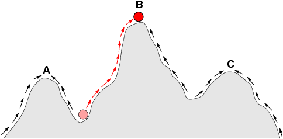
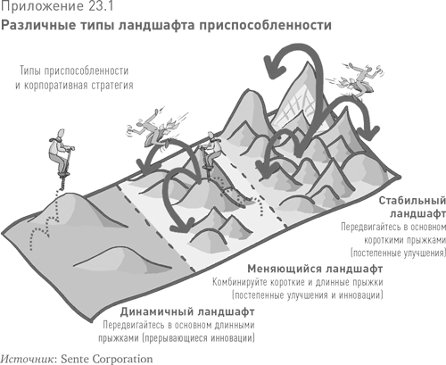
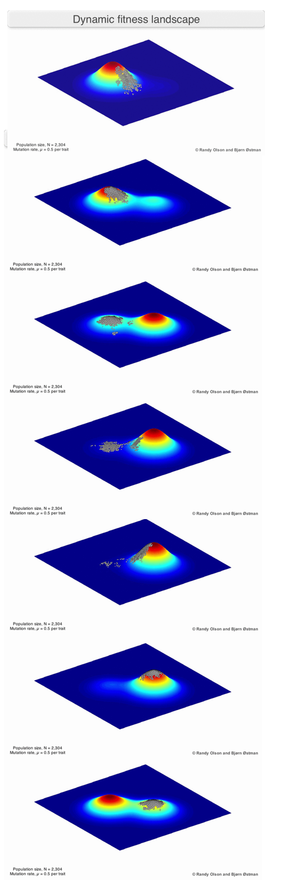
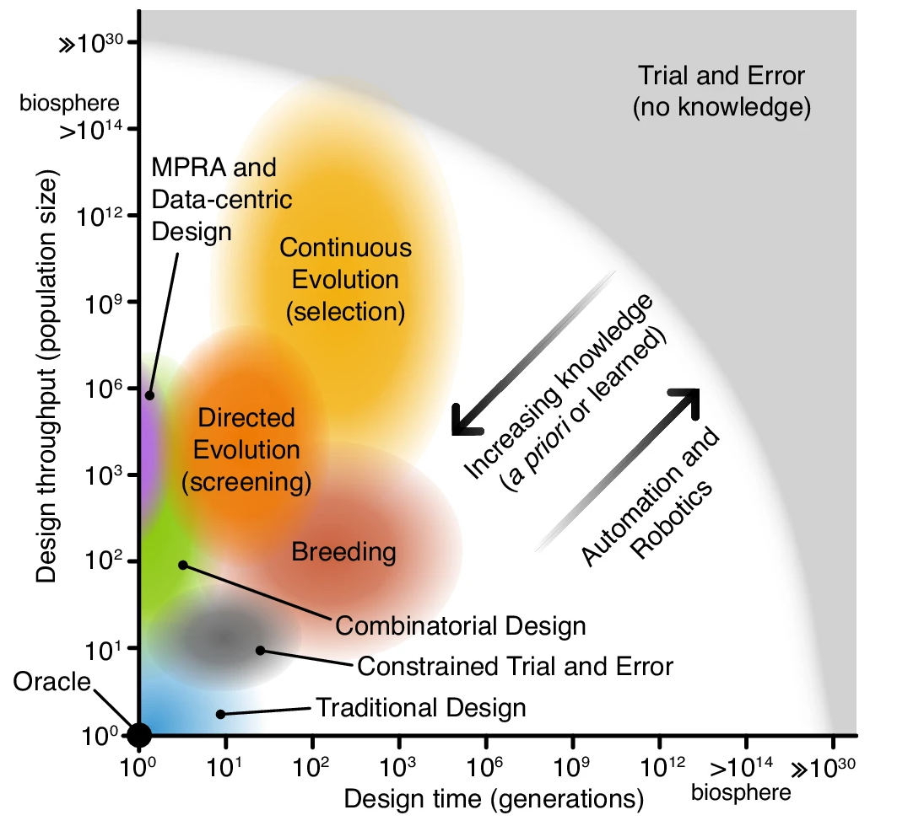

# Динамический ландшафт приспособленности

Ключевая концепция для современной эволюционной инженерии — это динамический ландшафт приспособленности, dynamic fitness landscape[^r8-1]. Ландшафты приспособленности (fitness landscapes[^r8-2]) были предложены ещё в 1932 году как средство визуализации хода эволюции: одномерный ландшафт обычно показывает ось с величиной какого-то признака, а высота — степень оптимальности для выживания (приспособленность/fitness).

Пики в таком ландшафте стоят на месте, это статический ландшафт. Точка обозначает популяцию, у которой меняется величина признака (скажем, длина крыла, толщина панциря, кислотность желудка). Так, популяция, показанная красным, эволюционирует из неблагоприятной для репликации величины признака к более благоприятной — глобальному максимуму. Приспособленность популяции тем самым растёт. Особи, которые имеют не очень большую приспособленность, плохо реплицируются, не так хорошо размножаются — у них меньше вероятность оставить потомство, которое сможет мутировать дальше, чтобы быть ближе к максимуму.

Если мы берём два признака, то получаем двумерный ландшафт приспособленности (всё ещё статичный, пики никуда не деваются). И на таком ландшафте всё ещё больше похоже на «горную местность», собственно, «ландшафт». Вот как такая картинка показывает возможные стратегии поведения фирмы в бизнес-литературе[^r8-3], и здесь даже поминается, что «ландшафт сам может меняться»:

Тут очень сложно увидеть, что же это такое «меняющийся ландшафт» — это что, небольшие бугорки высокой приспособленности, отстоящие далеко друг от друга? И где популяции? Это же должны быть продукты с немного отличающимися признаками (а на картинке показаны создатели, а не популяции продуктов!). Опять же, на картинке ландшафт только на два признака. Вот как это показывают биологи (в материалах по первым двум ссылкам в этом подразделе приводятся видео, это раскладка кадров в .gif файле):

Тут видно, что никогда речь идёт не об одном продукте, об одном организме, но всегда о популяции с немного отличающимися признаками каждой особи. В ходе эволюции обязательно нужно разнообразие (quality diversity[^r8-4]), и оно обязательно будет в силу неустроенности (обсуждалась в руководстве по системному мышлению). Зайдите в магазин смартфонов, вы увидите множество моделей с очень похожими, но всё-таки разными характеристиками. Посмотрите на автомобили — они все похожи, но характеристики их немного разные. А ещё видно, что сам ландшафт — он непостоянен, и в какой-то момент может оказаться, что выживут потом не самые приспособленные сейчас особи — их эволюционные достижения окажутся балластом.

Примеров тут множество. Так, мобильные телефоны развивались в направлении маленьких размеров: чем меньше, тем было лучше. Самые маленькие были самые «любимые». Потом телефоны сменились смартфонами, где уже не было кнопок, а экран занимал практически весь корпус. Первые смартфоны были явно побольше, ибо речь шла по факту об экране компьютера. И оказалось, что чем больше экран, тем удобнее на него смотреть. Появились смартфоны-лопаты (ибо формой они как раз и напоминали лопату, разве ручки не было), затем через некоторое время появились планшеты, ибо телефон с огромным экраном уже телефоном не назовёшь. Через некоторое время самые маленькие смартфоны вымерли (включая маленькие смартфоны фирмы Apple, которая дольше всех придерживалась идеи, что телефоны должны быть маленькие, чтобы удобно было управлять ими пальцами одной руки). Но и сверхбольшие смартфоны тоже вымерли: оказалось, что их неудобно носить в кармане или сумочке. Мода на планшеты тоже быстро прошла: сверхбольшие телефоны не нужны, а ноутбук с клавиатурой хорошо заменял планшет. Всё быстрое можно было смотреть прямо на телефоне, он «всегда в кармане», а всё медленное можно было отложить до ноутбука с большим экраном и удобной клавиатурой. Сейчас обсуждается вопрос о переходе к новому формфактору — функциональность телефона может уйти в очки AR, чтобы поддержать работу AI-агента «всегда на связи»[^r8-5].

Мы уже приводили в руководстве по методологии разнообразные описания функциональности нейросетей в качестве примера. Тут мы опять вернёмся к нейросетям, показав в качестве примера их эволюцию[^r8-6]. Чаще всего в инженерии эволюцию называют словом «история» (история самолёта, история смартфона, а вот мы расскажем историю нейросетей — но с упором на «великие вымирания» и «неожиданные возрождения»).

В 60х годах прошлого века технологии нейросетей были очень многообещающие, ибо «так работает мозг, значит мы скоро решим проблему искусственного интеллекта». Но оказалось, что интеллект существенно зависит от вычислительной мощности алгоритма — а сам алгоритм при огромной вычислительной мощности может быть и не так важен (этот тезис известен как «горький урок Sutton»[^r8-7], но сформулирован он был только в 2019 году). Поэтому искусственные нейросети показали очень неубедительные результаты — и стали в 80х годах маргинальными, нейросетевые алгоритмы продолжали изучать очень небольшое количество исследователей, инженеры ими практически перестали заниматься. Это общее место в эволюции: даже очень успешные ныне виды регулярно оказываются «на грани вымирания», даже люди имели в какой-то момент крайне небольшую численность[^r8-8]. Идеи/мемы/репликаторы знаний о нейросетях таки как-то выжили в эпоху «зимы AI» аж до начала 21 века. В 21 веке развитие видеоигр привело к развитию видеоускорителей, в 2007 году появился интерфейс CUDA для вычислений (сложения и умножения), в 2011 году догадались использовать ускорение для нейросетей — они получили «больше компьюта», в 2012 году наступил "момент ImageNet", новое пришло в нейросети сбоку, а обработку изображений — сбоку. Биологи бы сказали, что это паразитизм, который оказался симбиозом: сначала алгоритмы нейросетей подсаживались в предназначенные для совсем других целей и автономно существующие видеоускорители, а затем наоборот — эти видеоускорители перестали ориентироваться на обработку изображений для видеоигр и специально были оптимизированы для нейросетей. Разработчики GPU не подозревали, что у них будет такое использование — но вовремя развернулись в эту сторону[^r8-9].

Дальше берём в нейросетях (которые были сначала главным образом дискриминативными, а не порождающми/generative, то есть классифицировали объекты по каким-то классам, а не порождали картинки, видео, тексты, аудио) линию порождающих алгоритмов (ибо их было предложено множество разных, в эволюции это quality diversity, разнообразие разных признаков у популяции какого-то вида, об этом же разнообразии признаков в эволюции говорят как про geometry frustrations, ибо выживаемость особей с разными признаками существенно зависит от окружения и конфликтов — об этом мы говорили в руководстве по системному мышлению). Дальше наблюдаем, как разработчики массово увлеклись линейкой алгоритмов GAN (это было настоящее сумасшествие!), пока в 2017 появился для текстов transformer — об этом говорят как о «моменте трансформера», это был крупный сдвиг в эволюции: большинство исследователей бросили заниматься разными вариантами GAN (но не все! Какая-то популяция этих алгоритмов продолжает жить и развиваться!) и начали работать с трансформерными архитектурами.

Дальше с трансформерами (которые улучшались и улучшались, и продолжают улучшаться) идём в рассмотрение инженерного процесса: в биологии это development/развитие, но в инженерии development означает часто continuous development, включающий и проектирование, и изготовление, и эксплуатацию силами создателей из графа создателей, а вот в биологии это «самоизготовление», организм самовырастает из зиготы. Ежели упор на изменения признаков в ходе эволюции — это эволюционная биология, evo. А вот как меняется «инженерный процесс» — это evo-devo, эволюционная биология развития[^r8-10].

Дальше нам нужна инженерия в целом — что там эволюционного. Современная инженерия работает вроде как development до момента delivering, и это development явно не похоже на развитие организма в eco-evo-devo, да и переводится «разработка». Затем появляется continuous development, continuous integration, continuous delivering — и оказывается, что continuous everything из инженерии это и есть эволюция, continuous development тут — эволюционная разработка, и даже архитектура по новым воззрениям — эволюционная.

А сама эволюция (биологическая, культурная, техническая/инженерная) ещё и evolved, то есть меняются эволюционные ходы, они тоже запоминаются паттернами среды (а не только генами, что толку мне запоминать в генах, как кушать траву, если у растений ещё генов нет, как эту траву выращивать? Ручка-бумага и даже мозги тоже оказываются носителями записей о паттернах, но весь мир хранит отпечатки того, что в нём происходит, сам-себе-ручка-бумажка).

Итак, эволюция нейросетей продолжилась не только в части того, какой алгоритм взят в качестве «вручную закодированной заготовки» и какова была его эволюция, но и в части того, как именно подавать пары «входные данные — выходные данные», чтобы на выходе получить более-менее разумную AI-систему, а не просто «алгоритм». Это как раз evolution evolved, менялись способы, которыми происходила эволюция нейросетей — в расчёт начали брать не только эволюцию алгоритма нейросети, но и алгоритмы обучения (то, что делает не нейросеть в ходе её эволюции, а что делают создатели, «как учат»/«изготавливают»). Тут можно выделить несколько моментов (конечно, это очень грубо и упрощённо):

* Обучение воспроизводить паттерны входного текста, pretrain. На выходе pretrain — базовая модель. И дальше с ней можно было чатиться: начинать какую-то строчку (в том числе и задавать вопрос) и получать наиболее вероятное продолжение в ответ.
* Дальше произошло понимание того, что во всех этих случаях речь идёт просто о парах «входная информация — выходная информация», это был «подход T5», text-to-text transformer[^r8-11]. И вот это давало возможность учить не просто «паттернам входного текста», а «паттернам ответов на вопросы». В итоге появились модели класса «instruct», которые после pretrain дообучали/finetune на подобных паттернах. Техники дообучения росли, в дообучении принимали участие люди — они «натаскивали» нейросеть на «правильные» (полезные/helpfulness и безвредные/harmlessness) ответы, это назвали RLHF (reinforcement learning with human feedback[^r8-12]). В результате нейросетки получали паттерны того, как можно отвечать на вопросы — и это совсем не то, что просто генерировать наиболее вероятные ответы. Это был «момент ChatGPT», когда на основе instruct нейросети был создан продукт осмысленного чата с нейросетью. Осмысленный — это когда ты получал на выходе на какой-то вопрос вполне осмысленный ответ. Конечно, quality diversity в эволюции была и тут: довольно много инженеров пытались повторить, и даже повторяли эти результаты. Проблема была только в том, что процесс обучения заключался в том, что нейросеть обучали «отвечать», её не обучали «думать»!
* Дальше сразу несколько исследователей находят способ, как заставить модель не отвечать сразу, а прокручивать ровно тот цикл размышлений, который характерен для эволюции: высказывать догадку — и не сразу вываливать её в качестве ответа, а сначала проверять, и высказывать новые догадки, если текущая догадка оказалась неверной. Дальше наступает «момент DeepSeek», ибо фирма DeepSeek не просто предложила вниманию публики коммерческий продукт с такой «рассуждающей» нейросеткой, но опубликовала эту нейросеть в свободном доступе, да ещё и написала подробную статью, как такие нейросети делать. Это был третий шаг, «обучение с подкреплением» (RL), причём подкрепление было в том числе за правильность рассуждений перед ответом.
* … конечно, это не последнее изменение в процедурах разработки нейросетей! Эволюция неостановима как в части целевой системы как итогового результата, так и в части того инженерного процесса, каким этот результат получается. Так что ждём выхода на бесконечность, open-endedness в развитии AI[^r8-13].

Это важно: мы имеем одну и ту же нейросеть «на входе обучения», но на выходе имеем разной силы алгоритмы после разного обучения этой нейросети: или бездумного поэта, который выдаёт произвольные ассоциации, или подмастерье, который пытается воспроизвести ответы по способу мышления мастера, или самостоятельно думающего мастера. Всё зависит не от «конструкции нейросети», а от того, «как готовили». Как говорится, «из той же мучки, да не те ручки». Это эволюция метода, в данном случае метода обучения. Как долго длилась эта эволюция метода? Относительно долго: архитектура трансформера для «базовой» сети была получена в 2017 году, публика получила instruct модель с доученными от людей «безвредностью» и «полезностью» такой сети в формате чата 30 ноября 2022 года[^r8-14], «момент DeepSeek» (назван так по образцу «Sputnik moment», потрясение мира в момент запуска СССР первого спутника) произошёл 25 января 2025 года. В техноэволюции всё быстро, репликация идей из одних мозгов в другие, из одних компьютеров в другие происходит почти мгновенно — через интернет.

В целом, похожесть инженерной эволюционной разработки биологической эволюции заметили уже давно и подробно изучают. Вот одна из типичных диаграмм, которые появляются в таких исследованиях[^r8-15]:

Подходы к проектированию в нижнем левом углу имеют небольшое количество вариантов (размеров популяции) и циклов проектирования (поколений). Они требуют значительных предварительных знаний для успешного проектирования с оракулом, способным создать идеальный дизайн за одну попытку. Подходы к проектированию в верхнем правом углу мало используют предварительные знания и обучение, требуют меньшей способности к развитию, и их поиск менее ограничен. Метод проб и ошибок (без предварительных знаний) попадает в эту крайность, где для проектирования нетривиальных систем требуются гиперастрономические масштабы. Все остальные методы проектирования расположены между этими крайностями. Во всех этих случаях предварительные знания могут использоваться для ограничения пространства проектирования, а полученные знания могут динамически направлять процесс на лету. Кроме того, автоматизация и робототехника могут помочь увеличить производительность эволюционного процесса проектирования и количество поколений, которые могут быть реально опробованы.

Напомним основные идеи современных теорий эволюции (их явно не одна), которые мы как-то затронули:

* open-endedness[^r8-16] (наличие двух агентов: один решает всё более и более трудные проблемы, второй формулирует всё более и более трудные интересные проблемы, а не любые проблемы, и ещё мир, достаточно богатый для бесконечно усложняющихся проблем)
* quality diversity[^r8-17] для меметических алгоритмов[^r8-18], то есть работа с популяциями и работа с локальными и глобальными оптимумами динамического ландшафта приспособленности
* многоуровневость и сложность (с конфликтом между системными уровнями и geometry frustrations, неустроенность — и связь неустроенности с quality diversity). Это работы группы Ванчурина-Кацнельсона-Кунина-Вольфа[^r8-19].
* невозможность отследить эволюцию одного объекта изолированно на любом эволюционном/системном уровне, ибо можно отслеживать только совокупную эволюцию, при этом эволюция идёт не только среди объектов одного уровня, на одном уровне (скажем, гена или вида) но на всех уровнях. Это тоже работы группы Ванчурина-Кацнельсона-Кунина-Вольфа.
* Уход от статического fitness landscape и тем самым уход от обсуждения приспособленности через «пользу» (польза получается эмержджентной, и отнюдь не сразу — и «польза» обычно одноуровнева, а нужно учитывать все уровни и их конфликты). Так, у черепахи сначала появился щиток на брюхе, чтобы была платформа, удобная для копания. И затем из рёбер вырастали небольшие щитки наверху, сквозь кожу, ибо близко же — из клеток, которые шли в том числе и на рёбра! Ни о какой «защите панцирем» и речи не шло. Затем щитков на спине стало больше, и они срослись с щитками платформы на брюхе. Вот с этого момента — «панцирь, у него защитные функции». А до этого — нейтральные случайные особенности/traits, разбегающиеся в рамках популяционной quality diversity.
* Кроме evo в обсуждениях эволюции обязательны development и eco (eco-evo-devo[^r8-20]).

[^r8-1]: <https://randalolson.com/2014/04/17/visualizing-evolution-in-action-dynamic-fitness-landscapes/>

[^r8-2]: <https://en.wikipedia.org/wiki/Fitness_landscape>

[^r8-3]: <https://econ.wikireading.ru/2362>

[^r8-4]: <https://quality-diversity.github.io/>

[^r8-5]: <https://www.yahoo.com/tech/zuckerberg-wants-billions-ai-glasses-190313330.html>

[^r8-6]: <https://en.wikipedia.org/wiki/Neural_network_(machine_learning)>

[^r8-7]: <http://www.incompleteideas.net/IncIdeas/BitterLesson.html>

[^r8-8]: <https://www.science.org/doi/10.1126/science.abq7487>

[^r8-9]: <https://ailev.livejournal.com/1416697.html>

[^r8-10]: <https://ru.wikipedia.org/wiki/Эволюционная_биология_развития>

[^r8-11]: <https://cameronrwolfe.substack.com/p/t5-text-to-text-transformers-part>

[^r8-12]: <https://en.wikipedia.org/wiki/Reinforcement_learning_from_human_feedback>

[^r8-13]: <https://ailev.livejournal.com/1752457.html>

[^r8-14]: <https://en.wikipedia.org/wiki/ChatGPT>

[^r8-15]: <https://www.nature.com/articles/s41467-024-48000-1>

[^r8-16]: <https://www.oreilly.com/radar/open-endedness-the-last-grand-challenge-youve-never-heard-of/>

[^r8-17]: <https://quality-diversity.github.io/>

[^r8-18]: <https://en.wikipedia.org/wiki/Memetic_algorithm>

[^r8-19]: <https://scholar.google.com/citations?hl=en&user=nEEFLp0AAAAJ&view_op=list_works&sortby=pubdate>

[^r8-20]: <https://en.wikipedia.org/wiki/Ecological_evolutionary_developmental_biology>
