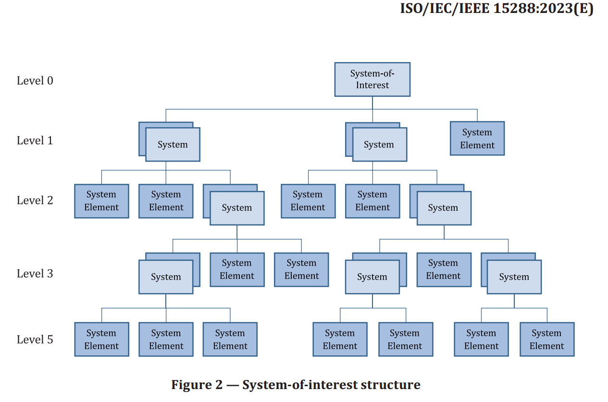

# Слова-термины в безмасштабной эволюционной инженерии и важны, и не важны

Терминология, под которой скрывается безмасштабность (многоуровневость) и эволюционность (развитие системы как выпуск множества релизов/версий) в современной науке (предложение новых теорий, описаний мира) и инженерии (новые изменения физического мира) может существенно различаться. В разных мета-моделях (как научных, там чаще всего метаУ-модель, «как в учебнике», так и принятых в конкретном проекте метаС-моделях, «ситуационных») системы на каждом уровне и сами уровни будут называться разными именами, в том числе системы разных релизов/версий. За типами надо будет внимательно следить. Так, даже слово «релиз/release» может означать три разных объекта:

* систему в определённой конфигурации, синоним «версии»,
* процесс разработки (development) и введения в эксплуатацию (delivering) версии, поведение создателя версии/конфигурации системы,
* событие выпуска версии, причём не окончание сборки/integration (куда часто ещё включают и инженерные обоснования успешности, quality assurance с испытаниями функциональности, соблюдением архитектурных решений и решений по защите и безопасности), даже не окончание разворачивания/deployment, но чаще всего это окончание «введения в эксплуатацию»/delivering.

Когда речь идёт о «водопаде» против agile — это чаще всего отсылка к эволюционной инженерии, но слова «эволюция» не увидите, будет использовано только слово development, в английском достаточно многозначное, чтобы иметь оттенки «развития» и «разработки». То, что русскоязычное ухо слышит как «разработка», в английском включает в себя и «развитие», а для русского уха «развитие» как раз отсылка к эволюционному масштабу времени, evolution. Про выпуск новых и новых версий будут говорить agile development, но там внутри неожиданно — про evolutionary architecture.

Безмасштабность/scale-free/scaleless (одно и то же описание на самых разных системных уровнях) тоже в разных научных и инженерных школах будет обсуждаться разными словами, которые будут «синонимами с нюансами», отсылками к одной идее, но с подчёркиванием разных её аспектов:

* ренормализация как применение одного и того же формализма, одной и той же математики для описания каждого системного уровня. Это обычно там, где много физиков, знакомых с методами статистической физики.
* рекурсия как применение одного и того же метода работы на каждом системном уровне, это в системной инженерии (например, в стандарте ISO 15288:2023 этот термин используется для объяснения, что материал стандарта приложим к системам на всех системных уровнях)
* фрактальность, отсылка к самоподобию устройства уровней, в инженерии это весьма распространено[^r8-1].
* инвариантность к масштабу (scale invariance, invariant scaling)[^r8-2] как противопоставление «многомасштабности» (multiscale), где наоборот, подчёркивается роль различного моделирования на разных системных уровнях с выходом на общий результат моделирования[^r8-3].
* самоподобие (Self-affinity, self-similarity[^r8-4]), как указание на повторяемость по отношению к самому себе, более общий термин по отношению к инвариантности к масштабу — ибо там самоподобие по отношению только к масштабу, но тут может быть распространено, например, на фракталы, где повторяется на разных масштабах форма.
* … ожидайте больше вариантов, идея «одинаковых паттернов на каждом уровне» (где паттерны — паттерны объектов, то есть типы, паттерны поведения, то есть методы, паттерны описания, то есть типы моделей) распространена, но каждый раз для этой идеи выдумывались свои термины и подчёркивались свои особенности.

Как у нас называются сущности, которые являются частями друг друга и целыми друг ко другу на самых разных уровнях? Очень по-разному:

* **Системы/systems** имеют границу и окружение, основное отношение часть-целое. Систем предлагается огромное количество, например, древние автопоэтические системы малоотличимы от агентов. Холоны — подчёркнуто то, что система состоит из частей-подсистем и сама часть надсистемы. Почему автопоэтические системы и холоны остались только в литературе прошлого века? Это хорошие метафоры (из frameworks, набора понятий), но под ними было мало формализации и математики, они были плохи для формального разговора и более-менее точных предсказаний. Там, где мало математики и нельзя чего-то посчитать и сверить с экспериментом, не надо ждать сохранения. Но сам термин «система» из физики, так что с ним будет всё в порядке.
* **Агенты/agents** с главным свойством автономности, в том числе у них важна устойчивость к распаду от внешних воздействий. Варианты агентских подходов весьма разнообразны, например, в подходе «деятельных рассуждений»/«active inference» как раз в терминологии чаще всего используются агенты[^r8-5]. Математики и физики с этой терминологией довольно много, поэтому можно ожидать сохранения термина.
* **Ренормализованные сущности/entities**, подчёркивают идею инвариантности к шкале, уровню гранулярности и использованию одной и той же математики для описания явлений на разных уровнях[^r8-6].
* **Ренормализованные нейроны**, упор на применимость математики машинного обучения, этим занимаются во многих местах[^r8-7]. Иногда возникают терминологические коллизии, если ожидается, что эти работы будут читать биологи, для которых «нейрон» — это не тип объекта в многоуровневой системе, а биологический нейрон, клетка. Поэтому иногда для «ренормализованного нейрона» из физики вводят синоним: IPU (information processing unit, причём этот термин вводится только в рамках этой теории и означает по сути «систему», описываемую в терминах машинного обучения — полный синоним «ренормализованного нейрона», выбор такого термина связан с его общностью).
* **Cоздатели/constructors**, акцент на неизменность-неразрушаемость при выполнении операций с окружением (что очень похоже на агента, но акцент не на автономность, а на готовность к повторению операций, неразрушимость во взаимодействиях)[^r8-8].
* **Наблюдатели/observers,** в таких, например, работах, как «Towards scale-free formalization of physical systems as observers»[^r8-9].
* **Машиностроительные** **узлы/nodes**, подчёркивают идею многоуровневой сборки из комплектующих[^r8-10].

По большому счёту, это всё отсылки к одному и тому же концепту, «синонимы с нюансами» — разные термины подчёркивают разные аспекты описания, разные акценты.

Большинство теорий, которые используют многоуровневые безмасштабные представления, не различают функциональную и конструктивную декомпозицию/синтез — при этом подразумевается, что в этих то ли уровнях, то ли слоях (чаще всего «уровни» и «слои» в таких теориях — синонимы, выбор их произволен) отношения между объектами образуют сети, называемые часто:

* **организацией**, если речь идёт о функциональных отношениях (потоки и порты). Скажем, «Discrete IPUs (that is, self- vs. nonself-differentiation and discrimination) exist at all levels of organization» из той же работы Ванчурина со товарищи[^r8-11]. Организация указывает, каким процессом функциональные части системы склеиваются в функциональное, стабильное (и часто — эволюционирующее) целое. Границы тут не очень важны.
* **архитектурой** (изредка — **структурой**), если речь идёт о конструктивных отношениях (физические взаимодействия и интерфейсы), а в случае экземпляров — это конфигурация. Архитектура — это про то, как именно модули-части собираются в целое, взаимодействуя через свои границы по интерфейсам. Границы тут как раз важны.
* компоновкой, если речь идёт о пространственных отношениях и прилеганиях в пространстве
* стадийностью, если речь идёт о временно́й/эволюционной структуре
* ... и там ещё много всякого, в том числе гибриды типа "стоимости", которая тоже многоуровнева, но цепляет самые разные другие многоуровневые представления.

Если вы понимаете идею безмасштабного/рекурсивного/многоуровневого/фрактального/ренормализованного/системного (и так далее! синонимов тут много!) описания мира, то вы разберётесь с любыми терминами, которыми пытаются выразить эту идею.

Так, «организация» — это часто «функциональная многоуровневость», а архитектура — это часто «конструктивная многоуровневость». Но «часто» --это не всегда. Самые разные «опытные разработчики» прошлого будут называть функциональные диаграммы с dataflow и портами (без интерфейсов!) «архитектурой». Дело даже не в том, что архитектура — это не описание, это реализация какого-то паттерна отношений/relations частей конструкции, то есть сами части конструкции, связанные по какому-то архитектурному паттерну. Нет, просто значение слова поменялось.

Скажем, устойчивое словосочетание «архитектура нейронной сети» задействует старое значение слова «архитектура», когда интуитивно она понималась как «всё важное», а развиваемость/evolvability системы и связь развиваемости с модульностью были не вполне ясны. Потом появилась эволюционная/evolutionary архитектура (первая книга на эту тему вышла в 2017 году) — и после этого значение слова «архитектура» начало меняться.

Но культуры распространяются медленно, переучиваться с одной теории архитектуры на другую трудно — поэтому архитектурой могут назвать и принципиальную схему, и отображение функций на конструкцию, и структуру самой конструкции с описанием связей между её частями.

Что происходит, когда алхимия заменяется химией? Как протекает просвещение в среде учёных и инженеров? По печальной шутке «наука продвигается с каждыми похоронами». Точнее, Макс Планк заметил: «Новая научная истина побеждает не тем, что убеждает своих оппонентов и заставляет их увидеть свет, а тем что оппоненты в конце концов умирают, и вырастает новое поколение, уже с ней знакомое»[^r8-12].

Точно так же люди легко назовут «модульной организацией» какую-нибудь сеть модулей-на-интерфейсах, и даже не вспомнят в этот момент слово «архитектура». Надо ли с ними спорить о том, что «это не архитектура»? Конечно, нет. Спор на тему «объект X не принадлежит классу Y» — типичный «спор о терминах», и там два слоя:

* попадает ли какое-то понятие в таксон какого-то классификатора (надо понимать, что вариантов классификаторов и критериев классификации тут множество, а ответ на вопрос обычно неважен, если речь не идёт о каком-нибудь государственном классификаторе, попадание в таксон у которого ведёт к каким-нибудь прибылям или убыткам)
* каким словом назвать это попадание изо всех возможных синонимов.

Помним, что разбираться надо сразу по существу: что там за понятие, с какой целью нам его сообщают, какие интересы у тех, кто нам говорит про архитектуру и организацию — и для надёжного заземления/grounding просить привести примеры. Спорить о терминах не надо, это бесполезно. Но и не надо ошибаться: если вам показали «принципиальную схему», а потом показали «архитектурную диаграмму», на которой вы тоже обнаружили ролевые объекты и их поведение, а модулей и их интерфейсов не показали — ищите модули и интерфейсы, как бы они в этом проекте ни назывались. Просто считайте, что люди там говорят на иностранном языке — и либо вы их научите говорить на «культурном инженерном языке» (понятия и терминология SoTA системной инженерии), или это слишком затратно, тогда вы думайте на культурном языке, а говорите с этими людьми на их туземном. Слова важны и не важны, ибо важны понятия — и они обозначаются словами, что важно, но слова можно и поменять, а понятия с их типами — нет, поэтому слова оказываются не так важны.

Путаница слов-терминов «организация» и «архитектура» — это простой случай, и даже тут можно запутаться ещё больше. Так, «организация» часто используется для указания не на свойство следования паттерну отношений между функциональными объектами в системе, а в качестве синонима для оргзвена. То есть даже не архитектура (тоже свойство системы), а вообще — синоним модуля. И «организация» и «архитектура» — это не исчерпывающий список терминов для указания на многоуровневую сетевую (сеть отношений между системами каждого уровня) структуру. Путаться тут будет и «конфигурация» (отнюдь не экземпляров модулей, как вы могли бы ожидать), и «топология», и даже «композиционная структура».

Эволюция чаще всего обсуждается как эволюция каких-то функциональных объектов, но и тут надо быть настороже: если говорим о версионировании или переконфигурировании, то это обычно обсуждение «эволюции архитектуры».

Не факт, что хоть кто-то задумался о выборе слова «организация» при написании фразы «Discrete IPUs (that is, self- vs. nonself-differentiation and discrimination) exist at all levels of organization»[^r8-13] (более того, в статье даже синонимия ренормализованного нейрона и IPU не прописана, хотя авторы не в статье подтвердили эту синонимию[^r8-14]). Интуитивно понятно, что речь идёт о функциональном описании — при этом назначение/purpose подозрительно напоминает описание просто «системы», это же про границы между системой и окружением! Но нет, IPU как «нейрон» обладает способностью к обучению, описывается функцией активации, функцией потерь, входами и выходами. Этот подход подразумевает, что все системы можно так описывать, на всех системных уровнях! Но потому-то и не используется слово «система», что в общем случае при его использовании нельзя ожидать, что будет ровно вот такое описание в терминах систем-нейронов. Синоним, но «с нюансами». Тем не менее, говорится об организации этих нейронов, то есть авторы неосознанно выбрали терминологию, указывающую на функциональные объекты. Слова в тексты приходят «навеянные музыкой», общим «культурным фоном» (нейросеть мозга подставляет «наиболее вероятные» слова для обозначения объектов, следует неявно выученным паттернам, которые часто встречались раньше). Ваш «культурный фон» может быть не такой, как у вашего собеседника. Поэтому каждый раз надо в каждом проекте и каждой теории разбираться с типами: какие слова какие понятия каких типов из каких теорий используются при описании разных систем проекта.

Ещё одна проблема безмасштабных описаний — в постулировании разных типов на разных уровнях этих описаний. Так, узлы состоят из узлов. Но в машиностроении вам могут заметить, что узлы собираются из деталей — это такие узлы, которые уже не узлы, ибо их нельзя собрать. А на верхнем уровне узлы собираются в подсборки и сборки, а уже они — в изделие. При любом изменении организации и архитектуры приходилось переприсваивать типы объектов. Сама идея, что уровни по отношению «часть-целое» (разбиения/декомпозиции, например, «разузловки», иногда «синтезы» — термины выбираются в зависимости от предпочтительного направления рассмотрения иерархии по отношению «часть-целое») должны содержать какие-то единицы/units одного типа — она в системную инженерию шла очень медленно, а до многих мест «просто инженерии» пока ещё вообще не дошла. Вот картинка из ISO 15288:2023, это пояснение понятия «система» — суть картинки в том, что системы многоуровневы. И там неожиданное нарушение этого принципа: если это последний уровень в какой-то ветви иерархии, то это уже не тип «система», а тип «системный элемент»:

Если вы вдруг решите сделать этот элемент из двух или трёх частей, то придётся поменять тип с «системного элемента» на «систему». И то, что типов всего два (а тип будет отслеживаться в компьютерной системе, разные типы будут в ней запрашиваться по-разному) — это счастье, ибо раньше у вас это было деталью, узлом, подсборкой, сборкой, подсистемой, системой (и это даже не все предписанные уровни), и вам надо было хорошо понимать в любой момент времени, говорите вы о детали, об узле, о сборке или подсистеме. С одной стороны, это очень удобно в неэволюционной архитектуре: сразу понятно, о каком уровне говорим! Но если у вас меняется организация и архитектура в ходе развития системы, отслеживание смены типов объектов каждого системного уровня при их объединении из частей или разделении на части превращается в головную боль, единообразие мышления об объектах каждого уровня нарушается.

Многоуровневость и (функциональной) организации, и (конструктивной/модульной) архитектуры, и (пространственной) компоновки, и (гибридной по многим другим разбиениям) полной стоимости владения в инженерии повсеместна. Например, в теории управления показывается теоретически, что надлежащее управление вы можете иметь только в том случае, когда речь идёт о многоуровневом управлении. В cтатье «Towards a Theory of Control Architecture: A quantitative framework for layered multi-rate control»[^r8-15] основное внимание уделяется необходимости строгой теории многоуровневых архитектур управления (LCA) для сложных инженерных и естественных систем, таких как энергосистемы, сети связи, автономная робототехника, бактерии и сенсомоторное управление человеком. Термин «архитектура» тут по факту означает «концепция системы», ибо речь идёт и о многоуровневой организации, и о многоуровневой структуре модулей (датчики, эффекторы) различного размера и различных характеристик. Особенность многоуровневости в том, что на большом масштабе/размере физической системы вы будете иметь много силы и скорости, но малую точность, а на маленьком масштабе вы будете иметь малую силу и скорость, зато большую точность. Чтобы добиться большой силы, высокой скорости, большой точности, вам принципиально/теоретически нужна многоуровневая архитектура. И тут авторы замечают, что успехи существующих архитектур (прежде всего — функциональная организация) от бактерий до Интернета обусловлены поразительно универсальными механизмами и паттернами конструкции/design. Это во многом обусловлено эволюцией путём естественного отбора, а не разумным проектированием. И дальше авторы ставят цель: описать универсалии/инварианты архитектуры и наметить предварительные пути к полезной теории дизайна. Каждое вхождение слова «архитектура» тут означает «всё важное в его взаимосвязи, прежде всего решения по многоуровневому синтезу функциональной организации управления и дальше по многоуровневой нарезке на модули разного размера». Вам надо каждый раз разбираться, как люди используют слова: инженеры и менеджеры, а тем более гуманитарии могут использовать слова в самых разных значениях, обозначать ими объекты самого разного типа — и часто совсем не того, который вы привыкли обозначать этими словами, и не того, который мы используем тут для обозначения понятий мета-мета-модели наших руководств для инженеров-менеджеров. Каждый раз, когда встречаете такие слова в рабочих разговорах, настораживайтесь и требуйте разъяснений с заземлением: организация, архитектура, структура, концепция, методология, подход, процесс, протокол, процедура, практика, механизм, инструмент, технология, платформа, интерфейс, система, фреймворк, модуль, компонент, элемент, блок, фрагмент, сегмент, часть, единица, сущность, объект, уровень, слой.

Но вернёмся к вопросу многоуровневости, принципиально необходимой разномасштабности как в биологических, так и в технических/инженерных системах. То, что эволюция отбирает такие многоуровневые системы, как успешные, заметили не только авторы работ по синтезу систем управления. Термодинамическое рассмотрение эволюции ведёт к тому же: росту сложности систем путём объединения систем нижнего уровня в системы более высокого уровня — это поднимает устойчивость систем к воздействиям, снижает их свободную энергию. Молекулы объединяются в клетки, клетки объединяются в многоклеточные организмы, организмы — в популяции. То же самое происходит в технологии: микросхемы, экраны, камеры, корпуса объединяются в смартфоны, атомные реакторы и турбины — в атомные электростанции. На эту тему есть множество работ, например, «Physical foundations of biological complexity»[^r8-16], «Modeling complex systems as interacting agents»[^r8-17]. В этой последней работе говорится как раз, что сложное понятие «система» моделируется через более простое в понимании понятие «агента», это ход на панпсихизм в версии минимального физикализма: «всё на свете живое, только в разной степени». Агент (даже если это молекула) воспринимается немного антропоморфно, что для каких-то людей может существенно облегчать понимание материала. С другой стороны, системы подразумевают рассмотрение их самых разных аспектов, а агенты — только части, упор на автономность и взаимодействие, поэтому агентский язык более «узкий», чем системный. В любом случае, всё это «синонимы с нюансами», обозначения многоуровневых «единиц эволюции».

Заведомая многоуровневость может быть ключом к бизнес-успеху. Так, для контроллеров робототехники у NVIDIA в 2024 году был не один чип и один «суперкомпьютер на маленькой плате», а целая линейка таких[^r8-18]. Скажем, Jetson Orin Nano series — «Up to 40 TOPS, 7-15W, 70mm x 45mm, Starting at 199 USD, Available now» как младшая модель, а вот модель побольше — Jetson AGX Orin series — «Up to 275 TOPS, 15-60W,100mm x 87mm, Starting at 899 USD, Available now». В промежутке между Nano и AGX есть ещё Jetson Orin NX series. Важно, что эти модели программируются одинаково, эту «одинаковость программирования» NVIDIA гарантирует для следующих поколений подобных моделей, а ещё эту же «одинаковость программирования» гарантирует для симуляторов Isaac (чтобы отлаживать управляющие алгоритмы не на физических роботах, а на виртуальных роботах). Рынок тут смотрит не на характеристики платы, а на итоговые характеристики команды, которая выбрала эту плату: вам надо научить людей в команде работать с этими контроллерами один раз, хотя у всех у них разные характеристики. Для контроллеров на многих уровнях управления у вас будет одинаковое программирования, если потребуется как-то поднять характеристики контроллера на каком-то из уровней управления, то это можно будет сделать без переписывания программы. Во многих и многих системах вам придётся делать сложную/многоуровневую систему управления, делать её разные уровни на зоопарке дешёвой аппаратуры и тем самым зоопарке дорогого в разработке софта — так себе идея. Поэтому NVIDIA имеет существенное конкурентное преимущество: вы сохраняете все вложения в разработку софта, когда переходите с одного «железа» NVIDIA на другое — как в плане размера в продуктовой линейке, так в плане новых моделей. Это безопасней в плане эволюционной разработки, меньше рисков промахнуться. Неудивительно поэтому, что огромное число робототехнических фирм используют более дорогие, но поддерживающие многоуровневость и развиваемость/evolvability контроллеры NVIDIA, а не более дешёвые более простые AI-контроллеры мелких фирм.

Важнейшее свойство учёта безмасштабности в развитии систем — это «не меняем ни строчки в математике, но занимаем разные экологические ниши на разных системных уровнях многоуровневых систем управления». Одна математика (формулы) на всех уровнях управления, с учётом специфики каждого уровня, но разная скорость её работы и разные характеристики скорости-точности на каждом уровне. NVIDIA целится в занятие всех возможных ниш, а не занятие одной ниши. **Нельзя рассматривать одиночный одноуровневый продукт** **и разовый его выпуск, без последующего развития. Обязательно** **нужно какое-то многоуровневое рассмотрение, закрывающее диапазон шкал и характеристик** **и предусматривающее неизбежное последующее развитие/evolution.**

Конечно, для каждого уровня будут адаптации и специализации, но общий ход рассуждений остаётся одним и тем же для каждого из уровней и понимания, как там всё (отдельный вопрос — что именно «всё») укладывается в эти уровни.

Зачем эта универсальная многоуровневость нужна в инженерии? Кто видит эту многоуровневость мира — тот этим миром правит. Скажем, NVIDIA — это команда системных мыслителей, там вообще презентации и коммуникации велись через предъявление многоуровневости их систем[^r8-19]. Ведущая роль NVIDIA была долго малозаметна для публики, многие ещё путали NVIDIA с поставщиком видеокарт для компьютерных игр. А сейчас это лидер рынка аппаратуры для AI. Этот рыночный успех не случаен, ибо компания всё это время демонстрировала мышление системных инженеров, простирающееся на много уровней (логические цепи, схемотехника/«IP cores» частей чипов со многими логическими цепями, чипы со многими IP, платы со многими чипами, компьютерные рэки со многими платами, серверные стойки и компьютеры со многими рэками, поды датацентров со многими серверными стойками, датацентры и суперкомпьютеры «под ключ», много уровней софта для датацентров — и это только линейка продуктов для датацентров). Помним, что деньги приходят на более высокий системный уровень, а инновации (эволюционные novelties) приходят сбоку на низкие системные уровни. И эта эволюция происходит на каждом уровне.

Весь текст этого подраздела раскрывает системный подход в инженерии, причём это главным образом системный подход первого поколения:

* рассказывается о чём-то многоуровневом, причём подчёркиваются универсалии каждого уровня и подход к описанию всех уровней вместе (безмасштабность описания каких-то единиц, например, компьютеров-контроллеров в системах управления — функциональные из теории и «железные» из продуктовой линейки NVIDIA)
* не рассказывается о создателях, хотя это и не совсем так, например, явно оговариваются преимущества коммерческого предложения продуктовой линейки NVIDIA для организации работы команды: создатели освоят или один метод разработки для всех уровней/масштабов железа и софта NVIDIA — или им придётся осваивать зоопарк методов разработки для зоопарка разного железа и софта на разных уровнях/масштабах. Но в целом — всё как в биологии, создатели и графы создателей в тексте не поминаются.
* не затронуты вопросы эволюционного масштаба времени (скажем, dynamic fitness landscape, «кто был королём, тот в новой ситуации станет никем, если не поменяется», но если меняется — королём останется, популяция какой-то системы как типа эволюционирующего объекта отслеживает перемещение пика адаптационного ландшафта[^r8-20]. Хотя мы косвенно это и затронули в примере с той же NVIDIA).

[^r8-1]: <https://fractalfoundation.org/OFC/OFC-12-1.html>

[^r8-2]: <https://en.wikipedia.org/wiki/Scale_invariance>

[^r8-3]: <https://en.wikipedia.org/wiki/Multiscale_modeling>

[^r8-4]: <https://en.wikipedia.org/wiki/Self-similarity>

[^r8-5]: Математика по физике агентов в сочетании с active inference можно найти в <https://chrisfieldsresearch.com/>, а работы по active inference — в <https://www.activeinference.org/>

[^r8-6]: <https://en.wikipedia.org/wiki/Renormalization_group>

[^r8-7]: <https://www.pnas.org/doi/full/10.1073/pnas.2120042119>, <https://arxiv.org/abs/2409.13421>

[^r8-8]: <https://en.wikipedia.org/wiki/Constructor_theory>

[^r8-9]: <https://www.youtube.com/watch?v=Xy3hmESLRtw>

[^r8-10]: <https://ru.wikipedia.org/wiki/Узел_(машиностроение)>

[^r8-11]: <https://www.pnas.org/doi/10.1073/pnas.2120037119>

[^r8-12]: <https://www.science.org/content/article/how-scientific-culture-discourages-new-ideas-rev2>

[^r8-13]: <https://www.pnas.org/doi/full/10.1073/pnas.2120042119>, <https://arxiv.org/abs/2409.13421>

[^r8-14]: <https://t.me/theworldasaneuralnetworkchat/1031>

[^r8-15]: <https://arxiv.org/abs/2401.15185>

[^r8-16]: <https://www.pnas.org/doi/10.1073/pnas.1807890115>

[^r8-17]: <https://youtu.be/XvVa-mByxMs?t=1240>, больше информации в «Minimal physicalism as a scale-free substrate for cognition and consciousness», 2021, <https://chrisfieldsresearch.com/min-phys-NC-2021.pdf>

[^r8-18]: <https://www.nvidia.com/en-us/autonomous-machines/embedded-systems/>

[^r8-19]: <https://ailev.livejournal.com/1416697.html>

[^r8-20]: [https://en.wikipedia.org/wiki/Fitness\_landscape](<a href=)#/media/File:Visualization\_of\_a\_population\_evolving\_in\_a\_dynamic\_fitness\_landscape.gif" target="\_blank"><https://en.wikipedia.org/wiki/Fitness_landscape>#/media/File:Visualization\_of\_a\_population\_evolving\_in\_a\_dynamic\_fitness\_landscape.gif, со страницы <https://en.wikipedia.org/wiki/Fitness_landscape>
