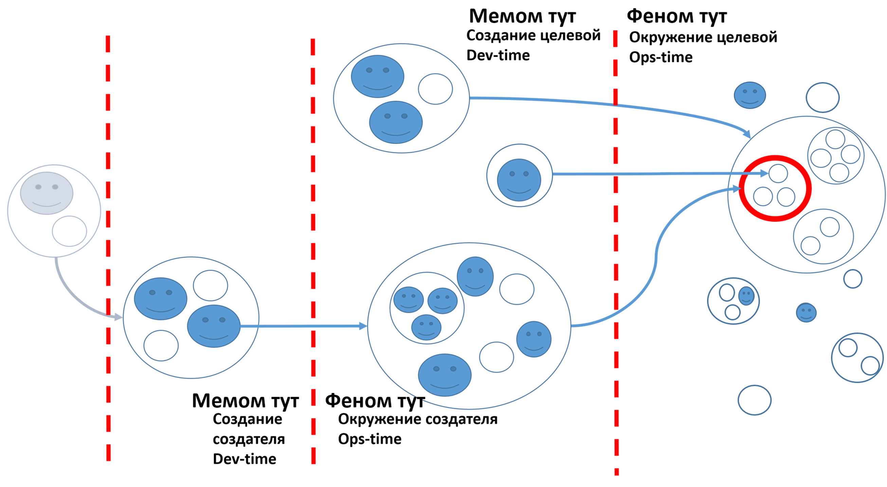

# Отношения создания

Простейший граф создателей метафорически (то есть весьма вольно) можно проиллюстрировать диаграммой:

На диаграмме целевая система (обозначена красным кружком, «начало координат» для системных описаний) находится в своём системном окружении/среде/environment, то есть входит в надсистему целевой вместе с другими какими-то системами. Надсистема обозначена объемлющим кружком в окружении, куда входят ещё другие кружки с кружками внутри — системы в окружении целевой с их подсистемами. Помним, что целевая система проходит техно-эволюцию. Она имеет свои подсистемы (кружки внутри красного кружка). Каждый уровень группировки частей в целой системе (обозначены как более мелкие кружки в объемлющих их более крупных кружках, и так на нескольких уровнях вложенности) — это системный уровень. Системный уровень подсистем целевой системы — три кружка-подсистемы в кружке целевой системы, два кружка вокруг целевой и сама целевая система внутри надсистемы — это системный уровень, на котором находится целевая система. Дальше мы не детализируем именно системные уровни, но просто отмечаем отдельные надсистемы.

Целевая система проявляет свои внешние свойства в надсистему «в ходе»/«во время» её работы/operations, это обозначено словами «феном[^r6-1] тут». Слова run-time часто используются в программной инженерии, чтобы обозначать время функционирования/работы/эксплуатации готовой системы. Но мы обозначили на диаграмме его другим, не менее употребимым словом — Ops-time, время работы операторов системы, когда система в рабочем состоянии, функционирует.

Целевые системы создаются и развиваются не сами (они саморазвиваться обычно не умеют, ибо не совсем живые, а в классической инженерии чаще совсем неживые), а создателями, выполняющими методы визионерства, разработки, архитектуры, DevOps/«инженерии внутренней платформы создания» и т.д. Системы создания включают в себя агентов с их инструментами. Агенты в узком смысле (автономные интеллектуальные вменяемые агенты) изображены кружочками с «лицами», а их явно неживое оборудование (от отвёртки до датацентра) — кружочками без лиц, организации изображены состоящими (композиция) из умных агентов и их оборудования и инструментов. Обратите внимание, что и во время эксплуатации/operations какие-то агенты на нашей картинке входят в окружение (например, пользователь::внешняя-роль-из-надсистемы компьютера::система входит в его операционное окружение, в отличие от компьютерного завода, который будет создателем компьютера и будет рассмотрен во время создания/dev-time).

Эти агенты-создатели создают и развивают (то есть часто просто как-то изменяют состояние, а не создают с нуля — скажем, красят, настраивают, добавляют функции, ремонтируют) целевые системы, подсистемы и надсистемы целевых систем. Агенты в самых разных проектных ролях имеют предметами своего интереса самые разные эмерджентные характеристики самых разных систем на разных системных уровнях, для этого они пытаются как-то спроектировать и предсказать по проекту успешность целевой системы (в эволюции — fit/«соответствие нише»), для этого они делают «умные мутации» в ходе развития системы. И для этого они совместно редактируют мемом системы в ходе её создания и развития. Это обозначено словами «мемом тут» во времени создания (слова «и развития» мы просто опустили для краткости, но развитие не менее, а часто более важно, чем создание MVP) напротив слов «феном тут».

Техно-эволюция, как и биологическая эволюция, включает «развитие вида», а не только «рост/изготовление одного организма/«экземпляра продукта». На каждом шаге техно-эволюции есть проект/design текущего поколения продукта::система с уровнем детальности, достаточным для изготовления (например, инструкции для станка с ЧПУ, а также инструкции сборочному роботу на машинном языке ЧПУ и робота). Этот проект/design сам является развёрнутыми разработчиками изобретательскими идеями (то, как функциональные объекты реализуются конструктивными объектами, как они расположены в пространстве, сколько стоят), и вот они в биологии находятся в геноме, внутри целевого организма (но в генной инженерии ещё и в памяти создателей, например в компьютерах лаборатории!), а вот в техноэволюции аналог генома — мемом, хранится у создателей. И в ходе «умных мутаций» (потенциально успешных изменений в идеях мемома) создаётся целевая система с набором её особенностей в готовом виде: мемом порождает феном, как и в биологии.

Слова для времени создания и развития из программной/software инженерии — dev-time (от «development»), часто design time. При рассмотрении создателей мы не рассматриваем работающую/эксплуатирующуюся в окружении целевую систему, а рассматриваем систему в момент её создания (замысливания/«стратегирования использования», проектирования, изготовления, ввода в эксплуатацию системы как MVP, а дальше поток инкрементального развития функциональности и конструкции). Остальные методы времени создания (инженерные обоснования, принятие архитектурных решений) тоже присутствуют, но они тоже опущены для краткости, главное, что понятно: речь идёт о ходе/времени создания, dev-time, а не ops-time. Системы создания и системы из системных уровней внутри и снаружи целевой системы рассматриваются в разные времена/realms, что отражено пунктирной вертикальной красной линией, которую пересекают стрелки отношения создания.

Есть время готовки борща (создатели — повара, рецепт борща как мемом), есть время есть борщ (целевая система — борщ с его свойствами как феном, окружением тут выступают ситуация обеда в ходе подачи, рот-язык-зубы в ходе еды, а также желудок в ходе переваривания. Но это уже всё ops-time, а dev-time — это изменение состояния свежих овощей, сырого мяса, воды создателями борща на кухне, до конечного состояния «борщ в тарелке, готов к использованию»). Есть время изготовления ракеты, есть время полёта ракеты. При этом работа инженеров с ракетой абсолютно не похожа на работу космонавтов в летящей ракете. **В системном мышлении принято** **чётко** **различать** **время, которое обсуждается, и главное время тут—** **использования/функционирования** **системы** **(все функциональные описания—** **в нём). Но** **есть ещё и время создания системы** **(все конструктивные описания—** **в нём), оно не главное, но тоже есть!**

Конечно, есть проблемы и единства рассмотрения этого времени, так называемая **проблема** **DevOps**, когда разработчики/создатели системы никак не связаны с операторами/пользователями и поэтому делают систему, которой невозможно пользоваться. Эта проблема решается прежде всего организационными мерами, но сегодня часто задействуют и технические меры: операторы и даже пользователи вообще исключаются как люди, заменяются роботами, так называемый подход NoOps[^r6-2]. В любом случае, в системном мышлении принято не столько считать всё происходящее в разработке и использовании принадлежащим к одному физическому времени, сколько различают «логические» времена создания (development, design, construction, implementation, enabling — везде в центре методы работы создателей, а целевая система тут пассивна, ещё не готова к работе) и времени эксплуатации (run, operation, use — функции/методы самой целевой системы, а создатели тут уже не работают, пассивны).

Можно тут обсуждать и цифровых двойников, но основная их роль — это «автоматизированное управление», замена оператора по настройке-подстройке параметров уже работающей целевой системы автоматом или составной конструкцией из человека (который крутит какие-нибудь ручки или меняет ненадёжные элементы конструкции в физическом мире) и информационной управляющей системы (которая говорит, куда какие ручки покрутить, что из элементов конструкции стало настолько ненадёжным, что хорошо бы заменить — софт занят «предиктивной аналитикой», например, для «ремонта по состоянию»). Цифровой двойник работает во время использования, а не во время создания.

Между системами в окружении (целевой, надсистемой, системами в составе надсистемы из ближнего окружения и т.д. — если встретилось слово окружение/среда/environment, надо всегда помнить, что это «операционное окружение»/«operations environment», то есть рассмотрение времени работы) и их создателями тоже отношение создания (development, design, construction, implementation, enabling в инженерии, в constructor theory — универсальное transformation), когда один создатель::система описывает и/или меняет другую систему. И таких систем можно рассмотреть целый граф по отношению создания, а если поглядеть на все такие цепочки как пути на графе, то это будет граф создателей: узлы — это системы (целевая и создатели) а рёбра — отношения создания. Внутри одного времени — отношения часть-целое/композиции, через границы времён/realms — отношения создания (X::система создаёт/«изменяет состояние» Y::система).

На диаграмме показан вариант такого графа создателей. Для каждого создателя тоже было его создание, и его эксплуатация/использование/работа/operations. Поэтому на диаграмме представлено несколько разных «времён» рассмотрения (realms), и что для создателя будет его ops-time, для целевой системы будет dev-time. А что для создателя его dev-time, то для создателя создателя — ops-time.

Разных создателей может быть много, пути на графе создателей могут быть длинными. Можно в мышлении двигаться по этим путям довольно далеко от целевой системы: каждого создателя тоже надо кому-то создать, и при системном моделировании мы в каждом проекте просто останавливаемся на той длине рассматриваемого пути на графе создателей, которая позволяет более-менее уверенно оценивать успешность целевой системы.

Топ-менеджеры в своих проектах регулярно работают с цепочками создателей из графа создателей на шесть-семь звеньев — и когда берут какие-нибудь примеры на три или даже четыре звена, удивляются, что модель плохо соответствует жизни. Скажем, вы рассматриваете продавцов, но не учитываете, что реально вы в ситуации какой-нибудь дилерской сети и ещё с «агентами у клиента», а не прямых продаж — и вы их всех зовёте «продавцами». Всё, вы потеряли одно звено цепочки создания, модель будет плохой.

На диаграмме показан сереньким «создатель создателя создателя целевой системы», чтобы не забыть про наличие именно длинных цепочек создания, а не одного отношения создания между двумя системами. Стрелки направлены в среднем слева направо, это обычное умолчание для показа времени с прошлым слева и будущим справа: сначала как-то появляется создатель, и только потом — создаваемая им система. Вместе же все цепочки создания, моделируемые как пути на графе — граф создателей, обычно направленный/directed ациклический граф[^r6-3].

**Отношения** **создания** — **это не отношения часть-целое!** **Enabling/constructionэтонеcomposition/part\_of!** **Кастрюля, в которой варится борщ—** **это не кастрюля в составе борща, или борщ в составе кастрюли! Это кастрюля** **для создания** **борща!**

А теперь поставьте крестик на любом из кружков этой диаграммы, которым в составе большой команды проекта будет заниматься ваша маленькая команда (возможно, в ней будете только вы один) — это будет «наша система» (system-in-hand, engineered system, MySystem, OurSystem). И повторите все рассуждения про целевую систему для нашей системы — ни на секунду не забывая про целевую систему и отношения нашей системы и целевой системы!

**Запутались? Запишите все эти системы в каком-нибудь редакторе текстов** **или другом моделере, как шахматист записывает шахматную партию. Думайте не** **«в уме»,** **думайте над текстом, или аутлайном, или таблицей!**

**Системное мышление подразумевает использование моделей/описаний, внимание должно удерживаться не в мозгу мыслителя, а документами (сегодня—** **электронными, в том числе информационными и имитационными моделями, вчера—** **бумажными документами).** **Мышление—** **это всегда мышление письмом и письменным моделированием!**

Наша диаграмма (тип изображения, в котором квадратики или кружочки обозначений объектов соединены стрелками для обозначения отношений) графа создателей в нашем руководстве используется исключительно в целях объяснения небольшого неизменяемого и никак не привязанного к проектам набора понятий. Она не будет модифицироваться в ходе проекта, она содержит очень мало деталей. Это иллюстрация в учебник, не рабочий инструмент системного моделирования. **Мы не рекомендуем диаграммное моделирование в рабочих проектах, но мы требуем вести в проектах обязательное системное моделирование в виде текстов, аутлайнов, таблиц: форматы, которые удобно менять/редактировать, производить в них поиск, наращивать их объём без боязни запутаться в хитросплетении связей**[^r6-4]**.**

**Документирование в системном мышлении важно. Внимание, которым управляют без записей, управляется ненадёжно. Люди забывчивы, поэтому документируйте/записывайте всё (всё-всё!).**

Как моделировать изменения состояний важных объектов в проекте, будет рассказано подробно в руководстве по методологии.

[^r6-1]: <https://ru.wikipedia.org/wiki/Феном>

[^r6-2]: <https://ailev.livejournal.com/1367897.html>

[^r6-3]: <https://en.wikipedia.org/wiki/Directed_acyclic_graph>

[^r6-4]: Подробней про системное моделирование на примере предприятий см. доклад А.Левенчука, 2022, "Как мы наладили обучение организационному моделированию", видео с 6:18:13, <https://www.youtube.com/watch?v=lpgpnCoV14w&t=22693s>, слайды <https://disk.yandex.ru/i/ixpCGYY4kROrmA>. Про вред от визуального моделирования см. книгу А.Левенчука «Визуальное мышление. Доклад о том, почему им нельзя обольщаться», 2018, <https://ridero.ru/books/vizualnoe_myshlenie/>
