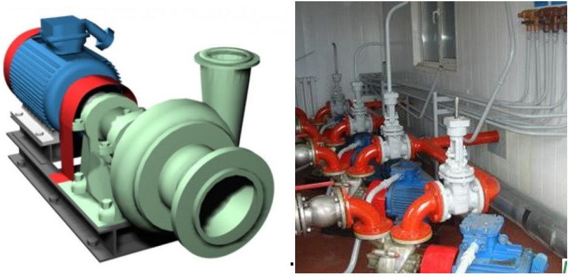
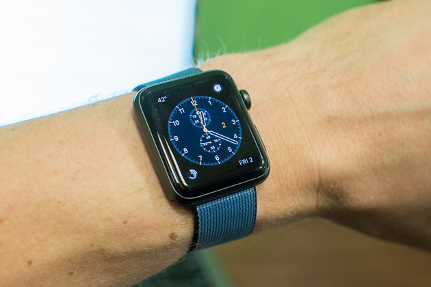
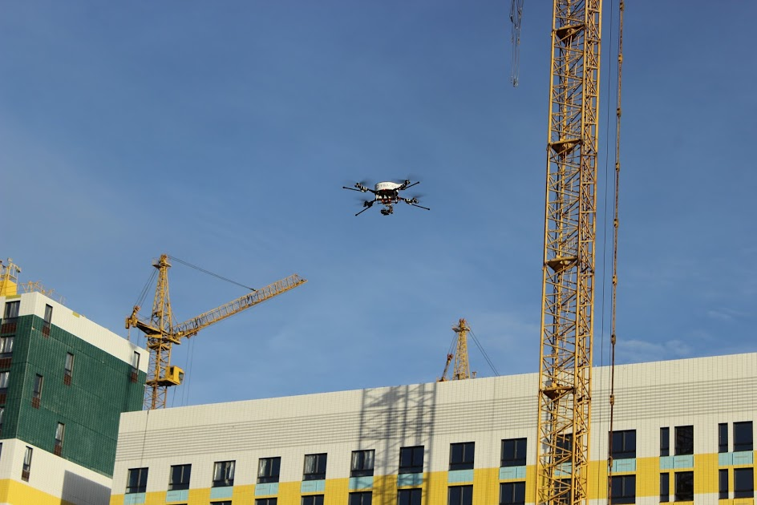

# Примеры системной терминологии

**Рассказ о целевой системе всегда начинается с её описания как чёрного ящика, при этом по факту приходится рассказывать не столько о самой целевой системе, сколько о** **надсистеме.** И это не случайно: системный подход начинается с того, что система определяется по её роли в окружении (ролевой/функциональный объект среди систем окружения), по её ролевому поведению/функции (изменениям состояний систем в окружении, которые проводит описываемая система как «чёрный ящик»).

**От границы целевой системы по системным уровням наверх, к окружению, к надсистеме—** **это первый мыслительный ход в системном мышлении, это главный императив. Никакого** **«деления на части»,** **никакого** **«состоит из»,** **пока не выяснили, для чего используется целое, в котором мы интересуемся частями—** **сначала само это целое «является частью в» и «входит в» и понимание, что там делает это целое в своём «надцелом»** **!**

Дадим пример использования терминологии системного мышления в описании простой механической системы с электрическими элементами — напорного насоса.

Целевая система — напорный насос, использованный в насосном агрегате (надсистема), который в свою очередь использован в насосной станции (т.е. наднадсистема — насосная станция). Его роль — напорный (чтобы вода доходила до верхних этажей здания) насос, действие/функция — поднимать давление жидкости. Одна из его подсистем — роторная сборка (ротор с лопатками, это центробежный насос/centrifugal pump).

Одна из внешних проектных ролей — собственник-оператор (owner-operator) насосной станции. Потребность — бесперебойный напор воды, выходящей из насосной станции. Потребность говорит не про насос как целевую систему, а про насосную станцию как наднадсистему. Потребности внешних проектных ролей чаще всего описывают надсистемы каких-то уровней. Хотя они могут описывать и системы создания, например «потребность — чтобы вы изготовили насос за три дня», но и тут чаще всего можно легко проследить как «нужное для надсистемы»: «иначе наша насосная станция не сможет приступить к работе вовремя».

Потребность бесперебойного напора воды, выходящей из насосной станции, отражается в архитектурной характеристике насоса «время наработки на отказ» и даёт повод задуматься об аварийном источнике энергии для мотора насоса — но помним, что аварийный источник энергии, как и сам мотор насоса будет тоже в надсистеме для этого насоса. Насосный агрегат состоит из насоса и мотора, на картинке показан насосный агрегат, насос в нём показан зелёненькой частью. Остальное — окружение насоса, входящее в состав надсистемы. Вот подробней:

* Насосная станция (наднадсистема)
* Насосный агрегат (надсистема)
* Насос (система)
* Роторная сборка как ротор с лопатками (подсистема)
* Ротор (подподсистема)

Концепция использования: напорный насос выдаёт в присоединённую к нему трубу напор до 40 метров, расход (проток воды) до 10000 литров/час. Архитектурная характеристика: наработка на отказ от 5000 часов. Никаких предпочтений в значениях важных характеристик («расход/проток воды как можно больше», «максимальная наработка на отказ»), ибо это уже договорённые конечные значения, предпочтения самых разных ролей в них уже учтены. Концепция использования и архитектурные характеристики описывают целевую систему (относясь к разным временам: время эксплуатации «в моменте», общее время эксплуатации), предпочтения описывают «хотелки» отдельных ролей. Они про разные объекты: концепция использования отражает успешность системы (описание «чёрного ящика», выполненное как отражение договорённостей ролей по поводу их предпочтений), а предпочтения отражают роли. Роли — это системы создания, предпочтения характеризуют роли, а не целевую систему. Роли будут продвигать гипотезы по поводу успешности системы в выгодную им сторону. Скажем, инженер-разработчик требует для насоса больший расход воды «для заведомой производительности с запасом», но совокупная стоимость владения будет тогда много больше — и инженер-разработчик с инженером-визионером (отвечающим за то, можно ли это будет продать, или весь проект становится невыгодным) договорились, что до 10000 литров/час будет достаточно, «наименее плохое решение».

Некоторые системы в ближнем окружении: мотор, рама (они входят в состав насосного агрегата как надсистемы, но они внешние по отношению к насосу), входящие в состав насосной станции, но не насосного агрегата электрическая проводка, трубы.

Некоторые создатели: конструкторское бюро (проектировавшее насос), завод (изготовитель насоса), проектировщик и строитель насосной станции (они принимали участие в создании: выбирали именно этот насос, закупали его, проводили монтаж на насосной станции), гаечный ключ (им закручивали гайки, которыми насос крепится к фундаменту). Неясно, насосный агрегат создавался строителями насосной станции, или поставка насоса шла сразу в составе насосного агрегата (то есть конструкторское бюро и завод выдавали насосный агрегат), это надо выяснять дополнительно.

Другой пример: электроника с островками софта — наручные смарт-часы.

Чтобы определить надсистему, в состав которой (в момент эксплуатации) входят смарт-часы, придётся рассмотреть западную христианскую традицию отношения людей к собственности. Личности-как-бессмертная-душа считаются владеющими собственным телом, которое при этом рассматривается не столько как сам человек, сколько как просто носитель::хард его личности::софт, принадлежащая личности вещь. Личность::софт владеет своим телом::хард/аппаратура, это его собственность, он принадлежит сам себе, это выражение «свободы воли». Человек в христианской традиции = личность-как-душа плюс тело. Это свойство людей называют обычно **самопринадлежностью**. Собственные вещи человека считаются просто продолжением его биологического тела. Никто не может взять тело человека или повредить его, точно так же никто не может взять или повредить его личную рубашку, личные часы — они считаются входящими в состав человека, буквально (отношение is\_part\_of/composition). Это и есть «священная частная собственность». Тело = биологическое тело плюс другие личные вещи и даже плюс средства производства (например, машиностроительный завод) в собственности личности.

Тем самым мы с некоторой условностью можем считать надсистемой для смарт-часов самого человека-владельца этих часов: часы будем считать буквально входящими в состав его тела. Для многих личных предметов и инструментов это подтверждается и нейрофизиологическими экспериментами: личности относятся к ним буквально как к продолжению их тела[^r6-1], «экзотелу».

Ещё одна интересная система этого класса, включающая людей — это **домашнее хозяйство** (household), которое может включать и самих владельцев, и дом, и домашнюю утварь.

В подобного сорта системах входящие в них люди-агенты одновременно и играют как актёры проектные роли, и они же представляют из себя «просто тело/организм», с которым мы работаем ровно как и с другими материалами, т.е. просто учитывая его физические свойства — размеры, влажность, прочность и т.п. Человек как агент физичен/биологичен/материален, так что он состоит из мышц, костей и других тканей. В системном мышлении учитывают и разумность человека-агента в части мастерства игры им какой-то трудовой роли, и его материальность как тела.

В примере со смарт-часами надсистема — человек-владелец этих часов, но не как личность::софт, а больше как принадлежащее личности тело/организм со всем на него надетым: рубашкой, туфлями, часами. Биологическое тело человека будет находиться в системном окружении часов.

Потребности/интересы личности владельца как внешней роли (владельца тела-с-часами): он должен быть информирован о точном времени, но этот список его интересов/потребностей по большому счёту остаётся открытым. Роль часов весьма сложна в формулировании, ибо речь идёт о гаджете с разнообразным поведением, то есть многофункциональном гаджете.

Концепция использования будет относиться не столько к самим «часам» как «измерителям хода времени», сколько к самым разным предполагаемым вариантам их эксплуатации — это могут быть как собственно часы, так и радио, плеер, измеритель пульса, также от смарт-часов ожидается, что они не натирают руку (кожа руки как часть тела-надсистемы находится в окружении смарт-часов!), ожидается, что они будут успешны, если будут модной на момент продажи расцветки, работать без подзарядки не менее 20 часов, вес будет не более 80 грамм, с ними будет работать магазин приложений, у них будет связь с внешним компьютером (смартфоном, планшетом, десктопом).

Системы в окружении — рука, одежда (как минимум, рукав рубашки или пиджака), зарядное устройство. Подсистема — защитное стекло (например, из Gorilla glass — закупается отдельно у контрактора, занимающегося производством защитных стёкол на заказ).

Создатели смарт-часов: конструкторское бюро, завод в Китае, магазин по их продаже в Европе. И вот если взять магазин как одного из создателей в роли «продавец», то про смарт-часы можно узнать много нового. Ожидаемое поведение магазина («магазина с часами внутри», что хочет владелец магазина от имеющихся в магазине во временной собственности часов, это stakeholder needs, потребности для целевых часов) — это продажи на какую-то немаленькую сумму, что легко переводится в гипотезу удобной упаковки часов для складской обработки (гипотеза! Может быть, это и не нужно, или удобство определено будет неправильно), красочной упаковки и буклетов для выкладывания в торговом зале, а также хорошей рекламы (то есть услуга рекламы рассматривается магазином как часть продукта — без какого-то уровня рекламы хороший магазин может просто не взять товар в продажу). И **часы-как-товар/упаковка-с-часами** получают тем самым дополнительные сценарии использования часов-как-товара магазином с целью вытаскивания из посетителей магазина денег в обмен на часы. По факту мы здесь вводим новую систему «часы-как-товар», упаковку с часами, отличную от часов и новую роль «посетитель магазина» (который может стать покупателем, а может и не стать им, а покупатель может стать потом пользователем часов, но может и не стать им). Момент использования часов::товар, то есть операция использования типа «товар» — продажа, то есть «поставка против платежа», а момент использования часов — смотрим на них время, ставим будильник, принимаем звонки. Не путаем использование товара магазином и использование часов их пользователем! Эту ошибку часто делают «предприниматели из акселератора»: они настолько увлечены идеей «продать», что свой «продукт» считают использованным не как продукт, а как товар! Что будет после покупки — их не волнует, часы для них могут быть и принципиально не ходящими, хоть макетом, лишь бы заплатили. Это ошибка: часы::продукт/система и часы::товар — это по факту разные системы, у них разные пользователи, речь идёт о разном времени (время создания, время продажи, время использования часов), о разных ролях создателей, разных ролях команд проекта.

Это очень важно — выявлять самые разные внешние проектные роли, выявлять их интересы, определять потребности (согласовывать приемлемые и желаемые внешними проектными ролями свойства надсистемы, иногда даже предлагать эти свойства — исполнители внешних проектных ролей часто и сами не знают, чего бы они хотели, или не считают то, что они хотят возможным, разработчики целевой системы могут что-то предложить им), а потом выводить из этих потребностей полную концепцию использования, описывающую поведение целевой системы в ходе использования/эксплуатации/operations/функционирования. Иногда приходится даже вводить новую систему (в нашем случае часы-как-товар) и не путать её с целевой системой (у них разные времена использования, разные функции по отношению к окружению, поэтому важные характеристики и устройство — разные).

Концепция использования с многочисленными сценариями использования самых разных возможностей/фич целевой (или любой другой) системы опишет систему, поможет с определением её границ: что будет система делать, а чего система делать не будет. Скажем, вот эти смарт-часы будут показывать время, а вот эти смарт-часы будут показывать время и артериальное давление (а дальше уже можно в концепции системы думать, как это всё устроить так, чтобы была приемлемая для продажи цена). В случае часов-как-товара понятно, что в состав целевой системы входят и упаковка, и рекламные буклеты, и даже транслируемая по каким-то каналам реклама. А вот в состав часов можно включать и какой-то дополнительный софт приложений для этих часов. Можно считать, что магазин приложений для этих часов будет системой создания каких-то фич/возможностей часов, но вот с упаковкой так считать уже не получится.

Этот пример показывает, что для разных ролей удобно по-разному описывать (уже имеющуюся или проектируемую) целевую систему, а иногда даже вводить в рассмотрение дополнительные системы. Для магазина эта самая упаковка-с-часами-и-реклама/часы-как-товар будет целевой: её нужно замыслить (товаровед!), изготовить (закупка! Логистика!), использовать (продать!). А сами часы? А они не нужны. Нужна упаковка-с-часами/часы-как-товар!

Современная инженерия часто имеет дело с **киберфизическими системами** (cyber-physical systems), которые имеют в своём составе датчики (sensors), воздействующие на внешний физический мир исполнительные устройства (actuators: чаще всего разные моторы, но это могут быть и осветительные приборы, электрические выключатели) и компьютер (cyber-, кибер-, управляющую часть), управляющий работой всей системы. Примером такой системы может быть дрон для аэрофотосъемки.

Надсистема — стройка (недостроенное здание в ходе его строительства плюс развёрнутый вокруг здания набор систем создания, «мероприятие создания здания»). Одна из внешних ролей в проекте — это заказчик-застройщик, потребность которого — подконтрольность хода строительства. Дрон-фотограф (определяется по его роли) — целевая система. Функция::поведение дрона — выдача потока фотографий высокого разрешения стройки с интересных заказчику-застройщику ракурсов. Фрагменты концепции использования: длительность полёта и фотографирования не менее 1 часа, изображение стройки получается с оптическим разрешением не менее 20 Мпикселей, зарядка между полётами происходит не более 1 часа, к зарядке дрон подлетает сам. Подсистема — фотокамера, подподсистемы дрона (подсистемы фотокамеры как подсистемы дрона) — объектив и матрица фотокамеры. Системы в рабочем/операционном/эксплуатационном окружении: зарядка, стройка с её зданиями, сооружениями и оборудованием (краны), в воздухе они могут рассматриваться как препятствия (например, трос от крана).

Создатели дрона-фотографа — конструкторское бюро, завод-изготовитель, магазин, ремонтная мастерская, эксплуатационная служба с оператором дрона-фотографа (эта служба как бы дорабатывает дрон перед каждым вылетом и после вылетов: проверяет, заправляет, настраивает, чистит, ремонтирует. Поэтому мы считаем, что эта служба не в системах окружения, а в системах создания — работает не в момент использования/«принесения пользы»/работы/функционирования дрона).

Ровно такой же рассказ будет и о менее классических системах, нежели традиционные для инженерии электромеханические (насос) и киберфизические (дрон, смарт-часы) системы.

Например, мастерство. Инженерии мастерства посвящено отдельное руководство по инженерии личности (личность — это совокупность мастерства агента). По факту это руководство, описывающее «мастерство одного создателя по созданию мастерства другого создателя». В реальных проектах такие графы создателей с длинными цепочками обучения (создания мастерства: один создатель создаёт мастерство создания мастерства у другого создателя, а тот продолжает эту цепочку, пока последний создатель в цепочке не делает нужное действие) довольно типичны.

по «мастерству создания мастерства», для системного мышления такие графы создателей типичны.

Возьмём, например, **мастерство системного мышления** — это такая целевая система, которая в момент её работы выполняет мышление::вычисление с понятиями системного подхода, причём реализована эта система какими-то конструктивными частями мозга или компьютера с программой AI, играющими роль этого мастерства (но мы даже не знаем точно, какими именно частями мозга или частями компьютера). Подсистемы мастерства системного мышления: мастерство мышления о системных уровнях, мастерство мышления о графах создателей. Надсистема мастерства системного мышления: интеллект, как общее мастерство мышления по всему интеллект-стеку фундаментальных методов мышления (опять же, мы понимаем, что оно тоже реализовано какими-то частями мозга и/или компьютера агента, но мы не очень понимаем, какими — что не мешает нам об этом мастерстве рассуждать, как о материальном объекте.

Более того, это может быть в случае командного системного мышления и несколько мозгов и компьютеров плюс средства коммуникации между ними). Системы в ближнем окружении мастерства системного мышления: мастерство онтологического мышления, мастерство собранности. Создатель мастерства —онлайн-версия руководства по системному мышлению как программа на серверах дата-центра и опционально наставники стажировки — они могут быть, но их может и не быть. Создатели создателя мастерства, то есть создатели онлайн-версии руководства по системному мышлению — автор текста руководства и заданий (Анатолий Левенчук), сотрудники и добровольцы мастерской инженеров-менеджеров с их LXP (learning experience platform) Aisystant.

[^r6-1]: Brandon Keim, «Your computer really is a part of you», <https://www.wired.com/2010/03/heidegger-tools>. Мозг управляет компьютерной мышкой так, как будто это и впрямь продолжение руки.
