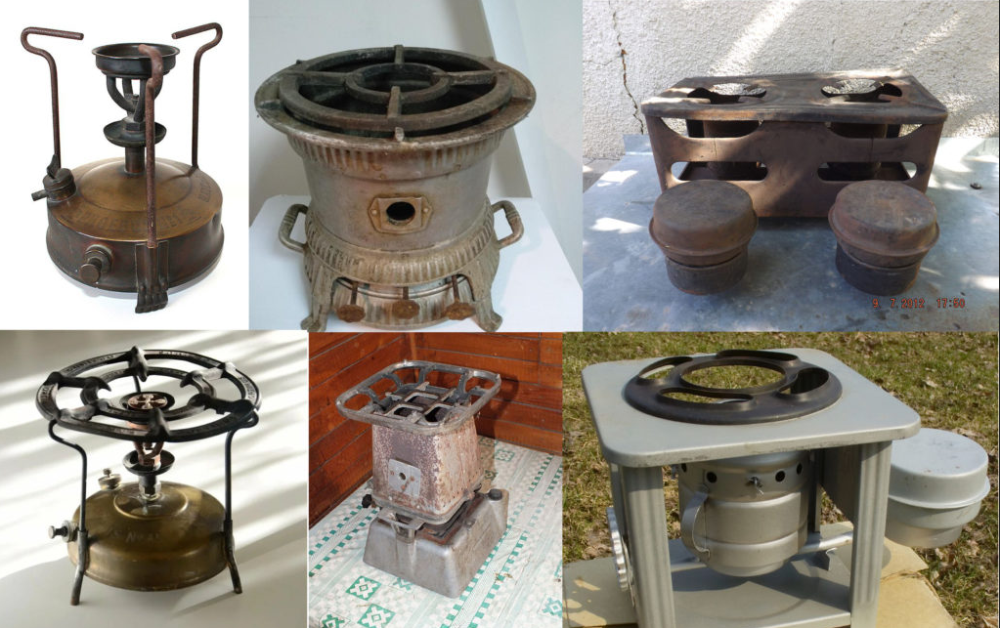

# Будущее и проактивность деятельности

Системное мышление даёт возможность понять, как думать о будущем. Будущее физично — это просто весь физический мир, только интересует его временной срез не прямо сейчас, а через некоторое время. Конечно, в будущем каждому::агент интересно что-то своё и этот интерес будет из самых разных ролей. Ещё не факт, что речь идёт о нынешних ролях, в будущем состав ролей будет другим. Например, роли «инженер по требованиям» в современной инженерии больше нет, осталась только в устаревших инженерных методах, а области интереса системных архитекторов десятилетней давности и области интереса нынешних архитекторов довольно существенно отличаются.

Возможное будущее определяется не «объективно», а субъективно самыми разными агентами в их взаимодействии. Нынешние агенты это будущее порождают/«воображают» (строят рендерингом, то есть добавлением множества «натуралистичных подробностей» из порождающих моделей мира, в которых можно найти только какие-то важные закономерности, без подробностей).

Мнения агентов по поводу того, что им интересно, какими бы методами работы в каких ролях они бы занялись, ещё и быстро меняются: ведь

* и мир меняется, и сами агенты меняются физически,
* а ещё меняются у агентов модели мира и модели себя, а также
* степень уверенности в точности этих моделей мира и себя,
* культура работы тоже меняется, содержание методов эволюционирует — и лучший метод на какой-то момент требует интереса к объектам, которые были неинтересны предыдущим версиям метода.

Поэтому для каждого интеллектуального агента (то есть необязательно человека) неинтересно всё будущее в целом, а интересно только то, что обычно интересно тем ролям, которые агенты играют в своей жизни, да ещё и в будущем сами эти роли меняются и интересы меняются вслед за изменением ролей и SoTA методов этих ролей.

Агентам, играющим роль домохозяек неинтересны примусы и керогазы сегодня, и ещё нужно найти людей, которые знают, что это такое — а ведь ещё лет пятьдесят назад это было обычной кухонной утварью. Автор нашего руководства отлично помнит и приготовление обеда на керогазе, и приготовление обеда на примусе — и это в ходе обычной городской жизни. «Накачать примус» — это регулярно поручалось даже детям, там ведь был встроенный насос!

Но потом в дома пришёл газ, SoTA методов нагрева пищи для домашней готовки разительно поменялись. А уж как поменялись за эти пятьдесят лет методы добычи и распределения газа!

Будущее представляется агентам как окружение для их целевых систем, которые эти агенты (например, люди) будут создавать и развивать в каких-то своих будущих проектных ролях. Окружение — это самые разные надсистемы. Какие? Это описывается будущими потребностями. Какие именно целевые системы будут люди делать в будущем? Это описывается будущими концепциями использования. Мы узнаём будущее по описаниям его целевых систем и их надсистем — по концепциям использования каких-то будущих (то есть пока не существующих, пока неизвестных нам систем) по удовлетворяемым потребностям, которых пока нет.

«Будущеведение» тем самым — проектирование систем. Проектирование — это как раз и есть «заглядывание в будущее». Концепцию использования разрабатывает (разработка сейчас, а само использование будет в будущем) подроль инженера-разработчика: инженер-проектировщик, а ещё там есть подроль инженера-технолога производства, который рассчитывает на внутреннюю систему разработки будущего, а ещё инженера-оператора, который сможет или не сможет работать, ибо будет работать в этом самом будущем, а общие характеристики системы определяет инженер-архитектор, его тоже волнует будущее, и ещё там визионер должен согласиться, что проект будет выгоден, а не пойдёт в убыток для команды разработчиков. Это не меняется ни для ближайшего (дни и месяцы), ни для среднего (год-три), ни для далёкого (от трёх лет — сегодня и на три года ничего загадать нельзя!) будущего. Инженеры всегда одним глазом смотрят на будущее, другим — на настоящее. Все проекты/design и проекты/project — они про будущее.

Деятели/практики/инженеры должны уметь строить **порождающие модели/generativemodels**, чтобы предвидеть детальное будущее, исходя из своих (иногда неосознаваемых) абстрактных знаний. Порождающая модель — это модель, из которой можно выполнить обратное моделированию действие: породить какие-то представления об исходном объекте моделирования, «вообразить» варианты мира, которые дали бы при моделировании модель. Если это порождающая мета-модель, то вообразить/отрендерить/породить/сгенерировать модель. Если это модель, то вообразить/отрендерить/породить/сгенерировать мир. А какие ещё модели есть? **Дискриминативные/discriminativemodels**, они дают нам классификацию, отвечают на вопрос «вот описание — что это за тип объекта?». Порождающие модели отвечают на запрос: «дай пример объекта, отвечающий описанию его типа». Порождающая модель по тексту (описание) сгенерирует картинку (добавит подробностей, уберёт абстракцию). А дискриминативная модель по тексту скажет тип объекта, который описан текстом (уберёт подробности, поднимет абстракцию)[^r6-1].

Когда вы попадаете в какой-то проект по созданию и развитию систем, после освоения мышления и работы по руководствам рациональной работы, системного мышления, методологии, системной инженерии, инженерии личности, системного менеджмента, вы уже не можете утверждать, что ничего не знаете об этом проекте! Вы знаете самые общие черты всех проектов — и это означает, что вы как-то сможете сориентироваться в этом новом для вас проекте. Если вы попадёте в будущее, то вы тоже увидите какие-то проекты — и сможете в них сориентироваться! У вас есть знание мета-мета-модели, это означает, что вы быстро разберётесь с мета-моделью (онтологией предметной области вашего нового проекта), моделью (важным про реальные объекты) и далее самим моделируемым миром. Это неважно, происходить это будет в далёком плохо прогнозируемом будущем (например, аж через три года), или вот прямо сегодня, но аж через пару часов.

Основатели фирм/founders как инженеры предприятия (которых называют часто «предприниматели», но мы избегаем этого термина: каждый под ним понимает свой набор ролей, а некоторые вообще считают, что речь идёт о «психологическом складе агента») зарабатывают на том, что иногда удачно оказываются в нужное время в нужном месте: предугадывают будущее, занимаются удачливым (удача тут важна!) визионерством::«метод/практика работы» (определяют в роли визионера, эквивалентной Шумпетеровскому экономическому предпринимателю, а не бытовому пониманию предпринимателя, какую целевую систему будет выгодно делать, а какую невыгодно) и стратегированием (определяют, какой из методов/способов работы позволит достичь желаемых результатов). Подробней это разбирается в руководстве по системному менеджменту (и там же даются материалы по рыночной экономике, ибо в плановой экономике всё это происходит существенно по-другому).

Тем самым основатели фирм корректно в случае удачи (или некорректно в случае неудачи — и такого много, много больше, просто о неудачах не рассказывают нигде) используют воображение, порождающее корректную картину мира в будущем.

Так, Элон Маск основывал фирму Tesla, предвидя, что электромобили будут хорошо продаваться. В его модели мира он учитывал, что стоимость аккумуляторных батарей для электромобилей будет понемногу опускаться каждый год, и в какой-то момент электромобиль будет выгодней автомобиля с двигателем внутреннего сгорания, и он оказался прав — где-то в 2022 году совокупная стоимость владения электромобилем и автомобилем с двигателем внутреннего сгорания стали примерно одинаковы[^r6-2]. Дженсен Хуанг, когда основывал NVIDIA, посчитал, что на компьютерах можно будет играть в графические игры — и если это будет развиваться, то потребуются аппаратные ускорители для видео. Так и получилось.

Стратегирование как выбор коллективного метода/стратегии работы фирмы — это ведущий метод

* серийного предпринимательства (основание фирм, эти люди называют себя founders),
* корпоративного предпринимательства (спонсорство проектов в проектном управлении, этим заняты отнюдь не только менеджеры или основатели фирм как «предприниматели», но все сотрудники фирмы, особенно на высоких должностях, то есть и люди на инженерных должностях),
* творческого проактивного принятия решений в любой другой деятельности (предпринимательство как проявление инициативы, исследования и творческая пытливость, деятельное визионерство).

Стратегирование происходит в ходе согласования интересов инженеров, которые могут создать какую-то целевую систему, продвиженцев, которые могут её продать, менеджеров, которые могут организовать предприятие, фандрайзеров, которые могут привлечь на всё это инвестиции. Это всё разные роли. Слово «предприниматель» может принимать множество значений (включая совсем уж бытовое «богатый человек» или даже просто «человек с рисковым характером»), в том числе речь может идти и о выполнении каких-то из перечисленных ролей, или даже любых необходимых для будущей фирмы ролей, то есть предпринимателем тогда называют не роль, а вот прямо агента. Мы табуируем слово «предприниматель» в силу многозначности его значений. Для **шумпетеровского предпринимателя** оставим в случае целевой системы термин **визионер**, а для системы создания — **бизнесмен**. Подробней обо всём этом будет рассказано в руководстве по системному менеджменту, и помним, что в случае фирмы минимально будет множество создаваемых систем:

* целевая система со своей ценой и создания, и продажи, это предмет заботы команды инженеров::роль фирмы. Выгодность продажи целевой системы тут.
* клиентура (все клиенты) этой системы со своей ценой создания и продажи команде инженеров и бизнесмену, предмет заботы команды продвиженцев::роль (продвижение — это маркетинг, реклама, продажи). Юнит-экономика как раз тут, выгодность этого продукта.
* сама фирма со всеми её людьми и оборудованием. Её сколько-то стоит создать (инвестиции), за сколько-то можно потом продать — и вот максимизация цены продажи тут — забота бизнесмена::роль. Выгодность продажи фирмы тут.
* а ещё надо создать инвестуру, которая даст инвестиции на создание фирмы, иначе нельзя будет создать ни саму фирму, ни её целевую систему, ни клиентуру.

Всё это, конечно, увязывается между собой в ходе стратегирования — а потом в ходе выполнения стратегии как метода достижения успешности всех этих создаваемых систем. Всё это стратегирование (определение стратегии как метода достижения успешности всех создаваемых систем), а потом планирование выполнения стратегии (планирование работ с учётом ресурсов, в том числе оно может приводить к понимаю, что выполнение стратегии с текущими ресурсами невозможно и нужно корректировать стратегию) — это работа с будущим, для этого нужны порождающие/generative модели и жёсткая критика со стороны дискриминативных/discriminative моделей

В любом случае, в ходе любого проекта по созданию и развитию систем придётся разрабатывать самые разные модели, описывающие целевую систему (концепцию использования и описания поведения системы в тестах для обоснования успешности системы, концепцию системы, архитектуру и проект системы, который доводит концепцию системы до детальности, достаточной для изготовления, и т.д.), и систему создания (например, модели стратегирования — бизнес-модель, модель оргразвития, модель согласования интересов).

Системность мышления предполагает, что придётся моделировать (мыслить моделированием) сразу с учётом нескольких системных уровней и сразу с учётом множества систем на этих уровнях. Скажем, если вы замысливаете выпуск электромобилей, то придётся продумать целевую систему в её окружении (электромобиль с окружающей его сетью дорог и сетью электрозаправок, а также внутри электромобиля самую дорогую подсистему: аккумуляторные батареи) и систему создания (автомобильный завод, который во много раз сложнее автомобиля).

Если вы просто как инженер придумали, как вместо пятнадцати отдельных деталей, которые потом соберутся в изделие сделать это изделие из одной детали, напечатанной на 3D-принтере и сэкономить тем самым на логистике, сборке и проверке качества сборки 15 исходных деталей, то это ровно то же самое предпринимательство-в-инженерии, проактивность/активная жизненная позиция, творческий акт. Инженер-проектировщик замысливает систему (концепция использования), изобретает концепцию системы, согласованную с возможностями методов изготовления (то есть участвует и инженер-технолог), визионер оценивает рыночные перспективы такого решения — будет ли это достаточно дешёво изготавливать даже не по сравнению с конкурентами, а для достаточного объёма продаж, чтобы это окупилось. Бизнесмен принимает решение, что фирма может инвестировать в создание такой системы.

Не факт, что создание какой-то системы проходит как отдельный явно оформленный проект внутри предприятия, тем более как отдельное предприятие фирма. Хотя если встанет вопрос о масштабе такой работы, то и отдельный проект может быть, а какого-то человека, который будет играть одновременно многие из этих ролей будут называть «корпоративный предприниматель», и даже отдельная фирма может быть сделана, а агент, который выполняет эту инженерную роль, будет заниматься ещё и менеджерскими задачами разворачивания с нуля фирмы, то есть будет ещё и инженером предприятия/менеджером, но в статусе основателя фирмы, «предпринимателя» в бытовом значении этого слова.

Мы не будем говорить «предприниматель», мы будем продолжать говорить про инженерные (целевой системы) и менеджерские (инженерии системы создания) роли, в том числе особые роли «шумпетеровского предпринимателя» для целевой системы (визионер) и фирмы (бизнесмен), подробней об этом говорится в руководстве по системному менеджменту.

Для любых ролей, занимающихся изменением мира (деятельностных/проактивных/практических/культурных/инженерных), нужно принимать решения о том, как именно нужно действовать, исходя из видения успешного будущего. Эти решения принимаются на основе порождённого

* из модели (детального описания)
* и/или мета-модели (предметного абстрактного описания),
* и/или даже мета-мета-модели (абстрактного трансдисциплинарного описания, на уровне общих представлений о мире)

такого реалистичного образа/видения будущего, который агент сочтёт приемлемым/выгодным для реализации, будет вкладывать в его реализацию свои (а иногда и чужие тоже: инвесторы — это тоже внешние проектные роли) ресурсы.

В ходе стратегирования вырабатываются в виде стратегии как набора моделей гипотезы об оптимальном поведении системы-создателя (стратегия — это как раз ожидаемо «оптимальный» способ/метод действий/работы, описание поведения), создающей успешную систему. Далее идёт планирование ресурсов, на тему выполнимости плана тоже делаются гипотезы.

Выработкой стратегий, порождением альтернатив в действиях, последующим принятием решений по поводу этих альтернатив занимается фундаментальный метод мышления — рациональность, на которой базируется системная инженерия: как порождать альтернативы/опции для решений, а затем выбирать одну из этих опций для реализации. Подробней об этом будет ещё в руководствах по системной инженерии (рациональность в принятии инженерных решений) и интеллект-стеку (рациональность как один из фундаментальных методов мышления в составе интеллект-стека, роль «разум»).

Главное тут запомнить: можно как-то разделить труд в принятии таких крупных решений (например, решения о строительстве атомной станции или запуске космического корабля на Плутон), но в принципе методы рационального поведения тут для любых агентов остаются одни и те же, только мышление::вычисления становится сложнее, самого мышления по объёму вычислений становится больше, это мышление становится коллективным.

Но ровно то же самое по методу рациональное мышление::вычисления происходит, когда вы решаете предпринять проект «оторваться от работы и попить кофе». Никакого разделения труда, объём вычислений ничтожный, они занимают мало времени и отвлекают мало агентов: вы сами генерируете/порождаете альтернативы — отрываться или не отрываться от работы, пить кофе или чай или вообще пообедать, пить кофе без отрыва от работы, оторваться от работы и просто отдохнуть-полежать без кофе и т.д. Затем вы собираете информацию для принятия решения (оцениваете объём оставшейся работы, смотрите на часы и вспоминаете, когда вы пили кофе перед этим, идёте на кухню и интересуетесь наличными сортами кофе и чая и т.д.), затем принимаете решение (тут работает теория принятия решений).

Мышление об ожидаемом успехе труда/деятельности/практики/инженерии/методов/способов работы собственной и других агентов (как сотрудничающих, так и мешающих), устроено одинаково по методу: порождение гипотез по успешным методам/способам действий, выбор наиболее вероятного в плане успешности способа/метода действий в условиях неопределённости, планирование ресурсов, выполнение действия, нахождение расхождения с моделями мира, себя, затем уточнение этих моделей и выполнение следующего прохода — порождение смарт мутаций для гипотез и т.д., причём всё это происходит более-менее одновременно. Одинаковость будет для ситуаций:

* инженерии себя (как тела и как личности) как серии шагов по инвестиции себя в какую-то деятельность, обучения чему-то, тренировке тела, получения умений для занятия какими-то видами проектов,
* «корпоративного предпринимательства», когда инвестиции делаются в создание какой-то системы, нужной компании/организации (инженеры и менеджеры в больших компаниях),
* «технологического предпринимательства» (стартапов, выстраиваемых вокруг каких-то методов с их инструментарием), когда инвестиции делаются в создание систем, которые будут пользоваться рыночным успехом,
* «социального предпринимательства», когда инвестиции делаются в создание систем уровня сообщества, общества и даже человечества.

**Всё это** **опирается на действия, ориентированные на будущее:**  **проактивность/инициативность/деятельность/предприимчивость как необходимая часть** **труда/практики/деятельности/инженерии/культуры/метода работы, заключающаяся в рациональном принятии решений** **по поводу попадания** **в будущем в улучшенное какими-то действиями состояние мира: генерировании разных вариантов будущего,** **исходя из лучших наших порождающих моделей,** **сборе информации об этих вариантах, принятии** **решений о реализации одного из них,** **а затем вложении** **сил, денег, ресурсов, нервов** **(если речь идёт о людях-агентах), времени в реализацию** **этого** **оптимального/рационального по** **соотношениюпотенциальных** **выгод и рисков** **варианта.**

**Рациональный агент готов на временное ухудшение своего состояния, уменьшение своих ресурсов на время какого-то действия—** **чтобы оказаться после этого действия в мире, где его состояние лучше, чем ожидалось бы в момент планирования на тот же момент в будущем, где этого действия не было. Рациональный агент предприимчив, инициативен, проактивен (впрочем, это уже говорили в предыдущем абзаце).**

Самые успешные деятели — это те, кто творчески генерируют больше вариантов, а потом ухитряются рационально выбрать оптимальные из них на базе самых современных точных моделей мира (включая модели себя!). **Определяющая характеристика в продуктивной деятельности тем самым—** **качественное порождающее моделирование** **самых разных вариантов моделей,** **затем** **качественная различающая/discriminativeкритика, что ведёт к качественной модели мира.Забота системного мышления—** **прежде всего качественная модель мира (в том числе «модель себя» для агента как части мира).**

А занимаются этим «предпринимательством» (помним, слово табуировано, потому что по факту за ним скрываются самые разные методы, которых придерживаются самые разные роли) практически все агенты (люди, AI, организации), хотя не все выбирают быть основателями компаний, быть собственниками бизнеса и тем самым получать не только все возможные прибыли, но и все возможные убытки.

Умных людей удивительно много, миллиардеров удивительно мало: умные люди часто трезво оценивают свои шансы и не играют в рулетку с непрерывно меняющимся рынком, непрерывно идущей техно-эволюцией, это очень нервно и хлопотно и не всем нравится, а даже если и нравится, не у всех получается. Всё это будет более подробно рассмотрено в руководстве по системному менеджменту.

[^r6-1]: <https://www.youtube.com/watch?v=hjsZSmL67Ck>

[^r6-2]: <https://www.leaseplan.com/corporate/~/media/Files/L/Leaseplan/2022-CCI-Report_final.pdf>
