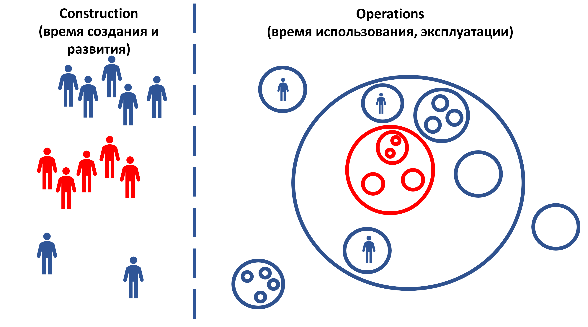

# Рекурсивное рассмотрение в системном мышлении

Если рассмотреть надсистему нашей целевой системы как чёрный ящик, то она будет целевой для команды важнейших внешних ролей проекта. И описание надсистемы как чёрного ящика будет для этих внешних ролей концепцией использования их целевой системы, которая для команды — целевая.

Когда из концепции использования ещё делали требования, то это описание часто так и называли: **требования** **внешних проектных ролей** (stakeholder requirements/stakeholder needs, не путать с system requirements, **системными требованиями**, которые называют просто **требования**, опуская слово «системные»), но чтобы меньше путать это описание надсистемы-как-чёрного-ящика с описаниями целевой системы-как-чёрного-ящика, это описание надсистемы как чёрного ящика чаще называют **потребностями** (stakeholder needs, нужды/потребности внешних проектных ролей), а ещё всё чаще и чаще называют их **ролевыми интересами или предпочтениями**. Скажем, мы::команда делаем шестерёнку к часам, то есть целевая система команды — шестерёнки. Потребности/needs — к часам::надсистема, а сценарии в концепции использования будут для шестерёнки::«целевая система».

Тем самым в проекте обычно **в концепции использования** **описываются два** **«чёрных ящика»**:

* **надсистема** — описывается интересами/предпочтениями в каких-то характеристиках надсистемы, важных для внешних проектных ролей (потребностями, stakeholder needs). По предметам интереса к надсистеме могут быть разные предпочтения, вот надо сделать гипотезу о том, какие значения характеристик всех устроят, а дальше не бояться корректировать эту гипотезу по ходу проекта. Исходить надо из того, что надсистема — это не просто что-то «данное в ощущениях», неизменяемое, «спущенное с небес». Нет, окружение целевой системы тоже сделано создателями, тоже непрерывно меняется, и можно выдавать гипотезы о том, как оно там должно быть устроено. Современная инженерия основывается на том, что вы непрерывно корректируете ваше понимание мира, корректируете ваше знание о ситуации использования целевой системы, знание о возможностях команд, которые создают надсистему подкорректировать окружение целевой, знание о том, как лучше удовлетворить потребности путём модификаций целевой системы так, чтобы она улучшила работу надсистемы. Вам надо не только учесть разнообразные предпочтения внешних проектных ролей в отношении надсистемы как окружения целевой системы, но и учесть возможные изменения в этих предпочтениях.
* **целевая система** — описывается как «чёрный ящик» преимущественно постепенно детализирующимися сценариями использования. По большому счёту тут то же самое рассмотрение, что и для надсистемы, в ISO 15288:2023 это называется **рекурсивным применением системного мышления**.

А ещё описываются **два «прозрачных ящика», но один в концепции использования, а другой—** **в концепции системы**:

* **Надсистема** — описывается прежде всего концепцией использования целевой системы с акцентом на роль/функцию целевой системы в надсистеме. Показывается, каким образом наличие целевой системы в составе надсистемы приводит к удовлетворению интересов/предпочтений/потребностей/needs внешних проектных ролей. Это и есть важное для нас «устройство надсистемы», прозрачный ящик. Концепция использования — это в какой-то мере концепция надсистемы (рекурсивное применение системного мышления! На каждом уровне происходит одно и то же) с точностью, достаточной для описания целевой как чёрного ящика, выполняющего какие-то функции в надсистеме так, что становится понятным удовлетворение интересов внешних проектных ролей. Для настенных часов надсистема — интерьер и люди в интерьере, надо описать, что там окружает часы и как взаимодействуют (например, мешает ли людям громкое тиканье часов по ночам).
* **Целевая система** — описывается концепцией системы, в том числе архитектурой как дополнительными решениями по конструкции системы (с ожидаемым влиянием архитектурных решений главным образом на архитектурные характеристики/«предметы интереса», а не функциональность). Конечно, концепция системы и в том числе архитектура показывают, как удовлетворяются интересы не только внешних проектных ролей (их интересы больше описывает концепция использования), но и внутренних/командных проектных ролей, то есть интересы визионеров, разработчиков, архитекторов, инженеров производственной платформы целевой системы. Например, для часов с заданной точностью хода на их внешней границе надо принять решения по их внутреннему устройству: будут ли использованы в часах драгоценные камни для уменьшения трения и тем самым повышения точности хода, или в настенных часах это — роскошь, требуемая точность хода будет достигнута просто путём использования твёрдых сплавов для осей и подпятников. Или вообще настенные часы делать не механическими, а электронными, чтобы достичь требуемой точности хода.

На диаграмме целевая система и её подсистемы показаны красными кружками, отношение «часть-целое» показано вхождением кружков друг в друга. Окружение — синие кружки, ближайшая надсистема — синий большой кружок, в который входит и целевая система, и несколько других систем. Конечно, есть и ещё какие-то системы в окружении, которые не входят в состав надсистемы. Системных уровней много и внутри границы целевой системы, и вовне границы целевой системы.

Внешние проектные роли времени использования показаны синими человечками, но это не люди. Это роли, исполнять их могут и люди, и люди с компьютерами, и команды, и фирмы со всеми их людьми и оборудованием. В рассмотрении operations такие внешние роли, например, «пользователи», при этом мы рекомендуем общий тип «пользователь» нашей мета-мета-модели всегда заменять на тип роли из мета-модели (предметной области целевой системы) — в играх это игрок::пользователь, в бухгалтерских системах бухгалтер::пользователь и аудитор::пользователь. Но внешними проектными ролями могут быть и вредители/хакеры, и инспекторы внешних надзоров — кто угодно, кто взаимодействует с целевой системой в operations time. Эти роли показаны в кружках, чтобы подчеркнуть, что это тоже системы в окружении (роль — ролевой объект, который играется каким-то агентом как конструктивным объектом).

В рассмотрении времени создания (construction time) создатели::системы, мы просто не рисуем кружки и их вложенные/внутренние части.

На всей диаграмме отношения создания (между правой и левой частями диаграммы), и взаимодействия между системами одного уровня при их работе (между кружками одного уровня) не показываем. То, что делить на части системы можно очень по-разному (скажем, функционально и конструктивно: как ложку — «держало» и «хлебало» будут двумя функциональными частями ложки, но конструктивная часть цельнолитой или даже деревянной ложки будет одна изготавливаемая «деталь»-конструктив), тоже не показываем, хотя в концепции системы множественность согласованных между собой разных видов описаний в рамках одного системного описания будет принципиальной. Обычно рассматриваются ещё и разные варианты согласованных декомпозиций (включая ещё и размещение, и ценовую декомпозицию — что там сами изготавливаем, что отдаём). И дальше изо всех согласованных между собой вариантов разных декомпозиций оставляем только «наименее плохой вариант из согласованных», ибо «лучший вариант» недостижим в эволюции, всегда удаётся достичь только локального оптимума.

Важно для этой иллюстративной диаграммы то, что «синенькие» внешние роли во время создания и развития занимаются устройством «синенького» (надсистемы) на диаграмме, а вот «красненькое» для них — «чёрный ящик». А «красненькие» внутренние проектные роли (роли команды проекта) вынуждены и выяснять прежде всего синенькое, но и дальше идти внутрь «красненького», то есть рассматривать сначала окружение «чёрного ящика» (ближайшую надсистему как «прозрачный ящик», но и надсистемы в дальнем окружении), а затем делать «чёрный ящик» прозрачным — формулировать гипотезы не только о функциональности целевой системы как чёрного ящика (концепция использования), но и о конструкции (концепция системы, в том числе начальные архитектурные решения).

Команда проекта создания и развития целевой системы создаёт её концепцию. При создании концепции чаще всего начинают с описания функционального разбиения, получив понимание, что там происходит внутри системы в терминах ролей подсистем (подсистем как ролевых/функциональных объектов), а также функций подсистем. Например, «чтобы часы показывали время, когда на них поглядят ночью, мы сделаем постоянно светящиеся стрелки, днём этого не будет видно, зато ночью всё будет хорошо» или «чтобы часы показывали время, когда на них поглядят ночью, мы предусмотрим, что при падении освещённости в окружении часов будет включаться подсветка» или «для удешевления часов мы не будем учитывать, что на них будут глядеть ночью, если очень надо, пусть поставят какую-нибудь подсветку комнаты, чтобы осветить циферблат». Эти описания будут концепцией использования подсистем (рекурсивное применение системного мышления!), при этом сами подсистемы ещё придётся проектировать, придумывать метод изготовления и материалы, из каких надо будет эти системы изготавливать (надо будет найти аффордансы, которые станут конструктивами системы). Скажем, в примере с «часами ночью» придётся придумывать, из чего делать подсветку циферблата — светодиоды, лампочки накаливания, люминофоры. Что-то подойдёт (аффорданс — это «подходяшка»), что-то не подойдёт для того, чтобы выполнить ожидаемую функцию подсистемы в составе целевой системы.

**Системное мышление рекурсивно, оно применяется одинаково на каждом системном уровне, каждой командой-создателем систем. И каждая команда имеет свои** **«системные координаты»** **вокруг своей целевой системыи отдельно ещё и** **«их системы»,** **поэтому самое важное—** **это договориться, что же это за системы!** **Договариваются, описывая прежде всего поведение системы по отношению к надсистеме** **(сначала вверх по уровням!), стараясь описывать систему как «чёрный ящик», чтобы потом можно было пробовать в качестве гипотез самые разные варианты устройства этой системы, то есть рассматривать самые разные варианты системы как «прозрачного ящика»** **(вниз по уровням—** **потом!).**

Мы в разделе объясняем рекурсивность только на примере двух уровней (система-надсистема), но эта рекурсивность используется на всех уровнях — и для системы с подсистемами, подсистем с под-подсистемами и так далее до элементов систем, и для надсистем и окружения надсистемы, тоже на много уровней. На всех уровнях вокруг любой системы можно (и даже нужно) развернуть полное системное рассмотрение примерно так же, как развёрнуто оно вокруг целевой системы.

Системное мышление говорит, что концепция использования (раньше — потребности и требования) описывает две разные системы (надсистему как «прозрачный ящик» и целевую систему как «чёрный ящик»). Но методы/способы того, как именно выявить интересы/потребности/предпочтения внешних проектных ролей в каких-то важных характеристиках надсистемы и сформулировать концепцию использования, как их не пропустить в разговорах с внешними проектными ролями, затем не потерять в коллективном внимании участников проекта создания и развития системы, как оттрассировать (trace, соотнести) поведение целевой системы к потребностям (там же эмерджентность, появляются новые свойства, например, надо обосновать, почему использование шестерёнок из материалов с небольшим тепловым расширением приводит к увеличению точности хода в механических часах), какие нужны ещё дополнительные методы, которые позволяют не просто управлять вниманием к системам, а ещё создать и развивать эти системы, причём в конечном итоге сделать их успешными — это говорится в руководстве по системной инженерии, это выходит за рамки нашего руководства. В руководстве по системному моделированию говорится только о том, что «если вы хотите описать систему как чёрный ящик, то это вы хотите разработать её концепцию использования».

**Как именно разрабатывать** **концепцию использования, какой метод брать? Как выглядят результаты разработки разными** **методами/способами/стилями** **(есть много** **вариантов)? Это всё** **будет** **в** **руководстве по** **системной инженерии, а для систем** **разной природы** **(роботов, мастерства, организации и т.д.) будет ещё и уточняться в каких-то** **руководствах по прикладным инженериям и менеджменту.**

Наше руководство пока касается только понятийного наведения внимания на системы и системные описания, оно пока не про то, как делать системы (методы/практики/культуры работы), а про то, как думать о системах, когда их делаешь, как их моделировать. В нашем руководстве описываются типы мета-мета-модели объектов методов работы, например типы «система», «системное описание», «концепция системы». Руководство по системному моделированию наставляет о том, что именно следует системно моделировать в проекте, оно про мышление моделированием: какие объекты в жизни надо брать для описания в них важного (моделирования), что в них важного (какие модели нужны).

Но как именно моделировать, когда моделировать, кому (роли!) моделировать — это в руководстве по системной инженерии, а потом и в руководствах по прикладным инженериям (например, если у вас система — организация, то в руководстве по системному менеджменту, если у вас система — мастерство, то в руководстве по инженерии личности).

Из нашего руководства по системному моделированию вы должны лишь понимать, что **концепция использования** **привязана** **к границам целевой системы и надсистемы соответственно, они** **не должны быть упущены вашим вниманием, они** **обязательно** **должны присутствовать в проекте!И ещё** **в концепции использования** **должны** **быть помянуты** **архитектурные характеристики (о них позаботятся не** **разработчики::«внутренняя/командная роль», которые готовят концепцию использования, а архитекторы::«внутренняя командная роль»). Все эти модели::описания системы как чёрного ящика** **документируют.** **Конечно,** **без** **разработки концепции использования** **систему можно сделать** **(строители** **египетских пирамид их построили, но вряд ли там была разработана и документирована концепция использования), но успешной она может стать только случайно** **(например, не надо спрашивать, сколько лет строились пирамиды, сколько они при этом стоили, и сколько недовольных проектом погибло. В государственных проектах до сих пор крайне не любят прописывать концепции использования, это не случайно).**

Исполнители ролей, которые замышляют (концепция использования, постепенно детализируемая всё время проекта), проектируют (концепция системы, постепенно детализируемая всё время проекта), изготавливают (воплощение системы, при этом тоже всё время проекта — речь не только о создании, но и о развитии системы), ликвидируют целевую систему (до этого дело доходит редко, но доходит) или отдельные какие-то части уже имеющейся и работающей целевой системы, чтобы получить новую фичу/возможность — это «**организация** **проекта»::создатель** (люди, AI, их оборудование и материалы труда). Этих исполнителей внутренних проектных ролей часто называют командой проекта, рабочей группой проекта, а иногда и просто проектом. Будьте внимательны к типам: тут не проект/design, а проект/project, и не проект::поведение, а ещё и проект::организация. Путаница между объектом и его поведением, обычная в быту для ролей и функций, в случае проектов традиционна. Проверяйте: ваш «проект» — это «команда проекта» или «поведение команды проекта»?

Организация определяется её подчинённостью: как она сотрудничает и работает совместно, но в ней важны проявляемые в окружение роли, которые организация может играть как «коллективный актёр» с его реквизитом. Организация (команда, коллектив из нескольких команд, предприятие из нескольких коллективов, кооперация из нескольких предприятий, рабочая группа проекта, собранная из самых разных людей с возможностью использования ими самого разного оборудования, и т.д.) — это **оргзвено, коллективный актёр**. Обычно для механической целевой системы создатель — организация. Но в графах создателей одна организация может создавать другую (часто такое называют «оргпроект», «проект организационного развития»).

А внешние проектные роли? Это те, кто напрямую не подчиняются в выполнении своих ролей исполнителям ролей в команде проекта. Есть и промежуточные ситуации: команда подрядчиков из другой фирмы, занятая нашей целевой системой, считается исполнителями внутренних ролей, поскольку формально она работает над нашей целевой системой (например, делает какую-то подсистему для этой целевой системы, или оказывает какой-то сервис, помогающий сделать целевую систему), а не над нашей надсистемой. Но она же считается внешней, ибо подчинение исполнителей ролей в рамках контракта будет только частичное. Так что роли в команде клиента — внешние, роли в команде проекта по созданию целевой системы — внутренние, а роли в команде подрядчика — серая зона, разные люди считают их разными (хороший тон считать их внутренними, но жизнь часто заставляет просчитывать ролевые интересы примерно так же тщательно, как для внешних ролей — «на Аллаха надейся, а верблюда привязывай»).

В предыдущем абзаце явно связывались отношения подчинения исполнителей ролей/агентов друг другу (кто чей будет начальник, а кто не начальник, а просто исполнитель роли клиента или инспектора, или ещё кого) с тем, какие роли будут считаться внешними, а какие внутренними. Да, **современное системное мышление** **начиная со второго поколения занимается** **не только** **целевыми системами, но и системами создания, в том числе и из людей и** **AI,** **в том числе коллективными создателями.** Тем самым системное мышление не только применимо в инженерных рассуждениях по отношению к «железным» или программным системам, оно применимо и в менеджерских (инженерии предприятия: стратегических/визионерских, организационных, операционных, административных) рассуждениях по отношению к коллективным системам из агентов (в том числе из людей, AI, компьютеров и оборудования — предприятиям, организованным рынкам/маркетплейсам, саморегулируемым организациям, и т.д.).

Да и к любым другим системам системное мышление тоже можно применять, хотя чем выше **эволюционный/системный/организационный уровень, тем сложней будет договориться даже по поводу** **концепции использования, а уж о** **концепции системы как способе реализации концепции использования** **и подавно.** **Это происходит из-за неминуемых конфликтов между системами разных уровней и неустроенности в том, какова могла бы быть концепция системы.**

Физическая теория эволюции говорит, что нельзя достичь истинного/глобального оптимума. У вас каждый раз гипотеза о том, что вы достигнете нового уровня квазиоптимума/«локального оптимума», получите наименее худшее инженерное решение, можете его пытаться незначительно улучшать, очень редко получится резко улучшить (придётся поработать на многих системных уровнях — большой эволюционный переход/major evolutionary transition), но всегда будет куда стремиться, это всегда будет квазиоптимум. Развитие жизни бесконечно, развитие технических систем тоже бесконечно, это часть техно-эволюции — всегда есть что улучшить, но любое улучшение не окончательно.

Системное мышление фундаментально/трансдисциплинарно: оно позволяет в том числе договорить продуктивно конфликтующие (разные интересы!) роли инженеров целевой системы (визионеры, разработчики, архитекторы, инженеры производственной платформы/внутренней платформы разработки), инженеров системы создания/менеджеров (бизнесмены, организаторы, орг-архитекторы, администраторы), добавить участниками этих договорённостей самые разные роли из других затрагиваемых проектом сфер деятельности, договорить их всех друг с другом в рамках коллективного мышления, коллективной деятельности по созданию систем.

Нет «прикладных проектов» какой-то направленности, для которых системное мышление было бы особо пригодно, а для других — не особо пригодно. Системное мышление универсально пригодно: используется и в проектах::«поведение команд для получения результата», и для того, чтобы сформулировать цели проекта, прежде всего — сформулировать целевую систему проекта. Например, системное мышление отлично работает, когда надо принимать решения при основании предприятия, когда ещё непонятно, какую конкретно целевую систему будет делать команда (какова рыночная гипотеза), поэтому и команды обычно тоже ещё нет — и ставится задача инженерии предприятия с нуля («business engineering», включая предложение бизнес-модели), которая уже и займётся проектированием «железной» или «программной» технической системы, развивая начальную приблизительную догадку о том, какова это могла бы быть система.