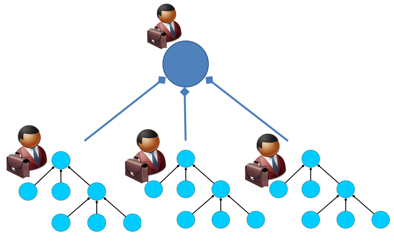

# Системы систем

Иногда систему, которая состоит из других систем, называют «системой систем». Это неправильно, это просто система, а другие системы в ней — это подсистемы. Вроде как не нужно специально подчёркивать тот факт, что любая система состоит из систем. Тем не менее, термин **система систем** (system of systems, SoS) есть, он закреплён за особым случаем выделения систем по социальным характеристикам систем их создания и особенностям времени создания, а не по чисто техническим особенностям вложенности систем друг в друга в окружении и работы в ходе использования.

**Системой систем называют такую систему, которая** **имеет** (критерии Maier[^r6-1]):

* независимые системы создания/enabling её подсистем (у ответственного за SoS нет полномочий предписать общее развитие-модернизацию для входящих в SoS систем)
* подсистемы, которые могут работать независимо от существования целевой системы (нет полномочий по указанию владельцам систем, как им работать)
* эмерджентность/системный эффект от объединения в систему (кто-то::создатель желает получить от целевой системы систем функцию/поведение, которое невозможно получить от работы с входящими в систему систем отдельными системами, и требуется совместная работа этих входящих в SoS независимых **составляющих/constituentсистем**).
* эволюционное развитие (понимание того, что будет происходить в системе систем на каждом следующем шаге программы создания системы, требует исследований и дополнительных согласований, ибо нет роли, которая знает, как в каждый момент устроена система систем — подсистемы системы систем как автономные системы меняются независимо. Поэтому идёт череда модернизаций, а не разовое спроектированное проектное действие. Впрочем, это мало сегодня отличается от «обычной инженерии», ибо и с «просто системами» тоже ведут эволюционное развитие, хотя в этом случае про устройство системы организации инженеров всё известно, подсистемы не автономны).
* географическое распределение входящих в SoS систем.

Эти критерии различаются, конечно, в разных инженерных и менеджерских школах, но общее остаётся:

* обычные «системы» подразумевают централизованное «владение» системой — наличие проектных ролей/stakeholders/«заинтересованных сторон», полномочных принимать решения по всем частям системы, полномочных распоряжаться всем, что в границах их системы. Это традиционный случай: автомобиль с двигателем и колёсами, железнодорожный мост и компьютер — это типичные «просто системы», у них есть свои системные инженеры, которые полностью определяют их функции, конструкцию, возможности по работе в том или ином окружении, составляют и выполняют планы по модернизации и выводу из эксплуатации. У каждой из этих «просто систем» есть один хозяин, один владелец.
* в системе систем каждая из входящих в неё систем имеет своего хозяина, и входящие системы могут работать/эксплуатироваться/функционировать автономно, без вхождения в систему систем. Это город, транспортная сеть, интернет, любая компания — ведь люди в ней самопринадлежны и не торопятся выполнять чьи-то приказы.

Тем самым разница между «просто системой» и «системой систем» определяется не через особую структуру или конструкцию системы (определяемую во время её использования), а через наличие независимых друг от друга систем создания (определяемых в момент создания), описывающих и воплощающих входящие в систему систем отдельные составляющие/constituent системы, а затем имеющие возможность независимо их использовать. Поэтому метафорически систему систем мы представим диаграммой, где показано, что система систем состоит из трёх подсистем («составляющие системы» системы систем), каждая из которых автономна и в свою очередь состоит из своих подсистем, показано два системных уровня), но главное — фигурки с портфелями указывают на агентов-собственников, которые должны договориться о том, чтобы из автономных систем получилась целая система.

В системе систем важны прежде всего владеющие частями-системами и полномочные в распоряжении ресурсами труда и капитала агенты (люди, предприятия), именно они делают систему систем/system of systems/SoS особым случаем.

В ISO/IEC/IEEE 21841:2019 выделено четыре типа систем систем, отличающихся **степенью их автономности**:

* **управляемые** (directed), в которых есть назначенный архитектор (агент в роли архитектора, то есть отвечающего за деление системы на конструктивы и способы организации связи между конструктивами), который может выдавать свои архитектурные решения командам проектов составляющих систем и менеджер (агент в роли менеджера), который распоряжается общими ресурсами.
* **подтвержденные** (acknowledged), в которых признаваемый архитектор есть, но он может только уговаривать владельцев составляющих SoS систем изменить свои системы согласно разработанной им архитектуре (то есть у архитектора нет отношения надзора/governance, только менторинг по поводу принимаемых им архитектурных решений).
* **сотрудничающие** (collaborative), в которых владельцы всех составляющих систем договариваются друг с другом «по каждому чиху», но нет оргзвеньев (агенты, выполняющие роли) архитектора, менеджера проекта или аналогичных выделенных оргзвеньев, занятых созданием и развитием SoS на уровне целой системы.
* **виртуальные** (virtual), в которых владельцы систем, составляющих SoS, вообще не знают друг о друге ничего, и тем самым команды проектов создания и развития составляющих систем не влияют друг на друга явно.

Постепенно за пару десятков лет путём проб и ошибок был выведен основной способ работы с системами систем как «лучшая практика»: совместная постепенная асинхронная эволюция/«непрерывная модернизация» входящих в систему систем автономных систем — ибо согласованность и синхронность изменений в этих автономных составляющих системах «по единому проекту из единого центра» обеспечить крайне сложно.

Даты утверждения проектов модернизации отдельных составляющих систем будут различаться, время появления эмерджентной функциональности целевой системы систем тем самым плохо прогнозируется, получаемое на модернизацию систем-конституентов/«составляющих систем» финансирование будет выделяться в разные моменты и нельзя будет гарантировать его достаточность, некому будет вести общий проект реформирования как инженерно, так и менеджерски, не говоря уже об отсутствии общего для всех целеполагания/стратегирования, ибо нет общего для всех бизнесмена, который бы его координировал и затем был бы полномочен наказывать за отклонение от стратегии.

Хозяева автономных составляющих/constituent систем могут иметь разные мнения по поводу взаимодействия их систем с другими составляющими системами в составе системы систем, они могут сопротивляться переменам, ибо их вполне может удовлетворять и автономная работа их систем в их других надсистемах, а желание какого-то даже влиятельного исполнителя внешней проектной роли объединить автономные системы в ещё одну надсистему как общую систему систем они могут не поддерживать.

Для работы с системами систем тем самым необходимы работы методами лидерства. Лидерство понимается как метод катализирования сотрудничества создателей: это «режиссёрские» методы постановки спектакля (время создания спектакля!) в театральной метафоре, а именно методы уговора исполнителей ролей исполнять их роли в выбранной режиссёром к постановке пьесе. В игровой метафоре — это методы организации игры «мастером игры», который озабочен тем, чтобы все «участники игры»::агенты согласованно и этично отыгрывали свои роли в заданной сценарием игры культуре/стиле. Лидерство — это «метод помощи в занятии позиции». Конечно, предполагается умение «убалтываемого» на выполнение роли агента вести себя дальше в соответствии с методом, наличие мастерства в том методе игры/работы, который будет выполняться по итогам работ лидерства.

Сегодня SoTA-метод лидерства — распределённое/shared лидерство[^r6-2] (нет одного «режиссёра», все выполняют роль лидера, каждый вокруг себя). Но в любом случае тут идёт опора на гуманитарные дисциплины/теории социологии, политологии, психологии, конфликтологии и т.п. Была надежда, что выделение «системы систем» как отдельного класса систем что-то даст для того, чтобы лучше организовать их создание. Но ничего не получилось. Все достижения методов «инженерии систем систем» (systems of systems engineering) на поверку оказываются достижениями других методов работы, главным образом менеджмента. Частично используются результаты развития методов системной архитектуры, которая пытается обеспечить максимальную автономность работы команд в «обычных проектах». Эти же результаты применимы и в проектах создания и развития систем систем.

Никаких особых прорывов в работе с системами систем не случилось, никаких особых методов работы с системами систем так и не было найдено. Само понятие системы систем отразило понимание, что в проектах создания и развития систем не обойтись без идей второго поколения системного мышления «агенты-создатели крайне важны в рассмотрении проектов создания каких-то целевых систем, нельзя системы рассматривать в отрыве от их создателей». Поэтому **мы не будем уделять в нашем** **руководстве** **специального внимания системам систем.**

Можно заметить, что сообщества (где все заняты своими делами, своими проектами, в отличие от организации), общества и человечество («агентечество») в целом — это формально тоже системы систем. Другое дело, что трудно представить себе целевую систему, которую они делают как создатели — кроме воспроизводства/репликации самих себя и удерживания какой-то автономности от других систем, то есть разговор тут примерно такой же, как про биологические системы, инженерный подход тут только-только начинает рассматриваться как возможный. Ну, и создатели таких систем вызывают вполне оправданное подозрение: история уже насмотрелась «отцов народа», «вождей народа» и прочих диктаторов, которые формально объявлялись создателями каких-то больших сообществ и обществ, но считать ли проекты социальной инженерии успешными проектами — это большой вопрос.

Основной аргумент против инженерного рассмотрения изменений сообществ и обществ: «люди в этих системах ничего не понимают, оставьте это эволюции, как и в случае существ-людей: евгеникой не занимайтесь, людскую породу улучшать не нужно, ибо даже если это и безопасно, то это породит неравенство и прочие неприятности по линии справедливости и этики». Основной контраргумент: «эволюционные пробы дарвиновской эволюции в большинстве своём приводят к ошибкам, результаты — вымирание. Может, не будем вымирать, перейдём к техно-эволюции со смарт-мутациями, а не обычными? Если больным и слабым людям не даём умереть и вылечиваем-выучиваем, то почему бы не делать того же самого с сообществами и обществами, а не пускать их существование на самотёк?».

Обратите внимание на безличные предложения в предыдущем абзаце: кто будет агентом, который сможет инженерно поменять общество, «вылечить-выучить»? Диктатор с инструментом изменений таким, как «небольшая армия»? Сладкоголосый политик? А если будет трое таких политиков, и все будут говорить разное, и у каждого политика вдобавок будет небольшая армия — оставить всех троих? Так это ж и есть та самая эволюция в итоге, и дальше только выбирать — она будет дарвиновской или техно-эволюцией. Увы, развитой теории коллективных агентов, которая давала бы возможность предсказывать результаты эволюции, нет. Поэтому возможности даже системного мышления в проектах социальной инженерии (инженерия систем уровня выше организаций, где понятна структура распоряжения трудом и капиталом) ограничены. Но они достаточны, чтобы не влезать в утопии (скажем, чтобы не строить социализм, опираясь на утверждение «все прошлые попытки были плохими, потому что не я делал, а у меня получится, я же хороший и люблю бедных»).

[^r6-1]: <http://sebokwiki.org/wiki/Systems_of_Systems_(SoS)>

[^r6-2]: <https://en.wikipedia.org/wiki/Shared_leadership>
