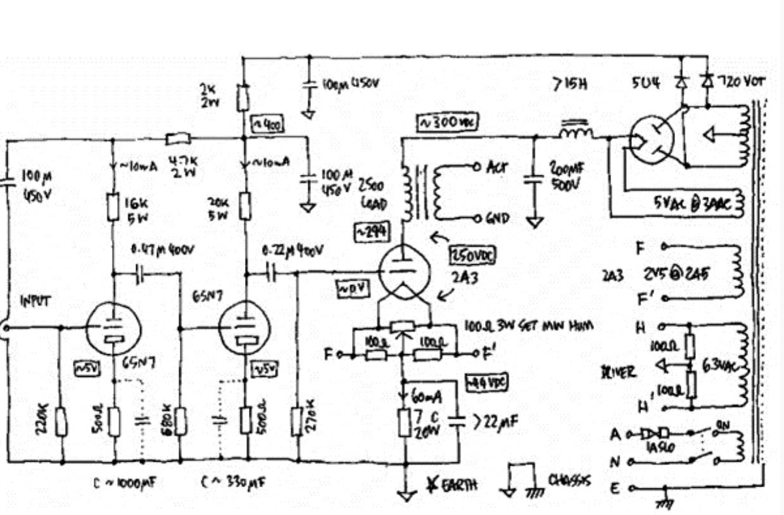
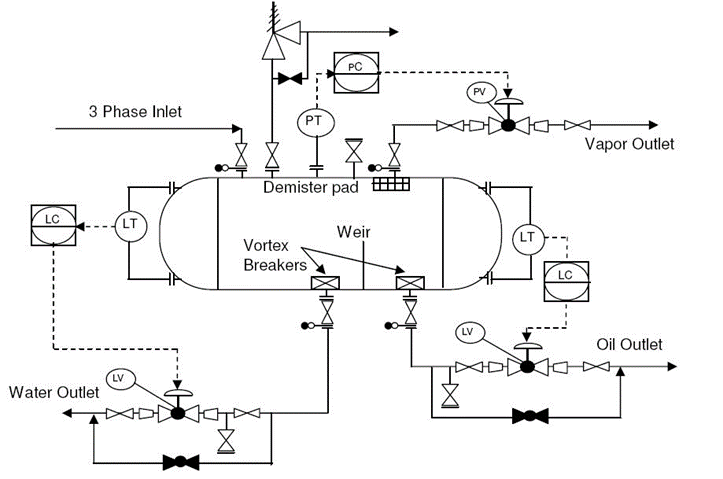
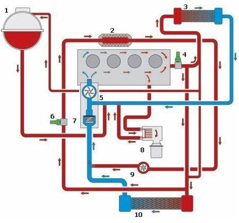
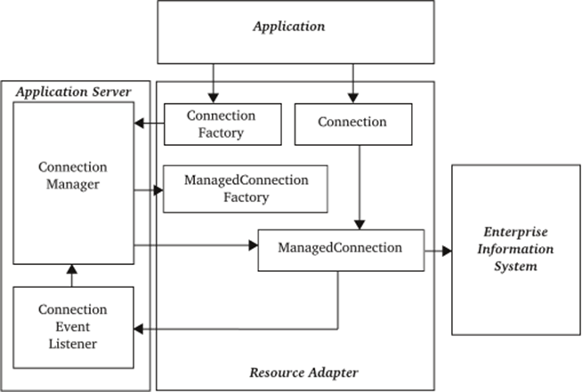
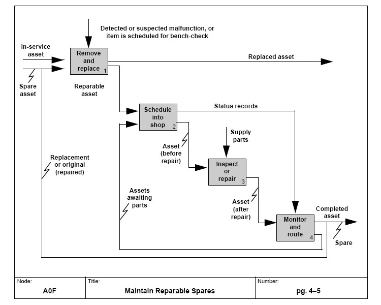
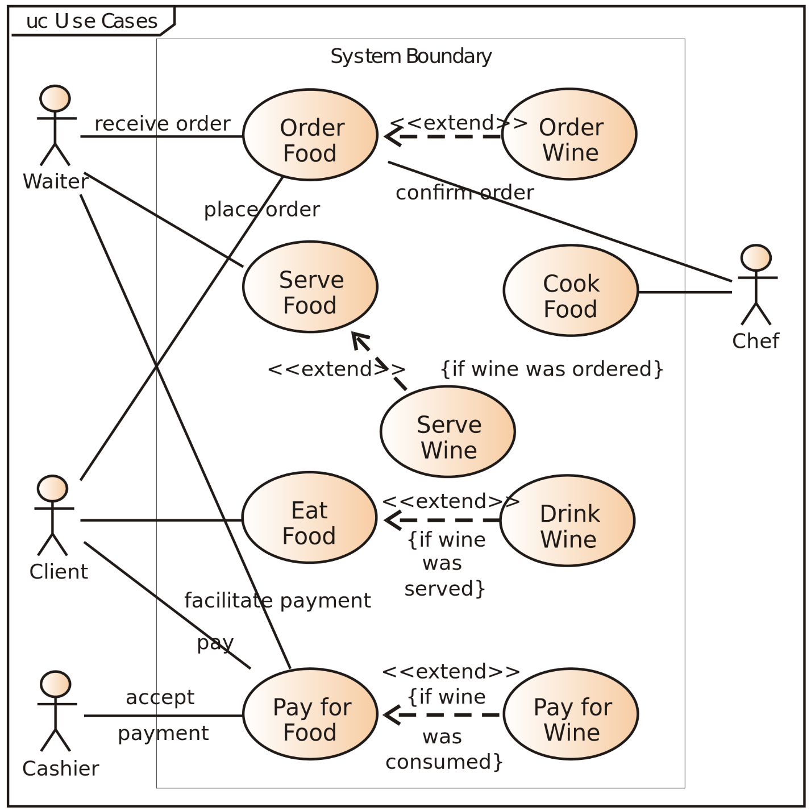

# Функциональные описания: принципиальные схемы и сценарии

У очень и очень многих проектных ролей область интересов включает важные характеристики системы времени работы/operations, когда система готова и эксплуатируется, в run-time/operations. Объяснить, как система работает (то есть описать причины и следствия во взаимодействиях подсистем), можно при помощи функциональных описаний. В них мы объясняем назначение (функцию/метод работы) каждой функциональной части системы и вклад этой части в достижение общего назначения системы, общего поведения системы в её окружении (run-time).

**Принципиальные схемы** — это диаграммы, показывающие соединения функциональных частей друг с другом и удобные для объяснения принципа функционирования системы (отвечающие на вопрос «как работает система» — как взаимодействуют между собой функциональные части, чтобы дать требуемую вовне функциональность системы в целом). Вот несколько типичных примеров принципиальных схем:

В ходе работы/функционирования функциональные части системы взаимодействуют друг с другом через **потоки**, проходящие через **порты** (ports) этих функциональных частей. В принципиальных схемах функциональные части обычно изображаются графическими элементами разной формы, а потоки — линиями между этими графическими элементами. Порт — это место присоединения соединительной линии к графическому элементу функциональной части.

Конечно, все эти красивые картинки в диаграммном моделере хранятся (а чаще всего и редактируются) в каком-то абсолютно другом формате, например, в формате табличного представления, и только на экран выводятся уже как диаграмма. Помним, что картинки в инженерии хороши только очень простые — и для показа уже готовой работы (это «архивные документы»), когда изменений можно уже не ожидать, ибо изменения в них вносятся трудно, а сами моделеры неожиданно дорогие во всех смыслах (в том числе дорогие в эксплуатации — на одно изменение обычно слишком много и долго надо кликать куда-то мышкой, в тексте или таблице сделать изменение во много раз быстрее). Вот в нашем руководстве картинки диаграмм есть, они очень простые, обычно это цитирование диаграмм других авторов, а когда речь идёт о наших собственных диаграммах, то это исключительно в иллюстративных целях и не предполагает изменения этих диаграмм в ходе какого-то проекта (помним про «непрерывное всё»).

В компьютере как источнике слайдов есть порт для присоединения слайд-проектора, и через этот порт в проектор текут данные слайда. Это мы дали функциональное описание, оно показывается на диаграмме. В физическом мире мы увидим конструктивную часть «ноутбук» и в нём конструктивную часть, реализующую давно устаревший интерфейс USB третьей версии (ещё не USB Type-C) или интерфейс HDMI, через который кабелем присоединяется проектор.

Конструктивный/материальный «ноутбук» реализует/воплощает функциональный «источник слайдов» (но конструктивно источником слайдов мог бы быть и смартфон), конструктивный проектор реализует функциональный слайд-проектор, кабель реализует соединение источника слайдов и проектора, интерфейс реализует межпортовое соединение. «Реализует» тут означает, что конструктивный (физический) объект выполняет роль функционального объекта. В функциональном описании обычно присутствуют термины предметной области времени эксплуатации («показ», «слайды»), а в конструктивном описании этих слов нет. Молоток и микроскоп не знают, что они будут забивать гвозди, в их описаниях поэтому слов предметной области гвоздезабивания нет, равно как в предметной области компьютеров-ноутбуков слов про «слайды» нет, а вот слайд-проектор вполне может содержать такое слово, если он специализирован для показа слайдов, или не содержать этого слова, если он ещё и видеофильмы может показывать. И тут мы, конечно, описали маленький кусочек концепции системы — то, каким образом мы представляем себе разбиение системы на разные виды частей и как эти части связаны друг с другом, что там конструктивное что материальное воплощает. Дальше надо бы добавить пространственное описание и стоимостное описание, но нас пока будет волновать функциональное описание системы — но как всегда, мы ничего не можем сказать про какой-то объект (в данном случае функциональное описание), пока не расскажем про его связи с другими объектами (например, другими видами описаний), чтобы уточнить значение («значение — это употребление») и не выполним заземление/grounding (дадим примеры физических ситуаций, набор употреблений), чтобы не оказаться в наших объяснениях чересчур абстрактными. Так что само появление этого абзаца в руководстве — это просто норма работы по описанию (в данном случае описываем функциональное описание, часть мета-мета-модели, материал нашего руководства).

Функциональные части физичны (в момент, когда они воплощены конструктивными/материальными объектами), они выбираются для системы так, чтобы удобно было объяснять работу системы во время её эксплуатации/функционирования (run time, operations). Потоки — это чаще всего логические/ролевые/функциональные объекты, которые тоже физичны, выделяются из мира на основе постоянства пути, а не постоянства вещества (скажем, в реке путь воды одинаков, но сама вода в любом сечении — в каждый новый момент времени разная), и через которые функциональные части взаимно влияют друг на друга. Потоки могут быть самых разных объектов, которые проходят один и тот же путь: могут быть и потоки света, и электрический ток/поток/current, и потоки энергомассопереноса (в тепловых машинах), и даже потоки данных (в программных системах).

Потоки выделяются из физического мира на основе постоянства сохранения пути во времени, равно как функциональные объекты выделяются на основе постоянства сохранения функции во времени, а конструктивные — постоянства материала при изменениях, пространственные — постоянства места. Это идеи из онтологии/мета-мета-модели ISO 15926-2, мы уже обсуждали это в нашем руководстве более подробно в разделе про методы/функции/практики, в подразделе про ролевые объекты/роли и «игру по роли»/функцию/назначение в окружении.

В любом случае, мы приводим нашу мысль всегда в физический мир, но помним, что на принципиальных схемах изображается **поток**, а не конструктивный/материальный объект, играющий роль проводника этого потока: например, электрический ток может течь по проводнику, по корпусу, по болтовому соединению, но в принципиальной схеме это разнообразие сред не будет изображено. В электрической цепи в устройстве/изделии совершенно необязательно иметь ровно такое же количество проводов, которое изображено на принципиальной схеме этого устройства/изделия. Но между реализующими функциональные части продуктами/модулями ток всё-таки должен иметь возможность течь, чтобы система работала, «провод» — лишь один из вариантов реализации потока/соединения/связи/взаимодействия.

Точно так же «труба» на **гидравлической схеме** (принципиальная схема, где потоки будут — потоки жидкости) будет только одним из способов реализации потока/взаимодействия — играющие роль функциональных частей системы конструктивы могут быть соединены друг с другом непосредственно, фланец во фланец, вообще без трубы, или вместо трубы жидкость может идти по какому-нибудь жёлобу, вариантов тут не счесть. Главное, что на диаграмме изображены соединения функциональных частей друг с другом через порты так, что можно отследить их взаимодействие через потоковую передачу какого-то вещества или энергии, или данных. При этом данные в конечном физическом итоге будут тоже переданы через передачу вещества, например, перевозку грузовика с магнитными дисками, или энергии, например, через оптоволоконную связь, или через электрический ток между частями компьютера — всё это сводится к потоку как объекту с постоянством/устойчивостью пути в ходе неминуемых изменений.

Помним, что функциональные описания могут показывать не только функциональные/ролевые части системы, но и непосредственно поведение/функции этих частей — и это поведение тоже будет осуществляться над потоками: предметами методов, проходящими по постоянному пути. В методах (впрочем, и функциях, это же синонимы — помним, что функции чаще употребляются для неодушевлённых простых агентов, а методы — для интеллектуальных агентов, которые ещё и планировать что-то могут) обычно говорят о входе (входной поток), обработке/функции/процессе (преобразование входного потока в выходной) и выходе (выходной поток). В этом случае говорят не о **принципиальных схемах**, как для технических устройств, а о «**функциональных диаграммах»/«процессных описаниях».** Конечно, диаграмма — это описание на языке типизированных объектов (тип объектов часто задаётся их формой — овал, кружок, квадратик или рядом рисуют картинку, в простейших таких диаграммах используют только один тип объектов) и отношений, чаще все указываемых стрелочками (они тоже могут быть с окончаниями и оперениями разных видов, в простейших вариантах — один вид стрелочек). «Процессные описания» могут быть не только диаграммны, но историческая традиция — ждать их всё-таки как диаграммы. Тут мы дадим диаграммы исключительно как иллюстрации, сегодня это не основное представление. Ожидайте в жизни увидеть не картинки, а тексты и таблицы.

Вот пример такой функциональной диаграммы (function model[^r6-1]) в давно морально устаревшей, но чрезвычайно распространённой и часто встречающейся нотации IDEF0. Слева от каждого элемента его входы, а справа — выходы, на стрелках написано, что именно передаётся от выхода предыдущей функциональной части на вход следующей. Какой тут самый распространённый тип ошибки при чтении таких диаграмм? Это функциональные части и «логическое время метода работы», но часто это читается как «физическое время протекания экземпляра работы», и вот тут будет проблема: можно попасться в западню ситуации «ножниц», когда функциональное и конструктивное разбиения будут различными и «логическое/функциональное время» не будет совпадать с «физическим/материальным временем». Для материального времени используются другие диаграммы, на них показывается часто синхронизация — это, например, тоже давно устаревшая нотация IDEF3 (и в этом и проблема, что вместо неё используют нотацию IDEF0, девять раз из десяти ситуаций когда методы/функции и работы относятся как 1:1, это ОК, но в десятой ситуации они расходятся как в примере с ножницами, где ножевой блок и рукоятка не совпали с изготавливаемыми в конструктиве двумя половинками ножниц). Так что вы в жизни обязательно увидите эти IDEF0 диаграммы, будьте аккуратны к тому, что на них пытались изобразить — это не всегда будут функциональные объекты и потоки.

Ещё один вид функциональных описаний — это **сценарии** (scenario), иногда говорят о **сценариях использования** (use cases, переводить нужно не как «варианты использования», а именно «сценарии использования» — оригинальный термин придумал Ivar Jacobson по-шведски, и это был как раз «сценарий», case был признан им неудачным переводом на английский[^r6-2]).

Пример такой диаграммы[^r6-3] иллюстрирует действие активных частей системы, показываемых фигурками человечков. На картинке это проектные роли, но в жизни это вполне могут быть функциональные/ролевые части, которые играются не-людьми. В этих диаграммах используется «аристотелева физика» («палец давит на стол, но стол не давит на палец»), то есть показываются не взаимодействия, а именно действия: функциональные элементы обозначаются человечками-ролями/actors/деятелями, их действия (функции) моделируются отдельными кругами, а вся диаграмма отражает «логические» сценарии (не в физическом времени! В «причинно-следственной» последовательности объяснения происходящего) как методы/функции, которые выполняют функциональные части (роли, в терминах use case — это акторы/actors). Тут акторы могут быть и неживыми, это необязательно «интеллектуальные агенты», принимающие решения. То, что в use case называют actor, не «агент-исполнитель роли», а собственно роль, причём ещё и безотносительно агентства (то есть без свободы воли, без возможности принимать решения, молоток в забивании тоже будет actor). Нужно всегда помнить, что слов в языке мало, и у каждого слова есть много разных значений, и термины «actor», «актор», «актёр» могут в разных дисциплинах разных методов работы обозначать совсем разные понятия, хотя иногда они и оказываются похожими до неразличимости. Так что не теряйте бдительности.

Режимы работы/функционирования какой-то системы обычно рассчитываются именно по функциональным описаниям, они ведь привязаны именно ко времени работы системы, а не ко времени её создания. Мультифизическое моделирование делается именно для функциональных описаний: ищутся оптимальные характеристики функциональных объектов для заданных режимов работы. Конечно, система моделируется в её окружении (это ведь run-time/operations-time, и работа системы существенно зависит от состояния её окружения). Будьте осторожными: мультифизическое моделирование иногда называют в инженерии «системным моделированием» и привязывают к специфическому классу софта, поддерживающему какой-нибудь физический моделер с описаниями на акаузальном языке моделирования физики, например, Modelica. Но нет, это не полноценное системное моделирование, это моделирование функционального описания (например, расчёт значений характеристик функциональных объектов по какой-то принципиальной схеме — часто это называют вообще 1D моделированием, ибо моделируем только одну какую-то характеристику при заданных остальных), а не всех описаний. Как это понять? Из контекста, как всегда: если слышите «системное моделирование» и уж тем более «системный моделер», просто из контекста поймите — вам рассказывают о системном моделировании в рамках системного подхода, или просто этим словом обозначают мультифизическое (механика, плюс электрика, плюс гидравлика и т.д.) моделирование какой-то системы.

Иногда функциональные диаграммы дополняют ещё и совсем уже процессными диаграммами, в которых объектами являются сами функции/поведение, называемые глаголами или отглагольными существительными — «переноска», «охлаждение», «освещение». Но процессные диаграммы встречаются реже «принципиальных схем» с функциональными объектами как элементами диаграммы, а не поведением функциональных элементов как на процессных диаграммах. Скажем, на процессной диаграмме может быть изображено поведение «повышение давления жидкости», а на принципиальной схеме будет «насос» («объект-повышатель давления», а не его действие «повышение давления»).

Конечно, нужно помнить, что большинство описаний в реальных проектах «гибридны»: люди (а сейчас и AI) и в диаграммах, и в таблицах, и в текстах вполне могут уточнить, что функция повышения давления жидкости реализуется модулем-насосом, а не перепадом высот и модулем-жёлобом, или даже явно указать марку и технические характеристики оборудования, которое нужно закупить!

Основная проблема функциональных описаний: их обычно понимают только узкие специалисты, функциональное/ролевое/«по назначению в надсистеме» разбиение системы на части-- контринтуитивно. Но **если вам задаётся вопрос о том, как именно работает система** **(время использования), то без какой-то хотя бы упрощённой принципиальной схемы** **или процессной диаграммы** **вам не** **обойтись. Обязательно готовьтесь к таким вопросам: в конце концов системы делаются для того, чтобы они работали/использовались, и большинству людей интересно, как они работают** **(что происходит во время использования,** **что система меняет в своём окружении, какие потоки чего** **проходят** **в этот момент между подсистемами системы)—** **и только после разъяснений на эту тему с ними можно будет обсудить, как и из чего система сделана** **(время разработки, конструктивы), как скомпонована, сколько стоит.** **Если непонятно, что система делает в своём окружении (какие объекты из каких состояний переводит в какие состояния в ходе работы)—** **непонятно, как оценивать её конструкцию, компоновку,** **стоимость. Хороши они или плохи—** **кого спрашивать, кто будет заинтересован в системе? Всё зависит от того, что система делает! Функциональное рассмотрение системы первично!**

Системное мышление не учит тому, как читать и строить функциональные описания и документировать их. Системное мышление говорит, что функциональные описания должны быть сделаны (и документированы!). Это мета-мета-модель — даже не карта, на которой можно строить маршрут и дальше идти по территории, ориентируясь на этот «маршрут на карте», даже не легенда карты, а «легенда легенда карты». Но если вы хотите куда-то идти, то самая идея о том, что у вас будет легенда карты, потом надо сделать карту, потом проложить по ней маршрут — и пойти, она будет полезной. Лучше бы вы сделали именно так, сделали бы себе карту, нежели просто «взяли и куда-то пошли, по наитию» (и закончили тем, что оказались бы через пару шагов в болоте).

Как делать функциональные описания (с функциональной декомпозицией), как потом делать модульный синтез (принимать решения о том, какими модулями будут реализованы какие функциональные части) — это говорит системная инженерия. А если вы хотите стать профессионалом, то вам потребуется изучить ещё и прикладную дисциплину, занимающуюся конкретно какой-то инженерной подпрактикой (например, освоить пару-тройку учебников, где объясняются use cases и как их использовать в проектах для создания моделей использования в какой-нибудь «разработке приложений для смартфонов» или «разработке электромобилей»).

[^r6-1]: <https://en.wikipedia.org/wiki/Function_model>

[^r6-2]: Подробнее в разделе History <https://en.wikipedia.org/wiki/Use_case>

[^r6-3]: <https://en.wikipedia.org/wiki/Use_case_diagram>
