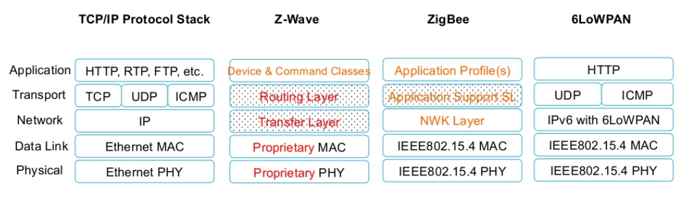
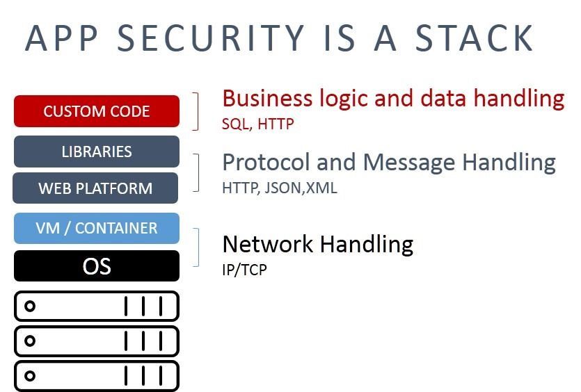
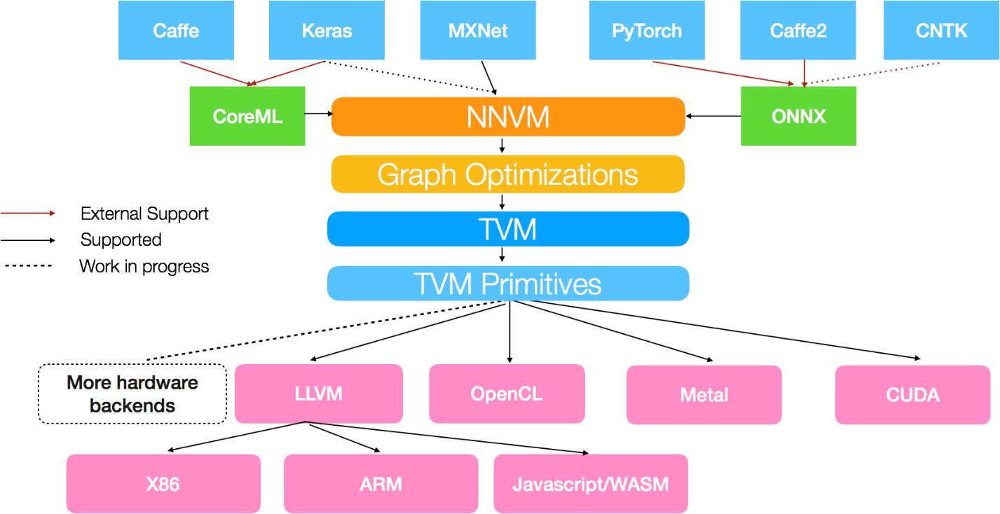

# Платформы и платформенные/инструментальные стеки

Если рассмотреть конструктивное/продуктовое/модульное разбиение (PBS, product breakdown structure в отличие от функционального разбиения SBS, system breakdown structure), в нём можно увидеть на каждом уровне иерархии по отношению композиции какие-то наборы мелких конструктивных «кирпичиков», которые предоставляют через свои интерфейсы сервисы для сборки на их основе конструктивных «кирпичиков» более высокого уровня, которые могут выдать потенциально обширный набор функций во время их использования в каких-то ролях. Вот такой согласованный по предоставляемым ими совместно сервисам (**сервис** тут чуть-чуть уточняется как «функция, порт функционального объекта которой доступен в момент использования как интерфейс какого-то конструктива») набор модулей с их предопределёнными интерфейсами называют **платформой.**

**Платформа—** **это всегда** **конструктивное/продуктовое/модульное рассмотрениесистемы** **с подчёркиванием стандартности получения** **ожидаемого в момент использования** **сервиса через** **опубликованный** **интерфейс.**

То, что платформа — это конструктивное рассмотрение, а сервис — рассмотрение поведения роли (функционального объекта) как создателя, которую выполняет платформа в момент использования, не должно смущать, помним о 4D экстенсионализме: конструктив и роль — это один и тот же физический объект в момент использования. А «сервис» вместо функции/метода просто подчёркивает, что речь идёт об изменении какого-то внешнего предмета метода работы, выполняемого платформой — с новым уточнением: для платформы сервис выполняется по опубликованному интерфейсу, а из описания интерфейса понятно, где его искать, как обращаться за сервисом.

В инженерии

* за интерфейсы отвечает архитектор (именно архитектор говорит, конструктивы/компоненты/модули программы будут общаться путём вызова программ, или пересылкой сообщений, или будут использовать «шину», то есть все конструктивы в момент их работы будут получать все сообщения ото всех и отбирать себе нужные самостоятельно, если это компьютерная аппаратура, то именно архитекторы скажут, будет ли интерфейс USB Type-C или Bluetooth, или ещё какой. Архитекторы прописывают, как будет устроено взаимодействие на логистическом уровне, в отрыве от тех портов подсистем как функциональных объектов, которые будет реализовывать тот или иной конструктив этими интерфейсами. Их забота — правильная сборка системы из конструктивов, оптимизация (главным образом — минимизация) взаимодействий между ними.
* Разработчики берут за должное интерфейс и определяют, какие порты он будет реализовывать во время использования. Их задача — реализовать функциональность в рамках заданных архитектором ограничений (не всякий интерфейс сможет во время использования системы обеспечить работу порта какого-то функционального объекта).

Понятно, что роли архитекторов и разработчиков имеют абсолютно разные интересы (при общем интересе получить успешную целевую систему, но у них свои расходящиеся обычно представления, каким методом работы можно этого быстрее и дешевле добиться, разные критерии оптимизации). Подробней об этом можно узнать в руководстве по системной инженерии. Понятно, что орг-архитектор и орг-проектировщик тоже имеют такой же «рабочий конфликт», об этом подробней в руководстве по системному менеджменту.

Для программных конструктивов (компонент, модулей, приложений, библиотек — термин зависит от предпочтений школы программной инженерии) этот интерфейс обычно называется **API** (application program interface), программный интерфейс приложения/application program. Тем самым приложение, которое публикует описание своих интерфейсов, по которым можно получить его сервисы путём его вызова откуда-то извне, становится тоже платформой.

Если речь идёт не о программной системе, то можно говорить просто о прикладном интерфейсе (application interface, а не application program interface).

Платформа, если реализована библиотекой программ или «железными» модулями, то можно выбирать в зависимости от проекта:

* входит как конструктив в состав приложения или продукта/изделия в ходе его работы, является его подсистемой, выполняющей какие-то роли,
* входит в состав окружения, предоставляя сервисы для каких-то частей системы (платформа предоставляется сервис-провайдером),
* входит в состав создателя (и тут тоже платформа предоставляется сервис-провайдером).

Слово «платформа» тем самым становится абсолютно универсальным, и им начинают называть что угодно, если понятно какой сервис на каком интерфейсе можно от этой платформы получить.

«Внутренняя платформа разработки»/«internal development platform» в platform engineering[^r6-1]. Сервис-провайдер для этой платформы создаётся инженером внутренней платформы разработки (это одна из ролей в инженерии), а сервисы этой платформы через опубликованный интерфейс получают разработчики — платформа изготавливает своими сервисами из программного кода работающую на компьютерном железе готовую программу. Термин «внутренняя платформа разработки» появился в программной инженерии. Но в «железной» инженерии это завод, который используется разработчиками. Подробней — в руководстве по системной инженерии. Аналогичной платформой будет администрация компании, которая предоставляет сервисы (финансовый, юридический и т.д.) для менеджеров-организаторов компании, она создаётся и поддерживается администрацией. Подробней — в руководстве по системному менеджменту. В учебных организациях поток студентов проходит обработку в деканате, который выполняет ту же роль администрации — это платформа, которая создаёт «учебную организацию» из студенческих групп, тот самый «завод», на котором делают из студентов мастеров. Подробней — в руководстве по инженерии личности.

Маркетплейс тоже называют платформой, ибо маркетплейс публикует интерфейсы сервисов для продавцов и покупателей, а иногда и платёжных систем. Иногда создание таких платформ называют уберизацией/uberisation, а для французской википедии приводят и синоним — платформизация/plateformisation[^r6-2] — в честь фирмы вызова такси Uber, которая создала платформу гарантированной «поставки против платежа» с двумя опубликованными интерфейсами: сервиса для водителей такси и сервиса для пассажиров такси. В принципе, сервис поиска каких угодно клиентов для каких угодно сервисов или товаров — это поисковая система, прежде всего Гугл. Но при уберизации платформой выполняется главный сервис: гарантирование поставки против платежа, платформа-маркетплейс выполняет роль страховщика и биллинг-агента как для клиента, так и для провайдера сервиса (а проекты, где этой страховки не происходит, обычно более чем скромны по масштабу — за просто сводничество много денег не дают, без страховки всегда можно найти поставщика сервиса через поисковик, а вот дальше надо будет разбираться со страховкой и биллингом).

В уже упоминавшихся социальных танцах (танго, кизомба, форро, сальса и т.д.) тоже есть интерфейсы, они обычно стандартизуются на уровне «базы»: есть условные сигналы, которые подаются leader/ведущим follower/следующему (это безгендерная терминология для «партнёра» и «партнёрши», на которую сейчас перешёл весь мир). Скажем, рука follower находится у вас (leader) на плече — и вы не можете крутить follower, эта рука будет мешать. Вы как leader даёте небольшой толчок своим плечом руке (это и есть «сигнал ведения» из «протокола взаимодействия») — и рука follower взлетает вертикально вверх. Теперь возможны повороты, эта рука не будет мешать, не будет за вас цепляться. Вот это и есть один из интерфейсов в социальных танцах (есть и другие): между плечом leader и рукой follower. В данном абзаце приведён кусочек стандарта с протоколом взаимодействия между конструктивами leader и follower в паре танцоров социальных танцев.

**Протокол** — это описание какие в интерфейсе возможны взаимодействия, какие, когда и в каком направлении передаются потоки (сигналов, энергии, вещества) и что вообще в каком порядке происходит. Протоколы могут быть

* внутренними для проекта (опубликованы в рамках коллектива разработчиков),
* открытыми (опубликованными от какого-то официального источника в **публичном документе**, не подразумевающем проверку выполнения или **стандарте**, подразумевающем проверку выполнения какой-то реализацией),
* передаваемыми в устной традиции (как древние былины и сказания), как протоколы ведения-следования в социальных танцах (они тоже могут быть опубликованы в каком-то обычно неполном виде, но публикации разнятся и нет официального источника) или протоколы этикета при еде (при этом в разных странах они разные, тоже опубликованы частично или даже более-менее полно во многих местах, но эти публикации разнятся и по объёму, и по содержанию, а ещё не имеют обычно даты с версией — нет официального источника).

В мышлении это мало отличается от обращения к программному сервису (помним, что «сервисом» часто называют и поведение провайдера, и самого провайдера сервиса, «службу», «сервер»), или обращением за сервисом к какому-то оборудованию. В этом плане и leader и follower, следуя стандарту «базы» танца с её сигналами, представляют друг для друга платформу этой «базы», они предоставляют друг другу сервисы (leader — сервис выдачи интересных сигналов ведения, follower — расшифровки и выполнения этих сигналов, одна из интерпретаций социальных танцев — это совместная «игра в загадки»[^r6-3]). И важная особенность социальных танцев: стандартизация интерфейса, «платформенность» приводит к тому, что leader и follower, приехав на какую-то фестивальную вечеринку из разных стран и впервые танцуя друг с другом, смогут абсолютно предсказуемо и надёжно взаимодействовать друг с другом, а также «обслужить» множество партнёров. Это взаимодействие в социальных танцах в системном мышлении описывается примерно в том же наборе понятий, что взаимодействие смартфона и его сотовой станции, трамвая с его путями, веб-браузера с веб-сервером — для всех этих случаев мышление устроено одинаково, используются одинаковые типы мета-мета-модели (но, конечно, абсолютно по-разному это всё называется в каждой предметной области. Так, стандарт ведения-следования в социальных танцах никогда не назовут интерфейсом, там таких «умных слов» не знают. Проблема в том, что его вообще никак не назовут, разве что «негласное соглашение о ведении-следовании»).

Если думаешь о сборке двух конструктивов/продуктов/модулей, думай об интерфейсе, если через этот интерфейс в момент использования конструктивов в каких-то ролях происходит общение с чем-то меняющимся внешним (а не входящим в постоянный состав), «обслуживание» отдельных экземпляров предметов метода по общему методу, то этот метод — сервис, если интерфейс опубликован и сервисов несколько — речь идёт о платформе.

Основной вопрос при обсуждении платформ — это так называемая **видимость интерфейсов**. Интерфейсы какого-то низкого системного уровня не должны быть видны снаружи конструктива, то есть **нельзя соединять** **конструктивы** **иначе, чем через предусмотренные в них** **интерфейсы.** Грубо говоря, если у вас коробочка с каким-то разъёмом, то нельзя воткнуть внешнее устройство не в этот разъём, а куда-нибудь внутрь коробочки, мимо этого разъёма, даже если очень хочется. В системах всё со всем связано, и по неотслеженному соединению (это ведь будет тоже интерфейс, только «неучтённый») могут пройти паразитные связи, возникнут непредвиденные ошибки. Помним: архитектор борется с этими неучтёнными паразитными связями между частями системы, а разработчик наоборот — пытается каким-то образом обойти эти архитектурные ограничения, ибо ему кажется, что он так быстрее получит результат. Если мы в качестве разработчика берём хакера, то он первым делом пытается обойти опубликованный интерфейс и сразу получить доступ к функциональности (сервисам платформы) через неучтённые связи. **С этим борются «безопасники». По сути,** **«безопасники»** **и архитекторы—** **разные изводы одной и той же инженерной роли.**

Например, если в ваше подразделение, где вы тщательно планируете работу сотрудников, получая заказы на эти работы через какой-нибудь трекер, могут прийти какие-то люди из других подразделений и попросить сделать работы для них «вне очереди» — и им не откажут, то последствия для организации будут фатальны: какие-то неожиданные работы будут выполнены, какие-то вроде как свободные сотрудники окажутся заняты, какие-то важные (но важность определяется надсистемой! Внутри модуля-подразделения как заказчика, так и исполнителя важность может быть неизвестной) работы не будут выполнены из-за задержек, связанных с этой внезапно появившейся «из ниоткуда» (мимо запланированного интерфейса, поддерживаемого трекером) работой. Весь этот трекер тут — только интерфейсный конструктив/модуль, предоставляющий интерфейс для сервиса заказа работ, это неважно, что это довольно большая программная система, на рассматриваемом системном уровне это просто интерфейсный модуль для заказа работ, средство коммуникации подразделения с внешним миром.

В электротехнике есть три типа неисправностей: есть контакт там, где он не должен быть, нет контакта там, где он должен быть, и плохой контакт. Это шутка как раз про интерфейсы — которые должны быть именно там, где они предусмотрены конструкцией!

Для обсуждения видимости интерфейсов используется диаграмма конструктивных/модульных/продуктовых/платформенных уровней. Каждый платформенный уровень отделён от другого уровня каким-то стандартизированным (то есть описанным и документированным!) интерфейсом. Реализации/воплощения нижестоящих уровней тем самым могут быть сменены так, что надсистемы в момент использования этих конструктивов не заметят подмены, если эти конструктивы будут соблюдать опубликованные (в случае платформ) или даже внутренние (если речь идёт не о сервисе, а просто о какой-то функциональности) интерфейсные соглашения.

Итоговое многоуровневое продуктовое/платформенное разбиение называют **платформенным стеком** или **инструментальным** **стеком** (stack, стопка — диаграммы похожи на стопку подносов в столовой или стопку листов бумаги в пачке). Вот пример различных инструментальных стеков для межкомпьютерной коммуникации в интернете вещей (IoT, internet of things)[^r6-4]:

На диаграмме видно, что в разных сравниваемых стандартах связи описываются/определяются/defined пять платформенных уровней (конструктивов по отношению часть-целое), которые можно разделить на реализующие в момент использования роли для функций передачи физического сигнала (physical), передачи данных (Data Link) и т.д. При этом конструктивы передачи данных при работе обращаются к конструктивам передачи физического сигнала, используя указанные в диаграмме протоколы интерфейсов[^r6-5]. И так по всем уровням выше, вплоть до уровня целого конструктива как приложения/application: каждый уровень платформенного/инструментального стека (уровень реализующих этот стек конструктивов) даёт интерфейс для оказания сервиса наверх и использует сам при этом сервисы нижележащих модулей. Где тут пролегает граница между системами и окружением? Всё зависит от проекта: часть этих уровней может быть реализована какой-то системой, а часть — её окружением.

Неважно, что делают/как работают эти уровни платформенного стека. Для «как работают» нужно обсуждать функционирование в run-time, какие там данные с какой целью будут передаваться — это тоже про run-time и обсуждать надо с разработчиками, но обсуждение платформ — это design-time, «из чего собрано и как соединено», время создания системы, обсуждать с архитекторами.

Главное в показе этого инструментального стека то, что

* никакой конструктив вышестоящего уровня «не видит» конструктивы более низкого уровня (не имеет к ним доступа, не может туда «воткнуться», ибо нет интерфейса), чем конструктивы уровня, находящегося непосредственно под ним,
* интерфейсы реализующих сервисы этих платформенных уровней стандартизованы — как стандартизован и сам набор этих уровней.

Эти инструментальные/платформенные стеки вездесущи. В танцах вы передаёте сигнал от плеча leader к руке follower (то есть от части тела к части тела в целом), а не от мышц к мышцам, или даже от мышц плеча через кожу, затем кожу и дальше через рецепторы и нервы дальше к мышцам руки follower. Мышцы — это конструктивные объекты более низкого уровня, и если у «плеча» и «руки» ничего не поломалось, чтобы чинить это на более низком уровне, то лезть на этот уровень не нужно, нужно пользоваться предписанными интерфейсами. Универсальность при этом растёт с каждым уровнем вниз. Если в социальных танцах можно передавать сигнал ведения-следования от плеча к руке, то на уровне работы мышц уже можно обсуждать не только передачу сигналов, но и самые разные другие сервисы. Если вы обсуждаете самый нижний уровень связных протоколов, то поверх них можно строить самые разные варианты реализации других протоколов. Например, в связном стеке для более-менее универсального протокола IP можно предложить более высокий уровень протокола TCP, но можно использовать и другие протоколы, которые будут реализованы другими конструктивами — UDP и ICMP. Это всё изображено на диаграмме платформенного стека IoT для TCP/IP Protocol Stack. Видно, что стек назван по паре протоколов где-то из середины стека, даже не верхний уровень стека и не все протоколы из того же уровня, что TCP, на иллюстрации приведены всего три протокола уровня TCP, но их там 145 разных[^r6-6].

Есть два способа изображения таких диаграмм платформенных/инструментальных/модульных/конструктивных стеков:

* на некоторых диаграммах плашка-«платформа» именуется названием описывающего её стандарта прикладного интерфейса. Прикладного — это наверх по системным уровням, прикладность идёт в стеке сверху. Реализация этого стандарта интерфейсным конструктивом находится как бы «между уровнями» (ровно этот способ показан на диаграмме инструментальных стеков IoT, он самый распространённый)
* показ собственно конструктивов (именование платформ) будет на плашках, тогда интерфейс этих конструктивов либо считается проименованным самим конструктивом (скажем, пакет/библиотека глубокого обучения TensorFlow имеет API TensorFlow, и поэтому его не нужно отдельно прописывать — названия типа конструктива «пакет» или «библиотека» и выдача имени TensorFlow для него достаточно), либо его указывают отдельно.

Но если платформенный уровень реализует стандарт с другим именем, то он прописывается где-то в границах реализующего его модуля отдельной строчкой поближе к границе над-модуля, или даже выносится и явно прописывается «между платформами», как это сделано в картинке стека безопасности приложений[^r6-7] — стандарты указаны сбоку картинки платформенного стека, а каждая плашка обозначает слой/уровень конструктивов:

Верхняя скобка для стандарта интерфейса в надсистему от custom code ведёт как бы в никуда при таком способе показа, поэтому чаще используется способ предыдущей картинки, где платформа обозначается не по назначениям/именам её модулей/слоёв, а назначение указывается сбоку.

Часто оба этих способа перемешивают, получая гибридную конструктивную диаграмму конструктивных/инструментальных уровней для видимости интерфейсов, она разрабатывается архитекторами. Вот, например, диаграмма уровней компилятора искусственных нейронных сетей, где верхние строки — наименования программных пакетов/библиотек для сервисов над нейронными сетями (MXNet, PyTorch, …), а нижние — интерфейсных стандартов для какой-то аппаратуры (OpenCL, CUDA, …)[^r6-8]:

Это неважно, что вы можете ничего не понимать в предметной области, описываемой этими архитектурами (наборами решений по разбиению системы на модули и организации связей между модулями). Важно, чтобы вы могли оценить похожесть друг на друга этих диаграмм (хотя бы визуальную похожесть), понять стоящий за ними мыслительный принцип — и лучше потом разбираться с тем, какого сорта диаграммы вам предлагает посмотреть та или иная проектная роль, или какие диаграммы вы рисуете сами. Конечно, вы можете платформенные стеки рисовать не как диаграммы, а представлять табличками, мы помним, что диаграммы менять неудобно, а таблички меняются почти так же легко, как текст.

Платформенность даёт возможность эффективного разделения труда: реализацией каждого уровня платформенного стека может заниматься отдельная команда, хорошо разбирающаяся в работе на их системном уровне (системный подход!), а поскольку речь идёт о конструктивах, воплощающих роли (функциональные объекты), то такие команды могут соревноваться за эффективность реализации требуемых функций сервисами своих модулей — на каждом системном уровне своих.

Инженеры, использующие какие-то платформы для создания своих целевых систем, могут не задумываться, как именно и из каких систем были сделаны сами эти платформы. Если вы пользуетесь каким-то сотовым телефоном, то вам всё равно, из чего и как сделан этот телефон, если он умеет связаться с базовыми станциями вашего провайдера сотовой связи (а он умеет: стандарты/протоколы взаимодействия с этим провайдером опубликованы, и изготовители базовых станций и телефонов просто их соблюдают). И вам всё равно, в какой школе танцев училась ваша партнёрша или партнёр, если соблюдается стандарт «базы» этого танца: вы сможете танцевать вместе (но тут ситуация сложнее: стандарт базы не публикуется, а передаётся в устной традиции преподавателями танцев — примерно как былины передавались сказителями. При этой передаче/репликации случаются мутации — и иногда вы получаете несовместимость части сигналов, leader и follower плохо понимают часть сигналов).

Если интерфейсные стандарты не соблюдаются, мир разваливается на плохо и непонятно как взаимодействующие (нет интерфейсов!) части. Взаимодействие происходит, но совершенно незапланированным образом, заканчивается неудачей. Поэтому нужно будет тратить много сил на налаживание взаимодействия там, где его нет, но оно нужно и убирать взаимодействие там, где оно есть, но оно не нужно.

Это налаживание взаимодействия в условиях отсутствия стандартов и когда системы уже созданы, называют «федерирование», см. стандарт ISO 11354-1:2011, framework for enterprise interoperability[^r6-9]. Как мы обсуждали в предыдущих подразделах, этот стандарт определяет три подхода к налаживанию взаимодействия/interoperability: федерированный/federated, унифицирующий/unified, интеграционный/integrated. Если разработчики взаимодействующих модулей используют при их создании стандарт взаимодействия/интерфейса, то это «унификация», а если они тщательно совместно разрабатывают оба модуля, проектируя их взаимодействие (что является более исключением, чем типовой ситуацией), то это «интеграция». При федерировании разработчики не соблюдают стандарты и не знают друг о друге, и это самый частый случай. И самый дорогой в реализации. Унификация — это ориентация на стандарты, поэтому вместо федерирования предпочитают унификацию, это обычно дешевле.

Интеграция — это очень редкий случай, и дорогой: вам нужно совместно разрабатывать устройства и согласовывать интерфейс прямо при разработке, это довольно редкий случай. Скажем, электростанцию и электролампочку пришлось бы разрабатывать вместе, договариваясь о напряжении на выходе электростанции и входе электролампочки в рамках общего проекта. При взаимодействии через унификацию этого нет: вы просто соблюдаете стандарт интерфейса, лампочка и электростанция сопрягаются в России на 220 или 230 вольт[^r6-10] и не требуют совместной разработки, хотя в других странах сопряжение идёт на других значениях: 240 вольт, 110 вольт, и в тех сетях сопряжение тоже идёт через унификацию. Но если у вас лампочка на 220 вольт, а напряжение в городской сети 110 вольт, то вам нужно федерирование (например, нужно поставить повышающий трансформатор: адаптер для сетевого интерфейса).

Инженеры могут использовать прикладной интерфейс платформ, не интересуясь устройством этих платформ — лишь бы эти платформы осуществляли сервис, осуществляя его через описанный интерфейс. Это существенно упрощает задачу создания сложных систем, ускоряет и удешевляет её. Нужно хорошо разбираться в вариантах модулей и выдаваемых ими на их интерфейсах сервисах, но необязательно разбираться, как они устроены внутри, и как именно они внутри себя работают. А если этот прикладной интерфейс стандартизован, и есть конкуренция поставщиков модулей/продуктов/изделий/конструктивных частей, то они могут ещё и выбрать подходящий им по цене и характеристикам вариант реализации. И это происходит на много уровней вверх и много уровней вниз по инструментальному стеку, системное мышление рекурсивно.

**Деньги обычно приходят от удачного и массового использования верхнего,** **самого** **прикладного уровня** (конечно, для каждого уровня инструментального стека вышестоящий уровень является «прикладным», системное мышление применяется рекурсивно — то есть одинаково для каждого системного уровня, одинаково для каждой в нём системы). Посмотрите примеры явного использования рассуждений о платформе в стратегии фирмы NVIDIA — при описании структуры интеллект-стека[^r6-11], инструментального стека робо-такси[^r6-12], стека вычислительной инфраструктуры[^r6-13] и обратите внимание на тип диаграмм, который там использован.

**«Перетряхивание»** **всего** **инструментального/платформенного стека, перестройка всех рынков идёт** **обычно** **тогда, когда меняется принцип** **физической** **реализации самого нижнего уровня** **конструктивов,** **то есть** **меняется** **реализация** **платформысамого** **нижнего уровня.**

Например, когда в компьютерах поменялись механические или пневматические элементы на вакуумные электронные лампы, компьютеры стали масштабируемы и они начали напоминать уже функционально современные компьютеры, а не калькуляторы прошлых лет. Замена ламп на дискретную полупроводниковую технику позволила наладить массовый выпуск компьютеров и это разительно изменило компьютерную технику. Замена дискретной электроники на большие полупроводниковые интегральные схемы опять перевернула весь компьютерный рынок со всеми надстройками программного обеспечения. Замена CPU на GPU перевернула рынок искусственного интеллекта. Замена людей-исполнителей на роботов-исполнителей переворачивает все производство. Эта особенность делает конструктивные/инструментальные/платформенные/модульные/продуктовые/аппаратные/софтверные стеки удобными для обсуждения стратегии компании.

При стратегировании обсуждают метод работы компании и предметы этого метода, в том числе какие из конструктивов на этих платформенных уровнях будет компания делать сама, а что закупать вовне, какие стандарты интерфейсов для этих конструктивов она будет устанавливать сама, а какие брать из уже готовых стандартов. Хороший пример такого стратегирования на системных уровнях инструментального стека для искусственного интеллекта даёт компания NVIDIA[^r6-14].

[^r6-1]: <https://platformengineering.org/blog/what-is-platform-engineering>

[^r6-2]: <https://fr.wikipedia.org/wiki/Ub%C3%A9risation>

[^r6-3]: <https://vk.com/wall-179019873_1550>

[^r6-4]: <http://www.slideshare.net/Techtsunami/cn-prt-iot-v1>

[^r6-5]: Соглашение о взаимодействии, подразумевающее какую-то последовательность/порядок действий двух систем, называют протоколом. Стандарты, описывающие обмен данными, часто тоже называют протоколами: они ведь описывают последовательность обменов данными.

[^r6-6]: <https://en.wikipedia.org/wiki/List_of_IP_protocol_numbers>

[^r6-7]: <https://f5.com/about-us/blog/articles/why-cves-should-be-given-priority-one-for-resolution-27910>

[^r6-8]: <https://tvm.ai/2017/10/06/nnvm-compiler-announcement>

[^r6-9]: <https://www.iso.org/standard/50417.html>

[^r6-10]: До 2003 года стандарт был 220 вольт, но сейчас 230 вольт, хотя в некоторых нормативных документах по-прежнему 220 вольт, ГОСТ 29322-2014 определяет стандартное напряжение 230В с возможностью использовать 220В. Электросети поставляют электроэнергию согласно действующего на сегодняшний день ГОСТ 32144-2013, устанавливающего напряжение 220В. <https://ru.wikipedia.org/wiki/Сетевое_напряжение>

[^r6-11]: <https://ailev.livejournal.com/1380163.html>

[^r6-12]: <https://ailev.livejournal.com/1384766.html>

[^r6-13]: <https://ailev.livejournal.com/1416697.html>

[^r6-14]: Болваны для искусственного интеллекта <http://ailev.livejournal.com/1356016.html>, NVIDIA как поставщик инфраструктуры для интеллект-стека, <https://ailev.livejournal.com/1380163.html>, NVIDIA как поставщик инфраструктуры для роботакси-стека <https://ailev.livejournal.com/1384766.html>
