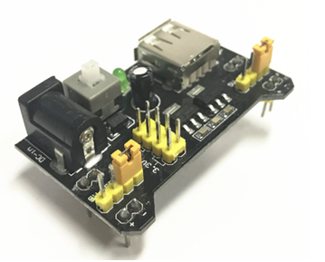
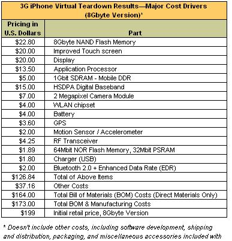

# Конструктивные/продуктовые описания

Когда предмет интереса для какого-то метода работы относится не ко времени работы системы, а ко времени построения системы — что-то, что интересно для модульного синтеза, закупки конструктивов/продуктов/модулей/изделий/блоков, сборки системы как **конструкции** из уже закупленных конструктивных частей, отгрузки уже созданной системы/продукта/изделия, то необходимо использовать конструктивные/продуктовые описания. Эти описания отвечают на вопрос «как сделана система» (ср. с функциональным «как работает система») и они относятся ко времени создания (design-time, construction), а не использования (run-time, operations). Помним, что в design-time мы включаем не только проектирование, но и изготовление, и модернизацию, и уничтожение. Но не включаем время работы/operation/функционирования/эксплуатации/использования.

Как и в случае функциональных частей, есть разные графические (диаграммы), текстовые (на естественном языке, на полуформальном «псевдокоде», на формальных языках) и табличные форматы (например, в электронных таблицах Excel, Coda.io, Notion.so, Airtable) представления описаний конструкций.

На продуктовых/конструктивных/модульных диаграммах показываются чаще **конструктивы/модули/блоки/изделия** (в случае блоков часто уточняют, что это конструктивные блоки, ибо бывают ещё и функциональные блоки как части функциональных разбиений) соединяемые через **интерфейсы** (interfaces, буквально — «междумордия», «то, что между»). Интерфейс обычно описывается каким-то стандартом, описывающим как свойства соединения, так и события, происходящие в ходе взаимодействия модулей через соединение. Принято говорить о сборке конструктивов для их взаимодействия через интерфейсы как об **интеграции**. Описывающие двустороннее взаимодействие стандарты называют **протоколами.**

Часто конструктивные части называют по-разному в зависимости от их уровня в конструктивном разбиении: детали (если не предполагается сборки-разборки, альтернативное название — элемент, «далее неразбираемое на части»), подсборки/subassembly, сборки/assembly, иногда даже подсистемы/subsystems (но тут легко перепутать с подсистемами в их функциональной ипостаси), и далее — система (тоже легко перепутать систему-конструктив с системой в её функциональной ипостаси, системой-ролью-в-окружении). Практика закрепления отдельных имён типов для уровней сборки — плохая, ибо в рамках эволюционирования системы вы заменили три детали и восемь винтов одной деталью сложной формы, изготовленной на 3D-принтере, а то и напечатали подсборку целиком — и всё, надо довольно много менять в плане именований в проекте. Помним: если у вас развесистая иерархия по какому-то одному типу отношения с одним типом объекта (одинаковые операции с этими объектами на каждом уровне, в том числе операции мышления об этих объектах), избегайте давать разные имена типов объектам разных уровней каких-то разбиений: число уровней наверняка поменяется в ходе создания и развития системы, вам придётся долго всё переименовывать.

Интерфейсы конструктивов похожи на порты ролей в том плане, что это именно места присоединения (при этом часто и на диаграммах это выглядит как «место в квадратике, куда присоединяется какая-то стрелка одним из концов»), то есть **интерфейсысами—** **не конструктивы, они не занимают объёма в пространстве**, хотя у них и может быть форма «границы в пространстве». Вилка и штепсель, гнездо и штеккер, кабель USB и гнездо USB: для всех этих пар интерфейс — «то, что между», «междумордие/interface», а не сама «морда/face».

А как назвать сам физический конец электрического шнура, оформленный в соответствии со стандартом вилки, штеккер для какого-то гнезда, разъём в компьютере для USB кабеля? Это всё будут **интерфейсные** **модули**, главное назначение которых — реализовать какие-то интерфейсы в физическом мире, то есть быть парой к другому такому интерфейсному модулю. И у этого модуля не один интерфейс обычно, а два интерфейса: один целевой, а другой — присоединяющий его к какому-то модулю, для которого нужен целевой интерфейс. Конечно, «модуль» тут только один из возможных синонимов. «Изделие с интерфейсом», «интерфейсный конструктив»: любое слово, которое относится к конструктивам, времени сборки.

**Это очень частая ошибка: путать интерфейс и интерфейсный модуль.** Не делайте эту ошибку (в том числе студенты: не удивляйтесь отсылке на пересдачу, если вы не дочитали до этого места в руководстве и называете интерфейсом какую-то часть конструкции, а инженеры-менеджеры — не удивляйтесь, если у вас в рабочем проекте будет возникать постоянное непонимание на ровном месте). Скажем, мембрана клетки — это интерфейс клетки с окружающим миром, или интерфейсный модуль? Поскольку мембрана состоит из молекул, занимающих пространство-время, то это интерфейсный модуль, конструктив. Мембраны, корпуса — это интерфейсные модули с окружением, а не интерфейсы! У них по два интерфейса: внутрь системы и вовне системы.

Вот пример такого старинного интерфейсного модуля (который в просторечии называют USB-интерфейс, что неверно — у него есть ещё и сигнальный интерфейс к плате, и отдельный интерфейс к питанию и даже интерфейс к человеку: светодиод, который мигает, когда идёт передача данных и кнопка включения, а ещё есть механический интерфейс крепления к корпусу или другой плате):

А как же соединения, которые нужны для работы — все эти трубы, кабели, волноводы? Это тоже конструктивы/модули/продукты/изделия/артефакты, и у них есть свои интерфейсы: они находятся между ними и теми модулями, которые они соединяют. Что проходит через эти интерфейсы, и как оно связано с работой всей системы?

Неизвестно, ибо речь идёт о конструктивных единицах в design-time: функции из run-time тут не определить, для этого нужно выходить за пределы модульного описания в область инженерных решений модульного синтеза по реализации функциональных частей системы конструктивными её частями (концепция системы как раз отсылает к такому соответствию в части внутреннего устройства системы, а концепция использования — про то, как там обстоит дело с системой в её окружении).

Решения модульного синтеза (изобретения в порядке создания концепции системы):

* определяют, роли каких именно функциональных частей будут играться теми или иными конструктивами,
* определяют, какие между этими конструктивами будут интерфейсы, и через эти интерфейсы какие будут проходить потоки между функциональными объектами (их мы обсуждали в предыдущем разделе про функциональные описания),
* учитывают при этом и все остальные аспекты системы (прежде всего аспекты размещений и стоимостные, но и многие другие, которые важны для учёта интересов многочисленных других ролей. Описаний в системных описаниях много, не только основные их виды).

Часто речь идёт о приёме-переработке-выдаче модулем какого-то проходящего через входные и выходные интерфейсы этого модуля физического потока. Этот физический поток будет реализовывать функциональный поток из функционального описания (например, принципиальной схемы), который идёт через функциональную/ролевую часть, на исполнение роли которой назначен модуль. Так, через USB-интерфейс может передаваться тот или иной поток данных (на принтер, на слайд-проектор, на внешний монитор), физически это будет соответствовать прохождению какого-то профиля электрического тока через контакты интерфейсных модулей — но на принципиальной схеме/функциональной диаграмме/dataflow diagram это будут потоки предметных из прикладной предметной области (domain) данных между функциональными частями системы, то есть потоки страниц для принтера, слайдов для проектора, экранов для внешнего монитора.

При интеграции (часто используют это слово) разных конструктивов в целую работающую систему важна не просто механическая сборка из готовых конструктивов, но ещё и согласование работы этих конструктивов после соединения их через их интерфейсы. Монтажник/сборщик должен убедиться, что соединение через интерфейс между парой интерфейсных модулей установлено, соответствует стандарту, описывающему интерфейс, и тем самым модуль сможет играть свою функциональную роль во время работы/функционирования/operations/run-time.

Для интерфейсов известны правила, по которым устанавливается соединение через интерфейс, но неизвестно, что именно и зачем передаётся через этот интерфейс — это будет известным только из функционального описания (например, принципиальной схемы). Метод/способ работы системы (функциональность) и его предметы появляются на принципиальной схеме, она появляется из разбирательства с функционированием, а не разбирательства с конструкцией и того, как именно собрана система. «Спальня» появляется из понимания того, что в спальне делают (методы работы), то есть спальня определяется не в конструктивном, а в функциональном мире. В конструктивном мире, мире конструктивов/продуктов/модулей это будет просто «комната». «Спальня» реализуется «комнатой» (а не, например, коридором или балконом), затем в ней нужна ещё как-то (кроватью, диваном, лавкой с мягким покрытием, спальным мешком) реализованная кровать (а в коридоре или балконе — не нужна, но если там оборудовать кровать, то можно назначить и конструктивы «коридор» и «балкон» исполнять роль «спальни»).

Например, принтер и компьютер связаны через USB интерфейс, но какая информация идёт принтеру, это интерфейсу неизвестно. Утюг к электросети подсоединён через интерфейс между евровилкой и евророзеткой, но этому интерфейсу неизвестно, какой через неё пойдёт ток и что этот ток будет делать в run-time. Но известны не зависящие от функциональности предельные значения тока, который может пройти через этот интерфейс, равно как предельное количество информации, которое может пройти через USB-интерфейс в единицу времени. **Задача модульного синтеза** **при проектировании системы—** **это** **выбрать такие интерфейсные модули,** **интерфейсы которых** **смогли бы выдержать** **потоки с их рабочими режимами, предусмотренные** **функциональным описанием** **системы.**

Вот ещё пример конструктивного/модульного/компонентного (в IEC 81346-1 предлагается компонентом называть заказной продукт, который приходит в проект от других создателей) описания, в этом случае речь идёт просто о списке комплектующих (ещё одно название продукта/компонента), которые нужно купить для изготовления iPhone 2008 года, при этом приведены цены — и тут же это становится гибридным описанием, ибо включает и стоимостные оценки[^r6-1]:

Обратите внимание, сколько тут упоминается разных стандартов: GPS, HSPDA, DDR, Bluetooth — перечисление интерфейсов, описываемых стандартами, обычно для конструктивных описаний. Ведь вся суть модулей — это замена реализации какой-то функциональной части системы путём простой замены конструктивной части: модуля на стандартном интерфейсе. Быстрый прогресс в инженерии смартфонов и ноутбуков определяется именно этим: тщательным описанием интерфейсов.

Вместо одного принтера через интерфейс USB к компьютеру можно подключить другой экземпляр принтера той же марки, или даже принтер другой марки, или не принтер, а какое-то другое устройство (скажем, сканер, или даже дополнительный дисплей) — без стандартизации интерфейса это было бы невозможно. Дальше будет работать конкуренция: цена и качество сервиса/функции/метода работы, получаемого через один и тот же интерфейс у конкурентов-поставщиков модулей будет разная, но смена модуля будет происходить легко для инженеров, им ничего не нужно будет менять в проекте, если они использовали **стандартный интерфейс**!

**Стандартные детали** (со стандартными интерфейсами) стоят дёшево, ибо их цену двигает вниз «конкуренция реализаций стандарта». Если вы хотите увеличить цену изделия, то уберите из этого изделия стандартные интерфейсы — и сразу получите внутри проекта огромную работу по согласованиям интересов самых разных проектных ролей, которую в случае использования стандартов провели разработчики стандартов. Этим часто пользуются в государственных проектах, чтобы обосновать их высокую стоимость, просто прописывают нестандартный интерфейс в контракте — и дело сделано! Если стандартная деталь стоит в любом магазине 3 рубля, то нестандартная деталь с той же функцией будет стоить огромные деньги: это всё равно как вместо одежды из магазина взять вдруг одежду из дорогого ателье! Проблема в том, что замена дорогой одежды из ателье на покупную будет чаще всего незаметна, а качество дешёвой вещи может оказаться даже выше, ибо её изготавливают массово и проверяют лучше! В инженерии всё то же самое.

Метод борьбы с завышением стоимости заказной разработки — требовать, чтобы межмодульные интерфейсы были прописаны не в контракте, а в открытом стандарте, контракт же содержал только ссылку на открытый широкой публике стандарт. Тогда больше шанс, что возникнет конкуренция и цены на закупаемые модули станут ниже. Этот метод борьбы за низкие цены комплектующих называется **открытая архитектура**/open architecture[^r6-2]. Но регулярно архитектуру (решения по нарезке системы на какие-то модули с определением интерфейсов по связи этих модулей, то есть решения по особенностям модульной части модульного синтеза, в котором увязываются решения по функциональной декомпозиции и затем предлагается синтез целой системы из модулей) не открывают из соображений защиты от конкурентов, а также для того, чтобы проще было управлять конфигурацией. В закрытой архитектуре, чтобы поменять интерфейс взаимодействия модулей, нужно договориться меньшему числу людей. Но если интерфейс записан в открытом стандарте, то для изменения стандарта нужно много больше времени. Архитектура iPhone как раз относится к этому классу закрытых архитектур. И это не самое дешёвое устройство, хотя переговорная сила Apple достаточно велика, чтобы держать низкими цены на комплектующие: просто там большие объёмы выпуска каждого модуля, и эти большие объёмы — мощный фактор на переговорах.

Все эти рассуждения относятся и к предприятиям/организациям, но для них функциональные части — это оргроли, функции — методы/способы работы, конструктивные части — это оргзвенья, выполняющие работы по оговорённым в функциональном описании методам. Конечно, между оргзвеньями должны быть определены какие-то интерфейсы, и как они должны работать, определяется орг-архитектурой. Об этом будет рассказано подробней в руководствах по методологии и системному менеджменту, понятие архитектуры подробно разбирается в руководстве по системной инженерии.

[^r6-1]: <https://www.zdnet.com/article/isuppli-iphone-3g-costs-173-to-make/>

[^r6-2]: <https://en.wikipedia.org/wiki/Open_architecture>
