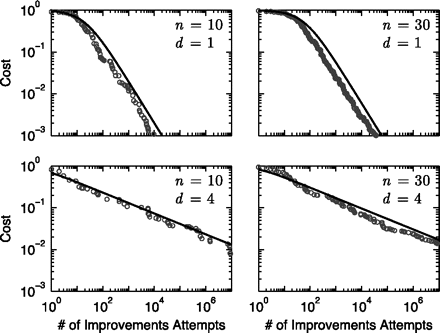

# Необходимость хорошей модульности

**Система должна собираться из модулей по принципу подводной лодки, в которой все отсеки делаются** **оптимально** **автономными—** **если один из них будет затоплен, это не будет означать затопления подводной лодки.Но если сделать полную автономность (например, не предусмотреть люков между отсеками), то это уже не сможет быть подводной лодкой—** **не взаимодействующие через интерфейсы части конструкции не породят эмерджентности, новых свойств, которых не было у отдельных частей (например, отсеков подводной лодки). Чересчур связная система «тонет», а совсем уж мало связная—** **вообще перестаёт быть системой, проявлять ожидаемые свойства.** **Это верно и для** **«железных»,** **и для программных, и для организационных, для всех систем.**

В системе все части системы взаимосвязаны, в системном окружении они ведут себя совершенно не так, как могли бы вести себя без системного окружения. Если у нас нет чётко выделенных и хорошо описанных интерфейсов, через которые мы контролируем все взаимодействия в системе, то любая попытка улучшить модуль может привести не только к улучшению этого модуля, но и дать побочный эффект: ухудшить систему в целом через влияние на другие модули по неотслеживаемым связям. Если интерфейсов не хватает, то системы вообще не получится.

Вот графики компьютерной симуляции зависимости падения стоимости разработки от улучшения n отдельных модулей, при d связей каждого из них[^r6-1]:

Видно, что если связь одна, то стоимость разработки с каждым улучшением падает быстро по экспоненте, слабо зависящей от числа модулей. Но если связей больше, то ошибки от локальных улучшений распространяются по этим связям и снижение стоимости разработки от улучшений в отдельных модулях идёт плохо. Каждая связь имеет свою системную цену, и не было бы этой цены, мы не имели бы даже в живой природе «органов», «клеток» и других конструктивов/модулей[^r6-2].

Модульность человеческого организма получена эволюцией, и она не идёт ни в какое сравнение с модульностью современного компьютера или смартфона, собираемого из стандартизованных деталей с чётко прописанными интерфейсами. Поэтому слабомодульный человеческий организм не очень понятно, как улучшать или даже просто лечить (но и тут есть модульность! Пересадка органов работает!). Компьютер или смартфон улучшать конструктивно и лечить-ремонтировать много проще, ибо модульность компьютера или смартфона тщательно продумывается.

Интерфейсами нужно управлять: тщательно их проектировать, учитывать их наличие, выявлять паразитные (то есть незапроектированные) интерфейсы и принимать меры по их устранению. Через эти паразитные интерфейсы в системах может распространяться вредное, ошибочное взаимодействие. **Оптимальная** **модульность,** **понимаемая как оптимальная** **сборочная структура из конструктивов, соединённых** **через качественные интерфейсы—** **это залог возможности автономного улучшения отдельных модулей, залог** **качества работы всей системы.**

Интерфейс — это не просто соединение, это соединение через какой-то вполне определённый физический канал/набор интерфейсных модулей по вполне определённому протоколу (лучше бы — определяемому открытым стандартом, а не только внутрипроектным соглашением, хотя это и не всегда соблюдается), так что это взаимодействие можно отследить, и ошибка не распространится по системе. Более того, можно просто заменить модуль на альтернативный (это проще, если интерфейс стандартный) — и система продолжит работать. Даже оргзвено бухгалтерии можно заменить: «своё» подразделение заменить внешней бухгалтерской службой! Если же какие-то связи (в случае модулей говорят о «зависимостях») будут проходить не через интерфейсы модулей, а система будет эти связи использовать для реализации своей функции, то замена модуля приведёт к исчезновению этих связей и нарушениям в работе системы.

Есть множество методов, которые помогают уменьшать связность модулей в создаваемой системе. Одним из наиболее известных таких методов является DSM (design/dependency structure matrix)[^r6-3].

Оптимальная (минимальная из возможных для нормальной работы системы) связность модулей нужна и в «железных» системах, и в программных системах, и в организационных, и даже в танцах. Хорошей модульностью занимается архитектура::метод, роль агента, который выполняет архитектурную работу — архитектор (в случае организационных систем — орг-архитектор).

Хорошая модульность и минимизация связей между ними совсем не означает, что части системы/подсистемы не находятся в тесном взаимодействии друг с другом. Это означает, что эти **взаимодействия** **частей конструкции** **ставятся под жёсткий** **архитектурный** **контроль**, и подсистемы можно улучшать, а в случае стандартизации интерфейса даже заменять на принципиально другие по конструкции и принципу действия, не рискуя при этом ухудшить работу всей системы в целом.

**Системный подход обычно называют холистическим, ибо он обращает внимание на систему в целом. Но нет других подходов, которые так бы** **помогали разбираться с** **разбиением на самые разные части, как системный подход. Суть системного подхода не только ко вниманию к целой системе, но и одновременному вниманию к частям системы.** **Системный подход—** **это про многоуровневость: осознанное удержание внимания всегда** **минимум** **на трёх системных уровнях: надсистемы (куда встраиваем нашу систему), целевой системы (что делаем), подсистем (из чего собираем).** **Это верно и для конструктивного/продуктового/модульного разбиения.**

В руководстве по системной инженерии будет подробно рассказано об архитектурной работе, её месте в ряду других методов инженерной работы, даны ссылки на литературу по методам оптимизации межмодульных зависимостей, метрикам количественной оценки таких зависимостей.

[^r6-1]: <http://www.pnas.org/content/108/22/9008.full>

[^r6-2]: <http://arxiv.org/abs/1207.2743>

[^r6-3]: <http://www.dsmweb.org/>
