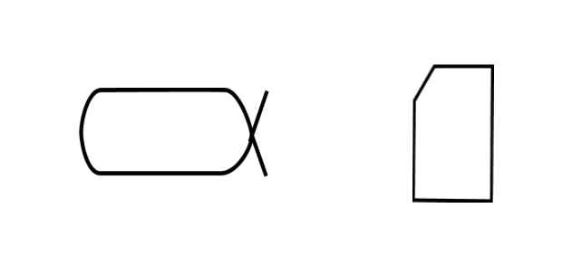

# Альфы и артефакты/«рабочие продукты»

Стандарт OMG Essence[^r6-1] предлагает для контроля за изменением состояния проекта особый вид функциональных объектов — **альфа** (ALPHA). Если мы хотим как-то связно мыслить о том, насколько продвинулись создатели в создании и развитии системы, то согласно стандарту OMG Essence нам нужно удерживать внимание в проекте не на любых произвольных объектах, а на альфах, которые они определяют как предметы метода.

OMG Essence — это стандарт описания методов разработки, один из последних стандартов так называемой инженерии методов[^r6-2], а потом и ситуационной/ситуативной/situational инженерии методов[^r6-3]. Основное отличие OMG Essence от предыдущих стандартов инженерии методов (их было множество, все они безнадёжно устарели) в том, что:

* Он создан не для удобства разработчиков методов (method engineers), а для удобства применяющих описанные в нём методы. Описания методов по этому стандарту удобно использовать в работе, а описания методов по прошлым стандартам было удобно разрабатывать, но не очень удобно использовать в работе по методу. Ключевым было то, что стандарт предлагает отслеживать выполнение метода через чеклисты, контролирующие прохождение предметами метода какого-то ожидаемого набора состояний. Применяющему метод сразу понятно, что делать: нужно проводить предметы метода по состояниям согласно пунктам чеклиста.
* В состав стандарта вошёл не только набор типов предметной области «методология» (language в терминах OMG Essence), но и пример самого верхнего уровня описания современной разработки софта с использованием этих типов (kernel в терминах OMG Essence). Предыдущие стандарты инженерии методов ограничивались только набором типов (language), но не давали пример использования этих типов (kernel).

В нашем руководстве мы рекомендуем использовать OMG Essence, но берём из него только language, а не описанный в нём пример kernel — ровно как этого и требует стандарт, ибо для каждой новой предметной области разработки надо бы разрабатывать свой kernel, а не брать описание метода разработки софта из стандарта. Подробней об этом будет рассказано в руководстве по методологии.

**Альфой стандарт называет** **важный** **предмет метода, меняющий своё состояние** **в ходе проекта. Альфа нужна для того, чтобы отмоделировать явно этот важный предмет метода как объект коллективного внимания, требующий отслеживания своего состояния** **в ходе проекта.** Метод характеризуется своими знаниями/теориями/объяснениями/алгоритмами, в которых как раз описываются предметы метода, которые по ходу применения/задействования метода в ходе работы мастерства и инструментария агента, выполняющего метод, будут менять своё состояние.

Альфа была названа авторами стандарта OMG Essence как «ALPHA», ибо нужно было хоть какое-то слово для предмета метода. Поэтому было подобрано короткое слово для объекта «нечто важное для проекта, что меняет своё состояние», нужно было, чтобы у слова не было какого-то бытового значения, не хотели путаницы. Много позже момента, когда в проекте стандарта OMG Essence появился термин «альфа», к нему разработчики стандарта придумали расшифровку термина ALPHA как аббревиатуры, но эта расшифровка абсолютно неважна, мы её даже не будем тут приводить (просто придумана, чтобы хоть как-то оправдать выбор термина, отсылка к «здоровью проекта», тоже произвольно взятой метафоре).

**Альфа—** **это предмет метода, состояния которого важны для проекта настолько, что требуется обязательно их** **коллективно** **отслеживать в ходе всего проекта.** Сам проект в целом при этом считается работой команды проекта по совокупности всех используемых в нём методов. Этот совокупный метод называют **методом/процессом/практикойинженерии** или **инженерным методом** (engineering process), иногда сюда не включают эксплуатацию и даже изготовление и говорят о **методе разработки/developmentprocess**. Для нас это «масло масляное», потому что инженерия сама по себе и есть метод, но в языке часто работу по методу и сам метод путают, поэтому когда хотят подчеркнуть, что имеется в виду не работа по методу, а сам метод, вставляют дополнительно какой-то из синонимов метода или указывают на то, что речь идёт о специфике/специализации метода, добавляя «вид». Так «труд» — это метод, но иногда используется как «работа» в бытовом его употреблении. Когда хотят подчеркнуть, что это всё-таки метод, говорят «вид труда» или «метод труда». Это чаще всего делается с терминами, для которых нельзя сказать «метод работы», например «труд работы», «инженерия работы», «деятельность работы», «сервис работы». С «процесс работы», «практики работы», «культура работы», «стиль работы», «стратегия работы» такое не происходит.

Предмет метода может быть как абстрактным объектом (описанием), так и физическим функциональным (метод работает с функциональными объектами времени работы агента, выполняющего метод, а они существуют только тогда, когда их роль выполняется конструктивами), поэтому стандарт OMG Essence для материальных объектов, обобщающих понятия документа (материальный носитель информации) с описаниями объекта и конструктива для функционального объекта предлагает тип **рабочий продукт/артефакт**(work product, artifact, т.е. предмет искусственного происхождения). «Рабочий продукт»/артефакт — это то, над чем работаем в физическом мире, что можно обнаружить в окружающем мире. Хотя физические реализации некоторых альф трудно представить «продуктами» (например, альфа «внешние проектные роли» реализуется живыми людьми, трудно думать о них как о «рабочих продуктах» или «конструктивах»), смысл сохраняется: даже если «продуктом» выступают живые люди, вам нужно над ними работать, менять их состояния в ходе проекта. Оргзвенья (команды и коллективы как команды команд, в которых есть хотя бы какой-то один интеллектуальный агент — человек, AI-агент или робот, или даже организация как внутренние оргзвенья) — это тоже конструктивы.

Ещё будьте внимательны к словам: продукт/изделие/система и «рабочий продукт»/артефакт всё-таки разные понятия: продукты обычно физичны, а рабочие продукты, несмотря на физичность документов, всё-таки могут быть описаниями. Если вы в продуктовом магазине вместо бутылки молока как продукта вдруг получите листочек с лабораторными характеристиками этой партии молока, то вы удивитесь, но для проекта создания молока это будет вполне себе рабочий продукт. «Рабочий продукт» — это всё-таки не «продукт».

Особенность альф в том, что они отслеживают состояния предметов составных методов с разными предметными областями их частных методов, а также разными онтологическими типами, и делают это крайне неформально. Так, альфа целевой системы (например, здания) в самом простом случае может иметь

* состояние «задумано», когда у него ещё нет даже подробного описания, возможно даже нет концепции использования, ещё не собрана команда, формально проект здания ещё не начат, ресурсы на разработку не выделены!
* затем будет состояние «проект/design разработан» — здания как физического объекта нет, но есть только описание здания, достаточно детальное для его строительства,
* затем может быть состояние «построено», то есть здание готово (намеренно опускаем прохождение инженерных обоснований, продажи площадей здания и т.д.)
* затем состояние «эксплуатируется/используется»
* затем состояние «модернизируется». Не уточняем там подсостояния предметов методов проекта капитального ремонта, косметического ремонта и т.д., важно просто подчеркнуть, что после того, как здание перешло в эксплуатацию, с ним может ещё что-то происходить, а потом будет опять возврат к состоянию эксплуатации/использования — альфа отражает состояния предмета метода создания системы не просто как «цепочка переходов между состояниями», это полноценный граф состояний, с циклами, соответствует концепции «непрерывного всего» (прежде всего — непрерывного ввода в эксплуатацию, не только создание MVP системы, но и развития системы).

В альфах названия состояний предмета метода даются через названия более мелких методов по изменению состояния, но эти методы даны как результаты прохождения работ по этих методам — переходными глаголами прошедшего времени («дверь открыта», «дверь закрыта», где открытие и закрытие — методы работы с дверью).

Например, Василий Пупкин в ходе включения в команду проекта каким-то методом (чаще всего этот метод в части привлечения людей называют onboarding[^r6-4]) должен принять роль финансиста заказчика (должна появиться оргвозможность финансиста заказчика) и в ответ на вопрос «быть или не быть?» сказать «быть!» и поставить подписи на документах. Альфа «финансист заказчика» нужна для отслеживания состояний объекта «финансист заказчика» во время всего проекта:

* вот мы узнали о том, что в проекте «необходимость финансиста заказчика признана командой», первое состояние всегда самое сложное, чаще всего это «вот ничего не было, а теперь мы знаем, что должно бы быть»
* вот «сформулировано описание внешней проектной роли финансиста заказчика», по факту это описание метода работы финансирования проекта заказчиком,
* вот «оргзвено, выполняющее роль финансиста заказчика выбрано», а в жизни это будет Вася Пупкин (когда проектируются состояния, ещё нельзя написать, что это будет выбран Вася Пупкин на должности зам.начальника финансовой службы заказчика, поэтому говорим о типе объекта)
* вот «исполнитель роли финансиста заказчика занял роль», это состояние Васи Пупкина, которому сообщили о том, что он теперь финансист заказчика, он знает о том, что ему надо делать, а также согласен работать по указанному в описании роли методу финансирования проекта со стороны заказчика.
* вот «финансист заказчика сотрудничает» (тут «сотрудничает» означает важное состояние после выполнения практик лидерства — нет переходного глагола прошедшего времени, как обычно), то есть Вася Пупкин уже работает над проектом — говорит своё «быть!» и ставит подписи, не задерживая никого в проекте.
* вот «все работы финансиста заказчика закончены», Вася Пупкин покинул проект.

Команда проекта потихоньку двигает альфу «финансист заказчика» по этим состояниям, применяя главным образом метод onboarding (это неважно, что роль внешняя, а не внутренняя — внешние проектные роли тоже должны как-то знакомиться с принятыми в проекте способами работы), ибо сам Василий Пупкин без работы команды по методу onboarding пойдёт пить пиво и не будет заниматься проектом, забудет о нём. Команда помнит, что ей нужно работать над тем, что и внутренние и внешние проектные роли кем-то будут играться, и проводит работы для этого — а поскольку работы нельзя проводить «никаким способом», то она оговаривает этот метод/способ и отслеживает состояния предметов этого метода/способа в явном виде: моделирует происходящее в проекте как набор альф.

Что тут будет рабочими продуктами? В том-то и дело, что состояние альфы определяется/отслеживается (в стандарте OMG Essence термин «**свидетельствуется/evidence**») многими рабочими продуктами, то есть документами с описанием ролей, пока нет выбранного исполнителя роли, далее самим Васей Пупкиным. Рабочие продукты, по которым мы выявляем/свидетельствуем состояние альфы придётся описать, когда описываем состояния предмета метода — но обычно альфы соответствуют метаУ-модели (как в учебниках предметной области), а рабочие продукты существенно зависят от ситуации предприятия, это уже описание метаС-модели (как в стандартах предприятия).

Описание метода как операций, переводящих альфы/предметы метода из состояния в состояние по мере выполнения работ метода, хорошо дробится: метод приведения в какое-то состояние может быть полноценно расписан как имеющий свои какие-то альфы. Подробно всё это будет описано в руководстве по методологии, будут предложены формы табличного моделирования методов работы в проекте (рабочих процессов, практик, культуры работы и т.д. — число синонимов тут внушительное) и задействования самых разных информационных систем для этого моделирования.

Рабочие продукты/артефакты, свидетельствующие состояния альф проекта, во всех проектах разные, а методы работы и, соответственно, предметы этих методов работы с их состояниями (альфы) остаются более-менее одинаковыми, за мелкими вариациями — и это сильно экономит мышление. Внешняя роль «финансист заказчика», которая ответственна за «выделение и исполнение бюджета закупки целевой системы»::метод, будет практически во всех проектах, но вот в одном проекте своё состояние по отношению к выполнению этой роли будет менять Анна Павловна, в другом Вася Пупкин, в третьем Виталий Викторович, и все они будут работать на разных должностях в организациях заказчика. Мышление команды про них всех будет устроено одинаково, в функциональных терминах метода и его альф/«предмета метода», а не в терминах конструктивов — этих разных людей-исполнителей роли. Более того, даже если «описание роли» будет свидетельствоваться в одном проекте рабочим продуктом «инструкция финансиста заказчика»::документ, а в другом проекте таким описанием выступит «стандарт методов работы внешних рабочих ролей»::документ, то менять в мышлении надо будет не так много.

Как узнать, в каком состоянии «гвоздезабиватель» в проекте? Поглядеть на «рабочий продукт»/артефакт, выполняющий его роль: сначала это будет проектная документация, а потом (после воплощения камнем или микроскопом) и сам физический объект, воплощающий гвоздезабиватель. Альфа «гвоздезабиватель» может проходить в проекте много разных состояний:

* потребность определена, концепция использования понятна (рабочие продукты тут будут в проектной документации, и нужно будет указать конкретный документ, где мы можем это прочесть — «с воздуха, со слуха» мы ничему в проектах не верим! Не записано — значит, нету! Мозг — это плохая память для проекта, надо использовать более надёжные носители информации)
* быть с определённой функциональностью, но ещё не выбранным конструктивом (рабочий продукт тут по-прежнему — проектная документация, но это, возможно, уже какие-то другие документы),
* быть выбранным и ещё не закупленным (и это уже опять какие-то другие документы, например, электронные документы в закупочной информационной системе),
* быть закупленным, (рабочий продукт — сам гвоздезабиватель в виде молотка или микроскопа, лежит на складе)
* быть выданным в работу (рабочий продукт — сам гвоздезабиватель),
* быть проверенным в работе (рабочий продукт — сам гвоздезабиватель).

Вот это будет во внимании участников проекта, эти изменения состояния будут отслеживаться, а состояния альфы документироваться в рабочих продуктах проекта.

Альфы совершенно необязательно характеризуют изменения состояний именно целевой системы в ходе проекта. Нет, они могут свидетельствовать и об изменениях состояний систем окружения, равно как и состояний создателей в графе создателей. Системное мышление — оно применимо для всех систем проекта (но не в отрыве от проекта! Если вы ничего не хотите сделать, то есть у вас нет проекта, то и системное мышление ничем вам не поможет), целевая система тут просто система в начале коллективных координат мышления, главный объект внимания всех участников проекта. Но внимание участников проекта удерживается и на других системах, альфы помогают отмоделировать эти системы, их описания — чтобы отслеживать изменение их состояния в ходе проекта.

Примеры самых важных альф (по сути дела — это указание на kernel в терминах стандарта OMG Essence, мы тут предлагаем более универсальный вариант, чем в самом стандарте, и в нём меньшее число альф):

* воплощение системы (обычно это целевая система, подчёркивается её физичность, отслеживается степень готовности/воплощения её в физическом мире, при этом альфа — это хитрый онтологический объект, она допускает моделирование воплощения системы, существующего ещё в виде сырья или несобранных комплектующих, непроверенное, ещё не введённое в эксплуатацию, но в том числе и указание воплощения системы как уже эксплуатирующегося),
* описание системы (в жизни изменения описания системы можно будет отслеживать по разным рабочим продуктам-документам, включая записи в базах данных),
* функция/метод работ (way of working), функциональное описание поведения системы (если неодушевлённая система — назовут «функция», если интеллектуальный или коллективный создатель — «метод/способ работы»), это время эксплуатации системы.
* работы системы (это относится ко времени эксплуатации воплощённой системы, ибо работы системы создателя — это другая альфа! Состояние работ свидетельствуется какой-нибудь диаграммой Ганта или списком работ из информационной системы управления проектом, issue tracker).

С этими четырьмя видами альф работают в предприятии как проекте создания и развития каких-то систем (помним, что «сервисные предприятия» тоже имеют целевые системы, разве что они не их собственные) самые разные методы над самыми разными предметами методов:

* методы коммерции/продвижения (основной предмет этих методов: клиентура::«создаваемая и развиваемая система» — как совокупность клиентов предприятия),
* методы бизнеса (основной предмет методов: инвестура::«создаваемая и развиваемая система» — как совокупность инвесторов предприятия),
* и методы инженерии систем соответствующего уровня (не все из которых даже называются классическими «инженерными системами», например, «мастерство»),
* методы системного менеджмента (основной предмет метода — организация), в том числе как менеджмента организационного (инженерия команды, настраиваемой на какой-то метод работы), так и операционного (загрузка ресурсов на работу и проверка того, что работы реально ведутся).

Агенты в организации, исполняющие роли для всех требующихся в проекте методов работы, двигают своими работами эти основные альфы по их состояниям в ходе проекта.

Альфы как онтологический объект очень сложны, в том числе по причине того, что методы работают и с описаниями, привязка к физическому миру затруднена (даже документирование разных состояний предмета какого-то составного метода будет в разных документах, их сложно отслеживать), объекты в разных состояниях могут называться по-разному и даже считаться разными объектами (яйца, гусеницы, куколки, бабочки — это состояния всё той же бабочки, но альфа их может отслеживать ещё до яиц — как гаметы и зиготы родителей!). Онтологи тут хватаются за голову, но в целом такой неформальный подход к отслеживанию смены состояний важных объектов проекта вполне себя оправдывает. Альфы для того и нужны, чтобы моделировать сложный граф переходов состояний предметов сложных составных методов — включая моделирование состояний предметов метода такого сверхсложного метода, как «процесс инженерии» в целом или даже «процесс работы» предприятия в целом.

В стандарте OMG Essence альфы и свидетельствующие их рабочие продукты/артефакты изображаются разными значками: альфа похожа на греческую α (но это ничего не означает по факту, просто пиктограмма «альфы», обозначение «важного предмета метода, изменения состояний которого надо отслеживать в проекте»), а рабочий продукт/артефакт — на лист бумаги с загнутым уголком (лист бумаги — это стилизованное изображение документа, но в жизни это чаще всего электронный носитель информации).

Стандарт разрабатывался главным образом для разработчиков информационных систем, поэтому для альф-описаний (например, программного кода как описания программы) свидетельствующие/презентирующие/представляющие их рабочие продукты — это документы, в том числе электронные, но вот для других альф (скажем, команды как предметы методов менеджмента) — это могут быть вполне живые люди-исполнители ролей, «оргзвенья». Графическое обозначение их по стандарту и их будет изображать «листочками бумаги», указание на материальность/конструктивность, оторванность от «содержания на листочке», упор на логистический аспект при создании, абстрагирование от функции при использовании. Сами же альфы — это содержательно (а не ресурсно, как рабочие продукты) рассматриваемые предметы метода, проходящие какие-то состояния после выполнения работ по каким-то операциям/приёмам метода (более мелким методам. Мы можем говорить тут о функциональной декомпозиции для методов, понимая, что метод — это всё-таки поведение, а декомпозиция на части-целые делается с ролями как функциональными объектами, демонстрирующими поведение).

**Альфы** **документируются в рабочих продуктах проекта, чтобы** **договариваться о состоянии** **важных объектов внимания в** **проекте, они отвечают на вопрос «в каком состоянии важные объекты проекта».**

Основное умение умного человека — это умение определить набор предметов метода, состояние которых важно отслеживать в проекте и документировать эту модель ситуации. Этот набор предметов метода задаётся типами из знаний/объяснений/теорий/алгоритмов мета-модели (предметных областей) или даже мета-мета-модели (общей картины мира для многих предметных областей) ситуации проекта. Эти типы объектов надо или уже иметь «в голове», или уметь быстро «нагуглить», или отмоделировать как-то иначе — а затем найти соответствующие этим типам объекты в жизни, в ситуации проекта. А поскольку эти объекты как предметы метода в проекте проходят через различные состояния, то не просто найти такой объект, но суметь его найти в тех состояниях, которые предусмотрены методом.

**В** **жизни нет ни одного слова из** **текста** **нашихруководств** **(в** **руководствах—** **мета-мета-модель, там нет слов из предметных областей рабочих проектов!),** **то есть** **в** **тексте** **руководств** **нет ни одного слова из** **окружающей вас** **жизни, примеры тут не в счёт: в них никогда нет совпадения с вашими рабочими проектами!** В руководствах главным образом говорится про предметы методов и операции смены их состояния (частные методы для этих состояний как темпоральных частей объектов полного метода — мы очень аккуратно стараемся говорить о «частях метода», ибо для методов понятия частей и целых в современной онтологии определены очень плохо), то есть говорится про альфы как важные для отслеживания в ходе проекта объекты мета-мета-модели.

В жизни, в рабочих проектах находятся специфичные для каждой конкретной компании в каждый момент времени рабочие продукты (они тоже могут меняться для какой-то компании с течением времени!), для которых довольно легко понять типы свидетельствуемых ими альф из метаУ-модели «учебника прикладного метода», классифицированные типами мета-мета-модели из фундаментальных методов мышления, описанных в наших руководствах. Если это рабочие продукты — документы, то понимаем типы метаУ-модели в описаниях из этих документов. Типы самих артефактов-документов как носителей информации тут не слишком важны, хотя для типографий, курьерских служб, архивов они могут быть тоже важными, а стандарты предприятия с изложением метаС-модели даже могут их предписывать именно с целью облегчения нахождения среди многочисленных документов проекта).

Это ключевое место для понимания системного мышления и основанного на нём моделирования, ключевое для понимания способа его использования — как описанные в нашем руководстве методы мышления (в основе которых какая-то теория/знания/объяснения с предметами мышления) связаны с успешностью задействования методов инженерии как изменений реального мира: как успешность изменения мира зависит от моделирования важных черт этого мира, важных свойств этого мира, важных объектов в этом мире. Не надо тратить время на моделирование неважного, но зато удерживаем во внимании в течении всего хода проекта:

* Модель важных объектов мира (альфы, функциональные объекты, например «физическое тело» из учебника физики, меняющее свои состояния в ходе проекта «бросок мяча» или «падение гири»). Альфа говорит о потенциальных состояниях физического тела, когда его бросают, работа с ней позволяет обсудить траекторию. В учебнике физики всё про альфы, про физические тела — и ничего про мячи или гири.
* Реальный мир, данный нам в измерениях и объектах воздействия, конструктивные объекты, «рабочие продукты», воплощающие альфы — сам материальный мяч или гиря.

Вы знаете, что нужно найти объект какого-то типа мета-мета-модели (скажем, «нашу систему»), и ищете объект какого-то типа из предметной области (скажем, это будет «мастерство собранности»::«наша система»), и ещё нужно найти сам этот объект («Васино мастерство собранности»::«мастерство собранности»). Если не смогли найти, то вы что-то не поняли — додумывайте, выясняйте, экспериментируйте, проявляйте активную жизненную позицию. Системное мышление показывает вам, на что обратить внимание — даёт типы мета-мета-модели, альфы. Но дальше от вас ожидается творчество: догадки, действия (и мыслительные, и в физическом мире) по их обоснованию/assurance, то есть моделирование, в том числе обязательное документирование модели.

Есть и обратный вариант: вы находите, что в проекте важный объект X::«тип мета-модели, из domain какого-то метода в проекте». И вы присваиваете ему тип мета-мета-модели интеллект-стека фундаментальных методов мышления. Дальше к объекту X оказывается применим весь интеллект-стек фундаментальных методов мышления, вы ведёте дальше мышление не с неизвестным X, а с хорошо знакомым объектом из наших руководств (точно так же, как если выяснится, что вам нужно определить траекторию движения титановой детали сложной формы, вы отождествляете её с типом «физическое тело» из учебника механики, затем вычисляете траекторию её движения, хотя в учебнике механики ничего не сказано про траектории движения замысловатых титановых деталей). Ключевое тут — вот эта операция классификации, присвоения типа из более абстрактных онтологических уровней по отношению «классификация».

**После того, как вы узнали для** **Xс известным типом мета-модели тип мета-мета-модели (для этого и нужен интеллект!) вы** **понимаете, что спрашивать дальше,** **над чем размышлять дальше,** **что** **надо** **делать дальше** **в физическом мире, какие возможны** **при этом новичковые** **ошибки и как их избежать.**

**В любом случае, вы деятельны/агентны: работаете (в том числе) с системными описаниями вашего проекта/моделями мира и с самим миром.** **Работаете—** **это** **применяете разные методы работы, меняя состояния предметов мира как предметов этих методов.** **Альфы нужны именно для отслеживания смены состояний** **в проекте, их нужно использовать для моделирования ситуации (конкретного набора состояния самых разных предметов самых разных методов, которые применяют в проекте самые разные роли), чтобы коллективно обсуждать ситуацию проекта, коллективно отслеживать ход проекта.**

[^r6-1]: <http://www.omg.org/spec/Essence/>

[^r6-2]: <https://en.wikipedia.org/wiki/Method_engineering>

[^r6-3]: <https://ailev.livejournal.com/750878.html>

[^r6-4]: <https://en.wikipedia.org/wiki/Onboarding>
