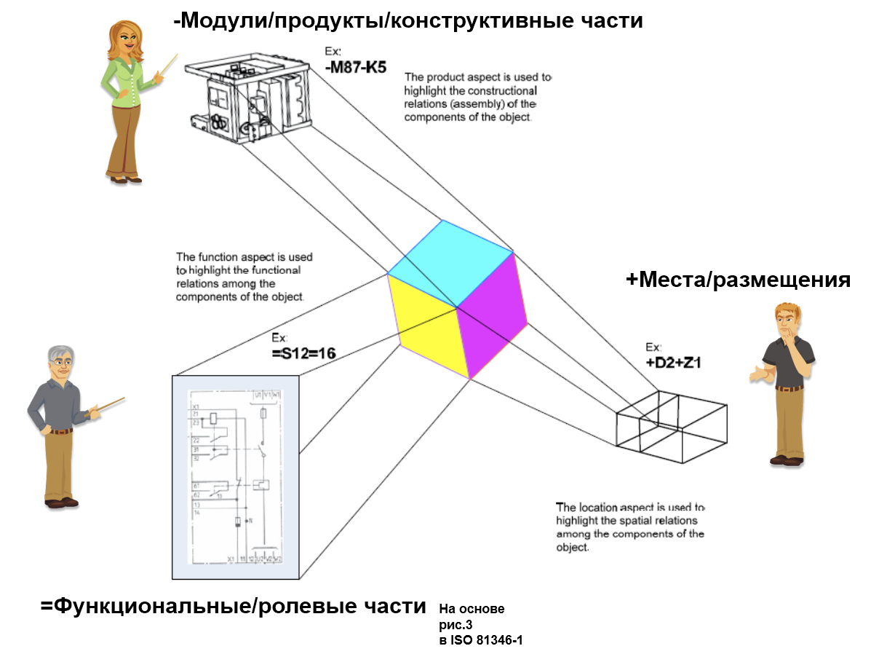

# Четыре основных вида описания системы на базе четырёх способов разбиения системы

Системное мышление предусматривает множество описаний системы, и в этом оно ничем не отличается от общефилософской/онтологической идеи о множественности описаний какой-то ситуации разными агентами, преследующими разные цели. Но <strong>системное мышление конкретизирует, какие именно описания надо обязательно сделать</strong>, какие описания будут основными — хотя системное мышление признаёт, что разных видов описаний надо делать больше, чем основных.

На сегодня системное мышление выделяет <strong>четыреосновных</strong> <strong>вида</strong> <strong>описаний, которые отражают четыре основных способа деления системы на части. Для каждого</strong> <strong>получаемого разными способами разбиения на части</strong> <strong>набора частей системыделают</strong> <strong>разные</strong> <strong>описания/view, современное системное мышление делает обязательными четыре таких вида описаний и в тренде пятое. Для каждого вида частей делается, конечно, множество разных описаний</strong>:

1. <strong>Функциональные:</strong> на основе частей, полученных функциональной декомпозицией (разбиением на функциональные части/роли по отношениям часть-целое, именно такое функциональное разбиение/breakdown чаще всего называют системным разбиением, тут особое использование слова «системный», указывающее на важность выполнения функции системы в её влиянии на объекты окружения, для интеллектуальных агентов-создателей — это влияние работ метода/сервиса на внешние по отношению к создателю предметы метода). Функциональное описание делается для времени работы/эксплуатации/функционирования/операций системы (описание «как работает», времени использования).
2. <strong>Конструктивные,</strong> иногда говорят структурные, не менее часто — продуктовые, чуть реже — продуктные, изредка — материальные. Эти описания делаются для частей, выделяемых как конструктивные/материальные объекты путём структурной/модульной/продуктовой декомпозиции (часто также говорят не о разбиении/breakdown/декомпозиции/decomposition, а об обратном разбиению действии — синтезе/сборке из частей, устойчивое словосочетание тут — <strong>модульный синтез</strong>, ибо конструктивную часть часто называют модулем). Конструктивные описания делаются для времени создания системы, это описание «из чего и как собрано».
3. <strong>Пространственные/размещения:</strong> как мест в пространстве (обычно именно в пространстве, но мы бы рекомендовали говорить сразу о пространстве-времени), где размещаются/locate/allocate части системы (где во Вселенной находятся пространственные части системы, полученные пространственным разбиением). Иногда такие описания называют «компоновкой». Эти описания позволяют однозначно договориться о том, какой объект обсуждается: в 4D экстенсионализме важно, что как бы ни были разны описания, если они относятся к одному и тому же месту/размещению в пространстве-времени, то это описания одного и того же объекта.
4. <strong>Стоимостные/затратные</strong> (на что потребуется потратить деньги и иные ресурсы, cost). Тут сразу идёт речь о total cost of ownership/совокупной/полной стоимости владения[^r6-1]. Это проявление уже второго поколения системного мышления, которое занялось не только целевой системой в её окружении, как это было в первом поколении, но и создателями, организованными в граф по отношениям создания и развития друг друга и в конечном итоге создания и развития целевой системы. Стоимостные описания затрагивают как целевую систему в момент эксплуатации (сколько стоит эксплуатировать систему), так и затраты на создателей во время создания целевой системы (сколько стоит её изготовить: или купить у создателей целиком, или закупить сырьё и заплатить создателям за работы по созданию).
5. <strong>Работы:</strong> тут только тренд, ещё нет отражённого в стандартах и моделерах консенсуса, но это довольно мощный тренд. Окончательно смотрим на граф создателей и работы этих создателей — и пишем описание этих работ, это обычно называют work breakdown structure, структура разбиения работ. Обратите внимание, что это именно работы (как они понимаются даже не в процессном управлении, а в проектном управлении).

Это только основные описания, в проектах подобных описаний много больше. Например, описание работ в ряду основных описаний пока только «кандидат», а описания методов работ в основных описаниях пока нет, но мы вполне можем ожидать их появления — и в руководстве по методологии мы приводим стандарты описания методов работ, прежде всего OMG Essence. Конечно, если у вас есть какие-то работы проекта, то перед тем, как описывать работы, вы должны понимать, какими методами эти работы ведутся — начиная с общего описания метода создания и развития системы. Руководство по методологии как раз наставляет по этому вопросу.

Основные, равно как и все остальные виды описаний системы в жизни в чистом виде практически никогда не встречаются, чаще всего они гибридны, и это понятно: все эти описания должны как-то биться друг с другом, быть согласованными между собой, не противоречить друг другу — и для этого гибридные описания как раз хорошо приспособлены.

Четыре основных (по факту — обязательных/нормативных/предписанных) вида описания системы за последние тридцать лет в системном подходе стали основными в большинстве его вариантов. Четвёртое, стоимостное разбиение в числе обязательных появилось только недавно, это понимание пришло в инженерных проектах последнего десятка лет. Пятое (работы) только обсуждается, а методы работы создателей описываются повсеместно, но вот в стандартах пока представлены недостаточно, чтобы их считать обязательными.

Все эти разные виды основных описаний опираются на описание системы в терминах частей, полученных разными видами разбиений/декомпозиции. Ошибка — считать, что системные описания это и есть описания разбиений, то есть описание деревьев разных (функциональных, конструктивных, мест, стоимостных) объектов, выстроенных по отношениям «часть-целое».

Описания разбиений (деревья) — это не единственные системные описания! Системные описания тут ровно в той мере, в которой обсуждаются аспекты систем в их разбиении (то, что описывается самыми разными описаниями, берётся из соответствующих разбиений). Например, можно говорить о функциональной декомпозиции системы, но можно обсуждать и функциональную модель как результат 1D-моделирования (в одноразмерных моделях что-то «течёт», поэтому функциональные параметры определяются вдоль этих условных линий потока — электрические, гидравлические цепи, теплоэнергопереносы по трубопроводам, потоки грузов в логистических/поставочных/supply цепях и т.д.). 1D-моделеры часто называют «физическими моделерами», они как раз могут считать токи и напряжения в электрических цепях, напоры и скорости потока в гидравлических системах. Но они, конечно, сложнее представляют системы, чем просто «разбиения».

Разберёмся подробней с breakdowns/разбиениями. Сами эти разбиения, конечно, в реальном мире — все их объекты в реальности, но мы можем говорить ещё и об описаниях разбиений. В быту часто вот эта разница между разбиением «в жизни» как реальными физическими объектами и описанием разбиения как информацией, методом как поведением агента с мастерством и инструментами «в жизни» и описанием метода как информацией о поведении (теорией/дисциплиной/знаниями/объяснениями, в том числе описаниями инструментов), онтологией (какие объекты в жизни, сами объекты) и онтологическими описаниями (как мы описываем объекты в жизни, информация об объектах) утрачивается, и часто говорят об описаниях, используя основной термин «про реальность»: разбиение, метод, онтология там, где надо бы говорить описание разбиения, описание метода, описание онтологии. Говорят «разбиение», без слова «описание», но референт/денотат — не в физическом мире, а какой-нибудь документ с описанием разбиения. Как понять, что имеется в виду — реальный мир, или описание того, что в реальном мире? Только из контекста, а когда уж совсем непонятно, то правильно будет — переспросить.

Вот модификация диаграммы из стандарта IEC 81346-1:2022, иллюстрирующая первые три основных вида описаний, базирующихся на первых трёх основных видах разбиений (на ней ещё нет стоимостного описания, можете представить его как какой-то финансовый расчёт, например, «совокупной стоимости владения», total cost of ownership[^r6-2]):

На рисунке изображены три проектные роли, которых интересуют разные описания системы, они изображены фигурками человечков. Помним, что роли — это только роли: их может играть и один человек, и целые группы людей с их инструментами и оборудованием. На рисунке три разных человека играют три разные роли (но рисунок отражает только три аспекта как пример, даже в IEC 81346-1:2022 этих аспектов пять, ещё «тип» как произвольная группировка по какому-то свойству и «другое», куда входит всё остальное — логистика, стоимостное деление, административное подчинение. Наше стоимостное разбиение по этому стандарту будет в этом «другом» разбиении, other aspects).

Каждая из проектных ролей видит систему разбитой на определённые виды/типы взаимодействующих частей, условно изображённые цветами. <strong>Минимально в системном подходе нужно</strong> <strong>выделить вниманиемчетыреосновных</strong> <strong>вида/типа</strong> <strong>частей</strong> <strong>системы, и на базе этих частей уже строить системные описания</strong>:

1. <strong>Функциональные/ролевые части</strong>(functional elements, но мы переводим elements как «части», ибо элементы не подразумевают дальнейшей делимости, а мы всегда о ней помним; role elements[^r6-3]), обсуждение взаимодействия которых позволяет отвечать на вопрос о том, как работает система, чтобы она выполняла свою функцию/роль в её надсистеме. Это обязательно будет обсуждение времени эксплуатации/работы/операций/использования/службы. На картинке нарисована принципиальная электрическая схема, на которой приведено описание функциональных/ролевых частей системы и их <strong>соединений</strong> (connectors). Эти функциональные/ролевые части выполняют свою функцию в системе через соединения с другими функциональными частями, меняя своё состояние в ходе работы/функционирования целой системы от этого взаимодействия и меняя состояния других частей.
2. <strong>Конструктивы/продукты/модули/«материальные части»</strong> (modules, products, components как заказные единицы, сборочные единицы, логистические единицы, конструкты) — этот вид частей позволяет отвечать на вопрос, из чего собрать и как соединить через <strong>интерфейсы</strong> (interface) конструктивы/модули системы, отвечают на вопрос «как собрать систему», обсуждается время создания. Время эксплуатации, «как работать» по этим разбиениям и созданным на их основе другим описаниям обсуждать нельзя!
3. <strong>«Пространственные объекты», места</strong> (locations), или <strong>размещения</strong> (allocations), которые позволяют отвечать на вопрос, где в пространстве на заданный момент времени можно найти части системы, как система скомпонована из своих частей в пространстве. Чаще всего термин «место» даётся для run-time, а термин «размещение» даётся для пространства, определяемого в design-time. Место/размещение тем самым важно для совмещения ролевых и физических объектов в run-time: если оба находятся в одном и том же месте в одно и то же время, то это один и тот же объект, «конструктив реализует/воплощает роль». На картинке для этого разбиения изображены отсеки, в которых ведётся монтаж системы и в которых она затем работает, но из рассмотрений только мест/размещений непонятно — из чего система собрана и как она работает.
4. <strong>Стоимостные/затратные части</strong> (costs), позволяющие обсуждать издержки/затраты на систему, причём не только на время разработки, но и на время всего создания и развития системы: на материалы, на работы по созданию, на работы и материалы времени эксплуатации, ремонта, модернизации, на работы по уничтожению выводимой из эксплуатации системы, причём с учётом развития системы — речь идёт о многих версиях.

Напомним, про пятое разбиение —работ (work breakdown structure, WBS), но это ещё не полностью закрепилось в инженерной культуре, это только «кандидат в обязательные разбиения». Для каждой целевой системы есть создатель, который ведёт с ней работы (в ходе непрерывного ввода в эксплуатацию разных версий развиваемой системы замысливает, формулирует концепцию использования, проектирует с принятием решений по концепции системы и архитектурных решений, изготавливает с учётом решений по «методам изготовления»/«технологии производства», обосновывает успешность, а затем монтирует в состав системы очередную часть с расширенными возможностями, потом вводит в эксплуатацию и помогает эксплуатировать). Эти все работы нужно как-то учитывать, их тоже нужно как-то проектировать, распределять между подрядчиками. И это делается в каждом проекте. <strong>Поэтому разбиение работ по созданию</strong> <strong>и развитию</strong> <strong>системысегодня часто относят к обязательным системным описаниям, но мы пока не стали их включать. Тут даже неважен тот факт, что описание работ относится к описанию не системы, а создателя системы—</strong> <strong>стоимостное описание тоже в существенной мере</strong> <strong>затрагивает и стоимость сервисов создателя, так что это просто продолжение тренда на полноценную реализацию идей системного мышления второго поколения, «система не только мыслится всегда как часть надсистемы, но всегда помнится о том, что у неё есть создатели».</strong> А ещё помним, что вслед за описанием работ и разбиением работ придётся говорить и об описаниях методов работ и разбиении методов.

Часто считают, что разбиение работ по созданию и развитию системы (а также разбиение методов работы) как-то можно сделать up-front, имея в виду проектное управление и WBS оттуда, но это не так — подробности в руководствах по методологии, системной инженерии, системному менеджменту. В любом случае, разбиение работ — это уже описание не столько целевой системы, сколько системы создания (работает система создания, эту работу и описываем), хотя каждая работа имеет чёткую привязку к методу работы и предмету этого метода: какой-то важной части целевой системы, которую надо привести в нужное состояние. А ещё ведь работы по созданию инструментария, по созданию создателей — их надо бы тоже учесть по всему графу создателей! Но подождём, пока это пятое описание не станет окончательно общепринятым. А сейчас это только тренд.

Даже стоимостные части, которые появились относительно недавно как полноценный объект описания системы, уже не совсем про целевую систему (ибо затрагивают как стоимость материала/сырья, так и стоимость работы создателя, а также расходы на поддержание работоспособности целевой системы во время эксплуатации — и надо ещё договориться, как это всё рассчитывать).

Всё это выделенные в соответствии с разными ролевыми интересами части одной и той же целой системы, изображённой кубиком с цветными гранями — и каждая роль получает возможность обсуждать свой предмет интереса/важную характеристику по удобно устроенному для этого описанию:

* Интересующийся «как работает» получает обычно принципиальную/функциональную/потоковую схему с соединениями функциональных/ролевых частей (хотя сейчас вместо диаграммной нотации всё чаще предпочитают использовать иные представления, например, описание физической системы в виде системы дифференциальных уравнений на каком-то языке моделирования[^r6-4]),
* интересующийся «из каких продуктов собрать» получает описание конструкции: материальных продуктов/модулей и их интерфейсов друг ко другу,
* интересующийся «где найти, куда положить/доставить/установить» получает описание мест, где расположена система, компоновку,
* не изображённый на картинке интересующийся «сколько это стоит» получает описание того, во сколько обойдётся работа с системой. В последние несколько лет принято считать описания совокупной стоимости владения необходимыми, хотя в стандарт эти описания ещё не попали.
* И ещё есть тоже не изображённый на картинке интересующийся WBS/« какие с этим проводятся работы». Про методы работы мы и не говорим, но это по факту тоже описывают.
* … и таких интересующихся разными аспектами/вариантами разбиений на части много, это изображён был только самый минимум описаний. И описания ещё и гибридны!

<strong>Системные уровни определяются по главному в системном мышлении разбиению—</strong> <strong>функциональному!</strong> <strong>Поэтому функциональное разбиение часто называют системным разбиением/systembreakdownstructure.</strong>А остальные разбиения? Они «просто» разбиения/breakdowns.

В принципе, эта терминология «системного разбиения» (как только функционального) не всегда соблюдается. Сама система чаще всего одновременно и функциональная часть надсистемы, и конструктивная часть этой же надсистемы (функциональные части в девяти случаях из десяти реализуются/воплощаются конструктивной частью, проблемы будут с одним случаем из десяти, мы дальше с этим разберёмся подробней), и занимает в этой надсистеме какое-то компоновочное место, и требует каких-то на неё затрат и выполнения над собой каких-то работ. В какой-то мере любое из основных разбиений системно. Но в инженерии обычно если и говорят о системном разбиении и системных уровнях, то это именно функциональное разбиение, а не конструктивное, пространственное или стоимостное.

Мы сознательно в предыдущем абзаце говорим о том, что система — часть надсистемы, а не разбиваем систему на части-подсистемы. <strong>Основной ход системного мышления—</strong> <strong>от системы как части к надсистеме как целому.</strong> Но рассуждение такое можно провести на любом системном уровне (рекурсивно), в том числе и для подсистем, и под-подсистем, и надсистем, и над-надсистем.

<strong>Когда говорим о</strong> <strong>частях системы, не лишне будет уточнить, это части по какому из</strong> <strong>разбиений: из основных (функциональное, конструктивное, размещения, стоимостное) или каких-то других (работ по созданию, очередности изготовления, последовательности сборки, экологичности и т.д. — их множество самых разных!).Если в описании несколько видов частей (гибридное описание, они встречаются чаще всего), то надо, чтобы</strong> <strong>вы в этих гибридах понимали,</strong> <strong>какие разбиения там описаны, а каких разбиений не хватает.</strong>

[^r6-1]: <https://en.wikipedia.org/wiki/Total_cost_of_ownership>

[^r6-2]: <https://ru.wikipedia.org/wiki/Совокупная_стоимость_владения>

[^r6-3]: При этом компонентой иногда называют функциональную часть, а иногда конструктивную (например, отдельно закупаемый продукт согласно IEC 81346-1:2022). Будьте внимательны: в разных предметных областях это слово употребляется по-разному. А ещё в современном русском языке компонента/компонент примерно одинаково по частоте употребления как в женском роде, так и в мужском, никакой нормы на этот счёт нет.

[^r6-4]: <https://ailev.livejournal.com/1549559.html>
