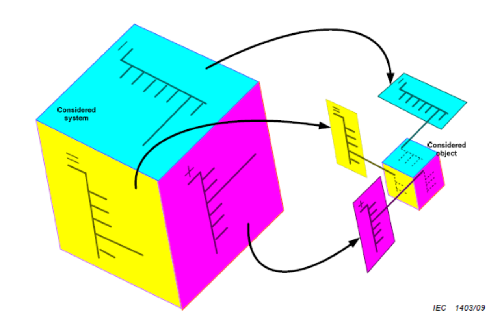
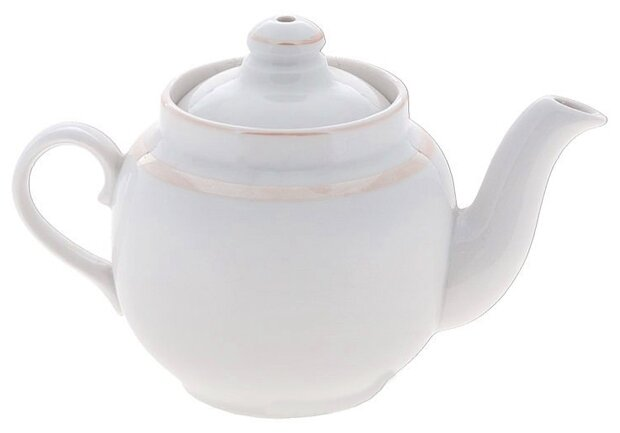
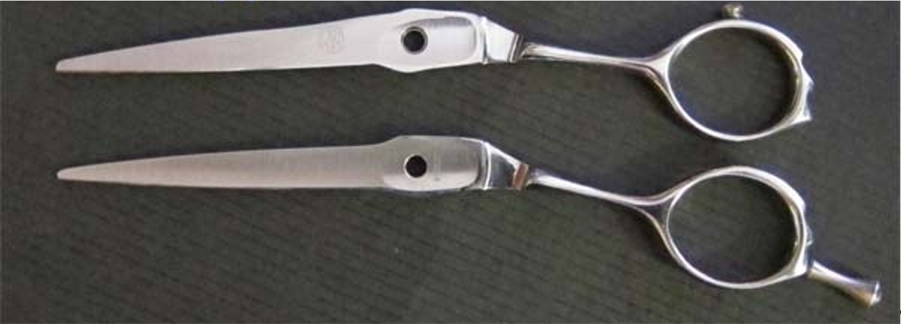
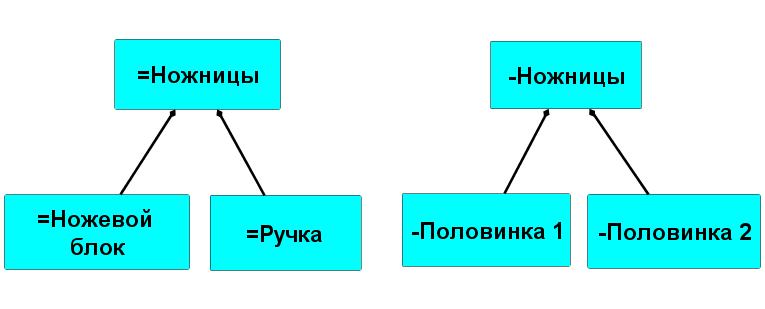

# Несовпадение функционального и конструктивного разбиений системы

Разбиения системы по разным видам частей, которые будут предметами методов для разных проектных ролей оказываются тоже разными, ибо «система в глазах смотрящего», а вернее, в глазах не просто смотрящего, но работающего по методу. Каждое разбиение с его способом выделения из мира объектов внимания удобно для обсуждения каких-то одних предметов интереса в работе роли по её методу, и неудобно для обсуждения других.

В рабочих проектах границы систем обычно выбирают таким образом, чтобы они как функциональная/ролевая часть, продуктовая/конструктивная часть и размещение занимали одно и то же место в пространстве-времени, как изображено на картинке целым кубиком. Но если начинать одновременно разбираться с тем, как такая система работает (её роли, функциональные части и их функции), из чего её сделать (конструктивы/модули, продуктовые/конструктивные части), как она скомпонована (места/размещения), и какие на всё это затраты (стоимостные части), то окажется, что иногда функциональные части, продуктовые части, места в ней полностью совпадают (их и назовут «подсистемы» — подсистемы ведь тоже системы), но иногда такого совпадения не будет — и это намеренно, это нормально!

Так, ТРИЗ (теория решения изобретательских задач) повышает идеальность изобретаемых в ней систем тем, что несколько разных функций (помним: функция — это поведение функциональной/ролевой части системы в ходе работы её надсистемы, то есть функция системы — это функция системы в надсистеме, функция подсистемы — это функция подсистемы в системе) выполняются в ней меньшим числом конструктивов — в идеальной системе все функции выполняются нулевым числом конструктивов (конструкции вообще нет, а функции роли выполняются!). ТРИЗ прямо такую ситуацию называет важной, кладёт её в основу изобретательства. Сходу понятно, что один конструктив может выполнять как аффорданс множество функций, тем самым участвуя в реализации самых разных ролей из функционального разбиения: « — Вот какая польза от этой картины на стене? - От этой картины на стене очень большая польза. Она дырку на обоях загораживает»[^r6-1].

Польза/назначение/функция/метод (это всё поведения, ведущие к результатам — переходу каких-то предметов метода в какие-то целевые состояния) могут выполниться самыми разными «конструктивами-в-ролях» — забивать можно и молотком, и камнем. Но и молоток, и камень могут выполнять роль как «забивала», так и пресс-папье, причём в одном и том же проекте. Скажем, плотник забивает молотком-забивалом гвоздь, а затем кладёт этот же молоток, но уже как молоток-пресс-папье на бумажный эскиз собираемой конструкции, чтобы этот эскиз не унесло ветром. Функций две, молоток один — хотя эти роли он выполняет в разное время. Но выполнение разных ролей одним конструктивом в один момент времени тоже вполне частый случай.

Нельзя гарантировать, что системное/функциональное разбиение, а также продуктовое/конструктивное разбиение и пространственное разбиение совпадают. В девяти случаях из десяти они могут совпасть, но у вас будут огромные проблемы в проекте с оставшимся одним случаем из десяти, если вы не будете его учитывать!

**Нельзя путать** **роли/«функциональные части»** **и** **конструктивы/продукты.** Нельзя путать ролевого Принца Гамлета и конструктивного Василия Пупкина, даже если во время спектакля это одно и то же, они совпадают 1:1. Если вы будете за кулисами говорить Василию Пупкину «Ваше Высочество», а на сцене говорить Принцу Гамлету «как там твои жена и дети?», то окружающие на вас будут смотреть странно, а Василий Пупкин сильно озадачится в обоих случаях.

Мы уже рассматривали заварочный чайник, в котором всего два продукта/детали/конструктива (корпус и крышка) и довольно много функциональных частей (ёмкость, носик, заливочное отверстие в ёмкости, ручка ёмкости, крышка, ручка крышки, паровыпускное отверстие).

Кажется, что трудно перепутать в чайнике функциональные и конструктивные части? Увы, легко! Например, к вам попал список функциональных частей, и вы хотите всё это изготовить. Вы можете попросить изготовить ручку крышки один завод, а крышку — другой завод, если не разобрались. Посмотрите на картинку чайника — это же нелепо, правда? Но если вы никогда не видели чайника, а работаете со списками объектов проекта (не указано каких) и планируете поставки — такого сорта ошибки у вас будут непременно.

Рассмотрим на примере ножниц, что бывает, если люди путают части функциональные (ролевые времени эксплуатации, работающие с окружением по их назначению/функции/методу) и конструктивные/продуктовые/модульные (времени создания, над которыми работают системы создания для их проектирования и изготовления).

Для ножниц инженеры придумывают разные формы ручки и ножевого блока, думая о ручке и ножевом блоке как о функциональных частях. Они обсуждают ручки и ножевой блок как физически существующие (за ручку держат, проектируются её длина и диаметры колец для пальца и гладкость, а также на парикмахерских ножницах размеры упора для мизинца[^r6-2], ножевым блоком режут — проектируются его длина, прочность и острота, угол раскрытия). Если менеджеры отдела закупок будут воспринимать ножницы состоящими из таких функциональных частей как из продуктов/изделий/модулей, то они попытаются заказать работы по изготовлению ручек и ножевого блока раздельно: ручки фирме, понимающей в эргономике, а режущий блок заводу, который умеет делать ножи («ножницы» как раз происходят от слова «нож»!). Инженеры от этого будут в шоке, поскольку они для целей изготовления и сборки начинают думать про ножницы как состоящие из модулей/рабочих продуктов: двух цельных кусков металла специальной формы, скреплённых винтиком. Заказать можно только конструктивы/продукты/изделия/материалы, а ручка и ножевой блок у ножниц только ролевые/функциональные элементы — их роль никто не играет, если нет назначенных на эти роли конструктивов/продуктов/модулей! Конструктивами в ножницах будут только две половинки ножниц (а ещё винтик). Если делать ручки и ножевой блок отдельно как конструктивы, а потом их как-то скреплять, то это будет плохое и ненадёжное инженерное решение. Вот ножницы на момент «как делать» (результат модульного синтеза: конструктивы, которые выполнят функции ножевого блока и ручек):

Менеджеры в ситуациях несовпадения функциональных и конструктивных частей сначала внимают доводам инженеров, но потом... смотрят на ножницы в сборе, видят в действии (эксплуатации, operations) ручку и ножевой блок — и опять пытаются с ними сделать что-то по отдельности не в момент «игры/спектакля/работы» (когда ножницы в сборе и используются — ножевой блок режет, а за ручку их в этот момент держат), а в момент изготовления — менеджера же не волнует время использования, он себя ощущает ответственным за изготовление! Вот почему от менеджеров требуется удерживать внимание не только на создателях, но и на целевой системе в момент её использования!

Чаще всего менеджер пытается разделить работы по сборке ручки и ножевого блока, хотя при соединении половинок ножниц винтиком разделить работы по ручке и ножевому блоку принципиально невозможно. Промежуточная ошибка тут и в том, что во внимании менеджера (обычно это операционный менеджер) только «ресурсы и работы», но не методы работы. А ведь работы нужны только для того, чтобы был выполнен какой-то метод работы, а метод работы должен привести какие-то предметы в нужные состояния. Инженеры это продумывают, менеджеры — нет, отсюда и ошибки, и образ менеджера в глазах инженера как полного идиота.

Или менеджер может сделать каталог ручек и каталог ножевых блоков и потом пытаться заставить инженеров выпускать эти якобы «детали ножниц» в виде запчастей. Список ошибок и заблуждений тут бесконечен, и эти ошибки не прекратятся: менеджеры постоянно находят ролевые «ножевой блок» и «ручки» в инженерной документации и пытаются поступать с ними как со сборочными/конструктивными единицами.

Правда в том, что в ножницах разные проектные роли усматривают два разных разбиения: одна — функциональной декомпозиции («аналитическая»), а вторая — конструктивного/модульного синтеза/сборки («синтетическая»):

Обратите внимание на префиксы перед одними и теми же именами, они обозначают по IEC 81346-1:2022 как раз разные типы, «=ножницы» тут типа функционального объекта, а «-ножницы» — конструктивный объект. Если имена совпадают, то невозможно по одному только имени понять, о функциональных или конструктивных ножницах мы говорим, обсуждаем ли время эксплуатации или время изготовления: требуется или задать префикс, или определять это из контекста, а если контекста не хватает, то обязательно переспрашивать.

Целевая система едина как функциональная часть и она же конструктивная (полностью совпадают), но вот дальше «функциональная структура»/«системное разбиение» «модульная структура»/«продуктовая декомпозиция»/«конструктивное разбиение» могут существенно различаться.

В инженерных языках моделирования концепции «железной» системы как описания воплощения конструктивными частями ролевых/функциональных частей (раньше говорили «архитектуры», до появления у архитектуры своего собственного предмета работы по оптимизации связности конструктивов/модулей с целью получения приемлемых архитектурных характеристик системы), равно как и в языках моделирования предприятия, функциональные и конструктивные части имеют различные значки, обозначающие разные типы этих объектов. Если не понимать разницу между объектами разных типов, то использование языков моделирования становится ошибочным и приносит вред, а не пользу. Многие ошибки менеджеров как раз идут от попыток принимать менеджерские (логистические, отвязанные от функциональности) решения по поводу функциональных частей, когда по факту в их власти принятие решений только по поводу конструктивных частей (они планируют ресурсы создателей на создание и развитие конструктивных частей).

Если в классическом проектном управлении сделать up-front (то есть заранее спланированные, когда уже известны все детали изготовления) графики воплощения/реализации/изготовления конструктивов/модулей (скажем, финализации описаний модулей-контейнеров в программной инженерии) и реализации функциональных частей (в программировании они, например, могут называться «фичи», features) — то они будут абсолютно различными, но оба могут иметь смысл! **Главное при этом—** **это решения создателей системы, какие** **части** **конструкции реализуют какие необходимые для работы системы функции/методы работы, начиная тем самым играть какие-то роли (то есть воплощая функциональные объекты). Обычно** **для этого нужно** **описать** **и** **функции (поведение),** **и функциональные части (ролевые части, которые выполняют поведение/функцию), и** **конструктивные части/модули/продукты/изделия, и где это всё размещено** **(компоновка), и стоимостные части (как распределена** **совокупная** **стоимость владения, а заодно и стоимость создания).**

В сложных случаях моделируют отдельно и функции (поведение), и функциональные части (ролевые объекты, которые как-то себя ведут). В более простых случаях обходятся либо функциями/поведением, либо функциональными/ролевыми частями — но никогда только конструктивными частями/продуктами/модулями, ибо предмет интереса «как работает» обязательно должен обсуждаться, его нельзя пропускать. **«Как работает»,** **функциональность** **(какую пользу приносит система надсистеме, какой сервис делает система для систем в окружении)** **какобласть интересов—** **это главная область/зона интересов** **в** **современном** **системном мышлении, главный предмет интереса, важнейшая характеристика системы!**

Важность функционального разбиения подчёркивается в самых современных исследованиях, где системное мышление используют для объяснения таких явлений, как эволюция и жизнь. Функциональный аспект вводят через понятие аффорданса/affordance[^r6-3], подразумевающее единство агента и используемого им для своих целей (выполнения какой-то функции) какого-то подходящего для выполнения нужной функции конструктивного объекта из многих объектов окружающей его среды. Агент понимает, какую функцию может выполнить внешний конструктивный объект, и слово affordance подчёркивает «необъективность» функциональности, её задание зависит от агента, который вменяет функционально-нейтральному физическому/конструктивному предмету окружения какую-то нужную агенту функцию в целевой системе, агент тем самым делает **изобретение**, то есть угадывает, какие конструктивы могут выполнить нужную функцию — это и есть «изобрести», для известной функции подобрать конструкцию, модульный синтез — это и есть «изобретение».

[^r6-1]: Э.Успенский, «Дядя Фёдор, пёс и кот», <https://youtu.be/qPeUokgTRik>

[^r6-2]: <https://mustang-professional.ru/parikmaherskie-nozhnitsyi-s-uporom-zachem-nuzhen-upor>

[^r6-3]: <https://en.wikipedia.org/wiki/Affordance>, см. также <https://arxiv.org/abs/2110.14602>, <https://www.activeinference.org/>
