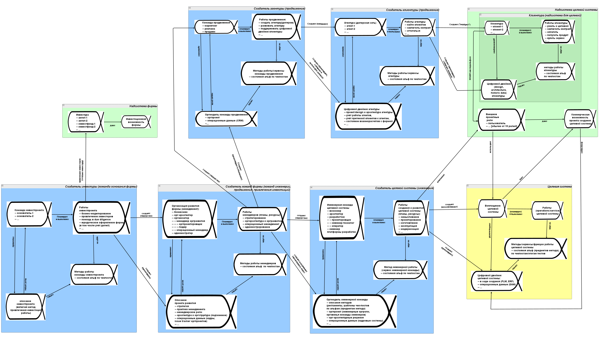

# Системное описание (предметов) деятельности предприятия

Схема/schema[^r6-1] в мышлении — это не обязательно диаграмма, а просто набор понятий и отношений между ними как некоторый шаблон для мышления, опора для внимания в мышлении (framework, «о чём думать», что держать во внимании, чеклист важного). Схема вполне может быть выражена и текстом на естественном языке, и текстом на формальном языке (моделирования или программирования), но можно выразить и диаграммой. В последнее время реже говорят о схеме, чаще говорят об онтологии (многоуровневое множество хорошо согласованных понятий и их отношений) или онтике (небольшое часто одноуровневое множество понятий, которые удобны для описаний предметов какой-то предметной области, вот её и называют обычно framework).

Весь текст нашего руководства даёт некоторую онтологию/«большую схему системного мышления» — связанный отношениями набор понятий системного мышления, который используется для системного моделирования. Для некоторых частей этого набора понятий и их отношений (онтологии системного мышления) мы приводили не только текстовое описание, но и давали диаграмму: графическое изображение онтологии как графа, где понятия изображены какими-то узлами, а рёбра графа означают отношения между понятиями. Была диаграмма для проектных ролей, в предыдущем подразделе мы рассмотрели диаграмму описания системы.

Жизнь показала, что инженеры-менеджеры не считают отдельные наборы понятий и отношений по каким-то темам из руководства по системному мышлению и руководства по системному моделированию частями одной связной онтологии, одной «большой схемы» (повторим: схема тут термин для набора понятий, связанных отношениями, может быть представлена как текстом, так и диаграммами. Текст нашего руководства — это как раз и есть представление набора понятий и отношений системного мышления, а также рекомендации по их использованию в системном моделировании).

Если говоришь «проектная роль», то инженеры-менеджеры тут же вспоминают про предпочтения, но забывают, что роль выполняет какой=то метод работы (это же в других абзацах!). Если говоришь «важная характеристика», то тут же вспоминают про предпочтение, но забывают о том, что ролевое описание/view отвечает на вопросы по этой характеристике ровно для того, чтобы понять, что там происходит с предпочтением, а сам предмет интереса отражается/framed ролевым методом описания/viewpoint (это же в совсем другом разделе и даже в другом руководстве!).

Проблема в том, что все понятия из теорий/знаний/объяснений интеллект-стека фундаментальных методов мышления (включая и понятия методологии, и понятия системного мышления) применяются в рассуждениях совместно, а не клочками. Если ты в ходе работы по какому-то методу подумал о чём-то важном (помним, что понятия для предметов метода представляют чеклист того, что нужно бы продумать в той или иной ситуации), то дальше подумай и о тех важных предметах метода, что связаны известными из теории/объяснений отношениями с тем предметом, о чём ты сейчас подумал — и так тебе будет удаваться не пропустить в мышлении какие-то важные предметы метода.

Если вспомнил про какого-то человека (или даже более крупное оргзвено) в проекте, что у него есть «трудовая роль»::тип (применил тип из нашего руководства!), то вспомни и о её «предмете интереса/важной характеристике системы»::тип, и о «предпочтении в характеристике»::тип, но также вспомни и о «методе работы роли»::тип, и о «ролевом/аспектном описании»/view»::тип, а также его «методе описания»/viewpoint::тип! Что тут «вспомни»? Вспомни о том, что в рассуждении тебе нужны объекты этих типов, и найди эти объекты в реальной жизни! И тут мало будет просто вспомнить об альфах, состояния которых меняются в ходе всего проекта, ещё надо будет проявить собранность: помнить о них в ходе всего проекта, постоянно удерживать на них внимание (то есть лучше бы не просто вспомнить, но и записать вспомненное, чтобы тут же не забыть).

Если важные объекты в проекте почему-то сходу не находятся — задай вопросы участникам проекта, получишь неожиданные ответы! Этот список «о чём нужно подумать, состояния чего нужно отследить» не так велик: в жизни столько всего мелькает, воет и трясётся в проекте, отвлекая внимание, что фокусирование внимания на вот этих понятных и привычных ходах мысли по объектам-типам-предметной-области, для которых мы находим объекты-в-жизни, сэкономит много времени на сокращении размышлений о неважном. Как отделить важное от неважного? Важное в непонятных ситуациях — это то, для чего человечество выбрало типы мета-мета-моделей (они прошли довольно долгую эволюцию, интеллект-стек фундаментальных методов мышления продолжает развиваться), а важное в более-менее понятных ситуациях — это то, для чего есть типы мета-моделей конкретных предметных областей.

Вот пример диаграммы для системного описания (предметов) деятельности предприятия. По факту это диаграмма альф, ибо альфы — это предметы деятельности, деятельность — один из синонимов «метода».

Это иллюстрация, которая показывает, что рассмотрения предметов методов работы разных оргролей в графе создателей предприятия, тесно связаны. Для каждой оргроли, которая выступает как система в графе создателей какой-то системы, приведено моделирование её предметов метода как альф, но кто там что создаёт (кто какие предметы метода меняет своими работами) — вот это и можно посмотреть.

Мы не поощряем работу с подобными диаграммами при моделировании рабочих проектов, ибо в рабочих проектах диаграммы надо менять часто, а это обычно более чем трудоёмко, плюс разные части диаграммы надо обычно менять разным людям, да ещё и моделеры для диаграмм малодоступны, не на каждом рабочем месте такой найдёшь. В руководстве по методологии будет рассказано, как моделировать альфы предприятия не такими диаграммами, а списками (сверхкраткая форма) и табличками (удобная форма, поддерживаемая практически любым операционным софтом). Мы даём тут диаграмму только в качестве иллюстрации, нам надо показать, как делается моделирование целевой системы и графов создателей какого-то предприятия с использованием основного набора (kernel) из четырёх альф для каждой системы: воплощение системы, описание системы, метод работы системы, работы системы. Подробно эта диаграмма раскрывается в руководстве по системному менеджменту, которое посвящено созданию и развитию организаций.

Будет ли после разглядывания этой диаграммы[^r6-2] (если вы сможете там что-то прочесть из-за мелкого шрифта, проблема большинства больших диаграмм на маленьких экранах!) при появлении в мышлении роли::«тип какого-то объекта в предметной области» (скажем, при взгляде на экран с «Аристархом Владимировичем»::агент-AI вспоминается, что он инженер-архитектор::роль) приходить в голову теперь не только желание подумать про его предметы интереса и предпочтения в них, но и приходить желание подумать про практики архитектурной деятельности? Желание подумать про методы описания, которые устанавливают соглашения для описаний, используемых в архитектуре (например, ADR как architecture decision records), чтобы поддержать содержательный разговор с Аристархом Владимировичем как инженером-архитектором? Не факт. Много текста, который продемонстрирует примеры рассуждений (то есть ещё и выполнил заземление/grounding), тут поможет больше.

Нейронная сетка людей тренируется лучше употреблением слов, а не разглядыванием картинок: человечество получило цивилизацию после того, как научилось писать, картинок для передачи знания не хватает. К каждой картинке всё равно приходится писать (а если не писать, то «приговаривать устно», что ещё хуже) много-много слов. Картинки трудно прочесть, их трудно редактировать.

Сама по себе «картинка» иллюстрации к описанию предметов работы предприятия содержит очень немного знаний, всё равно её приходится описывать сотнями страниц текста как нашего руководства, так и руководства по методологии. Не факт, что такая картинка что-то дополнительно проясняет: чем больше понятий и отношений содержит диаграмма, тем менее она читаема, менее понятна, менее употребима. А если её разбить на части — то и мышление разбивается на части, у него нет уже целостности всей дисциплины. И возвращаемся к исходному вопросу: как связать в мышлении хорошо усвоенные кусочки мышления про целевую систему, создателя (инженерную команду) целевой системы, создателя инженерной команды (менеджерскую команду), создателей менеджерской команды (команду инвестпроекта), а ещё увязать работу службы продвижения и даже работы клиентуры, клиенты которой должны потрудиться, чтобы купить наш продукт и использовать его в своих надсистемах? Тут ещё проблема в том, что всем этим надо заниматься разным людям — и каждому придётся разбираться подробно со своим кусочком диаграммы.

Самая большая беда будет, если вот такая диаграмма будет задействована в оргработе на предприятии: она будет как картина хорошего художника — смотреть на неё приятно, но вот поправить что-то на ней будет очень трудно, поэтому эти правки не будут выполняться, а диаграмма будет довольно скоро существенно расходиться с жизнью, будет вечно неактуальной. Все модели в системном мышлении должны быть легкоизменяемыми и ставиться под управление конфигурацией (всегда должен быть ответ на вопрос, кто что когда менял, изменить должно быть легко, равно как легко проверить, нет ли в изменениях каких-то ошибок). Диаграммы для постоянных изменений существенно хуже текстов на формальных языках и хуже таблиц. Поэтому в жизни вместо диаграмм используем табличное моделирование: системное мышление (табличным) моделированием. Примеры такого моделирования — это выполнение заданий по моделированию в нашем руководстве.

В любом случае, нужно понимать, что постепенно и последовательно излагаемый в руководстве набор понятий как типов объектов из жизни, которые задаются знаниями/дисциплинами/онтиками интеллект-стека фундаментальных методов мышления (включая набор понятий системного подхода), представляет собой некоторую «большую схему/онтику системного метода описания». Отсутствие для такой «большой схемы/онтики метода описания» диаграммы как графического представления схемы ровно ничего не означает. Вы смело можете считать, что всё руководство просто своим текстом постепенно описывает набор типов мета-мета-модели, в котором какими-то отношениями связаны все упоминаемые в руководстве понятия, но **огромной** **диаграммы-картинки** **(даже разбитой на части)** **для них всех не будет. Такая картинка бесполезна** **(это очень контринтуитивно, но такая картинка и впрямь бесполезна!), но вот иные формы представления (тексты на естественном языке, тексты на формальных языках, табличные представления)—** **они вполне работают.**

[^r6-1]: <https://plato.stanford.edu/entries/schema/>

[^r6-2]: Вот эта диаграмма в высоком разрешении — <https://ic.pics.livejournal.com/ailev/696279/247262/247262_original.jpg>, оригинал файла делался в редакторе yEd, <https://disk.yandex.ru/d/qMDMgCZTkkT4-w>
