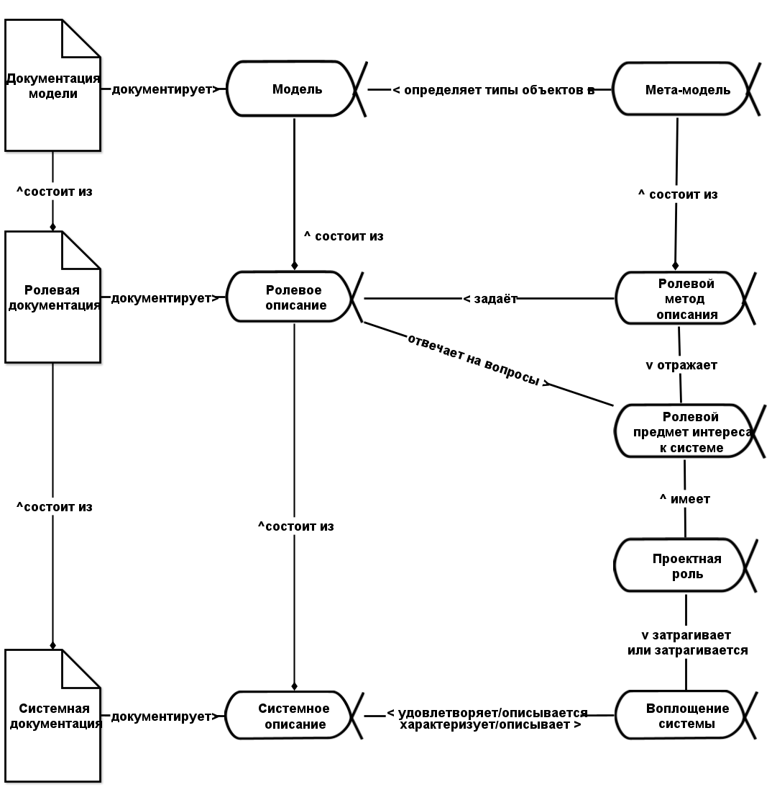
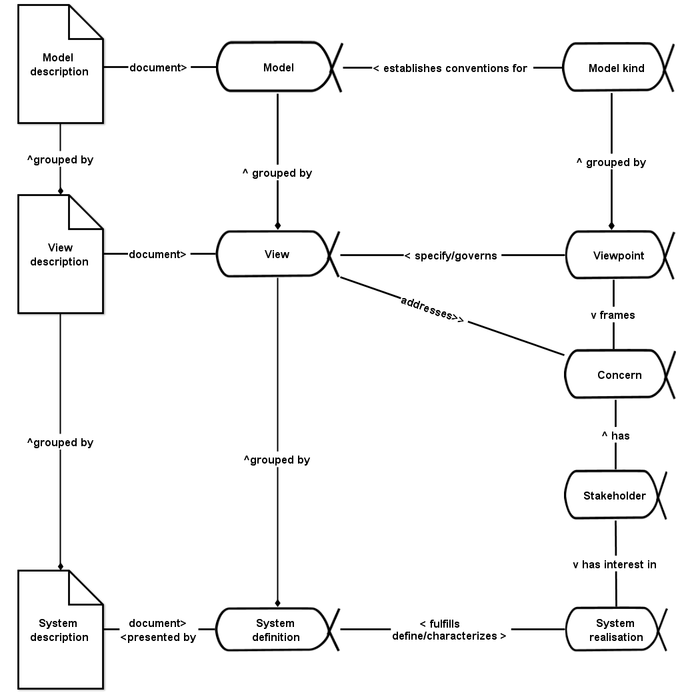

# Системное описание

**Системная документация/документация системы** (system description) — это документы/артефакты/рабочие продукты, реализующие альфу **системного описания/описания** **системы** (system definition). Описание системы в предыдущей фразе дано с типом альфа — это означает, что предлагается онтика, в которой создатели будут разрабатывать описание системы какими-то методами описания, оно будет предметом метода, будет проходить какие-то состояния, которые будут отслеживаться в ходе проекта, и будет представлено какими-то артефактами.

**Если система есть, то она** **считается** **описанной:** **у неёсуществует** **концепция использования** **системы** **(альфа, не рабочие продукты!),** **существует** **её** **проект/design** **(который** **включает концепцию системы, архитектуру как набор архитектурных решений, а ещё инженерные обоснования, детали изготовления, описание** **метода/технологии изготовления и т.д.).** Мы можем просто ещё не знать это описание, хотя оно «логически есть» — система-то в пространстве-времени, и время тут может быть в некотором будущем, а мы в настоящем, и поэтому просто ещё не подумали об этих описаниях и не документировали их. Альфы есть, но рабочих продуктов нет — поэтому нельзя ничего об этих альфах сказать. Но мы считаем, что они уже есть как предметы каких-то методов, они проходят какие-то состояния, но вот какое состояние у этих альф в проекте прямо сейчас — ничего сказать не можем, если нет артефактов, по которым мы эти состояния сможем узнать.

Или мы просто не нашли ещё исполнителей, делающих такие описания проектных ролей, и не догадались ещё задать им правильный вопрос — и они нам дадут недостающие части описания, они-то их знают, это только мы пока не знаем. В любом случае: есть система — есть концепция использования, есть концепция системы, есть её архитектура, возможно просто пока не выявленные/discovered (либо не найдены уже имеющиеся, либо их ещё не придумали и не документировали): типы мета-мета-модели мы уже знаем, осталось только получить сами объекты, а затем документировать эти описания.

Это не так, что «мы не знаем, есть они или нет». Они есть, вот же их типы — значит, описания должны быть, рано или поздно, внимание к ним как альфам (они будут менять свои состояния в ходе проекта) уже есть, внимание наводится уже известными вам типами! Надо только их выявить или даже спроектировать — предложить догадку о том, каковы они, согласовать догадки разных людей, попробовать изготовить по этим описаниям систему (тогда такие описания назовут проект/design).

**Когда вы идёте в совсем новый проект, вы уже много знаете о том, за чем вам там надо следить,** **изменения состояний каких альф отслеживать,** **у вас не полная неизвестность! Вы уже знаете** **фундаментальную** **мета-мета-модель, а иногда и** **прикладную** **мета-модель (если будете заниматься чем-то в прикладной предметной области, практику которой вам уже довелось освоить). Поэтому что-то о мире вы уже знаете, но что-то (модель** **ситуации, безо всяких «мета») придётся узнать в самом проекте, да ещё и отслеживать смену состояний** **объектов быстро меняющегося проекта.**

Если речь идёт об обуви, то вы уже знаете, что там будет подошва, каблук, стелька, форма называется «фасон» — достаточно одного слова «обувь», чтобы начать обсуждать объекты этих типов. Они там точно есть, даже если каблук там «без каблука» (пробел — тоже знак!). Если вы идёте в проект, то вы знаете, что там создаётся система, есть создатель, отслеживать надо альфы, и для многочисленных систем проекта надо отслеживать как минимум их четыре (целевая система, описание системы, метод работы системы, работы системы) да ещё и бить на подальфы (про подальфы будет чуть позже).

Чтобы явить миру (выявить) описание системы, его нужно не только узнать (или даже предложить новое), но и записать на каком-то носителе, чтобы появилась системная документация — записать все эти модели (а иногда и тексты на естественном языке, и фотографии, которые не очень похожи на модели, тем не менее они тоже отражают только что-то важное в реальной системе, описывают что-то в ней, так что смело считаем их тоже моделями, разве что это менее формальные описания) в электронном виде как записи в базе данных. Представление на бумаге сегодня даже не рассматриваем, это уже прошлый век. Но когда говорят об альфе системного описания (system definition), то рабочий продукт системной документации (system description) по большому счёту неважен — это вопрос больше удобства работы, чем что-то принципиальное. Сейчас удобно работать с записями в базе данных (локальные представления на электронном носителе), потом, возможно, с какими-то нейросетями, отражающими эти описания (распределёнными представлениями на электронном носителе), а в прошлом веке работали с локальными представлениями на бумаге (например, бумажными чертежами механических систем).

Есть система — значит кто-то её выделил из окружающего мира для каких-то своих целей («система в глазах смотрящего»), согласовал это выделение системы из мира с другими создателями в графе создателей (обычно ведь коллективные проекты), думает о ней, удерживает внимание на предметах метода работы с системой. Думает — значит проводит какие-то операции с её описанием, без этого нельзя в том числе проводить и другие работы с инструментами, меняющими систему в физическом мире. Варианты создания и развития систем без каких-то работ по её проектированию или восстановлению проекта/design в ходе «обратной инженерии»/«reverse engineering» мы тут не рассматриваем, «не пишешь — не думаешь», проекты/projects без проектной/design документации имеют минимальные шансы на успех.

Если какая-то роль не может описать какую-то ипостась системы, значит систему из окружающего мира она ещё не выделила. **Мы должны** **чётко различать** **существующее** **всегда** **описание** **системы** **как** **альфу** **(возможно в состоянии «описание** **системы в объёме короткой идеи о концепции использования»)** **и существующую** **не всегда** **документацию системы как** **рабочий продукт/артефакт** **(в том числе электронный** **документ).**

Иногда переводят описание системы/system definition как «определение системы». В этом случае нельзя путать термин со «словарным определением», типа «наша система — это то-то и то-то». Нет, это самая разная информация о воплощении системы, она включает самые разные модели целевой системы, а часто это конструктивное описание (в смысле конструктивизма: «чтобы описать объект, надо задать операции его построения»), так что явно или неявно также описываются создатели из графа создателей и их операции — это всё и будет описанием системы (system definition). Одной фразой «определения из словаря» её не заменишь, в system definition совсем другое значение термина definition, это не отсылка к «определению, как в словаре».

В жизни при прямой инженерии обычно всё начинается с разработки (выявления, придумывания, согласования между собой) и документирования каких-то ролевых видов описания (концепции использования, концепции системы, архитектурных решений и так далее), а потом от проектных описаний команда проекта переходит к воплощению::метод системы в физическом мире (изготавливает/производит систему, вводит её в эксплуатацию) — и всё это в непрерывном цикле развития системы, через множество версий системы, собираемых из множества версий её частей. Если это обратная инженерия/reverse engineering, то всё наоборот: берём систему в физическом мире и восстанавливаем все описания для уже готовой системы. **Обычно в проектах для надсистемы идёт обратная инженерия, а для целевой системы — прямая.**

Если вы попали в какую-то организацию (клиента, подрядчика, или только пришли в новую для вас команду проекта), то вы делаете обратную инженерию этой организации: понимаете, что там происходит в графе создателей. Если вам надо, наоборот, организовать создателя системы — делаете прямую инженерию, готовите все эти описания как проектные и затем убеждаете агентов в организации следовать этим описаниям (руководство по системному менеджменту как раз об этом, помогает это делать вся программа рабочего развития инженера-менеджера).

В философской логике рекомендуют всегда начинать с воплощения системы, даже если это воплощение будет существовать только в будущем: **нужно представить** **себе (породить/generate** **описание на базе имеющихся у вас порождающих моделей/generativemodels** **мира, знаний о мире), а затем документировать это описание** **возможного** **мира/possibleworld, в котором воплощение системы** **уже** **существует!** Ни на секунду не нужно забывать, что нужно-то воплощение системы, а описание (данное нам в виде информационных моделей, чертежей, инструкций по изготовлению и т.д.) нужно только в силу того, что без описания очень трудно воплотить в жизни работающую систему. Запоминаем: технолог, когда прописывает технологию производства кефира — делает кефир, а не просто описывает метод работ по изготовлению кефира. От него не документы в конечном итоге с описанием технологии (метода изготовления, нужного для работ по этому методу инструментария) изготовления кефира нужны, от него в конечном итоге требуют кефир в его физическом воплощении — это его целевая система. Но кефира-то ещё нет, пока технолог описывает технологию его изготовления, и инструментария по изготовлению кефира нет, пока технолог его не описал. Ничего страшного, в возможном мире они уже есть, в будущем! Вот это и описываем.

Заданного направления чтения (слева направо, или справа налево, или снизу вверх, или сверху вниз) диаграммы альф (объектов внимания, которые будут менять своё состояние в ходе проекта) для системного описания нет. Разные проектные роли для разных своих целей читают эту диаграмму в разных направлениях. Но главный элемент диаграммы — это, конечно, воплощение системы. Ради него вся деятельность и затевается, его всегда нужно держать во внимании.

Все подобные диаграммы — это чеклисты альф, которые нужно удерживать во внимании при мышлении о проекте, а для каждого объекта-альфы будет ещё и чеклист по состояниям, через которые её нужно провести. Подробней о чеклистах будет в руководстве по методологии, в нём также будут приведены примерные чеклисты для примерно трёх четвертей основных альф, которые встретятся вам в проектах. И будет наставление, как готовить эти описания. **Описания альф и их состояний—** **это описания альфы** **«метод работы»** **создателя—** **это предметы метода, которые меняются в ходе работ какого-то создателя.**

Стандарт ISO 42010:2022 даёт рекомендации о том, как думать о системном описании/описании системы. Сам стандарт говорит только об архитектурном описании, причём в старом понимании архитектуры, но его положения вполне применимы к любым описаниям, то есть и концепции использования, и концепции системы, и архитектуре.

Вот задающая мышление об описаниях системы диаграмма из этого стандарта, модифицированная с использованием положений OMG Essence, а также обобщённая с архитектурного описания какого-то предмета интереса (entity of interest) на системное описание в целом:

Диаграмма системного описания начинается с уже знакомого нам различения воплощения (realization) и описания (definition) системы.

Для простоты диаграммы большинство отношений (кроме одного: удовлетворяет/описывается в одну сторону и характеризует/описывает в другую сторону) приведены только с одним наименованием связи, но это не значит, что не существует обратного отношения. Это общее свойство всех подобных схем: даже отношение «часть-целое» в одном направлении читается «включает\_в\_себя» или «состоит из», в другом направлении читается «является\_частью» или «входит в состав».

Каждая связь между объектами этой диаграммы может быть прочтена в двух направлениях, например «описание системы выражается документацией системы/системной документацией», «системная документация документирует системное описание». Говорят и «системная документация», и «документация системы», и «системное описание», и «описание системы».

**Обратите внимание, что документация не фиксирует, а документирует** **постоянно меняющиеся в ходе проекта** **описания** **(системное, ролевое, модель)! Избегайте слова** **«фиксирует»,** **потому как** **люди обычно думают, что это означает не документирование (как думаете вы, произнося слово** **«фиксирует»), а объявление описания уже не изменяющимся, «заморозку требований» или «заморозку проектных описаний».** «Запиши» — это документируй, а «зафиксируй» — это «перестань менять», совершенно другое действие! Вас обязательно поймут с «фиксацией» как «дальше не обсуждаем, а выполняем».

Фиксация или фиксирование требований в инженерии прошлого (сейчас так иногда продолжают говорить о фиксации концепции использования, а ведь исключение фиксации/заморозки требований и было одной из причин отказа от разработки требований в пользу разработки концепции использования) для большинства людей означает не запись требований на бумагу или в базу данных, а объявление текущего состава требований стабильным и неизменяемым. Но в системном мышлении вы лучше и лучше описываете систему (или описываете всё более лучшую систему, по мере понимания того, как именно она будет использоваться, в каком окружении), меняя и меняя тем самым концепцию использования — документирование этому не мешает, модели системы не «фиксированы» ни в один момент времени проекта! Вы можете какую-то версию административно объявить стабильной. Инженеры говорят в этом случае о базисе/baseline, но это не означает «фиксации»! Просто изменения системных описаний будут собираться и документироваться в других артефактах (документе «рабочей версии», а не документе уже утверждённого «базиса»), а потом базис будет меняться по какой-нибудь административной процедуре управления изменениями проекта/change management. Но и тут изменения: магистральная разработка/trunk-based development[^r6-1] подразумевает, что вся разработка не порождает отдельные долго живущие ветви, а в современной инженерии (например, на заводах Tesla, в SpaceX) каждый отдельный автомобиль или ракета имеют уникальные описания (project description), выпускаются по уникальному проекту и производственному процессу каждый, нет двух одинаковых автомобилей или ракет. Но с этим разбирается уже третье поколение системного мышления, там речь о версионировании — и как жить, когда версия каждого экземпляра системы уникальная, а сами эти системы непрерывно развиваются.

Пока же запоминаем: диаграмма не говорит о том, что разово делается одна версия системного описания, которая потом будет задействована при изготовлении системы. Нет, диаграмма просто говорит о том, какие объекты внимания в проекте у вас есть, когда вы описываете систему и документируете эти описания. Это альфы, так что вы должны удерживать во внимании не просто эти объекты, а изменения состояний этих объектов (предметов самых разных методов инженерии и менеджмента) в ходе проекта.

Вот эта же диаграмма на английском языке:

Описание системы (system definition) состоит из **ролевых/аспектных/видовописаний** системы (views), которые определяются важными характеристиками (concerns, ролевыми предметами интереса/озабоченностями) и задаются аспектными методами описаний (viewpoints). **Ролевые/аспектные/виды** **описания** **системы** — это как раз концепция использования (разрабатывается ролью инженера-проектировщика), архитектура (формулируется ролью инженера-архитектора), и так далее — описания, которые делаются различными инженерными ролями, даются в руководстве по системной инженерии. Но в менеджменте это будет, например, не просто архитектура, а орг-архитектура, а в качестве «концепции использования» у организации будет выступать бизнес-модель, где обосновывается необходимость организации (и за неё будет ответственной роль бизнесмена). Аспектные описания — это что угодно, что описывает систему удобным способом для обсуждения ролевых интересов.

Конечно, ролевых/аспектных/видов описаний может быть множество. Например, роль могут интересовать финансы. Тогда ролевое описание — финансовое, модели там будут — бухгалтерский баланс, отчёт о прибылях и убытках, поток денежных средств. Как сделать эти описания? Эти описания могут быть сделаны по методу описания РСБУ (Российская система бухгалтерского учёта) или МСФО (Международная система финансовой отчётности), а мета-модели — это форматы представления бухгалтерского баланса, отчёта о прибылях и убытках, потока денежных средств в соответствующих ролевым методам описания (РСБУ или МСФО). Если финансиста заинтересуют оба метода описания, то он получит два описания — и по РСБУ, и по МСФО. Как будут документированы эти описания? Или на бумаге, или в табличках Excel, или в базе данных компьютерной бухгалтерской программы — в любом случае, содержание описаний можно обсуждать без обсуждения формата представления на носителях информации.

[^r6-1]: <https://trunkbaseddevelopment.com/>
