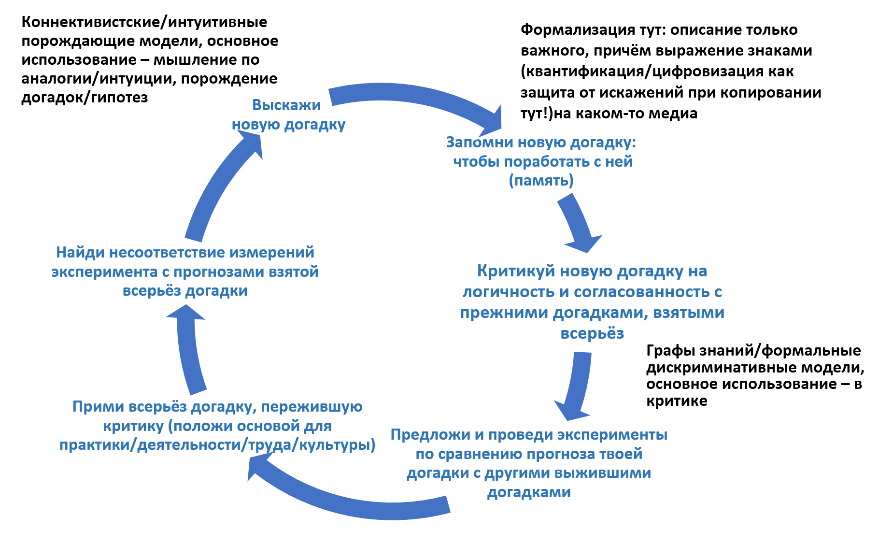
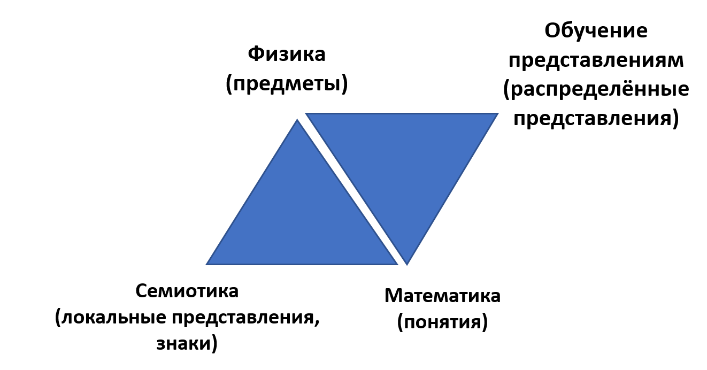

# Третье поколение системного подхода: учёт времени эволюции

Vanchurin, Wolf, Koonin, Katsnelson заметили, что рассуждения по аналогии в классической термодинамике и теории информации, применённые к величинам/quantities в термодинамике, **машинном обучении** и эволюционной биологии[^r6-1] ведут к неожиданной общей для них всех онтологии (**framework**). Другими словами, эволюция могла бы быть описана как **обучение/познание/learning**, а обучение носит термодинамическую природу, то есть вполне физический феномен. На базе замеченных аналогий они сформулировали теорию эволюции как **многоуровневого** **познания/deeplearning**[^r6-2](deep — это многоуровневость представлений[^r6-3]). В этой теории движущая сила эволюции — это **конфликты** между объектами разных системных уровней, приводящие к **неустроенностям/frustrations**[^r6-4]. Это понятие неустроенности было введено в системный язык по итогам исследований спиновых стёкол как примера поведения неэргодических (с памятью) систем и там оно означало геометрические неустроенности (невозможность устойчивой геометрии спинов в стёклах). Эволюция тем самым представляет собой процесс познания/обучения/learning, который сводится к решению **оптимизационной задачи** нахождения минимума свободной энергии за счёт изменения структуры многочисленных **системных** **уровней**. В ходе этого эволюция находит **квазиминимумы**, но не **абсолютный минимум**. Время от времени возникает **скачок роста сложности** (большой эволюционный переход, появление ещё одного системного уровня, ещё одного вида целых систем), что даёт резкую минимизацию свободной энергии эволюционирующей системы, но всё-таки это просто очередной квазиминимум, а не абсолютный минимум. В этой серии работ[^r6-5] была показана **физическая природа роста сложности систем** (на примере биологических систем, но рассуждения там безмасштабны, то есть биологичность систем или наличие сознания не влияют на выводы работы). Так что в системной онтологии появляются ещё и конфликты между системными уровнями, и явление неустроенностей из-за этих конфликтов, и вывод о неизбежности роста сложности системы как увеличении числа системных уровней.

Все эти исследователи контактируют друг с другом (например, были обсуждения между Vanchurin и Friston), потому как в основе большинства этих работ лежит термодинамика и понимание того, что все системы реализуют принцип минимизации свободной энергии и во время своего существования, и во время своего создания, и в ходе эволюции. Перевод традиционных формул для выражения этой онтологии (сейчас эта онтология выражена в привычном физикам формульном виде, традиционном для термодинамических выкладок) в конструктивистскую форму теории категорий — отдельная тема, но такая постановка задачи для математиков более-менее привычна и можно обсуждать программу исследований на эту тему. То же можно сказать про переформулирование **дифференциальной формы** в **квантовоподобную/quantum-like**[^r6-6], что могло бы увеличить точность физического моделирования биологической эволюции и техно-эволюции (меметической эволюции) в силу квантованности/цифровости большинства описываемых явлений, а заодно уменьшить время вычислений за счёт того, что вычисления ведутся в дискретных точках, а не в каждой точке непрерывных функций.

Третье поколение системного подхода учитывает, что эволюционируют прежде всего знания (в том числе знания о системах), а не только сами системы, понимаемые уже ближе к биологическим видам, это близко к изменению воззрения биологов на эволюцию как прежде всего эволюцию генома, а не эволюцию фенома. В основе современных биологических классификаций уже лежат не феномы организмов, а их геномы.

Таким образом, современная/SoTA (третьего поколения системного подхода) онтология системы:

* даёт типы объектов для многоуровневого наведения внимания с целью обеспечения эволюции целевых систем (continuous everything) системами-создателями
* рассматривает минимально три времени существования системы: operations, construction/evolving of phenome, evolution/development of genome/memome — базируется на физике, математике и computer science
* рассматривает системы как стабильные сущности в рамках минимального физикализма (в том числе системы активны по отношению к себе и окружению, системы ищут минимум свободной энергии, ведя active/embodied inference, независимо от уровня своей «разумности»)
* даёт безмасштабные описания систем (феномены квантовой физики тем самым учитываются), объясняет возникновение системных уровней (рост сложности) в силу многоуровневой оптимизации для достижения минимума свободной энергии
* мереология выражается уже не через «вечные классы» и отношения между ними, а через морфизмы, отражающие операции с физическими системами в ходе их взаимодействия. Учитывается также и то, что операции с абстрактными объектами выполняются физическими системами-создателями с (универсальным в смысле эквивалентности машине Тьюринга) вычислителем в их составе, «математик, рассуждающий о математике — тоже физический объект».

Текущее развитие системного подхода прежде всего связано с развитием знаний о распределённых представлениях, ибо все три поколения системного подхода развивались в ситуации, когда природа распределённых представлений понималась плохо, это были больше поколения системного подхода, выражаемые формально в локальных представлениях и поэтому удобные для критики:

На сегодня ещё не решена задача создания общей локально-распределённой семантики, объединяющей классическую семантику локальных представлений на базе треугольника Фреге, объёдиняющую локальные представления о знаках (семиотику), понятиях (абстрактные объекты даёт математика) и физике (объекты физического мира, отражаемые понятиями, выражаемыми в знаках, даёт физика) и нарождающуюся в работах по большим языковым моделям в AI распределённую семантику, в которой на месте семиотики стоит **обучение представлениям/representationslearning**(главным образом векторным/распределённым/distributed[^r6-7], отвязанным/disentangled[^r6-8], непрерывным/continuous[^r6-9] представлениям):

Вполне возможно, что развитие теории распределённых представлений и обобщение семантики до включения не только семиотики, но и обучения представлениям приведёт к появлению **четвёртого поколения системного подхода**, но это пока только гипотеза.

[^r6-1]: Vitaly Vanchurin, Yuri I. Wolf, Eugene V. Koonin, Mikhail I. Katsnelson, Thermodynamics of evolution and the origin of life, 2022, <https://www.pnas.org/doi/full/10.1073/pnas.2120042119>

[^r6-2]: Vitaly Vanchurin, Yuri I. Wolf, Mikhail I. Katsnelson and Eugene V. Koonin, Toward a theory of evolution as multilevel learning, 2022, <https://www.pnas.org/doi/10.1073/pnas.2120037119>

[^r6-3]: <https://ailev.livejournal.com/1045081.html>

[^r6-4]: Geometrical frustration, <https://en.wikipedia.org/wiki/Geometrical_frustration>

[^r6-5]: Yuri I. Wolf, Mikhail I. Katsnelson, and Eugene V. Koonin, Physical foundations of biological complexity, 2018, <https://www.pnas.org/doi/10.1073/pnas.1807890115>

[^r6-6]: Irina Basieva, Andrei Khrennikov, Masanao Ozawabc, Quantum-like modeling in biology with open quantum systems and instruments, <https://www.sciencedirect.com/science/article/pii/S0303264720301994>

[^r6-7]: <https://deepai.org/machine-learning-glossary-and-terms/distributed-representation>

[^r6-8]: <https://deepai.org/machine-learning-glossary-and-terms/disentangled-representation-learning>

[^r6-9]: <https://www.sciencedirect.com/science/article/pii/S2666651021000206>
