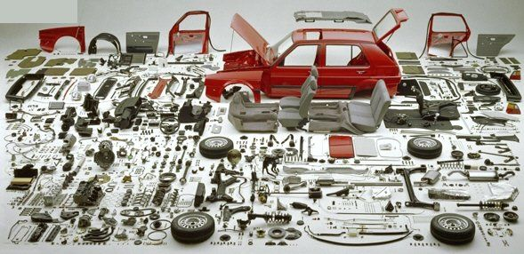
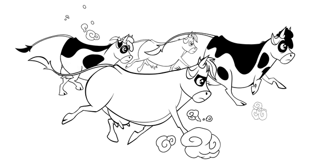

# Эмерджентность и мета-системный переход

Для того, чтобы какой-то набор физических частей был системой, нужно кроме признания факта, что эта система часть надсистемы и у неё самой есть части-подсистемы, удовлетворить ещё одному условию: эта система как набор взаимодействующих частей-подсистем должна проявлять какое-то свойство, которого нет у её частей-подсистем, ведущее к возможности новой функции целого-системы, в которые входят части-подсистемы. Это явление называют **эмерджентностью**(emergence, системный эффект). А ещё это свойство и новая функция пропадает у надсистемы, куда входит рассматриваемая система (но зато у надсистемы появятся новые/эмерджентные свойства, которых нет у системы как её части, этот системный эффект проявляется на каждом переходе от одного системного уровня к другому).

Показа времени нет ни в стрелках::часть механических часов, ни в их шестерёнках::часть, ни в корпусе::часть, ни в пружине::часть. А в часах::целое во время их работы показ времени возможен — в силу взаимодействия их частей. Каждая часть часов выполняет свою функцию в часах в целом, и возникает (emerge) системный эффект (проявляется эмерджентность, новое свойство, новая функция): часы начинают показывать время для надсистемы в системном окружении. Но вот комната (и даже ещё более мелкая подсистема комнаты, куда входят часы — интерьер), уже время не показывает, хотя показ времени часами в ней доступен и делает её удобней для проживания.

Обратите внимание: **пересечение** **вниманием границы** **системного уровня** **(называют также мета-системным переходом)** **меняет всё, он буквально** **слышен в разговоре о системах, виден в тексте описаний:**

* одни роли в связанных с часами проектах специализируются на методах, меняющими состояние уже собранных и работающих часов (используют эмерджентное свойство показа времени, создают интерьер комнаты, у которого другие эмерджентные свойства, нежели у часов), при работе с часами регулярно используется слово «время» как то, что надо будет увидеть (например, нужно ли добавить дополнительный светильник для того, чтобы видеть циферблат механических часов ночью, «посмотреть время») и даже не вспоминается о материалах для деталей часов (это на два системных уровня вниз от интерьера: сами часы и уже дальше детали — их материалы)
* другие роли — занимаются методами сборки часов (создают систему с эмерджентными свойствами часов), показываемое время их волнует в плане точности хода, а не использования.
* третьи роли ничего не говорят о самих часах, но просто изготавливают их детали, интересуясь прочностью и способами обработки металла — шестерёнки, пружинки, корпус. И у этих деталей тоже есть эмерджентные свойства, они ведут себя и характеризуются совсем не так, как ведут себя и характеризуются отдельные атомы, входящие в эти детали.
* … можно идти и дальше вниз по системным уровням: ещё какие-то роли занимаются материалами деталей часов: их прочностью, расширением при нагреве и т.д. — и это отражается в речи агентов в этих ролях как использование совсем другой терминологии.

Конечно, все эти системные уровни согласованы между собой, и регулярно в разговоре сборщиков часов упоминается и материал (его свойства влияют на свойства шестерёнок и стрелок), и время (часы ведь нужно наладить, чтобы шестерёнки и стрелки показывали правильное время!), и даже интерьер дома (обсуждение крепления часов на стене, размеров циферблата, чтобы его было видно через комнату). Но каждый системный уровень отличается своими системами, проявляющими какие-то свойства, меняющими свои состояния и в ходе работы, и в ходе создания из них надсистем методами создания самих этих систем и надсистем из этих систем (какие-то системы надо отливать в формах из расплавленного металла, какие-то — собирать из деталей, как панельные дома, какие-то — обучать, как мастерство). Эти методы меняют состояния частей системы, чтобы получить целую систему и запустить её в работу.

Разные методы создания и развития систем выполняются разными ролями в системе создания, эти роли говорят характерным языком, на котором обсуждаются системы одного системного уровня. Как мы увидим дальше — даже целым набором языков, ибо разные роли, специализирующиеся на обсуждении проблем какого-то системного уровня, используют разные языки для преследования своих интересов.

Разные роли ведут к специализации агентов на мастерстве выполнения методов работы этих ролей. Агенты, специализирующиеся на системах разных системных уровней, тоже будут разными. Люди (или даже AI, или подразделения), которые занимаются проектированием и изготовлением часов — это не те люди, которые занимаются интерьерами, и не те, которые занимаются материалами для деталей часов. Это и есть разделение труда: разные методы работы используются в проектах не просто сами по себе, а в силу появления эмерджентных свойств и функций у систем при смене системных уровней во внимании задействующих их ролей. Создатель интерьеров — архитектурное бюро, специализирующееся на методах создания интерьеров, создатель часов — конструкторское бюро (дизайнеры, занимающиеся эстетикой часов — там) и работающий в партнёрстве с ним часовой завод, создатели материалов для деталей часов — заводы, которые будут поставщиками часового завода.

Переход внимания от одного системного уровня к другому — меняется набор ведущих ролей создателей, меняются их методы работы и объекты этих методов, меняется терминология этих рабочих культур/«языки разговора». Это происходит из-за смены набора понятий, выражающих предметы внимания системного уровня: когда внимание переходит с систем одного системного уровня на системы другого уровня, меняются понятия для частей системы и их важных свойств, поэтому меняется и терминология для выражения этих понятий.

Организм::целое животного прыгает и бегает в момент использования, а его органы::части — нет. Прыжки::поведение и бег::поведение — эмерджентные функции организма. Органы производят какие-то действия внутри организма, они имеют функции в организме (например, мышцы сокращаются, печень чистит кровь, лёгкие насыщают её кислородом и освобождают от углекислоты), это проявление их системных/эмерджентных свойств как целых органов, отдельные клетки внутри органов (части органов) этого делать сами по себе не могут, хотя именно клетки внутри органов вроде как всё и делают в их взаимодействии!

Системы не просто сами состоят из частей, они проявляют своё (субъективно определяемое!) назначение через выполнение какой-то (субъективно выделяемой!) их::часть функциональной роли в составе надсистемы::целое. В предыдущей фразе было упомянуто три системных уровня: 1. подсистемы, 2. целая система из этих подсистем, она проявляет эмерджентные свойства, является частью/подсистемой и имеет функцию в 3. надсистеме.

Основная особенность систем — это то, что «всё со всем связано», **части** **системы в системе ведут себя не так, как они же вне системы, ибо они взаимодействуют между собой.** Атомы вне молекулы ведут себя не так, как внутри молекулы. Клетки вне органа ведут себя не так, как внутри органа. Органы в организме ведут себя абсолютно не так, как органы отдельно от организма.

Чтобы разобраться в очень сложных системах, состоящих из огромного количества элементов, их представляют как разбиение/декомпозицию, на каждом уровне которых ожидают системного эффекта/эмерджентности. Например, вот индивидуальные детали автомобиля:

Разбираясь с этими индивидуальными деталями, невозможно понять, как автомобиль работает, для чего все эти винтики и тросики. Чтобы объяснить, откуда появляется движение автомобиля, мы должны рассмотреть двигатель как отдельную подсистему автомобиля, то есть двигатель::подсистема как целую часть машины::система (как бы ни противоречиво звучала эта «целая часть»), составленную из подсистем двигателя, ещё более мелких частей. Чтобы объяснить, почему в автомобиле удобно могут находиться несколько пассажиров, мы должны рассмотреть (выделить вниманием) салон::подсистему автомобиля::система как единое целое из многочисленных деталей, из которых составлен салон.

Мы должны рассмотреть отдельно собранные все детали::«подсистемы» тормозной системы::«система» автомобиля::«надсистема» (для разработчиков тормозной системы автомобиль — надсистема), чтобы показать, каким образом автомобиль может тормозить. Всё это эмерджентные свойства, бесполезно обсуждать для понимания работы тормозной системы не её детали, а опускаться сразу на системный уровень ниже и обсуждать материалы, из которых сделаны детали тормозной системы. То есть эмерджентность/системный эффект торможения появляется, когда материалы уже стали деталями, и торможение происходит из-за взаимодействия уже изготовленных и правильно расположенных в пространстве деталей. Хотя формально «для математиков» торможение происходит из-за взаимодействия материалов, и даже молекул материалов! **Системное мышление—** **это не математическое мышление, оно ориентировано на управление вниманием** **для** **обсуждения каких-то действий агентов, а не формальную верность.**

Корова Маргарита имеет своей частью хвост, корова Маргарита является частью коровьего стада.

Нехорошо позволять говорить, что коровье стадо имеет хвост, хотя это вроде как корректно: все молекулы хвоста (того самого: коровы Маргариты) входят в молекулы стада. Причем стадо тут не абстрактный объект «множество коров», а вот прямо-таки все молекулы коров в загородке загона для скота. Говорить «хвост стада» математически, логически, физически корректно, но совсем не системно, и это вроде как интуитивно понятно всем: трудно предположить, что вы можете делать с «хвостом стада».

Выделение системных уровней субъективно и существенно зависит от метода, по которым идут работы с системами этих уровней. Так, интуитивно не понятно, можно ли говорить, что карбюратор — часть автомобиля с двигателем внутреннего сгорания. Он отдельная часть автомобиля, или он часть топливной подсистемы, или часть двигателя?! Какие действия надо выполнять с карбюратором, на каком системном уровне надо его рассматривать? Это будет решать инженерная команда в каждом проекте, она должна договориться внутри себя. Но интуитивно понятно: неправильно говорить, что поршень или цилиндр двигателя — это часть автомобиля. Формально это верно, но неправильно, как и в случае хвоста как части стада, вы не сможете обсуждать функционирование поршня и цилиндра непосредственно в автомобиле.

Хороший критерий тут — эмерджентность: обсуждение автомобиля в целом обычно требует обсуждения свойств и функций двигателя в целом, но есть ли там внутри двигателя поршень и цилиндр — это при обсуждении автомобиля в целом неважно.

На каждой границе системного уровня меняются системы как важнейшие объекты внимания, а также связанные с ними «соображения»/«озабоченности»/«предметы интереса»/«важные характеристики»/concerns. При мета-системном переходе (переходе от одного системного уровня к другому — от частей к целым или от целых к частям, изменение уровня гранулярности[^r6-1]) вместе с методами работы меняются ведущие дисциплины/теории/модели/алгоритмы этих методов, описывающие поведение задействованных методами работы системы на данном системном уровне, меняется профессиональное сообщество ролей создателей, поддерживающее язык разговора на этом уровне и использующее эти дисциплины/знания методов вместе с необходимым инструментарием.

На одном уровне обсуждаем хвосты и рога в корове (со всей проблематичностью выделения их как частей с определёнными границами!), на другом — целых коров и быков в составе стада как надсистемы. На одном уровне обсуждаем двигатель и салон, на другом — поршень и цилиндр в двигателе. Разные системы задают разные предметы интереса, разные языки разговора об этих предметах интереса, разные роли с разными предпочтениями в одних и тех же характеристиках как предметах интереса. Часто эти роли играют даже разные люди-актёры, ибо разные методы работы требуют разного мастерства, а все виды мастерства в приемлемой степени одному человеку получить обычно не удаётся.

Нужно чётко понимать, что сами по себе границы всех упомянутых систем «необъективны», это какие-то деятельностные роли в проекте разработки автомобиля для удобства своих обсуждений часть деталей в совокупности (иногда в системном мышлении это даже называют «целокупостью», подчёркивая, что это не просто «сборка», а создание нового целого из частей) называют «двигатель», другую целокупную/собранную часть деталей «салон», третью — «тормозная система».

**Собирать** **вниманием** **отдельные части в целое для того, чтобы** **обсудить** **проявляющийся системный эффект—** **это сердцевина системного подхода, самое в нём главное.** **В инженерии отдельные части ещё и изготавливают отдельно, а потом и физически собирают—** **но это уже инженерия, а не мышление. В мышлении эти части выделяют вниманием, а вот будет там сборка, или выращивание, или обучение, или ещё какой-то способ изготовления частей на самых разных уровнях—** **это обсуждается отдельно, при обсуждении инженерныхметодов.**

Эмерджентность в системном мышлении — это главный критерий для объединения каких-то объектов в систему. Если вы собрали в системе какие-то объекты по критериям принадлежности к предметной области/domain (заменили отношение «часть-целое» отношением классификации по принадлежности) и не проверили, что их взаимодействие (а они не взаимодействуют в момент эксплуатации! Они ж просто «принадлежат», являются «частью» в бытовом смысле, а не физической частью! Бытовое использование «части» не различает физичность и ментальность!) даёт эмерджентность — вы неправильно определили систему, у вас это просто объект, выделенный вашим вниманием, а не система! **Нет системного эффекта—** **не система!** Три детали на складе на одной полке — не система, нет взаимодействия, нет эмерджентности, нет нового свойства, не нужно выделять систему! Это просто три детали, лежащие на одной полке.

А вот клиентура, собранная из отдельных клиентов — это система. Так, вы можете обсуждать рост клиентуры (число клиентов), обсчитывать значения оттока клиентов, выбирать какой-то «канал продвижения» для клиентуры как сообщества. Получается, что клиенты вроде как не общаются между собой, не взаимодействуют, но взаимодействие таки есть: через компанию, у которой они — клиенты и которая собирает из них целое — клиентуру во взаимодействии с собой. Это может быть проще понять, рассмотрев аккумуляторную батарею: отдельные аккумуляторные элементы работают каждый «внутри себя» и не взаимодействуют друг с другом, но вот вместе они дают «батарею» — и свойства этой батареи определяются числом этих элементов. Вот «батарея» из клиентов — это и есть клиентура, свойства её другие, нежели свойства отдельных клиентов, а взаимодействием клиентов можно обычно пренебречь, но нельзя пренебречь происходящим «внутри клиента».

В силу эмерджентности на каждом системном уровне появляются новые свойства и функции, которые нужно отдельно, но подробно обсуждать агентам, обладающим нужным мастерством в методах работы с этими свойствами::характеристики и функциями::поведение. Так, специалисты по автомобильной мебели могут обсуждать удобство мебели отдельно от специалистов по двигателям, которые будут обсуждать мощность двигателя.

Все проектные/деятельностные роли будут реализовывать предпочтения в важных для них характеристиках/предметах интереса, их методы работы глубоко связаны друг с другом. Понятие системного уровня даёт способ структурировать реализацию этих предпочтений. Предметы интереса и меняющие их методы работы центрируются вокруг систем на разных уровнях системного разбиения, буквально «на разных уровнях крупности деления вещества». В центре теории/знаний/дисциплин/алгоритмов этих методов/практик/способов/культур работы — предметы интереса к эмерджентным свойствам систем.

Проводимые в проекте работы по самым разным методам учёта интересов дают максимальное проявление **полезной эмерджентности** или предотвращают появление **вредной эмерджентности**. Конечно, и «полезность», и «вредность» тут субъективны, они определяются ролями исходя из знаний/дисциплин выполняемых ими методами работ: весь проект сводится тем самым к сначала достижению договорённостей между ролями по поводу значений важных для них характеристик/concerns (проект должен дать успешную систему! Все должны договориться!), а затем к воплощению этих договорённостей в физическом мире через выполнение работ по изменению самых разных систем самыми разными методами.

Системные уровни нужны для того, чтобы структурировать достижение этих договорённостей, лучше понимать происходящее: обсуждаются всегда системы из каких-то определённых системных уровней, которые и проявляют свои характеристики, воспринимаемые разными ролями как важные/предметы их интереса. Нужно убеждаться, что обсуждение ведётся специалистами по объектам этого уровня. Точность хода часов обсуждается часовщиками, интерьер обсуждается спецами по интерьеру, а материалы деталей часов обсуждаются специалистами по материалам. При этом обычно специалисты как-то разбираются в характеристиках своего уровня, а также в характеристиках подсистем («из чего сделано») и надсистем («для чего сделано»).

[^r6-1]: <https://en.wikipedia.org/wiki/Granularity>
