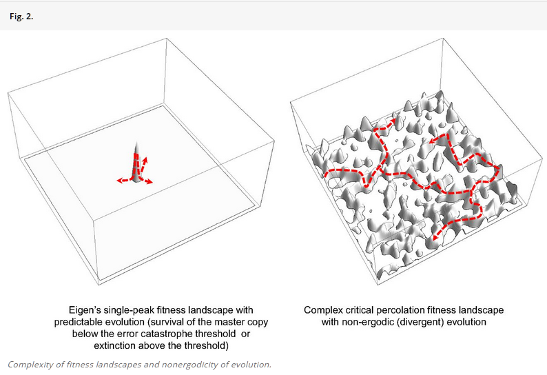
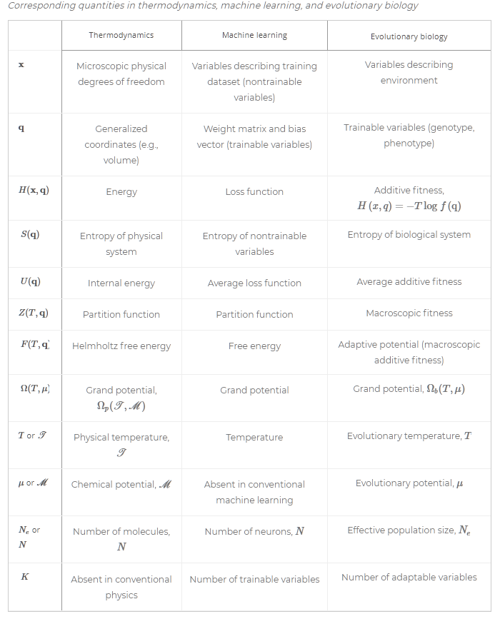

# Неустроенность и мета-системный переход

Эволюция::«процесс/изменения» — «физическая эволюция вселенной» это всеобщее явление, но мы всё-таки разделим её на отдельные варианты:

* **Биологическаяэволюция.** Усложнение[^r6-1] идёт от молекул к клеткам, от клеток к организмам, от организмов к популяциям и т.д.
* **Меметическаяэволюция.** Это эволюция понятий-мемов (meme[^r6-2], образовано так же как ген — gene, и не путайте с интернет-мемами), которые живут как в символьных локальных представлениях (одно место — один символ), так и в коннекционистских[^r6-3] распределённых представлениях/distributed representations (а в последнее время добавились distributional representations[^r6-4]), например, в нейронных сетях (в головах людей, в системах AI на базе больших языковых моделей — это всё нейронные сети разного вида). Например, понятие-мем (иногда при обсуждении меметики говорят «идея», иногда даже «мысль») о том, что «если кошка перебежала тебе дорогу, то это нехорошо». Эта очень странная идея/мысль путешествует по мозгам, как вирус (повторяет себя, реплицируется), и почему-то не умирает окончательно: обязательно находится какой-то ещё один мозг, в котором живёт эта идея. Или идея Ньютона, что массивные тела притягиваются друг ко другу силой гравитации, эта идея тоже не умирает, хотя Эйнштейн выдал идею получше: никакой силы гравитации и в помине нет, а есть искривление пространства-времени массами. Эта идея тоже живёт, на её основе мы имеем GPS навигацию, но она не вытесняет полностью идею Ньютона про силу гравитации. Тут те же закономерности, что и в любой эволюции (ибо любая эволюция сводится к накоплению знаний). Современные рыбы (их знания накапливаются в геноме) тоже не вытеснили эволюционно древнюю рыбу латимерию, хотя остальные древние рыбы давно вымерли. Природа явлений техно-эволюции как эволюции идей та же, что в биологической/дарвиновской эволюции. Репликация какой-то информации между нейросетями (людей и сейчас AI-агентов) в техно-эволюции в меру точная, но иногда проходит с мутациями. В одном случае эволюционируют гены (получаются разные организмы, их сложность и разнообразие растут, но простые виды не исчезают окончательно), а в другом случае — эволюционируют мемы (получаются разные теории/объяснения, их сложность и разнообразие растёт, но простые теории/объяснения не исчезают окончательно). Эволюция (дарвиновская и техно-эволюция) вполне физична, но она связана с тем, что накапливается информация на каких-то носителях, эта информация реплицируется — и надо глядеть первоисточники, на которые указано в нашем руководстве, чтобы разобраться. Этот материал в руководстве будет не столько разъясняться, сколько использоваться. В какой-то момент инженеры-менеджеры, работающие с руководством, не выдерживают, и смотрят в первоисточники — и формируют таки у себя физический-биологический, а не «общебытовой» взгляд на эволюцию.
* **Техно-эволюция.** Мутации технических систем производят главным образом люди путём изобретений (догадываются, что для получения какой-то функции::поведения в функциональных объектах можно использовать какие-то конструктивные объекты как аффордансы/«подходяшки»), и мы имеем развитие электротранспорта, робототехники, водопроводов, небоскрёбов и смартфонов, хотя вилка-ложка-нож, лопата и молоток остаются довольно давно неизменными, разве что существенно улучшены материалы, из которых они изготавливаются, да и само изготовление стало существенно дешевле. Важно, что техноэволюция использует сейчас существенно цифровое/дискретное (то есть с точной репликацией) символьное представление описаний систем.

В нашем руководстве мы не будем касаться механизмов эволюции, при этом мы уже упоминали в разделе руководства по системному мышлению «2. Наш вариант системного мышления: третье поколение» в подразделе «Варианты системного подхода» достаточно материалов, чтобы пытливые инженеры-менеджеры могли разобраться в физической природе происходящего (и лучше бы не оттягивать это знакомство).

Основная идея в современном взгляде на эволюцию — это что явление **неустроенности/неустаканенности/frustrations** ведёт к огромному разнообразию квазиустойчивых **конфигураций**(наборов вариантов подсистем, вариантов конструкции) эволюционирующих систем, причём каждая из этих конфигураций квазиоптимальна, а переход между квазиоптимумами невероятно лёгок и поэтому общий набор конфигураций самых разных систем оказывается неустойчивым, неравновесным.

Нам понятие неустроенности потребуется для того, чтобы обсуждать разные варианты эволюции (и не путайте с психологическими «фрустрациями», в английском языке это слово имеет множество значений, да и оригинальный термин был — geometrical frustration[^r6-5], никакого отношения к мыслительным затруднениям, речь идёт о физическом явлении).

В упомянутой статье «Physical foundations of biological complexity»[^r6-6] понятие неустроенности поясняется следующей иллюстрацией:

Она показывает, что у эволюционирующих систем в каком-то определённом смысле есть память (физики говорят про системы с памятью «не эргодические[^r6-7]», они не хаотично блуждают по всем своим состояниям), они запоминают конфигурацию «оптимума выживания». Но в реальной ситуации память не запоминает найденное конфигурационное решение намертво, ибо существует очень много разных конфигураций системы, у которых примерно одно и то же квазиоптимальное «соответствие нише»/fitness, между которыми очень маленькая разница в «оптимальности». Конечно, есть самые разные конфигурации систем, которые не смогут выжить, и их большинство, но и конфигураций, в которых системы выживут, предостаточно, и они очень мало отличаются друг от друга.

В приведённых картинках это не одна конфигурация с безусловной принадлежностью к квазиоптимуму, а остальное — не выживет, а огромное количество конфигураций, которые эволюция может проходить в ходе бесконечных мутаций. И ни одна из этих конфигураций не будет окончательной, «целью и итогом эволюции»! Эволюция тем самым оказывается бесконечной, хотя и является хорошо описываемым процессом оптимизации конфигурации какой-то системы.

Скажем, вы приходите в магазин смартфонов и видите одновременно сотню очень похожих друг на друга моделей, все из которых находят какой-то рыночный спрос. Это и есть проявление эволюции: огромное разнообразие более-менее выживающих в разных экологических нишах[^r6-8] (в нашем случае — техно-экологических нишах, то есть техно-ценозах, а не биоценозах) конфигураций (то есть наборов вариантов подсистем, вариантов конструкции) каких-то эволюционирующих систем. Это разнообразие и неустроенность как множество вариантов конфигурации, каждый из которых квазиоптимален, поэтому переходы от одного варианта к другому почти незаметны в части оптимальности включения в нишу, верны для всех видов эволюции — био, мемо, техно. Ну, и время от времени случаются скачки в уровне оптимизации. Скажем, мобильные телефоны были заменены на смартфоны — «нарисованная тастатура» оказалась лучше, маленькие размеры телефонов заменились на «лопаты» больших размеров — большой экран оказался лучше. Динозавров уже нет, хотя когда-то оптимальными были именно динозавры. А сегодня нет старых мобильных телефонов, хотя когда-то оптимальными до 2007 года (выпуск iPhone) были именно они.

При этом нужно аккуратно обращаться с типами связанных с эволюцией понятий. Скажем, реплицирующиеся в нейросетях мемы могут пониматься и как гены из генома, то есть части наследственного материала (гены физичны! Это буквально физические части молекул ДНК), и как реплицируемая в ходе обучения нейросети информация, то есть не быть материальными. Но тут помогают ходы, в которых мем может быть рассмотрен как «элементарная программа», базирующаяся на физической аппаратуре нейросети (например, на мозге) — это рассмотрение близкое к рассмотрению мастерства, как системы из запрограммированной на выполнение метода части физического мозга. В других школах мысли мем — это информационный объект, описание для программирования мозга.

При этом даже с биологическим геном есть разночтения: классическое понимание гена в том, что он физичен (часть ДНК), но используют понятие «ген» часто не как собственно «ген»::система, а как «информация, закодированная геном»::описание (например, так можно использовать и слово «мастерство» — не то, что умеет выполнить агент, а «описание метода, которое содержит в себе агент»).

В любом случае, разбирайтесь по контексту, с каким типом вы имеете дело: геном и мемом как информацией или геном и мемом как физическими объектами. С «мастерством», «программой» и прочими объектами такого сорта (алгоритм и универсальный вычислитель/computer для его выполнения, «расширенный/обобщённый на изменения/трансформацию физического мира алгоритм» из метода работы и универсальный создатель/constructor с инструментарием для его выполнения) — то же самое, будьте осторожны в присваивании типа, разбирайтесь с контекстом, в котором употреблён термин.

Скажем, вы легко поменяете описание метода (например, поменяете учебник игры на рояле с учебника для классической музыки на учебник для джазовой музыки), это просто заменить одно локальное/символьное представление на другое. Но вот заменить мастерство игры на рояле так просто не удастся, переучить одно мастерство на другое (одно распределённое представление на другое) не так-то просто. Заменить ген в «генах-описании» (заменить символ) — легко. А вот заменить физический ген в организме не так просто. Экземпляр физического гена будет представлен в каждой клетке организма, надо будет дотянуться до каждой клетки, или прицелиться точно в замену гена в зиготе (помните ещё из школьного курса биологии, что такое зигота?).

Ещё одна проблема — это понимание того, что именно эволюционирует, какая система. В биологии это проблема биологического индивида: эволюционирует геном (набор всех генов), организм с феномом (организм с набором всех проявленых свойств, определяемыми геномом), популяция (ибо для эволюции требуется самец и самка, а это уже больше одного организма — популяция), вид (все особи, относимые к виду)? Точного ответа на этот вопрос нет, и будет сразу встречный вопрос: а какой у вас проект, как вам в этом проекте удобней для того, чтобы менять мир к лучшему? Современные результаты также показывают, что бесполезно обсуждать эволюцию только одного вида, ибо эволюция всегда идёт только в контексте эволюции всех остальных видов.

Особи/индивиды/экземпляры каждого вида эволюционирующих био, социо, техно систем состоят из многочисленных подсистем и входят в надсистему, как и любые другие системы. И сложность надсистем растёт за счёт того, что в какой-то момент эти надсистемы начинают объединяться друг с другом, выполняя разные (функциональные) роли в целой уже над-надсистеме, то есть совершая очередной мета-системный переход. Это есть и в техно-эволюции (эволюции инструментария): молотки, как и микробы, живут сами по себе. Но вот телевизор, навигатор, телефон, часы, записная книжка, пульсометр и музыкальный центр как функциональные объекты (в которых важна функция, но неважна конструкция) вдруг оказались одним более сложным конструктивно устройством — смартфоном, в котором живут как подсистемы множество устройств поменьше, «приложений»::подсистем, выступающих чем-то типа органов в организме. Это вот оно и есть: какие-то из удачных для их объединения систем какого-то системного/эволюционного уровня/масштаба объединяются в надсистему — и сложность биологического, меметического, технического мира растёт.

Читаем по геометрическим неустроенностям объяснения в статье[^r6-9], росту сложности биологических (и социальных! И технических!) систем из-за этих неустроенностей как происходящих от конфликтных взаимодействий на разных системных/эволюционных уровнях статью[^r6-10], термодинамические объяснения и математику для обоснования эволюционных процессов как процессов познания/learning и в том числе как причины появления жизни в статье[^r6-11], и сами подходы к теории эволюции как многоуровневому обучению, в том числе понимание, что эволюция сама по себе многоуровневая и движется вот этими неустроенностями[^r6-12]. Вот как в этих работах определены основные принципы (понимаемые как основные онтологические догадки, то есть объекты, в терминах которых можно обсуждать происходящее, «аксиоматический подход» в физике) дарвиновской эволюции, то есть эволюции жизни, где геном внутри организма. Техно-эволюция, где мемом в конструкторском бюро, а целевая система делается на заводе и не содержит в себе мемома, или меметическая эволюция, где мемом лежит где-то в форме фрагментов видео на серверах или «идей» в бумажных книгах — это тоже эволюция, там могут быть небольшие отличия в трактовках, но в целом там будут выполняться те же принципы:

1. **Функция потерь/lossfunction.** В любой эволюционной системе существует функция потерь от переменных/физических величин, зависимых от времени. В ходе эволюции потери минимизируются, эволюция — это оптимизационный (поиск минимума функции потерь) процесс.
2. **Иерархия масштабов времени.** Эволюционирующие системы включают множество меняющихся во времени/динамических характеристик, которые меняются на различных временны́х масштабах (с различными характерными частотами: секунды, годы, тысячелетия).
3. **Разрывы частот.** Характеристики, проявляющиеся на разных организационных/системных/эволюционных уровнях (уровнях системы/организации), разделены достаточно широкими (три порядка величины) разрывами в частоте.
4. **Ренормализуемость.** По всем уровням организации статистические описания быстроменяющихся (высокочастотных) характеристик получаются через описания медленнее меняющихся (низкочастотных характеристик).
5. **Расширение** **свойств.** Эволюционирующие системы имеют способность добавлять дополнительные характеристики, которые могут быть использованы для выживания системы и возможность исключать характеристики, которые могут дестабилизировать систему (эмерджентность для позитивных свойств и устранение эмерджентности для проявляющихся негативных свойств).
6. **Размножение.** В эволюционирующих системах размножение/репликация и исключение из размножения информационно-обрабатывающих единиц (IPU, information-processing units, мы их называли «агентами») может быть на каждом системном/организационном/эволюционном уровне.
7. **Поток информации.** Системы медленно «эволюционирующих»/меняющихся системных уровней передают информацию системам быстро меняющихся в ходе познания/обучения/learning уровней, чтобы системы быстро меняющихся уровней могли лучше предсказывать состояния как окружающей среды, так и окружения системы в целом. В центральной догме молекулярной биологии добавляют, что обратный ход информации устроен по-другому: от «быстро обучающегося организма» к медленно меняющемуся «геному» информация идёт не путём передачи, а другим механизмом: мутации и смерть организмов с неподходящими мутациями. В техно-эволюции и мутации не любые из-за неминуемых сбоев в точности репликации, а smart (с расчётным наиболее вероятным успехом, не случайные).

А вот феномены жизни, которые из них следуют:

1. **Наличие единиц, обрабатывающих информацию** (IPU, information processing units) как отдельных систем на всех уровнях организации, то есть какая-то автономия и устойчивость существования молекул, клеток, организмов, популяций и биосферы в целом — они как-то поддерживают свою идентичность, не растворяются в окружении.
2. **Неустроенность.** Цели поддержания устойчивости (NESS, речь идёт об устойчивости в неравновесной ситуации, грубо говоря, «не дать разрушиться, поломаться, рассеяться в окружении») систем разных уровней конфликтуют, и это порождает неустроенность. Неустроенности/неустаканенности бывают или пространственные (geometrical frustrations), или во времени. Так, нейрон в мозге имеет своей функцией реакцию на входящий сигнал, это означает, что он будет реагировать на этот сигнал не как хочет, а как нужно для обработки сигнала целой группой/кластером нейронов как надсистемой, в которую входит система-нейрон. Это пространственный конфликт целей: оптимизировать обработку сигнала «как попроще» в рамках самого нейрона не получится, ибо это будет конфликтовать с обработкой сигнала «как надо» со стороны как кластера нейронов, и далее по системным уровням — со стороны каких-то долей мозга, отделов мозга, далее всего мозга. С другой стороны, нейрон работает с какой-то своей частотой, в своём временном масштабе, но это может не соответствовать временно́му масштабу, в котором ему нужно работать в более вышестоящей единице организационного устройства (кластере нейронов, долей и отделов мозга, мозге). И пространственные, и временны́е неустроенности не могут быть устранены полностью, но в рамках какого-то оптимального баланса может быть достигнуто локальное (не глобальное!) устойчивое неравновесное состояние — поиск этого устойчивого неравновесного состояния (NESS) и есть познание/обучение/learning эволюционирующей системы.
3. **Иерархия системных уровней.** Если система эволюционирует, то у неё с необходимостью будет множество системных уровней (рост сложности в ходе эволюции неизбежен).
4. **Субоптимальность** (near optimality). Для сложных многоуровневых оптимизаций можно использовать только стохастические методы, которые не гарантируют как устойчивость решения (то есть при попытке повторить будет получаться слегка другой вариант), так и нахождение глобального минимума (будут получаться не абсолютно оптимальные варианты, а просто более оптимальные, чем многие другие — но сравнимые с другими возможными к нахождению вариантами). В биологических системах через 4 миллиарда лет эволюции это проявляется в том, что **всё уже более-менее оптимизировано, поэтому изменения в системах чаще всего ведут к ухудшениям, очень редко к улучшениям и в общем случае вообще ни к чему не приводят, ибо не так далеко уж уводят от уже найденного локального минимума потерь.** **Изменения, приводящие к переходу** **на локальный (никогда не глобальный, он недостижим принципиально) очередной уровень минимума потерь,** **крайне редки.**
5. **Разнообразие субоптимальных решений.** Есть огромное конструкционное/конфигурационное разнообразие систем, для которых функция потерь субоптимальна и имеет очень близкое значение. Это само по себе свойство неустроенных систем, при этом неустроенные системы неэргодичны[^r6-13], то есть они имеют какую-то память и поэтому эволюционные их пути скорее расходятся, чем сходятся. Конструкционное разнообразие неустроенных систем растёт, и все они имеют очень близкие значения функции потерь.
6. **Разделение фенотипа и генотипа.** Критически важным в феномене жизни оказываются два нарушения симметрии: а) «цифровая» с дискретными значениями, стабильная, медленно обновляемая память и по большей части аналоговые системы обработки информации и б) информационный поток между IPU/системами разных уровней как прямые «инструкции» генотипа фенотипу, а фенотип не может изменить генотип прямо, и изменения идут через мутации. Пример тут — «центральная догма молекулярной биологии», что информация идёт от ДНК к белку, но не наоборот. В компьютерной архитектуре то же самое: в архитектуре фон Неймана память отделена от центрального процессора, и поток инструкций идёт из памяти в процессор. И если речь идёт о любой более-менее сложной «информационной системе»::система, то память::подсистема как-то отделяется от процессора/обработчика::подсистема.
7. **Размножение.** Существование долговременной цифровой памяти (например, ДНК или РНК для генома) даёт возможность стабилизации IPU/систем — если бы памяти не было, то каждый раз приходилось бы информацию о стабильной системе получать эволюцией заново (и помним, что эволюционные процессы сразу обсуждают шкалу времени минимум на три порядка более медленную, чем возможная скорость нарушения обсуждаемой стабильности, там ведь «поколения»), но вместо этого она просто копируется. Цифровость/дискретность вместо аналоговости в памяти должны быть достаточно выражены, чтобы не накапливалась ошибка при многократном размножении/репликации, если точность репликации недостаточна, то жизнь не получается. **На данный момент только биосфера представляет собой механизм передачи информации** **об устойчиво существующих системах, который не сломался за примерно четыре миллиарда лет.**
8. **Естественный отбор.** Дарвиновская эволюция по принципу естественного отбора возникает из комбинации всех принципов и феноменов жизни, которые были описаны. IPU отличаются от среды и друг от друга, они разнообразны, они стабильны и содержат в себе кроме обработчиков/процессоров информации ещё и цифровую память (геном), а ещё они могут размножаться, сохраняя эту память (передавая геном потомству). Стабильность наиболее удачных/стабильных IPU при этом будет потихоньку расти, они будут чаще встречаться. Менее удачные/стабильные (с высокой функцией потерь в результате накопившихся мутаций) будут исчезать. Ключевая особенность дарвиновской эволюции: генотипы размножаются, но это размножение ограничивается откликом от окружающей среды, передаваемой через фенотипы (которые либо далее успевают размножиться, либо не успевают, уж какими свойствами их снабдил для этого генотип). Похоже, что этот феномен присущ главным образом биологической жизни, а не любой эволюции.
9. **Паразитизм.** Паразиты и совместная эволюция паразитов и хозяев повсеместны на множестве организационных уровней и являются неотъемлемой чертой эволюции жизни. Паразиты высоковероятны, а высокоэффективная иммунная система дорого стоит в части затрат энергии. В краткосрочной перспективе паразиты вредны, а в долгосрочной перспективе полезны, ибо являются источником новых функций в хозяине, от паразитизма возможен переход к симбиотическому существованию и даже полной интеграции. Паразиты и хозяева могут быть одноуровневыми (паразиты-организмы живут на хозяевах-организмах), но могут быть и транс-системны (генетические элементы паразита паразитируют на геноме организма или клетки-паразиты паразитируют на многоклеточных организмах хозяина). Этот феномен тоже вроде как присущ главным образом биологической жизни, но не техно-эволюции (впрочем, хакеры могут не догадываться о таком замечании, а их работа имеет и теоретическое обоснование[^r6-14]).
10. **Программируемая смерть** является неотъемлемым свойством жизни. И это относится к биологической эволюции, не факт, что это нужно соблюдать, когда мы рассматриваем другие виды эволюции (скажем, техно-эволюцию).

Тем самым запоминайте и постарайтесь учесть в мышлении:

* **Мета-системные переходы** **по линии увеличения** **числа** **системных уровней, которые можно легко наблюдать (рост сложности),** **появляются в ходе эволюции. Рост числа системных уровней** **происходит из-за неизбежных неустроенностей между системными уровнями, выживают только какие-то конфигурации систем, наиболее точно решающие задачу многоуровневой (а не одноуровневой!) оптимизации, и появление более высоких системных уровней увеличивает устойчивость полученных решений.** Самый успешный на своём системном уровне (например, раковая клетка печени очень успешна! Она размножается без ограничений!) может вымереть из-за того, что не учтена многоуровневость оптимизации конфигурации. Империи, которые растут как раковые опухоли, неминуемо распадаются, ибо будут встречать сопротивление с более высокого уровня и более низкого уровня (оптимизация многоуровневая!), а устойчивого состояния страновых границ не будет никогда: эволюцию не остановишь, её суть как раз в нахождении этих концептуальных новаций, увеличении разнообразия видов в ходе естественных мутаций в биологической дарвиновской эволюции, или в ходе инженерных изобретений при меметической (например, социальной, культурной) или техно-эволюции (технических систем). Страны тут такой же объект, как и любой другой, многообразие видов стран будет только расти.
* **Для каждого мета-системного перехода** **между системными уровнями** **внимание рассматривает новыесвойства системкаждого уровня** **за счёт эмерджентности, поэтому меняются** **методы** **работы с этими системами, язык разговора об этих системах, дисциплины/теории/объяснения функций/методов работы** **этих систем.** Нельзя функции/методы работы этих систем объяснить в терминах функций/методов работы надсистемы (грех холизма, работу человеческого организма нельзя объяснить политическими теориями или даже теориями семейной жизни — это теории более высоких системных уровней), нельзя функции/методы работы этих систем объяснить через методы работы подсистем (грех редукционизма, нельзя работу человеческого организма в целом объяснить через понятия кардиологии или проктологии). Это означает, что нельзя слишком центрироваться на переносе свойств людей на системы других уровней: нельзя обсуждать работу человеческих органов так, как будто это маленькие люди, нельзя объяснять происходящее в международной политике так, как будто страны — это такие огромные люди. Отслеживайте, что вы используете адекватный язык обсуждения, меняйте объяснительные теории при переходе с уровня на уровень. **Например, у города не может быть инфаркта, но у отдельных людей в нём—** **может быть, страна не может** **«обидеться»,** **но** **обижаются** **в стране** **отдельные люди—** **особенно часто застревание происходит на уподоблении самых разных систем человеку. И** **«организация»—** **это будет** **«лицо»** **навроде человека. Но «оживлять» в уме и приписывать намерения,** **желания можно и** **смартфону, и городу, и стране. Отслеживайте такое и у себя в мышлении,** **и в других, деантропоморфизируйте по возможности и учитывайте наличие** **многих системных/эволюционных уровней/масштабов.**

Вопрос, насколько можно говорить об обидевшемся смартфоне, городе, стране, нации и даже каком-то пользовательском сообществе — он просто решается для неживого смартфона, пока в нём нет сильного AI. Но вот для сообществ агентов это уже не такой простой вопрос. Мы тут придерживаемся принципа методологического индивидуализма, но есть и другие точки зрения на этот вопрос[^r6-15].

Нужно также отметить, что математические описания физических процессов, познания/learning и эволюции удивительно похожи. Мы уже говорили о том, что математика задаёт набор удобных понятий для типизации, а физика задаёт набор функциональных объектов, удобных для описания взаимодействий в физическом мире. В рамках исследований с использованием физики и математики происходит довольно жёсткая проверка (сначала логикой и рациональными рассуждениями, а потом и экспериментом) того, что поведение математических объектов в мысленных экспериментах соответствует поведению физических объектов, взятых как функциональные объекты по отношению к конструктивным/материальным объектам. При этом будет использован принцип 4D экстенсионализма: физический рассказ про мир в терминах функциональных объектов из учебника физики типа «физическое тело» и рассказ про мир в терминах учебника предметной области, где вместо физического тела будет какая-нибудь «ракета» позволяют отождествить мир учебника физики и мир жизни.

Посмотрите пример таблицы, которую сделали на базе сравнения похожести математических описаний в термодинамике, теории нейронных сетей (глубокое обучение/deep learning) в машинном обучении и теории эволюции[^r6-16]:

Близость формул, которые описывают явления термодинамики, познания как обучения нейронных сетей и эволюции показывает, что термодинамика, познание/learning, эволюция — это всё разные описания разными словами примерно одного и того же набора закономерностей, одного и того же процесса, происходящего в природе. Тем самым системное мышление, которое обсуждает эволюционно появляющуюся многоуровневость и разнообразие в чём-то стабильных систем (удерживающих NESS, их называют «системами» или «агентами», или «IPU»), пригодно для мышления об очень широком классе жизненных явлений.

[^r6-1]: <https://www.pnas.org/doi/10.1073/pnas.1807890115>

[^r6-2]: <https://en.wikipedia.org/wiki/Meme>

[^r6-3]: <https://en.wikipedia.org/wiki/Connectionism>

[^r6-4]: <https://www.frontiersin.org/articles/10.3389/frobt.2019.00153/full>

[^r6-5]: <https://en.wikipedia.org/wiki/Geometrical_frustration> — и посмотрите на видео, которое очень хорошо объясняет суть этой «неустроенности/неустаканенности».

[^r6-6]: <https://www.pnas.org/doi/10.1073/pnas.1807890115>

[^r6-7]: <https://ru.wikipedia.org/wiki/Эргодичность>

[^r6-8]: <https://ru.wikipedia.org/wiki/Экологическая_ниша>

[^r6-9]: <https://en.wikipedia.org/wiki/Geometrical_frustration> — и посмотрите на видео, которое очень хорошо объясняет суть этой «неустроенности/неустаканенности».

[^r6-10]: <https://www.pnas.org/doi/10.1073/pnas.1807890115>

[^r6-11]: <https://www.pnas.org/doi/full/10.1073/pnas.2120042119>

[^r6-12]: <https://www.pnas.org/doi/10.1073/pnas.2120037119>

[^r6-13]: <https://ru.wikipedia.org/wiki/Эргодичность>

[^r6-14]: <https://ailev.livejournal.com/1622346.html>

[^r6-15]: <https://ailev.livejournal.com/1735626.html>

[^r6-16]: <https://www.pnas.org/doi/full/10.1073/pnas.2120042119>
