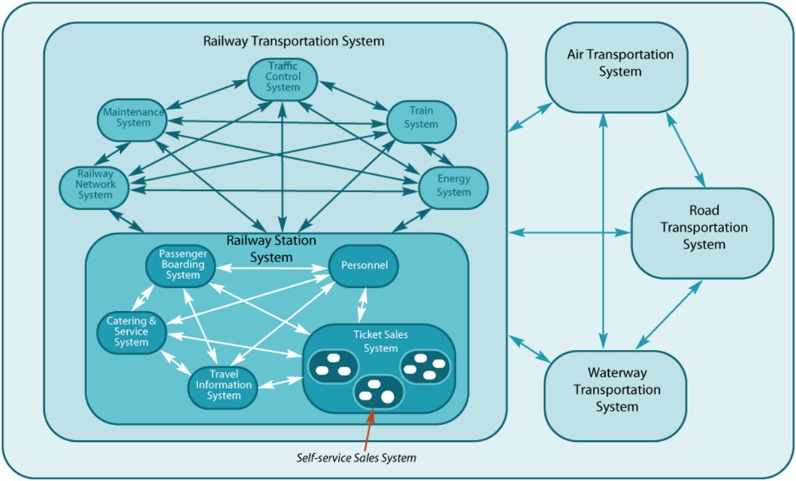

# Рекурсивное применение системного мышления: рекурсивное управление вниманием

Понимание того, что любая система входит в системное разбиение и принадлежит какому-то системному уровню, позволяет системному мыслителю применять одно и то же системное мышление рекурсивно/recursive: проводить одни и те же рассуждения для каждого системного уровня, для каждой подсистемы в этом системном уровне, если идти по системным уровням вниз от целевой, и каждой надсистемы, если идти по системным уровням вверх. Неважно, какая это система — для неё может быть (и даже должно быть!) развёрнуто полное системное мышление (как прописано в системной мантре). А потом, после всестороннего обдумывания ситуации с этой конкретной рассматриваемой системой, можно вернуться к системному разбиению в целом (время использования) и графу создателей, чтобы выбрать следующую систему для рассмотрения — и так с самыми разными системами самых разных системных уровней и самых разных узлах графа создателей.

**Системное разбиение (systembreakdownstructure)—** **это прежде всего средство для управления вниманием.** Внимание выхватывает для подробного рассмотрения какой-то один объект-фигуру, а всё остальное остаётся фоном, насколько огромным или разнообразным ни было бы это «всё остальное». Внимание позволяет резко упростить сложность мира, временно игнорируя незначимые детали — оставив в обсуждении только важное. Системное мышление заставляет всё время концентрироваться на главном, опуская неважные детали, это **концентрация внимания/focusing**. И оно же заставляет не забывать о целом, когда внимание обращается к частям — **деконцентрация внимания**. Помним, что основной акцент в системном мышлении — это «наверх» по системным уровням: не от целевой системы к её подсистемам, а от целевой системы к её окружению, к надсистеме! Если у вас во внимании какая-то фигура, то её окружение будет находиться в фоне! **Деконцентрация внимания, обращение внимание на фоноказывается даже более важным, чем игнорирование фона, фокусировка внимания!**

**Нужна** **осознанность в управлении вниманием: вы осознанно концентрируете и деконцентрируете внимание, осознанно перемещаете это внимание с объекта на** **фон** **в моменты деконцентрации (много объектов в поле внимания, высокая алертность к появлению нового в широком поле вашего внимания), и концентрируете внимание, отслеживая находящиеся в его фокусе объекты** **на игнорируемом фоне.** Системное мышление управляет вниманием, описывая его движение в понятиях/типах системного подхода (система, функция/метод, роль, конструктив, эмерджентность и т.д.). Понятия/типы системного подхода — это типы мета-мета-модели для выявления/discovery и последующего удержания вниманием в окружающем мире (физическом мире и мире описаний) объектов этих типов.

Вы знаете, что нужно искать в физическом мире объекты с типами «система» разных видов (целевая, надсистема, подсистема, наша, создатель). Как эти типы относятся друг ко другу (какие между ними типы отношений) как раз и описано в наших руководствах по системному мышлению и системному моделированию, это и есть мета-мета-модель мира, выраженная текстом руководств на естественном языке (а потом, после освоения работы по руководствам, это будет частью модели языка и мира, реализованной нейросетью вашего мозга, это наше руководство тем самым описание вашего будущего мастерства системного мышления и системного моделирования).

Дальше вы активно ищете в жизни объекты этих типов, ибо уже имеете ожидания по поводу этих объектов. Активно — это расспрашиваете о состоянии этих объектов, придумываете и создаёте такие объекты, если убеждаетесь, что их нет, проверяете догадки рациональным рассуждением и даже экспериментами.

Концентрация-деконцентрация внимания в ходе системного моделирования соответствует движению внимания по системным уровням (уровням размера систем), а сам фокус внимания — это выбор конкретной целевой системы, её подсистем и надсистем, системы в каком-то месте графа создателей, выявление среди них «нашей системы».

Системный мыслитель хорошо ориентируется в сложном мире: ни на секунду он не теряет контекста/окружения рассматриваемого объекта внимания, оставаясь способным обсуждать как самый маленький винтик в самом маленьком приборе, так и совсем огромные системы планетарного масштаба. От этих «скачков масштаба» он не сходит с ума, для него это самая обычная процедура концентрирования внимания на всё более и более малой части мира, переставая воспринимать подробности из окружения этой части, или наоборот, деконцентрирования внимания на всё более большой части мира, теряя при этом подробности маленьких частей этой большой части мира.

Системный мыслитель выбирает/select какую-то систему, рассматривая её в составе надсистемы и в целом в системном окружении («в контексте», причём в момент работы готовой целевой системы), затем может рассмотреть эту систему в свою очередь как набор частей — «зуммировать»/«zoom in» на очередной уровень детальности, увеличив подробность рассмотрения этой части, как в современных фотоаппаратах. Когда рассматривают внимание, используется метафора «камер внимания» с zoom объективами:

* Внимание активно/деятельно: камеру сначала надо навести на какой-то кусок мира, который собираемся рассмотреть, затем её настроить на нужный зум. Это изменение состояния измерителя ещё перед замером: нужна работа по какому-то методу, чтобы направить камеру на объект! Измерение надо готовить, только потом измерять! Чтобы описать то, что за углом, надо подойти к этому углу и заглянуть за угол, сделать активное действие (и метод должен предусматривать, что важный объект действительно окажется за углом, а не, например, прямо сверху — и надо идти к углу и заглядывать за угол, а не задирать камеру прямо в вверх). И там, уже за углом, надо понимать, высматриваешь силуэт большой горы или песчинку на этой горе, настроить фокус: это задействование знаний, мета-мета-модели не только управления камерой внимания, но и знания о снимаемом объекте. Если тебе нужно внимание на Петю, то плохо спутать его с Колей. Надо знать объект внимания!
* Только после того, как камера наведена приблизительно на объект, можно рассматривать то, что получено из этой камеры и выбирать какие-то объекты из её поля зрения, присваивать тип и проверять, на нужных ли объектах у нас внимание. Опознание наличия или отсутствия объектов каких-то типов может быть только после проведения измерения и при наличии знания об этих типах (знания мета-мета-модели).
* В общем случае камер у агента может быть много: внимание «многопоточно», с каждой камеры идёт какой-то поток информации, и работу каждой камеры надо настраивать и использовать мета-модель, а ещё нужно как-то объединять в мышлении результаты работы камер внимания.

Системный мыслитель может легко выбрать для каждой камеры внимания нужный масштаб рассмотрения ситуации, выбрать нужные ему системные эффекты (эмерджентные свойства) в качестве своих предметов интереса на выбранном системном уровне. И делает это системный мыслитель осознанно: он хорошо знает, что использует навигацию по системным уровням и при каждом мета-системном переходе (с одного системного уровня на другой) у него в рассмотрении появляются новые системные эффекты/эмерджентности.

Вот пример рассмотрения системных уровней для мультимодальной транспортной системы[^r6-1]:

В транспортной системе мы сначала можем обсуждать мульти-модальные[^r6-2] перевозки и конкуренцию независимых друг от друга мономодальных транспортных систем. Так, трубопроводный транспорт конкурирует в перевозке нефти с железнодорожным транспортом — для их владельцев они враги-конкуренты в операционном окружении, но для желающего перевезти нефть из одной точки мира в другую они части одной мульти-модальной транспортной системы (помним, что разные роли выделяют системы по-разному, как им удобно для их деятельности. Хотя для совместной работы в команде какого-то проекта им придётся договориться). Когда мы обсуждаем транспортные системы — это планетарные масштабы, или масштабы какой-то страны.

В одной из подсистем транспортной системы можно выбрать для обсуждения железнодорожную систему — поезда, энергетику железной дороги, управление движением поездов и т.п. Если взять одну из подсистем железной дороги — систему железнодорожной станции, то в ней можно дальше рассмотреть её собственные подсистемы — систему посадки пассажиров, информационную вокзальную систему, систему питания пассажиров (catering), систему продажи билетов. Часть этой системы продажи билетов — её подсистема автоматов по продаже билетов. Эти автоматы тоже каждый могут быть рассмотрены как отдельные системы. Винты, которые крепят печатную плату контроллера к корпусу этого автомата — это тоже системы. И даже в винтах можно найти разные части — головку с шлицами под отвёртки разной формы, резьбу.

Вот так, в паре абзацев и одной маленькой картинке мы проходим рассмотрение ситуации от планетарных или страновых масштабов до маленького винтика, и при этом не сходим с ума, не теряем нити рассуждений, чётко понимаем каждый раз предмет обсуждения и масштабы проблем. Это не поменяется и при обратном проходе, от частей винтиков до транспортной системы в целом. Перемещение по разным системным уровням, концентрация внимания на разных в них системах, деконцентрация внимания — это чрезвычайно мощный инструмент мышления.

Бессмысленно рассматривать винт в автомате по продаже билетов как непосредственную составную часть транспортной системы — это с точки зрения формальной логики будет правильно, но абсолютно бессмысленно, как «хвост стада коров». Системный подход, вводя системные уровни, делает рассуждения осмысленными: все люди получают возможность договориться, обсуждая проблемы только каждый на «своём» системном уровне (на уровне, для которого у них есть интересы, предпочтения, намерение действовать, чтобы изменить ситуацию к лучшему с точки зрения этих ролевых предпочтений), но при этом они учитывают проблемы смежных уровней — более высоких чем их целевые системы и более низких. Так организованное с разделением на системные уровни и по разным ролям коллективное мышление — это огромное достижение цивилизации.

Примерно так же мы можем обсуждать создание и развитие мультимодальной транспортной системы, указывая входящие в неё подсистемы разных уровней: кто::создатели и как::методы строит железнодорожную систему, кто::создатели и как::методы изготавливает винт крепежа платы контроллера к корпусу автомата по продаже билетов, кто и как завинчивает винт крепежа платы (это будет другой создатель, нежели создатель, изготавливающий винт). Всё обсуждается как «системы», и системы создания обсуждаются по отношению к системам в окружении, ибо если не знаешь, что::«целевая система или наша система» изготавливаешь — то тогда и не знаешь, какие системы-создатели это изготавливают, обсуждение невозможно. **Окружение сначала,** **целевая система и её устройство потом,** **методы** **создания(«как делаем** **целевую систему»)** **ещё позже, а** **системы создания (кто::роли, кто::агенты их играет, кто::менеджеры будет их организовывать)—** **будут рассматриваться последними.**

Боинг 747-8 состоит из 6 миллионов независимых видов деталей (входят в состав целевой системы), которые производили полмиллиона человек на 5400 фабриках (системы создания), за один год заказывалось (последний самолёт выпущен в декабре 2022) 783 миллиона частей самолёта (входят в состав целевой системы)[^r6-3]:

А теперь окружение этих боингов, время эксплуатации самолётов: аэропорты с авиадиспетчерскими и системами посадки-высадки пассажиров, воздушные коридоры (тоже системы! Они оборудованы радарами и другой инфраструктурой для их отслеживания. Они материальны, занимают место в пространстве). Сам по себе самолёт вне всего этого бесполезен, как пробка от бутылки бесполезна без бутылки, как бутылка бесполезна вне ситуации её использования.

В современных системах число отдельных элементов, которые нужно согласовать между собой (в проектировании), а часто и создать с нуля (в конструировании) достигает десятков миллионов в «железных» системах, а если речь идёт об электронных системах, то и триллионов: на одном электронном чипе Cerebras число отдельных транзисторов — 2.6 триллиона штук, при этом каждый транзистор имеет своё уникальное назначение внутри чипа, выполняет свою уникальную функцию[^r6-4]. И ещё эти чипы — не самый высокий системный уровень, выше их уровень печатной платы, ещё выше — суперкомпьютера на основе этих плат.

Можно оставить надежду о создании таких сложных объектов без какого-то их иерархического рассмотрения и управления коллективным и личным вниманием посредством документированной системной иерархии (то есть иерархии систем по отношению композиции). **Управление коллективным вниманием создателей в привязке этого внимания к системным уровням, выделяемым в иерархии по отношению композиции систем—** **самая** **важная частьсистемного мышления. Это коллективное внимание также направлено на отношения создания между создателями и** **создаваемыми** **системами, тут мы говорим о графе создателей.**

Системные уровни появляются в результате роста сложности систем, это свойство эволюции (биологической/дарвиновской, меметической, техно-эволюции). Сложность систем будет только расти, это бесконечный рост. При этом каждый создатель-команда и создатель-предприятие может быть устроен достаточно просто (хотя это тоже системы, сложность создателей тоже растёт — предприятия объединяются в эко-системы, растут в суперхолдинги, число системных уровней там тоже увеличивается по мере эволюции). Но разбираться с проектами создания сложных систем (включая сами системы создания) можно потому, что одному создателю или даже его части (например, команде проекта внутри предприятия) не приходится заниматься всей системой в целом на всех системных уровнях — нет, каждый создатель работает с какими-то частями системы, и это существенно упрощает создание. Кто-то делает двигатель ракеты, кто-то делает компьютер ракеты, кто-то делает корпус ракеты, но нет фирмы, которая делала бы вот это всё — и даже выплавляла бы сталь для корпуса ракеты и очищала кремний для чипа компьютера.

Разные фирмы специализируются на разном мастерстве, но организованные согласно какому-то графу создатели — они вместе создают удивительно сложные целевые системы, работающие в удивительно сложном окружении. Всё это возможно благодаря системному мышлению инженеров и менеджеров этих предприятий-создателей.

[^r6-1]: Leidraadse (2008), Guideline Systems Engineering for Public Works and Water Management, 2nd edition, <http://www.leidraadse.nl/>

[^r6-2]: <https://ru.wikipedia.org/wiki/Мультимодальная_перевозка>

[^r6-3]: <http://787updates.newairplane.com/787-Suppliers/World-Class-Supplier-Quality>

[^r6-4]: <https://www.anandtech.com/show/16000/342-transistors-for-every-person-in-the-world-cerebras-2nd-gen-wafer-scale-engine-teased>
