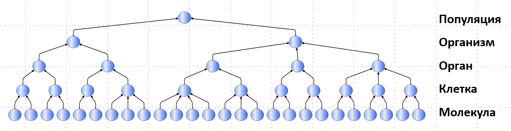

# Системное разбиение

Системы одновременно являются целым для каких-то частей внутри них (подсистем) и частями для какой-то объемлющей их целой системы (надсистемы). Каждая подсистема тоже является целой для своих уже под-подсистем (относительно начальной системы), а каждая надсистема — часть для над-надсистемы. Тем самым можно говорить об иерархиях **системного** **разбиения/breakdown/decomposition** на части сверху вниз, или они же иерархии составления (composition) системного целого снизу вверх. Если какую-то систему мы пока не планируем бить дальше на части, то её называют «элемент системы», подчёркивая, что где-то есть целая система, для которой эта подсистема является элементом::«часть, далее не разбивающаяся на части».

**Уровни в иерархиях системного разбиения** **(иерархиях/«графах-деревьях», выстроенных** **по отношению композиции/«часть-целое»)называются системными уровнями.** **Системные уровни выделяются** **в физическом мире** **вниманием, для их выделения не надо «разбивать» систему на части! Если вы разобьёте физически на функциональные части-органы, например, живой/функционирующий/работающий организм—** **он будет после этого мёртвый! Поэтому системное разбиение выполняется только вниманием! Ничего разбирать-собирать не надо! Но вот переходить вниманием от более крупных частей к более мелким, и обратно—** **надо. Отслеживать, что в иерархию по отношению «часть-целое» не попало какое-нибудь иное отношение (скажем, отношение классификации или специализации)—** **надо. Отслеживать, что вы случайно не включили в физическое разбиение на части какой-нибудь ментальный объект—** **это тоже надо.**

Классический пример системного разбиения — это пришедшее из биологии разделение на системные уровни (от мелких к крупным) атомов-молекул-клеток-органов-организмов-популяции-биоценоза-биосферы. При этом в биологии кроме названия «системные уровни» используют названия «уровни организации», «эволюционные уровни», «уровни сложности жизни».

Вы видите, что системы обозначены на схеме системной иерархии кружочками, а **стрелки-ромбики традиционно обозначают отношение состава, где целое—** **со стороны ромбика** **на стрелочке**. На рисунке видно, что клетки состоят из молекул, но клетки сами части органов. Органы состоят из клеток, но органы сами части организмов.

Вот это слово «состоят» (composed by) не означает, что вы можете разбить органы на клетки, а потом вновь составить из этих клеток органы. Нет, это «состоят» относится к тому, что вы вашим вниманием выделяете в работающем организме разные органы, в органах вашим вниманием выделяете клетки, но можете пройтись вниманием и в обратном порядке: в работающем организме вниманием объединить клетки в органы, а органы в организм. Ничего не нужно физически разбирать, системные уровни — они только для управления вниманием в ситуациях со множеством объектов, которые состоят из других объектов и сами части ещё каких-то объектов. Системные уровни определяются работой внимания (о которой агенты договариваются в своих проектах, чтобы скоординировать свою работу), они не «объективны», то есть самые разные агенты вдруг будут обнаруживать их одни и те же в самых разных ситуациях, самых разных проектах! С другой стороны, системы::«объекты каких-то системных уровней» выбираются не случайно: в физическом мире системы обычно стабильны, они не так легко поддаются действию энтропии, их не так-то легко разрушить. И кроме всего прочего, системные уровни часто культурно-обусловлены и эта культурная обусловленность как-то ещё и поддерживается языком. То, что «смартфон состоит из экрана, корпуса, камер, аккумулятора и какой-то электронной начинки» — это уже общекультурное знание, о нём не надо специально договариваться сегодня (а вот во времена создания первых смартфонов — надо было). Но вот что именно будет относиться к корпусу, а что уже к экрану (скажем, защитное стекло экрана — это часть экрана, или это часть корпуса?), что войдёт в состав камер (чип, поддерживающий исключительно работу камер — это часть камер, или «какая-то электронная начинка? а кольца крепления объективов на корпусе — это часть камер, или часть корпуса?) — это уже будет зависеть от решений конкретных команд проектов создания и развития смартфонов даже сегодня.

На схеме не показан системный уровень биоценоза/эко-системы, а потом ещё биосферы (они выше уровня популяций). Есть исследования, которые показывают, что рост уровней сложности неизбежен, то есть неизбежно объединение частей во всё более и более сложно устроенные целые на многих и многих системных уровнях[^r6-1].

На схеме также не показаны и уровни атомов и элементарных частиц (они ниже уровня молекул), но это не означает, что их нет: **посылка** **открытого мира**[^r6-2]**,** **«что не сказано** **в нашем тексте,** **это** **просто не сказано,** **но это** **не значит, что этого нет».** Вот так и нужно читать системные диаграммы: любой верхний уровень на них не самый верхний (всегда можно найти какую-то надсистему, в конечном итоге все системы являются частью вселенной или в некоторых физических теориях — частью мультиверса как бесконечного множества вселенных). Молекулы показаны на этой диаграмме элементами (далее неделимыми подсистемами) клеток, но это тоже подсистемы, их неделимость условна, она просто не рассматривается в тех деятельностях, для которых была составлена эта схема. Так что и снизу всегда можно найти какие-то части вроде как «элементов». Это для текущего проекта внизу системной иерархии могут быть далее неделимые «элементы», но в пределе деление идёт до уровня «ниже кварков», то есть тех мельчайших физических объектов, из которых состоят кварки (эти объекты самые разные в разных физических теориях).

Набор системных уровней, на каких рассматривается система, всегда зависит от проекта. Возможно, в другом проекте из этого же разбиения будет взят какой-то другой набор уровней. В одном проекте вы увидите подробное разбиение дома на отдельные стены, крышу, фундамент, коммуникации, а в другом проекте — разбиение нескольких городских кварталов на дома, но вот в домах уже вы не увидите стен, крыш, фундамента, коммуникаций, ибо «элементы» в этом проекте будут — дома. В третьем проекте (скажем, проект девелоперской компании) будет и подробное описание «городских кварталов»::«системный уровень», включая дома, скамейки, отдельные деревья, и «дома»::«системный уровень» будут разбиты на какие-то части. Для девелоперской компании важно не только расположить дома::подсистемы в «городских кварталах»::системы, но и построить их, а для этого спроектировать их устройство из подподсистем (и дальше подсистем этих подподсистем — до систем самого мелкого уровня, на котором ведётся проектирование и изготовление домов, то есть до уровня дощечек, гвоздей, кирпичей, электрических розеток и т.д.. Но вот уже детали внутри электрической розетки в ходе проектирования дома вряд ли будут учтены — но будут интересовать конструкторское бюро и завод, который выпустит электрические розетки для дома).

В соответствии с нашим вариантом системного подхода мы будем требовать, чтобы системное разбиение было полностью физично/материально: каждый системный уровень выделялся по отношению часть-целое между материальными предметами, то есть занимающими какие-то места/объемы в пространстве-времени. Инженерам-менеджерам нужно запомнить: если в их системном разбиении появляются нематериальные части, то в системном мышлении это как 2\*2=5, за такую ошибку студенты сразу получают два балла и отправляются на пересдачу, а в рабочем проекте появляются сомнения о том, что этот инженер-менеджер профпригоден. Мы не можем советовать, чтобы взрослых за такое увольняли с работы, не особо сомневаясь, но очень близки к такому совету.

**Внимания должно хватать, чтобы отслеживать физичность отношений часть-целое на несколько уровней вниз и вверх. Если внимания** **на такое отслеживание** **не хватает** **(с учётом того, что это внимание поддержано записями—** **не нужно всё держать в голове!), то с этим нужно что-то делать, например,** **вернуться к освоению работы по** **предыдущим** **руководствам программы рабочего развития(честно, выполняя задания). Работать с отсутствующим вниманием нельзя,** **улетать неосознанно мыслью в нефизический мир или путать что там часть, а что целое—** **это опасно** **для проекта.**

Многоуровневость системного разбиения принципиальна: на самом верхнем уровне любого такого разбиения потенциально будет вселенная, на самом нижнем уровне — суперструны, но вот эти крайности мало кого интересуют, поэтому системное разбиение делается для какого-то диапазона размеров физических объектов. Для деятельности людей крайне важен очень маленький диапазон, который как-то соразмерен размеру самих людей. Эти не большие и не маленькие в космических масштабах и масштабах микромира системы служат предметом деятельности — чаще всего это от нескольких километров (например, строительные проекты: небоскрёбы, дамбы и мосты) до нескольких нанометров (транзисторы на компьютерных чипах). Вот с предметами/системами в этом небольшом диапазоне размеров чаще всего взаимодействуют люди (с их инструментами! Необязательно руками!). В космофизике и физике микромира есть очень много чего интересного за пределами этих размеров, но людям пока удобней менять мир в этих пределах, и не выходить за них.

Явное указание системного уровня важно для управления вниманием. Формально, дотронувшись до цветка у растения (уровень «органы» в системном разбиении растительных организмов) я дотрагиваюсь и до вселенной (цветок ведь часть вселенной!), и дотрагиваюсь до элементарных частиц (в цветке они точно есть!). Ну, или дотрагиваюсь и до всего растения, и до клеток растения. Непонятно, до чего я дотронулся, что является предметом моего внимания! Поэтому требуется явно выделить ту систему::«объект внимания», который как-то позволит мне определить масштаб «дотрагивания». В нашем примере это будет — «цветок».

Когда я машу рукой, то я машу всеми молекулами руки — но неправильно ведь говорить о молекулах, когда говорим о размахивании рукой? И неправильно «махать телом» (слишком большой объект). Поэтому «машу рукой» — машу системой, находящей на много системных уровней выше, чем молекулы, но всё-таки ниже уровня целого тела.

Системные уровни принципиальны, они отражают саму суть системного подхода — на каждом системном уровне в силу эмерджентности/системного эффекта появляются новые свойства, поэтому чаще всего **обсуждения ведутся отдельно для отдельных системных уровней** **агентами, которые разбираются со свойствами, проявляемыми системами на этом системном уровне, а также свойствами надсистем, которые получаются из свойств систем текущего уровня. Грубо говоря, клетки обсуждает микробиолог, организм человека в целом—** **медик, коллектив людей—** **менеджер. Отдельное подробное обсуждение на каждом системном уровне** **существенно упрощает обсуждение сложных систем.** Если вы обсуждаете предприятие, то обсуждайте людей, оборудование, запасы материалов, здания и сооружения, но обычно при этом не нужно обсуждать планетарную систему вокруг Солнца, частью которой является предприятие, как часть Земли, или биохимию клеток у людей, как биохимию части предприятия.

Помним, что если вы обсуждаете проблему на слишком низком системном уровне — это ошибка редукционизма, если вы обсуждаете проблему на слишком высоком системном уровне — это ошибка холизма. Правильно удерживать обсуждение на трёх уровнях:

* надсистема в её окружении и её свойства. Например, компьютер в целом, его характеристики (габариты, вес, энергопотребление, производительность по каким-то признанным тестам)
* целевая система как целое и другие системы как целое на том же системном уровне в составе надсистемы. Как совместная работа систем этого уровня влияет на состояние и свойства надсистемы. Например, центральный процессор как целевая система, память, материнская плата, блок питания, вентилятор/охлаждение, корпус.
* подсистемы целевой системы: как их совместная работа (взаимодействие) влияет на состояния и свойства целевой системы. Например, для центрального процессора — ядра с арифметико-логическими устройствами, многоуровневая кэш-память, блоки ввода-вывода. И тут же вам тест на внимание: если вы представите «настоящий» (а не из диаграммы в книжке) центральный процессор, то увидите залитый пластмассой чип (или несколько сразу «чиплетов») с выводами, а уже на чипе какие-то зоны с теми самыми ядрами с арифметико-логическими устройствами, многоуровневая кэш-память, блоки ввода-вывода.

Это легко сдвинуть на уровень вниз: рассматривать

* транзисторы (уровень подсистем) в составе какой-нибудь
* кэш-памяти в центральном процессоре (уровень целевой системы) и как характеристики этой памяти и других IP будут влиять на характеристики
* центрального процесса (надсистемы).

В любом случае, обычно обсуждают «что делаем» (целевая система), «из чего оно состоит функционально, из чего делаем конструктивно» (подсистемы), «в состав чего это войдёт» (надсистема). В любом случае, вам **для обсуждения системы обычно надо не меньше трёх системных уровней, вы будете обсуждать самые разные характеристики объектов на этих уровнях, эти обсуждения будут делать самые разные роли, а на каком системном уровне будет ваше целевая система—** **это зависит от проекта. Что целевая система для** **одного проекта—** **надсистема для другого, подсистема для третьего.**

Инженеры описание системного разбиения дают обычно через описание типов (например, «самолёт»), но в реальности этим типам объектов соответствуют подводимые под этот тип физические предметы (cамолёт с бортовым номером 128, самолёт с бортовым номером 2467 и т.д.). В то же время философы (но не мы в нашем руководстве) часто обсуждают системные уровни с произвольными частями, в том числе абстрактными[^r6-3] — и там отношения «часть-целое» определяются очень по-разному.

Мы предпочитаем подход инженеров, а не философов. Если менеджер (инженер предприятия) или политик (социальный инженер) будут думать как философы, перемешивая ментальные и физические объекты в одних и тех же видах иерархий, они могут утерять связь с реальностью, добиваться реализации какой-то чрезвычайно привлекательной утопии. Утопии тем и отличаются, что очень привлекательны, но их беда в том, что они нереализуемы: мир будет меняться, но не к лучшему! Скажем, будет такая «борьба за мир», что камня на камне не останется — итогом желания мира будет ровно война, прямая противоположность!

Утопии (описания нереализуемого физического мира) именно так и устроены: хочется изобилия (коммунизма), а получаются продовольственные карточки, голодная жизнь. Нам же нужно, чтобы наши системы были и привлекательны, и реализуемы в физическом мире с задуманными, а не «уж как получится» характеристиками, мы не просто мечтатели, мы деятели/практики/инженеры. Современное системное мышление устроено так, чтобы при помощи понятий системного подхода удерживать внимание на физическом мире на самых разных уровнях его масштаба/системных уровнях. А ментальные объекты? С ними будем работать именно как с описаниями, в крайнем случае — описаниями описаний, но в конечном итоге — описаниями физического мира.

Это удержание внимания на объектах физического мира стабилизируется (собранность!) при помощи документированных информационных моделей, которые заодно помогают и предсказать характеристики будущих систем. Физические модели (типа как модели самолёта в аэродинамической трубе) сейчас используются всё реже и реже, но вот информационные модели помогают удерживать внимание на объектах физического мира, и готовить детальные и согласованные между собой описания этих объектов. Подробней о том, как увязаны между собой математические и физические объекты (изучаемые математикой и физикой соответственно), а также как мы работаем с выражаемыми знаками моделями этих объектов (семантика) будет рассказано в руководстве по интеллект-стеку.

**Моделируемые/удерживаемые во внимании на разных** **«уровнях размера»/«системных уровнях»/«уровнях состава/разбиения»взаимодействующие** **физические системы, которые создаются и развиваются другими физическими системами-создателями—** **это и есть предмет системного мышления.**

В силу разделения труда разные роли, участвующие в проекте, для одной и той же целевой системы свои предметы интересов могут иметь у систем на разных уровнях — подсистем или надсистем. «Предметы интереса»/«важные характеристики» эмерджентны, поэтому можно ожидать, что они существуют на каких-то уровнях и отсутствуют на других — но в этом-то и предмет многоуровневого рассмотрения, что все они зависят друг от друга, даже если находятся на разных системных уровнях. Точности хода часов нет на уровне шестерёнок, там есть точность изготовления. Но вот от точности изготовления шестерёнок зависит точность хода механических часов. И поэтому у часовщика появляется интерес в получении как можно более точно изготовленных шестерёнок. Изготовитель шестерёнок наоборот, заинтересован в минимальной точности за получаемую цену (нет проблем поднять точность, но и цена тогда вырастет — до неприемлемой для часовщика). Часовщик и изготовитель шестерёнок ведут переговоры, чтобы достичь согласия.

Никакого «истинного» или «объективного» как независимого от ролевых интересов разбиения системы на части нет, хотя обычно в качестве частей выделяются какие-то более-менее стабильные объекты, но даже эту стабильность разные роли могут оценивать по-разному. **Для одной и той же системы в проекте** **по созданию системы** **обычно** **одновременно** **рассматривается несколько вариантов разбиений на части. Минимально обычно разбивают** **на**

* **Функциональные/ролевые** **части,** **область интересов «как работает»**
* **конструктивные/материальные** **части,** **область интересов «из чего сделано»**
* **пространственные части (места),** **область интересов «где находится, как скомпоновано»**
* **затратные/стоимостные/cost** **части** **(но это уже будет затрагивать разбиение и целевой системы, и системы создания—** **совокупная** **стоимость владения),** **область интересов «во сколько это обойдётся».**

**Таких разбиений может быть много больше, и каждое из них** **может** **проводиться по-разному, в зависимости от области интересов.** **Эти разные варианты** **разбиений** **на части** **агенты (люди,** **AI,** **организации), играющие разные** **внутренние и внешние** **роли в проекте,** **согласовывают между собой, добиваясь успешности системы.**

Даже один агент может использовать несколько разных разбиений, по-разному для удобства мышления и действия разных ролей выделяя части системы — чтобы ему было удобней думать в каждой из своих ролей, чтобы удобней было действовать. Некоторые роли подразумевают одновременное задействование нескольких разбиений. Например, роль разработчика работает с изобретением — когда подбираются аффордансы (конструктивные части) для ролевых частей системы. Одно рассмотрение конструктивное — времени создания, другое — функциональное, времени использования, и никакого изобретения не будет, если одновременно не удерживать оба этих рассмотрения. Системное творчество подразумевает одновременную работу с разными способами разбиения системы на части, и в каждом из этих разбиений будут абсолютно другие части! Например, ножницы конструктивно будут состоять из двух железных половинок и скрепляющего винтика, а функционально — из ножевого блока и рукоятки (а винтика так вообще в этом рассмотрении не предусмотрено, как и «половинок, скрепляемых потом винтиком»!).

Разные способы разбиения системы на части (среди них есть обязательные, прежде всего уже упомянутые четыре — функциональное, конструктивное, пространственное, стоимостное) будут подробнее рассмотрены в нашем руководстве позже, и это рассмотрение продолжится в руководствах по системной инженерии, инженерии личности, системного менеджмента.

Договориться о том, что все эти разные варианты разбиения системы относятся к одной и той же системе, относительно легко: нужно указывать на место в пространстве-времени, участвующее в разбиении. Если две разные физические сущности (например, функциональные объекты и материальные объекты) занимают одно и то же место в пространстве-времени (это тоже системное рассмотрение!), значит это одна и та же сущность. Если разговор идёт в типах (на уровне мета-модели предметной области «из учебника» прикладной дисциплины или регламента/стандарта, или уровне мета-мета-модели предметной области «из учебника» фундаментальной дисциплины, например, нашего руководства), то нужно обязательно давать примеры заземления/grounding. Крайне полезным бывает строить более конкретные описания, то есть демоделировать/рендерить/заземлять примерно так же, как схематические изображения из систем автоматизации проектирования или ручных эскизов «рендерят» в фотореалистичные изображения[^r6-4], добавляя детали, которых даже нет в исходных моделях, то есть уменьшая абстракцию, порождая/generate более подробное описание возможного состояния физического мира, отвечающее типам исходной более абстрактной модели.

[^r6-1]: <https://www.pnas.org/doi/10.1073/pnas.1807890115>

[^r6-2]: <https://en.wikipedia.org/wiki/Open-world_assumption>

[^r6-3]: <http://en.wikipedia.org/wiki/Holon_%28philosophy%29>

[^r6-4]: <https://en.wikipedia.org/wiki/Rendering_(computer_graphics)>
