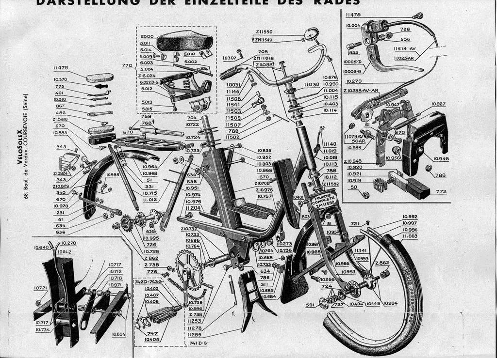
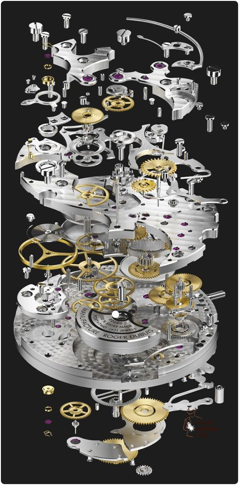
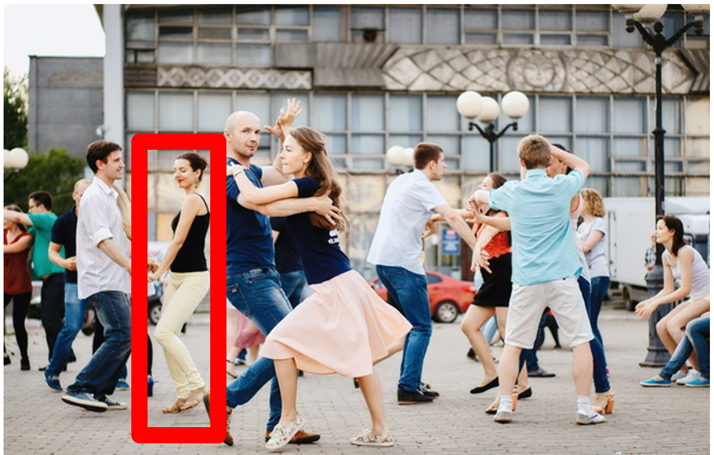
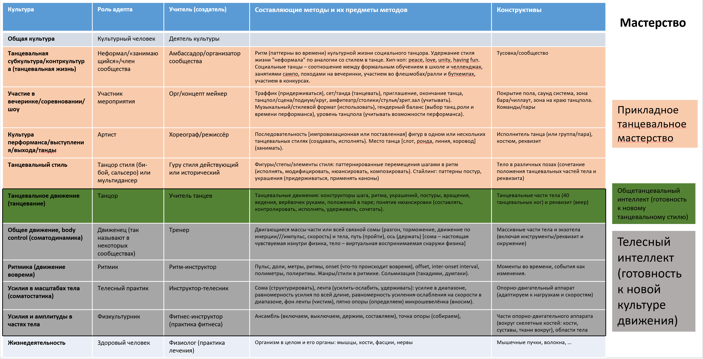

# Системные уровни выделяются вниманием. Пример методов телесной работы

Люди плохо думают о «поведениях», плохо выделяют вниманием части и целые в динамических (меняющих свои состояния во времени) системах, требующих 4D представлений о частях в пространстве-времени. Опишем методы/культуры/стили и роли, используемые сообществом танцоров, практикующих **социальные/парные** **танцы**[^r6-1] как типичный пример.

Работа «танцевального выхода»/перформанса/«исполнения танца»::метод интересна тем, что существует всего несколько минут. Метод этой работы исполняется артистами::роль, в которой танцор::«подроль артиста». В нашем случае артист (с задействованной подролью танцор) — это исполняющая метод проведения танцевального выхода подроль «члена сообщества социальных танцев»::«культурный человек»::человек, пример других подролей ролей людей-членов сообщества социальных танцев — организатор мероприятий, диджей. Можно легко добавить ещё один системный уровень, например, взять не всё сообщество социальных танцев, но ещё и дополнительный уровень сообщества какого-то стиля социальных танцев, например, сообщество сальсы. Повторимся: в этих сообществах/тусовках не только танцующие артисты, но и организаторы мероприятий, фотографы, видеографы, диджеи, учителя — причём и «артистами» тамошних артистов не называют, если только они не профессионалы, зарабатывающие своим танцевальным творчеством. Коллективно выполняемый ими стиль/культура поведения сообщества этого стиля — субкультура, для сообщества всех социальных танцев — иногда говорят про эту культуру «субкультура», иногда и просто «культура», всё зависит от проекта, для которого ведётся моделирование/«присвоение типов для важных объектов предметной области». Себя артисты::роль предпочитают называть «танцоры», но это характеризует их общетанцевальную подготовку, мы увидим дальше, что «танцор» тут находится на довольно глубоком системном уровне, выше «танцора» ещё много самых разных ролей.

Системное мышление о танцевальном сообществе или даже отдельном артисте::роль сложней, чем системное мышление о каком-нибудь электронном гаджете. Гаджет можно физически собрать-разобрать из конструктивных частей, выделяемые вниманием функциональные части гаджета хотя бы примерно соответствуют конструктивным частям этого гаджета, то есть деталям и их сборкам. Артиста или более узко артиста с подролью танцора (это системы, названные по их роли в окружении, а не по конструкции агента «человек» или «робот») невозможно собрать-разобрать в уме в форме взрыв-диаграммы/«explosion diagram/schema». Проблема в том, что «взрыв-диаграммы» — это не выделение вниманием функциональных двигающихся и меняющих своё состояние в ходе работы частей, а прямо таки физическое разбиение (хотя оно может проводиться в уме) конструктивов, о котором думают обычно во время создания системы, а не во время работы системы. Вот пример взрыв-диаграммы велосипеда, на диаграмме не функциональные части, а именно конструктивные части[^r6-2]:

Если таким образом представить себе организм человека с его функциональным разбиением на органы::«роли в организме», то сразу видна ошибка: такой «физически разобранный организм из конструктивов» нельзя представить живым-работающим: он будет мёртвым в таком виде, «время разборки»! По взрыв-диаграмме нельзя объяснить «как работает», изменения::поведение в ходе работы. Для показа изменений надо как-то отображать потоки вещества или энергии, разность потенциалов. Для этого используются «функциональные диаграммы»/«принципиальные схемы», на которых между функциональными частями что-то течёт (жидкость, электроэнергия, механическая энергия, тепло), производя изменения в функциональных частях. Об этом подробней будет чуть дальше.

Проблема в том, что взрыв-диаграмма часто неосознанно появляется в уме при функциональном рассмотрении, как неосознанное представление функциональной декомпозиции. Это грубая ошибка системного мышления. Обратите внимание, конструктив велосипеда на картинке не едет, невозможно описать его движение. Вот конструктивные части часов, изображение взрыв-диаграммы:

Такие часы не тикают. Но нам-то надо как-то обсуждать системы прежде всего во время их функционирования/эксплуатации, и выделять в них совсем другие части — это можно сделать только вниманием. Верный способ: попытайтесь представлять системы в ходе их работы не вот такими статичными картинками, а в виде коротеньких видео, «гифок»/.gif — даже если во время работы/функционирования системы нет движущихся частей всё равно представляйте потоки тепла, электричества.

Про артиста::роль (певца::подроль, танцора::подроль, жонглёра::подроль, в том числе подроли определённого жанра/стиля соответствующей художественной/артистической культуры/деятельности/метода певца, танцора, жонглёра и т.д.) мы думаем в ходе его выступления/выхода/перформанса, и его функциональные (то есть во время работы/использования) части приходится выделять вниманием прямо «по ходу работы», а не разбирать. Разобрал на конструктивные части в реальности, а не вниманием — всё, системы нет, для неживых систем она ещё «в изготовлении» или «уже разобрана», а для живых систем — «уже мёртвая».

**Для системы есть только один способ думать** **о её функционировании—** **выделять** **функциональные (а не конструктивные)** **части** **используемой/эксплуатирующейся/работающей/функционирующей системы** **вниманием** **в ходе её работы, а** **не** **мысленной, даже и внимательной сборкой (разборкой) пока ещё (или уже) «мёртвой» системы в момент её создания (или уничтожения).**

Вот картинка социальных танцоров, в которой даже нужного нам отдельного танцора приходится выделять вниманием, и это может быть даже не первый попавшийся танцор (который только отвлекает, ибо смотрит прямо на нас, да ещё на переднем плане, да ещё и показан очень резко). Нет, нам нужен тот, кто нужен — например, танцор, который взят в красную рамку:

Если нас интересует функциональное рассмотрение, то надо переходить в 4D — увидеть это не статичной картинкой, а добавить к пространственным трём измерениям ещё и измерение времени: проиграть в уме видео, хотя бы и короткое.

А теперь представим, что ещё звучит громкая музыка, вас время от времени толкают, все танцоры довольно быстро перемещаются, а внимание ваше должно переключаться не только на отдельных людей, но и как-то выделять части этих людей (не разбирать на части, а выделять части вниманием!). Мышление в этой ситуации наблюдения за танцующими людьми-артистами мало отличается от того, что происходит в какой-то организации как системе-создателе. Мышление для описания работы ткачей в лёгкой промышленности (создатели тканей) или инженеров-атомщиков (создатели атомных электростанций) будет устроено примерно так же, как мышление о танцорах: шанса представить взрыв-диаграмму не будет, придётся представлять что-то движущееся/меняющееся и выделять это «что-то» вниманием.

Подробней о том, как обсуждать работающие системы с людьми, будет в руководстве по методологии, но уже сейчас можно заметить, что разговор о методах для живых людей, как ни странно, помогает разобраться с выделением системных уровней (определяемых функционально, во время использования/работы системы) и для неживых систем. Когда новичка инженера-менеджера просишь представить функциональный двигатель автомобиля во время работы этого двигателя::подсистема в едущем автомобиле::система, то он невольно представляет у себя в голове именно взрыв-диаграмму, и это ошибка уже с первой секунды размышления о функциональных/ролевых частях системы. А вот разобраться с примером такого мышления на людях быстрее как раз потому, что их трудно разобрать «в уме» на составные конструктивные части.

Роли/«ролевые объекты»/«функциональные части» людей-агентов, реализуемые конструктивными/материальными частями организма и работающие под управлением «программы выполнения метода»/мастерства::система (с учётом мастерства задействования инструментария метода), получаются не «сборкой конструкции», а обучением. У младенцев не так много человеческого в поведении. Врождённых ролей у младенца практически нет, младенца можно назвать «личностью» только в общефилософском смысле, а интеллект младенца крайне ограничен, вменяемость минимальна (ибо нет возможности понимать и произносить речь), методологический кругозор нулевой. Первые годы у людей быстро растёт интеллект (в том числе вменяемость/persuadability — вместе с появлением речи, вместе с активированием режима медленного мышления S2, дающего возможность понимать и принимать аргументацию), а затем познаётся/learn множество самых разных ролей, превращая «почти личность» ребёнка в полноценную взрослую личность.

Напомним: агент-человек состоит из (отношение композиции) организма и личности, где организм — это hardware/аппаратура универсального создателя/constructor (и вычислителя/computer в составе создателя), а личность — это софт/программы/«набор всех видов мастерства». Личность даёт агенту мастерство выполнять те или иные методы, то есть проявлять видимое культурное («по известному в человеческой культуре методу») поведение.

Артист и танцор проявляются как роли в момент танцевания, они распознаются по их поведению в каком-то агенте при помощи исключительно внимания. В агенте::создатель есть программа/софт-на-нейроносителе/мастерство выполнения культуры/стиля/практики/метода художественного выступления (для роли артиста) и танцевания (для роли танцора).

Вы сразу отличите танцора во время танца от слесаря или землекопа во время слесарных или земляных работ — по «проявляемому поведению»/«способу/методу выполнения работы»/«паттерну поведения». Метод/культура/стиль поведения Васи в ходе (работ) танцевания зрительно сильно отличается от метода/культуры/стиля поведения Васи в ходе слесарных или земляных работ. Помним: роль исполнителя какого-то метода работы мы распознаём через наблюдение выполнения работ по этому методу (наблюдается изменение работами состояния важных объектов) каким-то агентом, знакомства с рассуждениями агента о его методе и демонстрации тем самым предметов интереса этого метода, другого пути нет — что будет делать агент (каким методом он будет работать) из роли чаще всего невыводима, а вот роль из метода работы — выводима. Скажите, что агент (человек, робот, предприятие) делает и говорит/пишет — и можно будет сказать, к какой культуре поведения он принадлежит, какая у него роль. Роль часто получает своё название-термин от имени метода её работы, от ожидаемого паттерна поведения этой роли. **Это мы обсуждали, когда говорили о мантре системного мышления: сначала «в каком окружении** **что** **делает»** **для целевой системы, потом «каким способом/методомсоздаёт», а уже потом—** **«кто делает»** **для роли создателя и агента-актёра этой роли.**

Совместное танцевание двоих танцоров::роль в «социальных танцах»::культура/стиль/практика/«метод поведения» относительно простое по сравнению с поведением команды каких-то агентов-людей в проекте создания и развития какой-либо системы и тем более в организации (каком-то предприятии), где одновременно ведётся множество проектов. Почему мы пишем «метод поведения», а не «метод работы»? Мы используем более абстрактный тип для «работы» просто потому, что как-то не принято социальные танцы считать «работой» в смысле job, а метод — это way of working, в русском языке тут легко перепутать «работу по методу как задействование ресурсов» и «работу как занятость на должности». Но мы ещё можем и учесть то, что говорим не о «танцевальных методах работы», а о «танцевальной культуре» — культура как раз будет методом работы, который распространён в каком-то сообществе. **Важны не использованные слова-термины, важен донесённый смысл, важно понимание! Но кроме слов для донесения понимания у нас ничего нет, так что слова-термины тоже важны!**

В культуре/методе социального танцевания обычно танцуют двое танцоров, «танцевальная пара», иногда социальные танцы даже называют «парными танцами». Танцевальная пара — это два танцора с заранее известными специфическими ролями (лидер/ведущий и фолловер/ведомый/следующий, часто «партнёр» и «партнёрша», но это танцевальные роли, а не гендерные, да и иногда бывает танец на троих — double trouble, один лидер и два фолловера[^r6-3]). Лидер и фолловер даже не разговаривают друг с другом словами, хотя в некоторых танцах могут и разговаривать, например в «Caroline shag»::стиль/культура фолловер может объявить прямо голосом фигуру, которую должен станцевать лидер.

При этом лидер и фолловер имеют понятные друг другу предметы интереса (им обучают в школах танца), они играют в ходе перформанса в «понятную ролевую игру»[^r6-4]. В большинстве командных проектах по созданию и развитию систем, и тем более в каждом предприятии со множеством проектов, людей с разными ролями больше двух или даже трёх, при этом методы/деятельности/культуры/практики этих людей существенно разнообразней, а взаимодействие — сложней.

Системно думать и о проекте, и о предприятии — это прежде всего вниманием выделять тамошние роли/«функциональные части» как выполняющие какие-то функции/методы/практики/деятельности. Для этого удобно использовать выход/исполнение/переформанс социального/парного танца как переходную по сложности систему.

Танцор::роль — даже не верхнеуровневая подроль участника сообщества социальных танцев. Танцор — это роль того агента, который выполняет танцевальные, а не бытовые движения, будь то социальные, сольные или ритуальные танцы (например, танцы шаманов). Всё выступление в целом делает артист::роль, который выполняет действия по методам (это означает, что этим методам его хорошо бы научить, а не ждать, что он эти методы как-то прихватит сам из «насмотренности»):

* уместности своего «выхода»/выступления («был на похоронах, там играла музыка, я не растерялся — потанцевал»)
* отслеживания реакции зрителя
* выбора соответствующей стилю танцевания одежды,
* реализации артистической/художественной идеи,
* начала и конца танцевания (возможно приглашение партнёра, проводы партнёра с танцпола на место в зале, настройка на конкретного партнёра в ведении, распознавание окончания вступления и конца трека в музыке, и т.д.)

Подролью/подсистемой артиста будет танцор, который и выполняет танцевальные движения, это более узкая роль, более мелкая часть личности (помним, что личность реализуется даже не столько телом, сколько «программой в мозгу». Мастерство (аналог компьютерной программы, реализованной мозгом-вычислителем) танцевания::культура/«метод/способ действий» для исполнения роли «танцор» реализуется меньшей частью мозга, чем общая программа выполнения действий по методам «художественной деятельности» надролью «артист».

Мы не знаем точно, как реализуется «мозговая программа» в мозге, но условно можно считать, что «по размеру» больше нейронов занято всем мастерством художественной речи, пения, музицирования/«игры на музыкальных инструментах», пантомимы, танцевания, рисования и т.д., то есть занято всей артистической частью личности, чем только мастерством танцевания, танцевальной частью личности. Артист::роль не только умеет танцевать::«метод выполнения танцевальных движений под музыку», но он ещё много чего другого умеет — артистическая деятельность явно не сводится к только танцам. Скажем, артист театра или кино обычно танцевать умеет — но на сцене или в кадре танцует редко.

Представим системное рассмотрение культуры/«методов действия агента» социального танца в момент работы/функционирования танцора (помним, что **метод работы** **в момент еговоплощения в физическом мире, то есть когда какой-то физический/конструктивный объект-агент выполняет роль, отыгрывающийэтот метод/способ/стиль/вид труда** **—** **это работа/действия/функционирование**).

Вот табличка системных уровней как уровней ролей/«функциональных/ролевых частей» члена сообщества социальных танцев, которая примерно поясняет тут рассказываемое (а что написано в заголовках таблички, будет понятно чуть ниже по тексту руководства)[^r6-5]. Можно также рассматривать эту табличку как стек танцевальных методов/культур/практик. В руководстве по методологии будет подробно рассмотрена и эта табличка, и ещё примеры подобных табличек — чтобы лучше понять принципы описания методов.

Добавим для наглядности художественных деталей («рендеринг», как в компьютерном 3D-моделировании, когда добавляют эффекты освещения и помещают какие-то дополнительные предметы в картинку из САПР/CAD, «для живости восприятия»). Это нужно для «заземления», представления объектов в физическом мире.

В центре Москвы в одном из клубов с 22 часов 13 минут до 22 часов 18 минут играет громкая музыка, царит полумрак и двое «неформалов»/«занимающихся социальными танцами»/«членов субкультурных сообществ» в своих подролях «участник мероприятия» танцуют::работа сальсу::«стиль танцевания» посреди клубного танцпола. Почему нам так важно указать время и место? Чтобы было понятно, что речь идёт о физическом объекте, который существует не только в пространстве, но и во времени — и мы рассматриваем экземпляр исполнения культуры (метода/way of working, но поскольку тут сообщество — культура, а также ещё будет рассмотрен и стиль) какими-то «конкретными ресурсами, занятыми конкретное время», то есть работу/work как она понимается в операционном менеджменте. Это неважно, что предметная область не такая, чтобы в ней привычно звучали слова из инженерии и менеджмента. Важно показать, что рассуждения ведутся одни и те же для любой предметной области — сила интеллекта как раз в этом. Системное мышление позволяет детально обсуждать самое важное, что происходит в самых разных предметных областях, оно для этого и предназначено.

Мы понимаем, что танцоры::роли наши вполне физичны, но дальше будем обсуждать культуру танцевания как подкультуру общей культурной жизни. В просторечье эта культура называется «танец», но мы не будем использовать это слово-термин, ибо «танец» — это и «культура танца в целом», и «исполнение/выход/перформанс танца», и «танцевальная работа». Сравните: танго::танец — это может быть и танцевальный стиль, и сообщество людей, практикующих танго, и отдельное исполнение танцевального стиля танго. Когда говоришь «танцевание танго» — сразу понятно, что речь идёт о поведении (функция/практика/культура/стиль/метод обычно именуется отглагольными существительными, в английском — -ing-формой глагола).

**Физиолог**::роль поглядывает на эту пару и явно доволен: партнёр::«танцевальная роль» не хромает, исполняющий эту роль человек **здоровый::«состояние** **организма агента»**. Все кости, мышцы, связки, фасции и т.д. целы, этот врач::«надроль физиолога» (употребляем «врач» чисто для красоты слога: как «тигра» называть более общим классом «зверь») недавно починил (терапия — это в инженерии «ремонт») всё, что касалось системного **уровня физиологии**. Остальных::роли в клубе это не волнует, но врача-физиолога (читать как «зверя-тигра») до сих пор волнует: он ищет свидетельств в наблюдении за танцеванием, что мышцы-кости-связки и прочее, чем он занимался в ходе лечения партнёра, работают как надо. Вроде как всё ОК! И врач уходит с вечеринки. Врачу даже неважно — это была сальса::стиль или танго::стиль, собственно танцевания::«метод танцевального движения под музыку» он и не заметил, слишком высокий системный уровень для его мастерства физиолога, для него это не «танцевальное движение», а «телесное движение».

Каждым системным уровнем мастерства как части личности участников этой танцевальной вечеринки (подролями участников, «функциональной декомпозицией» личности) занимаются в части создания и развития свои деятельностные/трудовые роли. Но на нижних уровнях врач::создатель и тренер::создатель занимаются не только и не столько личностью (мастерством) агента как целевой системой, сколько телом/организмом агента (хотя и врач и тренер ещё и учат мастерству работы с собственным телом: врач учит спать и есть правильно, тренер учит заниматься движением правильно — но следит и за тем, чтобы менялась «аппаратура», то есть увеличивалась сила мышц, появлялась гибкость суставов — и не только за счёт мастерства управления телом, но и за счёт биологических изменений тканей под воздействием тренировок).

Если мы хотим, чтобы универсальный агент (универсальный в смысле universal constructor, «программируемый на любые задачи преобразователь физического мира») хорошо работал как артист, в проекте его создания и развития должны хорошо отработать самые разные роли создателей. Инженеры делают свои системы командой. Людей тоже должны «делать» (обучать) команды! Тут речь идёт не только о каком-то разделении труда между подролями учителей, специализирующимися на обучении (в руководстве по инженерии личности будем говорить о культуртрегере, методологе, методисте, преподавателе, декане/администраторе), но ещё и о ролях учителей (создателей мастерства), специализирующихся в прикладной (в определённой узкой предметной области) области того целевого мастерства, которому учим (например, мастерства танцевания).

Чтобы танцевать, кроме танцевального мастерства нужно ещё иметь здоровое (с точки зрения физиологии) тело. Если тело не здорово, своим делом должен заняться физиолог. Физиолог — это подроль врача, а исполнять роль врача может хоть сам агент, исполняющий и роль танцора, и какой-то другой нанятый им для исполнения роли врача агент с нужной степенью квалификации во врачебном деле. Врача не волнует сам танец как таковой. Партнёр (с точки зрения врача — это просто «здоровый человек, бывший пациент»::организм, его танцевальная роль неважна) движется? Движется. Ему не больно? Не больно. Он ничего себе этим движением не повредит? Не повредит. Всё, кости-мышцы-связки целы, и врач может предоставить тело другим специалистам, которые займутся другими делами, помогут мастерству танцевания дать его инструмент — опорно-двигательный аппарат (кости-мышцы-связки-фасции и всё то, чем занимается обычно врач).

Рассмотрение этой работы с организмом::аппаратура для мастерства::софт мало отличается для танцора и музыканта: в случае музыканта тело::организм нужен чуть меньше, чем танцору (редко музыкант работает ногами, чаще всего только руками, а в духовых инструментах — лёгкими и губами — но эти части тела тоже работают как «оборудование»), а ещё к телу добавляется дополнительное «оборудование», (музыкальный) инструмент (например, рояль или тромбон). Легко представить себе ремонтника и настройщика рояля, который ремонтирует и настраивает рояль пианисту:: «подроль музыканта» примерно так же, как врач и тренер тело «танцора сальсы»::«подроль танцора». Более того, ремонтник и настройщик рояля может даже не уметь играть, и не различать классическую и джазовую музыку! Хотя может и уметь, как врач или тренер могут уметь танцевать. Но это не обязательно. Более того, когда «инженер по САПР/CAD» устанавливает и настраивает «программу САПР/CAD», то эта ситуация полностью аналогична для инженера-проектировщика работе врача с телом танцора, работе ремонтника и настройщика рояля с роялем музыканта. В состав тела агента мы включаем часто не только его собственное тело, но и оборудование как экзотело. В состав мозга мы можем включать не только неокортекс, но и экзокортекс, а в состав тела — одежду, транспорт, инструменты. Отнять мою рубашку — это всё равно, что отнять продолжение моего тела, частная собственность священна! А если в качестве оборудования я использую завод (капитал! Средства производства!), то это тоже моя частная священная собственность, продолжение моего тела.

**Тренер::роль** (мы включили в эту роль и подроль инструктора-телесника и подроль ритм-инструктора, и даже подроль фитнес-инструктора — все их будет выполнять один агент в нашем примере, но «разделение труда» как раз о том, что исполнение каких-то подролей крупной роли может выноситься вовне, исполняться другими агентами) внимательно смотрит на эту же танцующую пару и видит двух **движенцев**::роль (так обычно называют себя люди, которых интересует телесное движение как таковое, вне привязки к виду спорта, или танцам, или паркуру). Он выхватывает своим вниманием **общие движения** пары (вращения, приседания, балансы и падения, шаги) — насколько они управляют телом (body control), то есть насколько движения тела равномерны, насколько удерживается в этих движениях равновесие, насколько неразболтанно выполняются ускорения и торможения в движениях. Если в движении видны какие-то проблемы (теряется форма, отклонения от ожидаемой траектории), то **инструктор-телесник**::(подроль тренера) смотрит на внешние признаки того, что нагрузки в теле равномерно распределены: усилия в функциональных мышечных органах-лентах, соразмерных всей длине человеческого тела (от точки опоры до точки контакта с другим человеком) минимальны для выполняемых движений и равномерны. Если там проблемы, то внутри этого же организма танцующего человека **фитнес-инструктор** отслеживает, не перенапряжены или не перерасслаблены ли какие-то отдельные части тела — колени или шея. Мы перешли уже на другой системный уровень, где тело здоровое, но нам нужно поставить его под контроль сознания/body control: если танцор хочет передать движение от точки опоры аж до другой точки опоры (да ещё эта точка опоры может быть в другом теле! Танец-то парный), ему нужно иметь весьма специфическое внимание к телесным ощущениям напряжения и расслабления в соме (сома — потому как тренер воспринимает тело снаружи, а танцор воспринимает тело изнутри). А ещё тренеру нужно добиться в теле/организме агента-танцора правильной структуры опорно-двигательного аппарата (мышц-связок-фасций-костей). Танцору эта правильность позволяет провести танцевальное движение без лишней суеты, толчков, шевелений для удержания равновесия, прицеливаний и метаний перед приходом ноги на пол или руки в какую-то точку. Но мы пока даже не говорим о танцевальном движении, тренер работает с телесным уровнем, пока оторванным от специфики задействования тела в каком-то культурном/стилевом (бытовом, спортивном, танцевальном) движении.

Агент, совмещающий роли тренера, ритм-инструктора, инструктора-телесника и физкультурника (но помним, что может быть и разделение труда, никакого совмещения всех подролей в одном агенте, может действовать «тренерская бригада»), конечно, готовит «управление телом»/body control и занимается свободой сознательного движения не только для танца. Управление телом и свобода сознательного движения как предметы интереса важны и для ролей спортсменов-легкоатлетов, и для ролей музыкантов (пальцами шевелить при игре на музыкальных инструментах — мышечная работа!), и для ролей, занимающихся единоборствами, и для ролей, занимающихся паркуром. Но тут он сработал для танцоров, и он доволен: тела танцоров вполне свободно двигаются. То, что эта свобода движения ещё и обеспечивает качественное ведение-следование в паре[^r6-6], тренеру неважно, собственно танцевальное движение мы тут не обсуждаем. Конечно, тут рассматриваем движение именно танцоров, но всё-таки свободно и управляемо двигающееся тело может быть использовано в самых разных целях — в этом-то и прелесть системного мышления, что проблемы каждого системного уровня можно обсуждать в том числе в отрыве от проблем других системных уровней. Мастерство управления телом, да и само тело — это нижние системные уровни агента-танцора. Обычно «нижний системный уровень» означает меньшую специализацию: атомы неспецифичны, они потенциально могут участвовать как мельчайшие частицы в огромном количестве других систем, равным образом хорошо развитое тело и поставленное управление этим телом потенциально могут участвовать в самых разных других системах — вокалистах (пение — это мышечная работа), программистах квантовых компьютеров (сидеть восемь часов на рабочем месте — двигательная активность, хорошо бы, чтобы после этих восьми часов ничего не болело и не было усталости в теле), танцорах, спортсменах и так далее.

[^r6-1]: <https://ru.wikipedia.org/wiki/Социальные_танцы>

[^r6-2]: <http://solexclubspirales.free.fr/eclates.html>

[^r6-3]: <https://vk.com/video52259628_456244076> и <https://vk.com/video73069173_456240091>, <https://vk.com/video-18525054_456240224>, методика double hustle <https://1drv.ms/b/s!Ag1bdTHZ9O7JgQ84GsQZqL_x8m9V>

[^r6-4]: Социальный танец может пониматься как «игра в загадки», <https://vk.com/wall-179019873_1550>

[^r6-5]: Табличка в полном разрешении есть в <https://disk.yandex.ru/i/QbcxOA1uuf5AAA>

[^r6-6]: видеоролик, где очень кратко рассказывается о том, как именно уровень телесных практик ответственен за то, будет ли танцор студнем, тяжёлым или лёгким буратино, или же всё-таки танцором: <https://vk.com/wall-179019873_511>
