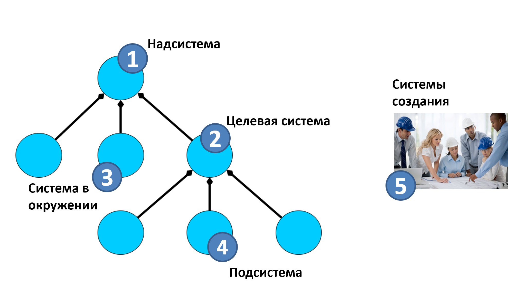

# Целевая система и коллективное системное мышление

Для того, чтобы как-то проводить системные (т.е. с использованием понятий системного подхода) рассуждения, нужно как-то научиться управлять фокусом своего внимания на разные системы в многоуровневом системном разбиении — и уровнях выше целевой системы, и уровнях ниже целевой системы. Системный мыслитель всё в мире рассматривает как системы, сами входящие в системы более высокого системного уровня как подсистемы, и имеющие свои подсистемы более низкого системного уровня, поэтому прежде всего нужно выделить какую-то из них, к характеристикам которой мы проявляем интерес, и пытаемся что-то в мире изменить для реализации этого интереса/предпочтения. Эта выделенная вниманием агента (субъективно! Удобным для ролевого метода работы агента способом!) система и будет **целевая система** (system-of-interest, буквально «система нашего интереса»). Это та в будущем успешная система, с которой мы::«команда проекта» что-то хотим делать: придумать и создать её, починить, эксплуатировать, уничтожить.

Дальше можно обсуждать любой системный уровень выше и ниже уровня, на котором расположена целевая система, но на этой системе остаётся фокус нашего::«команды проекта» внимания, системный эффект именно этой системы нас будет интересовать прежде всего. Одна камера внимания каждого агента, участвующего в проекте, всегда удерживает целевую систему, другие камеры внимания для разных отыгрываемых этими агентами ролей могут при этом бродить по разным системам других уровней и по системам графа создателей. Но на целевой системе внимание у каждого агента закреплено хотя бы одной камерой внимания в ходе проекта всегда, про неё не забываем.

Метафора тут — полярные координаты, всё (коллективное! Не только одной роли!) мышление крутится вокруг целевой системы. Это точка отсчёта, движение внимания в системном мышлении отсчитывается от неё. Если потерялись с длинными рассуждениями среди огромного множества систем в проекте, то вернитесь к целевой системе, и дальше двигайтесь по цепочкам разных отношений (главным образом отношений композиции и создания) ко всем остальным системам. Целевая система даёт стабильность внимания самых разных ролей в коллективных проектах.

Для разных ролей целевыми системами представляются самые разные физические объекты, но в ситуации коллективной деятельности предполагается, что все роли, выполняющие методы непрерывного создания и развития целевой системы (всё, что с ней происходит с момента замысла через множество модернизаций до прекращения использования) **договорились** о том, какая же это система, где эти границы. **Системное мышление прежде всего поддерживает не мышление одного человека, а поддерживает коллективное мышление** **в организации как множестве агентов, которые могут** **известным** **методом** **(этот метод—** **тот или иной вид** **менеджмента)** **распоряжаться их совокупным трудом и ресурсами**. Организации — это команды проектов, предприятия/компании/фирмы, некоммерческие организации, кружки, учебные группы и прочие, где понятно «кто начальник». Если это сообщество, то скорее всего начальника нет, системного мышления вокруг одной целевой системы может и не случиться, договорённостей о том, что делаем (о целевой системе) не будет. Но если это сообщество кем-то организуется и формальное вступление в сообщество означает то, что просьбы этого организатора будут выполняться в каком-то объёме — то тут с системным мышлением всё может быть в порядке (ну, или не может быть, если люди специально ему не обучались).

Системное мышление помогает агентам (в том числе людям) договориться друг с другом о своих действиях, и прежде всего договориться о том, какая система их интересует, какая система является целевой, каковы границы (что входит, а что не входит в состав) целевой системы. Так что **системное мышление—** **коллективное мышление, а не мышление одного** **агента, оно предполагает договорённости о предмете деятельности, то есть о целевой системе.** **Целевая система не ваша::агент, не какой-то одной роли, она общая для команды** **проекта, и о ней команда договаривается (в том числе в договорённостях участвуют и внешние проектные роли).** **Конечно, можно вообразить и задействование системного мышления одним агентом, но этому агенту придётся выполнять множество самых разных ролей, поэтому он не сможет задействовать разделение труда—** **высокую квалификацию в выполнении отдельных ролей. Создание сложных систем потому и возможно, что системное мышление позволяет договориться разным агентам, каждый из которых обладает высоким мастерством выполнения разных ролей—** **визионеров, проектировщиков, архитекторов, инженеров производственной платформы и т.д.**

Целевая система обычно мыслится **на момент** **времени** **её использования** (operations, эксплуатации, функционирования, работы) уже в готовом виде, когда она взаимодействует со своим окружением/средой/environment и играет в этом окружении свою роль/выполняет функцию. То есть «самолёт» мыслится, когда он летит, «компьютер» — когда он считает, «мастерство» — когда выполняется работа по методу этого мастерства. Целевая система во время её создания всё-таки ещё не в том состоянии, когда она что-то делает, выполняет функцию. При создании системы мы больше думаем о функциях создателей по отношению к изменениям состояния частей будущей целевой системы, эти части меняют свои состояния и в ходе производства собираются в готовую систему, это всё «время создания». А когда думаем про целевую систему и системные уровни — это время использования/эксплуатации/функционирования/работы целевой системы.

На рисунке представлена системная (по отношениям композиции) иерархия с тремя системными уровнями, системы показаны кружками, стрелки с ромбиками показывают отношения композиции/разбиения/состава/часть-целое, целевая система показана как система 2:

Система, в состав которой входит целевая система, называется **надсистема.** На рисунке это система 1. Часы будут надсистемой для шестерёнки, молекула — надсистемой для атома. Целевая система имеет свою функцию (поведение с ожидаемыми результатами) в надсистеме, её функция позволяет надсистеме проявить в конечном итоге эмерджентное свойство, т.е. выполнить функцию надсистемы. Функция показа времени у часов как целевой системы в интерьере как надсистеме помогает интерьеру быть удобным для проживания.

Помним, что все системы определяются прежде всего по их функции в надсистеме, они в надсистеме играют какую-то роль. И надсистема — тоже система, ей нужно выполнять свою роль в над-надсистеме (просто на картинке эта над-надсистема не показана, но она всегда есть!).

Если целевая система шестерёнка, то шестерёнка используется в часах (входит в состав работающих часов как надсистемы), её роль «передатчик движения», назначение/функция::поведение — передача (для функций используем отглагольные существительные) в надсистеме-часах движения на стрелки так, чтобы часы могли показывать время, т.е. надсистема (часы) могла «выполнять своё назначение»/функционировать/«выполнять свою функцию»/«выполнять свою роль»/работать.

Все системы в момент эксплуатации целевой системы, которые не входят в целевую систему, называются **системами в окружении** (environment, среда, operation environment, рабочая/эксплуатационная среда, рабочее/операционное окружение — термин «окружение» предпочтительней, поскольку подчёркивает центральную роль целевой системы, а термин «среда» не подразумевает какого-то явного центра). **Окружение—** **это всегда в момент работы готовой системы.**

**Когда** **целевую** **систему** **(впрочем, и подсистему, и надсистему)создают, там будет другое** **рассмотрение:** **в центре будут какие-то из систем создания, а будущие системы** **находятся** **в неработоспособном ещё состоянии «сырья», «полуфабриката».** На картинке системы создания (условно изображены как оргзвено из людей) изображены отдельно от иерархии системного разбиения, это ведь вообще другое время (время создания, а не время использования/эксплуатации/функционирования/работы целевой системы, её подсистем и её надсистемы).

Частая ошибка — это считать, что системы создания (enabling systems, constructor systems) находятся в системном окружении. Нет, они не входят в системные уровни той иерархии по отношению «часть-целое», к которой принадлежит целевая система. Отношение их с целевой системой (и другими системами обсуждаемых системных уровней, то есть надсистемой, подсистемами) — отношение создания (на диаграмме оно не показано).

На рисунке одна из систем в окружении (этих систем множество!) — система 3. Например, для шестерёнки в часах таким окружением будут стрелки, тоже входящие в состав часов. А ещё в окружении могут быть какие-то системы, даже не входящие в состав надсистемы, но без которых трудно обсуждать работу/функционирование целевой системы — хотя они входят в какую-нибудь над-над-надсистему. Например, солнце, нагревающее часы и тем самым влияющее на шестерёнку (при нагреве она может поменять свои размеры, что может оказать влияние на основное поведение — точно передавать движение, что далее оказывает влияние на поведение надсистемы — точный показ времени). **Окружение—** **это системы из состава надсистемы, над-надсистемы и т.д. Главное, что окружение—** **это вовне границ целевой системы и речь идёт о моменте, когда система работает и выполняет свою функцию (а не когда она задумывается, изготавливается, испытывается).**

Заправочная станция для целевой системы такси, входящего в состав таксопарка как надсистемы — это система в окружении. Дорога для едущего по дороге такси — это система в окружении. Повторимся: совершенно необязательно, чтобы система в окружении была именно подсистемой надсистемы, «смежником» для целевой системы. Хотя иногда все другие (кроме целевой системы) подсистемы надсистемы для целевой системы выделяют специально, называя **ближним окружением**, а за пределами надсистемы системы называя **дальним окружением.** Для автомобильного мотора в составе автомобиля как надсистемы салон автомобиля и его колёса — ближнее окружение, это подсистемы автомобиля. А вот дорога и палящее солнце — это системы из дальнего окружения).

**Подсистема** — какая-то часть системы. В системном мышлении подсистемы в момент их использования рассматриваются главным образом как роли, функциональные объекты, причём только после рассмотрения окружения и определения функции целевой системы в окружении — ибо пока мы не понимаем, что должна делать целевая система, какую функцию/поведение она несёт в окружение, мы не можем ничего сказать про её состав и уж тем более не можем обсуждать конструкцию (какие там конструктивы, задействованные во время создания, играют роли выделенных подсистем). На рисунке пример такой подсистемы целевой системы показан под номером 4.

Проблема в том, что целевой системой для разных проектов может стать любая, которая будет проявлять интересную для них эмерджентность, нужный для них системный эффект. И тогда все остальные виды систем будут определяться по-другому. Скажем, если целевой системой в каком-то проекте объявить систему 4, то система 2 будет в этом проекте её надсистемой. И если все в том проекте договорились, что целевой системой будет система 4, то так тому и быть — именование разных систем в том проекте будет другое, хотя состав систем в системной иерархии будет одним и тем же. Если какая-то фирма делает интерьеры, то они в ней будут «целевая система», а если интерьерные часы — то «целевая система» — они, а если массово изготавливает шестерёнки (в том числе и к часам) — то «целевой системой» будет шестерёнка. И все разговоры будут крутиться вокруг целевых систем. А как же взаимодействие между проектами? Придётся договариваться: участники этих трёх проектов друг для друга будут «внешними ролями». При этом общения между проектом интерьера и проектом изготовления шестерёнок не будет, а вот часовщикам придётся общаться и с заказчиками — интерьерной фирмой, и с поставщиками — фирмой по изготовлению шестерёнок.