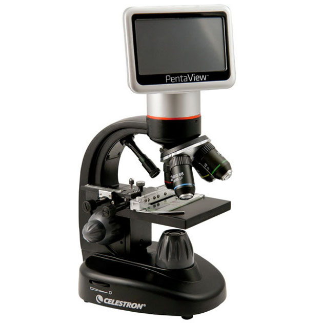

# Именование системы

Мало выявить целевую систему, ей надо дать какое-то осмысленное имя, чтобы вас понимали быстро. Если я назвал целевую систему Муркой, то это может быть что-то живое и крупное (вряд ли таракан), и даже речь идёт о самке (кошки или человека — не так важно, но вряд ли это будет самец), при этом я буду подозревать, что это имя экземпляра, но не тип целевой системы. Но вот если я назвал систему #78F3, то мне придётся всем рассказывать — это я назвал тип или экземпляр, а также что это вообще такое: зверь, электронный гаджет, территория, или не система вообще, а только описание системы, например «документ #78F3».

<strong>Система обычно именуется</strong> <strong>по</strong> <strong>узкому</strong> <strong>типу</strong> <strong>её основной</strong> <strong>роли, выполняющей какую-то основную</strong> <strong>функцию/сервис</strong>. Так её именует команда, занимающаяся созданием и развитием надсистемы для этой системы, а если её именует производитель продукта, который не очень хорошо понимает, каким именно аффордансом выберут его продукт, то обычно он даёт самое общее название ожидаемой роли, для выполнения которой систему купят.

Если речь идёт о создателе и его сервисе (методе, работы по которому создатель будет выполнять для экземпляров предметов метода, которые ему будут давать другие создатели), то именовать этот создатель свой предмет метода будет в наиболее общем виде так, как это будет делать владелец заготовки целевой системы, для которой работает заказчик сервиса. А себя этот создатель будет именовать тоже по роли сервис-провайдера. Например, вас интересует сервис маникюра[^r6-1] — приведение ногтей в эстетичное состояние. Именовать вы свой сервис будете как «маникюр» (косметическая процедура, поведение провайдера маникюра», создатель «красивых ногтей» будет именовать себя как провайдер сервиса — «маникюрный салон», предмет сервиса тут — «ногти», переводимые из состояния «неухоженные» в «ухоженные», в сленге это будет или «идти на маникюр» (сеанс сервиса) или даже «идти на ногти» (именование не по сервису, а по предмету сервиса, но это всё-таки просторечное).

Так что идёт ли речь о создателе, или какой-то целевой системы — именуем по роли исполнителя функции/сервиса, которыми система меняет своё окружение (функция в надсистеме, сервис для окружения), а не конструкции (то есть не по отсылке ко времени создания, название ссылается на использование!). Указание конструкции иногда важно, но главным образом как уточнение названия по роли исполнителя функции/метода/сервиса/практики и добавляется только как указатель на какие-то архитектурные характеристики — то, что потенциальному потребителю системы (внешняя проектная роль, которая захочет использовать вашу целевую систему либо в составе своего инструментария где-то в графе создателей уже своей целевой системы, либо как подсистему в составе своей целевой системы) покажется важным, чтобы принять решение о том, что ваша система ему подходит. Но:

* Сначала система должна подойти по её роли: назначению/функции, основному методу её работы (первичное рассмотрение системы — как функционального объекта, то есть роли в надсистеме)
* И только потом — по конструкции, которая влияет на архитектурные характеристики (надёжность, ремонтопригодность, экономичность и т.д.).

Иными словами, система именуется как ролевой объект, если вы её используете. Но если вы её производите, то в производимой системе вы тоже пытаетесь предугадать её функцию в ожидаемой вами надсистеме, указать её роль (по типу), хотя иногда допускается добавление уточнений про конструкцию, чтобы в названии отразить архитектурные характеристики (они зависят от конструкции!).

Если у вас в автомобиле коробочка, которая связывает разные электронные устройства (замок зажигания, спидометр и т.д.) с интернетом (какими-то серверами в облаке), то как её назвать? По типу, причём можно в основание типа положить тип-прототип — какой-то иной, хорошо знакомый тип систем, на который ваша система как-то похожа.

В доме устройство, которое связывает разную домашнюю электронику с интернетом называется роутер/router. Отлично, для автомобиля связь автомобильной электроники с интернетом будет делать автомобильный роутер! Всё, тип (маршрутизатор пакетов данных от каких-то локальных устройств в «большой интернет») определён, и вы дальше сэкономите много-много минут объяснений того, что это у вас за целевая система. Основное назначение: маршрутизация/routing::метод «пакетов данных»::предмет метода, уточнение — что эта маршрутизация будет делаться в автомобиле. Провал проекта будет, если вы назовёте этот автомобильный роутер «автомобильной электроникой», «интернет-аппаратурой автомобиля» или чем-нибудь другим, где не просматривается явно функция: что именно там с интернетом, автомобилем, электроникой — если нет глагола, непонятно что делает, нет традиционного имени типа системы, из которого понятно назначение, если в имени суперобобщения типа «электроника» или даже «интернет». Если это «роутер/маршрутизатор, вроде того, что у вас дома соединяет домашние компьютеры и телефоны с интернетом, только для автомобильных компьютеров», то вы за две минуты будете объяснять, чем занимаетесь и команде проекта, и внешним проектным ролям. В каждом разговоре будете экономить минут так пять-десять — на протяжении всего хода проекта. Выявление и точное называние целевой системы для этого и нужно: быстро и надёжно скоординировать коллективную работу по проекту.

По основному назначению/функции/сервису, как ролевой объект именуются не только целевые системы, но и все остальные (надсистема, системы в окружении, подсистемы), т.е. именование системы оказывается именованием её как функционального объекта, роли, «чёрного ящика» заданного назначения, а не прозрачного ящика с известной конструкцией или методом работы, и это именование связывается с поведением, игрой некоторой типовой роли. Вот эта типовая роль и будет именем системы. Так что именование системы зависит от ожидаемого окружения системы. Сервис-провайдера и инструмент тоже стремятся назвать как какое-то обобщение ожидаемой роли и функции его как системы в надсистеме.

Так, микроскоп предназначен для того, чтобы быть в роли инструмента для рассматривания мелких предметов: смотреть::метод микро/мелкие объекты::«предмет метода». Если иногда им заколачивают гвозди, то это не считают его основным назначением, хотя это иногда и будет его поведением/функцией в надсистеме. Это редкое назначение, особенность некоторых вариантов использования. Поэтому микроскоп нельзя называть «микроскоп с возможностью гвоздезабивания» или «молотковый микроскоп». Нет, только по основному назначению. Но если вы берёте микроскоп в вашу систему именно как гвоздезабиватель, то так и назовите!

Название «продавца» и название «покупателя» могут различаться: ожидаемая функция системы и включение в название системы как конструктивного объекта для выпячивания возможной роли в архитектуре клиентской системе обычно делаются продавцом и выражают ожидание возможного использования. Скажем: «водонапорный насос». А вот покупается функциональный объект, и он именуется по актуальному использованию — «насос заполнителя бака третьего контура пожаротушения на пятом этаже». Если покупаете микроскоп (имя, данное производителем производителя!) как гвоздезабиватель (имя, данное потребителем по актуальному использованию!), то не удивляйтесь двум именам.

Именуется при этом класс/тип систем, а не уникальный экземпляр системы. И это очень часто ролевой объект, «исполнитель метода работы с определёнными предметами метода» (сборщик собирает предметы сборки, погрузчик грузит грузы, нарезчик нарезает), но не только. Назначение «ножниц» (что-то резать, это производное от двух «ножей») хорошо известно, так что ножницы назовут, скорее всего, ножницами — но добавят уточнения по предмету метода резания ножницами-инструментом (например, «ножницы по металлу»).

Помним, что сверхобобщение при выборе термина для типа — это большая ошибка. Микроскоп нельзя называть «оптический прибор» (так, телескоп — это тоже оптический прибор, и будет путаница), ножницы лучше бы тоже уточнить — парикмахерские, или по металлу. <strong>Уточнить/специализировать—</strong> <strong>это хорошо, обобщить/генерализовать—</strong> <strong>плохо.</strong>Если вы назвали систему «фрукт», а не «апельсин», не удивляйтесь, если будут страшно ругаться, обнаружив, что вы продали не персик. Ибо персик — это «фрукт», и покупатели будут считать, что «фрукт» исполнит любую роль в этой категории. Если не любую — будут совершенно справедливо ругаться. Так что называйте, как всегда, точно, не обобщайте. Если купили «зверя», ожидая «тигра», то не удивляйтесь, если вам продана «мышь» — тоже зверь, что просили, то и получили!

Самая частая ошибка, которую делают при именовании — это перечисление всей возможной функциональности длинным списком и ещё добавление конструкции. Вместо «автобус» это будет «система посадки, перевозки по автомобильным дорогам, оповещения об остановках и коммуникации водителя и пассажиров, высадки пассажиров и закрывания дверей в целях безопасности, усиленная галогеновыми фарами». Так нельзя: любое длинное перечисление функций в названии недопустимо. И иногда есть уже устоявшееся название, его и нужно использовать — тот же «автобус». Если это тип, то всем и так будет понятно, что делает такая система.

Другая не менее частая ошибка — это указание не на ролевой объект, т.е. на действия/функцию в надсистеме (роль, выполняющая метод: система «сварщик» для выполнения метода «сварка», система «зубодёр», если она выдирает зубы — вот так надо!), а сразу на конструкцию. Конструкция обычно относится к времени изготовления системы, «из чего и как мы эту систему делали». Вместо «ножницы по металлу» будет «система металлическая с винтиком», явная ошибка. Вместо «антистатик для пластмасс» (метод снятия электрического заряда «антистатик» и предмет метода — пластмасса) будет «система введения углеродных трубок в пластмассы» (из чего делали антистатик — из углеродных трубок, назначение трубок умолчано, ошибка раз, а вторая — говорим даже не о самих трубках, а о «системе введения», то есть инструменте-системе с сервисом «введение» для нанотрубок, то есть продаём не антистатик, а вроде как инструмент для введения какого-то непонятного субстрата «нанотрубки» в пластмассы — но зачем?!). Нет, название системы даётся по первичному/обычному/типовому назначению системы, по роли/функциональности в типовой надсистеме для такого сорта системы, какую вы именуете. И не путаем — продаём систему, сервис, инструмент для какого-то метода, что? Имя должно быть точным по типу!

Про нарушение «принципа почтальона» (прежде всего — указание слишком общего ролевого объекта, слишком общего действия/функции) мы уже не раз говорили, но повторим. «Система разрезания» вместо «ножницы по металлу» или «автотранспортное средство» вместо «автобуса», «фрукт» вместо «апельсина». Роль должна быть специфицирована точно, без лишнего обобщения. Вот прямо сейчас попробуйте придумать какую-то абсолютно другую систему, которая отлично подойдёт под имя, которое вы дали вашей целевой системе. Трудно придумывается? У вас хорошее имя! Легко придумывается? Для вашего тигра, которого назвали «зверь», вы легко придумали и мышь, и зебру? Тогда меняйте имя вашей системы на тигра (а то и амурского тигра, чтобы не путать с какими-нибудь другими тиграми).

Нельзя говорить «расчёты», нужно указывать, какие именно расчёты, что именно эти расчёты считают (не «расчёт», а «расчёт среднесрочных рисков» или «расчёт даты готовности заказа», или расчёт прочности — и не просто расчёт прочности, но с указанием предмета этого метода, например, расчёт прочности на разрыв ленты шахтного конвейера).

В названии целевой системы должна чётко угадываться предметная область из системного уровня надсистемы, никаких сверхобобщений до уровня «инженерия вообще», «IT-вообще», «менеджмент вообще».

Особенно отличаются игнорированием предметной области программисты: у них всё «расчёты», «сервисы», «базы данных» без указания на то, что они делают в прикладной предметной области (не в области программирования, а в той области, для которой они программируют!). Нет слов из предметной области, в которой работают эти «расчёты» и «сервисы» — что-то названо не так, налицо сверхобобщение, ибо какая-нибудь «система обработки рисков» может работать, судя по названию, с рисками чего угодно, но в жизни это оказывается глубоко не так: риски в ней могут быть только те, для каких она разработана, но не другие. Уточните, проведите DDD[^r6-2], слово «domain» (предметная область) для прикладной предметной области там не случайно!

Ещё можно указать на неоправданное использование слова «система» в названиях: «система ножниц по металлу» лучше сразу заменять на «ножницы по металлу». Проверьте, нет ли слова «система» в названии вашей целевой системы — и немедленно его исключите, назовите вместо типа мета-мета-модели («система») именем из предметной области, с которой работает эта система.

[^r6-1]: <https://ru.wikipedia.org/wiki/Маникюр>

[^r6-2]: <https://en.wikipedia.org/wiki/Domain-driven_design>
