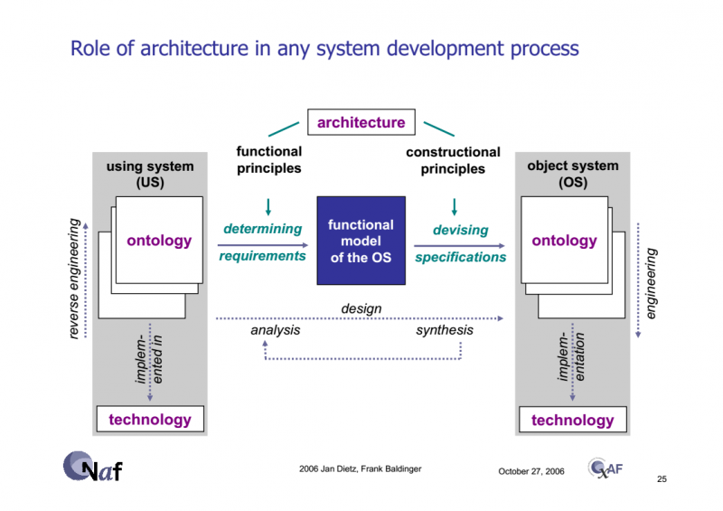

# Надсистема: её тоже нужно выявить!

Надсистема (иногда говорят using system, «использующая система») прежде всего должна проверяться на то, что целевая система является в момент эксплуатации (operation, работы, функционирования) неотъемлемой физической частью этой системы, то есть буквально входит в состав (composition) надсистемы. Увы, большинство ошибок происходят именно по невниманию к этому её признаку.

Системное разбиение (system breakdown structure) — это иерархия по отношению состава/сборки/часть-целое, а не по каким-то другим отношениям. На ошибку выделения надсистемы и целевой системы указывают обнаружение между ними отношений вызова подпрограммы, классификации и специализации, принадлежности в части имущества, назначения на роль, создания — ведь есть огромное количество других отношений, кроме предписанного для системного разбиения отношения состава (composition, is\_part\_of, включения как физической части).

Например, рассмотрим мужчину и женщину. Какая у них надсистема? Да, они как-то взаимодействуют, у них есть какая-то функциональность в составе надсистемы. Какой? В студенческих аудиториях эту загадку решают минут пять, а в более взрослых аудиториях инженеров-менеджеров на это тратят пятнадцать секунд: надсистемой тут является семья (студенты часто говорят «пара», подчёркивая возможность более слабой связи), а женщина и мужчина находятся друг у друга в операционном/эксплуатационном/рабочем окружении, это и есть «в семье».

Загадки выделения надсистемы обычно решаются путём выявления пропущенной, не названной, не выявленной системы в системном разбиении — и выделенной системе надо дать имя (часто имя типа такой системы уже есть, вроде той же «семьи», но просто сразу оно почему-то неочевидно).

Если над целевой системой ещё как-то думают, то надсистемы для неё (их может быть несколько!) обычно плохо различимы, и иногда для них нет устоявшихся названий. Эти «пропущенные» системы приходится выявлять (то есть описывать их роли, функции, границы к их окружению, делая ещё один шаг «наружу» от целевой системы) и как-то называть. Как называть? Точно так же, как любую другую систему, т.е. преимущественно (если нет какого-то явно устоявшегося исторического названия) по роли этой надсистемы в её надсистеме и выполняемой этой ролью функции/методу/сервису, т.е. по роли в над-надсистеме по отношению к целевой и функции/методу/сервису с её предметами сервиса в над-над-системе. Просто рассматриваем сначала роли от границы любой системы вверх по системным уровням, а роли подсистем — потом.

Признаком того, что какая-то часть целевой системы всё-таки относится не к самой целевой системе, а к надсистеме (а команде проекта обычно приходится иметь дело с обеими этими системами) является то, что команда не уполномочена как-то самостоятельно в одностороннем порядке изменять надсистему или даже её описания/модели (концепцию использования, концепцию системы, архитектуру надсистемы). А вот целевую систему и её описания команда изменять может, вполне полномочна делать это самостоятельно!

Снова и снова мы видим, что разница между системами разной природы пролегает не по их свойствам как физических объектов, а по каким-то договорённостям людей: системы систем (SoS, определяются через разную принадлежность автономных систем, входящих в систему систем), службы (принадлежность систем по отношению создания: выполнение операций какого-то метода над чужим предметом метода), и в данном случае — полномочия по изменению конструкции целевой системы и надсистемы, тоже отношения собственности. Даже если у нас служба (server), которая что-то красит, то мы полномочны менять слой краски, но вряд ли полномочны менять ту систему, которую красим и те системы, которые потом смотрят на краску (если это художественная окраска) или воздействуют на краску (если это защитная краска от какой-нибудь агрессивной химической среды).

И тут можно отметить, что ситуация уже не такая жёсткая как ещё десяток лет назад. Раньше не предполагалось, что команда как-то может повлиять на надсистему — она брала её в проект как данное, и должна была просто стыковать свою целевую систему с имеющимся системным окружением. Сегодня это не так: команда проекта не уполномочена изменять системное окружение непосредственно, своим волевым решением. Но команда проекта может влиять на то, чтобы в целях согласования характеристик целевой и надсистемы эта надсистема была всё-таки изменена — самостоятельно её владельцами, или командой проекта по согласованию с владельцами надсистемы. Для этого команда проекта (внутренние проектные роли) активно работает с внешними проектными ролями/стейкхолдерами, влияет на них, и это происходит долго, ибо «непрерывное всё», развитие системы продолжается долго, это не «изготовили и забыли», речь может идти о многолетней совместной эволюции целевой системы и её надсистемы, смене многих версий целевой системы и надсистемы. Всё-таки целевая система — это просто подсистема надсистемы как системы, инженерно они должны быть согласованы, и иногда легче поменять что-то в надсистеме, чем в целевой системе.

При выявлении надсистемы нужно помнить, что в зарубежных текстах иногда надсистему называют «использующей системой», using system.

Это потому, что в её составе инженер использует целевую систему. Это using относится к моменту создания, а не к моменту эксплуатации. Хотя часто так говорить можно и о моменте работы/функционирования системы, речь об окружении, которое «использует», «задействует», «эксплуатирует» систему. Но «часто» — это не всегда. Так, если оговориться, что «женщина использует мужчину», то дальше можно ошибочно по чисто лингвистическому рассуждению сказать, что женщина — это использующая система. И отождествить с надсистемой. То есть мужчина получается в составе женщины (все молекулы мужчины входят в число молекул женщины), что есть нелепость. Поэтому аккуратней со значениями слова «использование», их два:

* Использование целевой системы инженером надсистемы этой целевой системы как части конструкции надсистемы в design-time. Часы::«целевая система» используются дизайнером интерьеров в «интерьере квартиры»::надсистема (окружение часов). Ни о каком «сценарии использования» тут речи быть не может, ибо тут не время использования часов, они ещё не работают, это время проектирования — для них только проектируют среду, в которой они будут работать, их размещают в этой среде. «Использование дизайнером» это совершенно не «использование в ходе эксплуатации».
* Использование кем-то или чем-то в окружении в run-time/operations (нужно дальше разбираться, что это вообще за «использование»). Часы используются жильцом квартиры, чтобы поглядеть время (и вот там речь пойдёт о сценарии использования, use case).

При определении надсистемы важно, чтобы это был ближайший системный уровень (принцип почтальона, адрес должен быть точен — нельзя отсылать в слишком общий объект). Уровень надсистемы должен быть тот, на котором ожидается эмерджентность/системный эффект от работы целевой системы в её составе. «Я делаю цветок, который улучшит мир в целом» — это влажные мечты, профнепригодность. Вам надо найти надсистему, в которой цветок изменит состояние, даст какое-то свойство, которое было бы другим, если бы цветка не было. Вряд ли мир в целом станет другим, но если это ситуация «свидания» (можно её рассмотреть как «мероприятие», как надсистему для цветка), то цветок может улучшить настроение участников свидания. Поэтому если вы делаете цветы, которые будут использованы для свидания — так и скажите. Если для похорон — это, возможно, будут бумажные цветы. Или букетик цветов с чётным числом цветов. Не ошибитесь с надсистемой, она важна!

Верный способ выявить надсистему — это разобраться, с какими агентами (прежде всего, конечно, людьми) приходится разговаривать (помним, что разговариваем в лице этих людей с исполняемыми этими людьми ролями!), чтобы проект состоялся. Они обычно и есть владельцы надсистемы. Скажем, вы делаете «систему перевозки самолётов», используемую во время ремонтов самолёта. Целевая система — отремонтированный самолёт, который опять летает, перевозя грузы и пассажиров (эти грузы и пассажиры будут в надсистеме отремонтированного летающего самолёта в момент эксплуатации). Ваша «система перевозки самолётов» (плохо, что в названии слово «система», но хотя бы так, чем никак), но что для неё надсистема?! Надсистема — авиация страны, министерство промышленности? Нет, принцип почтальона говорит, что это «правда, но бесполезная правда», с равным успехом можно говорить и о «человечестве» как надсистеме, и даже о «всей вселенной»! В данном случае довольно просто выясняется, что «системой перевозки самолётов» интересуются главным образом люди из эксплуатационной службы одного из авиапредприятий.

«Эксплуатационная служба авиапредприятия»::организация (и даже не всё авиапредприятие!) и является надсистемой для системы перевозки самолётов, а целевая система там будет — самолёт, который надо в том числе перевозить. Система перевозки самолётов тут — один из создателей для самолёта, инструмент для эксплуатационной службы, служащий для выполнения работ сервиса перевозки. У команды эксплуатационной службы авиапредприятия (внешние проектные роли по отношению к системе перевозки самолётов) есть потребности — им нужно ремонтировать самолёты, которые не летают. И поэтому у них есть какая-то концепция использования наземной системы перевозки самолётов (заведомо не летающих). Всё, с этого момента (система перевозки самолётов как часть эксплуатационной службы авиапредприятия = система как часть надсистемы) можно начинать обсуждать проект по созданию системы перевозки самолётов. Ход на выявление владельцев надсистемы обычно крайне продуктивен: всё равно с этими владельцами нужно общаться, они важнейшие внешние роли в вашем проекте.

Ещё одна ошибка, когда надсистема и целевая система называются одинаково (мы уже говорили об этой ошибке, но её повторяют снова и снова, поэтому повторим ещё раз, другими словами). Разбиения типа «А состоит из А и Б» недопустимы, может быть только «А состоит из Б и В» — и скорее всего эта ошибка не в том, что само разбиение в жизни какое-то неправильное, а просто неправильно выбраны имена для систем в нём. Например, «ячейка состоит из ячейки и прокладки». Подробное обсуждение показывает, что речь идёт о ячейке, которая состоит из корпуса и прокладки. «Жилая комната состоит из комнаты и интерьера». Подробное обсуждение показывает, что жилая комната состоит из помещения (строительной части, коробки без отделки) и интерьера (в который входят даже приклеенные к стенам помещения обои).

А ещё системное мышление состоит в том, что вы должны разобраться с устройством надсистемы, чтобы понять роль в ней целевой системы. На картинке в этом подразделе, взятом из работ Jan Dietz, это обозначено как reverse engineering для using system (а ontology — это разные описания надсистемы, получаемые путём обратной инженерии, выявления устройства надсистемы). Целевую систему вы будете получать прямой инженерией (но то, что это «прямая инженерия» обычно не говорят, говорят просто «инженерия»): описания целевой системы вы будете выявлять в части использования в надсистеме (концепция использования) и разрабатывать (концепция системы), чтобы целевая система смогла выполнить ожидаемую от неё функцию в надсистеме.

Как делать все эти описания (методы разработки концепции использования и концепции системы), разбирается подробно в руководстве по системной инженерии. В нашем руководстве по системному моделированию только указывается, что **вам** **обязательно** **нужно понять** **роль** **целевой системы в надсистеме** **и выполняемую этой ролью функцию/метод/сервис, для этого нужно** **обязательно** **выявить надсистему и как-то разобраться в её устройстве, и зачем в этом устройстве нужна целевая система.**

Если вы не разбираетесь сначала с надсистемой, не разбираетесь с вышестоящим системным уровнем, и только после этого идёте разбираться с подсистемами, то у вас не системное мышление. **Ход проектного внимания от целевой системы на надсистему и разбирательство с ближним системным окружением** **сначала, а с частями целевой системы потом—** **это главное в системном мышлении.**