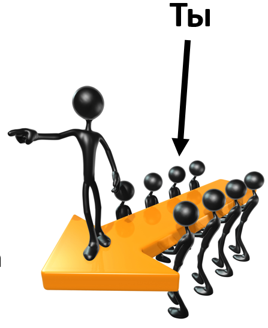

# Ты — член команды

Целевая система обычно выявляется для команды большого проекта и становится известной для координации работ внутри проекта. При этом, конечно, допускается, что большая компания может выпускать несколько видов продуктов и их не удастся представить одной целевой системой, это не слишком меняет ход рассуждений. Ошибка в том, что целевая система выявляется индивидуально в каждой маленькой команде, а уже эти маленькие команды пытаются связаться в один большой проект. Получается обычно так, что если одна команда заявила, что её целевая система «печень», другая — «кишки», третья — лекарство от болезней печени, то они потом будут пытаться объединиться в какой-то проект, но это будет трудно: печень окажется свиная, кишки — полевой мыши, лекарство будет от болезней лошадиной печени, а проект вдруг окажется лечением человека. Нет, тут делается всё-таки ход на то, что целевой системой будет здоровый человек, на входе — человек с больной человеческой печенью и дальше будет выстраиваться граф создателей, исходя из этой целевой системы. Ветеринарные подразделения будут или перепрофилированы, или выкинуты из проекта за ненадобностью — сколько бы они ни настаивали на том, что они системно выявили свои целевые системы. Свои системы — это не целевые, считать свои системы целевыми обычно в проекте могут не слишком много людей, у остальных это — эгоизм, попытка перетянуть одеяло на себя.

Напомним: целевая система вводится не как что-то «объективное», а для того, чтобы скоординировать работу в сложном графе создателей, чтобы было понятно, чем там все эти люди, AI, организации занимаются, что там должно появиться в результате проекта.

**Системное мышление** **будет** **координировать** **в проекте** **работы** **самых разных агентов в самых разных ролях по самым разным методам, а не просто** **давать** **мыслительное превосходство одних** **агентов** **над другими. Это не боевое/спортивное мышление** **соревнования и победы** **(хотя выигрывать в конкуренции оно помогает),** **но** **мышление** **договорённостей и** **сотрудничества.**

Вы как «член команды»/«внутренняя проектная роль» совсем необязательно заняты работой над целевой системой в её целостности. Вы можете быть заняты разработкой подсистемы для целевой системы, или даже подсистемой подсистемы, или даже созданием какого-то создателя (инструмент или даже оргзвено с людьми, AI и инструментами) в графе создателей — но это будет просто ваше личное мнение, что вы занимаетесь «собственной целевой системой», вы можете оставить это мнение при себе.

Вы занимаетесь «вашей системой»: это, конечно, по типу тоже система, но просто не целевая система, а важная для вас и вашей команды. В рамках проекта, в общении с вашей командой вы будете обсуждать вверенную вам подсистему или даже подсистему подсистемы, или даже создателя какой-то подсистемы в составе целевой, или даже клиентуру как систему. Вы вполне можете называть такую вашу систему «моя система», это же никого не смутит, это чистая правда. Но не надо требовать от команды признания вашей системы (система, которая только для вас engineered system, маленький винтик в большом аппарате, или пять подпрограмм в огромном программном комплексе, или даже вся фирма, которая занята выпуском целевого продукта/изделия или оказанием сервиса для чужих целевых систем) полноценной целевой системой для всех. Нет, вы должны делать три вещи:

* Уверенно называть целевую систему. Если вы не понимаете, что там целевая система, то что бы вы ни принесли в проект, чем бы ни занимались — это может оказаться ненужным. Поэтому сначала давайте поймём, что все вместе делаем в полном проекте по созданию целевой системы, а только потом будем разбираться с вашими проблемами вашего мини-проекта.
* Уверенно называть вашу систему, и тут всё то же самое, что для целевой, только речь идёт о вас или о вашей маленькой команде маленького проекта в составе большого проекта.
* Не забыть о том, что ваш маленький проект нужен только для того, чтобы была успешна целевая система. Поэтому потрудитесь показать причинно-следственную связь с успехом целевой системы того, что вы делаете и чем заняты.

Так, у топ-менеджера может быть три проекта: А, Б, В. И он неделю убил на разбирательство с проектом Б. На это время он называет «своей системой» проект Б. Проверяем:

* Уверенно ли он называет целевую систему, для которой работает в конечном итоге проект Б? Или он исторически занимается проектом Б, который уже вообще никому не нужен?
* Что там его система? «Проект Б» — это поведение рабочей группы проекта? Тогда проект не система, с самого начала ошибка. Меняем понимание: система этого менеджера — организация: команда проекта Б, «рабочая группа проекта». Это уже лучше, но если это топ-менеджер, то лучше бы он своей системой для проекта считал бы продукт/изделие для проекта Б, а если речь идёт о сервисе, то его система — это та система, состояние которой меняет своим сервисом команда проекта Б. Нацеленность должна быть сначала на результат, а не на создателя, а на создателя — после понимания ожидаемого результата! Отлично, вот это уже похоже на системное мышление.
* И вот тут третий пункт: надо показать причинно-следственную связь того, что вот прямо сейчас занятие нашего менеджера проектом Б как-то поможет выпуску целевой системы. Или качество целевой системы будет лучше, или цена станет дешевле, или снимутся возражения каких-то внешних ролей для всего проекта (а не системы проекта Б), или скорость выпуска целевой системы вырастет? Для этого нужно понять, где в графе создателей находится система этого менеджера и выдать причинно-следственную связь, рациональное обоснование решения. Если окажется, что ничего в целевой системе не поменяется, то менеджер выделил время на ерунду, безделицу, хобби. Он должен обосновать, почему не работал над А или В, а работал над Б. Для этого можно обратиться к обоснованию со стороны теории ограничений (операционный менеджмент, вы в предыдущих руководствах программы рабочего развития знакомились с современной версией этой теории, TameFlow[^r6-1]). Тревожный знак тут будет, что менеджер, занимаясь Б, подтвердит, что никакого немедленного эффекта его действия на целевую систему не дадут, а он делает «заделы». «Заделы» — это вред, это омертвление капитала, это work in progress, и операционный менеджмент с этими «заделами» борется, это привнесение рисков в работу. Вот эта **связь «нашей системы» с «целевой системой» по цепочкам отношений** **создания, развития (в том числе проектирования,** **изготовления, изменения состояния и т.д.)** **и часть-целое—** **она должна** **предъявляться, а выделение времени на занятия «нашей системой» (одной из всех возможных систем проекта)—** **обосновываться.Почему занимались нашей системой, а не какой-то другой, не помогали соседям, например?** **Если связь не предъявляется,** **а потраченное на нашу систему время не обосновывается,** **то вы не можете сказать, пользу приносит** **эта** **работа, или вред.**

Вы можете быть также заняты разработкой системы создания (например, реализовывать проект развития какого-то оргзвена: парикмахерской), то есть непосредственно сами не будете заниматься целевой системой. Но это не значит, что вы будете называть парикмахерскую целевой системой во всём проекте. Во всём проекте вам нужно создавать причёски, а в вашем проекте — создать парикмахерскую. Не нужно путать эти два проекта, считать их одним. Вам нельзя считать, что целевая система для вас это та, которая для всех остальных будет системой создания. Нет, ваша целевая система та же, что у всех, а именно, которая изменяется работами систем создания, в том числе теми системами создания, которые делаете вы в графе создателей, то есть вашими системами. Вы в проекте создания причёсок, вот и объясняйте, как ваши действия с парикмахерской что-то дают для создания причёсок. Например, увеличивают выпуск причёсок в уже действующей парикмахерской, или приближают выпуск причёсок в ещё не введённой в строй парикмахерской, или дают возможность выпуска более выгодного типа причёсок, или удешевляют процесс выпуска причёски, и т.д. — везде тут важно, что речь идёт о причёске, и если причёски в рассуждениях нет, то к вашей работе по улучшению парикмахерской сразу будут вопросы.

Если организуете авиазавод, то целевая система — самолёт, если консультируете организаторов авиазавода, то лучше бы вам считать целевой системой самолёт, чем этих организаторов! Самолёт, который летает (в момент эксплуатации) — вот целевая система, поэтому расскажите, как вы добиваетесь того, чтобы самолёт летал, и летал хорошо, и был дешёвым. Если консультируете организаторов завода — как ваши консультации помогут самолётам? Если никак, то и без ваших консультаций всё останется как было — разве что вы консультируете не организаторов авиазавода, а, например, владельцев каких-то пакетов акций, которые они хотят перераспределить. Но тогда сам авиазавод тут не при чём, речь идёт о консультировании по поводу инвестпроекта, и нужно честно назвать вещи своими именами — эта честность поможет всем.

Как в картах, каждый человек не строит карту с полярными координатами вокруг себя. Договорились в масштабах планеты о Северном полюсе как начале координат — и все на планете пользуются единой системой отсчёта, полюс никуда не скачет по прихоти какого-то одного человека или даже одной команды путешественников, он общий для всех. В системном подходе рекомендуется именно такой подход: договориться об общей целевой системе для всей большой команды проекта. И всем агентам договариваться о совместной деятельности, показывая причинно-следственные связи их работы с успешностью целевой системы.

**Команда проекта—** **это совсем необязательно группа проекта под твоим руководством! Скорее всего,** **«ты»** **в этом** **«мы»** **занимаешь** **пару-тройкуролевыхпозиций, делаешь часть большого дела, не удерживаешь в сознании целую систему, а занимаешься либо какой-то отдельной практикой/культурой/видом труда** **(теплотехникой, менеджментом, программированием, хореографией), либо какой-то частью системы, либо клиентурой системы.** **Если у тебя часть** **целой** **системы, или система в графе создателей—** **это будет** **«наша система»** **для маленькой команды** **или** **«моя система»** **для тебя лично.**

По поводу неё вполне можно и нужно развернуть полное системное мышление, вот прямо как про целевую систему, разве что не надо считать её целевой и называть целевой. Первый шаг тут — найти настоящую целевую систему всего проекта (как обычно в системном мышлении: смотреть не в детали, внутрь, а от границ — наружу, в данном случае из границ «нашего проекта» наружу, в большой проект создания целевой системы). Целевую систему надо выявить, чтобы определить относительно неё место «нашей системы» — и дальше договориться со всеми по поводу нашей системы (квалификация «практик» в организационном развитии) и даже договорить всех (квалификация «мастер» в организационном развитии).

Нужно тщательно выявить ту целевую систему, с выбором которой будут согласны все участники проекта, синхронизироваться в действиях по отношению к которой будут все, и дальше разбираться уже с той системой, которая к тебе ближе всего (ну, или с той системой, которая для проекта сейчас нужней всего — если ты топ-менеджер, и ещё обосновать, почему ты занимаешься какой-то выбранной одной системой, а не соседними).

Большая ошибка — это считать себя объективным и нейтральным системным инженером, системным менеджером, эдаким системным рыцарем, который весь в белом и с нимбом над головой ведёт команду к успеху проекта. Вовсе нет, всё не так. **Системное мышление чаще всего нужно именно для того, чтобы поднять** **свою** **осознанность:** **позволить** **осознать, какие у тебя роли в** **большом** **проекте по созданию** **и развитиюцелевой** **системы, какими методами ты работаешь с какими предметами этих методов, какое мастерство тебе нужно и инструменты, какие** **твои** **ролевые** **интересы,** **какое твоё место в** **большой** **команде** **и полномочия по распоряжению ресурсами** **большой** **команды,** **какой подсистемой целевой системы** **твоей** **большой** **команды** **или подсистемой одного из многочисленных создателейв** **графесоздателейцелевой системы** **ты занимаешься.**

Тут нет никаких рецептов, всё определяется текущей ситуацией, никаких алгоритмов на эту тему нет — но есть набор объектов мета-мета-модели, которые задают список важных объектов проекта, о которых вам надо подумать и дальше договориться в масштабах как большой команды всего проекта по созданию целевой системы (например, механических часов), так и вашего частного проекта (например, проекта создания и развития стрелок для механических часов).

Команда проекта может быть и на пару тысяч человек сотрудников предприятия, а может состоять и из пары человек, и даже иногда из одного человека. Хотя в случае одного человека думать системно — это может казаться перебором, но поглядите на множество внешних проектных ролей, поглядите на множество создателей::системы (например, оргсистемы-создатели: ваши контракторы-подрядчики, поставщики инструментов и оборудования, провайдеры всевозможных сервисов), и вы не будете считать, что вы такой уж одинокий в проекте якобы «на одного», даже если вы один будете исполнять все многочисленные инженерные и менеджерские внутренние проектные роли, выполнять все нужные для успеха проекта методы работы. А с учётом внешних проектных ролей мышление в проекте всё равно будет коллективное, а не «личное», с внешними проектными ролями придётся договариваться и ещё договаривать их между собой.

Разделение на внешние проектные роли и команду может быть даже более дробным: внутренние проектные роли *предприятия* (юрлица) как «большой команды» и команда оргзвена (отдельного проекта или подразделения внутри *предприятия*) как «малой команды». Внутренние проектные роли предприятия как большой команды (например, финансисты, юристы, операционные менеджеры предприятия) заинтересованы в успехе целевой системы, но активно преследуют совсем иные интересы, нежели малая команда проекта для её «нашей системы». Если у вас в команде появятся лишние $1000 в проекте — вы куда их потратите? Это непростой вопрос:

* Улучшите на эту сумму целевую систему, не увеличивая её стоимости — т.е. подарите клиенту?
* Улучшите ресурсы команды — наймёте более квалифицированных людей, закупите более дорогое оборудование?
* Отдадите на дивиденды владельцам предприятия? Потратите на нужды «малой команды»?

Интересы всех ролей разные, причём эти интересы могут быть к разным системам — и действия по преследованию этих интересов поэтому оказываются разными, часто очень изобретательными, неожиданными для окружающих. Лучше бы вам всем в проекте договориться перед тем, как эти действия начнутся, или начнётся активная реализация самых неожиданных стратегий самых неожиданных агентов. Но для этого надо понимать, что «договориться в проекте» — это договориться по поводу улучшений в отношении выпуска целевой системы. Если ваша связь с целевой системой непонятна, то вы чужак, доверия к вам нет, договорённости с вами имеют слабую силу — и будут немедленно нарушены, если выяснится, что для успеха проекта в целом (успешности целевой системы) надо заниматься чем-нибудь другим.

Обычно много желающих сделать заведомо провальный проект, ибо исполнители ролей в этом проекте хотят получить зарплату, а результат самого проекта их мало волнует. Актёры с удовольствием сыграют свои роли в пустом зале: то, что за этот спектакль театр не получит деньги, их мало волнует (дирекция всё равно заплатит), а то, что зрителей нет, так ещё лучше: можно халтурить в исполнении ролей! То же происходит с заведомо провальными проектами. **Системное мышление помогает осознать, что проект** **в части успешности целевой системы** **провальный, а затем настаивает на этическом рассмотрении ситуации.** **«Наш проект» может быть не провальный! Но этично его не делать, если он не ведёт к успеху целевой системы.**

Нужно коллективно/группой договориться, что считать целевой системой, какие цели преследует проект, в чём состоят возможности проекта. И ещё нужно понять, какой именно коллектив/группа договаривается о том, чтобы создать и развивать целевую систему, это ведь тоже часто сходу непонятно. Но сначала нужно таки разобраться, что там за целевая система, а потом уже с «мы»: если непонятно, что мы делаем, то непонятно, кто вовлечён в это делание, кто такие «мы», кто с каким мастерством (и даже с каким уровнем мастерства, это ведь тоже важно) в проекте потребуется, а кто просто пришёл покушать/попилить ресурсы, а не вести целевую систему к успеху, и не вносит никакого вклада, или даже приносит вред.

Каждые пять минут менять то, что ты/вы называешь/называете целевой системой — это неправильно. **Релятивизм** (когда всё на свете считается субъективным и относительным, зыбким и неопределённым — заведомо отсутствует точка отсчёта, любой ученик пятого класса уважается в его мнении по поводу строительства атомной электростанции, любой дикарь уважается в его выборе целевой системы, да ещё и каждые пять минут все они меняют своё мнение, ни с кем не договариваясь) в мышлении не поможет. Договорённость по поводу целевой системы должна достигаться из каких-то принципов, а не произвольно, и на достаточно долгое время — желательно не менять целевую систему во время всего проекта, хотя понимание того, что это за целевая система, может уточняться постоянно. Конечно, в бизнесе рассматривается и вариант pivot/вираж, когда стартап меняет целевую систему. Но не обольщайтесь: во время этого «пивота» все понимают, какой новой системой они будут заниматься. И не все «мы» в этих проектах переживают вираж.

[^r6-1]: <https://tameflow.com/>
